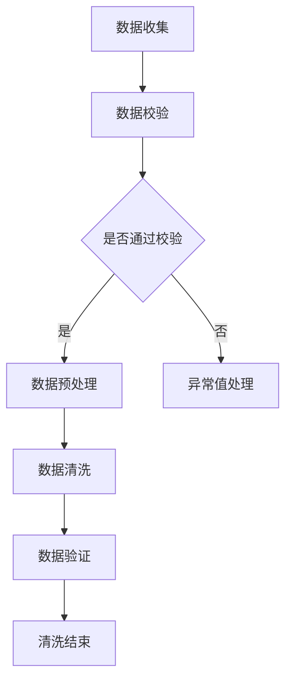
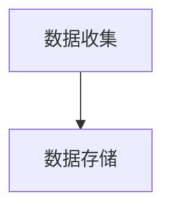
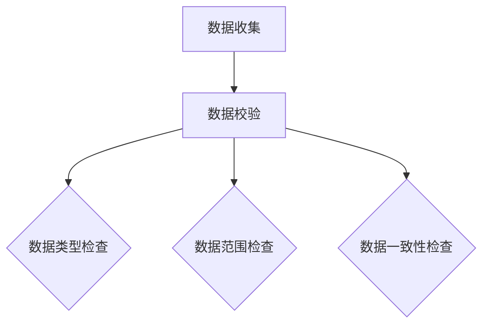
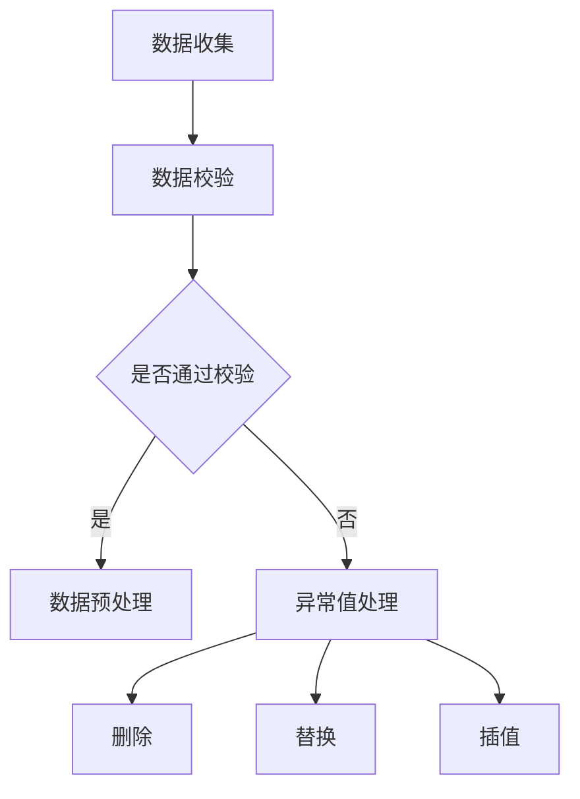
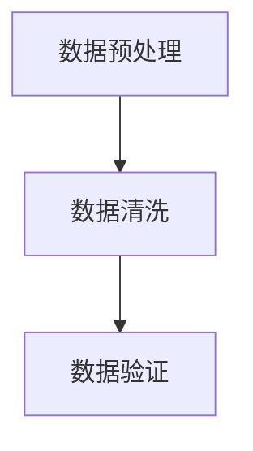
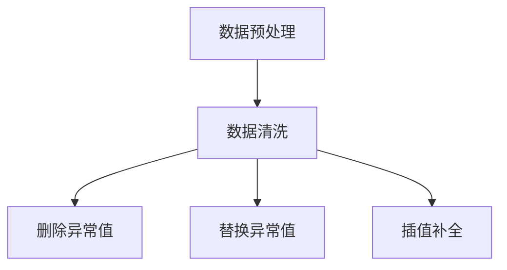
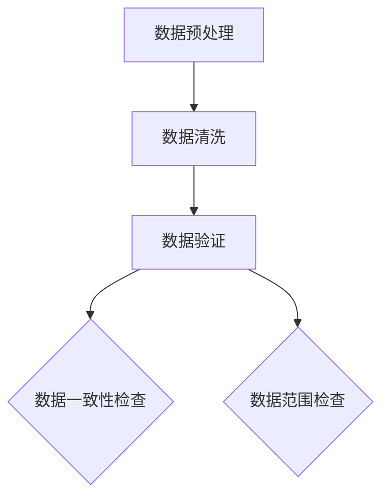

                 

# 文章标题：评测数据的质量控制与清洗流程

## 关键词

- 评测数据
- 质量控制
- 数据清洗
- 数据预处理
- 异常值处理
- Mermaid流程图
- 伪代码
- 项目实战

## 摘要

本文旨在探讨评测数据的质量控制与清洗流程，旨在提高数据质量，确保数据的有效性和准确性。首先，我们将介绍评测数据的重要性以及为什么需要进行质量控制与清洗。随后，我们将详细讨论核心概念，包括评测数据、质量控制、清洗流程等，并使用Mermaid流程图和伪代码来展示这些概念之间的关系与实现。文章将分为五个主要部分：引言、核心概念、质量控制方法、清洗流程、案例研究，并最终进行总结与展望。通过本篇文章，读者将能够了解并掌握评测数据质量控制与清洗的各个环节，为实际项目中的数据质量提升提供指导。

---

## 引言

在当今数据驱动的社会中，数据已经成为企业、组织和个人决策过程中不可或缺的一部分。尤其是在人工智能和机器学习领域，高质量的数据是模型训练和预测准确性的基石。评测数据，作为模型训练和性能评估的重要资源，其质量直接影响着最终应用的效果。因此，对评测数据的质量控制与清洗显得尤为重要。

### 为什么需要质量控制与清洗流程

1. **提高模型准确性**：高质量的数据能够减少噪声和异常值，从而提高模型对真实世界的拟合能力。
2. **节约资源**：清洗后的数据能够减少后续处理的时间和计算资源。
3. **避免错误决策**：准确的数据可以避免基于错误信息的决策，从而降低风险。

### 书籍结构概述

本文将分为以下五个主要部分：

1. **核心概念**：介绍评测数据、质量控制、清洗流程等核心概念。
2. **质量控制方法**：详细讨论数据收集、校验、异常值处理等质量控制方法，使用伪代码和Mermaid流程图进行说明。
3. **清洗流程**：阐述数据预处理、数据清洗、数据验证等清洗流程，同样使用伪代码和Mermaid流程图进行阐述。
4. **案例研究**：通过实际案例，展示质量控制与清洗流程的应用和效果。
5. **总结与展望**：总结全文主要内容，并对未来发展方向进行展望。

---

## 核心概念

在深入探讨评测数据的质量控制与清洗流程之前，我们首先需要明确几个核心概念：评测数据、质量控制、清洗流程。

### 评测数据

评测数据是指用于评估模型性能或进行数据分析的数据集。这些数据可以是结构化的（如数据库中的表格数据），也可以是非结构化的（如图像、文本、音频等）。在机器学习和人工智能领域，评测数据通常用于模型训练、验证和测试。

### 质量控制

质量控制是指确保数据准确、完整、一致和可靠的一系列过程。质量控制的关键步骤包括数据收集、校验、异常值处理等。质量控制的目标是识别并修复数据中的错误和异常，从而提高数据质量。

### 清洗流程

清洗流程是指对数据进行处理，以消除错误、不一致性、噪声等的过程。清洗流程通常包括数据预处理、数据清洗、数据验证等步骤。数据预处理涉及数据的格式化、标准化等操作；数据清洗则涉及错误和异常值的处理；数据验证则确保清洗后的数据符合预期。

### Mermaid流程图：质量控制与清洗流程的整体架构



### 伪代码：核心概念实现

```python
# 数据收集
def collect_data():
    # 收集数据的具体代码实现
    pass

# 数据校验
def validate_data(data):
    # 校验数据完整性和一致性的代码实现
    pass

# 异常值处理
def handle_anomalies(data):
    # 处理异常值的代码实现
    pass

# 数据预处理
def preprocess_data(data):
    # 数据格式化和标准化的代码实现
    pass

# 数据清洗
def clean_data(data):
    # 清洗数据的代码实现
    pass

# 数据验证
def verify_data(data):
    # 验证清洗后数据的代码实现
    pass
```

---

## 质量控制方法

在了解了核心概念之后，我们将详细讨论质量控制的方法，这些方法包括数据收集、校验、异常值处理等。通过使用伪代码和Mermaid流程图，我们将更好地理解这些方法的具体实现。

### 数据收集

数据收集是质量控制的第一步。这一步的目标是获取高质量的数据。数据收集的方法可以包括在线爬取、数据库查询、传感器收集等。



### 数据校验

数据校验是确保数据准确性和完整性的过程。常见的校验方法包括数据类型检查、数据范围检查、数据一致性检查等。



### 异常值处理

异常值处理是识别并处理数据中的异常值。常见的异常值处理方法包括删除、替换、插值等。



### 伪代码：质量控制方法实现

```python
# 数据收集
def collect_data():
    data = []
    # 收集数据的具体代码实现
    return data

# 数据校验
def validate_data(data):
    errors = []
    # 校验数据完整性和一致性的代码实现
    return errors

# 异常值处理
def handle_anomalies(data):
    anomalies = []
    # 识别异常值的代码实现
    for anomaly in anomalies:
        # 处理异常值的代码实现
    return data
```

---

## 清洗流程

清洗流程是数据预处理、数据清洗、数据验证等一系列步骤的组合。以下我们将详细阐述这些步骤。

### 数据预处理

数据预处理是清洗流程的第一步，主要涉及数据的格式化、标准化等操作。



### 数据清洗

数据清洗是清洗流程的核心步骤，涉及错误和异常值的处理。



### 数据验证

数据验证是确保清洗后数据的质量和准确性。常见的验证方法包括数据一致性检查、数据范围检查等。



### 伪代码：清洗流程实现

```python
# 数据预处理
def preprocess_data(data):
    # 数据格式化和标准化的代码实现
    return processed_data

# 数据清洗
def clean_data(data):
    # 清洗数据的代码实现
    return cleaned_data

# 数据验证
def verify_data(data):
    # 验证清洗后数据的代码实现
    return is_valid
```

---

## 案例研究

为了更好地理解质量控制与清洗流程的实际应用，我们将在本部分提供两个实际案例。

### 案例一：电商用户评价数据清洗

#### 数据来源

我们从某电商平台上收集了10000条用户评价数据，这些数据包括用户ID、评价内容、评分和时间戳。

#### 质量控制过程

1. **数据收集**：使用网络爬虫从电商平台上获取用户评价数据。
2. **数据校验**：检查数据的完整性，如用户ID、评价内容和评分是否存在缺失。
3. **异常值处理**：删除包含非数字评分的数据，处理时间戳中的异常值。

#### 清洗流程

1. **数据预处理**：将评价内容转换为文本格式，去除HTML标签。
2. **数据清洗**：去除重复评价，处理文本中的停用词。
3. **数据验证**：检查清洗后数据的准确性和一致性。

### 案例二：社交媒体数据清洗

#### 数据来源

我们从某社交媒体平台上收集了10000条用户发帖数据，这些数据包括用户ID、发帖内容、发帖时间和地理位置。

#### 质量控制过程

1. **数据收集**：使用API从社交媒体平台上获取用户发帖数据。
2. **数据校验**：检查数据的完整性和一致性，如用户ID、发帖时间和地理位置是否存在错误。
3. **异常值处理**：删除包含非法地理位置的数据，处理发帖时间中的异常值。

#### 清洗流程

1. **数据预处理**：将发帖内容转换为文本格式，去除HTML标签。
2. **数据清洗**：去除重复发帖，处理文本中的停用词。
3. **数据验证**：检查清洗后数据的准确性和一致性。

---

## 总结与展望

本文详细介绍了评测数据的质量控制与清洗流程，从核心概念到具体方法，再到实际案例，全面探讨了如何确保数据质量。通过本文的讨论，我们了解到：

1. **评测数据的重要性**：高质量的数据是模型训练和预测准确性的基石。
2. **质量控制与清洗流程的必要性**：质量控制与清洗流程能够提高数据质量，减少模型误差，提高决策准确性。
3. **实际应用**：通过电商用户评价数据清洗和社交媒体数据清洗的实际案例，我们看到了质量控制与清洗流程在实际项目中的应用效果。

### 未来发展方向

1. **自动化清洗工具**：开发更智能、自动化的清洗工具，减少人工干预。
2. **实时清洗**：实现实时数据清洗，提高数据处理效率。
3. **跨领域应用**：将质量控制与清洗流程应用于更多领域，如医疗、金融等。

### 对读者的建议

1. **实践**：通过实际项目，深入理解和应用质量控制与清洗流程。
2. **持续学习**：跟随技术发展，不断更新知识和技能。
3. **分享经验**：将自己在数据清洗和质量控制方面的经验和教训分享给他人。

---

## 作者信息

作者：AI天才研究院/AI Genius Institute & 禅与计算机程序设计艺术 /Zen And The Art of Computer Programming

---

## 附录

### 拓展阅读

- 《数据清洗技术》
- 《大数据质量》
- 《数据质量管理》

### 注意事项

- 确保数据收集过程中的合法性。
- 在进行数据清洗时，要充分考虑数据的隐私保护。
- 定期对数据进行质量检查，确保数据质量持续提升。

### 小结

本文系统地介绍了评测数据的质量控制与清洗流程，通过详细的概念解释、方法讨论和实际案例展示，帮助读者理解并掌握这一关键技能。希望读者能够将所学应用于实际项目中，提升数据质量和模型性能。

