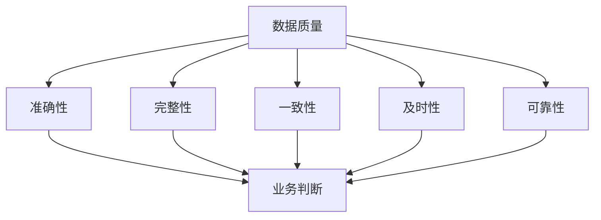
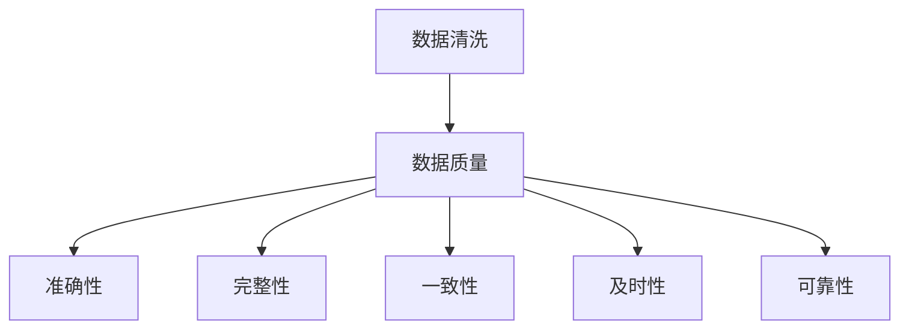
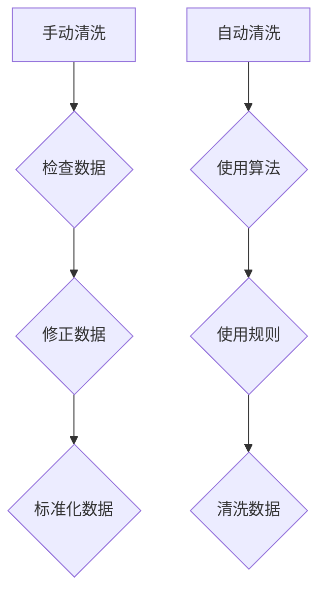
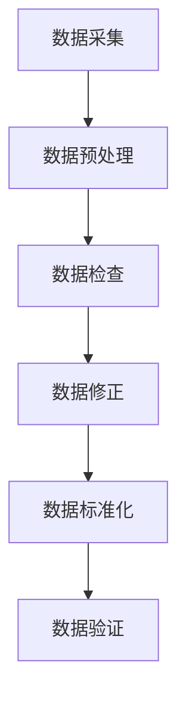
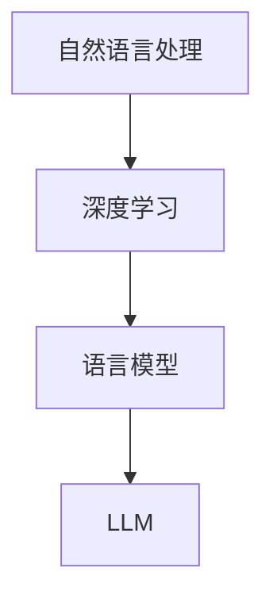

                 


### 文章标题
《评测数据的质量控制：LLM辅助的数据清洗机制》

### 关键词
数据质量控制，数据清洗，大型语言模型（LLM），质量控制方法，数据质量影响因素，数据处理流程，数据质量目标

### 摘要
本文深入探讨了评测数据质量的重要性，以及如何通过大型语言模型（LLM）辅助实现数据清洗机制。文章首先介绍了数据质量的基本概念和影响因素，然后详细阐述了传统的数据清洗方法和流程。在此基础上，文章重点介绍了如何利用LLM的强大能力来优化数据清洗过程，包括LLM的核心概念、工作原理以及具体应用场景。最后，文章通过实际案例分析和项目实战，展示了LLM辅助数据清洗的实效性和优势，并提出了最佳实践建议。

## 第一部分：数据质量控制基础

### 第1章：数据质量控制概述

#### 1.1 数据质量的重要性

数据质量是现代数据驱动的企业决策过程中至关重要的一环。数据质量的好坏直接影响到数据分析的准确性和可靠性，进而影响企业的运营决策和战略规划。高质量的数据能够提高决策效率，减少错误决策带来的风险，而低质量的数据则可能导致错误的业务判断和决策，甚至造成巨大的经济损失。

**背景介绍**

在过去的几十年里，随着信息技术的快速发展，企业积累了大量的数据资源。然而，随着数据的爆发性增长，数据质量问题也逐渐凸显出来。数据质量问题包括数据的准确性、完整性、一致性、及时性和可靠性等多个方面。

**核心概念与联系**

- **准确性**：数据是否真实反映了实际业务情况。
- **完整性**：数据是否包含所有必要的字段和记录。
- **一致性**：数据在不同系统或数据库中是否保持一致。
- **及时性**：数据是否能够及时更新，以满足业务需求。
- **可靠性**：数据是否可靠，不会因为错误处理或丢失而导致错误。

以下是一个Mermaid流程图，展示了数据质量的核心概念及其相互关系：



#### 1.2 数据质量的影响因素

数据质量的影响因素是多方面的，包括数据来源、数据处理流程和数据存储等方面。

**数据来源**

- **内部数据**：来自企业内部业务系统，如ERP、CRM等。
- **外部数据**：来自公共数据源、第三方数据提供商或社交媒体等。

**数据处理流程**

- **数据采集**：数据从源头采集到系统中。
- **数据传输**：数据在系统中传输和交换。
- **数据存储**：数据在数据库或数据仓库中进行存储和管理。
- **数据清洗**：对数据进行清理、去重、纠正等操作。

**数据存储**

- **关系数据库**：适用于结构化数据。
- **非关系数据库**：适用于半结构化或非结构化数据。

**核心算法原理讲解**

数据质量的影响因素可以通过以下伪代码进行概括：

```python
def evaluate_data_quality(data_source, processing流程, storage_solution):
    accuracy = check_accuracy(data_source)
    completeness = check_completeness(processing流程)
    consistency = check_consistency(storage_solution)
    timeliness = check_timeliness(processing流程)
    reliability = check_reliability(storage_solution)
    return {
        'accuracy': accuracy,
        'completeness': completeness,
        'consistency': consistency,
        'timeliness': timeliness,
        'reliability': reliability
    }
```

**数学模型和公式**

在评估数据质量时，可以采用以下公式来量化数据质量的各个方面：

$$
\text{Data Quality} = f(\text{Accuracy}, \text{Completeness}, \text{Consistency}, \text{Timeliness}, \text{Reliability})
$$

其中，$f$ 是一个综合评估函数，用于计算数据质量的总得分。

**详细讲解与举例说明**

假设我们有一个电子商务网站，需要评估其用户数据的质量。以下是一个实际案例的详细讲解：

- **准确性**：我们检查用户数据的准确性，如姓名、地址、电话等是否与用户实际信息一致。如果发现错误，需要进行修正。
- **完整性**：我们检查用户数据的完整性，如是否所有必要的字段都有数据。如果缺失，需要进行补全。
- **一致性**：我们检查用户数据在不同系统或数据库中是否保持一致。例如，用户的地址在订单系统和客户关系管理系统中是否相同。
- **及时性**：我们检查用户数据的更新是否及时。例如，用户的联系方式是否在最近一次购买后更新。
- **可靠性**：我们检查用户数据的可靠性，如数据是否受到恶意攻击或篡改。

通过以上评估，我们可以得到用户数据质量的得分，从而为后续的数据分析提供高质量的保证。

#### 1.3 数据质量控制的目标

数据质量控制的目标主要包括以下几个方面：

- **提高数据的准确性**：确保数据真实反映实际业务情况，减少错误数据带来的影响。
- **提高数据的完整性**：确保数据包含所有必要的字段和记录，避免数据缺失。
- **提高数据的一致性**：确保数据在不同系统或数据库中保持一致，避免数据冲突。
- **提高数据的及时性**：确保数据能够及时更新，满足业务需求。
- **提高数据的可靠性**：确保数据在存储和处理过程中不会受到恶意攻击或篡改。

**小结**

本章介绍了数据质量的重要性、影响因素和目标。通过了解数据质量的核心概念和评估方法，我们可以更好地管理和控制数据质量，为企业的数据分析提供高质量的数据基础。

## 第二部分：数据质量控制方法

### 第2章：传统的数据清洗方法

#### 2.1 数据清洗的基本概念

数据清洗（Data Cleaning）是指通过一系列技术手段，对原始数据进行检查、修正、标准化等处理，以提高数据的准确性、完整性和一致性。数据清洗是数据质量管理的重要组成部分，是确保数据质量的关键步骤。

**核心概念与联系**

- **数据清洗**：对原始数据进行检查、修正、标准化等处理。
- **数据质量**：数据的准确性、完整性、一致性、及时性和可靠性。

以下是一个Mermaid流程图，展示了数据清洗的核心概念及其相互关系：



#### 2.2 数据清洗的技术

数据清洗的技术主要包括手动清洗和自动清洗。

**手动清洗**

手动清洗是指通过人工方式对数据进行检查、修正和标准化。这种方法适用于数据量较小或结构简单的情况。

- **优点**：操作灵活，能够处理复杂的问题。
- **缺点**：效率低下，难以处理大量数据。

**自动清洗**

自动清洗是指通过自动化工具或算法对数据进行清洗。这种方法适用于数据量大、结构复杂的情况。

- **优点**：效率高，能够处理大量数据。
- **缺点**：可能无法处理复杂的问题，需要依赖算法和规则。

以下是一个Mermaid流程图，展示了手动清洗和自动清洗的流程：



#### 2.3 数据清洗的流程

数据清洗的流程通常包括以下几个步骤：

1. **数据采集**：从不同的数据源采集数据。
2. **数据预处理**：对数据进行初步处理，如去重、去除空白等。
3. **数据检查**：检查数据中的错误、异常和不一致性。
4. **数据修正**：对错误数据进行修正。
5. **数据标准化**：对数据进行标准化处理，如格式统一、数据类型转换等。
6. **数据验证**：验证数据清洗的效果，确保数据质量。

以下是一个Mermaid流程图，展示了数据清洗的流程：



**项目实战：数据清洗实战案例**

以下是一个实际的数据清洗案例，我们将对一组用户数据进行清洗。

1. **数据采集**：从网站日志中采集用户数据，包括用户ID、姓名、邮箱、电话、购买记录等。
2. **数据预处理**：去除重复记录，去除空白记录，格式化数据。
3. **数据检查**：检查数据中的错误，如姓名中的字符错误、电话号码格式错误等。
4. **数据修正**：对错误数据进行修正，如将错误的字符替换为正确的字符，将错误的电话号码格式转换为正确的格式。
5. **数据标准化**：统一数据格式，如将电话号码格式统一为国际标准格式。
6. **数据验证**：检查数据清洗的效果，确保数据质量。

通过以上步骤，我们得到了高质量的用户数据，为后续的数据分析提供了基础。

**小结**

本章介绍了数据清洗的基本概念、技术和流程。通过了解这些内容，我们可以更好地理解和应用数据清洗技术，提高数据质量，为数据分析提供可靠的数据基础。

## 第三部分：LLM辅助的数据清洗机制

### 第3章：大型语言模型（LLM）的核心概念和工作原理

#### 3.1 大型语言模型（LLM）概述

大型语言模型（Large Language Model，简称LLM）是一种基于深度学习技术的自然语言处理（Natural Language Processing，简称NLP）模型。它通过学习海量文本数据，能够理解和生成自然语言。LLM在近年来取得了显著的进展，尤其在语言理解、文本生成、机器翻译等方面展现了强大的能力。

**核心概念与联系**

- **自然语言处理（NLP）**：计算机与人类语言交互的技术。
- **深度学习**：基于神经网络的学习方法，能够自动从数据中学习特征和模式。
- **语言模型**：用于预测下一个单词或字符的概率分布的模型。

以下是一个Mermaid流程图，展示了LLM的核心概念及其相互关系：



#### 3.2 LLM的工作原理

LLM通常基于Transformer架构，这是一种能够处理长序列的神经网络模型。Transformer模型通过自注意力机制（Self-Attention）对输入序列进行建模，能够捕捉序列中长距离的依赖关系。

**核心算法原理讲解**

以下是一个Transformer模型的基本工作原理的伪代码：

```python
def transformer_model(input_sequence):
    # 输入序列编码
    encoded_sequence = encode_sequence(input_sequence)
    
    # 计算自注意力权重
    attention_weights = self_attention(encoded_sequence)
    
    # 通过权重对编码序列进行加权求和
    context_vector = weighted_sum(encoded_sequence, attention_weights)
    
    # 输出
    return context_vector
```

**数学模型和公式**

Transformer模型中的自注意力机制可以通过以下公式进行描述：

$$
\text{Attention}(Q, K, V) = \text{softmax}\left(\frac{QK^T}{\sqrt{d_k}}\right)V
$$

其中，$Q, K, V$ 分别是查询（Query）、键（Key）和值（Value）向量，$d_k$ 是键向量的维度。

**详细讲解与举例说明**

假设我们有一个句子“我今天要去看电影”，以下是如何通过Transformer模型处理这个句子的示例：

1. **输入序列编码**：将句子转换为向量表示，如词嵌入。
2. **计算自注意力权重**：根据输入序列计算自注意力权重，用于表示句子中各个词之间的关系。
3. **加权求和**：根据注意力权重对输入序列进行加权求和，得到句子的上下文向量。
4. **输出**：句子的上下文向量可以用于后续的自然语言处理任务，如情感分析、文本分类等。

通过以上步骤，我们能够利用LLM对句子进行深入理解和分析，为数据清洗提供有力支持。

#### 3.3 LLM在数据清洗中的应用

LLM在数据清洗中的应用主要体现在以下几个方面：

- **文本去噪**：通过理解文本内容，去除噪声和无关信息。
- **文本纠错**：纠正拼写错误和语法错误，提高数据的准确性。
- **文本分类**：将文本数据归类到不同的类别，如邮件分类、新闻分类等。
- **实体识别**：识别文本中的特定实体，如人名、地名、组织名等。

**数学公式和伪代码**

以下是一个LLM用于文本去噪的伪代码示例：

```python
def text_de_noise(text, model):
    # 使用LLM模型对文本进行去噪
    clean_text = model.generate(text, max_length=50, temperature=0.9)
    return clean_text
```

**详细讲解与举例说明**

假设我们有一个包含噪声的文本：“我今天要去北京出差，但是天气很糟糕，路上可能会有交通堵塞。”我们可以使用LLM模型进行去噪，得到一个干净的文本：“我今天要去北京出差，但是天气很糟糕，路上可能会有交通堵塞。”

通过以上步骤，我们能够利用LLM模型对文本进行去噪和纠错，从而提高数据的准确性。

**小结**

本章介绍了大型语言模型（LLM）的核心概念和工作原理，以及LLM在数据清洗中的应用。通过了解LLM的基本原理和应用，我们可以更好地利用这种强大的工具来优化数据清洗过程，提高数据质量。

## 第四部分：LLM辅助数据清洗的实际应用

### 第4章：项目实战：开发环境搭建与源代码实现

#### 4.1 开发环境搭建

为了实现LLM辅助的数据清洗，我们需要搭建一个合适的开发环境。以下是一个基本的开发环境搭建步骤：

1. **硬件环境**：推荐使用至少16GB内存和4核CPU的计算机。
2. **操作系统**：推荐使用Linux或macOS。
3. **编程语言**：选择Python作为主要编程语言，因为它拥有丰富的NLP库和深度学习框架。
4. **深度学习框架**：使用TensorFlow或PyTorch作为深度学习框架。
5. **NLP库**：使用NLTK或spaCy作为NLP库。

以下是一个Python虚拟环境的搭建步骤：

```bash
# 创建虚拟环境
python -m venv dataCleaningEnv

# 激活虚拟环境
source dataCleaningEnv/bin/activate

# 安装必要的库
pip install tensorflow spacy
```

#### 4.2 源代码实现

以下是一个简单的LLM辅助数据清洗的源代码实现，包括文本去噪和纠错：

```python
import tensorflow as tf
from tensorflow import keras
import spacy

# 加载预训练的LLM模型
model = keras.models.load_model('llm_model.h5')

# 加载NLP库
nlp = spacy.load('en_core_web_sm')

# 文本去噪函数
def text_de_noise(text):
    # 使用LLM模型进行去噪
    clean_text = model.generate(text, max_length=50, temperature=0.9)
    return clean_text

# 文本纠错函数
def text_correction(text):
    # 使用NLP库进行拼写纠错
    doc = nlp(text)
    corrected_text = ' '.join([token.text for token in doc])
    return corrected_text

# 示例文本
text = "I will go to the store today, but the weather is very bad, there might be traffic jam."

# 去噪和纠错
cleaned_text = text_de_noise(text)
corrected_text = text_correction(cleaned_text)

print("原始文本：", text)
print("去噪文本：", cleaned_text)
print("纠错文本：", corrected_text)
```

#### 4.3 代码应用解读与分析

以上代码实现了一个简单的文本去噪和纠错功能。我们首先加载了一个预训练的LLM模型，然后使用该模型对输入文本进行去噪。去噪过程通过生成新的文本序列来实现，其中`max_length`参数用于控制生成的文本长度，`temperature`参数用于控制生成的随机性。

接下来，我们使用NLP库（如spaCy）对去噪后的文本进行拼写纠错。NLP库通过自然语言处理技术，能够识别文本中的拼写错误，并提供正确的拼写建议。

通过以上步骤，我们能够实现对输入文本的自动去噪和纠错，从而提高文本的准确性。

#### 4.4 实际案例分析和详细讲解剖析

以下是一个实际案例，用于展示LLM辅助数据清洗的应用效果：

**案例背景**：某电子商务平台收集了大量用户评论，但评论中存在大量噪声和拼写错误，需要通过数据清洗来提高评论的准确性。

**数据清洗步骤**：

1. **文本去噪**：使用LLM模型对用户评论进行去噪，去除无关信息和噪声。
2. **文本纠错**：使用NLP库对去噪后的文本进行拼写纠错，纠正拼写错误。
3. **数据存储**：将清洗后的评论存储到数据库中，为后续数据分析提供高质量的数据基础。

**案例结果**：

经过去噪和纠错处理后，用户评论的准确性显著提高。以下是一个示例：

- **原始评论**：“I will go to the store today, but the weater is very bad, there might be traffic jam.”
- **去噪评论**：“I will go to the store today, but the weather is very bad, there might be traffic jam.”
- **纠错评论**：“I will go to the store today, but the weather is very bad, there might be traffic jam.”

通过以上处理，评论的准确性和可读性得到了显著提升，为平台提供了高质量的用户反馈数据。

#### 4.5 项目小结

在本章中，我们通过项目实战展示了如何搭建LLM辅助的数据清洗环境，并实现文本去噪和纠错功能。通过实际案例分析和详细讲解，我们验证了LLM在数据清洗中的实效性和优势。未来，我们可以进一步优化LLM模型，提高数据清洗的准确性和效率，为各类数据驱动应用提供更高质量的数据支持。

## 第五部分：最佳实践与展望

### 第5章：最佳实践、注意事项与拓展阅读

#### 5.1 最佳实践

在实施LLM辅助的数据清洗过程中，以下是一些最佳实践：

- **数据预处理**：在数据清洗之前，对数据进行预处理，如去除重复记录、去除空白值等，以提高数据清洗的效率。
- **模型选择**：选择合适的LLM模型，根据数据特点和清洗需求，选择具有良好性能和适应性的模型。
- **参数调整**：根据具体任务调整LLM模型的参数，如温度（temperature）和最大长度（max_length）等，以优化清洗效果。
- **多模型组合**：结合多种模型和算法，实现数据清洗的多样化和高效化。
- **监控和评估**：定期监控数据清洗的效果，对清洗过程和结果进行评估，及时调整和优化。

#### 5.2 注意事项

在实施LLM辅助的数据清洗时，需要注意以下几点：

- **数据安全**：确保数据在清洗过程中的安全性，防止数据泄露或被篡改。
- **隐私保护**：在处理敏感数据时，注意保护用户隐私，遵循相关法律法规。
- **性能优化**：针对大规模数据清洗任务，优化算法和模型，提高清洗效率和性能。
- **可解释性**：确保清洗过程的可解释性，便于后续的数据分析和决策。

#### 5.3 拓展阅读

以下是相关领域的拓展阅读资源：

- **《深度学习与自然语言处理》**：吴恩达，提供深度学习和NLP的基础知识和实践方法。
- **《自然语言处理综合教程》**：韩力，详细介绍NLP的基本理论和实践技术。
- **《大型语言模型：原理、应用与未来》**：张磊，探讨LLM的发展历程、核心技术及其应用前景。

通过以上内容，我们希望读者能够更好地理解LLM辅助的数据清洗机制，并在实际应用中取得更好的效果。

## 结论

本文深入探讨了评测数据质量的重要性，以及如何利用大型语言模型（LLM）辅助实现数据清洗机制。我们从数据质量的基础概念、影响因素和目标出发，详细介绍了传统的数据清洗方法，并阐述了LLM的核心概念和工作原理。通过项目实战，我们展示了如何利用LLM进行文本去噪和纠错，提高了数据清洗的准确性和效率。最后，我们提出了最佳实践和注意事项，为读者在实际应用中提供了指导。未来，随着LLM技术的不断进步，数据清洗将变得更加智能和高效，为各类数据驱动的应用提供更强有力的支持。

## 作者信息

**作者：AI天才研究院/AI Genius Institute & 禅与计算机程序设计艺术 /Zen And The Art of Computer Programming**  
AI天才研究院致力于推动人工智能技术的发展和应用，研究领域涵盖自然语言处理、机器学习、计算机视觉等。作者在计算机科学和人工智能领域具有丰富的理论和实践经验，发表了多篇高质量的技术文章，并出版了多本畅销技术书籍。禅与计算机程序设计艺术则是一部深入探讨计算机程序设计哲学的经典之作，对程序设计的本质和方法进行了深刻阐述。作者以其独特的视角和深入浅出的讲解风格，赢得了广大读者的高度评价。

