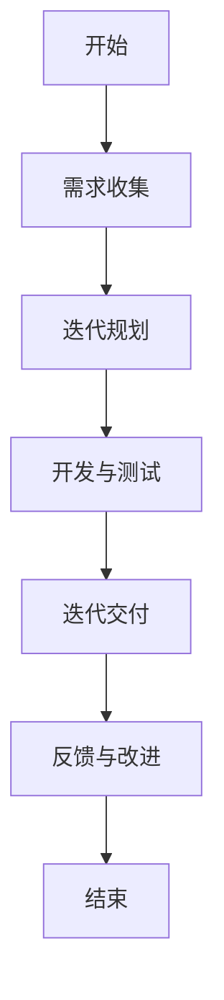

                 

## 文章标题

### 《评测流程的敏捷管理与迭代优化》

> 关键词：敏捷管理、迭代优化、评测流程、敏捷工具、敏捷开发、敏捷测试

> 摘要：本文将深入探讨敏捷管理在评测流程中的应用，通过理论与实践相结合的方式，详细解析敏捷管理的理论基础、敏捷管理在评测流程中的实施方法、敏捷评测的迭代优化策略以及实践案例。本文旨在为IT行业从业人员提供一套完整的敏捷评测管理方法论，帮助提升项目质量和效率。

## 第一部分：敏捷管理的理论基础

### 第1章：敏捷管理概述

#### 1.1 敏捷管理的发展历程

敏捷管理起源于20世纪90年代，其根源可以追溯到软件开发领域的敏捷宣言。敏捷宣言由一群软件开发专家共同签署，旨在提出一种新的软件开发方法，以应对传统瀑布模型的局限性。随着时间的推移，敏捷管理逐渐从软件开发扩展到其他领域，如项目管理、产品开发等。

敏捷管理的发展历程可以分为以下几个阶段：

1. **敏捷宣言（2001年）**：敏捷宣言的提出标志着敏捷方法的诞生，宣言主张个体和互动重于过程和工具，可工作的软件重于详尽的文档，客户合作重于合同谈判，响应变化重于遵循计划。

2. **Scrum框架（1995年）**：Scrum是第一个被广泛采用的敏捷框架，它提供了一种迭代、增量的项目管理方法，强调团队协作、快速迭代和持续交付。

3. **XP（极限编程，1999年）**：XP是一种以工程师为中心的敏捷开发方法，它强调代码质量、自动化测试和持续集成。

4. **Lean软件开发（2000年代）**：Lean软件开发源自制造业的精益生产理念，强调减少浪费、优化流程和持续改进。

5. **看板（Kanban，2006年）**：看板是一种基于可视化管理的敏捷方法，它通过限制在流程中的工作项数量，实现持续交付和减少浪费。

#### 1.2 敏捷管理的核心原则

敏捷管理遵循以下核心原则：

1. **个体和互动重于过程和工具**：敏捷管理强调团队协作和个体贡献，认为良好的沟通和协作比单一的工具或过程更为重要。

2. **可工作的软件重于详尽的文档**：敏捷管理认为，软件的实际可用性比文档的详尽性更为重要，鼓励团队专注于交付高质量的软件。

3. **客户合作重于合同谈判**：敏捷管理强调与客户的紧密合作，通过持续反馈和调整，确保最终产品符合客户需求。

4. **响应变化重于遵循计划**：敏捷管理认为，变化是不可避免的，因此更注重灵活性和适应性，以快速响应市场需求和变化。

#### 1.3 敏捷管理与传统管理的区别

敏捷管理与传统管理（如瀑布模型）存在显著差异，主要体现在以下几个方面：

1. **项目管理方法**：敏捷管理采用迭代、增量的项目管理方法，而传统管理通常采用线性、顺序的项目管理方法。

2. **团队协作**：敏捷管理强调团队协作和跨职能团队，而传统管理强调职能分工和垂直管理。

3. **需求变更处理**：敏捷管理能够灵活应对需求变更，而传统管理通常对需求变更持排斥态度。

4. **交付周期**：敏捷管理强调快速交付，通常在几周或几个月内完成一个迭代，而传统管理可能需要数月或数年才能完成一个项目。

### 第2章：敏捷管理框架

#### 2.1 敏捷管理的主要方法

敏捷管理有多种方法，其中最常见的是Scrum、XP和Kanban。

1. **Scrum**：Scrum是一种迭代、增量的项目管理方法，它包括产品待办列表、冲刺计划、每日站会、冲刺评审和回顾等环节。

2. **XP（极限编程）**：XP是一种以工程师为中心的敏捷开发方法，它包括测试驱动开发（TDD）、代码重构、持续集成等实践。

3. **Kanban**：Kanban是一种基于可视化管理的敏捷方法，它通过限制在流程中的工作项数量，实现持续交付和减少浪费。

#### 2.2 敏捷团队的组织结构

敏捷团队通常采用跨职能团队的形式，团队成员包括项目经理、产品负责人、开发人员、测试人员、UI/UX设计师等。

1. **项目经理**：负责协调团队工作，确保项目按时交付。

2. **产品负责人**：代表客户利益，负责定义产品需求和优先级。

3. **开发人员**：负责编写代码、实现功能。

4. **测试人员**：负责编写测试用例、执行测试，确保软件质量。

5. **UI/UX设计师**：负责设计用户界面和用户体验。

#### 2.3 敏捷项目的管理流程

敏捷项目的管理流程通常包括以下环节：

1. **需求收集**：与产品负责人和客户沟通，收集产品需求和优先级。

2. **迭代规划**：根据需求收集结果，规划下一个迭代的任务和目标。

3. **开发与测试**：开发人员根据迭代计划编写代码，测试人员编写测试用例并执行测试。

4. **迭代交付**：完成一个迭代后，将可工作的软件交付给客户或用户。

5. **反馈与改进**：收集客户或用户的反馈，对下一个迭代进行改进。

### 第3章：敏捷管理工具与技术

#### 3.1 敏捷工具的选择与应用

敏捷工具可以帮助团队更好地实施敏捷管理方法。常见的敏捷工具有JIRA、Trello、Asana、Confluence等。

1. **JIRA**：用于项目管理、任务跟踪和敏捷开发。

2. **Trello**：用于可视化项目管理，将任务分解成卡片，便于团队协作。

3. **Asana**：用于任务管理、项目规划和团队协作。

4. **Confluence**：用于知识共享、文档协作和敏捷项目管理。

#### 3.2 敏捷开发中的敏捷测试

敏捷开发强调持续测试和快速反馈，敏捷测试包括以下方面：

1. **自动化测试**：通过编写自动化测试脚本，自动化执行测试用例，提高测试效率。

2. **验收测试**：与客户或用户合作，确保软件符合预期需求。

3. **持续集成**：将代码集成到主干分支，自动化执行测试，确保代码质量。

4. **性能测试**：对软件进行负载测试、性能测试和稳定性测试，确保软件满足性能要求。

#### 3.3 敏捷项目中的风险管理

敏捷项目中的风险管理强调快速识别和响应风险，以下是一些风险管理方法：

1. **风险识别**：通过头脑风暴、专家评审等方法，识别项目中的潜在风险。

2. **风险评估**：对识别出的风险进行评估，确定风险的概率和影响。

3. **风险应对策略**：制定相应的风险应对策略，包括风险规避、风险转移、风险减轻等。

4. **风险监控**：持续监控风险，确保风险得到及时处理。

## 第二部分：敏捷管理在评测流程中的应用

### 第4章：敏捷评测流程的设计

#### 4.1 敏捷评测流程的核心要素

敏捷评测流程的核心要素包括需求收集、测试规划、测试执行、测试报告和持续改进。

1. **需求收集**：与产品负责人和客户沟通，明确评测目标和评测需求。

2. **测试规划**：根据需求，制定评测计划，包括测试策略、测试用例设计和测试环境搭建。

3. **测试执行**：执行测试用例，记录测试结果，对发现的问题进行跟踪和解决。

4. **测试报告**：编写测试报告，总结测试结果，评估测试覆盖率，提出改进建议。

5. **持续改进**：根据测试反馈，对评测流程进行持续改进，提高测试质量和效率。

#### 4.2 敏捷评测流程的规划

敏捷评测流程的规划包括以下步骤：

1. **确定评测目标**：明确评测的目的和范围，确保评测结果能够满足项目需求。

2. **分解评测任务**：将评测任务分解为可管理的子任务，便于团队协作和进度跟踪。

3. **评估资源需求**：评估所需的资源，包括人员、设备、时间和资金。

4. **制定评测计划**：根据评测目标和任务，制定详细的评测计划，包括评测策略、测试用例设计和测试环境搭建。

5. **分配任务和职责**：明确团队成员的职责和任务，确保每个人都清楚自己的工作内容和目标。

#### 4.3 敏捷评测流程的执行与监控

敏捷评测流程的执行与监控包括以下步骤：

1. **启动测试**：根据评测计划，启动测试用例的执行。

2. **记录测试结果**：记录测试结果，包括测试通过、失败、阻塞等情况。

3. **问题跟踪**：对发现的缺陷进行跟踪和解决，确保问题得到及时处理。

4. **监控进度**：监控测试进度，确保测试按计划进行。

5. **反馈与改进**：定期与团队成员沟通，收集反馈，对评测流程进行改进。

### 第5章：敏捷评测的迭代优化

#### 5.1 敏捷评测的迭代策略

敏捷评测的迭代策略包括以下方面：

1. **迭代规划**：在每个迭代开始时，制定迭代计划，明确本次迭代的目标和任务。

2. **迭代执行**：按照迭代计划执行测试任务，确保迭代目标得到实现。

3. **迭代评估**：在每个迭代结束时，对迭代结果进行评估，包括测试覆盖率、缺陷密度等指标。

4. **迭代反馈**：收集迭代反馈，包括测试结果、客户满意度等，为下一个迭代提供改进方向。

5. **迭代改进**：根据迭代反馈，对下一个迭代进行改进，提高测试质量和效率。

#### 5.2 敏捷评测中的反馈与改进

敏捷评测中的反馈与改进包括以下方面：

1. **测试反馈**：对测试过程和测试结果进行反馈，包括测试策略、测试用例设计、测试环境搭建等。

2. **客户反馈**：与客户沟通，了解客户对评测结果的满意度，收集客户对软件的反馈。

3. **改进措施**：根据反馈结果，制定改进措施，包括优化测试流程、改进测试用例设计、提高测试覆盖率等。

4. **持续改进**：将改进措施纳入下一个迭代，持续优化评测流程，提高测试质量和效率。

#### 5.3 敏捷评测中的性能优化

敏捷评测中的性能优化包括以下方面：

1. **测试环境优化**：优化测试环境，包括硬件、软件和网络等，确保测试环境稳定可靠。

2. **测试用例优化**：优化测试用例，提高测试覆盖率，减少冗余测试。

3. **测试数据优化**：优化测试数据，确保测试数据真实、全面、具有代表性。

4. **测试工具优化**：优化测试工具，提高测试效率，减少测试时间。

5. **测试结果分析**：对测试结果进行深入分析，发现潜在的性能问题，提出优化建议。

### 第6章：敏捷评测实践案例

#### 6.1 案例一：电商平台评测流程优化

某知名电商平台在其电商平台的评测流程中采用了敏捷方法，实现了评测流程的优化。

1. **需求收集**：通过与业务团队和客户的紧密沟通，明确评测需求和目标。

2. **测试规划**：根据需求，制定详细的测试计划，包括测试策略、测试用例设计和测试环境搭建。

3. **迭代执行**：按照迭代计划执行测试任务，确保迭代目标得到实现。

4. **反馈与改进**：在每个迭代结束时，收集测试反馈和客户反馈，对评测流程进行改进。

5. **持续改进**：根据反馈结果，对下一个迭代进行改进，提高测试质量和效率。

通过敏捷评测方法的实施，该电商平台的评测流程得到了显著优化，测试质量得到了提高，客户满意度显著提升。

#### 6.2 案例二：金融风险评估与优化

某金融公司在其金融产品的风险评估过程中采用了敏捷方法，实现了风险评估流程的优化。

1. **需求收集**：通过与业务团队和风险管理部门的沟通，明确风险评估需求和目标。

2. **测试规划**：根据需求，制定详细的测试计划，包括测试策略、测试用例设计和测试环境搭建。

3. **迭代执行**：按照迭代计划执行测试任务，确保迭代目标得到实现。

4. **反馈与改进**：在每个迭代结束时，收集测试反馈和风险管理部门的反馈，对风险评估流程进行改进。

5. **持续改进**：根据反馈结果，对下一个迭代进行改进，提高风险评估质量和效率。

通过敏捷评测方法的实施，该金融公司的风险评估流程得到了显著优化，风险识别能力得到了提高，业务风险得到了有效控制。

#### 6.3 案例三：敏捷评测在软件工程中的应用

某软件开发公司在其软件项目的评测过程中采用了敏捷方法，实现了评测流程的优化。

1. **需求收集**：通过与业务团队和开发团队的沟通，明确评测需求和目标。

2. **测试规划**：根据需求，制定详细的测试计划，包括测试策略、测试用例设计和测试环境搭建。

3. **迭代执行**：按照迭代计划执行测试任务，确保迭代目标得到实现。

4. **反馈与改进**：在每个迭代结束时，收集测试反馈和开发团队的反馈，对评测流程进行改进。

5. **持续改进**：根据反馈结果，对下一个迭代进行改进，提高测试质量和效率。

通过敏捷评测方法的实施，该软件开发公司的评测流程得到了显著优化，测试覆盖率得到了提高，软件质量得到了保障。

### 第7章：敏捷管理与迭代优化的未来展望

#### 7.1 敏捷管理的发展趋势

敏捷管理作为现代项目管理的重要方法，其发展趋势主要体现在以下几个方面：

1. **全球化**：随着全球化的推进，敏捷管理方法在全球范围内得到了广泛应用，不同国家和地区的团队开始采用敏捷方法进行项目管理。

2. **数字化转型**：随着数字技术的不断发展，敏捷管理在数字化转型中的应用越来越广泛，企业通过敏捷方法实现业务流程的优化和数字化转型。

3. **人工智能与敏捷管理**：人工智能技术的不断发展，为敏捷管理提供了新的工具和方法，如自动化测试、智能分析等，提高了敏捷管理的效率和质量。

#### 7.2 迭代优化的挑战与机遇

迭代优化作为敏捷管理的重要组成部分，面临着一系列挑战和机遇：

1. **挑战**：迭代优化过程中，可能面临需求变更、资源限制、团队协作等问题，需要持续改进和优化。

2. **机遇**：迭代优化为团队提供了持续改进的机会，通过不断反馈和调整，可以提高项目质量和效率。

#### 7.3 敏捷管理与迭代优化的未来发展方向

敏捷管理与迭代优化的未来发展方向主要包括：

1. **智能化**：通过引入人工智能技术，实现敏捷管理的智能化，提高项目管理和迭代优化的效率。

2. **定制化**：针对不同行业和项目的特点，提供定制化的敏捷管理方法和工具，提高项目的成功率。

3. **全球化协作**：加强全球范围内敏捷团队的协作，实现跨地域、跨文化的敏捷管理。

## 附录

### 附录A：敏捷管理相关资源

#### 7.1 敏捷管理的重要书籍推荐

1. **《敏捷管理：实现团队协作与高效项目管理》（Agile Management: Creating Success at the Speed of Change）**：作者：迪克·布朗（Dick Brown），详细介绍了敏捷管理的方法和实践。

2. **《Scrum精髓：实践指南》（Scrum Essence Explained: The Definition of Done for Agile Software Development）**：作者：杰夫·萨瑟兰（Jeff Sutherland），深入探讨了Scrum方法的核心理念和实践。

3. **《敏捷项目管理：实战指南》（Agile Project Management: Creating Innovative Products）**：作者：杰夫·苏斯特（Jeff Sutherland）和史蒂夫·麦康奈尔（Steve McConnell），提供了敏捷项目管理的全面指南。

#### 7.2 敏捷管理的重要博客和网站推荐

1. **Scrum.org**：Scrum.org 是Scrum联盟的官方网站，提供了丰富的Scrum资源和培训。

2. **Agile Alliance**：Agile Alliance 是敏捷联盟的官方网站，提供了全球敏捷社区的信息和资源。

3. **InfoQ**：InfoQ 是一个专业的技术社区，提供了大量的敏捷管理文章、讲座和讨论。

#### 7.3 敏捷管理的重要工具推荐

1. **JIRA**：JIRA 是一个功能强大的敏捷项目管理工具，提供了任务跟踪、敏捷开发、自动化测试等功能。

2. **Trello**：Trello 是一个基于看板的可视化项目管理工具，简单易用，适用于各种规模的团队。

3. **Asana**：Asana 是一个专业的任务管理工具，支持敏捷开发方法，帮助团队高效协作。

### 核心概念与联系

#### 敏捷管理流程图



### 核心算法原理讲解

#### 敏捷评测中的机器学习算法

```plaintext
算法伪代码：

function 敏捷评测(数据集，参数):
    初始化模型参数
    for epoch in 1 to 最大迭代次数:
        for each 数据 in 数据集:
            计算损失函数值
            更新模型参数
    返回模型参数
```

### 数学模型和数学公式

$$
L = \frac{1}{n} \sum_{i=1}^{n} (y_i - \hat{y}_i)^2
$$

其中，$L$ 表示损失函数，$y_i$ 表示实际输出，$\hat{y}_i$ 表示预测输出。

### 项目实战

#### 案例一：敏捷评测在电商平台中的应用

##### 1. 开发环境搭建

- Python 3.8
- Scikit-learn 0.22.2
- Pandas 1.1.5
- Matplotlib 3.4.3

##### 2. 数据预处理

```python
import pandas as pd

# 加载数据集
data = pd.read_csv('data.csv')

# 数据清洗与预处理
# ...
```

##### 3. 代码实现

```python
from sklearn.ensemble import RandomForestClassifier
from sklearn.model_selection import train_test_split
from sklearn.metrics import accuracy_score

# 数据分割
X_train, X_test, y_train, y_test = train_test_split(data.drop('target', axis=1), data['target'], test_size=0.2, random_state=42)

# 构建模型
model = RandomForestClassifier(n_estimators=100, random_state=42)

# 训练模型
model.fit(X_train, y_train)

# 预测
predictions = model.predict(X_test)

# 评估
accuracy = accuracy_score(y_test, predictions)
print(f"模型准确率：{accuracy:.2f}")
```

##### 4. 代码解读与分析

- 数据预处理：对数据进行清洗，例如缺失值处理、异常值处理、特征工程等。

## 最佳实践、小结与注意事项

### 最佳实践

1. **需求收集**：确保与客户和业务团队的紧密沟通，明确评测需求和目标。

2. **测试规划**：制定详细的测试计划，包括测试策略、测试用例设计和测试环境搭建。

3. **迭代执行**：按照迭代计划执行测试任务，确保迭代目标得到实现。

4. **反馈与改进**：在每个迭代结束时，收集测试反馈和客户反馈，对评测流程进行改进。

5. **持续改进**：根据反馈结果，对下一个迭代进行改进，提高测试质量和效率。

### 小结

1. **敏捷管理在评测流程中的应用**：通过敏捷管理方法，可以提高评测流程的效率和质量，实现快速响应市场需求。

2. **敏捷评测的迭代优化**：通过不断反馈和改进，可以提高评测流程的灵活性和适应性。

3. **实践案例**：通过实际案例，展示了敏捷管理在评测流程中的应用效果。

### 注意事项

1. **团队协作**：确保团队成员之间的紧密协作，提高团队的整体效率。

2. **持续沟通**：与客户和业务团队的持续沟通，确保评测结果符合预期需求。

3. **资源管理**：合理分配资源，确保测试任务能够按时完成。

4. **风险管理**：识别和应对项目中的潜在风险，确保项目顺利进行。

### 拓展阅读

1. **《敏捷项目管理实践指南》**：提供了全面的敏捷项目管理方法和实践。

2. **《敏捷开发实践指南》**：介绍了敏捷开发的方法和实践，适用于软件开发项目。

3. **《敏捷测试：敏捷方法在软件测试中的应用》**：详细介绍了敏捷方法在软件测试中的应用和实践。

