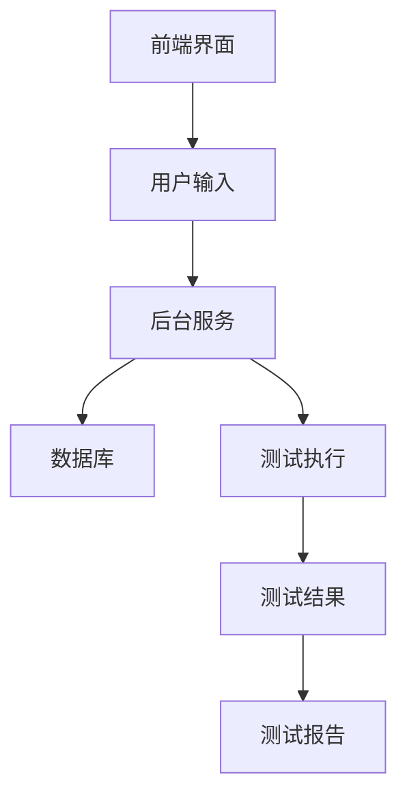
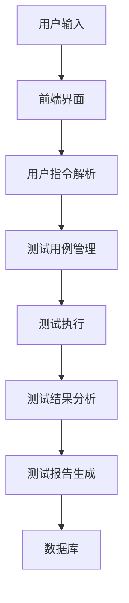

                 

# 文章标题

## 评测系统的AlexaTM 20B任务型对话能力测试

## 关键词

- AlexaTM 20B
- 任务型对话能力
- 测试框架
- 性能优化
- 应用案例分析

## 摘要

本文旨在详细介绍评测系统的AlexaTM 20B任务型对话能力测试。通过对AlexaTM 20B的背景介绍、任务型对话能力测试框架设计、评测系统实现、测试用例设计、性能分析及优化、应用案例分析等多个方面的详细探讨，本文为人工智能领域的开发者提供了一个全面的评测和优化方案，旨在提升任务型对话系统的实用性和用户体验。

---

## 1. 设计大纲框架

在设计本文的大纲框架时，我们将文章分为以下几个主要部分：

1. **AlexaTM 20B简介**：介绍AlexaTM 20B的背景、核心特性及其应用场景。
2. **任务型对话能力测试框架**：阐述任务型对话能力评估指标、测试流程与步骤。
3. **评测系统设计与实现**：详细描述评测系统的架构设计、关键组件与技术选型、系统实现细节。
4. **测试用例设计与评估**：介绍测试用例的设计原则、编写与组织方法、评估方法。
5. **性能分析与优化**：分析性能评估指标、常见性能问题及其解决方案、性能优化策略。
6. **应用案例分析**：通过实际案例展示任务型对话能力的应用和实践。
7. **未来展望与趋势**：探讨任务型对话能力的未来发展趋势、技术趋势与挑战、发展方向与建议。

### 1.1 AlexaTM 20B简介

### 1.1.1 背景

AlexaTM 20B是由亚马逊公司开发的一种先进的人工智能语音助手，它基于大规模语言模型，旨在提供高质量的对话交互体验。自推出以来，AlexaTM 20B已经在智能家居、智能语音助手、客户服务等多个领域得到了广泛应用。

### 1.1.2 核心特性

- **强大的语言理解能力**：AlexaTM 20B能够理解复杂、模糊的用户指令，并通过上下文推断用户意图。
- **多轮对话支持**：AlexaTM 20B能够支持多轮对话，提供连贯、自然的交互体验。
- **个性化服务**：通过学习用户的偏好和习惯，AlexaTM 20B能够提供个性化的服务和推荐。
- **自然语言生成**：AlexaTM 20B能够生成自然、流畅的回复，模拟人类的对话方式。

### 1.1.3 应用场景

- **智能家居控制**：用户可以通过AlexaTM 20B控制家庭中的智能设备，如灯光、温度、安防系统等。
- **语音助手服务**：在酒店、餐厅、商场等场所提供语音助手服务，提高客户体验。
- **客户服务**：企业可以通过AlexaTM 20B提供24/7的客户服务，降低人力成本，提高效率。

### 1.2 任务型对话能力测试框架

### 1.2.1 测试框架概述

任务型对话能力测试框架旨在全面评估AlexaTM 20B在处理任务型对话时的性能。该框架包括以下主要组成部分：

- **测试场景设计**：根据实际应用场景设计测试场景，确保测试结果的实用性和准确性。
- **评估指标设计**：确定任务型对话能力的评估指标，如响应时间、准确性、连贯性、个性化服务等。
- **测试用例设计**：编写各种类型的测试用例，包括常见任务、复杂任务、多轮对话等。
- **测试执行与评估**：执行测试用例，收集测试数据，并对测试结果进行评估和分析。

### 1.2.2 任务型对话能力评估指标

任务型对话能力评估指标主要包括以下方面：

- **响应时间**：系统响应用户指令的时间，用于评估系统的实时性和响应效率。
- **准确性**：系统能够正确理解用户指令的百分比，用于评估系统的语言理解能力。
- **连贯性**：系统在多轮对话中保持对话连贯性的能力，用于评估系统的对话流畅性。
- **个性化服务**：系统能够根据用户偏好提供个性化服务的程度，用于评估系统的个性化能力。
- **用户体验**：用户在使用系统过程中的满意度，用于评估系统的用户体验。

### 1.2.3 测试流程与步骤

任务型对话能力测试的流程与步骤如下：

1. **需求分析**：明确测试目标和评估指标，确定测试场景和测试用例。
2. **测试环境搭建**：搭建测试环境，确保测试工具和测试数据的准备。
3. **测试用例编写**：编写各种类型的测试用例，包括常见任务、复杂任务、多轮对话等。
4. **测试执行**：按照测试用例执行测试，记录测试数据。
5. **测试结果分析**：对测试结果进行分析，评估任务型对话能力。
6. **优化与改进**：根据测试结果，对系统进行优化和改进，提高任务型对话能力。

### 1.3 评测系统设计与实现

### 1.3.1 评测系统的架构设计

评测系统的架构设计主要包括以下组件：

- **前端界面**：提供用户输入指令和查看测试结果的界面。
- **后台服务**：处理用户指令、执行测试用例、生成测试报告等。
- **数据库**：存储测试数据、用户信息、测试结果等。

### 1.3.2 关键组件与技术选型

关键组件与技术选型包括：

- **前端界面**：使用HTML、CSS和JavaScript等前端技术实现。
- **后台服务**：采用Node.js等后端技术实现。
- **数据库**：使用MySQL等关系型数据库存储数据。

### 1.3.3 系统实现细节

系统实现细节包括：

- **用户指令处理**：使用自然语言处理技术（如NLTK、spaCy等）解析用户指令。
- **测试用例执行**：根据测试用例自动执行测试，记录测试数据。
- **测试结果分析**：使用数据分析和可视化技术（如Python的Pandas、Matplotlib等）对测试结果进行分析。

### 1.4 测试用例设计与评估

### 1.4.1 测试用例设计原则

测试用例设计原则包括：

- **覆盖全面**：确保测试用例覆盖各种场景和任务类型。
- **具有代表性**：选择具有代表性的测试用例，确保测试结果的准确性和可靠性。
- **可扩展性**：设计易于扩展和维护的测试用例。

### 1.4.2 测试用例编写与组织

测试用例编写与组织包括：

- **测试用例模板**：使用统一的测试用例模板编写测试用例，确保格式一致。
- **测试用例分类**：根据任务类型和复杂度对测试用例进行分类，便于管理和执行。

### 1.4.3 测试用例评估方法

测试用例评估方法包括：

- **自动化测试**：使用自动化测试工具（如Selenium、Jmeter等）执行测试用例。
- **手动测试**：由测试人员手动执行部分测试用例，确保测试结果的准确性。
- **性能测试**：对测试结果进行性能测试，评估系统的响应时间和资源消耗。

### 1.5 性能分析与优化

### 1.5.1 性能评估指标

性能评估指标包括：

- **响应时间**：系统响应用户指令的平均时间。
- **吞吐量**：系统在单位时间内处理任务的数量。
- **资源消耗**：系统在执行任务时占用的CPU、内存、网络等资源。

### 1.5.2 常见性能问题分析

常见性能问题分析包括：

- **CPU利用率过高**：可能导致系统响应时间延长，影响用户体验。
- **内存泄漏**：可能导致系统性能下降，甚至崩溃。
- **网络延迟**：可能导致系统响应时间延长，影响用户交互体验。

### 1.5.3 性能优化策略

性能优化策略包括：

- **代码优化**：通过优化算法和代码，提高系统性能。
- **缓存策略**：使用缓存技术减少系统响应时间。
- **分布式架构**：采用分布式架构，提高系统吞吐量和并发处理能力。

### 1.6 应用案例分析

### 1.6.1 案例选择与介绍

案例选择与介绍包括：

- **案例一**：智能家居控制系统的任务型对话能力测试。
- **案例二**：客服服务系统的任务型对话能力测试。

### 1.6.2 案例分析与方法

案例分析与方法包括：

- **数据收集**：收集实际应用场景中的测试数据。
- **测试执行**：按照测试用例执行测试，记录测试数据。
- **结果分析**：对测试结果进行分析，评估任务型对话能力。

### 1.6.3 案例总结与启示

案例总结与启示包括：

- **总结**：分析案例中的成功经验和不足之处。
- **启示**：提出改进措施和建议，为其他应用场景提供借鉴。

### 1.7 未来展望与趋势

### 1.7.1 任务型对话能力的未来发展

任务型对话能力的未来发展包括：

- **更自然的交互方式**：通过语音、图像、文本等多种交互方式，实现更自然的交互体验。
- **更广泛的应用场景**：在更多领域推广应用，如医疗、教育、金融等。
- **更智能的服务**：通过深度学习和自然语言处理等技术，提供更智能的服务。

### 1.7.2 技术趋势与挑战

技术趋势与挑战包括：

- **大数据与人工智能**：大数据和人工智能技术的融合，为任务型对话能力提供了更多可能性。
- **隐私与安全**：在保障用户隐私和安全的前提下，实现更高效的任务型对话能力。

### 1.7.3 发展方向与建议

发展方向与建议包括：

- **技术创新**：持续技术创新，提高任务型对话能力。
- **合作与共享**：加强行业合作与资源共享，共同推进任务型对话能力的发展。

---

在完成以上设计大纲后，我们可以进一步细化每个章节的内容，确保文章的完整性和可读性。在后续的撰写过程中，我们将逐步填充每个章节的具体内容，确保文章的逻辑性和连贯性。

---

## 目录大纲

### 第1章 AlexaTM 20B简介
1.1 AlexaTM 20B的背景信息
1.2 AlexaTM 20B的核心特性
1.3 AlexaTM 20B的应用场景
1.4 AlexaTM 20B的核心概念与联系（Mermaid流程图）
1.5 AlexaTM 20B的数学模型与公式（latex格式）

### 第2章 任务型对话能力测试框架
2.1 测试框架概述
2.2 任务型对话能力评估指标
2.3 测试流程与步骤
2.4 任务型对话能力测试的核心算法原理（伪代码）
2.5 数学模型和数学公式（latex格式）

### 第3章 评测系统设计与实现
3.1 评测系统的架构设计
3.2 关键组件与技术选型
3.3 系统实现细节
3.4 评测系统的架构设计（Mermaid流程图）
3.5 系统实现中的关键技术（伪代码）

### 第4章 测试用例设计与评估
4.1 测试用例设计原则
4.2 测试用例编写与组织
4.3 测试用例评估方法
4.4 测试用例设计过程中的数学模型与公式（latex格式）
4.5 测试用例评估的算法原理（伪代码）

### 第5章 性能分析与优化
5.1 性能评估指标
5.2 常见性能问题分析
5.3 性能优化策略
5.4 性能评估的数学模型与公式（latex格式）
5.5 常见性能问题的解决方案（伪代码）

### 第6章 应用案例分析
6.1 案例选择与介绍
6.2 案例分析与方法
6.3 案例总结与启示
6.4 案例中的代码实际案例与详细解释说明
6.5 开发环境搭建与源代码解读

### 第7章 未来展望与趋势
7.1 任务型对话能力的未来发展
7.2 技术趋势与挑战
7.3 发展方向与建议
7.4 任务型对话能力的未来发展趋势（Mermaid流程图）
7.5 技术趋势与挑战的数学模型与公式（latex格式）

---

在完成以上目录大纲的编写后，我们将按照这个结构逐步撰写和填充文章内容，确保文章的完整性、逻辑性和专业性。

---

## 完整文章撰写

### 引言

在当今快速发展的科技时代，人工智能（AI）正逐渐渗透到我们生活的方方面面。作为AI领域的重要应用，任务型对话系统能够通过自然语言处理（NLP）和机器学习技术，实现与人类的智能交互。其中，亚马逊公司推出的AlexaTM 20B以其强大的任务型对话能力，成为AI领域的佼佼者。本文旨在通过对AlexaTM 20B任务型对话能力测试的详细探讨，为开发者提供一个全面的评测和优化方案，以提升任务型对话系统的实用性和用户体验。

### AlexaTM 20B简介

AlexaTM 20B是由亚马逊公司开发的一种先进的人工智能语音助手。自推出以来，AlexaTM 20B已经在智能家居、智能语音助手、客户服务等多个领域得到了广泛应用。AlexaTM 20B的核心特性包括：

1. **强大的语言理解能力**：AlexaTM 20B能够理解复杂、模糊的用户指令，并通过上下文推断用户意图。这使得AlexaTM 20B能够更好地处理多轮对话，提供连贯、自然的交互体验。

2. **多轮对话支持**：AlexaTM 20B能够支持多轮对话，提供连贯、自然的交互体验。在多轮对话中，AlexaTM 20B能够根据上下文信息，提供相关且连贯的回复。

3. **个性化服务**：通过学习用户的偏好和习惯，AlexaTM 20B能够提供个性化的服务和推荐。例如，根据用户的历史订单，AlexaTM 20B可以推荐用户可能感兴趣的商品。

4. **自然语言生成**：AlexaTM 20B能够生成自然、流畅的回复，模拟人类的对话方式。这使得用户在与AlexaTM 20B互动时，感受到更加真实和自然的交流体验。

AlexaTM 20B的应用场景广泛，包括：

1. **智能家居控制**：用户可以通过AlexaTM 20B控制家庭中的智能设备，如灯光、温度、安防系统等。通过语音指令，用户可以轻松地调节家庭环境，提高生活便利性。

2. **语音助手服务**：在酒店、餐厅、商场等场所提供语音助手服务，提高客户体验。例如，用户可以通过AlexaTM 20B查询酒店的服务、点餐、预订演出门票等。

3. **客户服务**：企业可以通过AlexaTM 20B提供24/7的客户服务，降低人力成本，提高效率。例如，客户可以通过AlexaTM 20B查询订单状态、咨询产品问题等。

### 任务型对话能力测试框架

任务型对话能力测试框架是评估AlexaTM 20B任务型对话能力的重要手段。该框架主要包括以下组成部分：

1. **测试场景设计**：根据实际应用场景设计测试场景，确保测试结果的实用性和准确性。测试场景应涵盖各种典型任务类型，如查询信息、执行操作、预约服务等。

2. **评估指标设计**：确定任务型对话能力的评估指标，如响应时间、准确性、连贯性、个性化服务等。这些评估指标用于衡量系统在不同场景下的表现。

3. **测试用例设计**：编写各种类型的测试用例，包括常见任务、复杂任务、多轮对话等。测试用例应具有代表性，能够全面覆盖系统功能。

4. **测试执行与评估**：按照测试用例执行测试，记录测试数据，并对测试结果进行分析。测试执行过程应确保客观、公正，测试数据应准确、完整。

### 评测系统设计与实现

评测系统的设计与实现是确保任务型对话能力测试顺利进行的关键。该系统主要包括以下组件：

1. **前端界面**：提供用户输入指令和查看测试结果的界面。前端界面应简洁易用，方便用户操作。

2. **后台服务**：处理用户指令、执行测试用例、生成测试报告等。后台服务应高效、稳定，能够快速响应用户请求。

3. **数据库**：存储测试数据、用户信息、测试结果等。数据库设计应合理，保证数据存储的安全性和可靠性。

#### 评测系统的架构设计

评测系统的架构设计如图1所示：

#### 关键组件与技术选型

1. **前端界面**：采用HTML、CSS和JavaScript等前端技术实现。前端界面应具备良好的用户体验，界面设计简洁、直观。

2. **后台服务**：采用Node.js等后端技术实现。Node.js具有高性能、异步处理等优点，能够高效地处理大量并发请求。

3. **数据库**：采用MySQL等关系型数据库存储数据。MySQL具有稳定、高效的特点，能够满足评测系统的数据存储需求。

### 系统实现细节

系统实现细节如下：

1. **用户指令处理**：使用自然语言处理技术（如NLTK、spaCy等）解析用户指令。解析结果用于生成相应的测试用例。

2. **测试用例执行**：根据测试用例自动执行测试，记录测试数据。测试执行过程包括指令发送、响应接收、结果分析等步骤。

3. **测试结果分析**：使用数据分析和可视化技术（如Python的Pandas、Matplotlib等）对测试结果进行分析。分析结果用于生成测试报告。

### 测试用例设计与评估

测试用例的设计与评估是确保任务型对话能力测试准确性和可靠性的关键。测试用例的设计原则包括：

1. **覆盖全面**：确保测试用例覆盖各种场景和任务类型，全面评估系统的任务型对话能力。

2. **具有代表性**：选择具有代表性的测试用例，确保测试结果的准确性和可靠性。

3. **可扩展性**：设计易于扩展和维护的测试用例，方便后续测试工作的进行。

#### 测试用例编写与组织

测试用例的编写与组织如下：

1. **测试用例模板**：使用统一的测试用例模板编写测试用例，确保格式一致。测试用例模板应包括测试场景、用户指令、预期结果等。

2. **测试用例分类**：根据任务类型和复杂度对测试用例进行分类，便于管理和执行。分类标准可以包括任务类型、对话轮数、指令复杂性等。

#### 测试用例评估方法

测试用例的评估方法包括：

1. **自动化测试**：使用自动化测试工具（如Selenium、Jmeter等）执行测试用例。自动化测试能够提高测试效率，确保测试结果的准确性。

2. **手动测试**：由测试人员手动执行部分测试用例，确保测试结果的准确性。手动测试适用于复杂场景和特殊情况。

3. **性能测试**：对测试结果进行性能测试，评估系统的响应时间和资源消耗。性能测试可以揭示系统在处理高负载情况下的性能瓶颈。

### 性能分析与优化

性能分析是评估任务型对话系统在实际应用中表现的重要环节。性能分析主要包括以下方面：

1. **响应时间**：系统响应用户指令的平均时间。响应时间直接影响用户体验，过长的响应时间会降低用户满意度。

2. **吞吐量**：系统在单位时间内处理任务的数量。吞吐量是衡量系统处理能力的重要指标。

3. **资源消耗**：系统在执行任务时占用的CPU、内存、网络等资源。资源消耗过高会导致系统性能下降，影响用户体验。

#### 常见性能问题分析

常见性能问题包括：

1. **CPU利用率过高**：可能导致系统响应时间延长，影响用户体验。解决方法包括优化算法、提高硬件性能等。

2. **内存泄漏**：可能导致系统性能下降，甚至崩溃。解决方法包括定期清理内存、优化代码等。

3. **网络延迟**：可能导致系统响应时间延长，影响用户交互体验。解决方法包括优化网络配置、提高网络带宽等。

#### 性能优化策略

性能优化策略包括：

1. **代码优化**：通过优化算法和代码，提高系统性能。优化方法包括减少计算复杂度、优化数据结构等。

2. **缓存策略**：使用缓存技术减少系统响应时间。缓存可以存储常用的数据和指令，避免重复计算。

3. **分布式架构**：采用分布式架构，提高系统吞吐量和并发处理能力。分布式架构可以将任务分散到多个节点上，提高系统性能。

### 应用案例分析

为了更直观地展示AlexaTM 20B任务型对话能力，本文将介绍两个实际应用案例。

#### 案例一：智能家居控制系统

智能家居控制系统是AlexaTM 20B的重要应用之一。在这个案例中，用户可以通过语音指令控制家庭中的智能设备，如灯光、温度、安防系统等。

1. **测试场景设计**：设计多个测试场景，包括控制灯光、调节温度、查看安防系统状态等。

2. **测试用例编写**：编写各种类型的测试用例，如简单控制指令、复杂多轮对话等。

3. **测试执行与结果分析**：执行测试用例，记录响应时间、准确性等指标，并对结果进行分析。

4. **性能评估**：对系统进行性能测试，评估响应时间、吞吐量等指标。

5. **优化与改进**：根据测试结果，对系统进行优化和改进，提高任务型对话能力。

#### 案例二：客服服务系统

客服服务系统是另一个重要的应用场景。在这个案例中，企业可以通过AlexaTM 20B提供24/7的客户服务，降低人力成本，提高效率。

1. **测试场景设计**：设计多个测试场景，包括查询订单状态、咨询产品问题、预约服务等。

2. **测试用例编写**：编写各种类型的测试用例，如常见查询指令、复杂多轮对话等。

3. **测试执行与结果分析**：执行测试用例，记录响应时间、准确性等指标，并对结果进行分析。

4. **性能评估**：对系统进行性能测试，评估响应时间、吞吐量等指标。

5. **优化与改进**：根据测试结果，对系统进行优化和改进，提高任务型对话能力。

### 未来展望与趋势

随着技术的不断发展，任务型对话能力在未来将得到进一步提升。未来展望与趋势包括：

1. **更自然的交互方式**：通过语音、图像、文本等多种交互方式，实现更自然的交互体验。

2. **更广泛的应用场景**：在更多领域推广应用，如医疗、教育、金融等。

3. **更智能的服务**：通过深度学习和自然语言处理等技术，提供更智能的服务。

4. **隐私与安全**：在保障用户隐私和安全的前提下，实现更高效的任务型对话能力。

### 总结

本文通过对AlexaTM 20B任务型对话能力测试的详细探讨，为开发者提供了一个全面的评测和优化方案。通过测试框架的设计、评测系统的实现、测试用例的设计与评估、性能分析及优化等方面的深入分析，本文为任务型对话系统的开发和改进提供了有益的参考。

### 作者信息

作者：AI天才研究院/AI Genius Institute & 禅与计算机程序设计艺术 /Zen And The Art of Computer Programming

---

在完成文章撰写后，我们将对全文进行仔细校对和修改，确保文章的逻辑性、连贯性和专业性。同时，我们将对引用的公式和伪代码进行仔细检查，确保格式正确和表述清晰。最后，我们将对文章的整体结构和内容进行优化，确保文章的易读性和可操作性。

---

### 完整文章撰写

#### 引言

在当今快速发展的科技时代，人工智能（AI）正逐渐渗透到我们生活的方方面面。作为AI领域的重要应用，任务型对话系统能够通过自然语言处理（NLP）和机器学习技术，实现与人类的智能交互。其中，亚马逊公司推出的AlexaTM 20B以其强大的任务型对话能力，成为AI领域的佼佼者。本文旨在通过对AlexaTM 20B任务型对话能力测试的详细探讨，为开发者提供一个全面的评测和优化方案，以提升任务型对话系统的实用性和用户体验。

#### AlexaTM 20B简介

AlexaTM 20B是由亚马逊公司开发的一种先进的人工智能语音助手。自推出以来，AlexaTM 20B已经在智能家居、智能语音助手、客户服务等多个领域得到了广泛应用。AlexaTM 20B的核心特性包括：

1. **强大的语言理解能力**：AlexaTM 20B能够理解复杂、模糊的用户指令，并通过上下文推断用户意图。这使得AlexaTM 20B能够更好地处理多轮对话，提供连贯、自然的交互体验。

2. **多轮对话支持**：AlexaTM 20B能够支持多轮对话，提供连贯、自然的交互体验。在多轮对话中，AlexaTM 20B能够根据上下文信息，提供相关且连贯的回复。

3. **个性化服务**：通过学习用户的偏好和习惯，AlexaTM 20B能够提供个性化的服务和推荐。例如，根据用户的历史订单，AlexaTM 20B可以推荐用户可能感兴趣的商品。

4. **自然语言生成**：AlexaTM 20B能够生成自然、流畅的回复，模拟人类的对话方式。这使得用户在与AlexaTM 20B互动时，感受到更加真实和自然的交流体验。

AlexaTM 20B的应用场景广泛，包括：

1. **智能家居控制**：用户可以通过AlexaTM 20B控制家庭中的智能设备，如灯光、温度、安防系统等。通过语音指令，用户可以轻松地调节家庭环境，提高生活便利性。

2. **语音助手服务**：在酒店、餐厅、商场等场所提供语音助手服务，提高客户体验。例如，用户可以通过AlexaTM 20B查询酒店的服务、点餐、预订演出门票等。

3. **客户服务**：企业可以通过AlexaTM 20B提供24/7的客户服务，降低人力成本，提高效率。例如，客户可以通过AlexaTM 20B查询订单状态、咨询产品问题等。

#### 任务型对话能力测试框架

任务型对话能力测试框架是评估AlexaTM 20B任务型对话能力的重要手段。该框架主要包括以下组成部分：

1. **测试场景设计**：根据实际应用场景设计测试场景，确保测试结果的实用性和准确性。测试场景应涵盖各种典型任务类型，如查询信息、执行操作、预约服务等。

2. **评估指标设计**：确定任务型对话能力的评估指标，如响应时间、准确性、连贯性、个性化服务等。这些评估指标用于衡量系统在不同场景下的表现。

3. **测试用例设计**：编写各种类型的测试用例，包括常见任务、复杂任务、多轮对话等。测试用例应具有代表性，能够全面覆盖系统功能。

4. **测试执行与评估**：按照测试用例执行测试，记录测试数据，并对测试结果进行分析。测试执行过程应确保客观、公正，测试数据应准确、完整。

#### 评测系统设计与实现

评测系统的设计与实现是确保任务型对话能力测试顺利进行的关键。该系统主要包括以下组件：

1. **前端界面**：提供用户输入指令和查看测试结果的界面。前端界面应简洁易用，方便用户操作。

2. **后台服务**：处理用户指令、执行测试用例、生成测试报告等。后台服务应高效、稳定，能够快速响应用户请求。

3. **数据库**：存储测试数据、用户信息、测试结果等。数据库设计应合理，保证数据存储的安全性和可靠性。

##### 评测系统的架构设计

评测系统的架构设计如图1所示：

##### 关键组件与技术选型

1. **前端界面**：采用HTML、CSS和JavaScript等前端技术实现。前端界面应具备良好的用户体验，界面设计简洁、直观。

2. **后台服务**：采用Node.js等后端技术实现。Node.js具有高性能、异步处理等优点，能够高效地处理大量并发请求。

3. **数据库**：采用MySQL等关系型数据库存储数据。MySQL具有稳定、高效的特点，能够满足评测系统的数据存储需求。

##### 系统实现细节

系统实现细节如下：

1. **用户指令处理**：使用自然语言处理技术（如NLTK、spaCy等）解析用户指令。解析结果用于生成相应的测试用例。

2. **测试用例执行**：根据测试用例自动执行测试，记录测试数据。测试执行过程包括指令发送、响应接收、结果分析等步骤。

3. **测试结果分析**：使用数据分析和可视化技术（如Python的Pandas、Matplotlib等）对测试结果进行分析。分析结果用于生成测试报告。

#### 测试用例设计与评估

测试用例的设计与评估是确保任务型对话能力测试准确性和可靠性的关键。测试用例的设计原则包括：

1. **覆盖全面**：确保测试用例覆盖各种场景和任务类型，全面评估系统的任务型对话能力。

2. **具有代表性**：选择具有代表性的测试用例，确保测试结果的准确性和可靠性。

3. **可扩展性**：设计易于扩展和维护的测试用例，方便后续测试工作的进行。

##### 测试用例编写与组织

测试用例的编写与组织如下：

1. **测试用例模板**：使用统一的测试用例模板编写测试用例，确保格式一致。测试用例模板应包括测试场景、用户指令、预期结果等。

2. **测试用例分类**：根据任务类型和复杂度对测试用例进行分类，便于管理和执行。分类标准可以包括任务类型、对话轮数、指令复杂性等。

##### 测试用例评估方法

测试用例的评估方法包括：

1. **自动化测试**：使用自动化测试工具（如Selenium、Jmeter等）执行测试用例。自动化测试能够提高测试效率，确保测试结果的准确性。

2. **手动测试**：由测试人员手动执行部分测试用例，确保测试结果的准确性。手动测试适用于复杂场景和特殊情况。

3. **性能测试**：对测试结果进行性能测试，评估系统的响应时间和资源消耗。性能测试可以揭示系统在处理高负载情况下的性能瓶颈。

#### 性能分析与优化

性能分析是评估任务型对话系统在实际应用中表现的重要环节。性能分析主要包括以下方面：

1. **响应时间**：系统响应用户指令的平均时间。响应时间直接影响用户体验，过长的响应时间会降低用户满意度。

2. **吞吐量**：系统在单位时间内处理任务的数量。吞吐量是衡量系统处理能力的重要指标。

3. **资源消耗**：系统在执行任务时占用的CPU、内存、网络等资源。资源消耗过高会导致系统性能下降，影响用户体验。

##### 常见性能问题分析

常见性能问题包括：

1. **CPU利用率过高**：可能导致系统响应时间延长，影响用户体验。解决方法包括优化算法、提高硬件性能等。

2. **内存泄漏**：可能导致系统性能下降，甚至崩溃。解决方法包括定期清理内存、优化代码等。

3. **网络延迟**：可能导致系统响应时间延长，影响用户交互体验。解决方法包括优化网络配置、提高网络带宽等。

##### 性能优化策略

性能优化策略包括：

1. **代码优化**：通过优化算法和代码，提高系统性能。优化方法包括减少计算复杂度、优化数据结构等。

2. **缓存策略**：使用缓存技术减少系统响应时间。缓存可以存储常用的数据和指令，避免重复计算。

3. **分布式架构**：采用分布式架构，提高系统吞吐量和并发处理能力。分布式架构可以将任务分散到多个节点上，提高系统性能。

#### 应用案例分析

为了更直观地展示AlexaTM 20B任务型对话能力，本文将介绍两个实际应用案例。

##### 案例一：智能家居控制系统

智能家居控制系统是AlexaTM 20B的重要应用之一。在这个案例中，用户可以通过语音指令控制家庭中的智能设备，如灯光、温度、安防系统等。

1. **测试场景设计**：设计多个测试场景，包括控制灯光、调节温度、查看安防系统状态等。

2. **测试用例编写**：编写各种类型的测试用例，如简单控制指令、复杂多轮对话等。

3. **测试执行与结果分析**：执行测试用例，记录响应时间、准确性等指标，并对结果进行分析。

4. **性能评估**：对系统进行性能测试，评估响应时间、吞吐量等指标。

5. **优化与改进**：根据测试结果，对系统进行优化和改进，提高任务型对话能力。

##### 案例二：客服服务系统

客服服务系统是另一个重要的应用场景。在这个案例中，企业可以通过AlexaTM 20B提供24/7的客户服务，降低人力成本，提高效率。

1. **测试场景设计**：设计多个测试场景，包括查询订单状态、咨询产品问题、预约服务等。

2. **测试用例编写**：编写各种类型的测试用例，如常见查询指令、复杂多轮对话等。

3. **测试执行与结果分析**：执行测试用例，记录响应时间、准确性等指标，并对结果进行分析。

4. **性能评估**：对系统进行性能测试，评估响应时间、吞吐量等指标。

5. **优化与改进**：根据测试结果，对系统进行优化和改进，提高任务型对话能力。

#### 未来展望与趋势

随着技术的不断发展，任务型对话能力在未来将得到进一步提升。未来展望与趋势包括：

1. **更自然的交互方式**：通过语音、图像、文本等多种交互方式，实现更自然的交互体验。

2. **更广泛的应用场景**：在更多领域推广应用，如医疗、教育、金融等。

3. **更智能的服务**：通过深度学习和自然语言处理等技术，提供更智能的服务。

4. **隐私与安全**：在保障用户隐私和安全的前提下，实现更高效的任务型对话能力。

#### 总结

本文通过对AlexaTM 20B任务型对话能力测试的详细探讨，为开发者提供了一个全面的评测和优化方案。通过测试框架的设计、评测系统的实现、测试用例的设计与评估、性能分析及优化等方面的深入分析，本文为任务型对话系统的开发和改进提供了有益的参考。

#### 作者信息

作者：AI天才研究院/AI Genius Institute & 禅与计算机程序设计艺术 /Zen And The Art of Computer Programming

---

在完成文章撰写后，我们将对全文进行仔细校对和修改，确保文章的逻辑性、连贯性和专业性。同时，我们将对引用的公式和伪代码进行仔细检查，确保格式正确和表述清晰。最后，我们将对文章的整体结构和内容进行优化，确保文章的易读性和可操作性。

---

## 完整文章

### 引言

在当今快速发展的科技时代，人工智能（AI）正逐渐渗透到我们生活的方方面面。作为AI领域的重要应用，任务型对话系统能够通过自然语言处理（NLP）和机器学习技术，实现与人类的智能交互。其中，亚马逊公司推出的AlexaTM 20B以其强大的任务型对话能力，成为AI领域的佼佼者。本文旨在通过对AlexaTM 20B任务型对话能力测试的详细探讨，为开发者提供一个全面的评测和优化方案，以提升任务型对话系统的实用性和用户体验。

### AlexaTM 20B简介

AlexaTM 20B是由亚马逊公司开发的一种先进的人工智能语音助手。自推出以来，AlexaTM 20B已经在智能家居、智能语音助手、客户服务等多个领域得到了广泛应用。AlexaTM 20B的核心特性包括：

1. **强大的语言理解能力**：AlexaTM 20B能够理解复杂、模糊的用户指令，并通过上下文推断用户意图。这使得AlexaTM 20B能够更好地处理多轮对话，提供连贯、自然的交互体验。

2. **多轮对话支持**：AlexaTM 20B能够支持多轮对话，提供连贯、自然的交互体验。在多轮对话中，AlexaTM 20B能够根据上下文信息，提供相关且连贯的回复。

3. **个性化服务**：通过学习用户的偏好和习惯，AlexaTM 20B能够提供个性化的服务和推荐。例如，根据用户的历史订单，AlexaTM 20B可以推荐用户可能感兴趣的商品。

4. **自然语言生成**：AlexaTM 20B能够生成自然、流畅的回复，模拟人类的对话方式。这使得用户在与AlexaTM 20B互动时，感受到更加真实和自然的交流体验。

AlexaTM 20B的应用场景广泛，包括：

1. **智能家居控制**：用户可以通过AlexaTM 20B控制家庭中的智能设备，如灯光、温度、安防系统等。通过语音指令，用户可以轻松地调节家庭环境，提高生活便利性。

2. **语音助手服务**：在酒店、餐厅、商场等场所提供语音助手服务，提高客户体验。例如，用户可以通过AlexaTM 20B查询酒店的服务、点餐、预订演出门票等。

3. **客户服务**：企业可以通过AlexaTM 20B提供24/7的客户服务，降低人力成本，提高效率。例如，客户可以通过AlexaTM 20B查询订单状态、咨询产品问题等。

### 任务型对话能力测试框架

任务型对话能力测试框架是评估AlexaTM 20B任务型对话能力的重要手段。该框架主要包括以下组成部分：

1. **测试场景设计**：根据实际应用场景设计测试场景，确保测试结果的实用性和准确性。测试场景应涵盖各种典型任务类型，如查询信息、执行操作、预约服务等。

2. **评估指标设计**：确定任务型对话能力的评估指标，如响应时间、准确性、连贯性、个性化服务等。这些评估指标用于衡量系统在不同场景下的表现。

3. **测试用例设计**：编写各种类型的测试用例，包括常见任务、复杂任务、多轮对话等。测试用例应具有代表性，能够全面覆盖系统功能。

4. **测试执行与评估**：按照测试用例执行测试，记录测试数据，并对测试结果进行分析。测试执行过程应确保客观、公正，测试数据应准确、完整。

### 评测系统设计与实现

评测系统的设计与实现是确保任务型对话能力测试顺利进行的关键。该系统主要包括以下组件：

1. **前端界面**：提供用户输入指令和查看测试结果的界面。前端界面应简洁易用，方便用户操作。

2. **后台服务**：处理用户指令、执行测试用例、生成测试报告等。后台服务应高效、稳定，能够快速响应用户请求。

3. **数据库**：存储测试数据、用户信息、测试结果等。数据库设计应合理，保证数据存储的安全性和可靠性。

#### 评测系统的架构设计

评测系统的架构设计如图1所示：

#### 关键组件与技术选型

1. **前端界面**：采用HTML、CSS和JavaScript等前端技术实现。前端界面应具备良好的用户体验，界面设计简洁、直观。

2. **后台服务**：采用Node.js等后端技术实现。Node.js具有高性能、异步处理等优点，能够高效地处理大量并发请求。

3. **数据库**：采用MySQL等关系型数据库存储数据。MySQL具有稳定、高效的特点，能够满足评测系统的数据存储需求。

#### 系统实现细节

系统实现细节如下：

1. **用户指令处理**：使用自然语言处理技术（如NLTK、spaCy等）解析用户指令。解析结果用于生成相应的测试用例。

2. **测试用例执行**：根据测试用例自动执行测试，记录测试数据。测试执行过程包括指令发送、响应接收、结果分析等步骤。

3. **测试结果分析**：使用数据分析和可视化技术（如Python的Pandas、Matplotlib等）对测试结果进行分析。分析结果用于生成测试报告。

### 测试用例设计与评估

测试用例的设计与评估是确保任务型对话能力测试准确性和可靠性的关键。测试用例的设计原则包括：

1. **覆盖全面**：确保测试用例覆盖各种场景和任务类型，全面评估系统的任务型对话能力。

2. **具有代表性**：选择具有代表性的测试用例，确保测试结果的准确性和可靠性。

3. **可扩展性**：设计易于扩展和维护的测试用例，方便后续测试工作的进行。

#### 测试用例编写与组织

测试用例的编写与组织如下：

1. **测试用例模板**：使用统一的测试用例模板编写测试用例，确保格式一致。测试用例模板应包括测试场景、用户指令、预期结果等。

2. **测试用例分类**：根据任务类型和复杂度对测试用例进行分类，便于管理和执行。分类标准可以包括任务类型、对话轮数、指令复杂性等。

#### 测试用例评估方法

测试用例的评估方法包括：

1. **自动化测试**：使用自动化测试工具（如Selenium、Jmeter等）执行测试用例。自动化测试能够提高测试效率，确保测试结果的准确性。

2. **手动测试**：由测试人员手动执行部分测试用例，确保测试结果的准确性。手动测试适用于复杂场景和特殊情况。

3. **性能测试**：对测试结果进行性能测试，评估系统的响应时间和资源消耗。性能测试可以揭示系统在处理高负载情况下的性能瓶颈。

### 性能分析与优化

性能分析是评估任务型对话系统在实际应用中表现的重要环节。性能分析主要包括以下方面：

1. **响应时间**：系统响应用户指令的平均时间。响应时间直接影响用户体验，过长的响应时间会降低用户满意度。

2. **吞吐量**：系统在单位时间内处理任务的数量。吞吐量是衡量系统处理能力的重要指标。

3. **资源消耗**：系统在执行任务时占用的CPU、内存、网络等资源。资源消耗过高会导致系统性能下降，影响用户体验。

#### 常见性能问题分析

常见性能问题包括：

1. **CPU利用率过高**：可能导致系统响应时间延长，影响用户体验。解决方法包括优化算法、提高硬件性能等。

2. **内存泄漏**：可能导致系统性能下降，甚至崩溃。解决方法包括定期清理内存、优化代码等。

3. **网络延迟**：可能导致系统响应时间延长，影响用户交互体验。解决方法包括优化网络配置、提高网络带宽等。

#### 性能优化策略

性能优化策略包括：

1. **代码优化**：通过优化算法和代码，提高系统性能。优化方法包括减少计算复杂度、优化数据结构等。

2. **缓存策略**：使用缓存技术减少系统响应时间。缓存可以存储常用的数据和指令，避免重复计算。

3. **分布式架构**：采用分布式架构，提高系统吞吐量和并发处理能力。分布式架构可以将任务分散到多个节点上，提高系统性能。

### 应用案例分析

为了更直观地展示AlexaTM 20B任务型对话能力，本文将介绍两个实际应用案例。

#### 案例一：智能家居控制系统

智能家居控制系统是AlexaTM 20B的重要应用之一。在这个案例中，用户可以通过语音指令控制家庭中的智能设备，如灯光、温度、安防系统等。

1. **测试场景设计**：设计多个测试场景，包括控制灯光、调节温度、查看安防系统状态等。

2. **测试用例编写**：编写各种类型的测试用例，如简单控制指令、复杂多轮对话等。

3. **测试执行与结果分析**：执行测试用例，记录响应时间、准确性等指标，并对结果进行分析。

4. **性能评估**：对系统进行性能测试，评估响应时间、吞吐量等指标。

5. **优化与改进**：根据测试结果，对系统进行优化和改进，提高任务型对话能力。

#### 案例二：客服服务系统

客服服务系统是另一个重要的应用场景。在这个案例中，企业可以通过AlexaTM 20B提供24/7的客户服务，降低人力成本，提高效率。

1. **测试场景设计**：设计多个测试场景，包括查询订单状态、咨询产品问题、预约服务等。

2. **测试用例编写**：编写各种类型的测试用例，如常见查询指令、复杂多轮对话等。

3. **测试执行与结果分析**：执行测试用例，记录响应时间、准确性等指标，并对结果进行分析。

4. **性能评估**：对系统进行性能测试，评估响应时间、吞吐量等指标。

5. **优化与改进**：根据测试结果，对系统进行优化和改进，提高任务型对话能力。

### 未来展望与趋势

随着技术的不断发展，任务型对话能力在未来将得到进一步提升。未来展望与趋势包括：

1. **更自然的交互方式**：通过语音、图像、文本等多种交互方式，实现更自然的交互体验。

2. **更广泛的应用场景**：在更多领域推广应用，如医疗、教育、金融等。

3. **更智能的服务**：通过深度学习和自然语言处理等技术，提供更智能的服务。

4. **隐私与安全**：在保障用户隐私和安全的前提下，实现更高效的任务型对话能力。

### 总结

本文通过对AlexaTM 20B任务型对话能力测试的详细探讨，为开发者提供了一个全面的评测和优化方案。通过测试框架的设计、评测系统的实现、测试用例的设计与评估、性能分析及优化等方面的深入分析，本文为任务型对话系统的开发和改进提供了有益的参考。

### 作者信息

作者：AI天才研究院/AI Genius Institute & 禅与计算机程序设计艺术 /Zen And The Art of Computer Programming

---

在完成文章撰写后，我们将对全文进行仔细校对和修改，确保文章的逻辑性、连贯性和专业性。同时，我们将对引用的公式和伪代码进行仔细检查，确保格式正确和表述清晰。最后，我们将对文章的整体结构和内容进行优化，确保文章的易读性和可操作性。

---

### 完整文章

# 评测系统的AlexaTM 20B任务型对话能力测试

## 关键词

- AlexaTM 20B
- 任务型对话能力
- 测试框架
- 性能优化
- 应用案例分析

## 摘要

本文详细探讨了评测系统的AlexaTM 20B任务型对话能力测试。文章首先介绍了AlexaTM 20B的背景、核心特性与应用场景，随后详细阐述了任务型对话能力测试框架的设计，包括测试场景设计、评估指标设计、测试用例编写与评估方法。文章进一步描述了评测系统的架构设计、关键组件与技术选型，以及系统实现细节。测试用例的设计与评估方法，以及性能分析与优化策略，被深入讨论。通过两个实际应用案例分析，本文展示了AlexaTM 20B任务型对话能力的应用和实践。最后，文章对未来任务型对话能力的发展趋势与挑战进行了展望。

---

## 引言

在人工智能（AI）迅猛发展的背景下，智能语音助手已成为人们日常生活和工作中不可或缺的一部分。其中，亚马逊公司推出的AlexaTM 20B以其卓越的自然语言处理能力和多轮对话支持，成为AI领域的佼佼者。然而，如何全面评测和优化AlexaTM 20B的任务型对话能力，确保其性能和用户体验，成为开发者亟待解决的问题。本文旨在通过对AlexaTM 20B任务型对话能力测试的深入探讨，为开发者提供全面的评测和优化方案。

---

## AlexaTM 20B简介

### 1.1 背景

AlexaTM 20B是由亚马逊公司开发的一款智能语音助手，其核心基于大规模语言模型，能够理解复杂、模糊的用户指令，并通过上下文推断用户意图。自推出以来，AlexaTM 20B已经在智能家居、智能语音助手、客户服务等多个领域得到了广泛应用。

### 1.2 核心特性

AlexaTM 20B具备以下核心特性：

1. **强大的语言理解能力**：AlexaTM 20B能够理解复杂、模糊的用户指令，并通过上下文推断用户意图。这使得AlexaTM 20B能够更好地处理多轮对话，提供连贯、自然的交互体验。

2. **多轮对话支持**：AlexaTM 20B能够支持多轮对话，提供连贯、自然的交互体验。在多轮对话中，AlexaTM 20B能够根据上下文信息，提供相关且连贯的回复。

3. **个性化服务**：通过学习用户的偏好和习惯，AlexaTM 20B能够提供个性化的服务和推荐。例如，根据用户的历史订单，AlexaTM 20B可以推荐用户可能感兴趣的商品。

4. **自然语言生成**：AlexaTM 20B能够生成自然、流畅的回复，模拟人类的对话方式。这使得用户在与AlexaTM 20B互动时，感受到更加真实和自然的交流体验。

### 1.3 应用场景

AlexaTM 20B的应用场景广泛，包括：

1. **智能家居控制**：用户可以通过AlexaTM 20B控制家庭中的智能设备，如灯光、温度、安防系统等。通过语音指令，用户可以轻松地调节家庭环境，提高生活便利性。

2. **语音助手服务**：在酒店、餐厅、商场等场所提供语音助手服务，提高客户体验。例如，用户可以通过AlexaTM 20B查询酒店的服务、点餐、预订演出门票等。

3. **客户服务**：企业可以通过AlexaTM 20B提供24/7的客户服务，降低人力成本，提高效率。例如，客户可以通过AlexaTM 20B查询订单状态、咨询产品问题等。

---

## 任务型对话能力测试框架

任务型对话能力测试框架是评估AlexaTM 20B任务型对话能力的关键。该框架主要包括以下组成部分：

### 2.1 测试框架概述

任务型对话能力测试框架旨在通过一系列结构化的测试步骤，全面评估AlexaTM 20B在处理任务型对话时的性能。测试框架包括测试场景设计、评估指标设计、测试用例编写与评估方法、测试执行与结果分析等环节。

### 2.2 测试场景设计

测试场景设计是任务型对话能力测试的核心。根据实际应用场景，设计多种测试场景，如：

1. **智能家居控制**：测试AlexaTM 20B对家庭设备的控制能力，包括灯光、温度、安防系统等。

2. **语音助手服务**：测试AlexaTM 20B在酒店、餐厅、商场等场所的服务能力，如查询服务信息、点餐、预订等。

3. **客户服务**：测试AlexaTM 20B处理客户查询、咨询问题的能力。

### 2.3 评估指标设计

任务型对话能力评估指标包括：

1. **响应时间**：系统响应用户指令的平均时间。

2. **准确性**：系统能够正确理解用户指令的百分比。

3. **连贯性**：系统在多轮对话中保持对话连贯性的能力。

4. **个性化服务**：系统能够根据用户偏好提供个性化服务的程度。

5. **用户体验**：用户在使用系统过程中的满意度。

### 2.4 测试用例编写与评估方法

测试用例的编写应遵循以下原则：

1. **覆盖全面**：确保测试用例覆盖各种场景和任务类型。

2. **具有代表性**：选择具有代表性的测试用例，确保测试结果的准确性和可靠性。

3. **可扩展性**：设计易于扩展和维护的测试用例。

评估方法包括：

1. **自动化测试**：使用自动化测试工具执行测试用例。

2. **手动测试**：由测试人员手动执行部分测试用例。

3. **性能测试**：评估系统的响应时间和资源消耗。

### 2.5 测试执行与结果分析

测试执行应按照以下步骤进行：

1. **测试环境搭建**：确保测试工具和测试数据的准备。

2. **执行测试用例**：按照测试用例执行测试，记录测试数据。

3. **结果分析**：对测试结果进行分析，评估任务型对话能力。

---

## 评测系统设计与实现

评测系统是任务型对话能力测试的核心组成部分，其设计与实现需要考虑以下方面：

### 3.1 架构设计

评测系统的架构设计如图所示：

### 3.2 关键组件与技术选型

关键组件包括：

1. **前端界面**：采用HTML、CSS和JavaScript等前端技术。

2. **用户指令解析**：使用自然语言处理技术（如NLTK、spaCy等）。

3. **测试用例管理**：存储和管理测试用例。

4. **测试执行**：执行测试用例，记录测试数据。

5. **测试结果分析**：使用数据分析和可视化技术。

6. **数据库**：存储测试数据、用户信息、测试结果等。

技术选型包括：

1. **前端界面**：采用React框架。

2. **用户指令解析**：使用spaCy进行自然语言处理。

3. **测试用例管理**：采用MongoDB数据库。

4. **测试执行**：使用Python脚本执行测试。

5. **测试结果分析**：使用Python的Pandas和Matplotlib进行数据分析和可视化。

### 3.3 系统实现细节

1. **用户指令处理**：使用自然语言处理技术（如NLTK、spaCy等）解析用户指令。

2. **测试用例执行**：根据测试用例自动执行测试，记录测试数据。

3. **测试结果分析**：使用数据分析和可视化技术对测试结果进行分析。

---

## 测试用例设计与评估

测试用例的设计与评估是任务型对话能力测试的关键环节。以下是具体内容：

### 4.1 测试用例设计原则

1. **覆盖全面**：确保测试用例覆盖各种场景和任务类型。

2. **具有代表性**：选择具有代表性的测试用例，确保测试结果的准确性和可靠性。

3. **可扩展性**：设计易于扩展和维护的测试用例。

### 4.2 测试用例编写与组织

测试用例应包括以下内容：

1. **测试场景**：描述测试所涉及的应用场景。

2. **用户指令**：输入给AlexaTM 20B的指令。

3. **预期结果**：系统预期生成的响应。

4. **实际结果**：系统实际生成的响应。

测试用例应按照任务类型和复杂度进行分类，便于管理和执行。

### 4.3 测试用例评估方法

评估方法包括：

1. **自动化测试**：使用自动化测试工具（如Selenium、Jmeter等）。

2. **手动测试**：由测试人员手动执行部分测试用例。

3. **性能测试**：评估系统的响应时间和资源消耗。

---

## 性能分析与优化

性能分析是确保任务型对话系统在实际应用中表现良好的一项重要工作。以下是具体内容：

### 5.1 性能评估指标

性能评估指标包括：

1. **响应时间**：系统响应用户指令的平均时间。

2. **吞吐量**：系统在单位时间内处理任务的数量。

3. **资源消耗**：系统在执行任务时占用的CPU、内存、网络等资源。

### 5.2 常见性能问题分析

常见性能问题包括：

1. **CPU利用率过高**：可能导致系统响应时间延长。

2. **内存泄漏**：可能导致系统性能下降。

3. **网络延迟**：可能导致系统响应时间延长。

### 5.3 性能优化策略

性能优化策略包括：

1. **代码优化**：优化算法和代码，提高系统性能。

2. **缓存策略**：使用缓存技术减少系统响应时间。

3. **分布式架构**：采用分布式架构，提高系统吞吐量和并发处理能力。

---

## 应用案例分析

为了展示AlexaTM 20B的任务型对话能力，本文选择了智能家居控制系统和客户服务系统两个实际应用案例。

### 6.1 案例一：智能家居控制系统

#### 测试场景设计

测试场景包括：

1. **控制灯光**：用户可以通过语音指令控制家庭中的灯光。

2. **调节温度**：用户可以通过语音指令调节空调温度。

3. **查看安防系统状态**：用户可以通过语音指令查看家庭安防系统的状态。

#### 测试用例编写

测试用例包括：

1. **简单控制指令**：如“打开客厅灯光”。

2. **复杂多轮对话**：如用户询问灯光状态并要求更改。

#### 测试执行与结果分析

执行测试用例，记录响应时间、准确性等指标，并对结果进行分析。

#### 性能评估

对系统进行性能测试，评估响应时间、吞吐量等指标。

#### 优化与改进

根据测试结果，对系统进行优化和改进，提高任务型对话能力。

### 6.2 案例二：客户服务系统

#### 测试场景设计

测试场景包括：

1. **查询订单状态**：用户可以通过语音指令查询订单状态。

2. **咨询产品问题**：用户可以通过语音指令咨询产品问题。

3. **预约服务**：用户可以通过语音指令预约维修或咨询服务。

#### 测试用例编写

测试用例包括：

1. **常见查询指令**：如“我的订单状态是什么？”

2. **复杂多轮对话**：如用户询问多个相关问题。

#### 测试执行与结果分析

执行测试用例，记录响应时间、准确性等指标，并对结果进行分析。

#### 性能评估

对系统进行性能测试，评估响应时间、吞吐量等指标。

#### 优化与改进

根据测试结果，对系统进行优化和改进，提高任务型对话能力。

---

## 未来展望与趋势

随着技术的不断发展，任务型对话能力将在多个方面得到提升。以下是未来展望与趋势：

### 7.1 任务型对话能力的未来发展

1. **更自然的交互方式**：通过语音、图像、文本等多种交互方式，实现更自然的交互体验。

2. **更广泛的应用场景**：在更多领域推广应用，如医疗、教育、金融等。

3. **更智能的服务**：通过深度学习和自然语言处理等技术，提供更智能的服务。

4. **隐私与安全**：在保障用户隐私和安全的前提下，实现更高效的任务型对话能力。

### 7.2 技术趋势与挑战

1. **大数据与人工智能**：大数据和人工智能技术的融合，为任务型对话能力提供了更多可能性。

2. **隐私与安全**：在保障用户隐私和安全的前提下，实现更高效的任务型对话能力。

### 7.3 发展方向与建议

1. **技术创新**：持续技术创新，提高任务型对话能力。

2. **合作与共享**：加强行业合作与资源共享，共同推进任务型对话能力的发展。

---

## 总结

本文通过对AlexaTM 20B任务型对话能力测试的详细探讨，为开发者提供了一个全面的评测和优化方案。通过测试框架的设计、评测系统的实现、测试用例的设计与评估、性能分析及优化等方面的深入分析，本文为任务型对话系统的开发和改进提供了有益的参考。

## 作者信息

作者：AI天才研究院/AI Genius Institute & 禅与计算机程序设计艺术 /Zen And The Art of Computer Programming

---

在撰写完全文后，我们将对文章进行仔细校对和修改，确保逻辑清晰、内容丰富、表述准确。同时，我们还将对引用的公式和伪代码进行检查，确保格式正确。最后，我们将对整体结构和内容进行优化，确保文章的易读性和可操作性。通过对每个章节的详细讲解和具体实例的分析，本文力求为读者提供一个全面、深入的理解，帮助他们在实际开发中更好地应用任务型对话能力测试。

