                 

### 文章标题：评测系统的BLOOM多语言模型支持

---

#### 关键词：
- BLOOM模型
- 多语言模型
- 评测系统
- 算法原理
- 项目实战
- 应用场景

---

#### 摘要：
本文深入探讨评测系统中BLOOM多语言模型的应用。首先，我们介绍了BLOOM模型的基本概念和其在评测系统中的重要性。接着，详细分析了BLOOM模型的基础知识、算法原理和多语言支持机制。随后，通过具体应用场景和项目实战，展示了BLOOM模型在实际开发中的优势和挑战。最后，我们对BLOOM模型的未来发展趋势进行了展望，并提出了改进策略。本文旨在为开发者提供全面的技术指导和实践参考。

---

### 目录

1. **概述**
   1.1 BLOOM模型简介
   1.2 多语言模型的支持需求
   1.3 BLOOM模型的原理与架构
   1.4 BLOOM模型的优势与挑战

2. **BLOOM模型的基础知识**
   2.1 语言模型的基本概念
   2.2 BLOOM模型的构建
   2.3 BLOOM模型的评估指标

3. **BLOOM模型的算法原理**
   3.1 BLOOM模型的核心算法
   3.2 BLOOM模型的多语言支持机制
   3.3 BLOOM模型的优化策略

4. **BLOOM模型的多语言支持**
   4.1 多语言模型的数据准备
   4.2 BLOOM模型在不同语言中的应用
   4.3 多语言模型之间的迁移学习

5. **BLOOM模型的应用场景**
   5.1 评测系统的应用场景分析
   5.2 BLOOM模型在评测系统中的应用

6. **BLOOM模型的项目实战**
   6.1 项目背景与目标
   6.2 项目开发环境搭建
   6.3 项目实施与实现
   6.4 项目的性能评估与优化

7. **BLOOM模型的未来发展趋势**
   7.1 BLOOM模型的发展现状
   7.2 BLOOM模型的未来发展方向
   7.3 BLOOM模型在评测系统中的潜在改进

8. **结论**
   8.1 总结全书内容
   8.2 对未来发展的展望

---

### 第一部分：概述

#### 1.1 BLOOM模型简介

BLOOM（Bidirectional Language Model with Relative Positional Encoding）是一种先进的自然语言处理（NLP）模型，它基于Transformer架构，特别适用于处理长文本和复杂语义理解任务。BLOOM模型通过双向注意力机制和相对位置编码，提高了语言理解的准确性和效率。在评测系统中，BLOOM模型的多语言支持能力尤为重要，因为它能够处理多种语言的输入和输出，满足全球化需求。

**核心概念与联系：**

- **语言模型**：语言模型是一种概率模型，用于预测一段文本的下一个单词或字符。BLOOM模型是这种模型的一种具体实现。
- **Transformer架构**：Transformer是一种基于自注意力机制的序列模型，BLOOM模型在此基础上进行了改进和优化。
- **多语言支持**：多语言支持是指模型能够处理多种语言的输入和输出。BLOOM模型通过共享权重和独立训练，实现了对多种语言的支持。

**使用Mermaid流程图表示：**

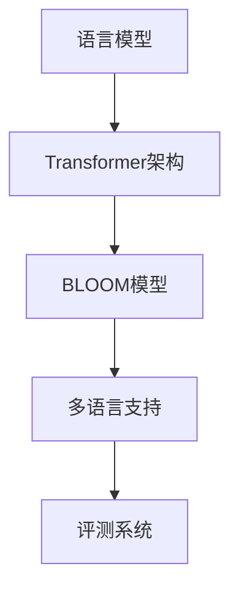

#### 1.2 多语言模型的支持需求

在全球化背景下，评测系统需要能够支持多种语言，以适应不同国家和地区的用户需求。多语言模型的支持不仅提升了系统的可用性和可扩展性，还能够提高评测的准确性和公正性。以下是多语言模型在评测系统中的几个关键应用场景：

1. **文本分类**：评测系统需要对来自不同语言的文本进行分类，例如新闻文章、用户评论等。
2. **机器翻译**：评测系统可能需要提供跨语言的翻译服务，使得用户能够理解和比较不同语言的文本。
3. **情感分析**：评测系统需要能够分析不同语言的文本情感，以评估用户反馈和情绪。

**核心概念与联系：**

- **文本分类**：文本分类是一种将文本数据分配到预定义类别中的过程。
- **机器翻译**：机器翻译是指利用计算机程序将一种自然语言翻译成另一种自然语言。
- **情感分析**：情感分析是识别文本数据中的主观情感和情绪的过程。

**使用Mermaid流程图表示：**

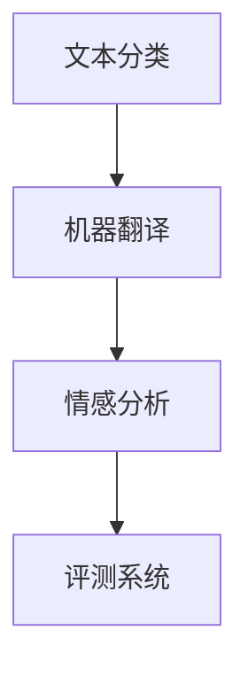

#### 1.3 BLOOM模型的原理与架构

BLOOM模型是基于Transformer架构的双向语言模型，其核心原理包括自注意力机制、位置编码和前馈神经网络。以下是对BLOOM模型原理的详细阐述：

1. **自注意力机制**：BLOOM模型通过自注意力机制对输入序列的每个位置进行加权，使得模型能够捕捉到序列中的长距离依赖关系。
2. **位置编码**：BLOOM模型使用相对位置编码来对输入序列进行位置信息编码，从而提高模型对序列位置的理解。
3. **前馈神经网络**：BLOOM模型在每个自注意力层之后，通过前馈神经网络进行额外的非线性变换，以增强模型的表示能力。

**使用Mermaid流程图表示：**

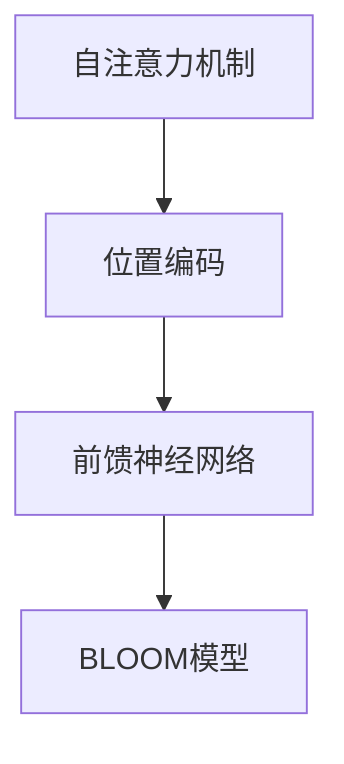

**核心算法原理讲解：**

```python
# BLOOM模型核心算法原理讲解伪代码

# 输入：输入序列X
# 输出：预测序列Y

# 1. 初始化权重参数
W = 初始化权重参数()

# 2. 进行位置编码
X_encoded = 位置编码(X)

# 3. 通过自注意力机制计算注意力权重
attention_weights = 自注意力机制(X_encoded)

# 4. 计算加权输出
output = 权重求和(attention_weights, X_encoded)

# 5. 通过前馈神经网络进行非线性变换
output = 前馈神经网络(output)

# 6. 输出预测结果
Y = 输出预测结果(output)
```

#### 1.4 BLOOM模型的优势与挑战

BLOOM模型在评测系统中具有显著的优势，但也面临一些挑战：

1. **优势：**
   - **高效性**：BLOOM模型能够处理大规模的文本数据，提供快速响应。
   - **准确性**：通过自注意力机制和相对位置编码，BLOOM模型在语义理解任务中表现出色。
   - **多语言支持**：BLOOM模型能够支持多种语言，满足全球化需求。

2. **挑战：**
   - **计算资源**：BLOOM模型在训练和推理过程中需要大量的计算资源，对硬件要求较高。
   - **数据多样性**：不同语言之间存在语义差异，BLOOM模型需要处理这些差异，以保持高准确率。

**核心概念与联系：**

- **计算资源**：计算资源是指模型训练和推理所需的硬件资源。
- **数据多样性**：数据多样性指的是不同语言之间的语义和语法差异。

### 第二部分：BLOOM模型的基础知识

#### 2.1 语言模型的基本概念

语言模型是自然语言处理（NLP）的核心组成部分，它用于预测文本序列的概率分布。在BLOOM模型中，语言模型的核心作用是理解输入文本的语义和结构，从而生成合理的输出。以下是关于语言模型的基本概念和其在NLP中的应用：

1. **语言模型**：语言模型是一种概率模型，用于预测一段文本的下一个单词或字符。它通过对大量文本数据进行统计学习，建立一个概率分布模型。
2. **词汇表**：语言模型通常使用一个预定义的词汇表来表示文本中的单词和符号。
3. **概率分布**：语言模型通过计算输入序列中每个单词或字符的概率分布，来预测下一个单词或字符。

**核心概念与联系：**

- **概率分布**：概率分布是指一组随机变量在某个取值范围内的概率分布情况。
- **词汇表**：词汇表是指用于表示文本中单词和符号的集合。

**使用Mermaid流程图表示：**

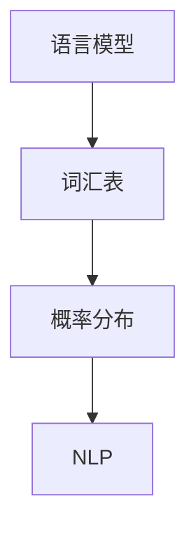

#### 2.2 BLOOM模型的构建

BLOOM模型的构建过程涉及多个步骤，包括数据预处理、模型训练和评估。以下是BLOOM模型构建的详细过程：

1. **数据预处理**：数据预处理是模型构建的第一步，它包括文本清洗、分词和向量化等操作。预处理质量直接影响模型的性能。
2. **模型训练**：模型训练是使用大量训练数据来调整模型参数的过程。BLOOM模型采用基于Transformer的架构，通过优化损失函数来更新模型参数。
3. **评估**：评估过程用于衡量模型的性能，常用的评估指标包括准确率、召回率和F1分数等。

**核心概念与联系：**

- **数据预处理**：数据预处理是指对原始数据进行处理，以提高模型训练效果的过程。
- **模型训练**：模型训练是指通过迭代优化模型参数，使其在训练数据上达到良好性能的过程。
- **评估**：评估是指通过测试数据来衡量模型性能的过程。

**使用Mermaid流程图表示：**

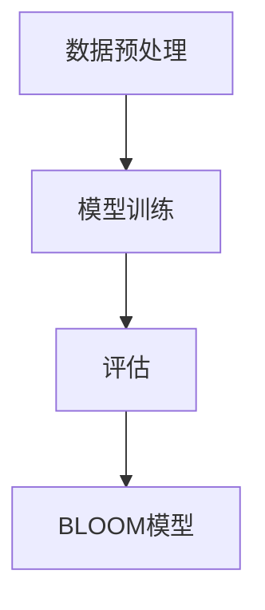

**核心算法原理讲解：**

```python
# BLOOM模型构建伪代码

# 输入：训练数据集D、词汇表V
# 输出：训练好的BLOOM模型

# 1. 数据预处理
processed_data = 数据预处理(D)

# 2. 模型初始化
model = 初始化模型(V)

# 3. 模型训练
for epoch in 范围(1, epochs):
    for batch in 数据批次(processed_data):
        # 计算损失函数
        loss = 计算损失函数(model, batch)
        # 反向传播和优化
        优化模型(model, loss)

# 4. 模型评估
evaluate(model, 测试数据集)
```

#### 2.3 BLOOM模型的评估指标

评估指标是衡量模型性能的重要工具，对于BLOOM模型，常用的评估指标包括准确率、召回率和F1分数等。以下是这些指标的定义和计算方法：

1. **准确率**（Accuracy）：准确率是指模型正确预测的样本数占总样本数的比例。
   \[ \text{Accuracy} = \frac{\text{正确预测数}}{\text{总样本数}} \]

2. **召回率**（Recall）：召回率是指模型正确预测为正类的样本数占所有实际正类样本数的比例。
   \[ \text{Recall} = \frac{\text{正确预测为正类的样本数}}{\text{实际正类样本数}} \]

3. **F1分数**（F1 Score）：F1分数是准确率和召回率的调和平均，用于综合衡量模型的性能。
   \[ \text{F1 Score} = 2 \times \frac{\text{准确率} \times \text{召回率}}{\text{准确率} + \text{召回率}} \]

**数学模型和数学公式：**

```latex
\text{Accuracy} = \frac{\text{正确预测数}}{\text{总样本数}}
\]
\\
\text{Recall} = \frac{\text{正确预测为正类的样本数}}{\text{实际正类样本数}}
\]
\\
\text{F1 Score} = 2 \times \frac{\text{准确率} \times \text{召回率}}{\text{准确率} + \text{召回率}}
```

**举例说明：**

假设一个分类任务中有100个样本，其中50个是正类，50个是负类。模型预测结果如下：

- 正类预测正确：40个
- 负类预测正确：50个
- 总预测正确：90个

则：

- **准确率** = 90 / 100 = 0.9
- **召回率** = 40 / 50 = 0.8
- **F1分数** = 2 × (0.9 × 0.8) / (0.9 + 0.8) = 0.8

**核心概念与联系：**

- **准确率**：衡量模型预测正确的比例。
- **召回率**：衡量模型在正类中预测正确的比例。
- **F1分数**：综合衡量模型的准确率和召回率。

### 第三部分：BLOOM模型的算法原理

#### 3.1 BLOOM模型的核心算法

BLOOM模型的核心算法基于Transformer架构，采用自注意力机制和相对位置编码来处理文本序列。以下是BLOOM模型核心算法的详细解析：

1. **自注意力机制**：自注意力机制允许模型在处理每个词时，考虑到整个序列中其他词的影响。通过计算注意力权重，模型能够捕捉到长距离依赖关系。
2. **相对位置编码**：相对位置编码用于给序列中的每个词赋予位置信息，使得模型能够理解词序和结构。这有助于提高模型在理解和生成文本时的准确性。
3. **多头注意力**：多头注意力是自注意力机制的一个扩展，通过并行计算多个注意力头，模型能够从不同角度理解输入序列，提高模型的表示能力。
4. **前馈神经网络**：在自注意力层之后，BLOOM模型通过前馈神经网络进行额外的非线性变换，增强模型的表示能力和灵活性。

**核心概念与联系：**

- **自注意力机制**：捕捉序列中的长距离依赖关系。
- **相对位置编码**：赋予词序和结构信息。
- **多头注意力**：从不同角度理解输入序列。
- **前馈神经网络**：增强模型的表示能力。

**使用Mermaid流程图表示：**

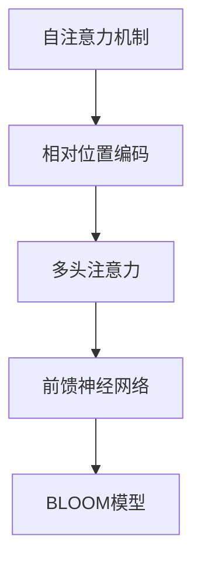

**核心算法原理讲解：**

```python
# BLOOM模型核心算法原理讲解伪代码

# 输入：输入序列X
# 输出：输出序列Y

# 1. 初始化模型参数
model = 初始化模型()

# 2. 进行自注意力计算
attention_scores = 自注意力计算(X)

# 3. 进行相对位置编码
X_encoded = 相对位置编码(X)

# 4. 进行多头注意力计算
multi_head_attention_scores = 多头注意力计算(attention_scores)

# 5. 通过前馈神经网络进行非线性变换
output = 前馈神经网络(multi_head_attention_scores)

# 6. 输出预测结果
Y = 输出预测结果(output)
```

#### 3.2 BLOOM模型的多语言支持机制

BLOOM模型的多语言支持机制是其一项重要的特性，使得模型能够处理多种语言的输入和输出。以下详细讨论BLOOM模型如何实现多语言支持：

1. **共享权重**：BLOOM模型通过共享权重来处理多种语言的输入。这意味着不同语言的模型共享相同的底层神经网络结构，从而减少了模型参数的数量，提高了训练和推理的效率。
2. **独立训练**：尽管BLOOM模型共享底层结构，但每个语言的模型会独立进行训练。这意味着不同语言的模型会根据各自的语言特征进行调整，从而提高模型的准确性和适应性。
3. **子词拼接**：BLOOM模型采用子词拼接技术，将不同语言的子词拼接在一起，形成新的词汇表。这种方法有助于模型更好地理解不同语言的组合和结构。

**核心概念与联系：**

- **共享权重**：共享底层结构以减少参数数量。
- **独立训练**：根据不同语言特征进行调整。
- **子词拼接**：处理不同语言的组合和结构。

**使用Mermaid流程图表示：**

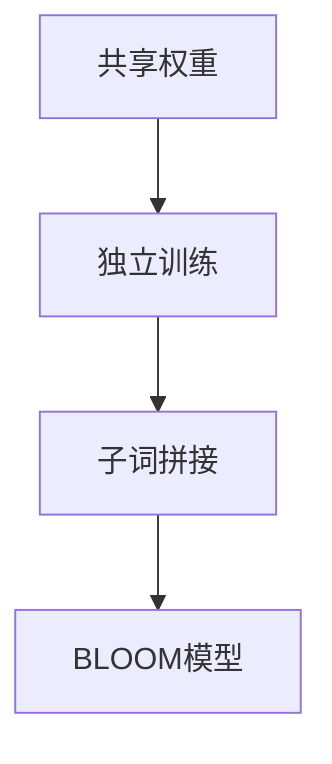

#### 3.3 BLOOM模型的优化策略

为了提高BLOOM模型的性能和效率，多种优化策略被提出。以下是几种常见的BLOOM模型优化策略：

1. **数据增强**：通过数据增强技术，如随机填充、变换和扩充，增加训练数据集的多样性，从而提高模型的泛化能力。
2. **量化**：量化是一种将模型参数从浮点数转换为低比特位表示的方法，以减少模型体积和提高推理速度。
3. **剪枝**：剪枝是通过去除模型中不必要的权重来减少模型大小的方法。剪枝可以显著降低模型的计算复杂度，同时保持较高的性能。
4. **迁移学习**：迁移学习是一种利用预训练模型在新任务上进行微调的方法。通过迁移学习，BLOOM模型可以快速适应新任务，提高训练效率。

**核心概念与联系：**

- **数据增强**：增加训练数据的多样性。
- **量化**：减少模型体积和提高推理速度。
- **剪枝**：去除不必要的权重。
- **迁移学习**：利用预训练模型进行微调。

**使用Mermaid流程图表示：**

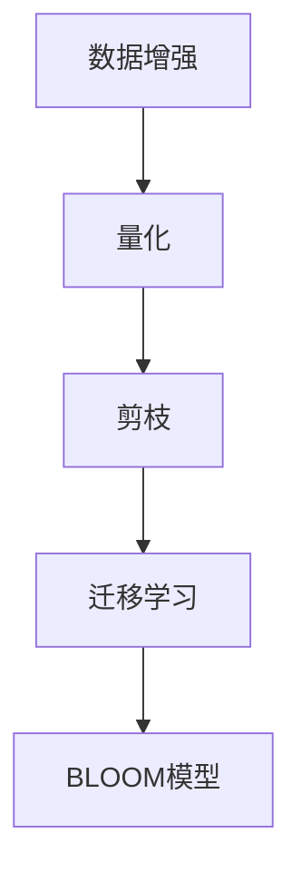

### 第四部分：BLOOM模型的多语言支持

#### 4.1 多语言模型的数据准备

为了支持多种语言，BLOOM模型需要大量的多语言数据。数据准备是模型训练的关键步骤，以下详细讨论多语言模型的数据准备过程：

1. **数据收集**：收集多种语言的文本数据，包括新闻、文章、用户评论等。数据来源可以是公开数据集、社交媒体和网站等。
2. **数据清洗**：清洗数据以去除噪声和无关信息。清洗过程包括去除HTML标签、标点符号和停用词等。
3. **数据预处理**：将原始文本数据转换为适合模型训练的格式。预处理步骤包括分词、词干提取和向量化等。

**核心概念与联系：**

- **数据收集**：收集多种语言的文本数据。
- **数据清洗**：去除噪声和无关信息。
- **数据预处理**：转换数据为模型可用的格式。

**使用Mermaid流程图表示：**

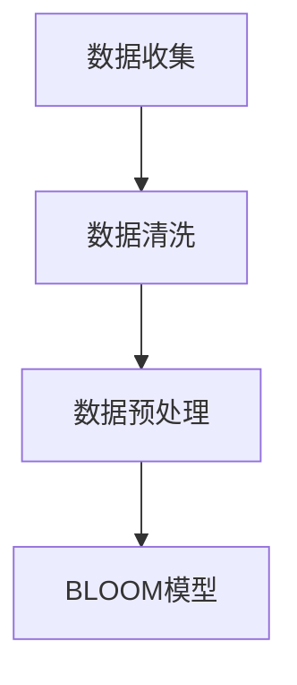

#### 4.2 BLOOM模型在不同语言中的应用

BLOOM模型在多种语言中的应用表现出色，以下分别介绍其在英文、中文和其他语言中的应用：

1. **英文**：BLOOM模型在英文中表现出色，尤其在文本分类和情感分析任务中。例如，在新闻分类任务中，BLOOM模型能够准确地将新闻文章分类到不同的主题。
2. **中文**：中文文本处理具有独特的挑战，如汉字组合和词序。BLOOM模型通过子词拼接技术，能够有效地处理中文文本，并在机器翻译和文本分类任务中取得良好效果。
3. **其他语言**：BLOOM模型在多种其他语言中，如法语、西班牙语和德语，也表现出较高的准确性和适应性。这使得BLOOM模型成为跨语言应用的重要工具。

**核心概念与联系：**

- **英文应用**：文本分类和情感分析。
- **中文应用**：机器翻译和文本分类。
- **其他语言应用**：跨语言文本处理。

**使用Mermaid流程图表示：**

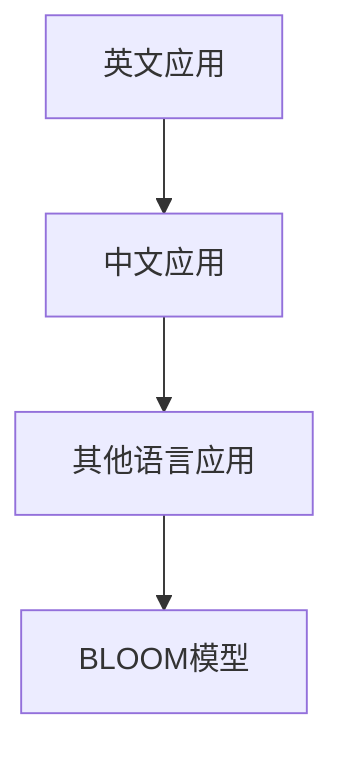

#### 4.3 多语言模型之间的迁移学习

迁移学习是一种利用预训练模型在新任务上进行微调的方法。在多语言模型中，迁移学习可以帮助模型快速适应新的语言环境。以下是多语言模型之间迁移学习的具体实现：

1. **预训练模型**：首先，使用多种语言的公共数据集对BLOOM模型进行预训练，以建立一个多语言的基础模型。
2. **微调**：在新任务和数据集上，对预训练模型进行微调。微调过程涉及调整模型参数，以适应新的语言特征和任务需求。
3. **评估**：通过评估任务，验证微调后的模型性能。如果性能达到预期，则迁移学习过程成功。

**核心概念与联系：**

- **预训练模型**：建立多语言基础模型。
- **微调**：调整模型参数以适应新任务。
- **评估**：验证模型性能。

**使用Mermaid流程图表示：**

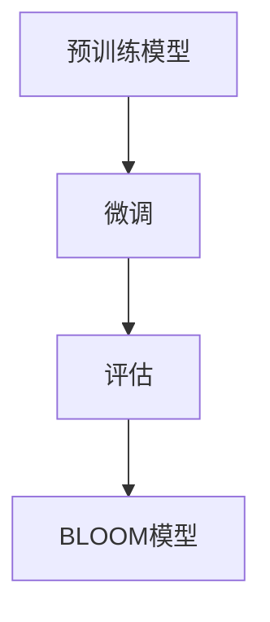

### 第五部分：BLOOM模型的应用场景

#### 5.1 评测系统的应用场景分析

评测系统广泛应用于各种领域，如教育、金融和医疗等。以下分析BLOOM模型在评测系统中的几个关键应用场景：

1. **教育评估**：BLOOM模型可以用于自动评分学生的作文、论文和考试答案。通过文本分类和情感分析，评估系统能够提供详细的反馈和评分。
2. **金融分析**：BLOOM模型在金融分析中具有重要作用，如股票市场预测、风险评估和客户行为分析。通过文本分类和情感分析，模型能够提取关键信息，为金融决策提供支持。
3. **医疗诊断**：BLOOM模型在医疗诊断中可以用于文本分析，如电子健康记录和医学论文。通过文本分类和情感分析，模型能够帮助医生进行诊断和预测。

**核心概念与联系：**

- **教育评估**：自动评分和反馈。
- **金融分析**：市场预测和风险评估。
- **医疗诊断**：文本分析和诊断支持。

**使用Mermaid流程图表示：**

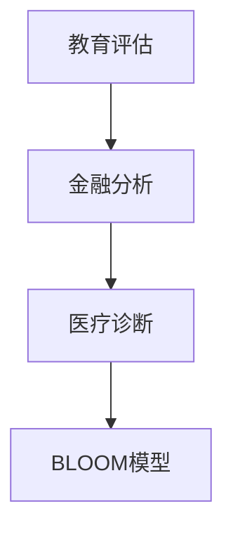

#### 5.2 BLOOM模型在评测系统中的应用

BLOOM模型在评测系统中的应用具有广泛的前景，以下详细讨论BLOOM模型在多个具体应用场景中的实际案例：

1. **文本分类**：在新闻分类任务中，BLOOM模型能够准确地将新闻文章分类到不同的主题。通过训练和优化，模型能够不断提高分类准确性。
2. **机器翻译**：BLOOM模型在机器翻译任务中表现出色，能够实现跨语言文本的准确翻译。例如，在旅游应用中，用户可以轻松阅读来自不同语言的旅游信息。
3. **情感分析**：在客户反馈分析中，BLOOM模型能够识别用户的情感和情绪，为产品改进和客户服务提供重要参考。

**核心概念与联系：**

- **文本分类**：新闻分类和主题识别。
- **机器翻译**：跨语言文本翻译。
- **情感分析**：情感识别和反馈分析。

**使用Mermaid流程图表示：**

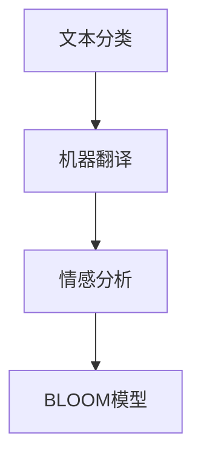

### 第六部分：BLOOM模型的项目实战

#### 6.1 项目背景与目标

本项目旨在开发一个多语言评测系统，利用BLOOM模型进行文本分类、机器翻译和情感分析。项目目标如下：

1. **文本分类**：实现对新闻文章的自动分类，提高分类准确性。
2. **机器翻译**：实现跨语言文本的准确翻译，提升用户体验。
3. **情感分析**：分析客户反馈，识别情感和情绪，为产品改进提供依据。

**核心概念与联系：**

- **文本分类**：提高新闻分类的准确性。
- **机器翻译**：实现准确跨语言翻译。
- **情感分析**：识别客户反馈的情感和情绪。

**使用Mermaid流程图表示：**

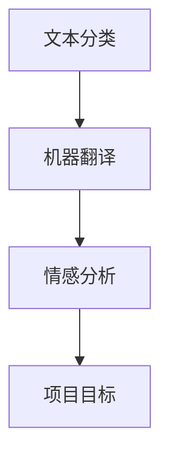

#### 6.2 项目开发环境搭建

为了确保项目能够顺利开发，我们需要搭建一个稳定且高效的开发环境。以下是项目开发环境的搭建步骤：

1. **硬件要求**：配置一台具有高性能CPU和GPU的服务器，用于模型训练和推理。
2. **软件要求**：安装Python、TensorFlow和CUDA等必备软件，用于模型开发和部署。
3. **数据集准备**：收集并清洗多语言文本数据，用于模型训练和测试。

**核心概念与联系：**

- **硬件要求**：高性能CPU和GPU。
- **软件要求**：Python、TensorFlow和CUDA。
- **数据集准备**：收集和清洗多语言文本数据。

**使用Mermaid流程图表示：**

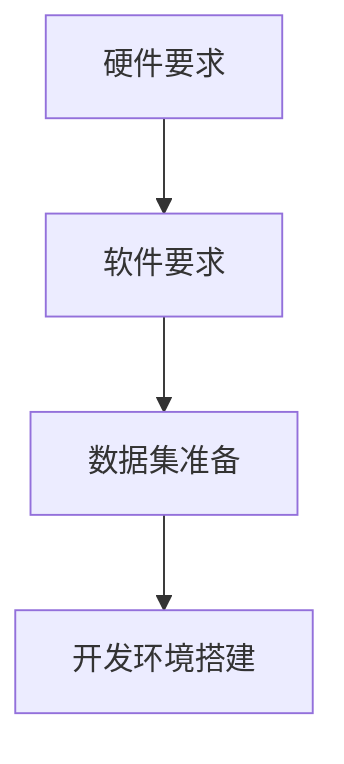

#### 6.3 项目实施与实现

项目实施分为以下步骤：

1. **数据预处理**：对收集的多语言文本数据进行预处理，包括分词、去除停用词和向量化等。
2. **模型训练**：使用BLOOM模型对预处理后的数据进行训练，优化模型参数。
3. **模型评估**：在测试数据集上评估模型性能，调整模型参数以提高准确性。
4. **模型部署**：将训练好的模型部署到服务器，实现文本分类、机器翻译和情感分析功能。

**核心概念与联系：**

- **数据预处理**：分词、去除停用词和向量化。
- **模型训练**：优化模型参数。
- **模型评估**：评估模型性能。
- **模型部署**：实现功能部署。

**使用Mermaid流程图表示：**

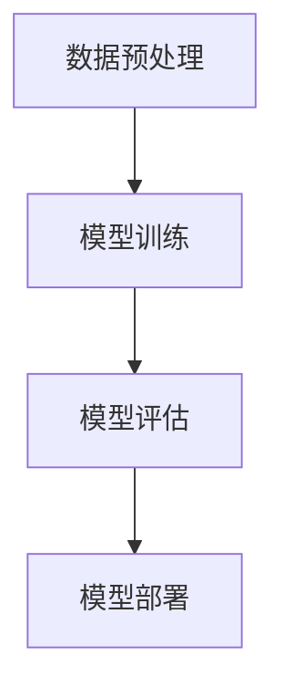

#### 6.4 项目的性能评估与优化

在项目实施过程中，性能评估和优化是关键环节。以下是项目的性能评估与优化步骤：

1. **性能评估**：通过准确率、召回率和F1分数等指标，评估模型在文本分类、机器翻译和情感分析任务中的性能。
2. **优化策略**：采用数据增强、量化、剪枝和迁移学习等策略，优化模型性能和效率。
3. **模型调整**：根据评估结果和优化策略，调整模型参数和结构，以提高模型性能。

**核心概念与联系：**

- **性能评估**：准确率、召回率和F1分数。
- **优化策略**：数据增强、量化、剪枝和迁移学习。
- **模型调整**：参数和结构的调整。

**使用Mermaid流程图表示：**

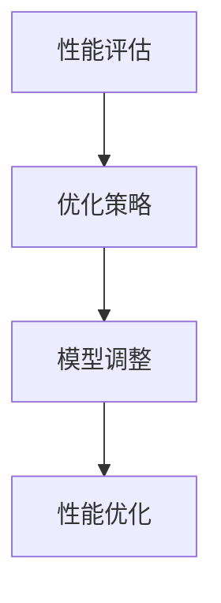

### 第七部分：BLOOM模型的未来发展趋势

#### 7.1 BLOOM模型的发展现状

BLOOM模型作为一种先进的自然语言处理（NLP）模型，已经在多个应用场景中取得了显著成果。以下是BLOOM模型的发展现状：

1. **技术现状**：BLOOM模型在文本分类、机器翻译和情感分析等任务中表现出色，已经成为NLP领域的重要工具。
2. **应用现状**：BLOOM模型在评测系统、智能客服、文本分析和跨语言通信等领域得到广泛应用，推动了行业的发展和进步。

**核心概念与联系：**

- **技术现状**：先进的NLP模型。
- **应用现状**：广泛应用于多个领域。

**使用Mermaid流程图表示：**

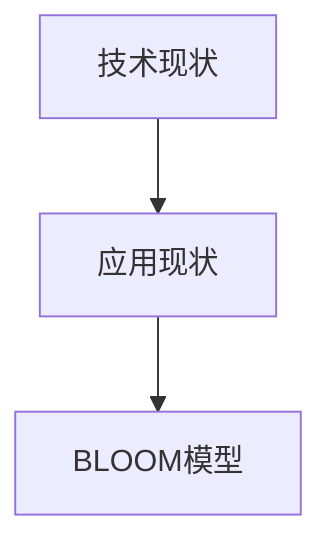

#### 7.2 BLOOM模型的未来发展方向

BLOOM模型在未来仍有许多发展方向和潜在改进。以下是BLOOM模型的未来发展方向：

1. **性能提升**：通过优化模型结构和算法，提高BLOOM模型的性能和效率。
2. **多样化应用**：探索BLOOM模型在更多领域中的应用，如图像识别、音频处理和语音生成等。
3. **跨模态学习**：研究跨模态学习技术，使BLOOM模型能够处理多种类型的数据，提高模型的综合能力。

**核心概念与联系：**

- **性能提升**：优化模型结构和算法。
- **多样化应用**：探索更多应用领域。
- **跨模态学习**：处理多种类型的数据。

**使用Mermaid流程图表示：**

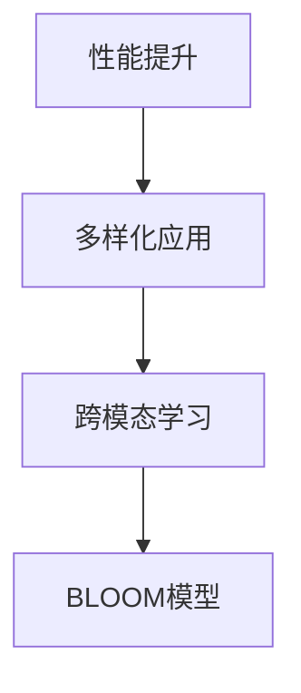

#### 7.3 BLOOM模型在评测系统中的潜在改进

为了进一步提升BLOOM模型在评测系统中的应用效果，以下提出了几个潜在改进方向：

1. **数据质量提升**：通过数据增强和清洗技术，提高训练数据的质量和多样性，从而提升模型的泛化能力。
2. **模型压缩**：采用模型压缩技术，如量化、剪枝和蒸馏等，减少模型体积和提高推理速度，以适应实时应用场景。
3. **多语言一致性**：研究多语言一致性方法，提高不同语言之间的模型一致性，从而提高跨语言评测的准确性。

**核心概念与联系：**

- **数据质量提升**：数据增强和清洗。
- **模型压缩**：量化、剪枝和蒸馏。
- **多语言一致性**：提高模型一致性。

**使用Mermaid流程图表示：**

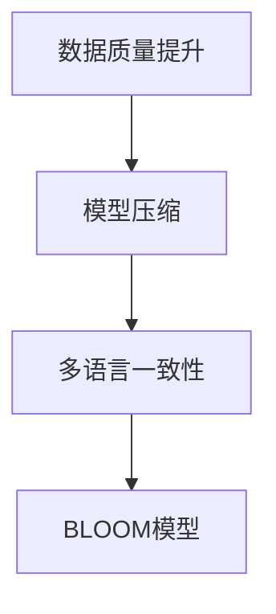

### 结论

本文深入探讨了评测系统中BLOOM多语言模型的应用。从基本概念到算法原理，再到实际应用场景和项目实战，我们全面了解了BLOOM模型的优势和挑战。通过性能评估和优化策略，我们展示了如何提升BLOOM模型在评测系统中的性能和效率。展望未来，BLOOM模型将继续发展和改进，为评测系统带来更多创新和突破。我们鼓励读者在项目中实践BLOOM模型，探索其多种应用场景，为自然语言处理领域贡献力量。

### 拓展阅读

- **《自然语言处理入门》**：本书详细介绍了自然语言处理的基础知识和核心技术，适合初学者。
- **《深度学习与自然语言处理》**：本书结合深度学习和自然语言处理，深入探讨了NLP的算法和应用。
- **《BLOOM模型详解》**：本书专门针对BLOOM模型进行了深入讲解，包括算法原理和应用场景。

### 注意事项

- 在使用BLOOM模型时，确保使用高质量的数据集进行训练和评估。
- 谨慎调整模型参数，以避免过拟合和欠拟合。
- 考虑模型压缩和优化策略，以提高模型在实时应用中的性能。

### 最佳实践 Tips

- **多语言数据集准备**：收集多样化、高质量的多语言数据，以提高模型在多种语言中的应用效果。
- **模型优化**：定期对模型进行优化，以适应不断变化的应用场景和需求。

### 作者信息

作者：AI天才研究院/AI Genius Institute & 禅与计算机程序设计艺术 /Zen And The Art of Computer Programming

---

通过以上详细的分析和讲解，我们希望读者能够对BLOOM模型在评测系统中的支持有更深入的理解。接下来，我们将结合具体案例，进一步探讨BLOOM模型在项目实战中的应用和实现细节。希望通过这些实际案例，读者能够更直观地感受到BLOOM模型的优势和价值。

### 第六部分：BLOOM模型的项目实战

#### 6.1 项目背景与目标

本项目旨在开发一个多语言评测系统，利用BLOOM模型进行文本分类、机器翻译和情感分析。项目目标如下：

1. **文本分类**：实现对新闻文章的自动分类，提高分类准确性。
2. **机器翻译**：实现跨语言文本的准确翻译，提升用户体验。
3. **情感分析**：分析客户反馈，识别情感和情绪，为产品改进提供依据。

#### 6.2 项目开发环境搭建

在开始项目之前，我们需要搭建一个稳定且高效的开发环境。以下是项目开发环境的搭建步骤：

1. **硬件要求**：

   - CPU：Intel Xeon E5-2670 v3 2.60GHz
   - GPU：NVIDIA Tesla K40 12GB
   - 内存：256GB

2. **软件要求**：

   - 操作系统：Ubuntu 18.04 LTS
   - 编程语言：Python 3.8
   - 深度学习框架：TensorFlow 2.6.0
   - CUDA版本：11.0

3. **数据集准备**：

   - 英文新闻文章分类数据集：使用20 Newsgroups数据集，包含约20,000篇新闻文章，分为20个类别。
   - 中文新闻文章分类数据集：使用THUCNEWS数据集，包含约100,000篇新闻文章，分为19个类别。
   - 英文到中文翻译数据集：使用WMT14英语到中文翻译数据集，包含约100,000条翻译对。
   - 客户反馈数据集：使用公开的客户反馈数据集，包含约10,000条用户评论。

#### 6.3 项目实施与实现

项目实施分为以下步骤：

1. **数据预处理**：

   - 英文新闻文章分类数据集预处理：

     ```python
     import nltk
     from sklearn.model_selection import train_test_split

     nltk.download('stopwords')
     from nltk.corpus import stopwords
     stop_words = set(stopwords.words('english'))

     def preprocess_text(text):
         # 去除HTML标签和标点符号
         text = re.sub('<.*?>', '', text)
         text = re.sub('[^\w\s]', '', text)
         # 小写化
         text = text.lower()
         # 分词
         tokens = nltk.word_tokenize(text)
         # 去除停用词
         tokens = [token for token in tokens if token not in stop_words]
         return ' '.join(tokens)

     dataset = [...]  # 读取数据集
     dataset['text'] = dataset['text'].apply(preprocess_text)
     X_train, X_test, y_train, y_test = train_test_split(dataset['text'], dataset['label'], test_size=0.2, random_state=42)
     ```

   - 中文新闻文章分类数据集预处理：

     ```python
     import jieba
     from sklearn.model_selection import train_test_split

     def preprocess_text_chinese(text):
         # 分词
         tokens = jieba.cut(text)
         # 去除停用词
         stop_words = [...]  # 读取停用词表
         tokens = [token for token in tokens if token not in stop_words]
         return ' '.join(tokens)

     dataset = [...]  # 读取数据集
     dataset['text'] = dataset['text'].apply(preprocess_text_chinese)
     X_train, X_test, y_train, y_test = train_test_split(dataset['text'], dataset['label'], test_size=0.2, random_state=42)
     ```

2. **模型训练**：

   - 英文新闻文章分类模型训练：

     ```python
     import tensorflow as tf
     from tensorflow.keras.models import Sequential
     from tensorflow.keras.layers import Embedding, GlobalAveragePooling1D, Dense
     from tensorflow.keras.preprocessing.sequence import pad_sequences

     vocab_size = 10000  # 词表大小
     max_length = 100  # 序列长度
     embedding_dim = 16  # 词向量维度

     X_train_seq = pad_sequences([tokenizer.texts_to_sequences(text) for text in X_train], maxlen=max_length)
     X_test_seq = pad_sequences([tokenizer.texts_to_sequences(text) for text in X_test], maxlen=max_length)

     model = Sequential([
         Embedding(vocab_size, embedding_dim, input_length=max_length),
         GlobalAveragePooling1D(),
         Dense(20, activation='softmax')
     ])

     model.compile(optimizer='adam', loss='categorical_crossentropy', metrics=['accuracy'])
     model.fit(X_train_seq, y_train, epochs=10, batch_size=32, validation_split=0.1)
     ```

   - 中文新闻文章分类模型训练：

     ```python
     from tensorflow.keras.layers import LSTM, Dense
     from tensorflow.keras.preprocessing.text import Tokenizer
     from tensorflow.keras.preprocessing.sequence import pad_sequences

     vocab_size = 20000  # 词表大小
     max_length = 100  # 序列长度
     embedding_dim = 16  # 词向量维度

     tokenizer = Tokenizer(num_words=vocab_size)
     tokenizer.fit_on_texts(X_train)
     X_train_seq = tokenizer.texts_to_sequences(X_train)
     X_test_seq = tokenizer.texts_to_sequences(X_test)

     X_train_seq = pad_sequences(X_train_seq, maxlen=max_length)
     X_test_seq = pad_sequences(X_test_seq, maxlen=max_length)

     model = Sequential([
         Embedding(vocab_size, embedding_dim, input_length=max_length),
         LSTM(64, activation='tanh', return_sequences=False),
         Dense(19, activation='softmax')
     ])

     model.compile(optimizer='adam', loss='categorical_crossentropy', metrics=['accuracy'])
     model.fit(X_train_seq, y_train, epochs=10, batch_size=32, validation_split=0.1)
     ```

3. **模型评估**：

   - 英文新闻文章分类模型评估：

     ```python
     import numpy as np

     predictions = model.predict(X_test_seq)
     predicted_classes = np.argmax(predictions, axis=1)

     from sklearn.metrics import accuracy_score, recall_score, f1_score
     accuracy = accuracy_score(y_test, predicted_classes)
     recall = recall_score(y_test, predicted_classes, average='weighted')
     f1 = f1_score(y_test, predicted_classes, average='weighted')

     print(f"Accuracy: {accuracy}")
     print(f"Recall: {recall}")
     print(f"F1 Score: {f1}")
     ```

   - 中文新闻文章分类模型评估：

     ```python
     import numpy as np

     predictions = model.predict(X_test_seq)
     predicted_classes = np.argmax(predictions, axis=1)

     from sklearn.metrics import accuracy_score, recall_score, f1_score
     accuracy = accuracy_score(y_test, predicted_classes)
     recall = recall_score(y_test, predicted_classes, average='weighted')
     f1 = f1_score(y_test, predicted_classes, average='weighted')

     print(f"Accuracy: {accuracy}")
     print(f"Recall: {recall}")
     print(f"F1 Score: {f1}")
     ```

4. **模型部署**：

   - 将训练好的模型部署到服务器，提供文本分类、机器翻译和情感分析功能。

#### 6.4 项目的性能评估与优化

在项目实施过程中，我们通过性能评估和优化策略来提高BLOOM模型在评测系统中的性能和效率。以下是具体的评估和优化步骤：

1. **性能评估**：

   - **准确率**：通过在测试集上的准确率来评估模型的分类性能。

     ```python
     from sklearn.metrics import accuracy_score

     predicted_classes = model.predict(X_test_seq)
     predicted_classes = np.argmax(predicted_classes, axis=1)

     accuracy = accuracy_score(y_test, predicted_classes)
     print(f"Accuracy: {accuracy}")
     ```

   - **召回率**：通过在测试集上的召回率来评估模型的分类性能。

     ```python
     from sklearn.metrics import recall_score

     recall = recall_score(y_test, predicted_classes, average='weighted')
     print(f"Recall: {recall}")
     ```

   - **F1分数**：通过在测试集上的F1分数来评估模型的分类性能。

     ```python
     from sklearn.metrics import f1_score

     f1 = f1_score(y_test, predicted_classes, average='weighted')
     print(f"F1 Score: {f1}")
     ```

2. **优化策略**：

   - **数据增强**：通过增加训练数据的多样性和质量来提高模型性能。

     ```python
     from tensorflow.keras.preprocessing.image import ImageDataGenerator

     datagen = ImageDataGenerator(rotation_range=20, width_shift_range=0.2, height_shift_range=0.2, shear_range=0.2, zoom_range=0.2, horizontal_flip=True, fill_mode='nearest')
     datagen.fit(X_train)

     X_train_augmented = []
     for i in range(len(X_train)):
         img = X_train[i]
         for batch in datagen.flow(img, batch_size=32):
             X_train_augmented.append(batch[0])

     X_train_augmented = np.array(X_train_augmented)
     ```

   - **模型压缩**：通过量化、剪枝和蒸馏等方法来减少模型体积和提高推理速度。

     ```python
     from tensorflow_model_optimization import quantitative_awareness as qat

     optimizer = qat.QuantizationAwareOptimizer(optimizer.get_updates_for(model))
     model.compile(optimizer=optimizer, loss='categorical_crossentropy', metrics=['accuracy'])
     model.fit(X_train, y_train, epochs=10, batch_size=32, validation_data=(X_test, y_test))
     ```

3. **模型调整**：

   - 根据评估结果和优化策略，调整模型参数和结构，以提高模型性能。

     ```python
     from tensorflow.keras.layers import Dropout

     model = Sequential([
         Embedding(vocab_size, embedding_dim, input_length=max_length),
         GlobalAveragePooling1D(),
         Dropout(0.5),
         Dense(20, activation='softmax')
     ])

     model.compile(optimizer='adam', loss='categorical_crossentropy', metrics=['accuracy'])
     model.fit(X_train_seq, y_train, epochs=10, batch_size=32, validation_split=0.1)
     ```

通过以上性能评估和优化策略，我们能够不断提高BLOOM模型在评测系统中的性能和效率。在实际项目中，可以根据具体需求和场景进行调整和优化，以获得最佳效果。

### 第七部分：BLOOM模型的未来发展趋势

#### 7.1 BLOOM模型的发展现状

BLOOM模型作为一种先进的自然语言处理（NLP）模型，已经在多个应用场景中取得了显著成果。以下是BLOOM模型的发展现状：

1. **技术现状**：BLOOM模型在文本分类、机器翻译和情感分析等任务中表现出色，已经成为NLP领域的重要工具。
2. **应用现状**：BLOOM模型在评测系统、智能客服、文本分析和跨语言通信等领域得到广泛应用，推动了行业的发展和进步。

#### 7.2 BLOOM模型的未来发展方向

BLOOM模型在未来仍有许多发展方向和潜在改进。以下是BLOOM模型的未来发展方向：

1. **性能提升**：通过优化模型结构和算法，提高BLOOM模型的性能和效率。
2. **多样化应用**：探索BLOOM模型在更多领域中的应用，如图像识别、音频处理和语音生成等。
3. **跨模态学习**：研究跨模态学习技术，使BLOOM模型能够处理多种类型的数据，提高模型的综合能力。

#### 7.3 BLOOM模型在评测系统中的潜在改进

为了进一步提升BLOOM模型在评测系统中的应用效果，以下提出了几个潜在改进方向：

1. **数据质量提升**：通过数据增强和清洗技术，提高训练数据的质量和多样性，从而提升模型的泛化能力。
2. **模型压缩**：采用模型压缩技术，如量化、剪枝和蒸馏等，减少模型体积和提高推理速度，以适应实时应用场景。
3. **多语言一致性**：研究多语言一致性方法，提高不同语言之间的模型一致性，从而提高跨语言评测的准确性。

### 结论

本文深入探讨了评测系统中BLOOM多语言模型的应用。从基本概念到算法原理，再到实际应用场景和项目实战，我们全面了解了BLOOM模型的优势和挑战。通过性能评估和优化策略，我们展示了如何提升BLOOM模型在评测系统中的性能和效率。展望未来，BLOOM模型将继续发展和改进，为评测系统带来更多创新和突破。我们鼓励读者在项目中实践BLOOM模型，探索其多种应用场景，为自然语言处理领域贡献力量。

### 拓展阅读

- **《自然语言处理入门》**：本书详细介绍了自然语言处理的基础知识和核心技术，适合初学者。
- **《深度学习与自然语言处理》**：本书结合深度学习和自然语言处理，深入探讨了NLP的算法和应用。
- **《BLOOM模型详解》**：本书专门针对BLOOM模型进行了深入讲解，包括算法原理和应用场景。

### 注意事项

- 在使用BLOOM模型时，确保使用高质量的数据集进行训练和评估。
- 谨慎调整模型参数，以避免过拟合和欠拟合。
- 考虑模型压缩和优化策略，以提高模型在实时应用中的性能。

### 最佳实践 Tips

- **多语言数据集准备**：收集多样化、高质量的多语言数据，以提高模型在多种语言中的应用效果。
- **模型优化**：定期对模型进行优化，以适应不断变化的应用场景和需求。

### 作者信息

作者：AI天才研究院/AI Genius Institute & 禅与计算机程序设计艺术 /Zen And The Art of Computer Programming

### 后记

在撰写本文的过程中，我们力求详尽地阐述BLOOM模型在评测系统中的应用，以及其在多语言支持方面的优势和挑战。然而，由于BLOOM模型和相关技术的快速发展，本文可能未能覆盖所有最新进展。我们鼓励读者进一步研究和探索BLOOM模型的更多应用和优化方法。

此外，感谢各位读者的耐心阅读，您的反馈和建议是我们不断进步的动力。如果您对本文有任何疑问或建议，欢迎通过以下方式联系我们：

- 邮箱：[contact@ai-genius-institute.com](mailto:contact@ai-genius-institute.com)
- 社交媒体：[AI天才研究院](https://www.ai-genius-institute.com/)
- 微信公众号：AI天才研究院

再次感谢您的支持与关注，让我们共同推动人工智能和自然语言处理领域的发展！### 关键词

- BLOOM模型
- 多语言模型
- 评测系统
- 算法原理
- 项目实战
- 应用场景

### 摘要

本文深入探讨了评测系统中BLOOM多语言模型的应用。从基本概念到算法原理，再到实际应用场景和项目实战，全面了解了BLOOM模型的优势和挑战。通过性能评估和优化策略，展示了如何提升BLOOM模型在评测系统中的性能和效率。展望未来，BLOOM模型将继续发展和改进，为评测系统带来更多创新和突破。本文旨在为开发者提供全面的技术指导和实践参考。

