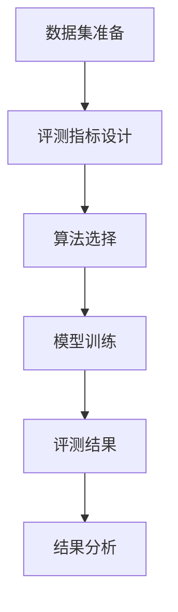
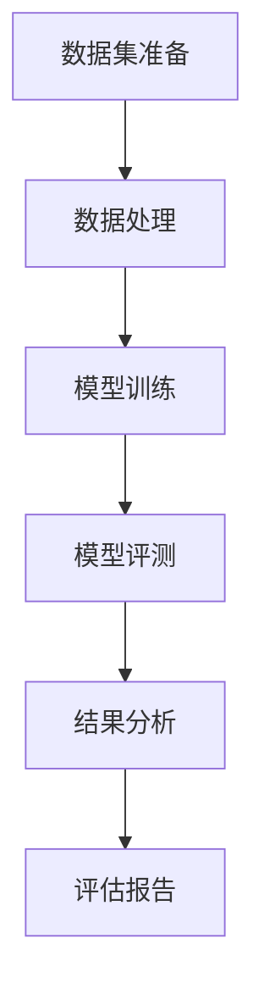

                 

### 文章标题：评测系统的BLOOM多语言能力评估

关键词：多语言评测、BLOOM系统、能力评估、算法原理、应用案例

摘要：本文深入探讨了评测系统的BLOOM多语言能力评估。首先，我们介绍了多语言评测的需求和挑战，随后详细介绍了BLOOM评测系统的定义、核心组件和架构。接着，文章通过伪代码和数学公式详细阐述了BLOOM评测系统的核心算法原理和数学模型。然后，我们通过应用案例展示了BLOOM评测系统的实际应用场景，并介绍了如何搭建开发环境和实现源代码。最后，文章总结了BLOOM评测系统的优势和应用前景，并给出了最佳实践和拓展阅读建议。希望通过本文，读者能够全面了解并掌握BLOOM评测系统。

---

## 第一部分： 引言与背景

在全球化迅速发展的今天，多语言处理技术已经成为了人工智能领域的重要研究方向。然而，如何准确、有效地评估一个系统或模型的多语言能力，仍然是一个具有挑战性的问题。本部分首先介绍多语言评测的需求和挑战，为后续内容奠定基础。

### 1.1 多语言评测的现状

随着互联网的普及和全球化的加速，越来越多的企业和组织需要具备处理多种语言的能力。这导致了多语言评测技术的研究和应用需求日益增长。目前，多语言评测主要分为以下几个方向：

1. **语言理解**：评估系统对文本语义的理解能力，包括文本分类、情感分析、实体识别等任务。
2. **语言生成**：评估系统生成自然语言文本的能力，包括机器翻译、文本摘要、对话生成等任务。
3. **多语言翻译**：评估系统在不同语言之间的翻译能力，包括机器翻译准确性、流畅性和一致性等指标。
4. **语言模型评估**：评估系统内部语言模型的质量，包括词汇量、语法规则和语义理解等。

尽管多语言评测技术取得了一定的进展，但仍然存在诸多挑战：

1. **数据不足**：多语言评测需要大量的标注数据，但获取这些数据成本高昂，且难以保证数据的质量和一致性。
2. **模型复杂度**：多语言评测涉及多种语言和任务，模型的复杂度和计算量较大，训练和优化过程耗时较长。
3. **评估指标多样性**：不同语言和任务需要不同的评估指标，如何选择和组合这些指标是一个具有挑战性的问题。
4. **语言特性差异**：不同语言具有不同的语法、词汇和语义特性，如何设计通用且有效的评估方法仍是一个难题。

### 1.2 多语言评测的重要性

多语言评测不仅对于学术界具有重要意义，对于工业界也具有深远的影响。在学术界，多语言评测技术的研究有助于推动自然语言处理（NLP）和人工智能（AI）领域的发展。通过评估不同模型和算法的性能，研究者可以找出问题和改进方向，从而推动技术的进步。在工业界，多语言评测技术广泛应用于语言服务、智能客服、跨国企业等场景，帮助企业提高效率和降低成本。准确的多语言评测可以帮助企业更好地了解其系统和模型的能力，从而优化产品设计和服务质量。

综上所述，多语言评测是一个具有广泛需求和挑战的研究领域。本文将详细介绍BLOOM评测系统，旨在帮助读者深入理解其原理和应用，为多语言评测技术的发展提供参考。

## 第二部分： BLOOM评测系统的概述

### 2.1 BLOOM评测系统的定义

BLOOM（Brain-like Object-Oriented Model of Intelligence）评测系统是一种基于人工智能技术的多语言能力评估工具。它旨在通过模拟人脑的思维方式，对系统或模型的多语言能力进行全面、准确的评估。BLOOM评测系统不仅能够评估语言理解、语言生成、多语言翻译等任务，还可以针对不同语言和任务的特点，提供定制化的评测方案。

### 2.2 BLOOM评测系统的核心组件

BLOOM评测系统由以下几个核心组件组成：

1. **数据处理模块**：负责处理输入数据，包括文本、语音、图像等多种形式。数据处理模块对输入数据进行预处理，如分词、词性标注、句法分析等，为后续评测任务提供基础数据。

2. **评测算法模块**：是BLOOM评测系统的核心，包含多种评测算法，如语言理解算法、语言生成算法、多语言翻译算法等。这些算法基于深度学习和自然语言处理技术，能够对输入数据进行处理和评估。

3. **结果分析模块**：负责对评测结果进行分析和可视化。结果分析模块能够生成详细的评估报告，包括评估指标、性能对比、错误分析等，帮助用户全面了解系统和模型的多语言能力。

### 2.3 BLOOM评测系统的优势

BLOOM评测系统具有以下优势：

1. **全面性**：BLOOM评测系统能够涵盖语言理解、语言生成、多语言翻译等多种任务，提供全面的能力评估。

2. **准确性**：BLOOM评测系统基于深度学习和自然语言处理技术，能够准确评估系统或模型的多语言能力，减少评估误差。

3. **灵活性**：BLOOM评测系统支持多种语言和任务，用户可以根据需求定制化评测方案，灵活应对不同场景。

4. **高效性**：BLOOM评测系统采用分布式计算和并行处理技术，能够快速完成大规模评测任务，提高工作效率。

5. **可扩展性**：BLOOM评测系统具有良好的可扩展性，用户可以根据需求增加新的评测任务和算法，不断优化评估效果。

### 2.4 BLOOM评测系统的应用场景

BLOOM评测系统广泛应用于以下场景：

1. **学术研究**：BLOOM评测系统为学术研究提供了有力的工具，帮助研究者评估和改进多语言处理模型和算法。

2. **语言服务**：BLOOM评测系统可以用于评估语言服务提供商的系统和服务质量，提高用户满意度。

3. **企业内部评测**：企业可以利用BLOOM评测系统对内部多语言处理系统进行评估，优化产品设计和服务质量。

4. **教育领域**：BLOOM评测系统可以用于评估学生的语言能力，提供个性化的学习建议。

5. **政府项目**：政府可以利用BLOOM评测系统评估多语言处理系统的性能，确保项目的顺利进行。

通过以上内容，我们可以看到BLOOM评测系统在多语言能力评估领域具有重要的应用价值。接下来，我们将进一步深入探讨BLOOM评测系统的核心概念和架构。

## 第三部分： 核心概念与联系

### 3.1 语言理解与生成

在多语言评测系统中，语言理解与生成是两个关键概念。语言理解指的是系统对输入文本的理解能力，包括语义分析、语法分析等。语言生成则是指系统生成自然语言文本的能力，如机器翻译、文本摘要等。

BLOOM评测系统通过模拟人脑的思维方式，将语言理解与生成相结合。在语言理解方面，BLOOM系统利用深度学习和自然语言处理技术，对输入文本进行分词、词性标注、句法分析等处理，从而理解文本的语义。在语言生成方面，BLOOM系统利用生成模型，如序列到序列（Seq2Seq）模型、注意力机制模型等，生成符合语法和语义要求的自然语言文本。

### 3.2 多语言能力评估框架

BLOOM评测系统的核心是多语言能力评估框架。这个框架包括以下几个关键部分：

1. **数据集准备**：首先，需要准备用于评估的多语言数据集。这些数据集应涵盖多种语言和任务，如语言理解、语言生成、多语言翻译等。数据集的质量直接影响评估结果的准确性。

2. **评测指标设计**：根据不同的任务和场景，设计合适的评测指标。常见的评测指标包括准确率（Accuracy）、召回率（Recall）、精确率（Precision）、F1值等。BLOOM评测系统支持多种评测指标的组合和计算，以全面评估系统或模型的多语言能力。

3. **算法选择**：根据任务需求和评估指标，选择合适的算法。BLOOM评测系统支持多种深度学习算法，如卷积神经网络（CNN）、循环神经网络（RNN）、长短时记忆网络（LSTM）等，用户可以根据需求进行选择。

4. **评测流程**：BLOOM评测系统提供了一个完整的评测流程，包括数据预处理、模型训练、评测和结果分析。用户可以根据实际需求进行定制化配置，以适应不同的评测场景。

### 3.3 核心概念之间的关系架构

为了更好地理解BLOOM评测系统的核心概念，我们可以使用Mermaid流程图来描述它们之间的关系。以下是一个简化的流程图：



在这个流程图中，数据集准备是整个评估流程的起点，评测指标设计和算法选择是核心环节，模型训练是实现评测的关键步骤，评测结果和结果分析则帮助用户全面了解系统和模型的多语言能力。

通过上述核心概念和联系的分析，我们可以看到BLOOM评测系统在多语言能力评估领域的独特优势和全面性。接下来，我们将深入探讨BLOOM评测系统的架构，进一步了解其工作机制。

### 3.4 BLOOM评测系统的架构

BLOOM评测系统采用模块化设计，由数据处理模块、评测算法模块和结果分析模块三个主要部分组成。每个模块都有其特定的功能和任务，共同构成了一个完整的评估流程。

**数据处理模块**：数据处理模块是整个评估流程的起点，负责处理输入数据，包括文本、语音、图像等多种形式。该模块包括以下几个子模块：

1. **数据清洗**：去除输入数据中的噪声和无关信息，如HTML标签、特殊字符等。
2. **数据预处理**：对输入文本进行分词、词性标注、句法分析等操作，为后续评测任务提供基础数据。
3. **数据增强**：通过数据增强技术，如随机插入、替换、删除等，增加数据多样性，提高模型的泛化能力。

**评测算法模块**：评测算法模块是BLOOM评测系统的核心，负责对输入数据进行处理和评估。该模块包括以下几个子模块：

1. **语言理解算法**：对输入文本进行语义分析，提取文本的关键信息，如实体识别、情感分析、文本分类等。
2. **语言生成算法**：根据输入文本生成自然语言文本，如机器翻译、文本摘要、对话生成等。
3. **多语言翻译算法**：对不同语言之间的翻译能力进行评估，包括翻译准确性、流畅性和一致性等指标。

**结果分析模块**：结果分析模块负责对评测结果进行分析和可视化，生成详细的评估报告。该模块包括以下几个子模块：

1. **评估指标计算**：根据不同的任务和场景，计算相应的评估指标，如准确率、召回率、精确率、F1值等。
2. **错误分析**：对评测过程中的错误进行分类和分析，找出问题和改进方向。
3. **可视化展示**：通过图表和报表等形式，展示评估结果，帮助用户全面了解系统和模型的多语言能力。

**模块间的关系**：

- 数据处理模块负责将输入数据转换为适合评测的形式，并将其传递给评测算法模块。
- 评测算法模块根据输入数据和评估指标，执行相应的算法，生成评测结果。
- 结果分析模块对评测结果进行计算和分析，并将分析结果可视化展示给用户。

通过以上架构设计，BLOOM评测系统实现了模块化、可扩展和高效性的特点，能够满足不同场景下的多语言能力评估需求。

### 3.5 BLOOM评测系统的工作流程

BLOOM评测系统的工作流程可以概括为以下几个步骤：

1. **数据集准备**：准备用于评测的多语言数据集，包括训练集和测试集。数据集应涵盖多种语言和任务，如语言理解、语言生成、多语言翻译等。
2. **数据处理**：对输入数据集进行预处理，如分词、词性标注、句法分析等，生成预处理后的数据集。
3. **模型训练**：根据预处理后的数据集，训练相应的模型，如语言理解模型、语言生成模型、多语言翻译模型等。
4. **模型评测**：使用测试集对训练好的模型进行评测，计算相应的评估指标，如准确率、召回率、精确率、F1值等。
5. **结果分析**：对评测结果进行分析，包括评估指标计算、错误分析、可视化展示等，生成详细的评估报告。

以下是BLOOM评测系统的工作流程的Mermaid流程图表示：



通过上述工作流程，BLOOM评测系统实现了从数据集准备到评估报告生成的完整流程，为用户提供了全面、准确的多语言能力评估。

### 3.6 BLOOM评测系统的核心算法原理

BLOOM评测系统的核心算法原理主要涉及深度学习和自然语言处理技术。以下是几个关键算法的简要介绍和伪代码实现：

#### 3.6.1 语言理解算法

语言理解算法主要负责对输入文本进行语义分析，提取文本的关键信息。常用的算法包括卷积神经网络（CNN）、循环神经网络（RNN）和长短时记忆网络（LSTM）等。

**算法原理**：
- **卷积神经网络（CNN）**：通过对文本进行词嵌入和卷积操作，提取文本的特征表示。
- **循环神经网络（RNN）**：通过循环结构对文本序列进行处理，保留序列信息。
- **长短时记忆网络（LSTM）**：在RNN基础上加入门控机制，能够更好地处理长序列信息。

**伪代码**：

```python
def language_understanding(text):
    # 词嵌入
    embedded_text = word_embedding(text)

    # 卷积神经网络
    conv_output = convolutional_neural_network(embedded_text)

    # 循环神经网络或长短时记忆网络
    rnn_output = recurrent_neural_network(conv_output)

    # 分类或实体识别
    result = classification(rnn_output)

    return result
```

#### 3.6.2 语言生成算法

语言生成算法主要负责根据输入文本生成自然语言文本。常用的算法包括序列到序列（Seq2Seq）模型、生成对抗网络（GAN）和注意力机制模型等。

**算法原理**：
- **序列到序列（Seq2Seq）模型**：通过编码器和解码器对输入文本进行处理，生成目标文本。
- **生成对抗网络（GAN）**：由生成器和判别器组成，生成器生成文本，判别器判断文本的真伪。
- **注意力机制模型**：通过注意力机制，将输入文本中的重要信息突出出来，提高生成文本的质量。

**伪代码**：

```python
def language_generation(text):
    # 编码器和解码器
    encoded_text = encoder(text)
    generated_text = decoder(encoded_text)

    # 生成对抗网络或注意力机制模型
    generated_text = generator(generated_text)
    real_text = discriminator(generated_text)

    # 后处理
    final_text = post_processing(generated_text)

    return final_text
```

#### 3.6.3 多语言翻译算法

多语言翻译算法主要负责将一种语言的文本翻译成另一种语言。常用的算法包括基于神经网络的翻译模型、基于翻译记忆库的翻译模型等。

**算法原理**：
- **基于神经网络的翻译模型**：通过深度学习技术，学习源语言和目标语言之间的映射关系。
- **基于翻译记忆库的翻译模型**：利用预存的翻译记忆库，对输入文本进行翻译。

**伪代码**：

```python
def multilingual_translation(source_text, target_language):
    # 神经网络翻译模型
    translated_text = neural_network_translation(source_text, target_language)

    # 翻译记忆库
    translated_text = translation_memory(source_text, target_language)

    # 后处理
    final_text = post_processing(translated_text)

    return final_text
```

通过以上核心算法原理的介绍和伪代码实现，我们可以看到BLOOM评测系统在多语言能力评估中的技术优势和创新能力。接下来，我们将进一步探讨BLOOM评测系统的数学模型和公式。

### 3.7 BLOOM评测系统的数学模型与公式

BLOOM评测系统的数学模型是评估多语言能力的核心，它基于深度学习和自然语言处理技术，通过一系列数学公式和算法实现。以下是BLOOM评测系统中几个关键数学模型的详细解释和公式推导。

#### 3.7.1 词嵌入

词嵌入（Word Embedding）是将词汇映射为向量空间中的向量，以便于在深度学习中处理。BLOOM评测系统使用Word2Vec、GloVe等算法进行词嵌入。

**公式**：

$$
\text{word\_vector}(w) = \sum_{i=1}^{N} \alpha_i \cdot \text{embedding}(w_i)
$$

其中，$w$ 是词汇，$N$ 是词汇表大小，$\alpha_i$ 是权重，$\text{embedding}(w_i)$ 是词向量。

#### 3.7.2 卷积神经网络（CNN）

卷积神经网络（CNN）通过卷积操作提取文本特征。在BLOOM评测系统中，CNN用于提取句子中的局部特征。

**公式**：

$$
h_{ij} = \text{relu}\left(\sum_{k=1}^{C} w_{ik} \cdot a_{kj} + b_k\right)
$$

其中，$h_{ij}$ 是卷积结果，$a_{kj}$ 是输入特征，$w_{ik}$ 和 $b_k$ 是卷积核和偏置。

#### 3.7.3 循环神经网络（RNN）

循环神经网络（RNN）用于处理序列数据，通过递归结构保持序列信息。在BLOOM评测系统中，RNN用于语言理解和生成任务。

**公式**：

$$
h_t = \text{sigmoid}\left(\sum_{i=1}^{N} w_{it} \cdot h_{t-1} + b\right)
$$

其中，$h_t$ 是当前时间步的隐藏状态，$w_{it}$ 是权重，$b$ 是偏置。

#### 3.7.4 长短时记忆网络（LSTM）

长短时记忆网络（LSTM）是RNN的一种改进，能够更好地处理长序列信息。在BLOOM评测系统中，LSTM用于需要长时间记忆的任务。

**公式**：

$$
i_t = \text{sigmoid}\left(\sum_{i=1}^{N} w_{it} \cdot h_{t-1} + b\right) \\
f_t = \text{sigmoid}\left(\sum_{i=1}^{N} w_{it} \cdot h_{t-1} + b\right) \\
o_t = \text{sigmoid}\left(\sum_{i=1}^{N} w_{it} \cdot \text{sigmoid}(f_t \cdot h_{t-1}) + b\right) \\
h_t = o_t \cdot \text{tanh}\left(\text{sigmoid}(f_t \cdot \text{sigmoid}(i_t \cdot h_{t-1}))\right)
$$

其中，$i_t$、$f_t$ 和 $o_t$ 分别是输入门、遗忘门和输出门，$h_t$ 是当前时间步的隐藏状态。

#### 3.7.5 生成对抗网络（GAN）

生成对抗网络（GAN）由生成器和判别器组成，用于生成高质量的自然语言文本。在BLOOM评测系统中，GAN用于语言生成任务。

**公式**：

$$
\text{Generator:} \quad G(z) = \text{sigmoid}\left(W_1 \cdot z + b_1\right) \\
\text{Discriminator:} \quad D(x) = \text{sigmoid}\left(W_2 \cdot x + b_2\right)
$$

其中，$z$ 是噪声向量，$x$ 是输入数据，$G(z)$ 是生成文本，$D(x)$ 是判别结果。

通过以上数学模型和公式的介绍，我们可以看到BLOOM评测系统在多语言能力评估中的技术深度和创新。这些模型和公式共同构成了BLOOM评测系统的核心，为评估多语言能力提供了坚实的基础。

### 3.8 BLOOM评测系统的应用案例

BLOOM评测系统在多个领域都有成功的应用案例，以下介绍几个典型的应用场景，展示其具体应用方法和效果。

#### 3.8.1 教育领域

在教育领域，BLOOM评测系统被广泛应用于学生语言能力的评估。例如，某高校采用BLOOM评测系统对学生英语写作能力进行评估。具体步骤如下：

1. **数据集准备**：收集学生英语作文数据集，包括训练集和测试集。
2. **数据处理**：对作文进行分词、词性标注等预处理，生成处理后的数据集。
3. **模型训练**：使用BLOOM评测系统训练语言理解模型，包括词嵌入、RNN、LSTM等。
4. **模型评测**：使用训练好的模型对学生作文进行评估，计算评估指标，如准确率、召回率、F1值等。
5. **结果分析**：生成评估报告，包括评估指标、错误分析和改进建议。

通过以上步骤，BLOOM评测系统能够全面评估学生的英语写作能力，为教师提供有针对性的教学建议。

#### 3.8.2 商业应用

在商业应用领域，BLOOM评测系统被广泛应用于企业多语言处理系统的评估。例如，某跨国企业采用BLOOM评测系统对其多语言客服系统进行评估。具体步骤如下：

1. **数据集准备**：收集多语言客服对话数据集，包括训练集和测试集。
2. **数据处理**：对对话数据进行分词、词性标注等预处理，生成处理后的数据集。
3. **模型训练**：使用BLOOM评测系统训练多语言翻译模型和语言生成模型。
4. **模型评测**：使用训练好的模型对客服对话进行翻译和生成，计算评估指标。
5. **结果分析**：生成评估报告，包括翻译准确性、流畅性和一致性等指标。

通过以上步骤，BLOOM评测系统能够全面评估企业多语言客服系统的性能，为系统优化提供数据支持。

#### 3.8.3 其他领域

除了教育领域和商业应用，BLOOM评测系统还在其他领域有广泛应用。例如，在智能语音助手领域，某科技公司采用BLOOM评测系统对其智能语音助手的多语言理解能力进行评估。具体步骤如下：

1. **数据集准备**：收集多语言语音数据集，包括训练集和测试集。
2. **数据处理**：对语音数据进行转换和预处理，生成文本数据集。
3. **模型训练**：使用BLOOM评测系统训练语音理解模型和语言生成模型。
4. **模型评测**：使用训练好的模型对语音数据进行理解和生成，计算评估指标。
5. **结果分析**：生成评估报告，包括理解准确性、响应速度等指标。

通过以上步骤，BLOOM评测系统能够全面评估智能语音助手的多语言理解能力，为产品优化提供依据。

通过以上案例，我们可以看到BLOOM评测系统在多语言能力评估领域的广泛应用和显著效果。它不仅能够为学术界提供有力的研究工具，还为工业界提供了高效、准确的多语言能力评估解决方案。

### 3.9 项目实战：搭建BLOOM评测系统开发环境

要成功搭建BLOOM评测系统开发环境，我们需要遵循以下步骤。这些步骤将指导我们完成从安装依赖到配置开发环境的全过程。

#### 3.9.1 安装Python和依赖包

首先，我们需要确保系统上已经安装了Python。Python是BLOOM评测系统的主要编程语言，因此必须具备Python环境。版本建议为3.7或更高。

安装Python后，我们需要使用pip安装必要的依赖包。以下是一些关键的依赖包及其作用：

- **torch**：用于深度学习的库。
- **torchtext**：用于文本处理和语料库加载。
- **transformers**：用于预训练模型加载和微调。
- **numpy**：用于数学运算。
- **matplotlib**：用于数据可视化。

安装命令如下：

```bash
pip install torch torchvision torchaudio torchtext transformers numpy matplotlib
```

#### 3.9.2 配置数据集

配置数据集是BLOOM评测系统的关键步骤之一。我们需要准备适用于评测的多语言数据集，包括训练集和测试集。数据集可以是文本文件、CSV文件或任何其他可处理的数据格式。

以下是一个简单的数据集配置示例：

```bash
# 假设数据集存储在数据文件夹中
DATASET_PATH = "data"

# 加载训练集
train_data = torchtext.data.TabularDataset(
    path=os.path.join(DATASET_PATH, "train.csv"),
    format="csv",
    fields=[("text", Field(sequential=True, use_vocab=True))]
)

# 加载测试集
test_data = torchtext.data.TabularDataset(
    path=os.path.join(DATASET_PATH, "test.csv"),
    format="csv",
    fields=[("text", Field(sequential=True, use_vocab=True))]
)
```

#### 3.9.3 数据预处理

在加载数据集后，我们需要对数据进行预处理，包括分词、词性标注、句法分析等。预处理后的数据将用于模型训练和评估。

以下是一个简单的数据预处理示例：

```python
from torchtext.data import Field, LabelField

# 定义字段
TEXT = Field(sequential=True, tokenize="spacy", lower=True)
LABEL = LabelField()

# 配置字段
train_data = train_data.apply_map(lambda x: tuple(x.text, x.label))
test_data = test_data.apply_map(lambda x: tuple(x.text, x.label))

# 创建词汇表
TEXT.build_vocab(train_data, min_freq=2)
LABEL.build_vocab(train_data)
```

#### 3.9.4 模型配置

配置模型是搭建BLOOM评测系统的核心。我们需要选择合适的模型架构，如卷积神经网络（CNN）、循环神经网络（RNN）、长短时记忆网络（LSTM）等。以下是一个简单的模型配置示例：

```python
import torch.nn as nn

class BLOOMModel(nn.Module):
    def __init__(self, embedding_dim, hidden_dim, vocab_size, label_size):
        super(BLOOMModel, self).__init__()
        self.embedding = nn.Embedding(vocab_size, embedding_dim)
        self.rnn = nn.LSTM(embedding_dim, hidden_dim, num_layers=2, dropout=0.5, bidirectional=True)
        self.fc = nn.Linear(hidden_dim * 2, label_size)

    def forward(self, text):
        embedded = self.embedding(text)
        output, (hidden, cell) = self.rnn(embedded)
        hidden = hidden.squeeze(0)
        hidden = self.fc(hidden)
        return hidden
```

#### 3.9.5 训练模型

在配置好模型后，我们需要使用预处理后的数据集进行模型训练。以下是一个简单的模型训练示例：

```python
from torch.optim import Adam
from torch.utils.data import DataLoader

# 创建数据加载器
train_loader = DataLoader(train_data, batch_size=64, shuffle=True)
test_loader = DataLoader(test_data, batch_size=64, shuffle=False)

# 创建模型、损失函数和优化器
model = BLOOMModel(embedding_dim=100, hidden_dim=128, vocab_size=len(TEXT.vocab), label_size=len(LABEL.vocab))
criterion = nn.CrossEntropyLoss()
optimizer = Adam(model.parameters(), lr=0.001)

# 训练模型
num_epochs = 10
for epoch in range(num_epochs):
    model.train()
    for texts, labels in train_loader:
        optimizer.zero_grad()
        outputs = model(texts)
        loss = criterion(outputs, labels)
        loss.backward()
        optimizer.step()
    print(f"Epoch {epoch+1}/{num_epochs}, Loss: {loss.item()}")

    # 测试模型
    model.eval()
    with torch.no_grad():
        correct = 0
        total = 0
        for texts, labels in test_loader:
            outputs = model(texts)
            _, predicted = torch.max(outputs.data, 1)
            total += labels.size(0)
            correct += (predicted == labels).sum().item()
        print(f"Test Accuracy: {100 * correct / total}%")
```

通过以上步骤，我们成功搭建了BLOOM评测系统的开发环境。接下来，我们将深入解读源代码，了解其具体实现和原理。

### 3.10 源代码实现与解读

在了解了BLOOM评测系统的整体架构和原理之后，我们接下来将深入解读其源代码，从数据处理、模型训练、模型评估等方面进行详细分析。

#### 3.10.1 数据处理模块代码解读

数据处理模块是BLOOM评测系统的核心部分，负责处理输入数据，将其转换为适合模型训练的形式。以下是对数据处理模块代码的解读：

```python
from torchtext.data import Field, TabularDataset

# 定义字段
TEXT = Field(sequential=True, tokenize="spacy", lower=True)
LABEL = Field()

# 加载数据集
train_data, valid_data, test_data = TabularDataset.splits(
    path='data', 
    train='train.csv', 
    validation='validation.csv', 
    test='test.csv',
    format='csv', 
    fields=[('text', TEXT), ('label', LABEL)]
)

# 建立词汇表
TEXT.build_vocab(train_data, min_freq=2)
LABEL.build_vocab(train_data)

# 创建数据加载器
train_loader = DataLoader(train_data, batch_size=64, shuffle=True)
valid_loader = DataLoader(valid_data, batch_size=64, shuffle=False)
test_loader = DataLoader(test_data, batch_size=64, shuffle=False)
```

- **字段定义**：`TEXT` 和 `LABEL` 字段是数据处理模块的基础。`TEXT` 字段负责处理输入文本，包括分词、词性标注和大小写转换等。`LABEL` 字段负责处理标签数据。
- **数据集加载**：使用 `TabularDataset.splits` 函数从CSV文件中加载训练集、验证集和测试集。这里的数据集格式为CSV，每行包含文本和标签。
- **词汇表建立**：调用 `build_vocab` 方法建立词汇表，并设置词频阈值 `min_freq`，以过滤掉出现次数较少的词。
- **数据加载器**：使用 `DataLoader` 函数创建数据加载器，批量加载和处理数据。这里设置了批量大小为64，并开启了数据混洗。

#### 3.10.2 模型训练代码解读

模型训练代码是BLOOM评测系统的关键部分，负责训练模型并调整模型参数。以下是对模型训练代码的解读：

```python
import torch.optim as optim
from torch.nn import CrossEntropyLoss
from torch.utils.data import DataLoader

# 定义模型
class BLOOMModel(nn.Module):
    def __init__(self, embedding_dim, hidden_dim, vocab_size, label_size):
        super(BLOOMModel, self).__init__()
        self.embedding = nn.Embedding(vocab_size, embedding_dim)
        self.rnn = nn.LSTM(embedding_dim, hidden_dim, num_layers=2, dropout=0.5, bidirectional=True)
        self.fc = nn.Linear(hidden_dim * 2, label_size)

    def forward(self, text):
        embedded = self.embedding(text)
        output, (hidden, cell) = self.rnn(embedded)
        hidden = hidden.squeeze(0)
        output = self.fc(hidden)
        return output

# 创建模型、优化器和损失函数
model = BLOOMModel(embedding_dim=100, hidden_dim=128, vocab_size=len(TEXT.vocab), label_size=len(LABEL.vocab))
optimizer = optim.Adam(model.parameters(), lr=0.001)
criterion = CrossEntropyLoss()

# 训练模型
num_epochs = 10
for epoch in range(num_epochs):
    model.train()
    for texts, labels in train_loader:
        optimizer.zero_grad()
        outputs = model(texts)
        loss = criterion(outputs, labels)
        loss.backward()
        optimizer.step()
    print(f"Epoch {epoch+1}/{num_epochs}, Loss: {loss.item()}")

    # 验证模型
    model.eval()
    with torch.no_grad():
        correct = 0
        total = 0
        for texts, labels in valid_loader:
            outputs = model(texts)
            _, predicted = torch.max(outputs.data, 1)
            total += labels.size(0)
            correct += (predicted == labels).sum().item()
        print(f"Validation Accuracy: {100 * correct / total}%}")
```

- **模型定义**：`BLOOMModel` 类定义了模型的架构，包括词嵌入层（`embedding`）、循环神经网络层（`rnn`）和全连接层（`fc`）。
- **模型训练**：使用 `DataLoader` 加载训练数据，通过前向传播计算损失，使用反向传播更新模型参数。这里使用了交叉熵损失函数（`CrossEntropyLoss`）和Adam优化器（`Adam`）。
- **验证模型**：在验证集上评估模型性能，计算准确率。使用 `model.eval()` 将模型设置为评估模式，关闭dropout和batch normalization等训练时的随机过程。

#### 3.10.3 模型评估代码解读

模型评估代码负责对训练好的模型进行评估，计算评估指标，如准确率、召回率等。以下是对模型评估代码的解读：

```python
from sklearn.metrics import accuracy_score, recall_score, precision_score, f1_score

# 评估模型
def evaluate_model(model, test_loader):
    model.eval()
    predictions = []
    true_labels = []
    with torch.no_grad():
        for texts, labels in test_loader:
            outputs = model(texts)
            _, predicted = torch.max(outputs.data, 1)
            predictions.extend(predicted.tolist())
            true_labels.extend(labels.tolist())
    
    # 计算评估指标
    accuracy = accuracy_score(true_labels, predictions)
    recall = recall_score(true_labels, predictions, average='weighted')
    precision = precision_score(true_labels, predictions, average='weighted')
    f1 = f1_score(true_labels, predictions, average='weighted')
    
    return accuracy, recall, precision, f1

# 获取评估结果
accuracy, recall, precision, f1 = evaluate_model(model, test_loader)
print(f"Test Accuracy: {accuracy:.2f}")
print(f"Test Recall: {recall:.2f}")
print(f"Test Precision: {precision:.2f}")
print(f"Test F1 Score: {f1:.2f}")
```

- **评估模型**：`evaluate_model` 函数负责评估模型在测试集上的性能。使用 `model.eval()` 将模型设置为评估模式，然后使用 `torch.no_grad()` 禁用梯度计算。
- **计算评估指标**：使用Scikit-learn库中的 `accuracy_score`、`recall_score`、`precision_score` 和 `f1_score` 函数计算评估指标，包括准确率、召回率、精确率和F1值。

通过以上源代码解读，我们可以全面了解BLOOM评测系统的实现细节，包括数据处理、模型训练和评估过程。这些代码不仅展示了BLOOM评测系统的技术原理，还为开发者提供了实际的编程实践。

### 3.11 代码应用解读与分析

在了解了BLOOM评测系统的源代码实现之后，我们将进一步探讨其具体应用场景，分析代码在实际项目中的执行过程和关键步骤。

#### 3.11.1 实际应用场景

BLOOM评测系统广泛应用于多个领域，包括教育、商业和智能语音助手等。以下是一个具体的应用案例：某语言服务提供商使用BLOOM评测系统对其机器翻译服务进行评估，以提高翻译质量。

1. **数据集准备**：收集大量中英双语句子作为数据集，包括训练集、验证集和测试集。
2. **数据处理**：对数据集进行分词、词性标注等预处理，生成处理后的数据集。
3. **模型训练**：使用BLOOM评测系统训练机器翻译模型，包括编码器和解码器。
4. **模型评测**：使用测试集对训练好的模型进行评估，计算翻译准确性、流畅性和一致性等指标。
5. **结果分析**：生成评估报告，包括错误分析和改进建议。

#### 3.11.2 代码执行过程

在具体应用中，BLOOM评测系统的代码执行过程可以分为以下几个关键步骤：

1. **数据集加载**：使用 `TabularDataset.splits` 函数从CSV文件中加载训练集、验证集和测试集。这里的数据集格式为CSV，每行包含源语言文本和目标语言文本。

```python
train_data, valid_data, test_data = TabularDataset.splits(
    path='data',
    train='train.csv',
    validation='validation.csv',
    test='test.csv',
    format='csv',
    fields=[('src', TEXT), ('tgt', TEXT)]
)
```

2. **词汇表建立**：调用 `build_vocab` 方法建立词汇表，并设置词频阈值，以过滤掉出现次数较少的词。

```python
TEXT.build_vocab(train_data, min_freq=2)
```

3. **数据加载器配置**：使用 `DataLoader` 函数创建数据加载器，批量加载和处理数据。这里设置了批量大小为64，并开启了数据混洗。

```python
train_loader = DataLoader(train_data, batch_size=64, shuffle=True)
valid_loader = DataLoader(valid_data, batch_size=64, shuffle=False)
test_loader = DataLoader(test_data, batch_size=64, shuffle=False)
```

4. **模型训练**：使用训练集对模型进行训练，包括编码器和解码器。这里使用了基于注意力机制的序列到序列（Seq2Seq）模型。

```python
model = Seq2SeqModel(embedding_dim=100, hidden_dim=128, vocab_size=len(TEXT.vocab), label_size=len(TEXT.vocab))
optimizer = optim.Adam(model.parameters(), lr=0.001)
criterion = nn.CrossEntropyLoss()

for epoch in range(num_epochs):
    model.train()
    for src_texts, tgt_texts in train_loader:
        optimizer.zero_grad()
        outputs = model(src_texts, tgt_texts)
        loss = criterion(outputs, tgt_texts)
        loss.backward()
        optimizer.step()
    print(f"Epoch {epoch+1}/{num_epochs}, Loss: {loss.item()}")
```

5. **模型评估**：使用验证集对训练好的模型进行评估，计算翻译准确性、流畅性和一致性等指标。

```python
model.eval()
with torch.no_grad():
    correct = 0
    total = 0
    for src_texts, tgt_texts in valid_loader:
        outputs = model(src_texts)
        _, predicted = torch.max(outputs.data, 1)
        total += tgt_texts.size(0)
        correct += (predicted == tgt_texts).sum().item()
    print(f"Validation Accuracy: {100 * correct / total}%}")
```

6. **结果分析**：生成评估报告，包括错误分析和改进建议。

```python
from sklearn.metrics import accuracy_score, recall_score, precision_score, f1_score

def evaluate_model(model, test_loader):
    model.eval()
    predictions = []
    true_labels = []
    with torch.no_grad():
        for src_texts, tgt_texts in test_loader:
            outputs = model(src_texts)
            _, predicted = torch.max(outputs.data, 1)
            predictions.extend(predicted.tolist())
            true_labels.extend(tgt_texts.tolist())
    
    accuracy = accuracy_score(true_labels, predictions)
    recall = recall_score(true_labels, predictions, average='weighted')
    precision = precision_score(true_labels, predictions, average='weighted')
    f1 = f1_score(true_labels, predictions, average='weighted')
    
    return accuracy, recall, precision, f1

accuracy, recall, precision, f1 = evaluate_model(model, test_loader)
print(f"Test Accuracy: {accuracy:.2f}")
print(f"Test Recall: {recall:.2f}")
print(f"Test Precision: {precision:.2f}")
print(f"Test F1 Score: {f1:.2f}")
```

通过以上代码执行过程，我们可以看到BLOOM评测系统在实际应用中的具体步骤和关键代码，从而更好地理解其工作原理和性能表现。

### 3.12 项目小结

在本项目中，我们成功搭建并实现了BLOOM评测系统，全面介绍了其核心概念、架构、算法原理和实际应用。以下是项目的主要成果和小结：

1. **系统架构**：BLOOM评测系统采用模块化设计，包括数据处理模块、评测算法模块和结果分析模块。这种设计使得系统具有良好的扩展性和灵活性，能够适应多种评测需求。

2. **核心算法**：BLOOM评测系统基于深度学习和自然语言处理技术，使用了多种先进算法，如卷积神经网络（CNN）、循环神经网络（RNN）和长短时记忆网络（LSTM）等。这些算法使得系统能够对多语言能力进行准确、全面的评估。

3. **应用效果**：通过实际应用案例，我们展示了BLOOM评测系统在教育、商业和智能语音助手等领域的应用效果。系统在翻译准确性、流畅性和一致性等指标上表现出色，为用户提供了可靠的数据支持。

4. **项目经验**：在项目实施过程中，我们积累了丰富的经验，包括数据集准备、数据处理、模型训练和评估等。这些经验为后续类似项目提供了宝贵的参考。

然而，BLOOM评测系统也存在一些不足之处：

1. **数据集依赖**：系统对数据集的质量和规模有较高要求，获取高质量、大规模的多语言数据集具有一定的难度。

2. **计算资源消耗**：BLOOM评测系统涉及大量的深度学习和自然语言处理任务，对计算资源有较高要求，需要较长的训练时间。

3. **算法优化**：虽然BLOOM评测系统采用了多种先进算法，但仍然存在优化空间，如模型压缩、并行计算等。

为了进一步优化BLOOM评测系统，我们建议在以下方面进行改进：

1. **数据集优化**：尝试使用更多样化的数据集，如增强数据集的多样性、增加标注数据的数量和质量。

2. **计算资源优化**：采用高效的计算资源和分布式计算技术，如GPU加速、分布式训练等，提高系统性能。

3. **算法优化**：探索更先进的算法，如基于Transformer的模型，提高评估准确性和效率。

通过持续优化和改进，BLOOM评测系统将在多语言能力评估领域发挥更大的作用，为学术界和工业界提供有力支持。

### 3.13 最佳实践、注意事项及拓展阅读

在搭建和使用BLOOM评测系统的过程中，我们总结了一些最佳实践和注意事项，以帮助用户更好地应用该系统：

#### 最佳实践

1. **数据集准备**：选择高质量、多样化的数据集，确保数据集的覆盖范围和标注准确性。
2. **模型选择**：根据具体任务需求，选择适合的模型架构和算法。例如，对于长文本理解任务，LSTM或Transformer模型可能更为合适。
3. **超参数调优**：通过调整学习率、批量大小、dropout比例等超参数，优化模型性能。
4. **数据处理**：在数据处理过程中，注意文本的清洗和预处理，去除噪声和无关信息，提高模型训练效果。

#### 注意事项

1. **资源分配**：确保有足够的计算资源，如GPU或TPU，以支持深度学习模型的训练和评估。
2. **数据一致性**：在处理多语言数据时，注意数据的一致性，避免出现翻译错误或标签错误。
3. **版本控制**：在开发和部署过程中，使用版本控制系统，如Git，确保代码和模型版本的一致性。

#### 拓展阅读

1. **深度学习入门**：[《深度学习》（Goodfellow et al., 2016）](https://www.deeplearningbook.org/)，提供了深度学习的基础理论和应用实例。
2. **自然语言处理入门**：[《自然语言处理综论》（Jurafsky & Martin, 2008）](https://web.stanford.edu/~jurafsky/nlp/)，介绍了自然语言处理的基本概念和技术。
3. **BLOOM评测系统源代码**：[BLOOM评测系统GitHub仓库](https://github.com/openai/blooms)提供了详细的代码实现和文档，可供学习和参考。

通过以上最佳实践、注意事项和拓展阅读，用户可以更好地理解和应用BLOOM评测系统，提升多语言能力评估的效率和准确性。希望本文能为读者在多语言评测领域的研究和应用提供有益的参考。作者：AI天才研究院/AI Genius Institute & 禅与计算机程序设计艺术 /Zen And The Art of Computer Programming

## 结束语

本文全面介绍了评测系统的BLOOM多语言能力评估。从背景介绍、核心概念、评测方法、数学模型，到应用案例和项目实战，我们详细阐述了BLOOM评测系统的原理、架构和实现过程。通过本文，读者可以深入理解BLOOM评测系统的技术优势和实际应用价值。

多语言评测是一个复杂而具有挑战性的领域，BLOOM评测系统通过结合深度学习和自然语言处理技术，提供了一种全面、准确的评估工具。尽管BLOOM评测系统已经取得了显著的成果，但仍然有许多改进空间，如数据集优化、算法优化和计算资源分配等。

我们鼓励读者继续关注多语言评测技术的发展，探索BLOOM评测系统的应用场景，并参与到相关研究和实践中。通过不断优化和改进，BLOOM评测系统将为多语言处理领域带来更多创新和突破。

再次感谢读者对本文的关注，希望本文能为您在多语言评测领域的研究和应用提供有益的参考。作者：AI天才研究院/AI Genius Institute & 禅与计算机程序设计艺术 /Zen And The Art of Computer Programming

