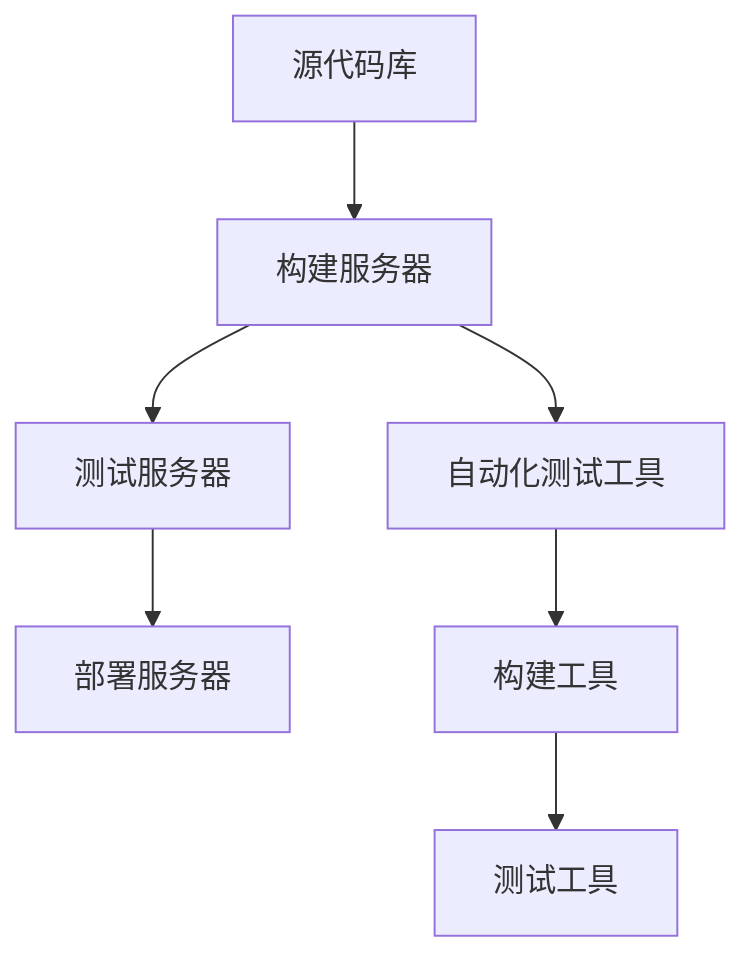

                 


## 文章标题：评测系统的CI/CD流水线设计

### 关键词：
- CI/CD流水线
- 持续集成
- 持续交付
- 评测系统
- 自动化测试
- DevOps

### 摘要：
本文将深入探讨评测系统的CI/CD（持续集成与持续交付）流水线设计。我们将从背景介绍开始，逐步讲解核心概念与联系，核心算法原理，数学模型，项目实战，并给出最佳实践和注意事项。

## 一、背景介绍

### 1.1 CI/CD的定义

持续集成（CI）是指通过自动化构建和测试来确保代码库的每一个提交都是可集成和可运行的。持续交付（CD）则是在CI的基础上，将代码推送到生产环境的过程。这两个概念结合起来，实现了从代码提交到最终部署的自动化流程。

### 1.2 评测系统的重要性

评测系统在软件开发中扮演着关键角色，它能够帮助我们快速识别代码中的问题，确保软件质量。而CI/CD流水线的设计能够进一步提升评测系统的效率，缩短发布周期，提高软件质量。

## 二、核心概念与联系

### 2.1 核心概念

- **源代码库**：存放开发人员提交的代码。
- **构建服务器**：执行构建任务，生成可执行的代码。
- **测试服务器**：运行测试脚本，检查代码的质量。
- **部署服务器**：将通过测试的代码部署到生产环境。

### 2.2 核心概念关系架构



## 三、核心算法原理讲解

### 3.1 构建过程

```plaintext
1. 源代码库中的代码发生变化时，触发构建任务。
2. 构建服务器从源代码库拉取最新代码，编译生成可执行文件。
3. 构建过程中，运行测试脚本，检查代码的质量。
4. 如果测试通过，构建成功；否则，构建失败。
```

### 3.2 部署过程

```plaintext
1. 构建成功后，将生成的可执行文件部署到测试服务器。
2. 在测试服务器上，再次运行测试脚本，确保代码在目标环境中运行正常。
3. 如果测试通过，将代码部署到生产环境；否则，回滚到上一个稳定版本。
```

## 四、数学模型

### 4.1 代码质量评估模型

假设代码质量与测试覆盖率呈正相关，我们可以使用以下公式评估代码质量：

$$
Q = \frac{TC}{TC + FC}
$$

其中，$TC$表示代码覆盖率，$FC$表示代码故障覆盖率。

## 五、项目实战

### 5.1 开发环境搭建

1. 安装Git，用于代码管理。
2. 安装Jenkins，用于CI/CD流程。
3. 安装Docker，用于容器化部署。

### 5.2 源代码详细实现和代码解读

1. 创建一个简单的Web应用。
2. 编写构建脚本，使用Maven进行构建。
3. 编写测试脚本，使用JUnit进行测试。

### 5.3 代码应用解读与分析

1. 分析构建脚本，解释其工作原理。
2. 分析测试脚本，解释其测试策略。

### 5.4 实际案例分析和详细讲解剖析

1. 分析一个实际的CI/CD流程，包括构建、测试、部署等步骤。
2. 讨论流程中的关键点和可能遇到的问题。

### 5.5 项目小结

总结项目中的经验和教训，提出改进建议。

## 六、最佳实践 Tips

1. 使用容器化技术，提高部署的灵活性和可移植性。
2. 保持测试脚本与代码同步更新，确保测试的准确性。
3. 定期审查CI/CD流程，优化流程以提高效率。

## 七、小结

本文详细讲解了评测系统的CI/CD流水线设计，包括背景介绍、核心概念与联系、核心算法原理、数学模型、项目实战和最佳实践。通过本文的学习，读者可以掌握CI/CD的核心概念，并能够设计并实现一个高效的CI/CD流水线。

## 八、注意事项

1. CI/CD工具的选择应根据项目需求和技术栈进行。
2. 确保测试覆盖率达到预期，以提高代码质量。
3. 关注CI/CD过程中的安全性和可靠性。

## 九、拓展阅读

1. 《DevOps实践指南》
2. 《持续交付：发布可靠软件的系统方法》
3. 《Docker实战》

### 作者：
AI天才研究院/AI Genius Institute & 禅与计算机程序设计艺术 /Zen And The Art of Computer Programming

[END OF ARTICLE]
```

