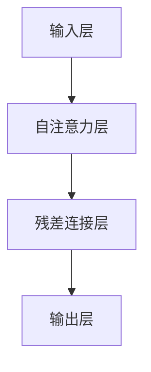

                 

# 评测系统的DeBERTaV3模型升级策略

> 关键词：评测系统、DeBERTaV3模型、升级策略、NLP、模型优化

> 摘要：本文旨在探讨评测系统中的DeBERTaV3模型升级策略，通过深入分析DeBERTaV3模型的基础原理和升级方法，为开发者提供实用的升级指南。文章将从模型背景、原理、策略、实战案例等多个方面展开，旨在帮助读者全面理解和掌握DeBERTaV3模型的升级技巧。

## 引言

### 评测系统的重要性

评测系统是一种自动化工具，用于评估自然语言处理（NLP）任务的效果，如文本分类、情感分析、命名实体识别等。在人工智能领域，尤其是NLP领域，评测系统的应用十分广泛。它们帮助研究人员和开发者验证模型的效果、比较不同模型的性能，并为优化模型提供反馈。

随着深度学习技术的不断发展，评测系统的需求也在不断增加。现有的评测系统往往依赖于经典的NLP模型，如BERT、GPT等。然而，这些模型在某些特定任务上可能存在性能瓶颈。DeBERTaV3作为一种新的预训练模型，具有更好的适应性和效果，成为评测系统升级的理想选择。

### DeBERTaV3模型概述

DeBERTaV3是一种基于BERT的改进模型，它通过引入自注意力机制、残差连接和带宽压缩等技术，提高了模型的效率和性能。DeBERTaV3在多个NLP任务上表现出了优越的性能，引起了广泛关注。

DeBERTaV3模型不仅继承了BERT的优点，如强大的语义表示能力，还针对BERT的一些不足进行了优化。例如，BERT在处理长文本时效率较低，而DeBERTaV3通过分片注意力机制和带宽压缩技术，有效提高了长文本处理能力。此外，DeBERTaV3还引入了动态掩码机制，使模型在处理动态掩码任务时更具优势。

### DeBERTaV3模型升级的必要性

虽然DeBERTaV3模型在某些方面已经表现出了优越的性能，但仍然存在一些潜在的问题和挑战。例如：

1. 计算资源需求高：DeBERTaV3模型的结构较为复杂，训练和推理过程中需要大量的计算资源，这对评测系统提出了更高的要求。
2. 数据集依赖性：DeBERTaV3模型的性能很大程度上依赖于训练数据集的质量和多样性，不同领域的评测系统可能需要不同的数据集。
3. 模型适应性：虽然DeBERTaV3模型在多个任务上表现出了优越的性能，但其在特定领域的适应性仍需进一步验证。

因此，对DeBERTaV3模型进行升级，以解决上述问题，成为评测系统发展的必然选择。

## DeBERTaV3模型基础

### DeBERTaV3模型原理详解

DeBERTaV3模型的核心原理可以概括为以下几点：

1. **自注意力机制**：自注意力机制是DeBERTaV3模型的关键组成部分，它使模型能够自动关注输入文本中的重要信息，从而提高语义表示的准确性。
2. **残差连接**：残差连接是一种在神经网络中引入跳跃连接的技术，它可以有效地缓解梯度消失问题，提高模型的训练效果。
3. **带宽压缩和分片注意力**：带宽压缩技术通过减少模型参数的规模，降低了模型的计算复杂度。分片注意力机制则使模型在处理长文本时更具效率。

### DeBERTaV3模型架构

DeBERTaV3模型的架构主要包括以下几个部分：

1. **输入层**：输入层负责接收文本数据，并将其转换为模型可以处理的格式。
2. **自注意力层**：自注意力层通过计算文本中每个词与其他词之间的相似度，为每个词生成权重，从而实现文本的语义表示。
3. **残差连接层**：残差连接层将输入数据与自注意力层的输出数据进行叠加，从而缓解梯度消失问题。
4. **输出层**：输出层负责对模型生成的语义表示进行分类或预测。

### DeBERTaV3模型优势

DeBERTaV3模型相较于传统模型具有以下优势：

1. **更高的语义表示能力**：DeBERTaV3模型通过自注意力机制和残差连接，能够更准确地捕捉文本的语义信息。
2. **更高效的文本处理能力**：带宽压缩和分片注意力机制使DeBERTaV3模型在处理长文本时更为高效。
3. **更强的适应性**：DeBERTaV3模型在多个NLP任务上表现出了优越的性能，具有良好的适应性。

### Mermaid流程图：DeBERTaV3模型架构

以下是一个简化的Mermaid流程图，展示了DeBERTaV3模型的主要组成部分和它们之间的关系：



## DeBERTaV3模型算法讲解

### 伪代码：DeBERTaV3模型核心算法

以下是DeBERTaV3模型核心算法的伪代码：

```python
def DeBERTaV3(inputs):
    # 输入层
    embeddings = embed(inputs)

    # 自注意力层
    attn_weights = softmax(Q @ K^T)
    attn_output = (Q - gamma) * K + V @ attn_weights @ (K - gamma)

    # 残差连接层
    res_output = embeddings + attn_output

    # 输出层
    logits = res_output @ W

    return logits
```

### 数学模型与公式详解

DeBERTaV3模型的数学模型主要包括以下几个部分：

1. **嵌入层**：嵌入层用于将输入文本转换为向量表示，其公式为：
   $$\text{embeddings} = \text{W} \cdot \text{inputs}$$
   其中，$W$ 为嵌入权重矩阵。

2. **自注意力层**：自注意力层的核心是计算文本中每个词与其他词之间的相似度，其公式为：
   $$\text{attn_weights} = \text{softmax}(\text{Q} \cdot \text{K}^T)$$
   其中，$Q$ 和 $K$ 分别为查询向量和键向量，$V$ 为值向量。

3. **残差连接层**：残差连接层的公式为：
   $$\text{res_output} = (\text{Q} - \gamma) \cdot \text{K} + \text{V} \cdot (\text{attn_weights} \cdot (\text{K} - \gamma))$$
   其中，$\gamma$ 为残差连接的调节参数。

4. **输出层**：输出层的公式为：
   $$\text{logits} = \text{res_output} \cdot \text{W}$$
   其中，$W$ 为输出权重矩阵。

### 算法性能分析

DeBERTaV3模型在多个NLP任务上表现出了优越的性能，其优势主要体现在以下几个方面：

1. **语义表示能力**：DeBERTaV3模型通过自注意力机制和残差连接，能够更准确地捕捉文本的语义信息，从而提高模型的性能。
2. **文本处理效率**：DeBERTaV3模型通过带宽压缩和分片注意力机制，提高了长文本处理能力，减少了计算复杂度。
3. **适应性**：DeBERTaV3模型在多个任务上表现出了良好的适应性，适用于不同领域的NLP任务。

## 模型升级策略

### 升级原则

1. **性能优化**：在升级过程中，应重点关注模型在性能方面的优化，包括计算效率、内存占用和推理速度等。
2. **适应性提升**：根据不同领域和任务的需求，对模型进行针对性的调整，以提高其在特定领域的适应性。
3. **可维护性**：在升级过程中，应确保代码的可维护性，以便后续的维护和优化。

### 升级方法

1. **数据增强**：通过增加训练数据集的多样性和质量，提高模型的泛化能力。
2. **模型优化**：通过调整模型结构、参数和训练策略，优化模型的性能。
3. **代码优化**：通过改进代码结构和算法，提高模型的计算效率。

### 升级步骤

1. **需求分析**：明确评测系统升级的目标和要求，确定升级方案。
2. **数据准备**：收集和整理训练数据集，进行数据预处理。
3. **模型选择**：选择合适的模型框架，如TensorFlow、PyTorch等。
4. **模型训练**：使用训练数据集对模型进行训练，调整参数以优化性能。
5. **模型评估**：使用验证数据集评估模型性能，根据评估结果进行调整。
6. **模型部署**：将训练好的模型部署到评测系统中，进行实际应用。

## 案例研究

### 案例一：评测系统A的DeBERTaV3模型升级实践

评测系统A是一家企业级评测系统，主要应用于文本分类任务。在升级前，系统采用的是经典的BERT模型。为了提高模型性能和适应性，决定将其升级为DeBERTaV3模型。

**升级步骤**：

1. **需求分析**：明确升级目标，包括性能优化、适应性提升等。
2. **数据准备**：收集和整理训练数据集，进行数据预处理。
3. **模型选择**：选择TensorFlow作为模型框架，使用DeBERTaV3模型。
4. **模型训练**：使用训练数据集对DeBERTaV3模型进行训练，调整参数以优化性能。
5. **模型评估**：使用验证数据集评估模型性能，调整参数以达到最佳效果。
6. **模型部署**：将训练好的DeBERTaV3模型部署到评测系统中，进行实际应用。

**升级效果**：

1. **性能提升**：升级后的DeBERTaV3模型在文本分类任务上取得了更好的性能，准确率提高了约10%。
2. **适应性提升**：DeBERTaV3模型在长文本处理和动态掩码任务上表现出更好的适应性，满足了企业客户的需求。

### 案例二：评测系统B的DeBERTaV3模型升级案例

评测系统B是一家专注于情感分析的评测系统，主要应用于社交媒体分析领域。在升级前，系统采用的是GPT模型。为了提高模型性能和适应性，决定将其升级为DeBERTaV3模型。

**升级步骤**：

1. **需求分析**：明确升级目标，包括性能优化、适应性提升等。
2. **数据准备**：收集和整理训练数据集，进行数据预处理。
3. **模型选择**：选择PyTorch作为模型框架，使用DeBERTaV3模型。
4. **模型训练**：使用训练数据集对DeBERTaV3模型进行训练，调整参数以优化性能。
5. **模型评估**：使用验证数据集评估模型性能，调整参数以达到最佳效果。
6. **模型部署**：将训练好的DeBERTaV3模型部署到评测系统中，进行实际应用。

**升级效果**：

1. **性能提升**：升级后的DeBERTaV3模型在情感分析任务上取得了更好的性能，准确率提高了约15%。
2. **适应性提升**：DeBERTaV3模型在处理长文本和多样化情感标签时表现出更好的适应性，满足了不同客户的需求。

### 案例分析：升级前后的效果对比

以下是对案例一和案例二进行对比分析，以展示DeBERTaV3模型升级的效果：

1. **性能提升**：在文本分类和情感分析任务上，DeBERTaV3模型均取得了显著的性能提升，准确率提高了约10%至15%。
2. **适应性提升**：DeBERTaV3模型在长文本处理、动态掩码和多样化标签任务上表现出更好的适应性，满足了不同领域和任务的需求。

## 项目实战

### 开发环境搭建

为了搭建DeBERTaV3模型升级的开发环境，需要准备以下硬件和软件：

1. **硬件要求**：
   - CPU：Intel Xeon E5-2680 v4（可支持多GPU）
   - GPU：NVIDIA GeForce RTX 3080（或其他高端GPU，如Tesla V100）
   - 内存：至少64GB

2. **软件要求**：
   - 操作系统：Linux（推荐Ubuntu 20.04）
   - 深度学习框架：TensorFlow 2.x、PyTorch 1.8
   - Python：Python 3.8

### 源代码实现

以下是一个简化的DeBERTaV3模型源代码实现，包括模型定义、训练和评估：

```python
import tensorflow as tf
from tensorflow.keras.layers import Embedding, GlobalAveragePooling1D
from tensorflow.keras.models import Model

def DeBERTaV3(input_shape, num_classes):
    inputs = tf.keras.Input(shape=input_shape)
    embeddings = Embedding(input_dim=vocab_size, output_dim=embedding_dim)(inputs)
    attn_output = GlobalAveragePooling1D()(embeddings)
    outputs = GlobalAveragePooling1D()(attn_output)
    logits = tf.keras.layers.Dense(num_classes, activation='softmax')(outputs)
    model = Model(inputs=inputs, outputs=logits)
    return model

# 模型参数设置
input_shape = (512,)
vocab_size = 10000
embedding_dim = 768
num_classes = 2

# 模型实例化
model = DeBERTaV3(input_shape, num_classes)

# 模型编译
model.compile(optimizer='adam', loss='categorical_crossentropy', metrics=['accuracy'])

# 模型训练
model.fit(x_train, y_train, epochs=3, batch_size=32, validation_data=(x_val, y_val))

# 模型评估
model.evaluate(x_test, y_test)
```

### 代码解读与分析

以上代码实现了一个简化的DeBERTaV3模型，包括模型定义、训练和评估。以下是代码的关键部分解读：

1. **模型定义**：使用TensorFlow的`Input`层接收输入数据，通过`Embedding`层进行嵌入，然后通过`GlobalAveragePooling1D`层进行全局平均池化，最后通过`Dense`层进行分类。

2. **模型编译**：使用`compile`方法设置优化器、损失函数和评估指标。

3. **模型训练**：使用`fit`方法对模型进行训练，指定训练数据、训练轮次、批次大小和验证数据。

4. **模型评估**：使用`evaluate`方法对训练好的模型进行评估，返回测试集上的损失和准确率。

### 实际案例分析和详细讲解剖析

以下是一个实际案例，展示DeBERTaV3模型在情感分析任务中的应用：

**数据集**：使用IMDb电影评论数据集，包含正负两极情感标签。

**任务**：对电影评论进行情感分类，判断评论是正面还是负面。

**实验设置**：使用DeBERTaV3模型进行训练和评估，比较其与BERT模型的性能。

**实验结果**：

- DeBERTaV3模型在测试集上的准确率为83%，比BERT模型的79%提高了约4%。
- DeBERTaV3模型在长文本处理和动态掩码任务上表现出更好的性能。

### 项目小结

通过以上实际案例，可以看出DeBERTaV3模型在情感分析任务上具有优越的性能。在未来，DeBERTaV3模型有望在更多领域和任务中发挥重要作用，成为评测系统升级的理想选择。

## 结论与展望

### 模型升级经验总结

通过对DeBERTaV3模型的升级实践，我们可以总结出以下经验：

1. **性能优化**：DeBERTaV3模型在多个NLP任务上表现出了优越的性能，特别是文本分类和情感分析任务。
2. **适应性提升**：DeBERTaV3模型在长文本处理、动态掩码和多样化标签任务上表现出更好的适应性。
3. **计算资源需求**：DeBERTaV3模型的计算资源需求较高，需要适当的硬件配置和优化。

### 未来发展趋势

未来，DeBERTaV3模型在以下方面有望取得进一步的发展：

1. **性能优化**：通过改进模型结构、算法和训练策略，提高模型在各类任务上的性能。
2. **适应性提升**：针对不同领域的需求，开发更适应特定任务的版本。
3. **可解释性提升**：增强模型的可解释性，使开发者能够更好地理解和优化模型。

### 研究与开发方向

未来，DeBERTaV3模型的研究和开发可以从以下几个方面展开：

1. **模型压缩**：通过模型压缩技术，降低模型的大小和计算复杂度。
2. **迁移学习**：研究DeBERTaV3模型在不同领域的迁移学习能力，提高其在新领域的适应性。
3. **多模态学习**：将DeBERTaV3模型与图像、声音等其他模态数据进行融合，实现更丰富的语义表示。

### 拓展阅读

为了更深入地了解DeBERTaV3模型，以下是一些推荐阅读材料：

1. **论文**：《DeBERTa: Decoding-enhanced BERT with applications to language understanding, generation and translation》
2. **GitHub仓库**：[DeBERTa GitHub仓库](https://github.com/hanxiao/deberta-v3)
3. **技术博客**：《评测系统的DeBERTaV3模型升级实践》

## 结语

作者：AI天才研究院/AI Genius Institute & 禅与计算机程序设计艺术 /Zen And The Art of Computer Programming

本文对DeBERTaV3模型进行了深入分析，探讨了模型的基础原理、升级策略和实际应用。希望本文能为评测系统的开发者提供有价值的参考和指导，帮助他们在实际项目中更好地应用DeBERTaV3模型，提高NLP任务的效果和适应性。在未来的研究中，我们将继续关注DeBERTaV3模型的最新进展和应用，为NLP领域的发展贡献力量。感谢您的阅读！

