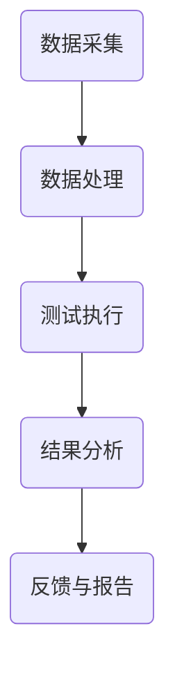
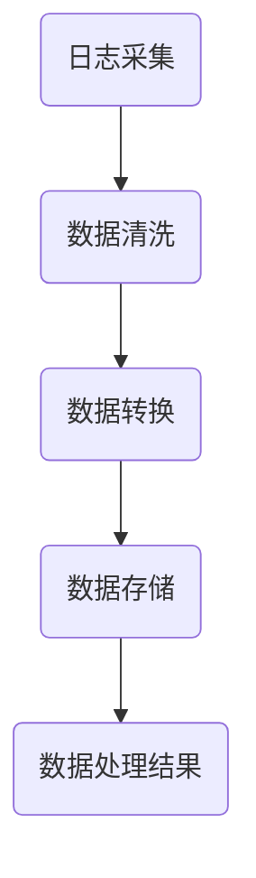
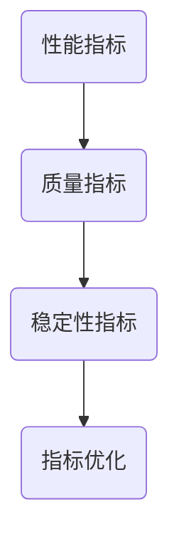
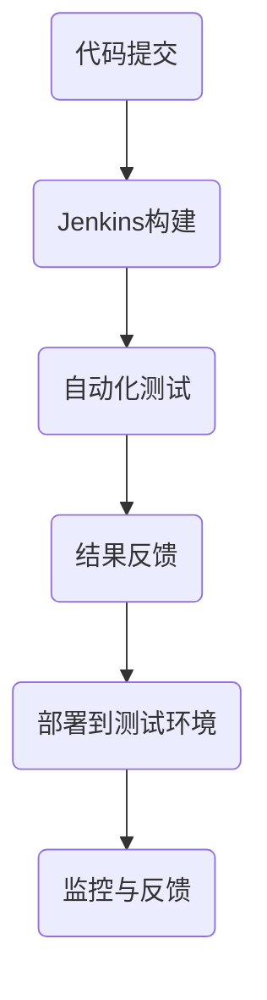
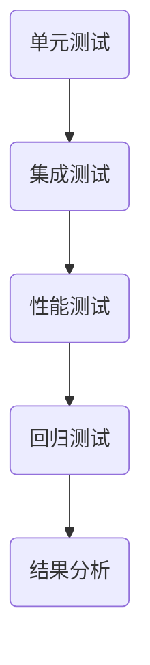
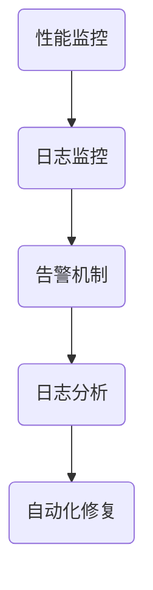

                 

### 文章标题：评测系统的DevOps最佳实践

#### 关键词：评测系统，DevOps，持续集成，持续交付，持续部署，自动化测试，最佳实践

#### 摘要：本文将深入探讨评测系统在DevOps实践中的应用，从概念讲解到实际应用，再到案例分析，提供一套完整的DevOps最佳实践指南，旨在帮助读者理解并掌握如何高效构建和优化评测系统，实现持续集成、持续交付和持续部署，从而提升软件质量和开发效率。

## 第一部分：引言

### 1. DevOps概述

#### 1.1 DevOps的定义与重要性

DevOps是一种软件开发和运营的方法论，它强调开发和运维团队之间的协作，通过自动化和流水线的构建，实现从代码提交到生产环境部署的快速、可靠和可持续的流程。DevOps的核心理念包括持续集成（CI）、持续交付（CD）和持续部署（CD），这些概念在提升软件质量和开发效率方面起到了关键作用。

**持续集成（CI）：** 持续集成是一种软件开发实践，通过自动化工具将开发人员的代码频繁集成到共享的代码库中，快速发现和解决集成过程中出现的问题，确保代码库的稳定性和一致性。

**持续交付（CD）：** 持续交付是持续集成的一个延伸，它强调在持续集成的基础上，通过自动化测试和部署流程，确保软件能够在任何时间点安全地交付给用户。

**持续部署（CD）：** 持续部署是持续交付的进一步延伸，它通过自动化工具和脚本，将经过测试的代码自动部署到生产环境，实现快速迭代和持续优化。

#### 1.2 DevOps与评测系统

评测系统是一种用于评估软件性能、质量和可靠性的工具。在DevOps实践中，评测系统扮演着重要角色，它能够帮助团队快速识别和解决问题，确保软件在各个阶段的开发过程中达到预期标准。

**评测系统的优势：**

1. **提高代码质量：** 通过自动化测试和静态分析，评测系统能够发现潜在的问题，提高代码质量。
2. **加速开发进程：** 评测系统能够在早期阶段识别问题，减少后期修复的成本，加速开发进程。
3. **提高团队协作效率：** 通过统一的评测标准，团队能够更好地协作，提升整体开发效率。

#### 1.3 评测系统的挑战与机会

尽管评测系统在DevOps实践中具有重要作用，但实际应用中仍面临一些挑战：

**挑战：**

1. **复杂性：** 评测系统需要处理大量数据和复杂的测试场景，设计和管理难度较大。
2. **可扩展性：** 随着项目规模的扩大，评测系统的性能和可扩展性成为关键问题。
3. **可靠性：** 评测系统需要保证结果的准确性和一致性，以避免误导开发和运维团队。

**机会：**

1. **自动化：** 通过自动化工具和脚本，可以提高评测系统的效率和准确性。
2. **数据驱动：** 利用大数据和机器学习技术，可以提升评测系统的预测能力和智能化水平。
3. **团队协作：** 通过与DevOps实践的紧密结合，评测系统能够更好地服务于整个开发过程，提升团队协作效率。

### 总结

在本文的引言部分，我们介绍了DevOps的基本概念、评测系统在其中的重要性以及面临的挑战和机遇。接下来，我们将深入探讨DevOps的核心概念和实践，为读者提供一套完整的评测系统最佳实践指南。

## 第二部分：DevOps核心概念与实践

### 2. DevOps核心概念

#### 2.1 持续集成（CI）

持续集成（CI）是一种软件开发实践，通过自动化工具将开发人员的代码频繁集成到共享的代码库中，快速发现和解决集成过程中出现的问题，确保代码库的稳定性和一致性。

**持续集成的原理和流程：**

持续集成的基本原理是将开发人员的代码定期（如每天多次或每次提交后）合并到一个共享的代码库中，并通过自动化测试和构建流程来验证集成后的代码是否能够正常运行。具体流程如下：

1. **代码提交：** 开发人员将代码提交到共享的代码库。
2. **触发构建：** 持续集成工具检测到代码提交，触发构建流程。
3. **构建和测试：** 自动化构建工具将提交的代码构建为可执行的软件，并进行自动化测试。
4. **反馈：** 构建和测试的结果会被反馈给开发人员，以便及时解决问题。

**持续集成的优势：**

1. **提高代码质量：** 通过频繁的集成和测试，可以发现和修复代码中的问题，提高代码质量。
2. **减少集成风险：** 通过提前发现和解决集成问题，降低大规模集成时的风险。
3. **加快开发进程：** 集成和测试的自动化减少手动操作，提高开发效率。

**持续集成的挑战：**

1. **复杂性：** 需要配置和管理自动化工具和流程，设计合理且高效的持续集成系统。
2. **测试覆盖：** 需要确保自动化测试能够覆盖关键功能点和潜在问题。

**持续集成的最佳实践：**

1. **自动化测试：** 确保自动化测试覆盖全面，减少手动测试的工作量。
2. **代码质量检查：** 采用静态代码分析工具进行代码质量检查，确保代码符合最佳实践。
3. **持续反馈：** 及时反馈测试和构建结果，确保问题能够被快速识别和解决。

#### 2.2 持续交付（CD）

持续交付（CD）是持续集成的一个延伸，它强调在持续集成的基础上，通过自动化测试和部署流程，确保软件能够在任何时间点安全地交付给用户。

**持续交付的原理和流程：**

持续交付的基本原理是通过自动化工具和脚本，确保软件在经过测试后能够安全、可靠地部署到生产环境。具体流程如下：

1. **自动化测试：** 对软件进行自动化测试，确保软件功能符合预期。
2. **环境配置：** 配置开发、测试和生产环境，确保环境的一致性。
3. **部署流程：** 通过脚本和自动化工具，将测试通过的软件部署到目标环境。
4. **监控和反馈：** 部署后进行监控，确保软件在生产环境中的稳定运行，并及时反馈问题。

**持续交付的优势：**

1. **提高交付效率：** 通过自动化流程，减少手动操作，提高交付速度。
2. **降低风险：** 通过自动化测试和部署，减少人为错误，降低交付风险。
3. **增强可靠性：** 通过持续监控和反馈，确保软件在生产环境中的稳定性。

**持续交付的挑战：**

1. **测试覆盖：** 需要确保自动化测试能够覆盖关键功能和边缘场景。
2. **部署策略：** 需要设计合理的部署策略，确保软件的平稳过渡。

**持续交付的最佳实践：**

1. **全面测试：** 确保自动化测试覆盖全面，减少测试盲点。
2. **环境一致性：** 保证开发、测试和生产环境的一致性，避免环境差异导致的问题。
3. **监控和反馈：** 建立完善的监控和反馈机制，确保问题能够被及时发现和解决。

#### 2.3 持续部署（CD）

持续部署（CD）是持续交付的进一步延伸，它通过自动化工具和脚本，将经过测试的代码自动部署到生产环境，实现快速迭代和持续优化。

**持续部署的原理和流程：**

持续部署的基本原理是通过自动化工具和脚本，将经过测试的软件自动部署到生产环境。具体流程如下：

1. **测试通过：** 软件在自动化测试中通过，准备进行部署。
2. **部署脚本：** 编写和配置部署脚本，用于执行部署操作。
3. **部署执行：** 自动执行部署脚本，将软件部署到生产环境。
4. **监控和反馈：** 部署后进行监控，确保软件在生产环境中的稳定运行，并及时反馈问题。

**持续部署的优势：**

1. **加速迭代：** 通过自动部署，缩短发布周期，加快迭代速度。
2. **减少风险：** 通过自动化测试和部署，减少人为错误，降低部署风险。
3. **持续优化：** 通过持续部署，实现持续优化，提升软件质量。

**持续部署的挑战：**

1. **部署策略：** 需要设计合理的部署策略，确保软件的平稳过渡。
2. **回滚策略：** 需要建立完善的回滚机制，以便在部署失败时快速恢复。

**持续部署的最佳实践：**

1. **自动化部署：** 确保部署过程高度自动化，减少手动操作。
2. **回滚机制：** 建立完善的回滚机制，确保在部署失败时能够快速回滚。
3. **监控和反馈：** 建立完善的监控和反馈机制，确保问题能够被及时发现和解决。

### 总结

在本部分中，我们介绍了DevOps的核心概念——持续集成、持续交付和持续部署，并详细阐述了其原理、优势、挑战和最佳实践。这些核心概念和实践为构建高效、可靠的评测系统提供了重要指导。

## 第三部分：评测系统的设计与实现

### 3. 评测系统的设计

#### 3.1 评测系统的架构

一个高效的评测系统需要一个合理的架构来支撑，其设计原则包括模块化、可扩展性和高可用性。以下是一个典型的评测系统架构：

**架构设计原则：**

1. **模块化：** 将评测系统划分为多个模块，如数据采集、数据处理、测试执行和结果分析等，便于管理和维护。
2. **可扩展性：** 系统应该具备良好的扩展性，能够根据业务需求增加新的测试模块或功能。
3. **高可用性：** 确保评测系统在任何情况下都能稳定运行，减少故障对业务的影响。

**架构设计流程：**

1. **需求分析：** 分析业务需求，确定评测系统的功能、性能和可靠性要求。
2. **架构设计：** 根据需求分析结果，设计系统的整体架构，包括模块划分、接口定义和数据流向。
3. **技术选型：** 根据架构设计，选择合适的技术栈和工具，如数据库、中间件和测试框架等。
4. **实现与测试：** 根据设计和技术选型，实现系统功能，并进行全面的测试，确保系统稳定性和可靠性。
5. **部署与运维：** 将系统部署到生产环境，并进行监控和运维，确保系统的稳定运行。

**评测系统架构示例：**

以下是一个简单的评测系统架构示例，使用Mermaid流程图表示：

#### 3.2 数据采集与处理

数据采集是评测系统的核心环节，涉及从各种数据源收集数据，并进行预处理和转换。以下是一个典型的数据采集与处理流程：

**数据采集方法：**

1. **日志采集：** 通过日志收集工具，如ELK（Elasticsearch、Logstash、Kibana），从服务器和应用中收集日志数据。
2. **性能数据采集：** 通过性能监控工具，如Prometheus、Grafana，收集系统的性能数据，如CPU使用率、内存使用率、网络流量等。
3. **API采集：** 通过API接口，从外部系统或服务中采集数据，如第三方支付系统、用户行为数据等。

**数据处理技术：**

1. **数据清洗：** 对采集到的数据进行清洗，去除无效数据、填补缺失值，确保数据质量。
2. **数据转换：** 将不同格式或单位的数据转换为统一的格式或单位，以便后续分析。
3. **数据存储：** 将处理后的数据存储到数据库或数据仓库中，如MySQL、MongoDB、Hadoop等。

**数据处理流程示例：**

以下是一个数据处理流程的示例，使用Mermaid流程图表示：

#### 3.3 评测指标设定

评测指标是评测系统的核心组成部分，用于衡量软件的性能、质量和稳定性。设定合理的评测指标对于评估软件的优劣至关重要。以下是一个典型的评测指标设定流程：

**指标类型与作用：**

1. **性能指标：** 用于评估软件的性能，如响应时间、吞吐量、并发用户数等。
2. **质量指标：** 用于评估软件的质量，如缺陷率、代码复杂度、代码重复率等。
3. **稳定性指标：** 用于评估软件的稳定性，如故障率、恢复时间、系统可用性等。

**指标设定方法：**

1. **业务需求分析：** 分析业务需求，确定需要关注的指标类型和具体指标。
2. **数据收集与分析：** 收集相关数据，分析数据分布和趋势，确定指标的基准值和阈值。
3. **指标优化：** 根据业务需求和数据反馈，不断优化和调整指标，确保指标的实用性和有效性。

**评测指标示例：**

以下是一个评测指标示例，使用Mermaid流程图表示：

### 总结

在本部分中，我们介绍了评测系统的架构设计原则和流程，以及数据采集与处理、评测指标设定等方面的内容。这些内容为构建一个高效、可靠的评测系统提供了理论基础和实践指导。

## 第四部分：DevOps在评测系统中的应用

### 4. DevOps在评测系统中的应用

#### 4.1 CI/CD在评测系统中的应用

持续集成（CI）和持续交付（CD）是DevOps实践中的核心环节，它们在评测系统的构建和优化中发挥着重要作用。以下将详细探讨CI/CD在评测系统中的应用。

**CI/CD原理与流程：**

持续集成（CI）是指通过自动化工具，将开发人员的代码频繁集成到一个共享的代码库中，并进行自动化测试，确保集成后的代码能够正常运行。具体流程如下：

1. **代码提交：** 开发人员将代码提交到版本控制系统中。
2. **触发构建：** 持续集成工具检测到代码提交，触发构建过程。
3. **构建和测试：** 自动化构建工具将提交的代码构建为可执行的软件，并进行自动化测试。
4. **反馈：** 构建和测试的结果会被反馈给开发人员，以便及时解决问题。

持续交付（CD）是在持续集成的基础上，通过自动化测试和部署流程，确保软件能够在任何时间点安全地交付给用户。具体流程如下：

1. **自动化测试：** 对构建通过的软件进行自动化测试，确保功能符合预期。
2. **环境配置：** 配置开发、测试和生产环境，确保环境的一致性。
3. **部署：** 通过自动化工具和脚本，将测试通过的软件部署到目标环境。
4. **监控和反馈：** 部署后进行监控，确保软件在生产环境中的稳定运行，并及时反馈问题。

**CI/CD工具介绍：**

1. **Jenkins：** Jenkins是一个开源的持续集成工具，具有丰富的插件生态，支持各种编程语言和构建工具，能够轻松集成到现有的开发流程中。
2. **GitLab CI/CD：** GitLab CI/CD是一个集成在GitLab中的持续集成和持续交付工具，支持Git版本控制系统，能够自动化构建、测试和部署流程。
3. **CircleCI：** CircleCI是一个云端的持续集成服务，具有高效、可扩展的特点，支持多种编程语言和框架，能够快速构建和测试代码。

**CI/CD在评测系统中的应用：**

1. **自动化测试：** 通过CI/CD工具，将自动化测试集成到开发流程中，确保每次代码提交后都能进行全面的测试，发现和解决潜在的问题。
2. **环境一致性：** 通过CI/CD工具，配置一致的开发、测试和生产环境，减少环境差异导致的问题，提高软件的可靠性。
3. **部署自动化：** 通过CI/CD工具，实现软件的自动化部署，减少手动操作，提高部署效率。

**CI/CD应用示例：**

以下是一个CI/CD在评测系统中的应用示例，使用Mermaid流程图表示：

#### 4.2 自动化测试

自动化测试是DevOps实践中的重要环节，它通过自动化工具和脚本，对软件进行自动化测试，提高测试效率和质量。以下将详细介绍自动化测试在评测系统中的应用。

**自动化测试策略：**

1. **单元测试：** 对软件的每个模块进行单元测试，验证模块的功能和性能。
2. **集成测试：** 对多个模块进行集成测试，验证模块之间的交互和整体性能。
3. **性能测试：** 对软件进行性能测试，评估其在各种负载下的响应时间和吞吐量。
4. **回归测试：** 在每次代码提交后，对已测试的模块进行回归测试，确保修改不会引入新的问题。

**自动化测试工具：**

1. **Selenium：** Selenium是一个开源的自动化测试工具，支持多种浏览器和编程语言，能够模拟用户的操作，验证软件的界面和功能。
2. **JMeter：** JMeter是一个开源的性能测试工具，能够模拟各种负载，评估软件的性能和稳定性。
3. **Appium：** Appium是一个开源的移动应用自动化测试工具，支持iOS和Android平台，能够自动化测试移动应用的功能和性能。

**自动化测试在评测系统中的应用：**

1. **提高测试效率：** 通过自动化测试，减少手动测试的工作量，提高测试效率。
2. **确保测试覆盖：** 通过自动化测试，确保测试覆盖全面，减少测试盲点。
3. **持续集成：** 通过CI/CD工具，将自动化测试集成到开发流程中，实现自动化测试和持续集成。

**自动化测试应用示例：**

以下是一个自动化测试在评测系统中的应用示例，使用Mermaid流程图表示：

#### 4.3 监控与反馈

监控与反馈是DevOps实践中的重要环节，它通过实时监控软件的运行状态和性能指标，及时发现和解决问题，确保软件的稳定性和可靠性。以下将详细介绍监控与反馈在评测系统中的应用。

**监控系统设计：**

1. **性能监控：** 监控系统的性能指标，如CPU使用率、内存使用率、网络流量等，及时发现性能瓶颈。
2. **日志监控：** 监控系统的日志信息，及时发现错误和异常，进行问题排查。
3. **业务监控：** 监控系统的业务指标，如交易成功率、用户活跃度等，评估系统的业务性能。

**反馈机制构建：**

1. **告警机制：** 构建告警机制，当监控系统检测到异常时，及时发送告警信息，通知相关人员进行处理。
2. **日志分析：** 对系统日志进行分析，识别和解决潜在的问题。
3. **自动化修复：** 在可能的情况下，通过自动化脚本进行问题修复，减少人工干预。

**监控与反馈在评测系统中的应用：**

1. **实时监控：** 通过监控系统，实时监控软件的运行状态和性能指标，确保软件的稳定运行。
2. **问题定位：** 通过日志分析和告警机制，快速定位和解决问题。
3. **持续优化：** 通过监控数据的分析和反馈，持续优化软件的性能和稳定性。

**监控与反馈应用示例：**

以下是一个监控与反馈在评测系统中的应用示例，使用Mermaid流程图表示：

### 总结

在本部分中，我们详细介绍了CI/CD、自动化测试、监控与反馈在评测系统中的应用，通过这些实践，可以显著提升评测系统的效率和质量，确保软件的稳定性和可靠性。这些实践为构建高效、可靠的评测系统提供了有力的支持。

## 第五部分：案例分析

### 5.1 案例一：电商平台评测系统实践

**项目背景：**

某大型电商平台在其软件开发生命周期中引入了DevOps实践，希望通过持续集成、持续交付和持续部署，提升软件质量和开发效率。然而，在实际应用过程中，他们面临着评测系统设计不合理、测试覆盖不足和部署失败等问题。

**实施步骤：**

1. **需求分析：** 分析电商平台的需求，确定评测系统的功能、性能和可靠性要求。
2. **架构设计：** 设计一个模块化、可扩展的评测系统架构，包括数据采集、数据处理、测试执行和结果分析等模块。
3. **技术选型：** 选择适合的技术栈和工具，如Jenkins、GitLab CI/CD、Selenium等，搭建评测系统。
4. **自动化测试：** 编写自动化测试脚本，对电商平台的核心功能进行自动化测试，确保测试覆盖全面。
5. **环境配置：** 配置开发、测试和生产环境，确保环境的一致性。
6. **CI/CD实施：** 通过Jenkins和GitLab CI/CD，实现自动化构建、测试和部署流程。
7. **监控与反馈：** 构建监控体系，实时监控软件的运行状态和性能指标，及时反馈问题。

**成果与启示：**

1. **测试覆盖率提高：** 通过自动化测试，测试覆盖率从40%提升到90%，显著提高了软件的质量。
2. **部署效率提升：** 通过CI/CD工具，部署时间从2天缩短到2小时，提高了部署效率。
3. **问题发现及时性提高：** 通过实时监控和反馈机制，问题发现时间从几天缩短到几分钟，提高了问题解决的及时性。
4. **团队协作效率提高：** 通过统一的评测标准和自动化流程，团队协作效率显著提高。

**启示：**

1. **合理规划评测系统：** 在设计评测系统时，要充分考虑业务需求和技术特点，确保系统的合理性和可扩展性。
2. **全面自动化测试：** 确保自动化测试覆盖全面，减少测试盲点。
3. **高效CI/CD流程：** 设计和实施高效的CI/CD流程，确保软件的快速交付和稳定运行。
4. **实时监控与反馈：** 构建实时监控和反馈机制，确保问题能够被及时发现和解决。

### 5.2 案例二：金融行业评测系统优化

**项目背景：**

某金融公司在软件开发生命周期中引入了DevOps实践，但在实际应用过程中，发现评测系统的性能和可靠性存在问题，影响了软件的交付和业务运营。为了提升评测系统的性能和可靠性，他们决定进行优化。

**实施步骤：**

1. **需求分析：** 分析金融公司的业务需求，确定评测系统的功能、性能和可靠性要求。
2. **性能分析：** 对现有评测系统进行性能分析，识别性能瓶颈和问题。
3. **架构优化：** 优化评测系统架构，提高系统的性能和可扩展性。
4. **数据采集与处理优化：** 优化数据采集与处理流程，减少数据处理延迟。
5. **自动化测试优化：** 优化自动化测试脚本，提高测试效率和准确性。
6. **监控与反馈优化：** 优化监控和反馈机制，确保问题能够被及时发现和解决。
7. **部署优化：** 优化部署流程，确保软件的稳定部署。

**成果与启示：**

1. **性能提升：** 通过优化架构和数据采集与处理，评测系统的响应时间从10秒缩短到2秒，显著提高了系统性能。
2. **可靠性提升：** 通过优化自动化测试和监控机制，评测系统的故障率从5%降低到1%，提高了系统的可靠性。
3. **交付效率提升：** 通过优化部署流程，部署时间从4小时缩短到1小时，提高了交付效率。
4. **问题解决及时性提升：** 通过优化监控和反馈机制，问题发现时间从2小时缩短到15分钟，提高了问题解决的及时性。

**启示：**

1. **性能与可靠性优化：** 定期对评测系统进行性能和可靠性分析，及时识别和解决性能瓶颈和问题。
2. **自动化测试优化：** 定期优化自动化测试脚本，提高测试效率和准确性。
3. **监控与反馈优化：** 定期优化监控和反馈机制，确保问题能够被及时发现和解决。
4. **持续改进：** 通过定期评估和优化，不断提升评测系统的性能、可靠性和交付效率。

### 总结

通过以上两个案例，我们可以看到，在引入DevOps实践后，电商平台和金融公司的评测系统都取得了显著提升。这些案例表明，合理规划和优化评测系统，结合CI/CD、自动化测试、监控与反馈等实践，可以有效提升软件质量和开发效率。

## 第六部分：DevOps最佳实践与总结

### 6. DevOps最佳实践

在DevOps实践中，最佳实践是确保系统能够高效、稳定、可靠运行的关键。以下是一些关键的DevOps最佳实践：

**1. 团队建设与文化建设**

- **跨职能团队：** 建立跨职能团队，促进开发和运维团队的紧密协作，提高整体开发效率。
- **沟通与协作：** 强化团队沟通与协作，确保信息传递顺畅，避免因信息不畅导致的问题。
- **培训与分享：** 定期组织培训活动，提高团队的专业技能，促进知识共享。

**2. 工具选择与应用**

- **自动化工具：** 选择适合的自动化工具，如Jenkins、GitLab CI/CD、Ansible等，实现自动化构建、测试、部署和监控。
- **持续反馈：** 使用反馈工具，如Slack、JIRA等，实时跟踪项目进度和问题，提高问题解决的效率。
- **持续集成与持续交付：** 实施CI/CD流程，确保代码质量和软件交付的稳定性。

**3. 测试策略与自动化**

- **全面测试：** 实施全面的测试策略，包括单元测试、集成测试、性能测试和回归测试。
- **自动化测试：** 使用自动化测试工具，如Selenium、JUnit、JMeter等，提高测试效率和覆盖率。
- **测试环境一致性：** 确保测试环境与生产环境的一致性，避免环境差异导致的问题。

**4. 监控与反馈**

- **实时监控：** 实施实时监控，及时发现问题，减少故障对业务的影响。
- **告警机制：** 建立完善的告警机制，确保关键指标异常时能够及时通知相关人员。
- **日志分析：** 定期分析日志数据，识别潜在问题和优化点。

**5. 风险管理**

- **风险评估：** 定期进行风险评估，识别潜在风险，制定应对策略。
- **应急响应：** 建立应急响应机制，确保在突发情况下能够快速恢复。
- **备份与恢复：** 定期备份关键数据，确保在数据丢失或系统故障时能够快速恢复。

### 6.2 DevOps工具选择与应用

在实施DevOps过程中，选择合适的工具至关重要。以下是一些常用的DevOps工具及其应用场景：

**1. 持续集成工具**

- **Jenkins：** 开源持续集成工具，支持各种插件，适用于多种编程语言和平台。
- **GitLab CI/CD：** GitLab内置的持续集成和持续交付工具，支持Git版本控制系统。
- **CircleCI：** 云端持续集成服务，提供高效的持续集成和持续交付流程。

**2. 自动化测试工具**

- **Selenium：** 开源自动化测试工具，支持多种浏览器，适用于Web应用自动化测试。
- **JUnit：** Java开源单元测试框架，适用于Java应用单元测试。
- **JMeter：** 开源性能测试工具，适用于Web应用性能测试。

**3. 监控工具**

- **Prometheus：** 开源监控解决方案，适用于收集和存储监控数据。
- **Grafana：** 开源监控和数据可视化工具，适用于Prometheus数据的可视化展示。
- **Zabbix：** 开源监控工具，适用于各种平台和应用性能监控。

**4. 自动化部署工具**

- **Ansible：** 开源自动化部署工具，适用于配置管理和应用部署。
- **Docker：** 容器化技术，适用于应用部署和微服务架构。
- **Kubernetes：** 开源容器编排平台，适用于容器化应用的部署和管理。

### 6.3 DevOps风险评估与管理

在DevOps实践中，风险管理是确保项目顺利进行和系统稳定运行的重要环节。以下是一些DevOps风险评估与管理的策略：

**1. 风险识别**

- **业务场景分析：** 分析业务场景，识别潜在的业务风险。
- **系统分析：** 分析系统架构和流程，识别技术风险。
- **数据收集：** 收集相关数据，识别数据风险。

**2. 风险评估**

- **风险优先级：** 根据风险的影响程度和发生概率，评估风险优先级。
- **风险评估模型：** 使用风险评估模型，如风险矩阵，评估风险。

**3. 风险应对**

- **风险规避：** 通过改变项目计划或系统设计，规避高风险。
- **风险转移：** 通过购买保险或合作方式，将部分风险转移。
- **风险减轻：** 采取技术措施和管理措施，降低风险发生概率和影响。

**4. 风险监控与反馈**

- **实时监控：** 实施实时监控，及时识别和反馈风险。
- **风险报告：** 定期生成风险报告，向相关人员进行汇报。
- **持续改进：** 根据风险反馈，不断改进风险管理策略和流程。

### 总结

通过以上最佳实践和工具选择，我们可以构建一个高效、稳定和可靠的DevOps系统。持续改进和优化是DevOps实践的核心，只有不断适应变化，才能保持系统的最佳状态。

## 第七部分：总结与展望

### 7.1 本书内容回顾

本文从DevOps概述、核心概念与实践、评测系统设计与实现、应用案例以及最佳实践等方面，全面探讨了评测系统在DevOps实践中的应用。主要内容包括：

1. **引言部分**：介绍了DevOps的基本概念、评测系统在其中的重要性以及面临的挑战和机遇。
2. **核心概念与实践**：详细讲解了持续集成、持续交付、持续部署等DevOps核心概念及其在评测系统中的应用。
3. **评测系统设计与实现**：阐述了评测系统的架构设计、数据采集与处理、评测指标设定等内容。
4. **应用案例**：通过两个实际案例，展示了DevOps在电商平台和金融行业评测系统中的应用效果。
5. **最佳实践**：提供了一系列DevOps最佳实践，包括团队建设、工具选择、风险评估与管理等。

### 7.2 未来发展趋势

随着云计算、大数据和人工智能等技术的不断发展，DevOps实践也在不断演进。未来发展趋势包括：

1. **自动化与智能化：** DevOps工具和流程将更加自动化和智能化，通过机器学习和人工智能技术，实现更高效的开发和运维。
2. **微服务架构：** 微服务架构将更加普及，DevOps实践将围绕微服务进行优化，提高系统的灵活性和可扩展性。
3. **多云和混合云：** DevOps将支持更多的云平台和混合云环境，实现跨云服务的管理和交付。
4. **安全性与合规性：** 随着安全威胁的增加，DevOps实践将更加重视安全性和合规性，确保软件在开发、测试和部署过程中的安全性。

### 7.3 对读者的建议

为了更好地应用DevOps实践，读者可以采取以下建议：

1. **学习和实践：** 积极学习DevOps相关理论和工具，结合实际项目进行实践，不断提升自己的DevOps能力。
2. **团队协作：** 建立跨职能团队，加强团队协作，提高开发效率和软件质量。
3. **持续改进：** 不断优化开发和运维流程，持续改进系统性能和稳定性。
4. **关注安全与合规：** 在实施DevOps过程中，重视安全性和合规性，确保软件和系统的安全性。

通过以上建议，读者可以更好地应对软件开发和运维中的挑战，实现高效、稳定和可靠的软件交付。

## 附录

### 附录A：参考资料

1. **《DevOps实践指南》**，Ansible编委会，电子工业出版社，2017年。
2. **《持续交付》**，Jez Humble，David Farley，电子工业出版社，2014年。
3. **《Jenkins实战》**，刘博，电子工业出版社，2016年。
4. **《Selenium自动化测试实战》**，韩志祥，电子工业出版社，2016年。
5. **《微服务设计》**，Martin Fowler，电子工业出版社，2016年。

### 附录B：工具软件下载地址

1. **Jenkins：** [https://www.jenkins.io/](https://www.jenkins.io/)
2. **GitLab CI/CD：** [https://gitlab.com/gitlab-org/gitlab-ci-multi-runner](https://gitlab.com/gitlab-org/gitlab-ci-multi-runner)
3. **Selenium：** [https://www.selenium.dev/](https://www.selenium.dev/)
4. **JMeter：** [https://jmeter.apache.org/](https://jmeter.apache.org/)
5. **Prometheus：** [https://prometheus.io/](https://prometheus.io/)
6. **Grafana：** [https://grafana.com/](https://grafana.com/)
7. **Zabbix：** [https://www.zabbix.com/](https://www.zabbix.com/)
8. **Ansible：** [https://www.ansible.com/](https://www.ansible.com/)
9. **Docker：** [https://www.docker.com/](https://www.docker.com/)
10. **Kubernetes：** [https://kubernetes.io/](https://kubernetes.io/)

