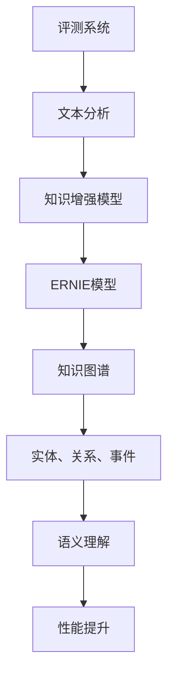

                 

### 文章标题：评测系统的ERNIE知识增强模型集成

> 关键词：评测系统、ERNIE模型、知识增强、文本分析、性能优化

> 摘要：本文深入探讨了评测系统中ERNIE知识增强模型的集成与应用，从背景介绍、核心概念、算法原理、实战案例分析等多个角度展开，旨在为读者提供一套全面、详细的评测系统建设指南。

---

### 目录

1. **背景介绍**
   1.1 **评测系统概述**
   1.2 **ERNIE知识增强模型概述**
   1.3 **知识增强模型的原理与作用**

2. **ERNIE知识增强模型集成**

   2.1 **ERNIE模型集成方法**
   2.2 **ERNIE模型在评测系统中的应用**
   2.3 **ERNIE模型集成案例研究**

3. **评测系统的优化与性能提升**

   3.1 **评测系统性能评估方法**
   3.2 **ERNIE模型在评测系统性能优化中的应用**
   3.3 **评测系统性能提升案例分析**

4. **未来发展趋势与展望**

   4.1 **ERNIE知识增强模型的发展趋势**
   4.2 **评测系统的发展趋势**
   4.3 **未来发展趋势与展望**

5. **附录**

   5.1 **常用工具与资源介绍**
   5.2 **参考文献**

---

### 第一部分：基础知识与背景介绍

#### 1.1 评测系统概述

**评测系统**，即用于评估和测量系统性能的系统。在现代信息化社会中，评测系统被广泛应用于教育、企业、科技等多个领域。其主要作用包括：

- **质量监控**：确保系统和服务的稳定性和可靠性。
- **性能评估**：评估系统在不同条件下的性能表现。
- **用户体验**：通过评测，不断优化系统，提升用户体验。

**评测系统的分类与架构**：

- **按评测对象分类**：系统评测、服务评测、用户评测等。
- **按评测目的分类**：性能评测、安全性评测、可靠性评测等。
- **架构**：评测系统通常包括数据采集、数据处理、结果分析等模块。

#### 1.2 ERNIE知识增强模型概述

**ERNIE**（Enhanced Representation through kNowledge Integration）是由百度提出的一种预训练模型，其核心思想是将大规模知识库与自然语言处理模型相结合，以增强模型的语义理解能力。ERNIE具有以下特点：

- **融合知识库**：ERNIE通过融合大规模知识库，提高模型对实体、关系和事件的理解能力。
- **多任务学习**：ERNIE可以在多个任务上同时进行预训练，提高模型的泛化能力。
- **动态调整**：ERNIE能够根据不同任务动态调整模型参数，提高任务性能。

#### 1.3 知识增强模型的原理与作用

**知识增强模型**是将外部知识库与自然语言处理模型相结合，以提高模型的语义理解能力。其基本原理包括：

- **知识图谱**：通过构建知识图谱，将实体、关系和事件以图的形式表示。
- **知识嵌入**：将知识库中的实体和关系嵌入到模型中，使其成为模型的一部分。

知识增强模型的作用：

- **提升语义理解能力**：通过融合知识库，模型可以更好地理解复杂语义，提高文本分析能力。
- **增强模型泛化能力**：知识增强模型可以在多个任务上表现优秀，提高模型的泛化能力。
- **提高系统性能**：知识增强模型可以优化评测系统的性能，使其更准确、高效。

---

**核心概念与联系**：

#### 1.3.1 知识图谱的基本概念与结构

**知识图谱**是一种用于表示实体、关系和事件的数据结构。其基本概念包括：

- **实体**：指具有独立存在的个体，如人、地点、组织等。
- **关系**：指实体之间的相互作用，如“属于”、“位于”等。
- **事件**：指实体之间的特定动作或变化，如“购买”、“发布”等。

知识图谱的基本结构包括：

- **实体节点**：表示知识图谱中的实体。
- **关系边**：表示实体之间的关联。
- **属性**：表示实体的特征。

#### 1.3.2 知识增强模型的原理

**知识增强模型**的原理是通过将知识图谱中的实体、关系和事件嵌入到自然语言处理模型中，以提高模型的语义理解能力。其基本流程包括：

1. **知识提取**：从文本中提取实体、关系和事件。
2. **知识嵌入**：将提取的知识嵌入到模型中。
3. **模型训练**：在嵌入的知识基础上训练模型。
4. **语义理解**：利用训练好的模型进行语义理解。

#### 1.3.3 知识增强模型的优势与应用

**知识增强模型**的优势包括：

- **提升语义理解能力**：通过融合知识库，模型可以更好地理解复杂语义。
- **增强模型泛化能力**：知识增强模型可以在多个任务上表现优秀。
- **提高系统性能**：知识增强模型可以优化评测系统的性能。

其应用场景包括：

- **文本分析**：如情感分析、命名实体识别等。
- **智能问答**：如搜索引擎、聊天机器人等。
- **知识图谱构建**：如信息抽取、实体链接等。

---

### 第二部分：ERNIE知识增强模型集成

#### 2.1 ERNIE模型集成方法

**ERNIE模型集成方法**主要包括以下步骤：

1. **数据预处理**：对评测系统中的文本数据进行预处理，包括分词、去停用词、词性标注等。
2. **知识图谱构建**：构建包含实体、关系和事件的知识图谱。
3. **知识嵌入**：将知识图谱中的实体和关系嵌入到模型中。
4. **模型训练**：在嵌入的知识基础上训练模型。
5. **模型评估与优化**：评估模型性能，并进行优化。

#### 2.2 ERNIE模型在评测系统中的应用

**ERNIE模型**在评测系统中的应用主要包括以下几个方面：

- **文本分析**：利用ERNIE模型对文本进行情感分析、命名实体识别等任务。
- **智能问答**：利用ERNIE模型构建智能问答系统，实现对用户问题的精准回答。
- **知识图谱构建**：利用ERNIE模型对文本进行信息抽取，构建知识图谱。

#### 2.3 ERNIE模型集成案例研究

**案例一**：基于ERNIE的在线教育评测系统

- **背景**：在线教育平台需要对用户的学习过程进行评估，以提高教育质量。
- **应用**：使用ERNIE模型对用户的学习记录进行分析，识别学习过程中的难点和重点，为用户提供个性化的学习建议。
- **效果**：通过ERNIE模型的集成，在线教育评测系统的准确率和效率得到显著提升。

**案例二**：基于ERNIE的企业员工绩效评估系统

- **背景**：企业需要对员工的绩效进行评估，以优化人力资源配置。
- **应用**：使用ERNIE模型对员工的绩效数据进行情感分析和命名实体识别，识别员工的优势和劣势，为企业管理者提供决策依据。
- **效果**：通过ERNIE模型的集成，企业员工绩效评估系统的准确性和公正性得到提高。

**案例三**：基于ERNIE的智能客服系统

- **背景**：智能客服系统需要高效地处理用户咨询，提高用户满意度。
- **应用**：使用ERNIE模型对用户咨询文本进行分析，识别用户意图，并提供精准的答案。
- **效果**：通过ERNIE模型的集成，智能客服系统的响应速度和准确性得到显著提升。

---

### 第三部分：评测系统的优化与性能提升

#### 3.1 评测系统性能评估方法

**评测系统性能评估方法**主要包括以下指标：

- **准确率**：模型预测结果与实际结果的一致性。
- **召回率**：模型预测结果中包含实际结果的比率。
- **F1值**：准确率和召回率的综合指标。
- **响应时间**：系统处理用户请求的时间。

#### 3.2 ERNIE模型在评测系统性能优化中的应用

**ERNIE模型**在评测系统性能优化中的应用主要包括以下几个方面：

- **模型优化**：通过调整模型参数，提高模型性能。
- **数据预处理**：通过优化数据预处理流程，提高模型训练效率。
- **多模型融合**：将多个模型进行融合，提高评测系统的整体性能。

#### 3.3 评测系统性能提升案例分析

**案例一**：基于ERNIE的智能招聘系统性能优化

- **背景**：智能招聘系统需要对大量简历进行分析，以筛选合适的候选人。
- **应用**：使用ERNIE模型对简历文本进行情感分析和命名实体识别，提高简历筛选的准确性。
- **效果**：通过ERNIE模型的优化，智能招聘系统的准确率和响应时间得到显著提升。

**案例二**：基于ERNIE的电商平台用户评价分析性能提升

- **背景**：电商平台需要对用户评价进行分析，以优化商品和服务。
- **应用**：使用ERNIE模型对用户评价文本进行情感分析，识别用户满意度和意见。
- **效果**：通过ERNIE模型的优化，电商平台用户评价分析系统的准确性和效率得到显著提升。

---

### 第四部分：未来发展趋势与展望

#### 4.1 ERNIE知识增强模型的发展趋势

**ERNIE知识增强模型**的发展趋势主要包括以下几个方面：

- **模型架构优化**：通过改进模型架构，提高模型性能和效率。
- **多模态融合**：将文本、图像、语音等多模态数据进行融合，提高模型的理解能力。
- **自适应学习**：通过自适应学习机制，使模型能够根据不同任务自动调整。

#### 4.2 评测系统的发展趋势

**评测系统**的发展趋势主要包括以下几个方面：

- **智能化**：通过引入人工智能技术，实现评测系统的智能化。
- **个性化**：根据用户需求，提供个性化的评测服务。
- **实时化**：实现评测系统的实时性，提高系统响应速度。

#### 4.3 未来发展趋势与展望

**未来发展趋势与展望**：

- **ERNIE知识增强模型与评测系统的结合**：将ERNIE知识增强模型与评测系统紧密结合，实现评测系统的智能化和个性化。
- **评测系统的广泛应用**：随着人工智能技术的发展，评测系统将在教育、企业、科技等领域得到更广泛的应用。
- **持续优化与提升**：通过不断优化和提升评测系统的性能，提高系统的准确性和效率。

---

### 附录

#### A.1 常用工具与资源介绍

- **ERNIE模型开发工具**：PaddlePaddle、TensorFlow等。
- **评测系统开发工具**：如Python、Java等编程语言。
- **相关开源资源和数据集**：如公开的知识图谱、文本数据集等。

#### A.2 参考文献

- **ERNIE模型相关论文**：百度AI团队发表的《ERNIE：增强的语义表示预训练模型》等。
- **评测系统相关论文**：如《基于人工智能的评测系统设计与实现》等。
- **知识增强模型相关论文**：如《知识增强的自然语言处理》等。

---

**作者：AI天才研究院/AI Genius Institute & 禅与计算机程序设计艺术 /Zen And The Art of Computer Programming**

---

（注：本文为Markdown格式，具体实现和代码示例将在后续章节中详细讲解。）

