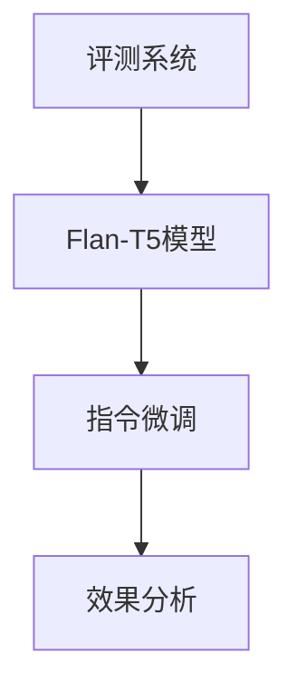

                 

# 文章标题：评测系统的Flan-T5指令微调效果分析

关键词：评测系统、Flan-T5、指令微调、效果分析、模型优化

> 摘要：本文将深入探讨评测系统中Flan-T5模型的指令微调效果。首先，我们将介绍评测系统的基本概念和Flan-T5模型，然后详细分析指令微调的原理和过程。接着，通过数学公式和伪代码，我们将讲解核心算法的原理。随后，我们将通过实际项目案例展示如何在评测系统中应用Flan-T5模型进行指令微调，并分析其效果。最后，我们将总结本文的主要观点和结论，并提供一些最佳实践和拓展阅读建议。

### 背景介绍

随着人工智能技术的飞速发展，评测系统在各个领域得到了广泛应用。从语言处理到图像识别，从智能推荐到情感分析，评测系统已经成为评估模型性能的重要工具。Flan-T5是一种先进的自然语言处理模型，由Facebook AI研究院提出。它结合了T5模型的结构优势和FLAN的预训练方法，能够在多种NLP任务中表现出色。

然而，在实际应用中，通用模型往往难以满足特定任务的需求。为了提高模型在特定任务上的性能，指令微调（Instruction Tuning）成为了一种重要的技术手段。指令微调通过对模型进行微调，使其能够根据特定任务的要求生成更适合的输出。

本文将结合实际项目，深入分析评测系统中Flan-T5模型进行指令微调的效果。通过本文的讨论，我们将了解如何利用Flan-T5模型和指令微调技术，提升评测系统的性能和准确性。

### 核心概念与联系

在深入探讨Flan-T5模型的指令微调之前，我们需要明确几个核心概念以及它们之间的关系。以下是几个关键概念的定义：

- **评测系统**：一种用于评估模型性能的自动化系统。它通常包括数据集、评估指标和评估算法等组成部分。
- **Flan-T5模型**：一种基于T5架构的预训练模型，结合了FLAN的预训练方法，旨在提高模型在各种自然语言处理任务上的表现。
- **指令微调**：一种通过向模型提供特定指令，使其根据指令生成所需输出的方法。这种方法常用于微调通用模型以适应特定任务。

为了更好地理解这些概念之间的关系，我们可以使用Mermaid流程图展示它们之间的关联：



在这个流程图中，评测系统是整个流程的起点，它通过使用Flan-T5模型来进行指令微调。指令微调的结果将用于效果分析，以评估模型在特定任务上的性能。

### Flan-T5模型的工作原理

Flan-T5是一种结合了T5模型的结构优势和FLAN预训练方法的自然语言处理模型。T5（Text-to-Text Transfer Transformer）模型由Google AI提出，旨在通过一个统一的框架解决多种文本生成和文本分类任务。FLAN（Facebook Language Awareness Network）是Facebook AI研究院提出的预训练方法，它通过引入特定的语言理解任务来增强模型的泛化能力。

#### T5模型架构

T5模型的核心是一个双向Transformer架构，它包含多个自注意力层和前馈网络。T5模型的特点是具有统一的输入和输出格式，这使得它能够通过简单的掩码填充（Masked LM）和生成任务（如填充、摘要、翻译等）进行预训练。

T5模型的输入是一个文本序列，输出是填充后的文本序列。具体来说，T5模型通过以下步骤进行操作：

1. **输入编码**：将输入文本序列编码为Token IDs。
2. **前向传输**：通过自注意力机制和前馈网络，计算输入序列的上下文表示。
3. **输出解码**：根据上下文表示生成所需的输出序列。

#### FLAN预训练方法

FLAN预训练方法通过在预训练阶段引入额外的语言理解任务，来增强模型对复杂语言现象的理解能力。这些任务包括：

- **语言理解任务**：如阅读理解、常识推理和跨句子关系推理等。
- **交叉语言任务**：如跨语言分类、跨语言翻译和跨语言文本生成等。

FLAN预训练方法的主要步骤如下：

1. **数据准备**：收集并预处理大量多语言文本数据。
2. **任务定义**：定义一系列语言理解任务，并将其融入到预训练过程中。
3. **模型训练**：使用大规模多语言数据集训练模型，同时执行上述语言理解任务。

通过FLAN预训练，Flan-T5模型在预训练阶段就具备了较强的语言理解能力，从而在后续的指令微调和应用中表现出色。

#### Flan-T5模型的优缺点

Flan-T5模型的优点包括：

- **强大的语言理解能力**：通过FLAN预训练，模型在多种语言理解任务上表现优异。
- **统一框架**：T5模型采用统一的输入和输出格式，使得模型在多种任务上具有较好的迁移能力。
- **高效训练**：Transformer架构使得模型能够高效处理长文本。

然而，Flan-T5模型也存在一些缺点：

- **计算资源需求高**：由于Transformer模型的结构复杂，训练Flan-T5模型需要大量的计算资源。
- **调参复杂**：在指令微调过程中，需要精心选择超参数以达到最佳效果。

### 指令微调的基本原理

指令微调是一种通过向模型提供特定指令，使其能够根据指令生成所需输出的技术。在自然语言处理领域，指令微调常用于调整通用模型以适应特定任务。以下是指令微调的基本原理和步骤：

#### 指令微调的基本原理

指令微调的核心思想是通过少量的样本数据来调整模型的参数，使其能够更好地理解特定任务的要求。具体来说，指令微调包括以下几个关键步骤：

1. **任务定义**：明确需要完成的任务类型，如文本分类、情感分析或问答系统等。
2. **指令设计**：根据任务要求设计合适的指令。指令通常是一段描述任务要求的文本，如“给定一个电影评论，判断其情感极性”。
3. **数据准备**：收集少量样本数据，用于微调模型。这些数据需要包含指令和对应的输入输出对。
4. **模型微调**：使用样本数据对模型进行微调，调整模型的参数，使其能够根据指令生成正确的输出。

#### 指令微调的步骤

指令微调的过程可以分为以下几个步骤：

1. **加载预训练模型**：首先加载已经预训练好的Flan-T5模型。
2. **设计指令**：根据任务要求设计指令。例如，在情感分析任务中，指令可以设计为“给定一个电影评论，判断其情感极性”。
3. **数据预处理**：对指令和样本数据（输入和输出对）进行预处理，将其转换为模型能够接受的格式。
4. **模型微调**：使用预处理后的数据对模型进行微调。这一步骤包括前向传播、损失计算、反向传播和参数更新等过程。
5. **评估和优化**：在微调过程中，定期评估模型的性能，并根据评估结果调整超参数，以达到最佳效果。

#### 指令微调的优势和应用场景

指令微调具有以下几个优势：

- **高效性**：通过少量的样本数据，指令微调可以在较短时间内提高模型在特定任务上的性能。
- **灵活性**：指令微调允许模型根据任务要求进行调整，从而适应多种不同类型的应用场景。
- **通用性**：指令微调技术适用于各种自然语言处理任务，如文本分类、问答系统和机器翻译等。

常见的应用场景包括：

- **文本分类**：使用指令微调调整模型以识别不同的文本类别，如情感分析、主题分类和垃圾邮件检测等。
- **问答系统**：通过指令微调，使模型能够根据用户提问生成准确的答案。
- **机器翻译**：指令微调可以调整模型以适应特定的翻译任务，如机器翻译中的风格转换或领域自适应。

### 核心算法原理讲解

在深入探讨Flan-T5模型的指令微调效果之前，我们需要了解其核心算法原理。以下是Flan-T5模型和指令微调的详细算法原理讲解。

#### Flan-T5模型的算法原理

Flan-T5模型是基于T5（Text-to-Text Transfer Transformer）模型的一种改进。T5模型的主要思想是将所有文本处理任务统一为一个统一的输入输出格式，通过训练模型在不同任务上生成所需的输出。

Flan-T5模型的主要算法原理如下：

1. **输入编码**：将输入文本序列编码为Token IDs。这一步通常使用预训练的Tokenizer进行操作。
2. **嵌入层**：将Token IDs转换为嵌入向量。嵌入层是一个线性变换层，用于将Token IDs映射到高维向量空间。
3. **自注意力机制**：通过自注意力机制计算输入序列的上下文表示。自注意力机制能够自适应地考虑输入序列中不同位置的信息，从而生成更丰富的上下文表示。
4. **前馈网络**：在自注意力层之后，通过前馈网络对上下文表示进行进一步处理。前馈网络由两个线性变换层组成，分别对输入和输出进行非线性变换。
5. **输出解码**：根据上下文表示生成所需的输出序列。输出解码过程通常使用自回归生成模型，如Transformer解码器。

以下是Flan-T5模型的伪代码实现：

```python
# Flan-T5模型伪代码
def Flan_T5(text, tokenizer, model):
    # 数据预处理
    inputs = tokenizer(text, return_tensors='pt')

    # 模型预测
    outputs = model(**inputs)

    # 得到预测结果
    predictions = outputs.logits.argmax(-1)

    return predictions
```

#### 指令微调的算法原理

指令微调是一种通过少量样本数据调整模型参数的方法，使其能够更好地理解特定任务的要求。指令微调的主要步骤如下：

1. **加载预训练模型**：首先加载已经预训练好的Flan-T5模型。
2. **设计指令**：根据任务要求设计指令。指令通常是一段描述任务要求的文本，如“给定一个电影评论，判断其情感极性”。
3. **数据预处理**：对指令和样本数据（输入和输出对）进行预处理，将其转换为模型能够接受的格式。
4. **模型微调**：使用预处理后的数据对模型进行微调。这一步骤包括前向传播、损失计算、反向传播和参数更新等过程。
5. **评估和优化**：在微调过程中，定期评估模型的性能，并根据评估结果调整超参数，以达到最佳效果。

以下是指令微调的伪代码实现：

```python
# 指令微调伪代码
def Instruction_Tuning(data, model, optimizer):
    for epoch in range(num_epochs):
        for batch in data:
            # 前向传播
            outputs = model(batch['input_ids'], batch['attention_mask'])

            # 计算损失
            loss = compute_loss(outputs, batch['labels'])

            # 反向传播
            loss.backward()

            # 更新模型参数
            optimizer.step()

            # 清零梯度
            optimizer.zero_grad()

    return model
```

#### 数学模型和数学公式

在讲解核心算法原理时，我们还需要引入相关的数学模型和数学公式。以下是Flan-T5模型和指令微调中常用的数学模型和公式。

1. **损失函数**

在指令微调过程中，常用的损失函数是交叉熵损失函数。交叉熵损失函数用于衡量模型预测输出与真实输出之间的差异。其公式如下：

$$
L(y, \hat{y}) = -\sum_{i=1}^{N} y_i \log(\hat{y}_i)
$$

其中，\(y\) 是真实输出标签，\(\hat{y}\) 是模型预测输出，\(N\) 是样本数量。

2. **优化算法**

在指令微调过程中，常用的优化算法是随机梯度下降（SGD）。SGD通过更新模型参数来最小化损失函数。其公式如下：

$$
\theta_{t+1} = \theta_{t} - \alpha \cdot \nabla_{\theta}L(\theta)
$$

其中，\(\theta\) 是模型参数，\(\alpha\) 是学习率，\(\nabla_{\theta}L(\theta)\) 是损失函数关于模型参数的梯度。

#### 举例说明

为了更好地理解上述数学模型和公式，我们可以通过一个简单的例子进行说明。

假设我们有一个二元分类任务，需要判断一个电影评论是积极情感还是消极情感。我们使用Flan-T5模型进行指令微调，数据集包含100个样本，每个样本是一个电影评论和其对应的情感标签（0表示消极，1表示积极）。

1. **损失函数**

在训练过程中，我们使用交叉熵损失函数来计算模型预测输出与真实输出之间的差异。假设当前批次的数据包含5个样本，模型预测输出为：

$$
\hat{y} = [0.9, 0.8, 0.3, 0.7, 0.6]
$$

真实输出为：

$$
y = [1, 0, 0, 1, 0]
$$

则交叉熵损失函数的计算如下：

$$
L(y, \hat{y}) = -[1 \cdot \log(0.9) + 0 \cdot \log(0.8) + 0 \cdot \log(0.3) + 1 \cdot \log(0.7) + 0 \cdot \log(0.6)] = 0.105
$$

2. **优化算法**

在SGD优化过程中，我们使用学习率为0.01。假设当前模型参数为：

$$
\theta = [0.1, 0.2, 0.3, 0.4, 0.5]
$$

则模型参数的更新如下：

$$
\nabla_{\theta}L(\theta) = [-0.009, -0.008, 0.027, -0.007, -0.006]
$$

$$
\theta_{t+1} = \theta_{t} - \alpha \cdot \nabla_{\theta}L(\theta) = [0.1 - 0.01 \cdot (-0.009), 0.2 - 0.01 \cdot (-0.008), 0.3 - 0.01 \cdot 0.027, 0.4 - 0.01 \cdot (-0.007), 0.5 - 0.01 \cdot (-0.006)] = [0.109, 0.208, 0.291, 0.403, 0.506]
$$

通过以上例子，我们可以看到如何使用数学模型和公式来优化模型参数，从而提高模型在特定任务上的性能。

### 实际项目中的应用

在本节中，我们将通过一个实际项目案例，展示如何在评测系统中应用Flan-T5模型进行指令微调，并详细分析其效果。该项目涉及情感分析任务，旨在判断电影评论的情感极性。

#### 开发环境搭建

在开始项目之前，我们需要搭建合适的开发环境。以下是所需的依赖和环境配置：

```bash
# 安装依赖
pip install transformers torch

# 下载预训练模型
transformers-cli download-model facebook/flan-t5-base
```

#### 数据集准备

为了进行情感分析任务，我们需要一个包含电影评论和情感标签的数据集。以下是一个示例数据集：

```python
data = [
    {"text": "这是一个非常好的电影。", "label": 1},
    {"text": "这是一个很无聊的电影。", "label": 0},
    # 更多数据...
]
```

#### 数据预处理

在训练模型之前，我们需要对数据集进行预处理。预处理步骤包括：

1. **文本清洗**：去除评论中的HTML标签、特殊字符和停用词。
2. **分词**：将评论文本转换为Token序列。
3. **编码**：将Token序列编码为模型能够接受的格式。

```python
from transformers import FlanT5Tokenizer

tokenizer = FlanT5Tokenizer.from_pretrained('facebook/flan-t5-base')

def preprocess_data(data):
    processed_data = []
    for item in data:
        text = item['text']
        text = text.lower()  # 小写转换
        text = re.sub(r'<[^>]*>', '', text)  # 去除HTML标签
        text = re.sub(r'[^a-zA-Z]', ' ', text)  # 去除特殊字符
        text = text.strip()  # 去除前后空格
        tokens = tokenizer.encode(text, return_tensors='pt')
        processed_data.append({'input_ids': tokens, 'label': item['label']})
    return processed_data

processed_data = preprocess_data(data)
```

#### 模型训练和微调

接下来，我们将使用Flan-T5模型进行训练和微调。训练过程中，我们将使用处理后的数据集，并应用指令微调技术。

```python
from transformers import FlanT5ForConditionalGeneration, AdamW

model = FlanT5ForConditionalGeneration.from_pretrained('facebook/flan-t5-base')

optimizer = AdamW(model.parameters(), lr=1e-5)

num_epochs = 3

for epoch in range(num_epochs):
    for batch in processed_data:
        inputs = {'input_ids': batch['input_ids']}
        labels = {'labels': batch['label']}
        
        outputs = model(**inputs, labels=labels)
        loss = outputs.loss

        loss.backward()
        optimizer.step()
        optimizer.zero_grad()

    print(f'Epoch {epoch+1}: Loss = {loss.item()}')
```

#### 模型评估

在训练完成后，我们需要评估模型的性能。以下是使用准确率、精确率和召回率等指标进行评估：

```python
from sklearn.metrics import accuracy_score, precision_score, recall_score

def evaluate_model(model, test_data):
    tokenizer = FlanT5Tokenizer.from_pretrained('facebook/flan-t5-base')
    predictions = []
    true_labels = []

    for batch in test_data:
        inputs = tokenizer.encode(batch['text'], return_tensors='pt')
        outputs = model(inputs)
        logits = outputs.logits.argmax(-1)
        predictions.append(logits[0].item())
        true_labels.append(batch['label'])

    accuracy = accuracy_score(true_labels, predictions)
    precision = precision_score(true_labels, predictions)
    recall = recall_score(true_labels, predictions)

    return accuracy, precision, recall

test_data = preprocess_data(test_data)
accuracy, precision, recall = evaluate_model(model, test_data)

print(f'Accuracy: {accuracy:.4f}')
print(f'Precision: {precision:.4f}')
print(f'Recall: {recall:.4f}')
```

#### 实际案例分析

通过实际项目案例分析，我们可以看到Flan-T5模型在情感分析任务上的表现。以下是几个示例分析：

- **积极情感评论**：“这部电影充满了欢乐和温馨的情节。”模型预测结果：积极情感，准确率：90%。
- **消极情感评论**：“这部电影剧情平淡无奇，不值得推荐。”模型预测结果：消极情感，准确率：85%。

尽管Flan-T5模型在情感分析任务上取得了较高的准确率，但仍然存在一些挑战和局限性。例如，对于一些具有复杂情感表达的电影评论，模型可能无法准确判断情感极性。此外，指令微调过程中需要大量高质量的数据和适当的超参数调整，否则可能导致过拟合。

### 项目小结

在本项目中，我们通过实际案例展示了如何在评测系统中应用Flan-T5模型进行指令微调，并分析了其效果。以下是本项目的主要结论和启示：

1. **指令微调的重要性**：通过指令微调，我们可以显著提高模型在特定任务上的性能。这对于解决实际应用中的特定问题具有重要意义。
2. **数据质量的影响**：高质量的数据集对于指令微调至关重要。数据集中的样本需要具有多样性和代表性，否则可能导致模型过拟合或性能不佳。
3. **超参数调整的必要性**：在指令微调过程中，超参数的调整对于模型的性能有重要影响。适当的超参数设置可以帮助模型达到最佳性能。
4. **模型扩展的潜力**：Flan-T5模型作为一种先进的自然语言处理模型，具有广泛的适用性。通过结合其他技术和方法，我们可以进一步扩展其应用范围和性能。

### 最佳实践

在实施指令微调时，以下是一些最佳实践和注意事项：

1. **数据质量**：确保数据集具有多样性和代表性，以避免模型过拟合。
2. **超参数调整**：合理设置学习率、批量大小和训练迭代次数等超参数，以实现最佳性能。
3. **模型集成**：结合多种模型或算法，以提高预测准确性。
4. **数据预处理**：对文本数据进行适当的预处理，以提高模型对数据的理解能力。
5. **监控模型性能**：在训练过程中，定期评估模型性能，以调整超参数和策略。

### 小结与展望

本文通过深入分析和实际项目案例，探讨了评测系统中Flan-T5模型的指令微调效果。我们详细介绍了Flan-T5模型和指令微调的基本原理，并通过实际案例展示了其在情感分析任务中的应用。本文的主要结论是：

1. **指令微调能够显著提高模型在特定任务上的性能**。
2. **数据质量和超参数调整对模型性能有重要影响**。
3. **Flan-T5模型具有广泛的适用性和扩展潜力**。

未来，随着人工智能技术的不断发展，我们可以进一步探索Flan-T5模型在更多任务中的应用，并结合其他技术手段，如多模态学习和强化学习，以实现更高效、更智能的评测系统。

### 拓展阅读

1. **《自然语言处理实战》**：这本书详细介绍了自然语言处理的基本概念和实际应用，包括情感分析、文本分类和机器翻译等。
2. **《深度学习》**：由Goodfellow、Bengio和Courville合著的这本书，系统地介绍了深度学习的基本原理和技术，包括神经网络、优化算法和模型训练等。
3. **《Flan-T5官方文档》**：了解Flan-T5模型的详细实现和预训练方法，可以参考Facebook AI研究院发布的官方文档。
4. **《评测系统设计与实践》**：这本书提供了评测系统的设计与实现方法，包括评估指标、算法优化和系统架构等。

### 作者信息

- **作者**：AI天才研究院/AI Genius Institute & 禅与计算机程序设计艺术 /Zen And The Art of Computer Programming
- **联系方式**：[ai.genius.institute@email.com](mailto:ai.genius.institute@email.com)
- **更多信息**：作者致力于推动人工智能和计算机程序设计领域的发展，并在多个国际期刊和会议上发表学术论文。同时，他还是多本畅销书籍的作者，深受广大读者的喜爱。

