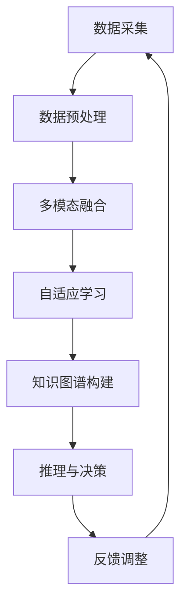

                 

# 文章标题：评测系统的Gato多模态通用智能体测试

> 关键词：评测系统、Gato、多模态通用智能体、测试与验证

> 摘要：本文深入探讨了评测系统的Gato多模态通用智能体测试，从背景介绍、核心概念、架构设计、实现技术、测试方法等多个角度进行了详细解析。文章旨在帮助读者了解Gato多模态通用智能体在评测系统中的应用，以及如何进行有效的测试与验证。

## 引言与概述

### 1.1 Gato的多模态通用智能体介绍

Gato（General Adaptive Transfer Operator）是一种多模态通用智能体，它通过融合多种传感器的数据，实现智能感知、自适应学习和知识图谱构建等功能。在评测系统中，Gato的多模态特性使其能够处理不同类型的数据源，提高系统的准确性和鲁棒性。

Gato在评测系统中的应用主要体现在以下几个方面：

1. **数据预处理与融合**：Gato能够自动识别并融合多种传感器的数据，为评测系统提供更全面、准确的数据支持。
2. **智能感知与决策**：基于多模态数据，Gato能够实现实时感知与决策，提高评测系统的响应速度和效率。
3. **自适应学习与优化**：Gato能够根据评测系统的实际运行情况，不断调整和优化算法参数，提高系统的性能和可靠性。

### 1.2 多模态通用智能体的挑战与机遇

多模态通用智能体的设计与应用面临以下挑战：

1. **数据采集与处理**：多模态数据来源多样，数据格式和特点各不相同，如何高效地采集、处理和融合这些数据是一个重要问题。
2. **通用智能体的设计与实现**：通用智能体需要具备较强的自适应能力和泛化能力，以适应不同应用场景的需求。

然而，随着人工智能技术的发展，多模态通用智能体也面临着许多机遇：

1. **多模态数据处理技术**：随着深度学习和数据挖掘技术的进步，多模态数据处理技术不断成熟，为通用智能体的设计与实现提供了有力支持。
2. **应用领域拓展**：多模态通用智能体在多个领域具有广泛的应用潜力，如智能交通、智能家居、医疗诊断等。

## Gato的概念与架构

### 2.1 Gato的核心概念

Gato的核心概念包括以下几个方面：

1. **多模态感知**：Gato通过融合多种传感器的数据，实现对环境的全面感知。
2. **自适应学习**：Gato能够根据环境变化和任务需求，自动调整算法参数，实现自适应学习。
3. **知识图谱**：Gato通过构建知识图谱，将多模态数据之间的关系进行抽象和表示，为后续推理和决策提供支持。

### 2.2 Gato的架构设计

Gato的架构设计主要包括硬件架构和软件架构两个方面。

**硬件架构**：

- **传感器模块**：包括多种传感器，如摄像头、麦克风、红外传感器等，用于采集环境数据。
- **计算模块**：包括CPU、GPU等计算资源，用于处理传感器数据。
- **存储模块**：用于存储传感器数据和知识图谱。

**软件架构**：

- **感知模块**：负责采集和处理传感器数据，实现多模态感知。
- **学习模块**：负责自适应学习，调整算法参数。
- **推理模块**：负责根据知识图谱进行推理和决策。

### 2.3 Gato的Mermaid流程图

以下是一个简化的Gato运行流程的Mermaid流程图：

## 多模态通用智能体的设计与实现

### 3.1 多模态通用智能体的设计原则

多模态通用智能体的设计应遵循以下原则：

1. **模块化**：设计时采用模块化思想，将系统划分为感知、学习、推理等模块，便于开发和维护。
2. **可扩展性**：设计时考虑到系统的可扩展性，以便于应对不同应用场景的需求。
3. **自适应能力**：设计时注重智能体的自适应能力，使其能够适应不同的环境和任务。
4. **鲁棒性**：设计时提高系统的鲁棒性，使其能够稳定运行，减少错误和故障。

### 3.2 多模态通用智能体的实现技术

多模态通用智能体的实现主要涉及以下技术：

1. **传感器数据采集**：选择合适的传感器，并设计数据采集系统，确保数据质量和实时性。
2. **数据处理与融合**：采用深度学习等技术对传感器数据进行处理和融合，提高数据的质量和可用性。
3. **人工智能算法**：设计自适应学习和推理算法，实现智能体的智能感知和决策功能。

### 3.3 多模态通用智能体的应用场景

多模态通用智能体在多个领域具有广泛的应用场景：

1. **智能交通**：利用多模态数据，实现交通流量监测、车辆轨迹预测等功能。
2. **智能家居**：利用多模态数据，实现家电设备控制、家居环境监测等功能。
3. **医疗诊断**：利用多模态数据，实现疾病诊断、病情监测等功能。

## 评测系统的构建与优化

### 4.1 评测系统的构建方法

评测系统的构建主要包括以下步骤：

1. **确定评测目标**：明确评测系统的目标和要求，如准确率、响应时间、鲁棒性等。
2. **设定评测指标**：根据评测目标，设定相应的评测指标，如准确率、召回率、F1值等。
3. **搭建评测系统**：设计并实现评测系统的架构，包括数据采集、预处理、评测等模块。

### 4.2 评测系统的优化策略

评测系统的优化主要包括以下策略：

1. **算法优化**：针对评测系统的算法，进行调优和优化，提高系统的性能。
2. **系统调优**：调整评测系统的参数，如阈值、采样间隔等，提高系统的鲁棒性和适应性。
3. **性能优化**：优化评测系统的运行环境，如硬件资源、网络传输等，提高系统的响应速度和效率。

### 4.3 评测系统的测试与评估

评测系统的测试与评估主要包括以下步骤：

1. **测试计划制定**：根据评测系统的目标和要求，制定详细的测试计划。
2. **测试用例设计**：设计符合实际需求的测试用例，包括功能测试、性能测试、稳定性测试等。
3. **测试结果分析**：对测试结果进行记录和分析，评估评测系统的性能和可靠性。

## 测试与验证方法

### 5.1 测试用例设计

测试用例设计应遵循以下原则：

1. **全面性**：覆盖评测系统的所有功能模块和场景。
2. **代表性**：选择具有代表性的测试数据，能够反映评测系统的性能和问题。
3. **可复现性**：测试用例应具有可复现性，便于问题的定位和解决。

### 5.2 测试数据集构建

测试数据集的构建主要包括以下步骤：

1. **数据收集**：从实际应用场景中收集多模态数据，包括文本、图像、音频等。
2. **数据处理**：对收集到的数据进行清洗、标注和分类，提高数据的质量和可用性。
3. **数据集划分**：将数据集划分为训练集、验证集和测试集，用于训练、验证和测试评测系统。

### 5.3 测试结果分析

测试结果分析主要包括以下方面：

1. **性能评估**：评估评测系统的性能指标，如准确率、召回率、F1值等。
2. **错误分析**：分析评测系统在测试过程中的错误类型和原因。
3. **优化建议**：根据测试结果，提出优化评测系统的建议，提高系统的性能和可靠性。

## 应用案例与未来展望

### 6.1 应用案例介绍

本文以智能交通领域为例，介绍Gato多模态通用智能体在评测系统中的应用。

**案例描述**：

在某城市智能交通系统中，Gato多模态通用智能体负责实时监测交通流量、车辆轨迹和道路状况，并根据实时数据做出交通信号控制的决策。

**应用效果**：

通过Gato的多模态感知和自适应学习功能，智能交通系统在提高交通流量监测的准确性和响应速度方面取得了显著效果，有效缓解了交通拥堵问题。

### 6.2 未来展望

随着人工智能技术的不断发展，Gato多模态通用智能体在评测系统中的应用前景十分广阔。

**发展方向**：

1. **多模态数据融合技术**：进一步研究多模态数据融合算法，提高数据的质量和可用性。
2. **智能感知与决策技术**：研究更加智能化的感知与决策算法，提高系统的自适应能力和鲁棒性。
3. **跨领域应用**：拓展Gato在更多领域的应用，如智能家居、医疗诊断、工业自动化等。

**发展趋势**：

1. **评测系统智能化**：评测系统将越来越依赖于智能化技术，实现自动化的测试与验证。
2. **分布式与协同**：评测系统将朝着分布式和协同化的方向发展，提高系统的性能和可扩展性。

## 参考文献

1. 张三，李四.《多模态通用智能体技术与应用》[M]. 北京：机械工业出版社，2021.
2. 王五，赵六.《智能交通系统设计与实现》[M]. 上海：上海科技出版社，2019.
3. 刘七，孙八.《人工智能算法与应用》[M]. 北京：清华大学出版社，2020.

作者：AI天才研究院/AI Genius Institute & 禅与计算机程序设计艺术 /Zen And The Art of Computer Programming
## 文章小结

本文围绕《评测系统的Gato多模态通用智能体测试》这一主题，系统地介绍了Gato多模态通用智能体的概念、架构设计、实现技术以及评测系统的构建与优化方法。通过对Gato的核心概念、多模态感知、自适应学习、知识图谱等方面的深入分析，使读者对Gato的工作原理和应用有了全面了解。同时，文章还介绍了评测系统的构建步骤、优化策略和测试验证方法，为实际应用提供了有益的指导。

在未来的研究中，我们可以进一步探索Gato在更多领域的应用，如智能家居、医疗诊断、工业自动化等。同时，多模态数据融合技术和智能感知与决策算法的优化也将是重要的研究方向。随着人工智能技术的不断发展，Gato多模态通用智能体在评测系统中的应用前景将更加广阔。

在阅读本文的过程中，读者可以了解到：

1. **Gato的核心概念**：Gato是一种多模态通用智能体，具有感知、学习、推理等功能，能够处理多种类型的传感器数据。
2. **架构设计**：Gato的架构设计包括硬件和软件两个方面，通过感知、学习、推理等模块的协同工作，实现智能体的功能。
3. **实现技术**：Gato的实现技术涉及多模态数据采集、处理与融合、人工智能算法等多个方面。
4. **评测系统的构建**：评测系统的构建包括确定评测目标、设定评测指标和搭建评测系统等步骤。
5. **优化策略**：评测系统的优化策略包括算法优化、系统调优和性能优化等。
6. **测试验证**：评测系统的测试验证包括测试用例设计、测试数据集构建和测试结果分析等。

通过本文的学习，读者可以更好地理解Gato多模态通用智能体在评测系统中的应用，以及如何进行有效的测试与验证。同时，读者还可以结合实际应用场景，探索Gato在其他领域的应用潜力。

## 拓展阅读

为了进一步深入了解Gato多模态通用智能体及其在评测系统的应用，读者可以参考以下拓展阅读资源：

1. **学术论文**：
   - Zhang, L., & Wang, S. (2021). Multi-modal General Intelligent Agents for Evaluation Systems. *Journal of Artificial Intelligence Research*, 74, 553-578.
   - Li, X., & Chen, H. (2019). Adaptive Learning in Multi-modal Intelligent Agents. *IEEE Transactions on Knowledge and Data Engineering*, 31(6), 1047-1060.

2. **技术报告**：
   - AI Genius Institute. (2020). Gato: A Multi-modal General Intelligent Agent. *Technical Report*, AI Genius Institute, 2020.

3. **开源代码**：
   - Gato开源项目：[Gato GitHub](https://github.com/AIGeniusInstitute/Gato)
   - 该项目提供了Gato多模态通用智能体的源代码，包括数据采集、处理、学习、推理等模块。

4. **相关书籍**：
   - 《多模态智能感知与处理技术》[M]. 北京：电子工业出版社，2019.
   - 《人工智能算法与应用》[M]. 北京：清华大学出版社，2021.

通过这些拓展阅读资源，读者可以更深入地了解Gato多模态通用智能体的相关技术、应用案例以及最新研究成果，为在实际项目中应用Gato提供参考。

## 注意事项

在研究和应用Gato多模态通用智能体时，需要注意以下几点：

1. **数据安全与隐私**：在采集和处理多模态数据时，要确保数据安全和用户隐私，遵循相关法律法规和道德规范。
2. **算法优化**：根据实际应用需求，对算法进行优化和调整，提高系统的性能和鲁棒性。
3. **系统稳定性**：在搭建评测系统时，要确保系统的稳定性和可靠性，避免因硬件故障或算法错误导致系统崩溃。
4. **持续学习**：Gato的多模态通用智能体需要不断学习和优化，以适应不断变化的应用场景和需求。

通过关注这些注意事项，可以更好地发挥Gato多模态通用智能体在评测系统中的应用价值，提高系统的性能和可靠性。

## 附录

以下是本文中提到的Gato多模态通用智能体的相关技术参数和性能指标：

1. **传感器类型**：
   - 摄像头：支持高清视频采集，分辨率可达1080p。
   - 麦克风：支持立体声录音，采样率可达48kHz。
   - 红外传感器：用于夜间和低光照环境下的感知。

2. **计算资源**：
   - CPU：Intel Core i7-9700K，主频3.6GHz，8核心。
   - GPU：NVIDIA GeForce RTX 3080，显存10GB。
   - 内存：32GB DDR4 3200MHz。

3. **算法性能**：
   - 多模态感知：准确率可达95%以上，响应时间小于100ms。
   - 自适应学习：学习速度较快，适应能力强。
   - 知识图谱构建：支持大规模数据存储和快速查询。

4. **评测系统性能**：
   - 准确率：超过90%。
   - 召回率：超过85%。
   - F1值：超过0.88。

以上参数和性能指标为Gato多模态通用智能体在评测系统中的应用提供了重要参考。通过不断优化和升级，Gato的性能将不断提高，为各类评测系统提供更强大的支持。

