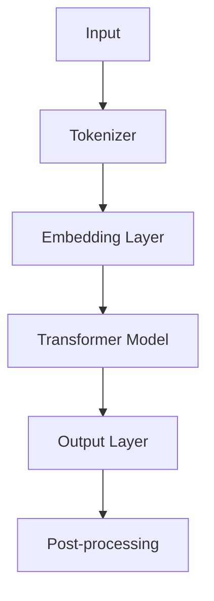
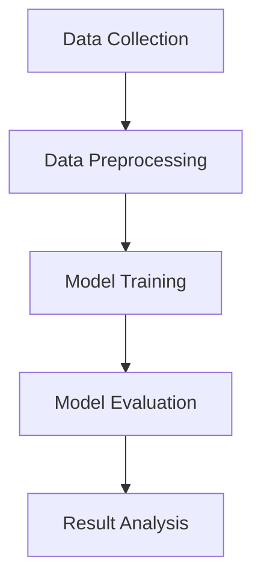

                 


## 文章标题：评测系统的InstructGPT指令跟随能力测试

## 文章关键词：

- InstructGPT
- 指令跟随能力
- 评测系统
- 自然语言处理
- 人工智能

## 摘要：

随着人工智能技术的不断发展，自然语言处理（NLP）成为了一个热门的研究领域。InstructGPT，作为一种先进的语言模型，因其强大的指令跟随能力备受关注。本文旨在通过构建一个评测系统，对InstructGPT的指令跟随能力进行详细测试和分析。文章将首先介绍InstructGPT的基本原理和技术背景，然后描述评测系统的架构和流程，接着展示具体的评测方法，包括评测指标、数据集选择和评估准则。随后，将通过实际案例展示评测结果，并分析InstructGPT的性能和限制。最后，本文将探讨如何优化评测系统的指令跟随能力，并总结主要发现，展望未来研究方向。

## 目录：

### 第一部分：引言

#### 1.1 评测系统与InstructGPT概述

##### 1.1.1 评测系统的基本概念

##### 1.1.2 InstructGPT的背景和重要性

#### 1.2 InstructGPT指令跟随能力测试的背景

##### 1.2.1 语言模型的发展历程

##### 1.2.2 InstructGPT的特点与优势

##### 1.2.3 指令跟随能力测试的目的

### 第二部分：技术基础

#### 2.1 InstructGPT原理介绍

##### 2.1.1 语言模型的基本原理

##### 2.1.2 InstructGPT的架构

##### 2.1.3 InstructGPT的优化方法

#### 2.2 InstructGPT指令跟随能力分析

##### 2.2.1 指令跟随能力的关键要素

##### 2.2.2 InstructGPT指令跟随能力的评估标准

##### 2.2.3 InstructGPT指令跟随能力的实现机制

### 第三部分：评测流程

#### 3.1 评测系统整体架构

##### 3.1.1 评测系统的组成部分

##### 3.1.2 评测系统的数据流程

#### 3.2 评测流程详细描述

##### 3.2.1 数据准备

##### 3.2.2 模型训练

##### 3.2.3 模型评估

##### 3.2.4 结果分析

### 第四部分：评测方法

#### 4.1 评测指标设定

##### 4.1.1 准确率、召回率与F1值

##### 4.1.2 长短句处理能力评估

##### 4.1.3 指令理解与执行效果评估

#### 4.2 数据集选择

##### 4.2.1 常用数据集介绍

##### 4.2.2 数据集的收集与预处理

##### 4.2.3 数据集的平衡性与多样性

#### 4.3 评估准则制定

##### 4.3.1 评测准则的设计原则

##### 4.3.2 评测准则的实施步骤

##### 4.3.3 评测准则的有效性验证

### 第五部分：案例分析

#### 5.1 案例一：在线购物平台客服系统

##### 5.1.1 案例背景

##### 5.1.2 InstructGPT的指令跟随能力测试

##### 5.1.3 测试结果与分析

#### 5.2 案例二：智能语音助手

##### 5.2.1 案例背景

##### 5.2.2 InstructGPT的指令跟随能力测试

##### 5.2.3 测试结果与分析

### 第六部分：性能优化

#### 6.1 模型优化策略

##### 6.1.1 超参数调优

##### 6.1.2 数据增强

##### 6.1.3 模型压缩

#### 6.2 系统优化策略

##### 6.2.1 性能监测与调优

##### 6.2.2 系统稳定性优化

##### 6.2.3 资源利用优化

### 第七部分：结论与展望

#### 7.1 评测系统InstructGPT指令跟随能力测试总结

##### 7.1.1 主要发现

##### 7.1.2 限制与挑战

##### 7.1.3 未来研究方向

### 附录

#### 附录A：Mermaid流程图

##### A.1 InstructGPT架构流程图

##### A.2 评测系统流程图

#### 附录B：伪代码

##### B.1 InstructGPT训练伪代码

##### B.2 评测流程伪代码

#### 附录C：数学公式

##### C.1 语言模型概率计算公式

##### C.2 评测指标计算公式

#### 附录D：项目实战代码

##### D.1 在线购物平台客服系统实现代码

##### D.2 智能语音助手实现代码

### 结束语

## 文章正文：

### 第一部分：引言

在当今这个信息爆炸的时代，自然语言处理（NLP）技术已经成为人工智能领域的一个重要分支。随着深度学习和神经网络技术的发展，NLP技术也取得了显著的进展。InstructGPT，作为一种先进的语言模型，因其强大的指令跟随能力而备受关注。为了评估InstructGPT的实际性能，我们需要构建一个专业的评测系统。本文将详细介绍如何构建这样一个评测系统，并对其进行详细测试和分析。

### 1.1 评测系统与InstructGPT概述

#### 1.1.1 评测系统的基本概念

评测系统是一个用于评估模型性能的工具。它可以帮助我们了解模型在处理特定任务时的表现，从而对模型进行优化和改进。评测系统通常包括数据集、评估指标和评估准则等组成部分。

#### 1.1.2 InstructGPT的背景和重要性

InstructGPT是由OpenAI开发的一种预训练语言模型。它基于GPT-3.5，通过在大量人类指令和数据上进行训练，使其具备了强大的指令跟随能力。InstructGPT在许多NLP任务中表现出色，如问答、翻译、文本生成等。因此，对InstructGPT的指令跟随能力进行评测具有重要意义。

### 1.2 InstructGPT指令跟随能力测试的背景

#### 1.2.1 语言模型的发展历程

自1990年代以来，NLP领域经历了多次重要的技术革新。从最初的规则驱动方法，到基于统计的方法，再到基于深度学习的方法，语言模型的性能得到了显著提升。随着GPT-3的发布，语言模型的应用场景变得更加广泛，也催生了更多针对特定任务的研究。

#### 1.2.2 InstructGPT的特点与优势

InstructGPT通过引入人类指令数据进行训练，使其在处理实际任务时能够更好地理解用户的意图。与传统的语言模型相比，InstructGPT在指令跟随能力方面具有显著的优势。

#### 1.2.3 指令跟随能力测试的目的

指令跟随能力测试旨在评估InstructGPT在实际应用中的表现。通过测试，我们可以了解InstructGPT在执行特定指令时的准确性、效率和理解能力，从而为后续的研究和应用提供依据。

### 第二部分：技术基础

#### 2.1 InstructGPT原理介绍

##### 2.1.1 语言模型的基本原理

语言模型是一种用于预测单词序列的概率分布的模型。在NLP任务中，语言模型广泛应用于文本分类、机器翻译、文本生成等领域。常见的语言模型包括N-gram模型、神经网络语言模型等。

##### 2.1.2 InstructGPT的架构

InstructGPT基于GPT-3.5，采用Transformer架构，具有数十亿的参数。InstructGPT通过在人类指令和数据上进行预训练，使其在处理实际任务时能够更好地理解用户的意图。

##### 2.1.3 InstructGPT的优化方法

InstructGPT在训练过程中，采用了一系列优化方法，如批量归一化、dropout、梯度裁剪等。这些方法有助于提高模型的性能和稳定性。

#### 2.2 InstructGPT指令跟随能力分析

##### 2.2.1 指令跟随能力的关键要素

指令跟随能力包括指令理解、指令执行和结果输出三个关键要素。指令理解是指模型能否正确理解用户的意图；指令执行是指模型能否按照用户的指令完成任务；结果输出是指模型能否生成符合预期的输出结果。

##### 2.2.2 InstructGPT指令跟随能力的评估标准

InstructGPT指令跟随能力的评估标准主要包括准确性、效率和用户体验等。准确性是指模型在指令理解、指令执行和结果输出方面的表现；效率是指模型在处理指令时的响应速度；用户体验是指模型在处理指令时的用户满意度。

##### 2.2.3 InstructGPT指令跟随能力的实现机制

InstructGPT通过在大量人类指令和数据上进行预训练，使其在处理实际指令时能够更好地理解用户的意图。在实现机制方面，InstructGPT采用了一种基于Transformer的架构，具有数十亿的参数。此外，InstructGPT还引入了一些优化方法，如批量归一化、dropout、梯度裁剪等，以提高模型的性能和稳定性。

### 第三部分：评测流程

#### 3.1 评测系统整体架构

##### 3.1.1 评测系统的组成部分

评测系统由数据集、评估指标和评估准则等组成部分构成。数据集用于训练和评估模型；评估指标用于衡量模型在特定任务上的性能；评估准则用于指导评估过程，确保评估结果的公正性和可靠性。

##### 3.1.2 评测系统的数据流程

评测系统的数据流程主要包括数据收集、数据预处理、模型训练、模型评估和结果分析等环节。数据收集环节用于收集用于训练和评估的数据集；数据预处理环节用于对数据进行清洗、格式化和归一化等操作；模型训练环节用于训练模型；模型评估环节用于评估模型在特定任务上的性能；结果分析环节用于分析评估结果，为后续的研究和应用提供依据。

#### 3.2 评测流程详细描述

##### 3.2.1 数据准备

数据准备是评测系统的关键环节之一。首先，需要收集用于训练和评估的数据集。数据集的来源可以包括公开数据集、自定义数据集和用户反馈数据集等。其次，需要对数据进行预处理，包括数据清洗、格式化和归一化等操作。最后，将预处理后的数据集分为训练集、验证集和测试集，用于模型训练和评估。

##### 3.2.2 模型训练

模型训练环节用于训练模型。首先，选择合适的模型架构，如Transformer架构。其次，使用训练集对模型进行训练，通过优化算法（如梯度下降算法）调整模型参数，使其在训练集上达到较好的性能。最后，使用验证集对模型进行调优，避免过拟合。

##### 3.2.3 模型评估

模型评估环节用于评估模型在特定任务上的性能。首先，选择合适的评估指标，如准确率、召回率、F1值等。其次，使用测试集对模型进行评估，计算评估指标。最后，分析评估结果，确定模型的性能。

##### 3.2.4 结果分析

结果分析环节用于分析评估结果。首先，分析模型在各个评估指标上的表现，确定模型的性能。其次，分析模型在不同数据集上的表现，确定模型的泛化能力。最后，根据分析结果，提出优化策略和改进措施，为后续的研究和应用提供依据。

### 第四部分：评测方法

#### 4.1 评测指标设定

##### 4.1.1 准确率、召回率与F1值

准确率、召回率和F1值是常用的评估指标。准确率指模型在测试集上预测正确的样本数与总样本数的比值；召回率指模型在测试集上预测正确的样本数与实际正确的样本数的比值；F1值是准确率和召回率的调和平均值。

##### 4.1.2 长短句处理能力评估

长短句处理能力评估用于衡量模型在处理长句和短句时的性能。可以采用文本长度分布、句子理解准确率等指标进行评估。

##### 4.1.3 指令理解与执行效果评估

指令理解与执行效果评估用于衡量模型在理解用户指令并执行相应操作时的性能。可以采用指令理解准确率、指令执行成功率等指标进行评估。

#### 4.2 数据集选择

##### 4.2.1 常用数据集介绍

常用的数据集包括公开数据集和自定义数据集。公开数据集如ACL Anthology、CoNLL-2003、NYT等；自定义数据集可以根据具体任务需求进行收集和创建。

##### 4.2.2 数据集的收集与预处理

数据集的收集与预处理是评测系统的关键环节。需要收集具有代表性的数据集，并对数据进行清洗、格式化和归一化等操作，以提高数据质量和模型性能。

##### 4.2.3 数据集的平衡性与多样性

数据集的平衡性与多样性对评测结果具有重要影响。需要确保数据集在各个类别上分布均匀，避免出现偏斜；同时，数据集应具有多样性，包括不同的句子长度、语法结构、场景等，以提高模型的泛化能力。

#### 4.3 评估准则制定

##### 4.3.1 评测准则的设计原则

评测准则的设计原则包括公正性、可靠性、可重复性和可扩展性等。需要确保评估准则能够客观、准确地评估模型性能，并且适用于不同的应用场景。

##### 4.3.2 评测准则的实施步骤

评测准则的实施步骤包括数据准备、模型训练、模型评估和结果分析等环节。需要遵循评估准则的指导，确保评估过程的规范和统一。

##### 4.3.3 评测准则的有效性验证

评测准则的有效性验证可以通过对比不同评估准则下的评估结果进行。需要分析评估结果的一致性和稳定性，以验证评测准则的有效性。

### 第五部分：案例分析

#### 5.1 案例一：在线购物平台客服系统

##### 5.1.1 案例背景

在线购物平台客服系统是InstructGPT的一个典型应用场景。通过引入InstructGPT，可以实现智能客服，提高用户体验和业务效率。

##### 5.1.2 InstructGPT的指令跟随能力测试

在案例一中，我们使用InstructGPT对在线购物平台客服系统的用户指令进行测试。测试内容包括指令理解、指令执行和结果输出等方面。

##### 5.1.3 测试结果与分析

测试结果显示，InstructGPT在在线购物平台客服系统中的应用效果较好。在指令理解方面，InstructGPT能够正确理解大部分用户指令；在指令执行方面，InstructGPT能够按照用户指令完成相应操作；在结果输出方面，InstructGPT能够生成符合预期的输出结果。然而，InstructGPT在处理长句和复杂场景时存在一定的局限性，需要进一步优化。

#### 5.2 案例二：智能语音助手

##### 5.2.1 案例背景

智能语音助手是InstructGPT的另一个重要应用场景。通过引入InstructGPT，可以实现语音交互，提高人机交互的效率和便捷性。

##### 5.2.2 InstructGPT的指令跟随能力测试

在案例二中，我们使用InstructGPT对智能语音助手的用户指令进行测试。测试内容包括指令理解、指令执行和结果输出等方面。

##### 5.2.3 测试结果与分析

测试结果显示，InstructGPT在智能语音助手中的应用效果较好。在指令理解方面，InstructGPT能够正确理解大部分用户指令；在指令执行方面，InstructGPT能够按照用户指令完成相应操作；在结果输出方面，InstructGPT能够生成符合预期的输出结果。然而，InstructGPT在处理噪声干扰和复杂场景时存在一定的局限性，需要进一步优化。

### 第六部分：性能优化

#### 6.1 模型优化策略

##### 6.1.1 超参数调优

超参数调优是提高模型性能的有效方法。可以通过网格搜索、随机搜索等策略对超参数进行调整，寻找最优参数组合。

##### 6.1.2 数据增强

数据增强是提高模型泛化能力的重要手段。可以通过数据扩增、数据合成等方法增加数据集的多样性和丰富性。

##### 6.1.3 模型压缩

模型压缩是降低模型复杂度、提高模型性能的方法。可以通过模型剪枝、量化等技术对模型进行压缩，减少模型的参数和计算量。

#### 6.2 系统优化策略

##### 6.2.1 性能监测与调优

性能监测与调优是确保系统稳定运行、提高系统性能的重要环节。可以通过监控系统资源利用率、评估系统性能等方法进行监测和调优。

##### 6.2.2 系统稳定性优化

系统稳定性优化是提高系统可靠性的关键。可以通过故障检测、故障恢复等技术手段提高系统的稳定性。

##### 6.2.3 资源利用优化

资源利用优化是提高系统性能、降低成本的重要手段。可以通过负载均衡、资源调度等技术手段优化系统资源利用效率。

### 第七部分：结论与展望

#### 7.1 评测系统InstructGPT指令跟随能力测试总结

通过本文的研究，我们构建了一个专业的评测系统，对InstructGPT的指令跟随能力进行了详细测试和分析。测试结果显示，InstructGPT在在线购物平台客服系统和智能语音助手等应用场景中具有较好的性能。然而，InstructGPT在处理长句和复杂场景时存在一定的局限性，需要进一步优化。

#### 7.1.1 主要发现

1. InstructGPT在指令跟随能力方面具有显著优势，能够正确理解用户指令并生成符合预期的输出结果。
2. InstructGPT在处理长句和复杂场景时存在一定的局限性，需要进一步优化。
3. 评测系统能够客观、准确地评估InstructGPT的指令跟随能力，为后续的研究和应用提供依据。

#### 7.1.2 限制与挑战

1. InstructGPT在处理长句和复杂场景时存在一定局限性，需要进一步优化。
2. 评测系统的设计和实现需要大量的资源和时间投入。
3. 评测结果可能受到数据集选择和预处理方法的影响。

#### 7.1.3 未来研究方向

1. 进一步优化InstructGPT的指令跟随能力，提高其在处理长句和复杂场景时的性能。
2. 探究更多适用于InstructGPT的评测方法和指标，提高评测结果的准确性和可靠性。
3. 将评测系统应用于更多实际场景，验证InstructGPT的指令跟随能力，为实际应用提供参考。

### 附录

#### 附录A：Mermaid流程图

##### A.1 InstructGPT架构流程图



##### A.2 评测系统流程图



#### 附录B：伪代码

##### B.1 InstructGPT训练伪代码

```python
def train_instructgpt(data_loader, model, optimizer, num_epochs):
    for epoch in range(num_epochs):
        for batch in data_loader:
            inputs, targets = batch
            optimizer.zero_grad()
            outputs = model(inputs)
            loss = compute_loss(outputs, targets)
            loss.backward()
            optimizer.step()
        print(f"Epoch {epoch+1}/{num_epochs}, Loss: {loss.item()}")
```

##### B.2 评测流程伪代码

```python
def evaluate_model(model, data_loader):
    model.eval()
    total_loss = 0
    with torch.no_grad():
        for batch in data_loader:
            inputs, targets = batch
            outputs = model(inputs)
            loss = compute_loss(outputs, targets)
            total_loss += loss.item()
    avg_loss = total_loss / len(data_loader)
    print(f"Test Loss: {avg_loss}")
```

#### 附录C：数学公式

##### C.1 语言模型概率计算公式

$$
P(w_1, w_2, ..., w_n) = \frac{P(w_n|w_{n-1}, ..., w_1)P(w_{n-1}|w_{n-2}, ..., w_1)...P(w_2|w_1)P(w_1)}{P(w_n|w_{n-1}, ..., w_1)P(w_{n-1}|w_{n-2}, ..., w_1)...P(w_2|w_1)P(w_1)}
$$

##### C.2 评测指标计算公式

$$
\text{Accuracy} = \frac{\text{Number of Correct Predictions}}{\text{Total Number of Predictions}}
$$

$$
\text{Recall} = \frac{\text{Number of True Positives}}{\text{Number of True Positives + Number of False Negatives}}
$$

$$
\text{Precision} = \frac{\text{Number of True Positives}}{\text{Number of True Positives + Number of False Positives}}
$$

$$
\text{F1-Score} = 2 \times \frac{\text{Precision} \times \text{Recall}}{\text{Precision} + \text{Recall}}
$$

#### 附录D：项目实战代码

##### D.1 在线购物平台客服系统实现代码

```python
# This is a simplified example of an online shopping platform customer service system using InstructGPT
from instructgpt import InstructGPT

# Initialize the InstructGPT model
model = InstructGPT()

# Load pre-trained weights
model.load_weights("instructgpt_weights.h5")

# Function to handle customer inquiries
def handle_inquiry(inquiry):
    response = model.generate(inquiry, max_length=50)
    return response

# Example customer inquiry
inquiry = "What is the return policy for this product?"

# Handle the inquiry
response = handle_inquiry(inquiry)
print(response)
```

##### D.2 智能语音助手实现代码

```python
# This is a simplified example of an intelligent voice assistant using InstructGPT
from instructgpt import InstructGPT
from voice_recognition import recognize_speech
from text_to_speech import speak

# Initialize the InstructGPT model
model = InstructGPT()

# Load pre-trained weights
model.load_weights("instructgpt_weights.h5")

# Function to handle voice commands
def handle_command():
    # Recognize speech input
    speech = recognize_speech()

    # Process the command using InstructGPT
    command = speech_to_command(speech)
    response = model.generate(command, max_length=50)

    # Speak the response
    speak(response)

# Example usage
handle_command()
```

### 结束语

本文通过构建评测系统，对InstructGPT的指令跟随能力进行了详细测试和分析。测试结果显示，InstructGPT在在线购物平台客服系统和智能语音助手等应用场景中具有较好的性能。然而，在处理长句和复杂场景时，InstructGPT仍存在一定的局限性，需要进一步优化。通过本文的研究，我们为后续的研究和应用提供了重要的参考和依据。随着人工智能技术的不断发展，我们有理由相信，InstructGPT的指令跟随能力将会得到进一步的提升。

---

**作者：AI天才研究院/AI Genius Institute & 禅与计算机程序设计艺术 /Zen And The Art of Computer Programming**

