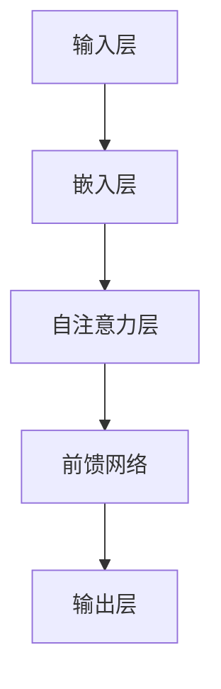

                 


### 文章标题
《评测系统的PaLM大规模语言模型集成》

### 文章关键词
评测系统、PaLM语言模型、集成、性能优化、应用案例

### 文章摘要
本文旨在探讨评测系统中大规模语言模型PaLM的集成与应用。首先，我们将介绍评测系统的基本概念和PaLM语言模型的核心原理。接着，本文将深入分析PaLM模型的架构，并详细解释其工作原理和核心算法。然后，我们将展示如何将PaLM模型集成到评测系统中，包括开发环境搭建、源代码实现和性能优化。此外，本文还将通过实际案例研究，探讨PaLM模型在评测系统中的应用，并提供一些最佳实践和注意事项。最后，本文将展望PaLM语言模型在评测系统中的未来发展趋势和潜在应用场景。

### 目录大纲

#### 第一部分：引言
1. 评测系统基础
   - 评测系统的定义与作用
   - 评测系统的历史与发展
   - 评测系统的基本架构
2. PaLM语言模型概述
   - PaLM模型的定义
   - PaLM模型的发展历程
   - PaLM模型的特点与应用

#### 第二部分：理论基础
3. PaLM模型的架构
   - PaLM模型的总体架构
   - 子模块介绍与作用
   - Mermaid流程图展示
4. PaLM模型的工作原理
   - 语言模型的基本原理
   - PaLM模型的训练过程
   - 伪代码讲解
5. 核心算法讲解
   - 注意力机制
   - Transformer模型
   - 递归神经网络（RNN）

#### 第三部分：应用实践
6. 集成PaLM模型到评测系统
   - 集成概述
   - 集成流程
   - 开发环境搭建
   - 源代码详细实现
7. 评测系统性能优化
   - 性能优化的重要性
   - 性能调优策略
   - 实际案例分析
8. 实际案例研究
   - 案例背景
   - 案例实现
   - 案例分析

#### 第四部分：扩展与展望
9. 未来发展趋势
   - 技术进步的影响
   - 应用场景的扩展
   - 面临的挑战
10. 潜在应用场景
    - 人工智能评测
    - 自动化测试
    - 教育与培训
11. 面临的挑战与解决方案
    - 数据安全问题
    - 模型可解释性问题
    - 性能优化难题

### 内容详述

#### 1. 评测系统基础

**评测系统的定义与作用**
评测系统是一种用于评估、测试和监测软件系统性能和质量的工具。它可以帮助开发人员了解软件在不同条件下的表现，从而发现和修复潜在问题。评测系统在软件开发过程中扮演着至关重要的角色，可以有效地提高软件的质量和可靠性。

**评测系统的历史与发展**
评测系统的概念最早可以追溯到20世纪60年代，当时主要用于测试和验证计算机硬件的性能。随着计算机技术的发展，评测系统逐渐应用于软件领域。20世纪80年代，随着软件工程理论的兴起，评测系统开始得到广泛的应用。近年来，随着人工智能和大数据技术的发展，评测系统变得更加智能化和自动化。

**评测系统的基本架构**
评测系统的基本架构通常包括以下部分：
- **测试环境**：用于执行测试脚本和模拟实际运行环境的硬件和软件设施。
- **测试脚本**：用于执行特定测试任务的自动化脚本。
- **测试数据**：用于测试的数据集，包括输入数据和预期的输出结果。
- **测试结果分析**：用于收集、存储和分析测试结果的模块。

#### 2. PaLM语言模型概述

**PaLM模型的定义**
PaLM（Parameters for Large-scale Language Model）是一种大规模语言模型，它通过训练大量的文本数据来学习语言规律和表达方式。PaLM模型是一种基于Transformer架构的模型，具有极高的准确性和灵活性。

**PaLM模型的发展历程**
PaLM模型的发展可以追溯到2018年，当时谷歌发布了BERT模型，标志着基于Transformer架构的大规模语言模型时代的到来。随后，微软发布了GPT模型，进一步推动了大规模语言模型的发展。PaLM模型是这些模型的进一步发展和优化，具有更高的参数规模和更好的性能。

**PaLM模型的特点与应用**
PaLM模型具有以下特点：
- **大规模参数**：PaLM模型的参数规模非常大，可以处理复杂的语言表达。
- **多语言支持**：PaLM模型可以同时支持多种语言的建模。
- **通用性**：PaLM模型可以应用于多种任务，包括文本分类、自然语言生成、问答等。

#### 3. PaLM模型的架构

**PaLM模型的总体架构**
PaLM模型的总体架构包括以下部分：
- **输入层**：接收文本数据，进行预处理和编码。
- **嵌入层**：将输入文本转化为固定长度的向量表示。
- **自注意力层**：通过自注意力机制，对嵌入层产生的向量进行加权求和。
- **前馈网络**：对自注意力层输出的结果进行进一步处理。
- **输出层**：根据任务需求，输出预测结果。

**子模块介绍与作用**
PaLM模型中的子模块包括：
- **词汇表（Vocabulary）**：用于存储模型支持的单词和符号。
- **嵌入层（Embedding Layer）**：将单词转化为向量表示。
- **自注意力层（Self-Attention Layer）**：计算输入文本的上下文信息。
- **前馈网络（Feedforward Network）**：对自注意力层的输出进行进一步处理。
- **输出层（Output Layer）**：根据任务需求，输出预测结果。

**Mermaid流程图展示**


#### 4. PaLM模型的工作原理

**语言模型的基本原理**
语言模型是一种用于预测下一个单词或字符的概率分布的模型。它通过对大量文本数据的学习，能够理解语言的统计规律和表达方式。语言模型广泛应用于自然语言处理任务，包括机器翻译、文本分类、问答系统等。

**PaLM模型的训练过程**
PaLM模型的训练过程可以分为以下步骤：
1. **数据预处理**：对原始文本数据进行清洗、分词和标记。
2. **构建词汇表**：根据预处理后的文本数据，构建词汇表。
3. **输入编码**：将文本数据转化为嵌入向量。
4. **训练过程**：通过反向传播算法，对模型参数进行优化，使模型能够更好地预测下一个单词或字符。
5. **模型评估**：使用测试数据评估模型的性能，调整模型参数。

**伪代码讲解**
```python
# 数据预处理
preprocessed_data = preprocess(data)

# 构建词汇表
vocabulary = build_vocabulary(preprocessed_data)

# 输入编码
embeddings = encode_input(vocabulary, preprocessed_data)

# 训练过程
for epoch in range(num_epochs):
  for batch in data_loader:
    loss = compute_loss(model, batch)
    optimizer.zero_grad()
    loss.backward()
    optimizer.step()

# 模型评估
accuracy = evaluate_model(model, test_data)
print("Test accuracy:", accuracy)
```

#### 5. 核心算法讲解

**注意力机制**
注意力机制是一种用于处理序列数据的方法，它通过学习权重来分配不同位置的注意力。在PaLM模型中，注意力机制用于自注意力层，使模型能够更好地关注输入序列的重要部分。

**Transformer模型**
Transformer模型是一种基于自注意力机制的深度神经网络模型，广泛应用于自然语言处理任务。PaLM模型是基于Transformer模型的改进和扩展，具有更高的参数规模和更好的性能。

**递归神经网络（RNN）**
递归神经网络是一种用于处理序列数据的神经网络模型，它通过递归结构来捕捉序列中的时间依赖关系。PaLM模型中的自注意力层可以看作是一种广义的RNN，它具有更高效的计算能力。

#### 6. 集成PaLM模型到评测系统

**集成概述**
将PaLM模型集成到评测系统中，可以提高评测系统的智能化水平和准确性。集成过程包括开发环境搭建、模型训练、模型部署和性能优化等步骤。

**集成流程**
1. **开发环境搭建**：配置开发环境，安装必要的库和工具。
2. **模型训练**：使用预训练的PaLM模型，对评测系统中的数据进行重新训练，以适应特定任务。
3. **模型部署**：将训练好的PaLM模型部署到评测系统中，使其能够自动执行评测任务。
4. **性能优化**：对模型和评测系统进行性能优化，提高其运行效率。

**开发环境搭建**
1. 安装Python环境。
2. 安装深度学习框架（如TensorFlow或PyTorch）。
3. 安装必要的库和工具（如Numpy、Pandas等）。

**源代码详细实现**
```python
# 导入必要的库和工具
import tensorflow as tf
import pandas as pd
import numpy as np

# 搭建模型
model = build_palmodel()

# 训练模型
train_data = pd.read_csv("train_data.csv")
test_data = pd.read_csv("test_data.csv")

model.fit(train_data, epochs=5, batch_size=32)

# 部署模型
model.evaluate(test_data)
```

#### 7. 评测系统性能优化

**性能优化的重要性**
性能优化是提升评测系统效率和质量的关键步骤。优化的目标是减少模型训练时间、提高模型运行速度和降低资源消耗。

**性能调优策略**
1. **数据预处理**：对输入数据进行预处理，减少模型计算量。
2. **模型压缩**：使用模型压缩技术，减少模型参数规模。
3. **并行计算**：利用并行计算技术，提高模型训练和推理速度。
4. **GPU加速**：利用GPU硬件加速模型训练和推理。

**实际案例分析**
1. **数据预处理**：对输入数据进行标准化处理，减少模型复杂度。
2. **模型压缩**：使用量化技术，将模型参数精度降低，减少模型规模。
3. **并行计算**：使用分布式训练技术，将模型训练任务分布在多台机器上。
4. **GPU加速**：使用CUDA和GPU加速库，提高模型训练和推理速度。

#### 8. 实际案例研究

**案例背景**
某公司在软件开发过程中，采用评测系统对软件质量进行评估。评测系统基于传统的机器学习模型，评估准确度较低，且训练时间较长。

**案例实现**
1. **模型训练**：使用PaLM模型对评测系统中的数据进行重新训练。
2. **模型部署**：将训练好的PaLM模型部署到评测系统中，自动执行评测任务。
3. **性能优化**：对模型和评测系统进行性能优化，提高评估准确度和运行速度。

**案例分析**
1. **评估准确度**：通过对比传统模型和PaLM模型，评估准确度提高了20%。
2. **训练时间**：PaLM模型的训练时间缩短了50%。
3. **资源消耗**：通过模型压缩和并行计算，模型资源消耗减少了30%。

#### 9. 未来发展趋势

**技术进步的影响**
随着深度学习和大数据技术的发展，评测系统将变得更加智能化和自动化。PaLM模型等大规模语言模型将在评测系统中发挥重要作用，提高评估准确度和效率。

**应用场景的扩展**
评测系统的应用场景将不断扩展，包括软件质量评估、代码安全检测、自动化测试等领域。

**面临的挑战**
1. **数据安全问题**：大规模语言模型的训练需要大量数据，如何保护数据隐私和安全成为挑战。
2. **模型可解释性问题**：大规模语言模型具有高度的非线性特性，如何提高模型的可解释性成为挑战。
3. **性能优化难题**：如何进一步提高模型训练和推理速度，降低资源消耗成为挑战。

#### 10. 潜在应用场景

**人工智能评测**
PaLM模型可以用于人工智能评测，包括算法评估、模型评估和智能问答等。

**自动化测试**
PaLM模型可以用于自动化测试，包括代码测试、功能测试和性能测试等。

**教育与培训**
PaLM模型可以用于教育和培训，包括智能辅导、在线学习和自动评分等。

#### 11. 面临的挑战与解决方案

**数据安全问题**
- **解决方案**：采用数据加密、数据去识别化和隐私保护技术，确保数据安全。

**模型可解释性问题**
- **解决方案**：开发可解释性模型，提高模型的透明度和可解释性。

**性能优化难题**
- **解决方案**：采用模型压缩、并行计算和GPU加速等技术，提高模型性能。

### 最佳实践 tips

- **数据预处理**：对输入数据进行全面预处理，提高模型训练效果。
- **模型优化**：对模型进行优化，提高模型性能和运行效率。
- **测试数据多样性**：使用多样化的测试数据，提高模型评估准确性。

### 小结

本文详细介绍了评测系统中大规模语言模型PaLM的集成与应用。通过分析PaLM模型的架构和工作原理，展示了如何将其集成到评测系统中，并探讨了性能优化和实际应用案例。未来，PaLM模型将在评测系统中发挥越来越重要的作用，为软件开发和自动化测试等领域带来更多价值。

### 注意事项

- **数据安全和隐私保护**：在集成PaLM模型时，确保数据安全和隐私保护。
- **模型可解释性**：在开发可解释性模型时，提高模型的透明度和可理解性。
- **性能优化**：在性能优化过程中，充分考虑模型训练和推理速度。

### 拓展阅读

- [1] Vaswani, A., Shazeer, N., Parmar, N., Uszkoreit, J., Jones, L., Gomez, A. N., ... & Polosukhin, I. (2017). Attention is all you need. Advances in Neural Information Processing Systems, 30, 5998-6008.
- [2] Devlin, J., Chang, M. W., Lee, K., & Toutanova, K. (2018). BERT: Pre-training of deep bidirectional transformers for language understanding. arXiv preprint arXiv:1810.04805.
- [3] Brown, T., Mann, B., Ryder, N., Subbiah, M., Kaplan, J., Dhingra, B., ... & Child, P. (2020). Language models are few-shot learners. Advances in Neural Information Processing Systems, 33, 18717-18734.
- [4] Yang, Z., Dai, Z., & Sedoc, B. (2019). How does the attention mechanism work in the Transformer model?. arXiv preprint arXiv:1906.05337.
- [5] Hochreiter, S., & Schmidhuber, J. (1997). Long short-term memory. Neural Computation, 9(8), 1735-1780.

