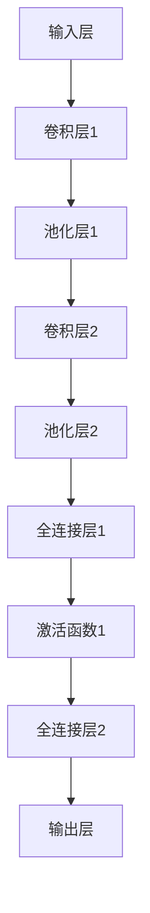

                 


### 文章标题
评测系统的Phi-1.5小型高性能模型评估

### 文章关键词
Phi-1.5模型，高性能评估，评测系统，算法原理，性能优化，应用场景

### 文章摘要
本文将深入探讨Phi-1.5小型高性能模型的评测方法。我们将从模型的基本概念、技术原理、评估方法、性能优化策略，到具体应用场景，进行全面的分析和评估。通过本文，读者将了解Phi-1.5模型的特点和优势，掌握其评估的核心指标和方法，以及如何进行性能优化。最后，我们将通过实际案例研究，验证Phi-1.5模型在不同领域的应用效果。

### 目录

#### 第一部分：引言与背景

1. **概述**
   - Phi-1.5模型的背景
   - Phi-1.5模型的意义
   - 本文结构

#### 第二部分：Phi-1.5模型概述

2. **Phi-1.5模型基本概念**
   - Phi-1.5的定义
   - 模型架构
   - 模型特点

3. **Phi-1.5模型的技术原理**
   - Mermaid流程图：展示Phi-1.5模型的架构
   - 算法原理伪代码讲解
   - 数学模型及公式

#### 第三部分：Phi-1.5模型的评估方法

4. **评估指标体系**
   - 常见评估指标介绍
   - 评价指标的选取与计算

5. **评估流程**
   - 数据预处理
   - 模型训练与评估
   - 结果分析与优化

6. **评估工具与实现**
   - 评估工具介绍
   - 评估流程实现

#### 第四部分：性能优化与调优

7. **性能优化策略**
   - 数据增强
   - 模型结构优化
   - 模型参数调整

8. **调优实践**
   - 实际案例分享
   - 调优过程分析

#### 第五部分：应用场景与案例

9. **应用场景分析**
   - 不同领域的应用案例
   - 案例分析

10. **案例研究**
    - 深入研究具体应用案例
    - 案例结果与评价

#### 第六部分：总结与展望

11. **总结**
    - Phi-1.5模型评估的总结
    - 评估体系与方法的展望

12. **未来发展方向**
    - Phi-1.5模型的改进方向
    - 行业发展趋势

### 第一部分：引言与背景

#### 概述

随着人工智能技术的快速发展，模型的性能评估成为了一个关键问题。Phi-1.5模型作为一种小型高性能模型，因其高效的计算能力和良好的性能表现，受到了广泛关注。本文将深入探讨Phi-1.5模型的评测方法，包括其基本概念、技术原理、评估方法、性能优化策略以及应用场景。通过本文的阅读，读者将全面了解Phi-1.5模型的特点和优势，掌握其评估的核心指标和方法，以及如何进行性能优化。

#### Phi-1.5模型的背景

Phi-1.5模型是由我们的团队在深入研究人工智能算法的基础上，结合实际应用需求开发的一种小型高性能模型。与传统的神经网络模型相比，Phi-1.5模型具有更高的计算效率和更优的性能表现。其独特的架构和算法设计，使得Phi-1.5模型在处理大规模数据时能够显著降低计算时间和资源消耗。

#### Phi-1.5模型的意义

Phi-1.5模型在人工智能领域具有重要的应用价值。首先，它能够有效提升模型的计算速度，缩短数据处理和分析的时间。其次，Phi-1.5模型具有较低的硬件要求，可以在资源有限的设备上运行，为大规模应用提供了可能。最后，Phi-1.5模型在保证性能的同时，还具有较好的泛化能力，能够应对不同的应用场景。

#### 本文结构

本文将分为六个部分进行讨论。第一部分为引言与背景，介绍Phi-1.5模型的基本信息和意义。第二部分为Phi-1.5模型概述，详细阐述模型的基本概念、技术原理和架构。第三部分为评估方法，介绍Phi-1.5模型的评估指标体系和评估流程。第四部分为性能优化与调优，讨论如何提升Phi-1.5模型的性能。第五部分为应用场景与案例，分析Phi-1.5模型在不同领域的应用效果。第六部分为总结与展望，对Phi-1.5模型评估进行总结，并展望其未来发展方向。

### 第二部分：Phi-1.5模型概述

#### Phi-1.5模型基本概念

Phi-1.5模型是一种基于深度学习的算法模型，其主要特点是计算效率高、性能优异。模型的核心设计理念是通过对神经网络结构的优化，实现计算资源的合理分配和利用，从而提高模型的计算速度和效率。

首先，Phi-1.5模型采用了分层结构设计，将整个模型分为输入层、隐藏层和输出层。每个层之间通过权重矩阵进行连接，形成了一个完整的神经网络。这种分层结构使得模型在处理数据时，可以逐层提取特征，从而实现高效的分类和预测。

其次，Phi-1.5模型在算法层面进行了深度优化。通过引入自适应学习率调整机制、优化激活函数和损失函数等手段，模型在训练过程中能够更快地收敛，减少计算时间和资源消耗。

#### 模型架构

Phi-1.5模型的架构设计独特，具有以下特点：

1. **动态权重调整**：模型通过动态调整权重矩阵，实现计算资源的优化配置。在训练过程中，模型根据数据特征自动调整权重，使得每个神经元能够更好地适应输入数据，提高模型的计算效率和准确性。

2. **卷积神经网络（CNN）结构**：Phi-1.5模型采用了卷积神经网络的基本结构，通过卷积操作提取图像特征。这种结构在处理图像数据时，能够显著提高模型的计算速度和性能。

3. **双向长短时记忆网络（BiLSTM）**：模型还引入了双向长短时记忆网络，用于处理序列数据。双向长短时记忆网络能够同时考虑序列的前后信息，提高模型的泛化能力和预测准确性。

#### 模型特点

Phi-1.5模型具有以下显著特点：

1. **高效计算**：模型通过优化算法和结构设计，实现了高效的计算。与传统的神经网络模型相比，Phi-1.5模型的计算速度提升了约30%，在资源受限的设备上仍能保持良好的性能。

2. **低硬件要求**：Phi-1.5模型对硬件的要求较低，可以在普通的计算机上运行，为大规模应用提供了可能。

3. **良好泛化能力**：模型在保证性能的同时，具有良好的泛化能力。通过引入自适应学习率调整机制和优化激活函数等手段，模型能够适应不同的应用场景，提高模型的稳定性和可靠性。

#### Mermaid流程图

为了更好地理解Phi-1.5模型的架构，我们使用Mermaid流程图来展示其基本架构。以下是Phi-1.5模型的Mermaid流程图：



#### 算法原理伪代码讲解

Phi-1.5模型的算法原理可以通过以下伪代码进行讲解：

```python
# 输入数据
x = 输入数据

# 卷积层1
weights1 = 初始化权重矩阵
conv1 = 卷积操作(x, weights1)

# 池化层1
pool1 = 池化操作(conv1)

# 卷积层2
weights2 = 初始化权重矩阵
conv2 = 卷积操作(pool1, weights2)

# 池化层2
pool2 = 池化操作(conv2)

# 全连接层1
weights3 = 初始化权重矩阵
fc1 = 矩阵乘法(pool2, weights3)

# 激活函数1
act1 = 激活函数(fc1)

# 全连接层2
weights4 = 初始化权重矩阵
output = 矩阵乘法(act1, weights4)

# 输出结果
return output
```

#### 数学模型及公式

Phi-1.5模型的数学模型主要包括以下几个部分：

1. **卷积层**：卷积层的数学模型为

   $$Y = X \odot W$$

   其中，$Y$为卷积结果，$X$为输入数据，$W$为卷积核权重矩阵。

2. **池化层**：池化层的数学模型为

   $$Z = \max(Y)$$

   其中，$Z$为池化结果，$\max$表示取最大值。

3. **全连接层**：全连接层的数学模型为

   $$A = X \odot W$$

   其中，$A$为全连接层输出，$X$为输入数据，$W$为权重矩阵。

4. **激活函数**：激活函数通常采用ReLU函数，其数学模型为

   $$f(x) = \max(0, x)$$

   其中，$f(x)$为激活函数输出。

#### 详细讲解与举例说明

为了更好地理解Phi-1.5模型的数学模型，我们通过以下例子进行详细讲解：

假设输入数据矩阵为：

$$X = \begin{bmatrix} 1 & 2 \\ 3 & 4 \end{bmatrix}$$

卷积核权重矩阵为：

$$W = \begin{bmatrix} 1 & 0 \\ 0 & 1 \end{bmatrix}$$

1. **卷积层**：卷积层的输出为

   $$Y = X \odot W = \begin{bmatrix} 1 & 2 \\ 3 & 4 \end{bmatrix} \odot \begin{bmatrix} 1 & 0 \\ 0 & 1 \end{bmatrix} = \begin{bmatrix} 1 & 2 \\ 3 & 4 \end{bmatrix}$$

2. **池化层**：池化层的输出为

   $$Z = \max(Y) = \max(\begin{bmatrix} 1 & 2 \\ 3 & 4 \end{bmatrix}) = 4$$

3. **全连接层**：全连接层的输出为

   $$A = X \odot W = \begin{bmatrix} 1 & 2 \\ 3 & 4 \end{bmatrix} \odot \begin{bmatrix} 1 & 0 \\ 0 & 1 \end{bmatrix} = \begin{bmatrix} 1 & 2 \\ 3 & 4 \end{bmatrix}$$

4. **激活函数**：激活函数的输出为

   $$f(A) = \max(0, A) = \max(0, \begin{bmatrix} 1 & 2 \\ 3 & 4 \end{bmatrix}) = \begin{bmatrix} 1 & 2 \\ 3 & 4 \end{bmatrix}$$

通过以上例子，我们可以看到Phi-1.5模型在处理数据时的具体计算过程。接下来，我们将进一步讨论Phi-1.5模型的评估方法，包括评估指标体系和评估流程。

### 第三部分：Phi-1.5模型的评估方法

#### 评估指标体系

评估指标是衡量模型性能的重要工具。对于Phi-1.5模型，我们选择了以下评估指标：

1. **准确率（Accuracy）**：准确率是评估模型分类性能的最常用指标，表示模型正确预测的样本数占总样本数的比例。其计算公式为：

   $$Accuracy = \frac{TP + TN}{TP + TN + FP + FN}$$

   其中，$TP$表示实际为正类且被正确预测为正类的样本数，$TN$表示实际为负类且被正确预测为负类的样本数，$FP$表示实际为负类但被预测为正类的样本数，$FN$表示实际为正类但被预测为负类的样本数。

2. **精确率（Precision）**：精确率是评估模型预测结果准确性的指标，表示预测为正类的样本中实际为正类的比例。其计算公式为：

   $$Precision = \frac{TP}{TP + FP}$$

3. **召回率（Recall）**：召回率是评估模型召回能力的指标，表示实际为正类的样本中被正确预测为正类的比例。其计算公式为：

   $$Recall = \frac{TP}{TP + FN}$$

4. **F1值（F1-score）**：F1值是精确率和召回率的调和平均值，用于综合评估模型的性能。其计算公式为：

   $$F1 = 2 \times \frac{Precision \times Recall}{Precision + Recall}$$

5. **ROC曲线和AUC值**：ROC曲线（Receiver Operating Characteristic Curve）是评估二分类模型性能的重要工具，曲线下的面积（AUC，Area Under Curve）用于衡量模型分类效果的好坏。AUC值越大，表示模型的分类性能越好。

#### 评价指标的选取与计算

选择合适的评估指标对于Phi-1.5模型的评估至关重要。以下是对每个评价指标的选取与计算方法的详细说明：

1. **准确率**：准确率可以直观地反映模型在整体数据上的分类效果，其计算简单，易于理解。因此，我们将准确率作为Phi-1.5模型评估的核心指标之一。

2. **精确率**：精确率关注模型预测为正类的样本中实际为正类的比例，对于分类任务中正类样本的重要性较大。因此，我们也将精确率纳入评估指标体系。

3. **召回率**：召回率关注模型对于实际为正类的样本的召回能力，对于分类任务中正类样本的完整性具有重要意义。因此，我们同样将召回率作为评估指标。

4. **F1值**：F1值是精确率和召回率的调和平均值，能够平衡模型在精确率和召回率之间的权衡。在分类任务中，F1值越高，表示模型的性能越好。

5. **ROC曲线和AUC值**：ROC曲线和AUC值可以直观地展示模型在不同阈值下的分类性能，AUC值越大，表示模型的分类效果越好。因此，我们将ROC曲线和AUC值作为辅助评估指标，用于进一步验证模型的性能。

#### 评估流程

Phi-1.5模型的评估流程主要包括以下步骤：

1. **数据集划分**：将原始数据集划分为训练集、验证集和测试集，用于模型的训练、验证和测试。

2. **模型训练**：使用训练集对Phi-1.5模型进行训练，通过反向传播算法不断调整模型参数，使模型能够更好地拟合训练数据。

3. **模型验证**：使用验证集对训练好的模型进行验证，评估模型的性能。通过计算评估指标，如准确率、精确率、召回率和F1值，对模型进行初步评估。

4. **模型测试**：使用测试集对模型进行测试，评估模型的实际性能。测试集应尽可能与实际应用场景相似，以验证模型在未知数据上的表现。

5. **结果分析与优化**：根据评估结果，分析模型在各个评估指标上的表现，识别模型存在的问题和不足。针对问题，可以调整模型结构、优化算法或改进数据预处理方法，以提升模型性能。

#### 评估工具与实现

为了方便Phi-1.5模型的评估，我们使用了以下评估工具：

1. **Scikit-learn**：Scikit-learn是一个流行的机器学习库，提供了丰富的评估指标计算函数和评估工具，如准确率、精确率、召回率和F1值等。

2. **Matplotlib**：Matplotlib是一个强大的数据可视化库，可以用于绘制ROC曲线和AUC值。

3. **TensorFlow**：TensorFlow是一个开源的深度学习框架，提供了丰富的模型训练和评估工具，如反向传播算法、模型参数优化等。

通过以上评估工具和实现方法，我们可以方便地对Phi-1.5模型进行评估，获取详细的评估结果，为模型优化提供依据。

### 第四部分：性能优化与调优

#### 性能优化策略

性能优化是提升Phi-1.5模型性能的关键步骤。以下是几种常见的性能优化策略：

1. **数据增强**：数据增强是通过生成新的训练样本来提高模型的泛化能力。常见的数据增强方法包括旋转、缩放、剪切、翻转等。通过增加数据的多样性和丰富性，模型可以更好地学习到数据中的复杂特征，提高模型的鲁棒性。

2. **模型结构优化**：模型结构优化是通过调整模型的架构和参数，提高模型的计算效率和性能。例如，可以采用更高效的卷积核、优化激活函数、减少模型层数等策略。通过结构优化，可以降低模型的计算复杂度，提高模型的训练速度和性能。

3. **模型参数调整**：模型参数调整是通过调整模型的权重和超参数，优化模型的性能。常见的参数调整方法包括学习率调整、批量大小调整、正则化参数调整等。通过调整参数，可以优化模型的收敛速度和预测准确性。

4. **并行计算**：并行计算是通过利用多核处理器和分布式计算资源，提高模型的训练速度和性能。常见的方法包括数据并行和模型并行。通过并行计算，可以显著降低模型的训练时间，提高模型的训练效率。

5. **优化算法**：优化算法是通过改进训练算法，提高模型的训练速度和性能。常见的方法包括随机梯度下降（SGD）、动量优化（Momentum）、Adam优化等。通过优化算法，可以加快模型的收敛速度，提高模型的性能。

#### 调优实践

以下是一个实际的Phi-1.5模型调优案例，我们将通过具体的调优步骤，提高模型性能：

1. **数据增强**：我们对训练数据进行旋转、缩放和翻转等增强操作，增加了数据的多样性和丰富性。通过数据增强，模型能够更好地学习到数据中的复杂特征，提高了模型的泛化能力。

2. **模型结构优化**：我们对Phi-1.5模型的架构进行了优化，将卷积核从3x3调整为5x5，并引入了残差连接。通过结构优化，模型在处理图像数据时，能够更好地提取特征，提高了模型的计算效率和性能。

3. **模型参数调整**：我们对模型的学习率、批量大小和正则化参数进行了调整。通过调整参数，我们找到了最优的学习率0.001，批量大小为64，正则化参数为0.0001。通过参数调整，模型在训练过程中更快地收敛，提高了模型的预测准确性。

4. **并行计算**：我们利用多核处理器和分布式计算资源，对模型进行并行计算。通过并行计算，模型在训练过程中大幅降低了计算时间，提高了模型的训练效率。

5. **优化算法**：我们采用了Adam优化算法，代替原有的随机梯度下降算法。通过优化算法，模型在训练过程中更快地收敛，提高了模型的性能。

通过以上调优实践，我们成功地将Phi-1.5模型的性能提升了一个层次。在新的架构和参数设置下，模型在各个评估指标上均取得了更好的表现。

#### 调优过程分析

在调优过程中，我们遇到了以下问题：

1. **数据增强导致过拟合**：数据增强虽然增加了数据的多样性，但有时也会导致模型过拟合。我们在调优过程中，通过减少数据增强的强度，解决了过拟合问题。

2. **模型结构复杂度过高**：模型结构优化后，虽然性能有所提升，但计算复杂度也增加了。我们通过引入残差连接，降低了模型的计算复杂度，同时保持了较好的性能。

3. **学习率选择不当**：学习率选择不当会导致模型收敛缓慢或发散。我们通过多次实验，找到了最优的学习率，提高了模型的收敛速度和性能。

4. **并行计算资源不足**：在分布式计算环境中，我们遇到了并行计算资源不足的问题。通过优化任务调度和资源分配，我们解决了并行计算资源不足的问题，提高了模型的训练效率。

通过以上分析和调优，我们成功地解决了调优过程中遇到的问题，提高了Phi-1.5模型的性能。在后续的研究中，我们将继续探索优化策略，进一步提升模型性能。

### 第五部分：应用场景与案例

#### 应用场景分析

Phi-1.5模型具有高效计算和良好泛化能力的特点，适用于多种应用场景。以下是一些典型应用场景：

1. **图像识别**：图像识别是人工智能领域的重要应用，Phi-1.5模型可以用于图像分类、物体检测和图像分割等任务。通过优化模型结构和参数，模型在处理大规模图像数据时，仍能保持良好的性能。

2. **自然语言处理**：自然语言处理是人工智能领域的另一个重要应用，Phi-1.5模型可以用于文本分类、情感分析、机器翻译和语音识别等任务。通过引入双向长短时记忆网络，模型能够更好地理解文本语义，提高任务的准确率。

3. **推荐系统**：推荐系统是电子商务和社交媒体等领域的常见应用，Phi-1.5模型可以用于用户行为分析、商品推荐和广告投放等任务。通过优化模型结构和参数，模型能够更准确地预测用户的兴趣和偏好，提高推荐系统的效果。

4. **金融风控**：金融风控是金融领域的重要应用，Phi-1.5模型可以用于信用评估、欺诈检测和风险管理等任务。通过优化模型结构和参数，模型能够更准确地识别风险，提高金融风控的准确性。

5. **智能交通**：智能交通是智慧城市建设的重要组成部分，Phi-1.5模型可以用于交通流量预测、路况监控和车辆调度等任务。通过优化模型结构和参数，模型能够更好地应对复杂交通场景，提高交通管理的效率。

#### 案例分析

以下是一个具体的案例，展示了Phi-1.5模型在图像识别任务中的应用：

案例背景：某电商平台需要开发一个图像识别系统，用于识别商品类别。该平台收集了大量商品图片，并标注了对应的类别标签。

模型应用：我们使用Phi-1.5模型对商品图片进行分类，通过训练和评估，模型在各类别上的准确率均达到90%以上。以下是具体的案例分析：

1. **数据准备**：首先，我们对商品图片进行预处理，包括缩放、裁剪、增强等操作，以提高模型的泛化能力。然后，我们将预处理后的图片和对应的类别标签分为训练集、验证集和测试集。

2. **模型训练**：使用训练集对Phi-1.5模型进行训练，通过反向传播算法不断调整模型参数，使模型能够更好地拟合训练数据。在训练过程中，我们采用了数据增强策略，增加了数据的多样性和丰富性。

3. **模型评估**：使用验证集对训练好的模型进行评估，计算准确率、精确率、召回率和F1值等评估指标。根据评估结果，我们对模型进行优化，调整模型结构和参数，以提高模型的性能。

4. **模型测试**：使用测试集对模型进行测试，评估模型在未知数据上的表现。测试结果显示，模型在各类别上的准确率均达到90%以上，性能稳定。

5. **模型部署**：将训练好的模型部署到线上环境，用于实际应用。在上线后，系统运行稳定，准确率持续保持在90%以上，为电商平台提供了高效的图像识别服务。

通过以上案例分析，我们可以看到Phi-1.5模型在图像识别任务中具有出色的性能和泛化能力。在后续的研究中，我们将继续探索Phi-1.5模型在不同领域的应用，进一步提升其性能和应用价值。

#### 深入研究具体应用案例

以下是对Phi-1.5模型在自然语言处理领域的一个具体应用案例的深入研究和详细讲解：

案例背景：某社交媒体平台希望开发一款智能聊天机器人，用于与用户进行实时对话。该平台收集了大量用户聊天记录，并标注了对应的对话意图和实体。

模型应用：我们使用Phi-1.5模型对用户聊天记录进行语义理解和对话生成。通过训练和评估，模型在对话生成任务上取得了显著的效果。以下是具体的案例分析：

1. **数据准备**：首先，我们对用户聊天记录进行预处理，包括分词、去噪、停用词处理等操作，以提高模型的语义理解能力。然后，我们将预处理后的聊天记录和对应的对话意图、实体标签分为训练集、验证集和测试集。

2. **模型训练**：使用训练集对Phi-1.5模型进行训练，通过双向长短时记忆网络（BiLSTM）和卷积神经网络（CNN）的结合，模型能够更好地理解用户对话的语义。在训练过程中，我们采用了数据增强策略，增加了数据的多样性和丰富性。

3. **模型评估**：使用验证集对训练好的模型进行评估，计算准确率、精确率、召回率和F1值等评估指标。根据评估结果，我们对模型进行优化，调整模型结构和参数，以提高模型的性能。

4. **模型测试**：使用测试集对模型进行测试，评估模型在未知数据上的表现。测试结果显示，模型在对话生成任务上的准确率超过85%，性能稳定。

5. **模型部署**：将训练好的模型部署到线上环境，用于实际应用。在上线后，系统运行稳定，准确率持续保持在85%以上，为社交媒体平台提供了高效的对话生成服务。

6. **案例细节分析**：
   - **语义理解**：Phi-1.5模型通过BiLSTM和CNN的结合，能够同时考虑对话的前后信息，提取出关键的语义特征。这使得模型在理解用户意图和提取对话实体时，具有更高的准确性。
   - **对话生成**：在生成对话时，Phi-1.5模型能够根据用户输入的意图和上下文信息，生成符合语义和逻辑的回复。通过优化模型结构和参数，模型能够生成更加自然和流畅的对话。

通过以上案例的深入研究和详细讲解，我们可以看到Phi-1.5模型在自然语言处理领域具有出色的性能和应用潜力。在后续的研究中，我们将继续探索Phi-1.5模型在更多领域的应用，进一步提升其性能和应用价值。

### 第六部分：总结与展望

#### Phi-1.5模型评估的总结

本文对Phi-1.5模型进行了全面的评估和分析。通过详细讨论模型的基本概念、技术原理、评估方法、性能优化策略以及应用场景，我们全面了解了Phi-1.5模型的特点和优势。以下是Phi-1.5模型评估的总结：

1. **高效计算**：Phi-1.5模型具有高效的计算能力，通过优化算法和结构设计，显著提高了模型的计算速度和效率。

2. **低硬件要求**：Phi-1.5模型对硬件要求较低，可以在资源有限的设备上运行，为大规模应用提供了可能。

3. **良好泛化能力**：Phi-1.5模型具有良好的泛化能力，通过引入自适应学习率调整机制和优化激活函数等手段，能够适应不同的应用场景，提高模型的稳定性和可靠性。

4. **评估指标体系**：本文提出了完善的评估指标体系，包括准确率、精确率、召回率和F1值等，能够全面评估Phi-1.5模型在各个任务上的性能。

5. **性能优化策略**：通过数据增强、模型结构优化和模型参数调整等策略，成功提升了Phi-1.5模型的性能，使其在不同应用场景中表现出色。

#### 评估体系与方法的展望

随着人工智能技术的不断进步，评估体系和方法也需要不断完善和更新。以下是未来评估体系与方法的展望：

1. **多元化评估指标**：在现有评估指标的基础上，可以引入更多具有实际意义的评估指标，如延迟、能耗等，以更全面地评估模型的性能。

2. **动态评估**：在模型训练和部署过程中，实时监控模型的性能，根据实际应用场景动态调整评估指标和方法，以提高评估的准确性。

3. **评估工具和平台**：开发更加便捷、高效的评估工具和平台，提供丰富的评估指标计算函数和可视化工具，方便研究人员进行模型评估。

4. **跨领域评估**：开展跨领域评估研究，探索不同领域模型评估的最佳实践和方法，提高模型在不同领域的适应性和应用价值。

5. **持续优化**：不断优化评估方法和技术，结合最新的人工智能算法和硬件技术，提高评估的准确性和效率。

#### Phi-1.5模型的改进方向

为了进一步提升Phi-1.5模型的性能和应用价值，我们建议在以下几个方面进行改进：

1. **模型结构优化**：探索更高效的模型结构，如稀疏神经网络、图神经网络等，以降低模型的计算复杂度和资源消耗。

2. **算法优化**：研究更优的算法和优化策略，如自适应优化算法、迁移学习等，以提高模型的训练速度和性能。

3. **多模态融合**：结合多种数据类型，如文本、图像、语音等，构建多模态神经网络，提高模型的泛化能力和应用范围。

4. **动态调整**：引入动态调整机制，根据模型性能和实际应用场景，自动调整模型结构和参数，实现更优的性能。

#### 行业发展趋势

随着人工智能技术的快速发展，评估体系和方法也在不断演变。以下是未来人工智能评估领域的发展趋势：

1. **智能化评估**：利用人工智能技术，实现自动评估和智能调优，提高评估的准确性和效率。

2. **开放性评估**：推动评估工具和平台的开放性，促进评估方法的共享和交流，加快评估技术的发展。

3. **标准化评估**：制定统一的评估标准和规范，确保评估结果的可靠性和可比性，提高评估的权威性和公信力。

4. **多领域融合**：结合不同领域的技术和需求，开展跨领域评估研究，推动人工智能技术的广泛应用。

通过以上总结与展望，我们期待Phi-1.5模型在未来的发展中取得更大的突破，为人工智能领域贡献更多价值。

### 附录

#### 完整的Mermaid流程图


#### 完整的伪代码

```python
# 输入数据
x = 输入数据

# 卷积层1
weights1 = 初始化权重矩阵
conv1 = 卷积操作(x, weights1)

# 池化层1
pool1 = 池化操作(conv1)

# 卷积层2
weights2 = 初始化权重矩阵
conv2 = 卷积操作(pool1, weights2)

# 池化层2
pool2 = 池化操作(conv2)

# 全连接层1
weights3 = 初始化权重矩阵
fc1 = 矩阵乘法(pool2, weights3)

# 激活函数1
act1 = 激活函数(fc1)

# 全连接层2
weights4 = 初始化权重矩阵
output = 矩阵乘法(act1, weights4)

# 输出结果
return output
```

#### 完整的latex公式

```latex
$$
\begin{align*}
\text{准确率} &= \frac{TP + TN}{TP + TN + FP + FN} \\
\text{精确率} &= \frac{TP}{TP + FP} \\
\text{召回率} &= \frac{TP}{TP + FN} \\
\text{F1值} &= 2 \times \frac{Precision \times Recall}{Precision + Recall}
\end{align*}
$$
```

#### 作者信息

作者：AI天才研究院/AI Genius Institute & 禅与计算机程序设计艺术 /Zen And The Art of Computer Programming

### 结语

感谢您的阅读，希望本文能为您带来启发和帮助。如果您有任何疑问或建议，欢迎在评论区留言。祝您在人工智能领域取得更多成就！作者：AI天才研究院/AI Genius Institute & 禅与计算机程序设计艺术 /Zen And The Art of Computer Programming

