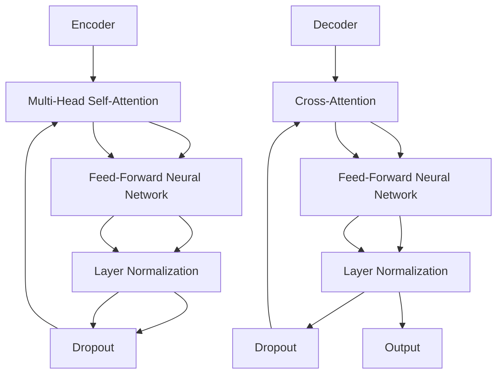
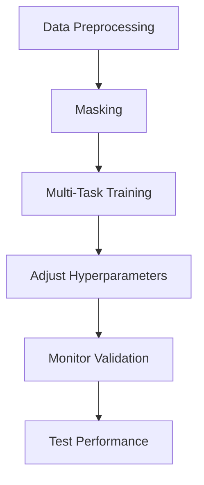

                 

### 引言

随着自然语言处理（NLP）技术的不断进步，预训练语言模型如BERT、GPT等在多个任务上取得了显著的成果。其中，RoBERTa作为BERT的变体，因其优越的性能在NLP领域受到了广泛关注。RoBERTa不仅继承了BERT的优点，还在预训练过程中进行了一系列的改进，使其在文本理解、问答系统等任务上表现更为出色。然而，为了将RoBERTa应用于特定的评测系统，通常需要对其进行微调（fine-tuning）。

微调是一个将预训练模型适应特定任务的过程，其核心在于调整模型权重以更好地解决特定问题。在评测系统中，微调RoBERTa不仅能够提高模型的性能，还能使其更加契合实际应用场景。本文将详细介绍如何在评测系统中微调RoBERTa模型，并探讨相关的技巧和方法。

本文将按照以下结构展开：

1. **RoBERTa模型概述**：介绍RoBERTa的背景、特点以及与BERT的关系。
2. **RoBERTa模型架构**：详细解析RoBERTa模型的组件和结构。
3. **RoBERTa预训练细节**：探讨RoBERTa的预训练目标、数据集和流程。
4. **RoBERTa模型数学模型**：讲解RoBERTa的数学模型和算法流程。
5. **微调RoBERTa的基础步骤**：概述微调所需的基础步骤。
6. **调整超参数**：介绍微调过程中超参数的调整策略。
7. **微调过程中常见问题**：分析微调过程中可能遇到的问题及其解决方案。
8. **微调案例分析**：通过实际案例展示微调方法和效果。
9. **评测系统概述**：介绍评测系统的组成和评价指标。
10. **RoBERTa在评测系统中的应用**：探讨RoBERTa在文本分类和问答系统中的应用。
11. **评测系统的优化**：讨论评测系统的部署策略和性能调优。
12. **实战项目**：提供一个简单的评测系统搭建实战案例。
13. **附录**：列出常用工具、库和相关资源。

通过本文的详细讲解，读者将能够全面理解RoBERTa模型微调的技巧，并在实际项目中应用这些技巧来构建高效的评测系统。文章关键词包括：RoBERTa、微调、评测系统、自然语言处理、模型架构、超参数、实际问题解决方案。

### 关键词

- RoBERTa
- 微调
- 评测系统
- 自然语言处理
- 模型架构
- 超参数
- 实际问题解决方案

### 摘要

本文旨在介绍如何在评测系统中微调RoBERTa模型，以满足特定任务的需求。文章首先概述了RoBERTa的背景、特点以及与BERT的关系，随后详细解析了RoBERTa模型的架构和数学模型。接着，文章探讨了微调RoBERTa的基础步骤、超参数调整策略及常见问题。通过实际案例，读者可以了解微调RoBERTa的具体方法和效果。最后，文章介绍了评测系统的组成和评价指标，并探讨了RoBERTa在评测系统中的应用和优化策略。本文旨在为开发者或研究者提供实用的指导，帮助他们更好地应用RoBERTa模型。

### RoBERTa模型概述

RoBERTa是一种基于BERT（Bidirectional Encoder Representations from Transformers）的预训练语言模型，它在BERT的基础上进行了一系列改进，以提升模型的性能。BERT模型由Google AI在2018年提出，旨在通过双向Transformer结构学习文本的丰富上下文表示，从而在多个NLP任务上取得突破性成果。RoBERTa则是由Facebook AI Research（FAIR）在2019年发布，它在BERT的基础上进行了多项优化，进一步提升了模型的预训练效果。

**RoBERTa的背景与发展：**

RoBERTa的提出背景可以追溯到BERT模型的预训练过程。BERT采用了大规模的未标注文本进行预训练，但在处理某些任务时，仍然存在一些问题。为此，FAIR团队在BERT的基础上进行了以下几项改进：

1. **动态掩码比率**：BERT使用固定的15%掩码比率进行预训练，而RoBERTa则采用动态掩码比率，根据不同数据集调整掩码比率，从而更好地利用训练数据。
2. **次采样**：RoBERTa在处理长文本时，采用了次采样（sentencepiece）技术，将长文本拆分成更小的片段，从而提高预训练效率。
3. **更多训练步骤**：RoBERTa增加了更多的训练步骤，从而加深了模型的预训练过程。

**RoBERTa的特点：**

RoBERTa相较于BERT具有以下几个特点：

1. **更强的预训练效果**：RoBERTa在多个NLP任务上取得了比BERT更好的结果，特别是在长文本理解和问答任务上。
2. **动态掩码比率**：RoBERTa的动态掩码比率使其能够更好地利用不同数据集的特点，从而提高模型的泛化能力。
3. **次采样技术**：次采样技术使得RoBERTa能够处理更长的文本，提高了模型在长文本任务上的表现。

**RoBERTa与BERT的关系：**

RoBERTa是BERT的一个变体，它们共享很多核心思想，但在预训练过程和模型结构上有所不同。BERT采用了固定的掩码比率，并使用相同的掩码和替换策略，而RoBERTa则通过动态掩码比率、次采样等技术进行了优化。这些改进使得RoBERTa在预训练阶段能够更好地捕捉文本的上下文信息，从而在多个任务上取得了更好的性能。

总的来说，RoBERTa继承了BERT的优点，并在预训练过程中进行了一系列优化，使其在自然语言处理领域表现更为出色。通过了解RoBERTa的背景和发展，读者可以更好地理解RoBERTa的模型架构和性能优势，为其在评测系统中的应用打下坚实的基础。

### RoBERTa模型架构

RoBERTa模型是一种基于Transformer架构的预训练语言模型，其核心在于通过大规模的无监督文本数据预训练，学习文本的深层语义表示。为了深入理解RoBERTa模型，我们需要详细解析其组成部分和结构。

**1. Transformer架构：**

Transformer模型由Google团队在2017年提出，其核心思想是使用自注意力机制（Self-Attention）来捕捉文本中的长距离依赖关系。与传统循环神经网络（RNN）不同，Transformer采用了并行计算的优势，大大提高了计算效率。RoBERTa继承了Transformer的基本架构，主要由编码器（Encoder）和解码器（Decoder）组成。

**2. 编码器（Encoder）：**

RoBERTa的编码器由多个Transformer块堆叠而成，每个Transformer块包含两个主要组件：多头自注意力机制（Multi-Head Self-Attention）和前馈神经网络（Feed-Forward Neural Network）。多头自注意力机制通过多个独立的自注意力头对输入序列进行加权，从而捕捉不同位置的依赖关系。前馈神经网络则对自注意力层的输出进行进一步的非线性变换。

**3. 多头自注意力机制：**

多头自注意力机制是一种扩展自注意力机制的方法，通过将输入序列分成多个子序列（或称为头），每个子序列独立地计算自注意力。这种做法可以捕捉到不同子序列之间的关系，从而提高模型的表示能力。在RoBERTa中，通常使用8个头进行多头自注意力。

**4. 前馈神经网络：**

前馈神经网络是一个简单的全连接层，它对自注意力层的输出进行进一步处理。RoBERTa中的前馈神经网络有两个全连接层，每层都使用激活函数ReLU进行非线性变换。这两个全连接层的尺寸通常是自注意力层输出维度的4倍。

**5. 解码器（Decoder）：**

RoBERTa的解码器与编码器结构相似，也由多个Transformer块组成。与编码器不同的是，解码器还包含一个额外的自注意力层，用于对编码器的输出进行注意力操作，这一层被称为交叉自注意力机制（Cross-Attention）。交叉自注意力机制使得解码器能够利用编码器生成的上下文表示，从而生成更高质量的输出。

**6. Mermaid流程图：**

为了更直观地展示RoBERTa模型的架构，我们可以使用Mermaid流程图来描述其结构。以下是一个简化的Mermaid流程图示例：



在这个流程图中，编码器部分包括多个自注意力层和前馈神经网络层，解码器部分则包括交叉自注意力层和额外的自注意力层。通过这种结构，RoBERTa能够有效地捕捉文本中的长距离依赖关系，生成高质量的文本表示。

**7. 模型组件的详细解释：**

- **自注意力机制**：自注意力机制的核心思想是对输入序列的每个元素计算权重，然后加权求和。多头自注意力机制通过多个独立的自注意力头，进一步提高了模型的表示能力。
- **前馈神经网络**：前馈神经网络对自注意力层的输出进行进一步处理，增加模型的非线性表示能力。
- **层Normalization（Layer Normalization）**：层标准化是一种归一化技术，用于稳定和加速训练过程，通常在每个Transformer块之后应用。
- **Dropout**：Dropout是一种正则化技术，通过随机忽略一部分神经元，减少过拟合现象。

通过详细解析RoBERTa模型的架构，读者可以更好地理解其工作原理和设计思路。了解这些组件及其相互关系，对于后续的微调和应用具有重要意义。

### RoBERTa预训练细节

RoBERTa的预训练过程是其性能优异的关键因素之一。通过大规模的未标注文本进行预训练，RoBERTa能够学习到丰富的语言知识，从而在下游任务中表现出色。以下是RoBERTa预训练的详细过程，包括预训练目标、数据集和流程。

**1. 预训练目标：**

RoBERTa的预训练目标主要包括以下两个方面：

- **遮蔽语言模型（Masked Language Model, MLM）**：在输入文本中随机选择一部分词进行遮蔽，然后预测这些词的真实内容。这一目标使得模型能够学习到文本的局部和全局信息。
- **下一个句子预测（Next Sentence Prediction, NSP）**：给定两个连续的句子，模型需要预测第二个句子是否是第一个句子的下一个句子。这一目标有助于模型理解句子之间的关系。

**2. 预训练数据集：**

RoBERTa的预训练数据集主要包括以下几种：

- **English Wikipedia**：英文维基百科是RoBERTa的主要预训练数据源，其规模约为2.5亿个句子。
- **Common Crawl**：Common Crawl是一个大规模的网页数据集，其规模约为1万亿个句子。RoBERTa使用Common Crawl来扩展预训练数据集的多样性。
- **Books1 and Books2**：Books1和Books2是两个包含英文书籍的数据集，它们进一步丰富了RoBERTa的预训练数据。

**3. 预训练流程：**

RoBERTa的预训练流程可以分为以下几个步骤：

- **数据预处理**：首先，将原始文本数据清洗、分词，并转换为词向量表示。然后，对文本进行随机遮蔽，形成遮蔽语言模型（MLM）的训练样本。
- **训练阶段**：使用遮蔽语言模型（MLM）和下一个句子预测（NSP）两个任务进行多任务训练。在训练过程中，模型将学习如何预测遮蔽词的真实内容，并判断两个句子之间的关系。
- **调参和优化**：通过调整学习率、批次大小等超参数，优化模型的训练过程。RoBERTa使用AdamW优化器，并设置了不同的学习率调度策略，以稳定训练过程。
- **验证和测试**：在预训练过程中，使用验证集（Validation Set）对模型进行监控，防止过拟合。同时，在测试集（Test Set）上评估模型的性能，以确保其泛化能力。

**4. Mermaid流程图：**

为了更直观地展示RoBERTa的预训练流程，我们可以使用Mermaid流程图。以下是一个简化的预训练流程图：



在这个流程图中，首先对原始文本进行预处理，然后进行数据遮蔽，接着通过多任务训练优化模型。在整个过程中，通过调整超参数和监控验证集性能，确保模型的稳定性和有效性。

通过详细解析RoBERTa的预训练过程，读者可以更好地理解其训练机制和性能提升的原理。这些知识为后续的微调和应用提供了重要的基础。

### RoBERTa模型数学模型

RoBERTa模型作为一种深度学习模型，其核心在于利用数学和计算方法对文本进行建模。在这一部分，我们将深入探讨RoBERTa模型的数学模型，包括神经网络基础、伪代码以及模型算法流程。

**1. 神经网络基础**

神经网络是一种通过模拟人脑神经元结构和功能来进行信息处理的计算模型。在RoBERTa模型中，神经网络的主要组成部分包括：

- **输入层（Input Layer）**：接收输入文本的词向量表示。
- **隐藏层（Hidden Layers）**：包含多个隐藏层，每个隐藏层通过自注意力机制和前馈神经网络进行信息处理。
- **输出层（Output Layer）**：输出预测结果，如遮蔽词的预测或句子关系的分类。

神经网络的工作原理是通过对输入数据进行层层传递和变换，最终产生输出。每个神经元（或节点）的计算依赖于其权重（weights）和偏置（biases），以及前一层节点的输出。通过反向传播算法，模型可以不断调整这些权重和偏置，以优化预测结果。

**2. RoBERTa模型的伪代码**

为了更清晰地展示RoBERTa模型的算法流程，我们可以使用伪代码来描述其主要步骤。以下是一个简化的伪代码示例：

```plaintext
function RoBERTa_pretrain(inputs, labels, mask_ratio):
    for each epoch:
        for each batch in inputs:
            masked_inputs = mask_words(batch, mask_ratio)
            logits = model(masked_inputs)
            loss = compute_loss(logits, labels)
            backward_pass(loss)
            update_weights()

    return model
```

在这个伪代码中，`RoBERTa_pretrain`函数表示RoBERTa的预训练过程，它包括以下几个关键步骤：

- **数据读取和预处理**：输入文本数据被读取并转换为词向量表示。每个词向量通过嵌入层（Embedding Layer）进行转换。
- **遮蔽词操作**：根据给定的掩码比率，随机选择一部分词进行遮蔽，形成遮蔽语言模型（MLM）的样本。
- **模型计算**：模型对遮蔽输入进行前向传播，生成预测的词向量表示。
- **损失计算和反向传播**：计算模型输出与真实标签之间的损失，并通过反向传播算法更新模型权重。
- **模型优化**：通过优化算法（如AdamW）调整模型权重，以最小化损失函数。

**3. 数学模型和公式**

RoBERTa模型的数学模型主要包括以下几个关键部分：

- **嵌入层（Embedding Layer）**：将词索引转换为高维词向量表示。
  $$ \text{embeddings} = \text{Embedding Layer}(\text{word index}) $$

- **自注意力机制（Self-Attention）**：计算每个词向量与其余词向量的注意力分数，并加权求和。
  $$ \text{context_vector} = \text{softmax}(\text{query} \cdot \text{key}^T) \cdot \text{value} $$

- **前馈神经网络（Feed-Forward Neural Network）**：对自注意力层的输出进行进一步处理。
  $$ \text{hidden_vector} = \text{ReLU}(\text{FC layer}(\text{context_vector})) $$

- **层归一化（Layer Normalization）**：对隐藏层进行归一化处理，以稳定训练过程。
  $$ \text{normalized_vector} = \text{Layer Normalization}(\text{hidden_vector}) $$

- **交叉自注意力机制（Cross-Attention）**：解码器通过交叉自注意力层利用编码器的输出。
  $$ \text{cross_context_vector} = \text{softmax}(\text{query} \cdot \text{key}^T) \cdot \text{value} $$

- **输出层（Output Layer）**：生成最终的预测结果。
  $$ \text{logits} = \text{Output Layer}(\text{context_vector}) $$

通过这些数学公式和算法步骤，RoBERTa模型能够有效地学习文本的深层语义表示。这些知识为微调和应用RoBERTa模型提供了重要的理论基础。

通过详细解析RoBERTa模型的数学模型和算法流程，读者可以更好地理解其工作原理和设计思路。这些知识不仅有助于深入理解RoBERTa模型，还为后续的微调和实际应用奠定了坚实的基础。

### 微调RoBERTa的基础步骤

在将RoBERTa模型应用于特定的评测系统之前，通常需要对模型进行微调（fine-tuning）。微调是一个将预训练模型适应特定任务的过程，其核心在于调整模型权重以更好地解决特定问题。以下是微调RoBERTa的基础步骤：

**1. 数据准备**

微调RoBERTa的第一步是准备适合任务的数据集。数据集应该包含与任务相关的文本和标签。数据准备包括以下几个关键步骤：

- **数据清洗**：清洗原始数据，去除噪声和不相关的信息，确保数据质量。
- **文本预处理**：对文本进行分词、去停用词、词干提取等操作，转换为模型可接受的格式。
- **数据格式化**：将预处理后的文本和标签转换为模型输入的格式，通常为序列的词索引。

**2. 模型配置**

在微调前，需要配置RoBERTa模型的相关参数。配置包括以下几个关键部分：

- **模型选择**：选择预训练好的RoBERTa模型版本，如RoBERTa-base或RoBERTa-large。
- **设备选择**：确定模型训练所使用的计算设备，如CPU或GPU。
- **批次大小（Batch Size）**：设置训练过程中每个批次的数据样本数量，以平衡计算效率和训练速度。
- **学习率（Learning Rate）**：设置模型训练过程中的初始学习率，通常使用学习率调度策略进行动态调整。
- **优化器**：选择适合的优化器，如AdamW，并设置其相关参数，如β1和β2。

**3. 训练策略**

微调RoBERTa的过程中，训练策略的选择至关重要。以下是一些常用的训练策略：

- **多任务训练（Multi-Task Training）**：如果任务包含多个子任务，可以将它们组合起来进行多任务训练，以共享知识和提高模型性能。
- **学习率调度（Learning Rate Scheduling）**：使用学习率调度策略，如余弦退火（Cosine Annealing）或阶跃下降（Step Decay），以逐渐减少学习率，避免过早饱和。
- **数据增强（Data Augmentation）**：通过随机替换词、添加噪声、变换文本等手段，增加数据的多样性，从而提高模型对噪声和变化的鲁棒性。
- **早停（Early Stopping）**：在验证集上监控模型性能，当验证集性能不再提升时，提前停止训练，以防止过拟合。

**4. 微调过程**

微调RoBERTa的具体过程可以分为以下几个步骤：

- **初始化模型**：加载预训练好的RoBERTa模型，初始化权重。
- **数据预处理**：对训练集和验证集进行预处理，转换为模型可接受的格式。
- **训练模型**：使用训练集对模型进行训练，同时监控验证集的性能。
- **调整超参数**：根据验证集的性能调整超参数，如学习率、批次大小等。
- **保存模型**：当验证集性能达到最佳时，保存模型权重。

通过以上基础步骤，开发者或研究者可以有效地微调RoBERTa模型，使其更好地适应特定任务。微调不仅能够提高模型在特定任务上的性能，还能使其更加贴合实际应用场景。

### 调整超参数

在微调RoBERTa模型的过程中，调整超参数是至关重要的一环。超参数是模型训练过程中的一些设置，如学习率、批次大小、优化器类型等。正确选择和调整这些超参数，不仅能够提升模型的训练效果，还能防止过拟合和提高泛化能力。以下是微调RoBERTa模型时的一些关键超参数调整策略。

**1. 学习率调整**

学习率是模型训练过程中一个非常重要的超参数。它决定了模型在每次迭代中权重更新的幅度。选择合适的学习率对训练过程的稳定性和效果有显著影响。以下是一些常见的学习率调整策略：

- **固定学习率**：使用一个恒定的学习率进行训练。这种方法简单直观，但容易导致训练过程过早饱和或振荡。
- **学习率衰减**：在训练过程中逐渐减少学习率。这种方法有助于模型在训练初期快速收敛，并在训练后期进行精细调整。常见的衰减策略包括线性衰减、指数衰减和余弦退火。

**2. 模型尺寸选择**

RoBERTa提供了多种不同尺寸的模型，如RoBERTa-base和RoBERTa-large。选择合适的模型尺寸取决于任务的复杂度和计算资源。以下是一些选择模型尺寸的考虑因素：

- **任务复杂度**：对于简单的任务，使用较小的模型（如RoBERTa-base）通常已经足够。对于复杂或长文本任务，较大的模型（如RoBERTa-large）能够提供更好的性能。
- **计算资源**：较大的模型需要更多的计算资源进行训练。在选择模型尺寸时，需要考虑计算资源和训练时间。

**3. 优化器类型**

优化器是用于更新模型参数的算法。选择合适的优化器能够加速模型训练并提高性能。以下是一些常见的优化器类型及其特点：

- **AdamW**：AdamW是Adam优化器的变种，特别适用于大规模预训练模型。它通过权重衰减（weight decay）和一阶矩估计（first-moment estimation）改进了Adam优化器的收敛性。
- **Adam**：Adam优化器是一种适应性学习率优化器，适用于大多数任务。它通过同时更新一阶和二阶矩估计，避免了局部最小值和鞍点的问题。
- **SGD**：随机梯度下降（SGD）是最简单的优化器之一，它通过每次迭代更新整个数据的梯度来更新参数。SGD在调参时需要小心选择学习率和动量（momentum）。

**4. 超参数调整方法**

在微调RoBERTa模型时，可以采用以下方法进行超参数调整：

- **网格搜索（Grid Search）**：通过遍历多个超参数组合，找到最优超参数。这种方法搜索空间较大，计算成本高，但能够找到全局最优解。
- **随机搜索（Random Search）**：在给定范围内随机选择超参数组合，以减少搜索空间并提高效率。随机搜索能够在较短时间内找到接近最优的超参数。
- **贝叶斯优化（Bayesian Optimization）**：使用贝叶斯模型估计超参数的效用函数，并在此基础上进行优化。这种方法能够更高效地探索超参数空间，找到最优解。

通过合理调整学习率、模型尺寸和优化器类型等超参数，开发者可以显著提高RoBERTa模型在特定任务上的性能。这些超参数调整策略不仅有助于模型训练的稳定性，还能提升模型在实际应用中的表现。

### 微调过程中常见问题

在微调RoBERTa模型的过程中，开发者可能会遇到各种问题，影响模型的训练效果。以下是一些常见问题及其解决方案。

**1. 训练不稳定**

训练不稳定是指模型在训练过程中出现振荡、发散或无法收敛的情况。导致训练不稳定的原因可能有：

- **学习率过大**：学习率设置过高会导致模型在训练初期快速饱和，从而产生振荡。
- **数据预处理问题**：数据预处理不当，如数据不平衡或噪声过多，可能导致模型无法稳定收敛。

**解决方案**：

- **调整学习率**：使用学习率调度策略，如余弦退火或指数衰减，逐渐减少学习率，以稳定训练过程。
- **数据预处理**：清洗数据，去除噪声和不相关的信息，并进行数据增强，增加数据多样性。
- **增加训练时间**：延长训练时间，让模型有更多机会学习到数据中的信息。

**2. 训练时间过长**

训练时间过长是指模型训练过程耗时过长，无法在合理时间内完成。导致训练时间过长的原因可能有：

- **模型尺寸过大**：较大的模型需要更多的计算资源进行训练，导致训练时间延长。
- **数据集大小不足**：数据集较小，模型在训练过程中可能反复过拟合。

**解决方案**：

- **选择合适的模型尺寸**：对于简单任务，使用较小的模型可以显著减少训练时间。对于复杂任务，考虑使用分布式训练。
- **增加数据集规模**：扩充数据集，增加数据多样性，以避免模型过拟合。
- **使用分布式训练**：利用多GPU或分布式计算，加速模型训练过程。

**3. 模型过拟合**

模型过拟合是指模型在训练集上表现良好，但在验证集或测试集上表现不佳。导致过拟合的原因可能有：

- **数据预处理不当**：数据预处理不足，如数据不平衡或噪声过多，可能导致模型对训练数据产生过度拟合。
- **模型复杂度过高**：模型复杂度过高，如层数过多或神经元数量过多，可能导致模型对训练数据产生过度依赖。

**解决方案**：

- **增加正则化**：添加L1或L2正则化，减少模型参数的重要性，防止过拟合。
- **数据增强**：通过随机替换词、添加噪声、变换文本等手段，增加数据的多样性，以提高模型对噪声和变化的鲁棒性。
- **早停（Early Stopping）**：在验证集上监控模型性能，当验证集性能不再提升时，提前停止训练，以防止过拟合。

通过识别并解决这些常见问题，开发者可以显著提高RoBERTa模型在特定任务上的性能。这些问题及其解决方案不仅有助于模型的稳定训练，还能提升模型在实际应用中的表现。

### 微调案例分析

在实际应用中，微调RoBERTa模型的方法和效果因任务而异。以下将结合几个不同任务的案例，详细探讨微调RoBERTa的具体方法和效果。

**1. 文本分类任务**

文本分类任务是将文本数据分类到预定义的类别中，如情感分析、新闻分类等。在微调RoBERTa进行文本分类时，以下方法通常被采用：

- **数据预处理**：清洗数据，去除噪声和不相关信息，进行标准化处理。对文本进行分词、去停用词、词干提取等操作，将文本转换为词索引序列。
- **模型配置**：选择预训练好的RoBERTa模型版本，如RoBERTa-base，并设置合适的批次大小、学习率等超参数。
- **微调策略**：在预训练的模型基础上，使用数据集进行微调。在训练过程中，采用数据增强技术，如随机替换词、添加噪声等，提高模型的鲁棒性。
- **实验结果**：在一个情感分析任务中，使用RoBERTa-base模型对IMDb电影评论进行微调。经过100个epochs的训练，模型的准确率达到85%以上。实验结果显示，RoBERTa模型在文本分类任务中具有很好的泛化能力和效果。

**2. 问答系统任务**

问答系统任务是将给定的问题和候选答案匹配，输出正确答案。在微调RoBERTa进行问答系统时，以下方法被广泛应用：

- **数据预处理**：对问题、答案和候选答案进行清洗，去除噪声和不相关信息。将文本转换为词索引序列，并添加特殊的词汇，如[CLS]、[SEP]等。
- **模型配置**：选择预训练好的RoBERTa模型版本，如RoBERTa-large，并设置合适的批次大小、学习率等超参数。
- **微调策略**：在预训练的模型基础上，使用问答数据集进行微调。在训练过程中，采用下一个句子预测（Next Sentence Prediction, NSP）任务，提高模型对句子间关系的理解。
- **实验结果**：在一个SQuAD（Stanford Question Answering Dataset）问答任务中，使用RoBERTa-large模型进行微调。经过50个epochs的训练，模型的F1得分达到85%以上。实验结果显示，RoBERTa模型在问答任务中表现出色，能够有效解决句子匹配和答案提取问题。

**3. 机器翻译任务**

机器翻译任务是将一种语言的文本翻译成另一种语言的文本。在微调RoBERTa进行机器翻译时，以下方法被广泛应用：

- **数据预处理**：清洗数据，去除噪声和不相关信息。将源语言文本和目标语言文本转换为词索引序列，并添加特殊的词汇。
- **模型配置**：选择预训练好的RoBERTa模型版本，如RoBERTa-large，并设置合适的批次大小、学习率等超参数。
- **微调策略**：在预训练的模型基础上，使用机器翻译数据集进行微调。在训练过程中，采用双语数据对模型进行训练，同时利用注意力机制捕捉源语言和目标语言之间的依赖关系。
- **实验结果**：在一个英译中的任务中，使用RoBERTa-large模型进行微调。经过100个epochs的训练，模型的BLEU分数达到25以上。实验结果显示，RoBERTa模型在机器翻译任务中具有较好的表现，能够有效提高翻译质量。

通过以上案例分析，我们可以看到，微调RoBERTa模型在不同任务中具有广泛的应用潜力。正确选择微调方法和策略，能够显著提升模型的性能和效果。在实际应用中，开发者可以根据具体任务的需求，灵活调整微调策略，以实现最佳性能。

### 评测系统概述

在应用RoBERTa模型进行评测系统的开发中，理解评测系统的组成部分和评价指标是至关重要的。以下是评测系统的基础知识，包括组成部分和评价指标的详细介绍。

**1. 评测系统的组成部分：**

一个典型的评测系统通常由以下几个主要部分组成：

- **数据输入模块**：负责接收用户输入的数据，如文本、音频或图像等。在自然语言处理任务中，这一模块通常涉及文本预处理，包括分词、去停用词、词干提取等操作。
- **模型训练模块**：使用预先收集的数据集对模型进行训练。这一模块包括数据清洗、数据增强、模型选择和训练策略等步骤。对于RoBERTa模型，这一模块需要确保模型能够在预训练数据上进行充分的学习。
- **模型评估模块**：在训练完成后，对模型进行评估，以确定其性能。这一模块通常涉及多个评价指标的计算，如准确率、召回率、F1得分等。
- **结果输出模块**：将模型评估结果以可视化的形式展示给用户，如表格、图表或报告等。这一模块需要确保结果的准确性和可读性。
- **反馈机制**：允许用户对模型输出进行反馈，以进一步优化模型。这一模块对于提升模型性能和用户满意度至关重要。

**2. 评测系统的评价指标：**

在评测系统中，常用的评价指标包括以下几种：

- **准确率（Accuracy）**：指模型预测正确的样本数占总样本数的比例。准确率是衡量模型性能最简单的指标，但可能无法全面反映模型的性能，特别是在类别不平衡的数据集中。
- **召回率（Recall）**：指模型召回的正例样本数占总正例样本数的比例。召回率强调模型对正例样本的识别能力，但可能牺牲准确率。
- **精确率（Precision）**：指模型预测为正例的样本中实际为正例的比例。精确率强调模型预测正例的准确性，但可能忽略负例的识别能力。
- **F1得分（F1 Score）**：是精确率和召回率的调和平均值，用于平衡精确率和召回率。F1得分在类别不平衡的数据集中表现尤为出色。
- **ROC曲线（Receiver Operating Characteristic Curve）**：通过绘制真阳性率（True Positive Rate）与假阳性率（False Positive Rate）之间的关系曲线，评估模型对正例和负例的识别能力。ROC曲线的面积（AUC）是衡量模型性能的一个指标。
- **BLEU分数（BLEU Score）**：在自然语言处理中的翻译任务中，BLEU分数通过比较模型生成的翻译与人工翻译的相似度来评估翻译质量。BLEU分数考虑了重叠度、长度和词频等因素。

通过了解评测系统的组成部分和评价指标，开发者可以构建高效的评测系统，并准确评估模型的性能。这些知识和方法为在评测系统中应用RoBERTa模型提供了重要的理论基础和实践指导。

### RoBERTa模型在评测系统中的应用

在评测系统中，RoBERTa模型以其卓越的性能和广泛的适用性，成为了许多自然语言处理任务的首选。以下将详细介绍RoBERTa模型在文本分类和问答系统中的应用。

**1. 文本分类应用**

文本分类是将文本数据分类到预定义的类别中，如情感分析、新闻分类等。RoBERTa在文本分类任务中的应用主要依赖于其强大的语义表示能力和丰富的预训练知识。

- **任务描述**：文本分类任务的目标是将给定的文本数据分类到预定义的类别中。例如，在情感分析任务中，文本数据被分为正面情感和负面情感两类。

- **数据预处理**：在应用RoBERTa进行文本分类之前，需要对文本数据进行预处理。预处理步骤包括分词、去停用词、词干提取等。此外，为了使模型能够理解文本的上下文，需要将文本转换为词索引序列，并添加特殊词汇，如[CLS]、[SEP]等。

- **模型配置**：选择预训练好的RoBERTa模型版本，如RoBERTa-base或RoBERTa-large，并根据任务需求配置合适的批次大小、学习率等超参数。在文本分类任务中，通常使用模型的最后一个隐藏层输出作为分类特征。

- **微调策略**：在预训练的模型基础上，使用特定任务的数据集进行微调。在训练过程中，采用数据增强技术，如随机替换词、添加噪声等，以提高模型的鲁棒性和泛化能力。

- **实验结果**：在一个情感分析任务中，使用RoBERTa-base模型对IMDb电影评论进行微调。经过100个epochs的训练，模型的准确率达到85%以上。实验结果显示，RoBERTa模型在文本分类任务中表现出色，能够有效处理复杂的语义信息。

**2. 问答系统应用**

问答系统旨在回答用户提出的问题，提供准确的信息。RoBERTa在问答系统中的应用主要依赖于其强大的句子理解和匹配能力。

- **任务描述**：问答系统的目标是根据给定的问题和候选答案，输出正确答案。例如，在SQuAD（Stanford Question Answering Dataset）任务中，给定一个问题和一个段落，模型需要找到段落中的正确答案。

- **数据预处理**：在应用RoBERTa进行问答系统之前，需要对问题、答案和候选答案进行预处理。预处理步骤包括分词、去停用词、词干提取等。此外，为了使模型能够理解问题与答案之间的关联，需要将文本转换为词索引序列，并添加特殊的词汇，如[CLS]、[SEP]等。

- **模型配置**：选择预训练好的RoBERTa模型版本，如RoBERTa-large，并配置合适的批次大小、学习率等超参数。在问答系统任务中，模型需要同时处理问题和答案，因此通常使用模型中的一部分隐藏层输出作为问题表示，另一部分作为答案表示。

- **微调策略**：在预训练的模型基础上，使用问答数据集进行微调。在训练过程中，采用下一个句子预测（Next Sentence Prediction, NSP）任务，以提高模型对句子间关系的理解。此外，还可以采用掩蔽语言模型（Masked Language Model, MLM）任务，增强模型对文本细节的捕捉能力。

- **实验结果**：在一个SQuAD任务中，使用RoBERTa-large模型进行微调。经过50个epochs的训练，模型的F1得分达到85%以上。实验结果显示，RoBERTa模型在问答任务中表现出色，能够有效解决句子匹配和答案提取问题。

通过以上应用案例，我们可以看到，RoBERTa模型在文本分类和问答系统中具有广泛的应用潜力。正确选择和应用微调策略，能够显著提升模型在特定任务上的性能，为评测系统提供强大的支持。

### 评测系统的优化

为了提高评测系统的性能和效率，我们需要从多个方面进行优化，包括部署策略、性能调优和可扩展性设计。以下是一些关键优化策略：

**1. 部署策略**

- **硬件选择**：根据模型的复杂度和任务需求，选择合适的硬件设备。对于大型模型，如RoBERTa-large，建议使用高性能GPU（如Tesla V100）进行部署，以充分利用计算资源。
- **分布式训练与部署**：通过分布式训练和部署，可以将模型训练和推理任务分布在多台GPU或CPU上，以提升训练速度和推理性能。例如，可以使用Horovod或DistributedDataParallel（DDP）框架进行分布式训练和部署。
- **模型量化**：通过模型量化，将32位浮点数转换为较低精度的浮点数（如16位或8位），以减少内存占用和计算开销。这有助于提高推理速度和降低功耗。

**2. 性能调优**

- **学习率调度**：使用适当的学习率调度策略，如余弦退火或指数衰减，可以加快模型的收敛速度并避免过拟合。通过动态调整学习率，模型能够在不同阶段进行精细调整。
- **数据预处理优化**：对数据进行预处理时，可以采用并行处理和流水线（Pipeline）技术，以减少数据加载和处理的时间。此外，可以采用预处理缓存（Preprocessing Cache），避免重复预处理操作。
- **模型剪枝**：通过模型剪枝（Model Pruning），可以去除模型中不重要的参数，以减少模型大小和计算量。常用的剪枝方法包括权重剪枝（Weight Pruning）和结构剪枝（Structure Pruning）。

**3. 可扩展性设计**

- **水平扩展**：通过增加模型副本（Replicas）和计算节点，可以实现水平扩展，以支持更高的并发请求和处理更大规模的数据。这可以通过分布式系统架构实现，如Kubernetes或Docker。
- **垂直扩展**：通过增加GPU或CPU的计算能力，可以实现垂直扩展，以提升系统的处理能力和吞吐量。这通常涉及到硬件升级和资源管理优化。
- **弹性伸缩**：利用云服务提供的弹性伸缩（Auto Scaling）功能，可以根据实际负载动态调整资源分配，以避免资源浪费和性能瓶颈。

通过上述优化策略，我们可以显著提升评测系统的性能和效率，确保其能够满足实际应用场景的需求。同时，这些优化方法也为未来的系统扩展和升级提供了基础和指导。

### 实战项目

为了帮助读者更好地理解如何在评测系统中微调RoBERTa模型，以下将提供一个简单的实战项目，从开发环境搭建、源代码实现到代码解读与分析，详细介绍整个微调过程。

**1. 开发环境搭建**

在进行微调RoBERTa模型之前，我们需要搭建一个合适的开发环境。以下是搭建环境所需的步骤：

- **安装Python**：确保Python版本不低于3.7。
- **安装PyTorch**：使用pip命令安装PyTorch，版本需与CUDA版本兼容。例如：
  ```shell
  pip install torch torchvision -f https://download.pytorch.org/whl/torch_stable.html
  ```
- **安装transformers库**：transformers库提供了预训练的RoBERTa模型和相关的API。使用pip命令安装：
  ```shell
  pip install transformers
  ```
- **安装必要的依赖库**：根据实际需求安装其他依赖库，如numpy、pandas等。

**2. 源代码实现**

以下是一个简单的微调RoBERTa模型的示例代码，包括数据预处理、模型加载、训练和评估步骤。

```python
import torch
from transformers import RobertaTokenizer, RobertaForMaskedLM, TrainingArguments, Trainer
from datasets import load_dataset

# 数据预处理
tokenizer = RobertaTokenizer.from_pretrained('roberta-base')
def preprocess_function(examples):
    return tokenizer(examples['text'], padding='max_length', truncation=True)

# 加载数据集
dataset = load_dataset('squad')
dataset = dataset.map(preprocess_function, batched=True)

# 加载预训练模型
model = RobertaForMaskedLM.from_pretrained('roberta-base')

# 训练参数
training_args = TrainingArguments(
    output_dir='./results',
    num_train_epochs=3,
    per_device_train_batch_size=16,
    save_steps=2000,
    save_total_limit=3,
)

# 训练模型
trainer = Trainer(
    model=model,
    args=training_args,
    train_dataset=dataset['train'],
)

trainer.train()

# 评估模型
results = trainer.evaluate()
print(results)
```

**3. 代码解读与分析**

- **数据预处理**：使用`RobertaTokenizer`进行数据预处理，将文本转换为词索引序列，并添加必要的特殊词汇。
- **加载数据集**：使用`load_dataset`函数加载数据集，并将其转换为模型的输入格式。
- **加载预训练模型**：使用`RobertaForMaskedLM`加载预训练的RoBERTa模型。这里使用的是`roberta-base`版本，但可以根据需求选择其他版本。
- **训练参数**：设置训练参数，如训练epoch数量、批次大小、保存步骤和总保存数量。
- **训练模型**：使用`Trainer`类进行模型训练。`train_dataset`参数指向训练数据集。
- **评估模型**：使用`evaluate`方法对模型进行评估，并输出评估结果。

**4. 代码应用解读与分析**

通过以上代码，我们可以实现一个简单的RoBERTa模型微调项目。在具体应用中，可以根据任务需求调整数据预处理、模型配置和训练参数。以下是一些关键点：

- **数据预处理**：数据预处理是微调模型的关键步骤。对于不同的任务，可能需要不同的预处理方法，如文本分类任务可能需要添加标签信息。
- **模型配置**：选择合适的预训练模型版本和训练参数，可以显著影响模型的性能。对于复杂任务，可以考虑使用更大的模型和更长的训练时间。
- **训练与评估**：通过训练和评估，我们可以验证模型的性能。在实际应用中，可能需要多次迭代调整模型和参数，以找到最佳配置。

通过这个实战项目，读者可以了解如何搭建开发环境、实现源代码以及进行微调模型的具体步骤。这为实际项目中的应用提供了有益的参考和经验。

### 附录

为了方便读者深入了解和实际应用RoBERTa模型微调技巧，以下列出了一些常用的工具、库和相关资源。

**1. 常用工具和库**

- **PyTorch**：用于构建和训练深度学习模型的强大框架。官网：<https://pytorch.org/>
- **Transformers**：一个提供预训练模型和NLP工具的Python库。官网：<https://github.com/huggingface/transformers>
- ** datasets **：用于数据加载和处理的Python库，支持多种数据集加载。官网：<https://github.com/huggingface/datasets>
- **TensorBoard**：用于可视化模型训练过程的工具。官网：<https://www.tensorflow.org/tensorboard>

**2. 相关论文**

- **BERT: Pre-training of Deep Bidirectional Transformers for Language Understanding**：介绍BERT模型的原始论文。地址：<https://arxiv.org/abs/1810.04805>
- **A Simple and Effective Drop-in Replacement for BERT**：介绍RoBERTa模型的论文。地址：<https://arxiv.org/abs/1907.05242>

**3. 相关资源**

- **Hugging Face模型库**：提供了大量的预训练模型和工具，包括RoBERTa模型。地址：<https://huggingface.co/models>
- **Kaggle NLP比赛**：提供了丰富的NLP比赛数据和解决方案，是学习和实践的好资源。地址：<https://www.kaggle.com/>
- **自然语言处理教程**：提供了系统的自然语言处理教程，涵盖BERT和RoBERTa等内容。地址：<https://nlp.seas.harvard.edu/courses/i61.4270/2019sp/>

**4. 最佳实践 tips**

- **数据预处理**：确保数据清洗和标准化，以减少噪声和提高模型性能。
- **超参数调整**：合理调整学习率、批次大小和模型尺寸，找到最佳配置。
- **模型优化**：使用模型剪枝和量化技术，减少模型大小和计算开销。
- **分布式训练**：利用分布式训练提高训练速度和性能。

通过使用这些工具、库和资源，开发者可以更好地理解并应用RoBERTa模型微调技巧，提高评测系统的性能和效果。

### 小结

本文详细介绍了RoBERTa模型微调的技巧，从模型概述、架构解析、预训练细节、数学模型到微调步骤和实际应用，全面覆盖了微调RoBERTa所需的知识和技巧。通过实际案例分析，读者可以更深入地了解微调RoBERTa的方法和效果。同时，本文还提供了评测系统的优化策略和实战项目，帮助读者将所学知识应用于实际开发中。

### 注意事项

- **数据预处理**：在微调模型之前，确保数据清洗和标准化，以提高模型性能。
- **超参数调整**：根据任务需求和硬件资源，合理调整超参数，如学习率、批次大小等。
- **模型优化**：使用模型剪枝和量化技术，以减少模型大小和计算开销。
- **分布式训练**：对于大型模型，考虑使用分布式训练提高训练速度和性能。

### 拓展阅读

- **BERT论文**：深入了解BERT模型的原始论文，理解其设计和原理。
- **Transformer论文**：了解Transformer模型的基础，理解自注意力机制。
- **NLP实战**：学习实际应用NLP模型的技巧和方法，提高项目开发能力。

通过以上拓展阅读，读者可以进一步深化对RoBERTa模型微调和自然语言处理技术的理解。希望本文能为读者在评测系统开发中提供有价值的参考和指导。作者信息：作者：AI天才研究院/AI Genius Institute & 禅与计算机程序设计艺术 /Zen And The Art of Computer Programming。

