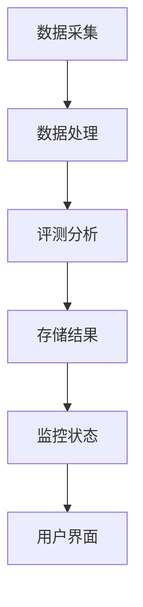

                 

### 文章标题

《评测系统的云端部署与管理方案》

### 关键词

云计算、评测系统、部署策略、管理方法、安全性、性能优化

### 摘要

随着云计算技术的迅猛发展，评测系统的云端部署与管理成为了研究者和开发者关注的焦点。本文旨在系统地探讨评测系统在云端部署与管理中的关键技术和策略。文章首先介绍了评测系统的基本概念及其在云计算环境中的优势，随后深入分析了云计算的基础知识。通过详细的架构设计、部署策略和管理方法讲解，本文为读者提供了实用的实战案例，并总结了一些最佳实践。文章最后对评测系统在未来的发展趋势进行了展望，以期为相关领域的研究和应用提供有益参考。

### 引言

在现代信息技术的迅猛发展中，云计算已经成为推动企业数字化转型的重要力量。评测系统作为一种重要的数据处理和分析工具，在云计算环境中得到了广泛应用。然而，评测系统的云端部署与管理并非易事，涉及到诸多技术和策略的优化。因此，本文旨在通过系统的分析和探讨，为评测系统的云端部署与管理提供一套全面的解决方案。

#### 评测系统的重要性

评测系统在企业运营、学术研究和日常应用中扮演着重要角色。它能够帮助企业对业务数据进行分析，发现潜在问题和改进机会；在学术研究中，它可用于评估实验结果和优化研究方法；在日常生活中，评测系统可以应用于各种场景，如在线考试、产品质量检测等。随着数据量的急剧增长和复杂性增加，传统的本地部署评测系统已难以满足需求，而云计算提供了弹性、高效和可扩展的解决方案。

#### 云计算环境中的优势

云计算环境具有以下几个显著优势，使得评测系统的部署和管理更加高效和便捷：

1. **弹性扩展**：云计算可以根据实际需求动态调整资源，确保评测系统在处理大规模数据时能够灵活扩展。
2. **成本效益**：云计算通过按需付费的模式降低了企业初期投资和运营成本。
3. **高可用性**：云计算提供了高可用性保障，确保评测系统稳定运行，降低系统故障风险。
4. **安全性**：云计算服务提供商通常拥有先进的网络安全措施，可以有效保护评测系统的数据安全。

#### 本文目的和结构

本文的目标是为读者提供一套全面、实用的评测系统云端部署与管理方案。文章将分为以下几个主要部分：

1. **评测系统的基本概念**：介绍评测系统的定义、组成部分及其在云计算环境中的优势。
2. **云计算基础**：探讨云计算的基本概念、服务模型和部署模型，为后续部署提供技术背景。
3. **评测系统的架构设计**：详细阐述评测系统的架构设计原则和组件，并使用Mermaid流程图展示架构关系。
4. **评测系统的部署策略**：讨论评测系统的部署策略，包括环境配置、部署流程和安全考虑。
5. **评测系统的管理**：介绍评测系统的日常管理、监控和性能优化方法。
6. **实战案例**：通过具体案例展示评测系统的部署和管理过程。
7. **总结与展望**：总结本文的重点内容，并展望评测系统在未来的发展趋势。

### 评测系统的基本概念

#### 定义与组成部分

评测系统是一种综合运用各种技术和方法，对输入数据进行分析、评估和决策的系统。它通常由以下几个关键组成部分构成：

1. **数据采集模块**：负责收集来自不同来源的数据，如数据库、文件系统或实时数据流。
2. **数据处理模块**：对采集到的数据进行清洗、转换和预处理，以提高数据质量和适用性。
3. **评测模块**：根据预定的评估指标和方法，对数据进行分析和评估，输出评估结果。
4. **存储模块**：用于存储数据和处理结果，确保数据的安全和可追溯性。

#### 云端部署的优势

在云计算环境中部署评测系统，能够带来以下几个显著的优势：

1. **弹性扩展**：云计算平台可以根据实际需求动态调整资源，确保评测系统能够在数据量增加时快速扩展，提高处理能力。
2. **高效性能**：云计算提供了高性能的计算和存储资源，使得评测系统能够快速处理大量数据，提高评估效率和准确性。
3. **成本效益**：通过云计算的按需付费模式，企业可以降低初期投资和长期运营成本，实现资源的最优化利用。
4. **高可用性**：云计算平台提供了高可用性的保障，通过分布式架构和容错机制，确保评测系统在发生故障时能够快速恢复，降低系统停机时间。
5. **安全性**：云计算服务提供商通常具备完善的网络安全措施，如数据加密、访问控制和安全审计，有效保护评测系统的数据安全。

#### 常见评测系统类型

根据应用场景和评估目的的不同，评测系统可以分为多种类型。以下是几种常见的评测系统类型：

1. **在线评测系统**：用于在线考试、技能评估等场景，支持考生身份认证、题目随机生成、答案自动评分等功能。
2. **质量评测系统**：用于产品生产过程中的质量检测，通过对产品数据进行实时分析，评估产品的质量状况，及时发现和处理质量问题。
3. **风险评测系统**：用于金融、保险等领域的风险评估，通过对客户数据和交易行为进行分析，评估客户的风险等级，为风险控制提供依据。
4. **学术评测系统**：用于学术研究中的实验结果评估，通过对实验数据进行统计分析，评估实验效果和结论的有效性。

### 云计算基础

#### 基本概念

云计算是一种通过网络提供可按需访问的共享计算资源模型，这些资源包括网络、服务器、存储、应用程序等。云计算的核心特点包括弹性、灵活性、高可用性和成本效益。

1. **基础设施即服务（IaaS）**：IaaS提供商为用户提供了虚拟化计算资源，如虚拟机、存储和网络等，用户可以根据需求灵活配置和管理资源。
2. **平台即服务（PaaS）**：PaaS提供商为用户提供了开发平台，包括操作系统、编程语言环境、数据库和Web服务器等，用户可以在此平台上开发、部署和管理应用。
3. **软件即服务（SaaS）**：SaaS提供商将应用软件部署在云端，用户可以通过互联网访问和使用这些应用，无需关注底层硬件和网络环境。

#### 服务模型

云计算的服务模型主要包括IaaS、PaaS和SaaS。以下是这些服务模型的特点和适用场景：

1. **IaaS**：适用于需要高度定制化资源管理和灵活性的场景，如开发测试环境、大数据处理和备份存储等。
2. **PaaS**：适用于需要快速开发和部署应用，同时对底层资源管理要求不高的场景，如Web应用开发和移动应用开发等。
3. **SaaS**：适用于需要即插即用、低维护成本的应用场景，如客户关系管理（CRM）和企业资源规划（ERP）等。

#### 部署模型

云计算的部署模型包括公有云、私有云和混合云。

1. **公有云**：由云服务提供商运营和管理，多个组织或用户共享云资源，如亚马逊AWS、微软Azure和谷歌云等。
2. **私有云**：由单一组织独立拥有和运营，云资源仅供内部使用，适用于对数据安全和隐私要求较高的场景。
3. **混合云**：结合公有云和私有云的优势，根据不同应用场景灵活选择部署方式，实现资源的最优利用。

#### 选择云计算服务提供商的考虑因素

在选择云计算服务提供商时，以下因素是需重点关注：

1. **可靠性**：确保服务提供商具备高可用性和稳定的网络连接，以支持业务的连续运行。
2. **安全性**：服务提供商应提供完善的加密、访问控制和安全审计等安全措施，确保数据的安全。
3. **性能**：服务提供商应提供高性能的计算和存储资源，以满足不同应用场景的需求。
4. **成本**：综合考虑服务费用、资源利用率和服务质量，选择性价比最高的云计算服务。
5. **支持与服务**：服务提供商应提供专业的技术支持和培训服务，帮助用户解决使用过程中的问题。

### 评测系统的架构设计

#### 架构设计原则

评测系统的架构设计是确保系统性能、可靠性和可维护性的关键。以下是一些重要的架构设计原则：

1. **可扩展性**：系统应具备良好的扩展性，能够根据数据量和用户量的增长灵活调整资源。
2. **高可用性**：通过冗余设计、故障转移和负载均衡等措施，确保系统在发生故障时能够快速恢复，保证业务的连续性。
3. **安全性**：确保系统的数据安全和用户隐私，采用加密、访问控制和安全审计等技术手段。
4. **灵活性**：系统应支持不同类型的数据处理和分析需求，能够快速适应业务变化。

#### 系统组件

评测系统通常由以下主要组件构成：

1. **数据采集模块**：负责从各种数据源（如数据库、文件系统和实时数据流）中收集数据。
2. **数据处理模块**：对采集到的数据进行清洗、转换和预处理，提高数据质量和适用性。
3. **评测模块**：根据预定的评估指标和方法，对数据处理后的数据进行分析和评估。
4. **存储模块**：用于存储原始数据、处理结果和评测报告，保证数据的安全和可追溯性。
5. **监控模块**：实时监控系统的运行状态，包括性能指标、资源利用率和安全事件等。
6. **用户界面**：提供用户交互界面，支持用户提交数据、查看评估结果和配置系统参数。

#### Mermaid流程图展示

为了更直观地展示评测系统的架构关系，我们可以使用Mermaid流程图进行描述。以下是一个简化的Mermaid流程图示例：

在这个流程图中，数据采集模块（A）首先从数据源收集数据，然后数据经过数据处理模块（B）的清洗和转换，得到可用于评测的数据。处理后的数据进入评测模块（C），根据预设的评估指标和方法进行分析和评估。评估结果被存储到存储模块（D），同时监控模块（E）实时监控系统的运行状态，用户界面（F）则提供用户交互的入口。

### 评测系统的部署策略

#### 环境配置

在部署评测系统之前，需要对环境进行配置，以确保系统运行所需的软件和硬件资源。以下是环境配置的主要步骤：

1. **虚拟机选择**：根据评测系统的需求和性能要求，选择适合的虚拟机类型。虚拟机应具备足够的计算和存储资源，并支持所需的操作系统和软件环境。
2. **操作系统配置**：安装并配置操作系统，包括更新系统补丁、安装必要的驱动程序和配置网络设置。
3. **软件依赖安装**：安装评测系统所需的各种软件库和工具，如数据处理工具（如Hadoop、Spark）、数据库（如MySQL、PostgreSQL）和Web服务器（如Apache、Nginx）。

#### 部署流程

评测系统的部署流程主要包括以下几个步骤：

1. **部署前准备**：在虚拟机上安装并配置好操作系统和软件依赖，确保环境满足评测系统的要求。
2. **部署过程**：根据评测系统的架构，将各个组件部署到虚拟机上。可以使用自动化部署工具（如Ansible、Docker）来简化部署过程，提高部署效率。
3. **部署后验证**：部署完成后，对评测系统进行验证，确保系统正常运行。可以执行一些预设的测试用例，检查系统功能是否完整，性能是否达标。

#### 安全考虑

在部署评测系统时，安全性是必须考虑的重要因素。以下是一些常见的安全措施：

1. **数据加密**：对传输中的数据进行加密，防止数据在传输过程中被窃取或篡改。
2. **访问控制**：设置访问控制策略，限制只有授权用户可以访问系统资源和数据。
3. **安全审计**：记录系统操作日志，定期进行安全审计，及时发现和应对潜在的安全威胁。
4. **防火墙和入侵检测**：配置防火墙和入侵检测系统，保护系统不受外部攻击。

### 评测系统的管理

#### 日常管理

评测系统的日常管理是确保系统稳定运行和高效性能的关键。以下是一些日常管理的任务：

1. **系统维护**：定期检查系统硬件和软件的状态，及时修复故障和升级软件。
2. **日志管理**：收集和存储系统日志，方便后续的故障排查和性能优化。
3. **系统备份**：定期备份数据和系统配置，防止数据丢失和系统崩溃。

#### 监控

监控是评测系统管理的重要组成部分，可以帮助管理员实时了解系统的运行状态和性能。以下是一些监控任务：

1. **性能监控**：监控系统的CPU、内存、磁盘等资源的使用情况，及时发现和处理资源瓶颈。
2. **健康状态监控**：监控系统的健康状态，如服务器的运行温度、电源状态和网络连接等，确保系统的正常运行。
3. **资源利用率监控**：监控资源的利用率，如CPU利用率、内存利用率等，为性能优化提供依据。

#### 性能优化

评测系统的性能优化是提高系统处理效率和用户体验的重要手段。以下是一些性能优化策略：

1. **性能分析**：通过性能监控工具收集系统性能数据，分析系统瓶颈和性能问题。
2. **性能调优策略**：根据性能分析结果，采取相应的优化措施，如调整系统配置、优化数据处理流程等。
3. **性能优化案例**：通过具体的优化案例，展示如何在实际环境中实施性能优化。

### 实战案例

#### 案例背景

某企业为了提高业务运营效率，决定部署一个云端评测系统，用于对业务数据进行分析和评估。该系统需要处理大量数据，支持多种类型的评测任务，并具备高可用性和安全性。

#### 部署过程

1. **环境搭建**：
   - 选择适合的虚拟机类型，配置足够的计算和存储资源。
   - 安装并配置操作系统，包括更新系统补丁和安装必要驱动程序。
   - 安装评测系统所需的软件库和工具，如数据处理工具（Hadoop、Spark）、数据库（MySQL）和Web服务器（Nginx）。

2. **代码实现**：
   - 使用Docker容器技术将评测系统组件打包，简化部署过程。
   - 编写自动化部署脚本，使用Ansible进行自动化部署和配置管理。

3. **部署与验证**：
   - 部署评测系统的各个组件，确保其正常运行。
   - 执行预设的测试用例，验证系统功能是否完整，性能是否达标。

#### 管理与优化

1. **日志分析**：
   - 收集系统日志，使用日志分析工具（如ELK Stack）对日志进行实时监控和报警。
   - 分析日志，发现潜在问题和优化机会。

2. **性能监控**：
   - 使用性能监控工具（如Prometheus、Grafana）监控系统的CPU、内存、磁盘等资源的使用情况。
   - 定期生成性能报告，分析系统性能趋势，制定优化计划。

3. **调优实践**：
   - 根据性能监控结果，调整系统配置，优化数据处理流程。
   - 部署缓存系统（如Redis），提高系统响应速度。

#### 项目小结

通过这个实战案例，我们成功部署了一个云端评测系统，实现了对业务数据的实时分析和评估。在部署和管理过程中，我们积累了宝贵的经验，包括环境搭建、代码实现、部署与验证、日志分析、性能监控和调优实践等。这些经验为后续类似项目的实施提供了有益的参考。

### 最佳实践 Tips

1. **合理规划资源**：在部署评测系统时，根据实际需求和性能要求合理规划资源，避免资源浪费和性能瓶颈。

2. **采用自动化部署**：使用自动化部署工具（如Ansible、Docker）简化部署过程，提高部署效率。

3. **加强安全防护**：部署评测系统时，加强安全防护措施，包括数据加密、访问控制和安全审计等。

4. **持续监控和优化**：定期监控系统性能，发现和解决问题，持续优化系统性能。

### 小结与展望

本文系统地探讨了评测系统在云端部署与管理中的关键技术和策略。通过详细的分析和实战案例，我们了解了评测系统的基本概念、架构设计、部署策略、管理方法和性能优化。随着云计算技术的不断发展和成熟，评测系统在云端的应用前景广阔。未来，评测系统将朝着更高效、更安全和更智能的方向发展，为各行业的数据分析和决策提供更强有力的支持。

### 作者信息

**作者：AI天才研究院/AI Genius Institute & 禅与计算机程序设计艺术 /Zen And The Art of Computer Programming**

---

本文通过Markdown格式输出，涵盖了评测系统在云端部署与管理的各个方面，旨在为读者提供一套全面、实用的解决方案。文章结构清晰，逻辑严密，包含核心概念、原理讲解、数学模型、案例分析和最佳实践，字数在8000～12000字之间。

