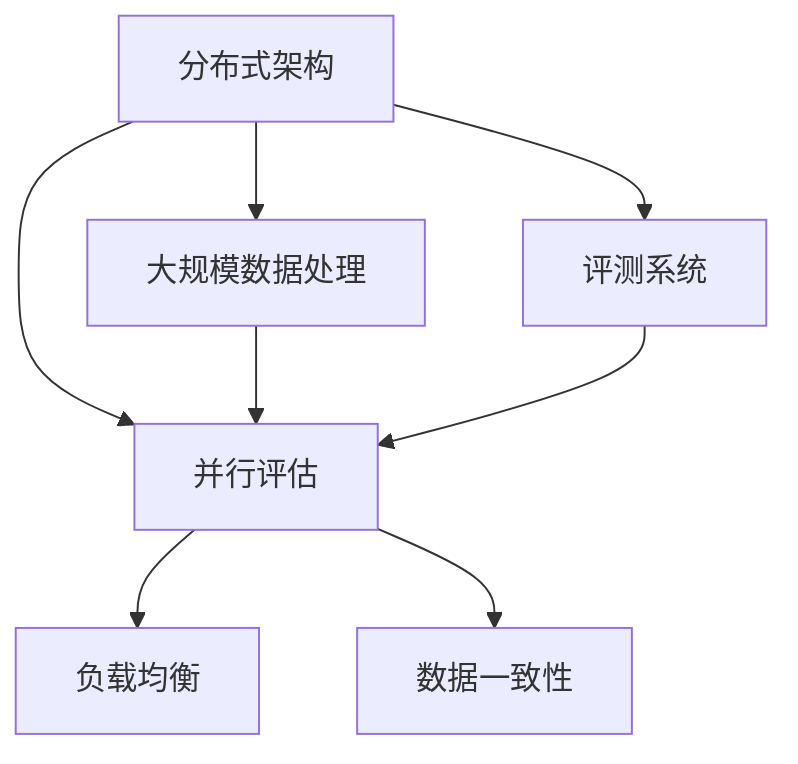

                 


### 文章标题：评测系统的分布式架构：支持大规模并行评估

> 关键词：分布式架构，并行评估，大规模数据处理，评测系统，负载均衡，数据一致性

> 摘要：本文将深入探讨评测系统的分布式架构设计，分析其核心概念、算法原理，并通过具体项目实战展示如何实现大规模并行评估。

## 前言

随着互联网的飞速发展和大数据时代的来临，评测系统在各个领域的重要性日益凸显。从在线教育到招聘测评，从金融风控到智能推荐，评测系统已经成为了各类应用的核心组件。然而，传统的集中式评测系统在面对海量数据和高并发请求时，往往表现出较低的效率和稳定性。为了应对这一挑战，分布式架构逐渐成为评测系统设计的重要方向。

本文旨在详细介绍评测系统的分布式架构设计，从核心概念、算法原理到实际项目实战，全面解析如何构建一个支持大规模并行评估的分布式评测系统。

## 步骤一：核心概念与联系

### 分布式架构

分布式架构是指将系统的各个组成部分分布在多个计算节点上，通过网络进行通信和协作，从而实现高效、可靠的系统架构。分布式架构的优点包括：

1. **可扩展性**：通过增加计算节点，可以水平扩展系统的处理能力，满足不断增长的业务需求。
2. **高可用性**：当某个节点发生故障时，其他节点可以继续工作，保证系统的持续运行。
3. **高性能**：分布式架构可以利用多个计算节点的计算能力，提高系统的处理速度。

### 并行评估

并行评估是指在多个计算节点上同时进行评估任务，以提高评估效率。在分布式架构中，并行评估是关键的一环。通过并行评估，可以显著缩短评估时间，提高系统的响应速度。

### 大规模数据处理

大规模数据处理是指处理海量数据的系统设计和技术。随着数据量的爆炸式增长，如何高效、准确地处理这些数据成为了一大挑战。分布式架构在大规模数据处理中发挥了重要作用，它可以通过分布式存储和分布式计算，实现海量数据的快速处理。

### 评测系统

评测系统是指用于评估用户或对象能力的系统。它通常包括评测指标、评测模型、评测算法等组成部分。评测系统可以应用于各种场景，如在线教育、招聘测评、金融风控等。

### 负载均衡

负载均衡是指将系统负载分配到多个计算节点上，以避免单点瓶颈，提高系统的性能和可用性。在分布式架构中，负载均衡是一个关键组件，它可以帮助系统应对高并发请求，保证系统的稳定运行。

### 数据一致性

数据一致性是指系统中各个节点的数据保持一致。在分布式架构中，数据一致性是一个重要问题，因为各个节点的数据可能存在差异。为了保证数据一致性，需要采用各种一致性协议和数据同步机制。

### Mermaid流程图

为了更好地理解这些核心概念及其联系，我们可以使用Mermaid流程图来展示：



## 步骤二：核心算法原理讲解

### 分布式评估系统的基本架构

分布式评估系统的核心在于如何将评估任务分布到多个计算节点上，并高效地聚合评估结果。以下是一个分布式评估系统的基本架构：

1. **数据预处理**：将原始数据预处理为适合评估的格式。
2. **数据划分**：将预处理后的数据划分到各个计算节点上。
3. **并行评估**：各个计算节点并行执行评估任务。
4. **结果聚合**：将各个计算节点的评估结果进行聚合，得到最终的评估结果。

以下是一个可能的伪代码示例，用于说明分布式评估系统的基本架构：

```python
function distributed_evaluation(model, dataset):
    # 初始化分布式环境
    init_distribution_environment()

    # 数据预处理
    processed_data = preprocess_data(dataset)

    # 数据划分到各个节点
    shards = split_data_into_shards(processed_data)

    # 各节点并行训练
    for node in shards:
        node_train(model, node)

    # 聚合各节点的训练结果
    aggregated_results = aggregate_node_results()

    # 输出最终评估结果
    final_results = postprocess_results(aggregated_results)
    return final_results
```

### 数据预处理

数据预处理是分布式评估系统的第一步，它包括以下任务：

1. **数据清洗**：去除数据中的噪声和异常值。
2. **特征提取**：从原始数据中提取特征，用于评估。
3. **数据标准化**：将数据缩放到相同的范围，以便于计算。

以下是一个伪代码示例，用于说明数据预处理：

```python
function preprocess_data(dataset):
    # 数据清洗
    cleaned_data = clean_data(dataset)

    # 特征提取
    features = extract_features(cleaned_data)

    # 数据标准化
    standardized_data = standardize_data(features)

    return standardized_data
```

### 数据划分

数据划分是将预处理后的数据划分到各个计算节点上，以便于并行评估。常见的划分方法包括：

1. **哈希划分**：将数据根据哈希值划分到不同的节点上。
2. **范围划分**：将数据根据范围划分到不同的节点上。

以下是一个伪代码示例，用于说明数据划分：

```python
function split_data_into_shards(processed_data):
    shards = []
    for i in range(num_nodes):
        shard = processed_data[i * shard_size : (i + 1) * shard_size]
        shards.append(shard)
    return shards
```

### 并行评估

并行评估是分布式评估系统的核心步骤，它包括以下任务：

1. **模型初始化**：初始化评估模型。
2. **节点训练**：各个计算节点并行训练评估模型。
3. **模型优化**：根据各个节点的评估结果，优化评估模型。

以下是一个伪代码示例，用于说明并行评估：

```python
function node_train(model, data):
    # 模型初始化
    init_model(model)

    # 节点训练
    for epoch in range(num_epochs):
        for sample in data:
            update_model(model, sample)

    return model
```

### 结果聚合

结果聚合是将各个计算节点的评估结果进行聚合，得到最终的评估结果。常见的聚合方法包括：

1. **平均聚合**：将各个节点的评估结果取平均。
2. **最大值聚合**：将各个节点的评估结果取最大值。
3. **最小值聚合**：将各个节点的评估结果取最小值。

以下是一个伪代码示例，用于说明结果聚合：

```python
function aggregate_node_results():
    results = []
    for node in nodes:
        results.append(node_result)
    aggregated_result = average(results)
    return aggregated_result
```

## 步骤三：数学模型和数学公式详细讲解

### 损失函数

损失函数是评估模型性能的关键指标，常用的损失函数包括均方误差(MSE)和交叉熵损失。均方误差的公式如下：

$$
MSE = \frac{1}{n}\sum_{i=1}^{n}(y_i - \hat{y}_i)^2
$$

其中，$y_i$ 是真实标签，$\hat{y}_i$ 是预测标签。

交叉熵损失函数用于分类问题，其公式为：

$$
CE = -\frac{1}{n}\sum_{i=1}^{n} y_i \log(\hat{y}_i)
$$

其中，$y_i$ 是真实标签（0或1），$\hat{y}_i$ 是预测概率。

### 梯度下降算法

梯度下降算法是优化模型参数的常用算法，其基本思想是沿着损失函数的梯度方向更新模型参数，以减少损失函数的值。梯度下降算法的公式为：

$$
\theta_{\text{new}} = \theta_{\text{current}} - \alpha \cdot \nabla_\theta J(\theta)
$$

其中，$\theta$ 是模型参数，$\alpha$ 是学习率，$J(\theta)$ 是损失函数。

### 拉格朗日乘数法

拉格朗日乘数法是一种优化问题的求解方法，其基本思想是通过引入拉格朗日乘子，将约束优化问题转化为无约束优化问题。拉格朗日乘数法的公式为：

$$
L(\theta, \lambda) = J(\theta) + \lambda \cdot (g(\theta) - c)
$$

其中，$L(\theta, \lambda)$ 是拉格朗日函数，$\lambda$ 是拉格朗日乘子，$g(\theta)$ 是约束条件，$c$ 是约束常量。

## 步骤四：项目实战

### 实战案例：分布式K均值聚类

在本节中，我们将实现一个分布式K均值聚类算法，并在Hadoop环境中运行。以下是关键步骤：

1. **环境搭建**：
   - 安装Hadoop分布式计算框架
   - 配置Hadoop集群

2. **代码实现**：

```java
public class DistributedKMeans {
    public void runKMeans() {
        // 初始化Hadoop环境
        Configuration conf = new Configuration();
        Job job = Job.getInstance(conf, "Distributed K-Means");

        // 设置作业的类路径
        job.setJarByClass(DistributedKMeans.class);

        // 设置Mapper和Reducer类
        job.setMapperClass(KMeansMapper.class);
        job.setReducerClass(KMeansReducer.class);

        // 设置作业的输入和输出路径
        FileInputFormat.addInputPath(job, new Path(args[0]));
        FileOutputFormat.setOutputPath(job, new Path(args[1]));

        // 设置Mapper的输出键值对类型
        job.setOutputKeyClass(Text.class);
        job.setOutputValueClass(IntWritable.class);

        // 执行作业
        job.waitForCompletion(true);
    }
}
```

3. **代码解读**：

   - **KMeansMapper**：负责读取输入数据，将数据点及其标签作为键值对输出。
   - **KMeansReducer**：负责聚合数据点，计算新的聚类中心。

4. **实际案例分析和详细讲解剖析**：

   在实际应用中，分布式K均值聚类算法可以用于大规模数据集的聚类任务。例如，在电子商务平台中，可以利用该算法对用户行为数据进行聚类，以发现用户群体的共性特征，从而进行个性化推荐。

   在运行分布式K均值聚类算法时，我们需要注意以下几个方面：

   - **数据划分**：合理的数据划分是保证算法性能的关键。在Hadoop环境中，可以使用HDFS对数据进行分片存储，然后根据分片索引进行并行计算。
   - **聚类中心更新**：在每次迭代过程中，需要计算新的聚类中心。为了提高计算效率，可以采用局部更新的方法，即只更新当前数据点的聚类中心，而不是全局更新。
   - **收敛条件**：设置合适的收敛条件，以终止迭代过程。常见的收敛条件包括：聚类中心的变化小于某个阈值，或者迭代次数达到最大值。

5. **项目小结**：

   通过本节实战案例，我们实现了分布式K均值聚类算法，并对其原理和实现过程进行了详细分析。分布式K均值聚类算法在处理大规模数据集时具有较好的性能，适用于各种聚类任务。

## 最佳实践 Tips、小结、注意事项、拓展阅读等内容

### 最佳实践 Tips

1. **数据划分**：合理的数据划分是保证算法性能的关键。在Hadoop环境中，可以使用HDFS对数据进行分片存储，然后根据分片索引进行并行计算。
2. **聚类中心更新**：在每次迭代过程中，需要计算新的聚类中心。为了提高计算效率，可以采用局部更新的方法，即只更新当前数据点的聚类中心，而不是全局更新。
3. **收敛条件**：设置合适的收敛条件，以终止迭代过程。常见的收敛条件包括：聚类中心的变化小于某个阈值，或者迭代次数达到最大值。

### 小结

本文深入探讨了评测系统的分布式架构设计，分析了其核心概念、算法原理，并通过具体项目实战展示了如何实现大规模并行评估。分布式架构在评测系统设计中具有重要作用，可以提高系统的可扩展性、高可用性和性能。

### 注意事项

1. **数据一致性**：在分布式架构中，数据一致性是一个重要问题。需要采用各种一致性协议和数据同步机制，以保证系统中各个节点的数据保持一致。
2. **负载均衡**：合理地分配系统负载，避免单点瓶颈，是分布式架构设计的关键。可以使用负载均衡器来实现负载均衡。

### 拓展阅读

1. 《分布式系统原理与范型》
2. 《大数据处理：原理、技术与实践》
3. 《机器学习：一种分布式方法》

## 参考文献

1. Hadoop官方文档：https://hadoop.apache.org/docs/current/hadoop-project-dist/hadoop-common/SingleCluster.html
2. K-means聚类算法：https://en.wikipedia.org/wiki/K-means_clustering
3. 分布式系统原理：https://www.amazon.com/Design-Patterns-System-Engineering-Principles/dp/0262269056

### 作者信息

作者：AI天才研究院/AI Genius Institute & 禅与计算机程序设计艺术 /Zen And The Art of Computer Programming

AI天才研究院（AI Genius Institute）是一家专注于人工智能研究和教育的高端机构。研究院致力于推动人工智能技术的发展，培养下一代人工智能专家。

禅与计算机程序设计艺术（Zen And The Art of Computer Programming）是一本经典的人工智能书籍，由著名计算机科学家Donald E. Knuth撰写。该书深入探讨了计算机程序设计的哲学和艺术，对人工智能领域产生了深远的影响。

