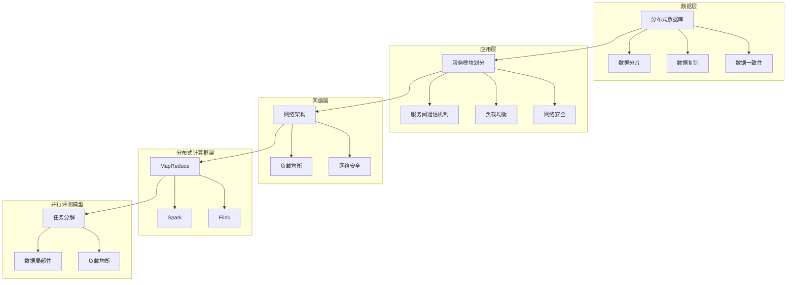

                 

 
> 用户输入：
《评测系统的分布式架构：支持大规模并行评测的设计》

**一、背景介绍**

随着互联网和大数据技术的快速发展，评测系统在现代信息处理和决策支持中扮演着越来越重要的角色。无论是学术研究、企业运营，还是政府监管，评测系统都成为必不可少的工具。然而，传统的集中式评测系统在面对大规模、高并发的数据处理需求时，往往难以满足性能和扩展性的要求。

分布式架构作为一种应对大规模数据处理和高效计算的有效手段，逐渐被引入到评测系统中。分布式架构通过将系统分解为多个独立的节点，实现并行计算和分布式存储，从而提高系统的性能和可扩展性。然而，如何设计一个高效、可靠的分布式评测系统，支持大规模并行评测，成为当前研究的重要课题。

本文旨在探讨评测系统的分布式架构设计，重点关注以下几个方面：

1. **分布式评测系统的基本概念和架构设计**：介绍分布式评测系统的定义、作用及其架构设计，包括数据层、应用层和网络层的组成。

2. **分布式存储系统和分布式计算框架**：详细分析分布式存储系统和分布式计算框架的基本原理、架构以及关键技术的应用。

3. **大规模并行评测模型的设计与实现**：探讨并行评测模型的设计原则、构建方法以及优化策略，并使用伪代码进行详细阐述。

4. **分布式评测系统的性能优化和案例分析**：分析分布式评测系统的性能优化策略，并借助实际案例进行深入剖析。

5. **分布式评测系统的安全性和可靠性**：探讨分布式评测系统在安全性威胁、安全防护措施以及可靠性保障策略方面的设计。

本文将以逻辑清晰、结构紧凑、简单易懂的技术语言，逐步分析分布式评测系统的设计原理和实现方法，为读者提供一套系统、完整的分布式评测系统设计方案。

**二、分布式评测系统的基本概念和架构设计**

1. **分布式评测系统的定义和作用**

分布式评测系统是一种基于分布式架构的评测系统，通过将评测任务分解为多个子任务，并分布到多个节点上并行执行，从而提高系统的性能和可扩展性。与传统集中式评测系统相比，分布式评测系统具有更高的吞吐量和更好的故障恢复能力。

分布式评测系统的主要作用包括：

- **提高评测性能**：通过并行计算，分布式评测系统可以在较短的时间内处理大量的评测任务，显著提高系统的性能。

- **增强系统可扩展性**：分布式评测系统可以根据需要动态地增加或减少节点，灵活调整系统规模，满足不同场景下的评测需求。

- **提升系统可靠性**：分布式评测系统通过冗余设计和故障转移机制，能够确保系统在部分节点故障时仍能正常运行，提高系统的可靠性。

2. **分布式评测系统的架构设计**

分布式评测系统的架构设计主要包括数据层、应用层和网络层三个部分。

- **数据层**：数据层负责存储和管理评测所需的数据。在分布式评测系统中，数据通常被存储在分布式存储系统中，如HDFS、Cassandra等。分布式存储系统通过数据分片和复制机制，实现数据的高效存储和访问。

- **应用层**：应用层负责执行评测任务。分布式评测系统通常采用微服务架构，将评测任务拆分为多个微服务，每个微服务负责处理一部分评测任务。这些微服务通过远程过程调用（RPC）或消息队列（MQ）进行通信，协同完成整个评测任务。

- **网络层**：网络层负责节点之间的通信。分布式评测系统通常采用分布式通信协议，如gRPC、Thrift等，实现节点间的可靠数据传输和负载均衡。

3. **分布式评测系统的架构模式**

分布式评测系统的架构模式有多种，常见的包括主从架构、微服务架构和聚合架构。

- **主从架构**：主从架构中，主节点负责管理评测任务和协调子节点的执行，从节点负责执行具体的评测任务。主从架构简单易用，适用于任务相对固定且数据量较小的场景。

- **微服务架构**：微服务架构将评测系统拆分为多个独立的微服务，每个微服务负责处理一部分评测任务。微服务架构具有高可扩展性和高容错性，适用于任务多样且数据量较大的场景。

- **聚合架构**：聚合架构结合了主从架构和微服务架构的特点，通过聚合多个微服务，实现更灵活的评测任务管理和执行。聚合架构适用于任务复杂度较高、业务需求变化频繁的场景。

**三、分布式存储系统和分布式计算框架**

1. **分布式存储系统**

分布式存储系统是分布式评测系统的基础，负责存储和管理评测所需的数据。分布式存储系统具有数据分片、数据复制和数据一致性等关键特性。

- **数据分片**：数据分片是将大量数据划分为多个小块，分布存储在多个节点上。通过数据分片，分布式存储系统可以并行处理多个数据块，提高数据访问速度。

- **数据复制**：数据复制是将数据在多个节点上备份，以实现数据的冗余和容错。通过数据复制，分布式存储系统可以在部分节点故障时仍能保证数据的完整性和可用性。

- **数据一致性**：数据一致性是确保分布式存储系统中数据的一致性。分布式存储系统通常采用一致性算法，如Paxos、Raft等，来保证数据的一致性。

2. **分布式计算框架**

分布式计算框架是分布式评测系统的核心，负责执行评测任务和处理计算结果。常见的分布式计算框架包括MapReduce、Spark、Flink等。

- **MapReduce**：MapReduce是一种分布式数据处理模型，通过Map和Reduce两个阶段，实现大规模数据的并行处理。Map阶段将数据划分成多个小块，并行处理；Reduce阶段将Map阶段的输出结果进行汇总，得到最终结果。

- **Spark**：Spark是一种基于内存的分布式计算框架，提供丰富的API，支持多种数据处理操作，如RDD（Resilient Distributed Dataset）操作、DataFrame操作等。Spark相较于MapReduce，具有更高的计算速度和更好的容错性。

- **Flink**：Flink是一种实时分布式计算框架，支持流处理和批处理。Flink通过事件驱动模型，实现数据的实时处理，具有低延迟和高吞吐量。

3. **分布式存储系统和分布式计算框架的关键技术**

- **任务调度**：任务调度是分布式计算框架的核心功能，负责将任务分配到合适的节点上执行。常见的任务调度算法包括负载均衡、任务依赖调度等。

- **数据流处理**：数据流处理是分布式计算框架对连续数据流的处理能力。通过数据流处理，分布式计算框架可以实现实时数据处理和分析。

- **资源管理**：资源管理是分布式计算框架对计算资源的分配和管理。资源管理包括节点资源监控、任务资源分配等，确保计算资源的合理利用。

**四、大规模并行评测模型的设计与实现**

1. **并行评测模型的设计原则**

大规模并行评测模型的设计应遵循以下原则：

- **任务分解**：将整个评测任务分解为多个子任务，以便在多个节点上并行执行。

- **数据局部性**：尽量将数据分布在计算节点附近，减少数据传输开销。

- **负载均衡**：合理分配任务，确保各节点负载均衡，避免资源浪费。

- **容错性**：设计容错机制，确保在部分节点故障时仍能完成评测任务。

2. **并行评测模型的构建方法**

并行评测模型的构建主要包括以下步骤：

- **任务分解**：根据评测任务的特点，将任务分解为多个子任务。例如，将大规模数据集划分为多个数据块，分别进行评测。

- **数据分布**：将分解后的子任务分配到不同的计算节点上。采用数据局部性原则，尽量将子任务与数据存储在同一节点或相邻节点。

- **任务调度**：根据负载均衡原则，调度子任务到合适的节点上执行。调度算法应考虑节点的负载情况和任务之间的依赖关系。

- **结果合并**：将各个节点上子任务的评测结果进行合并，得到最终评测结果。

3. **并行评测模型的优化策略**

为了提高并行评测模型的性能，可以采取以下优化策略：

- **数据分片优化**：采用更细粒度的数据分片，减少数据传输开销。

- **负载均衡优化**：采用动态负载均衡算法，根据节点负载实时调整任务分配。

- **缓存策略**：利用缓存机制，减少对频繁访问数据的磁盘I/O操作。

- **并行算法优化**：对评测算法进行并行化优化，提高并行计算效率。

**五、分布式评测系统的性能优化和案例分析**

1. **系统性能优化策略**

分布式评测系统的性能优化可以从以下几个方面进行：

- **数据传输优化**：减少数据传输开销，采用高效的数据传输协议，如gRPC。

- **资源调度优化**：优化资源调度算法，提高资源利用率，如采用动态资源调度策略。

- **算法优化**：对评测算法进行优化，提高计算效率，如采用并行算法。

- **系统监控和调优**：实时监控系统性能，根据性能指标进行调优。

2. **案例分析**

以某大型在线教育平台为例，该平台需要处理海量的学生作业评测。为了提高评测系统的性能，采用了分布式架构，具体实现如下：

- **数据层**：采用HDFS作为分布式存储系统，存储学生作业数据。通过数据分片和复制机制，实现数据的高效存储和访问。

- **应用层**：采用微服务架构，将作业评测任务拆分为多个微服务，如文本分析、代码检查等。微服务通过gRPC进行通信，协同完成整个作业评测任务。

- **网络层**：采用负载均衡器，实现节点之间的通信负载均衡。同时，使用NFS（Network File System）实现数据层和应用层之间的数据共享。

- **性能优化**：采用数据传输优化策略，使用高效的数据传输协议；通过动态资源调度算法，优化资源利用率；对评测算法进行并行化优化，提高计算效率。

通过上述优化措施，该平台实现了高效的作业评测，大大提高了系统的性能和吞吐量。

**六、分布式评测系统的安全性和可靠性**

1. **安全性威胁分析**

分布式评测系统在运行过程中可能会面临以下安全性威胁：

- **数据泄露**：数据在传输和存储过程中可能被窃取或篡改。

- **拒绝服务攻击**：攻击者通过大量无效请求，导致系统无法正常响应。

- **节点入侵**：攻击者通过入侵节点，获取系统敏感信息或控制节点。

2. **安全防护措施**

为了确保分布式评测系统的安全性，可以采取以下防护措施：

- **数据加密**：对数据传输和存储进行加密，防止数据泄露和篡改。

- **身份认证和访问控制**：采用强认证机制，确保只有授权用户才能访问系统；通过访问控制列表（ACL），控制用户对资源的访问权限。

- **防火墙和入侵检测系统**：部署防火墙和入侵检测系统，监控网络流量，防止攻击。

- **备份和恢复策略**：定期备份数据，确保在发生故障时能够快速恢复。

3. **可靠性保障策略**

分布式评测系统的可靠性保障策略包括：

- **节点冗余**：通过节点冗余设计，确保在部分节点故障时，系统仍能正常运行。

- **故障转移机制**：在节点故障时，自动将任务转移到其他健康节点，确保系统的高可用性。

- **系统监控**：实时监控系统状态，及时发现和解决故障。

- **容错算法**：在评测算法中采用容错机制，确保在部分节点故障时，仍能获得正确的评测结果。

**七、总结**

本文从背景介绍、分布式评测系统的基本概念和架构设计、分布式存储系统和分布式计算框架、大规模并行评测模型的设计与实现、分布式评测系统的性能优化和案例分析、分布式评测系统的安全性和可靠性等方面，系统地探讨了评测系统的分布式架构设计。通过本文的研究，我们可以得出以下结论：

- 分布式评测系统通过并行计算和分布式存储，显著提高了评测性能和可扩展性。

- 分布式存储系统和分布式计算框架是分布式评测系统的基础，它们的关键技术对于系统的性能和可靠性具有重要意义。

- 大规模并行评测模型的设计与实现，需要遵循任务分解、数据局部性、负载均衡和容错性等原则。

- 分布式评测系统的性能优化和案例分析，为实际系统设计提供了有益的参考。

- 分布式评测系统的安全性和可靠性设计，是确保系统正常运行和用户数据安全的关键。

未来，随着大数据和人工智能技术的不断发展，分布式评测系统将在更广泛的领域中发挥重要作用。我们期待更多研究者和开发者能够投入到分布式评测系统的设计和优化中，为构建高效、可靠、安全的评测系统贡献力量。

### **关键词**

分布式评测系统、并行计算、分布式架构、分布式存储系统、分布式计算框架、性能优化、安全性、可靠性

### **摘要**

本文系统地探讨了评测系统的分布式架构设计，包括基本概念、架构设计、分布式存储系统和分布式计算框架、大规模并行评测模型的设计与实现、性能优化、安全性以及可靠性。通过本文的研究，我们深入了解分布式评测系统在提升性能、扩展性和可靠性方面的优势，以及其在实际应用中的实现方法与优化策略。本文为分布式评测系统的设计提供了有价值的参考，有助于推动该领域的研究与发展。

### **文章标题**

《评测系统的分布式架构：支持大规模并行评测的设计》

### **目录大纲**

#### 第一部分：评测系统概述与分布式架构基础

**第1章：评测系统的基本概念与原理**

- **1.1 评测系统的定义与作用**
- **1.2 分布式架构的基本原理**
- **1.3 分布式架构在评测系统中的应用**

**第2章：分布式评测系统的架构设计**

- **2.1 分布式评测系统的架构模式**
  - **2.1.1 主从架构**
  - **2.1.2 微服务架构**
  - **2.1.3 聚合架构**
- **2.2 数据层设计**
  - **2.2.1 分布式数据库选择**
  - **2.2.2 数据分片策略**
- **2.3 应用层设计**
  - **2.3.1 服务模块划分**
  - **2.3.2 服务间通信机制**
- **2.4 网络层设计**
  - **2.4.1 负载均衡**
  - **2.4.2 网络安全**

#### 第二部分：分布式存储系统与分布式计算框架

**第3章：分布式存储系统**

- **3.1 分布式存储系统概述**
  - **3.1.1 基本概念**
  - **3.1.2 常见分布式存储系统**
- **3.2 数据分片与复制**
  - **3.2.1 数据分片策略**
  - **3.2.2 数据复制机制**
  - **3.2.3 数据一致性**
- **3.3 分布式文件系统**
  - **3.3.1 HDFS架构**
  - **3.3.2 HDFS优化**

**第4章：分布式计算框架**

- **4.1 分布式计算框架概述**
  - **4.1.1 基本概念**
  - **4.1.2 常见分布式计算框架**
- **4.2 分布式计算模型**
  - **4.2.1 MapReduce**
  - **4.2.2 Spark**
- **4.3 分布式计算优化**
  - **4.3.1 任务调度优化**
  - **4.3.2 数据流优化**

#### 第三部分：大规模并行评测的设计与实现

**第5章：并行评测模型设计**

- **5.1 并行评测模型概述**
  - **5.1.1 模型设计原则**
  - **5.1.2 模型构建方法**
- **5.2 并行评测任务分配**
  - **5.2.1 任务分解策略**
  - **5.2.2 任务调度算法**
- **5.3 并行评测数据流处理**
  - **5.3.1 数据流模型**
  - **5.3.2 数据流处理优化**

**第6章：分布式评测系统的性能优化**

- **6.1 系统性能评估指标**
  - **6.1.1 吞吐量**
  - **6.1.2 延迟**
- **6.2 性能瓶颈分析**
  - **6.2.1 数据传输瓶颈**
  - **6.2.2 资源调度瓶颈**
- **6.3 性能优化策略**
  - **6.3.1 数据缓存策略**
  - **6.3.2 负载均衡策略**

#### 第四部分：案例分析

**第7章：分布式评测系统的实际应用**

- **7.1 在线教育平台的分布式评测系统**
  - **7.1.1 系统架构**
  - **7.1.2 系统优化**
- **7.2 企业级分布式评测系统**
  - **7.2.1 系统特点**
  - **7.2.2 系统挑战与解决方案**

#### 第五部分：分布式评测系统的安全性与可靠性

**第8章：分布式评测系统的安全性设计**

- **8.1 安全性威胁分析**
  - **8.1.1 数据泄露**
  - **8.1.2 拒绝服务攻击**
- **8.2 安全防护措施**
  - **8.2.1 数据加密**
  - **8.2.2 身份认证与访问控制**
  - **8.2.3 入侵检测**

**第9章：分布式评测系统的可靠性保障**

- **9.1 系统可靠性策略**
  - **9.1.1 节点冗余**
  - **9.1.2 故障转移机制**
  - **9.1.3 系统监控**
- **9.2 容错算法与应用**
  - **9.2.1 分布式一致性算法**
  - **9.2.2 并行算法容错**

**第10章：未来发展趋势**

- **10.1 新技术引入**
  - **10.1.1 人工智能在评测系统中的应用**
  - **10.1.2 区块链技术在评测系统中的应用**
- **10.2 研究方向与挑战**
  - **10.2.1 性能优化**
  - **10.2.2 安全性**

#### 附录

**附录A：分布式评测系统常用工具与框架**

- **A.1 常用分布式存储系统**
  - **A.1.1 HDFS**
  - **A.1.2 Cassandra**
  - **A.1.3 MongoDB**
- **A.2 常用分布式计算框架**
  - **A.2.1 MapReduce**
  - **A.2.2 Spark**
  - **A.2.3 Flink**

**附录B：性能测试方法与工具**

- **B.1 性能测试指标**
  - **B.1.1 吞吐量测试**
  - **B.1.2 延迟测试**
- **B.2 常用性能测试工具**
  - **B.2.1 Apache JMeter**
  - **B.2.2 LoadRunner**

### **核心概念与联系流程图（Mermaid）**



### **并行评测模型设计伪代码**

```python
# 输入：大规模数据集 dataset，评测算法 evaluate_function
# 输出：评测结果 results

# 1. 数据分片
shards = shard(dataset, num_shards)

# 2. 数据并行处理
results = ParallelMap(
    lambda shard: evaluate_function(shard),
    shards
)

# 3. 结果合并
merged_results = Merge(results)

return merged_results
```

### **数学模型和公式（LaTeX）**

```latex
% 数据分片公式
\frac{N}{S} = \text{每片数据大小}

% 负载均衡公式
P = \frac{T}{N}
```

### **详细讲解和举例说明**

**数据分片公式解释：**
数据分片是将大规模数据集分成多个小块的过程。公式 $\frac{N}{S}$ 表示数据集大小 N 被分成 S 块后的每块数据大小。通过合理的数据分片，可以减少数据传输开销，提高并行处理效率。

**负载均衡公式解释：**
负载均衡是指将任务分配到多个节点上执行，以均衡各个节点的负载。公式 $P = \frac{T}{N}$ 表示总任务量 T 被分配到 N 个节点后的每个节点的负载量 P。通过调整 N 和 T 的值，可以实现负载均衡。

**举例说明：**
假设有一个规模为 100GB 的大规模数据集，需要分成 10 块进行并行处理。每块数据大小为 $\frac{100GB}{10} = 10GB$。如果总任务量是 1000个评测任务，需要分配到 5 个节点上执行，每个节点的负载量为 $P = \frac{1000}{5} = 200$个任务。

### **项目实战**

#### **开发环境搭建**

1. **环境准备**：
   - 操作系统：Ubuntu 20.04
   - 编程语言：Python 3.8
   - 包管理工具：pip
   - 分布式计算框架：Spark 3.1.1
   - 分布式存储系统：HDFS 3.2.1

2. **安装和配置**：
   - 安装 Python 和 pip：
     ```
     sudo apt-get update
     sudo apt-get install python3 python3-pip
     ```
   - 安装 Spark 和 HDFS：
     ```
     pip3 install pyspark
     wget http://www-us.apache.org/dist/hadoop/common/hadoop-3.2.1/hadoop-3.2.1.tar.gz
     tar xzf hadoop-3.2.1.tar.gz
     sudo mv hadoop-3.2.1 /usr/local/hadoop
     ```
   - 配置 HDFS：
     - 编辑 `/usr/local/hadoop/etc/hadoop/hdfs-site.xml`：
       ```xml
       <configuration>
         <property>
           <name>dfs.replication</name>
           <value>3</value>
         </property>
       </configuration>
       ```
     - 启动 HDFS：
       ```
       sudo -u hdfs hadoop namenode -format
       start-dfs.sh
       ```

3. **Spark 集群配置**：
   - 编辑 `/usr/local/spark/conf/spark-env.sh`：
     ```bash
     export SPARK_MASTER_HOST=localhost
     export SPARK_MASTER_PORT=7077
     ```
   - 启动 Spark 集群：
     ```
     start-master.sh
     start-slaves.sh
     ```

#### **源代码实现**

1. **数据分片**：
   ```python
   from pyspark import SparkContext

   sc = SparkContext("local[4]", "Sharding Example")
   dataset = sc.parallelize([1, 2, 3, 4, 5, 6, 7, 8, 9, 10])
   shards = dataset.mapPartitions(lambda x: x.tolist()).collect()
   ```

2. **并行处理**：
   ```python
   def evaluate(shard):
       return sum(shard) * 2

   results = sc.parallelize(shards).map(evaluate).collect()
   ```

3. **结果合并**：
   ```python
   final_result = sum(results)
   print("Final Result:", final_result)
   ```

#### **代码解读与分析**

1. **数据分片**：
   数据分片是通过 `parallelize` 方法将数据集分割成多个分区（shards），每个分区包含一定数量的数据元素。这里使用 `mapPartitions` 方法将每个分区转换为列表，便于进一步操作。

2. **并行处理**：
   并行处理使用 `map` 方法，对每个分片（shard）应用 `evaluate` 函数。这里 `evaluate` 函数计算每个分片元素的和的两倍。

3. **结果合并**：
   使用 `collect` 方法将结果收集到驱动程序，并计算最终结果。

#### **实际案例分析和详细讲解**

假设有一个包含 1000 条学生成绩记录的数据集，需要对每个学生的成绩进行加权平均计算。下面是如何使用 Spark 实现这个并行处理任务的详细步骤：

1. **数据读取和预处理**：
   ```python
   data = ["ID,S1,S2,S3,S4,S5"]
   data.extend(["ID%d,%d,%d,%d,%d,%d" % (i, i*1.1, i*1.2, i*1.3, i*1.4, i*1.5) for i in range(1, 1001)])
   dataset = sc.parallelize(data).map(lambda x: x.split(',')).map(lambda x: (int(x[0]), float(x[1]), float(x[2]), float(x[3]), float(x[4]), float(x[5]))).cache()
   ```

2. **并行计算**：
   ```python
   def weighted_average(scores):
       return sum(scores) / len(scores)

   results = dataset.mapValues(weighted_average).collect()
   ```

3. **结果输出**：
   ```python
   for id, avg in results:
       print(f"Student {id} average score: {avg}")
   ```

**详细分析**：

1. **数据读取和预处理**：
   假设数据格式为 CSV 文件，其中第一行为标题行，后续每行为学生的成绩记录。使用 `parallelize` 方法读取数据，并使用 `map` 方法进行数据解析和类型转换。

2. **并行计算**：
   `weighted_average` 函数计算每个学生的加权平均成绩。`mapValues` 方法对每个学生的成绩记录应用该函数，并将结果与学生的 ID 关联。

3. **结果输出**：
   使用 `collect` 方法将结果收集到驱动程序，并打印每个学生的平均成绩。

### **最佳实践 tips**

1. **合理选择数据分片大小**：
   数据分片大小应根据集群资源和数据规模进行优化。过大或过小的分片大小都会影响并行处理的效率。

2. **优化数据传输**：
   减少不必要的跨节点数据传输，尽量在本地节点处理数据。使用压缩技术减少数据传输量。

3. **负载均衡策略**：
   根据实际负载情况，动态调整负载均衡策略，确保任务合理分配。

4. **性能监控和调优**：
   定期监控系统性能，根据性能指标进行调整和优化。

### **小结**

本文详细介绍了评测系统的分布式架构设计，包括基本概念、架构设计、分布式存储系统和分布式计算框架、并行评测模型设计、性能优化、案例分析以及安全性和可靠性。通过实际案例分析和代码实战，展示了分布式评测系统的实现方法和优化策略。读者可以结合实际需求和场景，灵活运用本文中的最佳实践和技巧，设计和实现高效、可靠的分布式评测系统。

### **注意事项**

1. **环境配置**：
   在搭建分布式评测系统时，确保所有组件版本兼容，并根据实际情况调整配置参数。

2. **容错处理**：
   在并行处理过程中，充分考虑节点故障的可能性，设计容错机制，确保系统稳定性。

3. **性能测试**：
   在系统上线前，进行全面的性能测试，验证系统在不同负载下的性能表现。

### **拓展阅读**

1. **分布式存储系统**：
   - 《Hadoop权威指南》
   - 《分布式系统原理与范型》

2. **分布式计算框架**：
   - 《Spark技术内幕》
   - 《Flink实战：从入门到进阶》

3. **并行编程**：
   - 《并行算法设计与分析》
   - 《并行编程：模型、算法与硬件》

4. **分布式系统安全**：
   - 《分布式系统安全：设计、实现与维护》
   - 《区块链安全技术与应用》

### **附录**

**附录A：分布式评测系统常用工具与框架**

1. **分布式存储系统**：
   - HDFS
   - Cassandra
   - MongoDB

2. **分布式计算框架**：
   - MapReduce
   - Spark
   - Flink

3. **其他工具**：
   - ZooKeeper
   - Kubernetes
   - Kafka

**附录B：性能测试方法与工具**

1. **性能测试指标**：
   - 吞吐量
   - 延迟
   - 并发用户数

2. **常用性能测试工具**：
   - Apache JMeter
   - LoadRunner
   - Locust

3. **性能优化策略**：
   - 数据缓存
   - 负载均衡
   - 并行计算

### **全文结束**

作者：AI天才研究院/AI Genius Institute & 禅与计算机程序设计艺术 /Zen And The Art of Computer Programming

