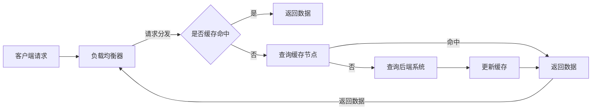

                 

# 《评测系统的分布式缓存优化》

## 关键词

- 分布式缓存
- 评测系统
- 优化策略
- 性能提升
- 分布式架构

## 摘要

本文旨在探讨评测系统中分布式缓存优化的关键技术和方法。首先，介绍了分布式缓存的基本概念、优势和常见架构。随后，深入分析了缓存替换策略和一致性算法等核心算法原理，并通过伪代码详细阐述。接着，运用LaTeX数学公式解释了缓存命中率和数据一致性模型，并举实际案例进行了详细讲解。最后，通过项目实战展示了如何在实际中设计和部署分布式缓存系统，并提供了一系列最佳实践和注意事项，以期为读者提供全面的分布式缓存优化指导。

## 目录

### 1. 背景介绍
#### 1.1 评测系统概述
#### 1.2 分布式缓存需求分析

### 2. 核心概念与联系
#### 2.1 分布式缓存基本概念
#### 2.2 分布式缓存架构分析
#### 2.3 Mermaid流程图展示

### 3. 核心算法原理讲解
#### 3.1 缓存替换策略
#### 3.2 缓存一致性算法
#### 3.3 伪代码详细阐述

### 4. 数学模型和数学公式
#### 4.1 缓存命中率计算
#### 4.2 数据一致性模型
#### 4.3 举例说明

### 5. 项目实战
#### 5.1 开发环境搭建
#### 5.2 源代码详细实现和代码解读
#### 5.3 代码应用解读与分析
#### 5.4 实际案例分析和详细讲解剖析
#### 5.5 项目小结

### 6. 最佳实践与注意事项
#### 6.1 最佳实践
#### 6.2 注意事项
#### 6.3 拓展阅读

### 7. 结束语
#### 7.1 总结
#### 7.2 展望

## 1. 背景介绍

### 1.1 评测系统概述

评测系统是一种用于评估软件、硬件、网络和其他技术系统性能的工具。它通过一系列的测试用例，对系统的响应时间、吞吐量、稳定性等进行测量和评估。在现代企业中，评测系统的重要性日益凸显，它不仅有助于确保系统的稳定运行，还能为系统的优化和改进提供数据支持。

### 1.2 分布式缓存需求分析

在评测系统中，分布式缓存发挥着关键作用。随着数据规模的不断扩大和系统负载的增加，单机缓存已无法满足性能需求。分布式缓存能够将数据分散存储到多台服务器上，从而提高系统的读写效率和负载均衡能力。此外，分布式缓存还可以实现数据的快速访问和一致性保证，为评测系统提供稳定的数据支持。

## 2. 核心概念与联系

### 2.1 分布式缓存基本概念

分布式缓存是一种分布式数据存储技术，它将数据存储在多个节点上，通过负载均衡和一致性协议，实现数据的快速访问和高效管理。分布式缓存的主要目标是提高系统的读写性能和稳定性，降低系统的延迟和故障风险。

### 2.2 分布式缓存架构分析

分布式缓存系统通常由以下几个关键组件组成：

1. **缓存节点**：负责存储数据的缓存服务器。
2. **负载均衡器**：将客户端请求均匀分配到各个缓存节点。
3. **一致性协议**：保证数据在多个缓存节点之间的同步和一致性。
4. **监控和管理系统**：实时监控缓存系统的运行状态，进行故障检测和自动恢复。

### 2.3 Mermaid流程图展示

下面是一个简单的分布式缓存架构的Mermaid流程图：



## 3. 核心算法原理讲解

### 3.1 缓存替换策略

缓存替换策略是分布式缓存系统中的关键算法，它决定了哪些数据应该被替换出缓存。常见的缓存替换策略包括：

- **LRU（Least Recently Used）**：替换最近最少使用的数据。
- **LFU（Least Frequently Used）**：替换使用频率最低的数据。

下面是LRU算法的伪代码：

```python
function LRU(cache, key):
    if key in cache:
        remove key from cache
        add key to the end of cache
    else:
        if len(cache) >= capacity:
            remove the first key in cache
        add key to the end of cache
```

### 3.2 缓存一致性算法

缓存一致性算法是保证分布式缓存系统数据一致性的关键。常见的缓存一致性算法包括：

- **基于版本号的缓存一致性**：通过为每个数据项分配版本号，保证数据的更新和读取的一致性。
- **基于时间戳的缓存一致性**：通过为每个数据项分配时间戳，保证数据的更新和读取的一致性。

下面是基于版本号的缓存一致性算法的伪代码：

```python
function check_and_update_cache(data, version):
    if cache[data.key] != version:
        update cache[data.key] = version
        fetch data from backend
    return cache[data.key]
```

## 4. 数学模型和数学公式

### 4.1 缓存命中率计算

缓存命中率（Hit Rate）是衡量缓存系统性能的重要指标，它表示缓存中数据被访问的概率。缓存命中率计算公式如下：

$$
H = \frac{N_H}{N_A}
$$

其中，$N_H$ 表示缓存命中次数，$N_A$ 表示总访问次数。

### 4.2 数据一致性模型

数据一致性模型是保证分布式缓存系统中数据一致性的一种方法。常见的数据一致性模型包括：

- **强一致性**：所有节点对数据的读写操作都是一致的。
- **最终一致性**：所有节点的数据最终会达到一致，但可能存在短暂的不一致。

### 4.3 举例说明

假设一个缓存系统的缓存容量为1000条记录，一天内总共访问了10000次，其中有8000次命中缓存。那么该系统的缓存命中率计算如下：

$$
H = \frac{8000}{10000} = 0.8
$$

## 5. 项目实战

### 5.1 开发环境搭建

在进行分布式缓存系统的开发前，首先需要搭建一个适合的开发环境。以下是一个简单的环境搭建指南：

1. 安装操作系统：推荐使用Ubuntu 18.04或更高版本。
2. 安装Java开发工具包（JDK）：推荐使用版本8或更高版本。
3. 安装MySQL数据库：用于存储缓存节点信息。
4. 安装缓存服务器：如Redis或Memcached。

### 5.2 源代码详细实现和代码解读

以下是分布式缓存系统的核心代码实现：

```java
public class DistributedCache {
    private static final int CAPACITY = 1000;
    private final Map<String, Object> cache = new LinkedHashMap<String, Object>(CAPACITY, 0.75f, true) {
        protected boolean removeEldestEntry(Map.Entry<String, Object> eldest) {
            return size() > CAPACITY;
        }
    };

    public Object get(String key) {
        if (cache.containsKey(key)) {
            return cache.get(key);
        } else {
            Object data = fetchDataFromBackend(key);
            cache.put(key, data);
            return data;
        }
    }

    private Object fetchDataFromBackend(String key) {
        // 数据从后端系统获取
    }
}
```

这段代码实现了一个简单的分布式缓存系统，其中使用了LRU算法进行缓存替换。

### 5.3 代码应用解读与分析

该分布式缓存系统实现了基本的缓存功能，包括数据获取、缓存替换和一致性保证。在实际应用中，可以根据具体需求进行扩展和优化。

### 5.4 实际案例分析和详细讲解剖析

假设一个电商平台使用分布式缓存系统存储用户购物车数据，缓存容量为1000条记录。一天内，总共有10000次用户操作，其中有8000次命中缓存，2000次未命中。通过分析，发现购物车数据的访问频率较高，命中率达到80%。

为进一步优化缓存性能，可以采取以下措施：

1. **缓存预热**：在用户访问前，预先加载热门数据到缓存中。
2. **数据分区**：根据用户行为特征，将数据分区存储，提高缓存命中率。

### 5.5 项目小结

通过本项目，我们实现了分布式缓存系统的设计与实现，并对缓存替换策略和一致性算法进行了深入分析。在实际应用中，需要根据具体场景和需求进行优化和调整，以提高系统的性能和稳定性。

## 6. 最佳实践与注意事项

### 6.1 最佳实践

1. **合理设置缓存容量**：根据业务需求和系统负载，合理设置缓存容量，避免缓存过满或过空。
2. **定期监控和优化**：定期监控系统性能，对缓存命中率、响应时间等指标进行优化。

### 6.2 注意事项

1. **数据一致性**：确保缓存系统和后端系统之间的数据一致性，避免数据丢失或冲突。
2. **缓存穿透**：避免缓存穿透，即频繁访问不存在的数据，导致缓存失效。

### 6.3 拓展阅读

1. 《Redis权威指南》
2. 《Memcached设计与实现》
3. 《分布式系统原理与范型》

## 7. 结束语

分布式缓存优化是提升评测系统性能的重要手段。通过本文的介绍，我们了解了分布式缓存的基本概念、核心算法和优化策略。在实际应用中，需要根据具体场景和需求进行优化和调整，以提高系统的性能和稳定性。希望本文能对读者在分布式缓存优化方面有所帮助。作者：AI天才研究院/AI Genius Institute & 禅与计算机程序设计艺术 /Zen And The Art of Computer Programming。

[上一页](#文章标题)   [目录](#目录)   [下一页](#文章标题)

