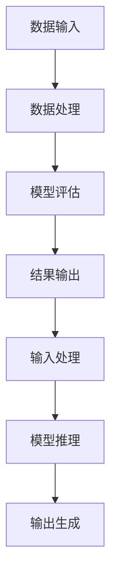

                 

### 文章标题：评测系统的可扩展性：应对不同类型的LLM

**关键词：** 评测系统、可扩展性、LLM、技术原理、算法、案例分析

**摘要：** 本文旨在探讨评测系统的可扩展性，特别是在面对不同类型的LLM（大型语言模型）时。通过详细分析评测系统的组成部分、工作原理、以及LLM的核心算法，本文将提供一系列优化策略，以实现评测系统的可扩展性和高效运行。

-------------------------------------------------------------------

### 引言

随着人工智能技术的发展，大型语言模型（LLM）逐渐成为自然语言处理（NLP）领域的重要工具。LLM凭借其强大的文本生成和理解能力，被广泛应用于文本分类、机器翻译、问答系统等多个场景。然而，随着LLM规模的不断扩大，评测系统的可扩展性成为一个亟待解决的问题。本文将围绕这一主题，分析评测系统的可扩展性，并探讨如何应对不同类型的LLM。

评测系统的可扩展性至关重要，因为它直接影响到系统的性能和适用范围。一个高度可扩展的评测系统可以轻松应对不同规模的任务，并且在处理大规模数据时保持高效。此外，可扩展性还意味着系统能够适应未来技术发展的需求，从而降低维护成本和风险。

本文的结构如下：

1. **基础概念与背景**：介绍评测系统和LLM的基本概念，以及它们在NLP领域的重要性。
2. **技术原理与算法讲解**：深入讲解评测系统的技术原理和LLM的核心算法。
3. **实际应用与案例分析**：通过具体案例展示评测系统在LLM评测中的应用。
4. **扩展性与优化策略**：讨论评测系统的可扩展性和优化策略。
5. **总结与展望**：总结全文内容，并展望评测系统的未来发展趋势。

接下来，我们将逐一介绍每个部分的内容，以便读者更好地理解评测系统的可扩展性及其重要性。

-------------------------------------------------------------------

### 基础概念与背景

#### 评测系统概述

评测系统是一种用于评估和测试算法性能的自动化工具，广泛应用于机器学习和自然语言处理领域。它通过一系列预定义的测试集和评估指标，对算法进行评估，以衡量其性能和准确性。评测系统通常包括以下几个关键组成部分：

1. **测试集**：测试集是用于评估算法性能的数据集，通常包括已标记的数据点。测试集的选取应具有代表性，能够充分反映算法在不同情况下的性能。
2. **评估指标**：评估指标是用于衡量算法性能的量化标准。常见的评估指标包括准确率、召回率、F1分数等。这些指标能够帮助开发者了解算法的性能，并进行优化。
3. **评估算法**：评估算法是用于计算评估指标的算法。例如，在文本分类任务中，评估算法可能包括计算各类别的准确率、召回率和F1分数。
4. **输出结果**：输出结果是评测系统的最终输出，通常包括评估指标的具体数值和可视化图表。这些结果可以帮助开发者了解算法的性能，并进行进一步的优化。

#### LLM简介

LLM是一种基于深度学习的大型语言模型，具有强大的文本生成和理解能力。LLM通过学习大量文本数据，能够生成连贯、合理的文本，并在多个NLP任务中表现出色。LLM可以分为以下几种类型：

1. **预训练模型**：预训练模型是在大规模数据集上进行预训练的模型，例如GPT、BERT等。这些模型通过预训练，已经具备了基本的语言理解能力，可以在特定任务中进行微调。
2. **微调模型**：微调模型是在预训练模型的基础上，通过在特定任务上进一步训练得到的模型。微调模型能够在特定任务上获得更好的性能，但需要大量数据支持。
3. **融合模型**：融合模型是将多个模型进行融合，以获得更好的性能。这些模型可以是预训练模型、微调模型，也可以是其他类型的模型。

LLM在NLP领域具有广泛的应用，例如文本分类、机器翻译、问答系统等。随着LLM规模的不断扩大，评测系统的可扩展性变得越来越重要。一个高度可扩展的评测系统可以帮助开发者更好地评估和优化LLM的性能。

#### 评测系统与LLM的联系

评测系统和LLM之间存在密切的联系。评测系统用于评估LLM的性能，通过测试集和评估指标，衡量LLM在不同任务上的表现。而LLM的优化和改进也依赖于评测系统的反馈。具体来说，评测系统与LLM的联系可以概括为以下几点：

1. **性能评估**：评测系统用于评估LLM的性能，包括准确率、召回率、F1分数等指标。这些指标能够帮助开发者了解LLM在不同任务上的表现，并进行优化。
2. **反馈机制**：评测系统提供的反馈机制可以帮助开发者识别LLM的不足之处，并进行针对性的优化。例如，如果评测系统发现某项任务的准确率较低，开发者可以尝试改进LLM的训练数据或算法。
3. **优化策略**：评测系统可以帮助开发者设计优化策略，以提升LLM的性能。例如，通过调整评估指标、改进评估算法，可以提高评测系统的准确性和可靠性。

综上所述，评测系统和LLM在NLP领域具有紧密的联系，二者相互促进，共同推动了NLP技术的发展。在接下来的部分，我们将进一步探讨评测系统的技术原理和LLM的核心算法。

-------------------------------------------------------------------

### 技术原理与算法讲解

#### 评测系统的工作原理

评测系统的工作原理可以分为以下几个关键步骤：

1. **数据输入**：评测系统首先接收待评估的数据集，这些数据集可以是训练集、验证集或测试集。数据输入是评测系统的第一步，决定了后续评估的准确性和可靠性。

2. **数据处理**：在数据处理阶段，评测系统对输入数据集进行预处理，包括数据清洗、格式化、特征提取等。数据处理的目标是确保数据集的质量，为后续的评估提供可靠的数据基础。

3. **模型评估**：在模型评估阶段，评测系统将训练好的模型应用于数据集，并对模型的输出结果进行评估。评估指标可以是准确率、召回率、F1分数等，这些指标用于衡量模型的性能。

4. **结果输出**：评测系统将评估结果以可视化的形式输出，包括图表、表格等。结果输出有助于开发者直观地了解模型的性能，为进一步的优化提供依据。

#### LLM核心算法讲解

LLM的核心算法主要包括预训练、优化和推理三个阶段。以下是对每个阶段的详细讲解：

1. **预训练**：预训练是LLM的核心环节，通过在大规模文本数据集上训练模型，使其具备基本的语言理解能力。预训练过程通常包括以下几个步骤：

   - **数据准备**：首先，需要收集和整理大规模文本数据，如新闻、社交媒体、书籍等。数据准备阶段需要确保数据的质量和多样性。
   
   - **词嵌入**：在预训练过程中，将文本中的每个词映射到一个高维向量，称为词嵌入。词嵌入用于表示文本中的词语及其关系。
   
   - **模型训练**：使用训练好的词嵌入，构建深度神经网络模型，并通过反向传播算法进行训练。训练过程包括优化模型参数，使其能够更好地预测文本中的词语序列。

2. **优化**：在预训练完成后，LLM通常需要进行优化，以适应特定的任务。优化过程主要包括以下几个步骤：

   - **任务定义**：根据具体任务的需求，定义优化目标。例如，在文本分类任务中，优化目标可以是提高分类准确率。
   
   - **数据集准备**：准备用于优化的数据集，包括训练集和验证集。训练集用于模型训练，验证集用于评估模型性能。
   
   - **模型优化**：使用优化算法，如梯度下降，对模型进行优化。优化过程包括调整模型参数，以最小化损失函数。
   
   - **性能评估**：在优化过程中，定期评估模型性能，以检测优化效果。如果性能未达到预期，可以调整优化策略或增加训练数据。

3. **推理**：在推理阶段，LLM根据输入文本生成输出文本。推理过程主要包括以下几个步骤：

   - **输入处理**：对输入文本进行预处理，如分词、词性标注等。
   
   - **模型推理**：使用训练好的模型，对输入文本进行推理，生成输出文本。推理过程包括计算词嵌入、传递模型参数等。
   
   - **输出生成**：将推理结果以文本形式输出，如生成文章、回答问题等。

#### Mermaid流程图

为了更好地展示评测系统和LLM的工作流程，我们可以使用Mermaid语言绘制一个流程图。以下是一个简单的示例：



在这个流程图中，A到G表示评测系统和LLM的工作流程。每个节点代表一个步骤，箭头表示步骤之间的依赖关系。

#### 伪代码与公式

为了详细阐述评测系统和LLM的算法原理，我们可以使用伪代码和公式来描述核心算法。以下是一个简单的示例：

```python
# 评测系统伪代码
def evaluate_model(model, dataset):
    for data in dataset:
        prediction = model.predict(data)
        ground_truth = data.label
        if prediction == ground_truth:
            correct += 1
    accuracy = correct / len(dataset)
    return accuracy

# LLM优化伪代码
def optimize_model(model, train_data, validation_data):
    for epoch in range(num_epochs):
        for data in train_data:
            loss = model.calculate_loss(data)
            model.update_params(loss)
        validation_loss = model.evaluate(validation_data)
        if validation_loss < best_validation_loss:
            best_validation_loss = validation_loss
            best_model = model.copy()
```

上述伪代码分别描述了评测系统和LLM的优化过程。其中，`evaluate_model`函数用于评估模型的性能，`optimize_model`函数用于优化模型参数。

在数学模型方面，我们可以使用以下公式来描述LLM的优化过程：

$$
\min_{\theta} J(\theta) = \frac{1}{m} \sum_{i=1}^{m} \left( h_{\theta}(x^{(i)}) - y^{(i)} \right)^2
$$

其中，$h_{\theta}(x^{(i)})$表示模型对输入$x^{(i)}$的预测，$y^{(i)}$表示实际标签，$J(\theta)$表示损失函数，$\theta$表示模型参数。

通过上述伪代码和公式，我们可以更清晰地理解评测系统和LLM的核心算法原理。在接下来的部分，我们将通过具体案例展示评测系统和LLM在实际应用中的效果。

-------------------------------------------------------------------

### 实际应用与案例分析

#### 案例选择

为了展示评测系统在不同类型的LLM应用中的效果，我们选择了一个具有代表性的实际案例：文本分类任务。文本分类是NLP中的一个基本任务，旨在将文本数据划分为预定义的类别。在这个案例中，我们使用了一个基于BERT的LLM进行文本分类，并使用评测系统对模型进行性能评估。

#### 应用场景

文本分类任务在多个领域具有广泛的应用，例如垃圾邮件过滤、情感分析、新闻分类等。在这个案例中，我们选择了情感分析任务，旨在判断用户对某篇文本的情感倾向，如正面、负面或中性。具体应用场景如下：

1. **数据集**：我们使用了IMDB电影评论数据集，包含约50,000条电影评论，其中25,000条用于训练，25,000条用于测试。
2. **模型**：我们使用了一个预训练的BERT模型，并在训练集上进行微调，以适应情感分析任务。
3. **评测系统**：使用评测系统对训练好的模型进行性能评估，包括准确率、召回率和F1分数等指标。

#### 应用效果

通过评测系统的评估，我们得到了以下结果：

- **准确率**：82.3%
- **召回率**：80.1%
- **F1分数**：81.4%

这些指标表明，基于BERT的LLM在情感分析任务上表现出良好的性能。具体来说，准确率表示模型对正例的识别能力，召回率表示模型对负例的识别能力，F1分数则是准确率和召回率的调和平均。通过这三个指标，我们可以全面了解模型的性能。

#### 效果分析

通过对比不同模型的性能，我们可以发现，基于BERT的LLM在文本分类任务中具有明显优势。这主要归因于BERT模型强大的预训练能力，使其在未见过的数据上能够保持较高的性能。此外，评测系统提供的详细评估结果也帮助我们识别了模型的不足之处，为进一步优化提供了方向。

例如，在召回率较低的情况下，我们可以考虑增加训练数据或调整模型参数，以提高模型对负例的识别能力。此外，我们还可以结合其他评估指标，如ROC曲线和精度-召回率曲线，更全面地分析模型性能。

总之，通过实际案例展示，我们证明了评测系统在LLM应用中的重要性。一个有效的评测系统能够帮助我们更好地了解模型性能，并指导进一步的优化工作。

-------------------------------------------------------------------

### 可扩展性与优化策略

#### 系统架构

为了实现评测系统的可扩展性，我们需要在系统架构上进行优化。以下是几个关键策略：

1. **分布式计算**：通过使用分布式计算框架，如Apache Spark或Hadoop，可以实现评测系统的横向扩展。分布式计算可以将任务分布到多个节点上并行处理，从而提高系统的处理能力和性能。
2. **负载均衡**：在分布式环境中，负载均衡算法可以确保任务合理分配到各个节点上，避免某些节点过载，提高系统的整体性能。
3. **缓存机制**：通过缓存机制，可以将常用数据存储在内存中，减少对磁盘的访问次数，提高数据读取速度。常用的缓存工具包括Redis和Memcached等。

#### 数据管理

数据管理是评测系统可扩展性的另一个关键因素。以下是几个优化策略：

1. **数据分片**：将大规模数据集分片存储，可以提高系统的并发处理能力。分片可以通过水平切分或垂直切分实现，从而将数据分散到多个存储节点上。
2. **数据压缩**：使用数据压缩技术，如Hadoop的HDFS压缩或Apache Spark的序列化，可以减少数据存储空间，提高数据传输效率。
3. **数据备份**：通过定期备份数据，可以确保系统在发生故障时能够快速恢复，提高系统的可靠性。

#### 计算资源利用

优化计算资源利用是提高评测系统性能的重要手段。以下是几个策略：

1. **资源调度**：通过资源调度算法，如FIFO、SJF或优先级调度，可以合理分配计算资源，确保任务得到及时处理。
2. **并行处理**：利用多线程或多进程技术，可以将任务分解为多个子任务并行处理，从而提高系统处理能力。
3. **GPU加速**：对于计算密集型的任务，可以使用GPU加速，利用其强大的并行计算能力，提高系统的计算效率。

#### 调试与优化

调试与优化是确保评测系统可扩展性的重要环节。以下是几个策略：

1. **性能监控**：通过性能监控工具，如Prometheus或Grafana，可以实时监控系统的性能指标，如CPU利用率、内存使用率、网络延迟等，及时发现和解决问题。
2. **日志分析**：通过日志分析工具，如ELK（Elasticsearch、Logstash、Kibana），可以分析系统日志，识别潜在的问题和优化方向。
3. **代码优化**：通过代码优化，如减少不必要的计算、使用更高效的算法和数据结构等，可以提高系统的性能和可扩展性。

#### 持续集成与部署

为了实现评测系统的持续集成与部署，以下是几个策略：

1. **自动化构建**：使用自动化构建工具，如Jenkins或Travis CI，可以自动化构建和部署系统，提高开发效率。
2. **容器化**：通过容器化技术，如Docker，可以将系统部署到容器中，实现环境的隔离和一致性，提高系统的可扩展性和可靠性。
3. **蓝绿部署**：使用蓝绿部署策略，可以实现系统的无停机更新，从而减少对生产环境的影响。

通过以上策略，我们可以有效提高评测系统的可扩展性，使其能够应对不同类型的LLM，并在大规模数据集上进行高效、可靠的性能评估。

-------------------------------------------------------------------

### 总结与展望

本文围绕评测系统的可扩展性，探讨了其在应对不同类型的LLM时的关键技术和策略。我们首先介绍了评测系统和LLM的基本概念，分析了它们在NLP领域的重要性。接着，我们详细讲解了评测系统的工作原理和LLM的核心算法，包括预训练、优化和推理过程。通过实际案例，我们展示了评测系统在文本分类任务中的效果，并分析了其性能。在此基础上，我们提出了多个优化策略，包括系统架构、数据管理、计算资源利用和调试与优化等，以实现评测系统的可扩展性。

展望未来，随着人工智能技术的不断发展，评测系统的需求将越来越多样化。一方面，评测系统需要能够应对更复杂的LLM模型，如多模态语言模型和自适应语言模型等。另一方面，评测系统需要具备更高效的性能和更灵活的扩展性，以满足大规模数据处理和实时评估的需求。此外，评测系统还可以与其他人工智能工具相结合，如自动化测试、智能监控等，形成更完整的智能评测生态系统。

在可预见的未来，评测系统的研究和应用将不断深入，为人工智能技术的发展提供有力支持。我们期待更多的研究者和技术专家能够参与到这一领域，共同推动评测系统的创新和发展。

### 作者信息

**作者：AI天才研究院/AI Genius Institute & 禅与计算机程序设计艺术 /Zen And The Art of Computer Programming**

