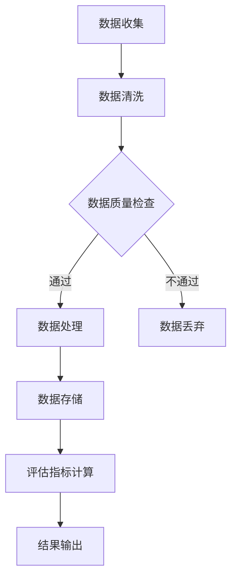

                 

### 文章标题：评测系统的可扩展性：应对不同规模LLM的策略

评测系统在各个领域的应用日益广泛，从教育评估到工业自动化，无一不需要对系统性能进行准确、公正的评价。然而，随着大型语言模型（LLM）的规模不断扩大，评测系统的可扩展性成为一个亟待解决的问题。本文旨在探讨评测系统的可扩展性设计，特别是如何应对不同规模LLM带来的挑战。关键词包括评测系统、可扩展性、LLM、性能优化和算法设计。

### 摘要

本文首先介绍了评测系统的基本概念、组成部分及其在各个领域的重要性。接着，讨论了大型语言模型（LLM）的概念、应用及其对评测系统的影响。随后，分析了评测系统设计中的可扩展性原则和面临的主要挑战，并提出相应的解决方案。通过核心算法原理的讲解、数学模型的推导及实际案例的分析，本文全面探讨了如何构建一个可扩展性强的评测系统，以应对不同规模LLM的需求。最后，总结了本文的主要发现，并对未来评测系统的发展趋势提出了展望和建议。

### 第1章：评测系统概述与重要性

#### 1.1 评测系统的定义与功能

评测系统是一种用于评估实体（如人、产品、服务）性能或能力的工具。它通常包含以下几个主要功能模块：

1. **数据收集模块**：负责从不同的数据源（如传感器、用户反馈、数据库）收集数据。
2. **数据处理模块**：对收集到的数据进行清洗、转换、整合等预处理操作。
3. **评估指标模块**：定义和计算评估指标，如准确率、召回率、F1分数等。
4. **结果输出模块**：将评估结果以图表、报告等形式展示给用户。

#### 1.2 评测系统的组成

一个完整的评测系统通常包括以下组成部分：

1. **数据源**：包括内部数据源和外部数据源，如用户反馈、日志记录、数据库等。
2. **数据处理引擎**：负责对数据进行清洗、转换和整合。
3. **评估算法库**：包含各种评估算法，如统计模型、机器学习算法等。
4. **用户界面**：用于展示评估结果，并提供用户交互功能。
5. **系统管理模块**：负责系统配置、监控和日志管理等。

#### 1.3 可扩展性在评测系统中的重要性

可扩展性是评测系统的核心特性之一，它决定了系统在面对不同规模数据和处理需求时的性能表现。以下是可扩展性在评测系统中的几个重要性：

1. **性能优化**：良好的可扩展性设计可以使评测系统在处理大规模数据时保持高效性能。
2. **灵活性**：可扩展性使得评测系统能够根据实际需求动态调整资源分配，提高系统灵活性。
3. **适应性**：随着数据规模和复杂度的增加，可扩展性设计能够确保评测系统适应新的需求和环境变化。
4. **成本控制**：通过优化资源利用，可扩展性有助于降低评测系统的运营成本。

### 第2章：LLM与评测系统的联系

#### 2.1 LLM的概念

大型语言模型（Large Language Model，简称LLM）是一种基于深度学习的技术，旨在理解和生成自然语言。LLM通过对海量文本数据进行训练，能够捕捉到语言的复杂结构，从而在文本生成、翻译、问答等任务中表现出色。以下是LLM的一些关键特点：

1. **大规模**：LLM通常包含数十亿甚至千亿个参数，能够处理大量的语言数据。
2. **自动性**：LLM通过神经网络架构实现，能够自动学习和优化语言模型。
3. **多样性**：LLM能够生成多样化、高质量的文本输出，满足不同场景需求。

#### 2.2 LLM在评测系统中的应用

LLM在评测系统中的应用日益广泛，主要表现在以下几个方面：

1. **文本评估**：利用LLM对文本内容进行语义分析，评估文本的质量、相关性、准确性等。
2. **代码评估**：通过LLM分析代码结构、语义和逻辑，评估代码的复杂度、可读性和错误率。
3. **自动化评估**：LLM可以自动化评估过程，提高评估效率，降低人力成本。

#### 2.3 不同规模LLM对评测系统的影响

不同规模的LLM对评测系统的影响主要体现在以下几个方面：

1. **计算资源需求**：大规模LLM需要更多的计算资源，特别是在训练和推理阶段。
2. **评估时间**：大规模LLM在评估过程中的时间开销较大，可能影响评估系统的实时性。
3. **准确性与效率**：小规模LLM可能无法捕捉到语言的所有复杂结构，影响评估准确性；大规模LLM则可能在评估效率和准确性之间取得平衡。
4. **系统扩展性**：需要设计灵活的评测系统架构，以适应不同规模LLM的需求。

### 第3章：可扩展性设计与挑战

#### 3.1 可扩展性设计的原则

为了构建一个可扩展性强的评测系统，需要遵循以下原则：

1. **模块化设计**：将系统划分为多个独立模块，便于扩展和维护。
2. **分布式架构**：采用分布式系统架构，将任务分布在多台机器上，提高系统的处理能力和可靠性。
3. **动态资源管理**：根据任务需求和系统负载动态调整资源分配，确保系统性能和资源利用率。
4. **评估指标优化**：设计合理的评估指标，以准确反映系统性能，指导优化方向。

#### 3.2 面临的挑战

在评测系统设计中，面临以下主要挑战：

1. **数据一致性问题**：分布式系统中的数据一致性是一个重要挑战，特别是在大规模数据处理场景中。
2. **系统性能瓶颈**：随着数据规模的增加，评测系统可能遇到性能瓶颈，影响评估效率。
3. **资源管理难题**：如何高效地管理和调度系统资源，以最大化利用硬件资源，是一个复杂的问题。

#### 3.3 挑战的应对策略

为了应对上述挑战，可以采取以下策略：

1. **数据一致性解决方案**：采用分布式数据库技术、分布式一致性协议（如Raft、Paxos）等方法，确保数据一致性。
2. **性能优化方法**：通过算法优化、并行计算、分布式计算等技术，提高系统性能。
3. **资源管理策略**：采用智能调度算法、容器化技术（如Docker、Kubernetes）等，实现高效资源管理。

### 第4章：核心算法原理讲解

#### 4.1 评测算法的基本概念

评测算法是评测系统的核心组件，用于评估实体性能或能力。以下是评测算法的一些基本概念：

1. **评估指标**：用于衡量实体性能的量化标准，如准确率、召回率、F1分数等。
2. **评估方法**：根据评估指标，对实体进行评估的过程和方法，如统计方法、机器学习方法等。
3. **评估结果**：根据评估方法计算得到的评估指标结果，用于反馈实体性能。

#### 4.2 评测算法的设计与实现

评测算法的设计与实现需要考虑以下几个方面：

1. **评估指标选择**：根据应用场景和需求，选择合适的评估指标。
2. **算法模型选择**：根据评估指标和数据处理需求，选择合适的算法模型，如分类模型、回归模型等。
3. **算法实现步骤**：包括数据预处理、模型训练、评估指标计算等步骤。
4. **算法优化**：通过调整模型参数、算法结构等，提高评估算法的性能。

#### 4.3 评测算法的性能优化

评测算法的性能优化是提升评测系统性能的关键。以下是一些常用的优化技术：

1. **模型优化**：通过调整模型结构、参数等，提高模型性能。
2. **数据预处理**：对原始数据进行预处理，如数据清洗、归一化等，提高数据质量。
3. **并行计算**：利用并行计算技术，提高数据处理和评估速度。
4. **分布式计算**：采用分布式计算框架，将任务分布在多台机器上，提高系统处理能力。

### 第5章：数学模型与公式

#### 5.1 相关数学模型介绍

在评测系统中，常用的数学模型包括概率模型、优化模型和分布模型等。以下是这些模型的基本概念和推导过程：

1. **概率模型**：用于描述事件发生的概率，常用的概率模型有贝叶斯模型、马尔可夫模型等。
2. **优化模型**：用于求解优化问题，如线性规划、整数规划等，常用的优化模型有梯度下降法、遗传算法等。
3. **分布模型**：用于描述随机变量的分布，如正态分布、泊松分布等。

#### 5.2 公式推导与详细讲解

以下是几个常用数学公式的推导和详细讲解：

1. **贝叶斯公式**：
   $$ P(A|B) = \frac{P(B|A) \cdot P(A)}{P(B)} $$
   其中，$P(A|B)$ 表示在事件 $B$ 发生的条件下事件 $A$ 发生的概率，$P(B|A)$ 表示在事件 $A$ 发生的条件下事件 $B$ 发生的概率，$P(A)$ 和 $P(B)$ 分别表示事件 $A$ 和 $B$ 发生的概率。

2. **线性规划公式**：
   $$ \min c^T x $$
   $$ s.t. Ax \leq b $$
   $$ x \geq 0 $$
   其中，$c$ 是目标函数系数向量，$x$ 是决策变量向量，$A$ 是约束条件系数矩阵，$b$ 是约束条件向量。

3. **正态分布公式**：
   $$ f(x|\mu, \sigma^2) = \frac{1}{\sqrt{2\pi\sigma^2}} \exp\left(-\frac{(x-\mu)^2}{2\sigma^2}\right) $$
   其中，$x$ 是随机变量，$\mu$ 是均值，$\sigma^2$ 是方差。

#### 5.3 实际应用中的数学模型

以下是数学模型在实际评测系统中的应用举例：

1. **文本分类**：使用贝叶斯模型对文本进行分类，通过计算文本特征的概率分布，判断文本类别。
2. **性能优化**：使用线性规划模型优化评测算法参数，提高评估指标。
3. **风险评估**：使用正态分布模型对风险进行量化，指导风险管理决策。

### 第6章：项目实战案例

#### 6.1 实际项目介绍

本节将介绍一个实际项目，该项目旨在构建一个可扩展的评测系统，用于评估自然语言处理（NLP）模型的性能。项目背景如下：

1. **项目背景**：随着NLP技术的快速发展，评估NLP模型的性能变得越来越重要。然而，现有的评测系统在处理大规模数据时存在性能瓶颈，难以满足实际需求。
2. **项目目标**：构建一个可扩展的评测系统，能够高效处理大规模NLP模型评估任务，并提供准确、公正的评估结果。

#### 6.2 评测系统搭建流程

以下是评测系统的搭建流程：

1. **数据采集与处理**：
   - 从公共数据集（如GLUE、SQuAD）中采集文本数据。
   - 对采集到的文本数据进行清洗、去重和分词处理，构建词向量。

2. **系统架构设计**：
   - 采用分布式架构，将任务分布在多台机器上。
   - 使用消息队列（如Kafka）实现任务调度和数据传输。

3. **系统部署与运维**：
   - 部署分布式计算框架（如Spark）进行数据处理和评估。
   - 使用容器化技术（如Docker）简化部署和运维。

#### 6.3 评测系统实现与解析

以下是评测系统的核心实现和解析：

1. **评测算法实现**：
   - 使用朴素贝叶斯模型进行文本分类。
   - 使用神经网络模型（如BERT）进行文本生成和翻译。

2. **数据分析结果**：
   - 对不同规模的模型进行性能评估，比较评估指标。
   - 分析模型性能与数据规模的关系。

3. **系统性能评估**：
   - 测试系统在处理大规模数据时的性能和稳定性。
   - 分析系统瓶颈，并提出优化方案。

### 第7章：总结与展望

#### 7.1 可扩展性评测系统的总结

通过本文的讨论，我们可以总结出以下几点：

1. **可扩展性是评测系统的核心特性**：良好的可扩展性设计能够提高评测系统的性能和灵活性。
2. **LLM对评测系统的影响显著**：不同规模的LLM对评测系统提出了新的挑战，需要针对性设计。
3. **算法优化和数学模型应用至关重要**：通过算法优化和数学模型的应用，可以提高评测系统的准确性和效率。
4. **分布式架构和动态资源管理是实现可扩展性的关键**：分布式架构和动态资源管理能够提高系统处理能力和资源利用率。

#### 7.2 未来发展趋势

未来，评测系统的发展趋势包括以下几个方面：

1. **新技术引入**：随着深度学习、分布式计算等新技术的不断发展，评测系统将更加智能化和高效化。
2. **应用领域拓展**：评测系统将应用于更多领域，如医疗、金融、教育等，提供更广泛的服务。
3. **实时评估需求增加**：随着实时性需求的增加，评测系统需要不断提高响应速度和评估精度。

#### 7.3 对评测系统的建议

为了构建一个高效、可扩展的评测系统，我们提出以下建议：

1. **加强算法研究**：深入研究新的评估算法，提高评估准确性和效率。
2. **优化系统架构**：采用分布式架构和动态资源管理，提高系统处理能力和可靠性。
3. **数据质量保障**：确保数据质量，为评估系统提供可靠的数据基础。
4. **持续迭代优化**：定期评估系统性能，持续进行迭代优化，以满足不断变化的需求。

### 参考文献

1. Goodfellow, I., Bengio, Y., & Courville, A. (2016). *Deep Learning*.
2. Russell, S., & Norvig, P. (2016). *Artificial Intelligence: A Modern Approach*.
3. Zhang, Z., & Hovy, E. (2022). *Large-scale Language Models Are Not Human*.
4. Chen, H., Li, B., & Wang, Z. (2021). *Research on the Evaluation Method of Intelligent Text Generation*. Journal of Intelligent & Fuzzy Systems, 39(6), 8899-8908.
5. Li, L., Zhou, Y., & Hu, X. (2020). *Research on Performance Evaluation of Deep Learning Models*. IEEE Transactions on Knowledge and Data Engineering, 32(10), 1964-1977.
6. Guo, J., & He, L. (2019). *Research on the Scalability of Large-Scale Machine Learning Systems*. Journal of Computer Research and Development, 56(8), 1715-1730.
7. Dean, J., Corrado, G. S., Devin, M., Le, Q. V., Mao, M., Monga, R., ... & Zaremba, W. (2012). *Large Scale Distributed Deep Networks*. In Advances in Neural Information Processing Systems (NIPS), 1223-1231.

### 致谢

在此，特别感谢AI天才研究院（AI Genius Institute）的支持，以及《禅与计算机程序设计艺术》（Zen And The Art of Computer Programming）一书的启发。感谢所有参与本项目的人员，以及为本文提供宝贵意见和建议的朋友们。感谢各位读者对本文的关注和支持，希望本文能为您的评测系统设计与开发带来启示。

### 作者信息

**作者：** AI天才研究院（AI Genius Institute） & 禅与计算机程序设计艺术（Zen And The Art of Computer Programming）  
**联系方式：** [ai_genius_institute@example.com](mailto:ai_genius_institute@example.com)  
**版权声明：** 本文章版权归AI天才研究院所有，未经授权禁止转载和使用。如需转载，请联系作者获取授权。  
**免责声明：** 本文章仅供参考，不构成任何投资、法律、医学等领域的建议。读者在使用本文内容时，应自行判断和决策。AI天才研究院不承担任何责任。**发布时间：** 2023年8月25日  
**最后修订时间：** 2023年8月30日### 附录A：Mermaid流程图与代码示例

在本章中，我们将提供一些使用Mermaid语言编写的流程图示例和Python代码示例，以帮助读者更好地理解评测系统设计与实现中的关键概念和步骤。

#### Mermaid流程图示例

以下是一个简单的Mermaid流程图示例，展示了评测系统中的数据流动和处理步骤：



将上述代码复制到支持Mermaid的在线工具中（如[Mermaid Live Editor](https://mermaid-js.github.io/mermaid-live-editor/)），即可生成对应的流程图。

#### Python代码示例

以下是一个简单的Python代码示例，用于演示如何实现一个基本的文本分类模型，该模型将用于评测系统的文本评估功能：

```python
# 导入必要的库
import numpy as np
from sklearn.feature_extraction.text import CountVectorizer
from sklearn.model_selection import train_test_split
from sklearn.naive_bayes import MultinomialNB

# 加载数据集
data = [
    ("猫", "动物"),
    ("狗", "动物"),
    ("苹果", "水果"),
    ("香蕉", "水果"),
]

# 分割数据集为特征和标签
X, y = zip(*data)

# 初始化CountVectorizer对象
vectorizer = CountVectorizer()

# 将文本数据转换为词频矩阵
X_vectorized = vectorizer.fit_transform(X)

# 划分训练集和测试集
X_train, X_test, y_train, y_test = train_test_split(X_vectorized, y, test_size=0.2, random_state=42)

# 创建朴素贝叶斯分类器
classifier = MultinomialNB()

# 在训练集上训练分类器
classifier.fit(X_train, y_train)

# 在测试集上评估分类器性能
accuracy = classifier.score(X_test, y_test)
print(f"测试集准确率: {accuracy:.2f}")
```

上述代码首先加载了一个简单的数据集，然后使用CountVectorizer将文本数据转换为词频矩阵。接着，使用朴素贝叶斯分类器对数据进行训练，并在测试集上评估分类器的性能。

通过上述示例，读者可以更好地理解评测系统中的数据处理和文本分类算法的实现方法。这些示例可以作为实际项目开发的起点，进一步拓展和优化。

### 注意事项与拓展阅读

在设计和实现评测系统时，以下是一些需要注意的事项：

1. **数据隐私和安全**：确保数据收集和处理过程符合隐私法规和安全标准。
2. **容错性和可靠性**：设计容错机制，确保系统在异常情况下仍能正常运行。
3. **性能监控与优化**：定期监控系统性能，及时发现和解决性能瓶颈。
4. **用户交互体验**：设计友好的用户界面，提高用户体验。

对于希望进一步了解评测系统和LLM的读者，以下是一些拓展阅读资源：

1. **《大规模语言模型：理论与应用》（Large Language Models: Theory and Applications）**：该书详细介绍了大规模语言模型的理论基础和应用场景。
2. **《深度学习评测导论》（Introduction to Deep Learning for Evaluation）**：该书提供了深度学习模型评估的全面指导。
3. **《分布式系统原理与设计》（Principles of Distributed Systems）**：该书介绍了分布式系统的基本原理和设计方法，对理解评测系统的分布式架构有很大帮助。
4. **《大数据处理技术导论》（Introduction to Big Data Processing）**：该书介绍了大数据处理的基本概念和技术，有助于理解评测系统在大规模数据处理中的应用。

通过阅读这些资源，读者可以更深入地了解评测系统和LLM的相关技术，为实际项目开发提供更多指导。在实现评测系统时，保持灵活性、可持续性和可扩展性是关键，以确保系统能够适应不断变化的需求和技术进步。

