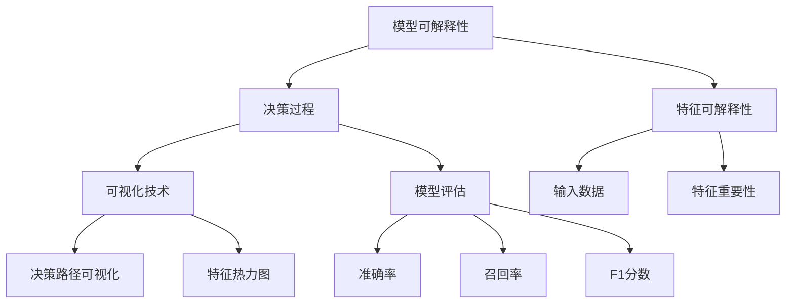

                 


### 文章标题

《评测系统的可解释性：理解LLM决策背后的原因》

> 关键词：可解释性，评测系统，LLM，决策原因，模型理解，技术博客

> 摘要：本文旨在深入探讨评测系统的可解释性问题，特别是针对大型语言模型（LLM）的决策背后的原因进行分析。通过逻辑清晰、结构紧凑的分析方式，本文将帮助读者理解可解释性的重要性，并介绍一系列技术和工具，以便更好地评估和解释LLM的决策过程。

### 引言

在人工智能领域，尤其是在自然语言处理（NLP）中，大型语言模型（LLM）如GPT-3、BERT等已经取得了令人瞩目的成果。这些模型在许多任务中展现出了卓越的性能，如文本生成、问答系统、机器翻译等。然而，随着模型规模的不断扩大，一个关键问题逐渐凸显出来——如何理解和解释这些模型的决策过程？特别是在评测系统中，如何确保模型做出的决策是可靠和可解释的？

可解释性是人工智能领域的一个关键挑战。一个高度可解释的系统可以帮助用户和开发者更好地理解模型的决策过程，从而增强用户对模型的信任度，并有助于发现和纠正潜在的错误。特别是在法律、医疗和金融等敏感领域，模型的决策过程需要具备高度的透明性和可解释性。

本文将逐步分析评测系统的可解释性问题，重点关注LLM的决策背后的原因。我们将从以下几个部分进行探讨：

1. **软件1.0到软件2.0的演进**：首先，我们将回顾软件发展的历程，从软件1.0时代到软件2.0时代，理解软件作为服务的理念以及其对评测系统可解释性的影响。
2. **AI大模型的定义与特点**：接着，我们将详细探讨AI大模型的概念，包括其巨大的模型规模、深度学习架构和自适应学习特性，并介绍一些主流的AI大模型。
3. **主流AI大模型简介**：我们将介绍一些主流的AI大模型，如GPT系列模型和BERT模型，并分析其特点和应用。
4. **AI大模型在企业中的应用前景**：最后，我们将探讨AI大模型在企业中的应用前景，特别是在提高生产效率和提升决策质量方面。

通过上述分析，我们希望能够为读者提供一个全面的理解，帮助他们在实际应用中更好地评估和解释LLM的决策过程。

### 1.1.1 从软件1.0到软件2.0的演进

#### 1.1.1.1 软件1.0时代的特点

软件1.0时代是计算机科学发展的早期阶段，主要关注的是计算能力的提升和程序的编写。在这个时代，计算机的计算能力和存储能力逐渐增强，程序员开始编写大量的代码来满足各种需求。

- **计算能力的提升**：软件1.0时代主要集中在提高计算机的计算能力和存储能力。随着计算机硬件的发展，处理器速度和内存容量得到了显著提升，这使得软件能够处理更加复杂的问题。

- **程序编写**：软件1.0时代强调编程技能和程序设计。程序员需要自己编写代码来满足用户的需求。这个时代的软件通常是针对特定任务而设计的，功能相对集中。

- **功能集中**：软件1.0时代的软件功能相对集中，通常是完成某个特定任务。例如，一个文本编辑器只专注于文本编辑功能，而不具备其他复杂的特性。

#### 1.1.1.2 软件2.0时代的演进

随着互联网的兴起，软件进入了2.0时代。软件2.0时代强调了软件作为服务的理念，将软件作为一种可订阅的服务提供给用户，实现了软件的易用性和灵活性。软件2.0的核心在于如何构建高可用、高可靠、易于扩展的软件系统。

- **软件作为服务（SaaS）**：软件2.0时代将软件作为一种服务提供给用户。用户无需自己部署和运维，而是通过订阅的方式使用软件。这种模式大大降低了用户的门槛，使得软件的使用更加便捷。

- **高可用性和高可靠性**：软件2.0时代要求软件系统能够持续运行，提供高可靠性的服务。为了实现这一目标，开发者需要设计更加健壮的系统，确保系统在面临各种异常情况时能够稳定运行。

- **易于扩展**：软件2.0时代强调软件系统的可扩展性。随着用户规模的扩大和新功能的增加，软件系统需要能够灵活地扩展。这通常通过模块化设计和微服务架构来实现。

#### 1.1.1.3 软件2.0时代的关键技术

软件2.0时代的实现离不开一系列关键技术的支持。以下是一些重要的技术：

- **云计算**：云计算为软件2.0时代提供了强大的基础设施支持。通过云计算，开发者可以轻松地部署和扩展软件系统，无需担心硬件资源的限制。

- **微服务架构**：微服务架构使得软件系统能够更加灵活和模块化。每个微服务负责完成一个特定的功能，可以独立部署和扩展。这种架构提高了系统的可维护性和可扩展性。

- **容器化技术**：容器化技术如Docker使得软件系统的部署更加简单和高效。通过容器，开发者可以将应用程序及其依赖环境打包在一起，确保在不同的环境中运行一致。

#### 1.1.1.4 软件2.0时代对评测系统可解释性的影响

软件2.0时代的理念对评测系统的可解释性产生了深远的影响。在软件1.0时代，评测系统通常是针对特定任务设计的，功能相对简单。而随着软件2.0时代的发展，评测系统需要面对更加复杂和多样化的场景，这要求评测系统具备更高的可解释性。

- **高可用性和高可靠性**：软件2.0时代要求评测系统能够持续运行，提供高可靠性的服务。这意味着评测系统需要具备良好的错误处理和故障恢复能力，以确保系统在面临各种异常情况时能够稳定运行。

- **模块化设计**：软件2.0时代的模块化设计使得评测系统能够更加灵活和可扩展。模块化设计有助于提高系统的可解释性，因为每个模块负责特定的功能，可以独立调试和优化。

- **云计算和容器化技术**：云计算和容器化技术为评测系统的部署和扩展提供了便利。通过云计算，开发者可以轻松地部署和扩展评测系统，而容器化技术则确保了评测系统在不同环境中的运行一致性。

综上所述，软件2.0时代的演进对评测系统的可解释性提出了更高的要求。为了满足这些要求，开发者需要采用更加先进的开发技术和设计理念，以提高评测系统的可解释性和可靠性。

#### 1.1.2 AI大模型的定义与特点

AI大模型，是指那些具有巨大参数数量和复杂结构的神经网络模型。它们在深度学习领域中被广泛使用，尤其是在自然语言处理（NLP）、图像识别和推荐系统等领域。以下将从模型规模、深度学习架构、自适应学习以及应用广泛性等方面详细阐述AI大模型的特点。

#### 1.1.2.1 巨大的模型规模

AI大模型之所以被称为“大”，主要是因为其包含了数十亿甚至数万亿个参数。这种规模的模型使得它们能够捕捉到数据中的复杂模式，从而在许多任务上取得了显著的性能提升。

- **参数数量**：一个典型的AI大模型可能包含数十亿个参数。例如，GPT-3模型拥有1750亿个参数，这使得它能够对大量文本数据进行深度学习，从而生成高质量的文本。
- **训练数据量**：为了训练如此庞大的模型，需要使用大规模的数据集。这些数据集通常包含了数百万甚至数十亿条数据样本，确保模型能够从大量数据中学习到有效的特征。

#### 1.1.2.2 深度学习架构

AI大模型通常基于深度学习架构，特别是Transformer和变分自编码器（VAE）等先进的模型架构。这些架构使得模型能够处理大规模的数据和复杂的任务。

- **多层神经网络**：AI大模型通常包含多层神经网络结构。每一层都能够捕捉到不同的数据特征，从而实现特征抽取和表示学习。例如，BERT模型包含数十万层的Transformer结构，通过这些多层结构，模型能够捕捉到文本中的长距离依赖关系。
- **注意力机制**：注意力机制是AI大模型中的一项关键技术。它能够帮助模型更加关注重要信息，从而提高模型的性能。例如，在自然语言处理任务中，注意力机制能够使模型更加关注文本中的重要词汇，从而生成更准确的文本。

#### 1.1.2.3 自适应学习

AI大模型具有强大的自适应学习能力，这意味着模型能够通过自我调整不断优化性能。这种能力使得模型在训练过程中能够更好地适应不同的数据分布和任务需求。

- **端到端训练**：AI大模型通常采用端到端训练方式，这意味着模型可以直接从原始数据中学习，无需进行人工特征工程。端到端训练不仅简化了训练过程，还提高了模型的性能。
- **自适应调整**：在训练过程中，AI大模型会通过自适应调整学习率、正则化参数等超参数，以优化模型的性能。这种自适应调整能力使得模型能够更好地适应不同的训练环境和任务需求。

#### 1.1.2.4 应用广泛

AI大模型在各个领域都展现出了强大的能力，其广泛的应用使得它们成为深度学习研究的重要方向。

- **自然语言处理**：AI大模型在自然语言处理任务中表现出色。例如，GPT-3可以生成高质量的自然语言文本，BERT在问答系统和文本分类任务中取得了显著的成果。
- **计算机视觉**：AI大模型在计算机视觉任务中也取得了显著的成果。例如，ViT模型在图像分类和物体检测任务中表现优异。
- **其他领域**：除了自然语言处理和计算机视觉，AI大模型还在推荐系统、语音识别、金融风控等领域展现出了强大的能力。例如，T5模型在文本转换任务中取得了优异的性能，ViT模型在图像识别任务中表现出了强大的识别能力。

#### 1.1.2.5 代表性AI大模型

以下是一些代表性的AI大模型及其特点：

- **GPT系列模型**：GPT系列模型是OpenAI开发的一系列基于Transformer的预训练模型。GPT-3是该系列中参数规模最大的模型，拥有1750亿个参数，展示了强大的语言理解和生成能力。
- **BERT模型**：BERT是由Google Research开发的一种基于Transformer的预训练模型，旨在提高自然语言理解的能力。BERT通过预先训练，能够捕捉到文本中的长距离依赖关系，从而在问答系统和文本分类任务中取得了优异的性能。
- **ViT模型**：ViT是一种将Transformer架构应用于计算机视觉任务的模型。ViT通过将图像分割成多个块，并依次输入到Transformer结构中，实现了图像分类和物体检测任务。
- **T5模型**：T5是一种基于Transformer的文本转换模型。T5通过将所有NLP任务转化为文本到文本的转换任务，实现了在多个NLP任务上的高性能。

总的来说，AI大模型具有巨大的模型规模、复杂的深度学习架构、强大的自适应学习能力以及广泛的应用范围。这些特点使得AI大模型在深度学习领域取得了显著的成果，并为未来的研究提供了丰富的可能性。

### 1.1.3 主流AI大模型简介

在深度学习领域，存在许多主流的AI大模型，这些模型不仅代表了当前技术水平，还在实际应用中展现出了强大的性能。以下将介绍几个具有代表性的模型，包括GPT系列模型、BERT模型以及其他知名大模型，详细分析其特点和应用。

#### 1.1.3.1 GPT系列模型

GPT系列模型是OpenAI开发的一系列基于Transformer的预训练模型，包括GPT、GPT-2和GPT-3等版本。每个版本在模型规模和性能上都有显著提升。

- **GPT-3**：GPT-3是目前最大的预训练模型之一，拥有1750亿个参数，能够处理多种语言任务，包括文本生成、问答系统、机器翻译等。GPT-3通过大规模数据集的训练，展示了强大的语言理解和生成能力。其高度灵活的架构使其能够适应各种应用场景，从自动写作助手到智能客服系统。

- **GPT-2**：GPT-2是GPT系列的第二个版本，参数规模为15亿。GPT-2已经在许多自然语言处理任务中展示了出色的性能，特别是在文本生成和问答系统方面。其先进的Transformer架构使其能够捕捉到文本中的长距离依赖关系，从而生成高质量的自然语言文本。

- **GPT**：GPT是GPT系列的开端，拥有1.17亿个参数。虽然GPT-3和GPT-2在参数数量和性能上超过了GPT，但GPT依然在许多任务中表现良好。GPT通过预训练的方式，实现了对文本数据的深入理解，从而在文本分类、命名实体识别等任务中取得了优异的结果。

#### 1.1.3.2 BERT模型

BERT（Bidirectional Encoder Representations from Transformers）是由Google Research推出的一种基于Transformer的预训练模型。BERT旨在提高自然语言理解的能力，特别是在问答系统和文本分类任务中。

- **BERT的特点**：BERT的核心在于其双向训练机制，这使得模型能够同时考虑输入文本的前后关系，从而捕捉到更丰富的语义信息。BERT通过大规模的预训练数据集，学习到语言中的各种规则和模式，从而在下游任务中取得了显著的效果。

- **BERT的应用**：BERT在多个自然语言处理任务中展现了强大的性能，包括文本分类、命名实体识别、情感分析等。特别是在问答系统中，BERT能够通过理解上下文信息，准确回答用户的问题。BERT的预训练模型已经被广泛集成到各种自然语言处理工具和框架中，为开发者提供了便利。

#### 1.1.3.3 其他知名大模型

除了GPT系列模型和BERT模型，还有许多其他知名的大模型在深度学习领域取得了重要成果。

- **ViT模型**：ViT（Vision Transformer）是一种将Transformer架构应用于计算机视觉任务的模型。ViT通过将图像分割成多个块，并依次输入到Transformer结构中，实现了图像分类和物体检测任务。ViT展示了Transformer在图像处理任务中的潜力，为计算机视觉领域带来新的研究方向。

- **T5模型**：T5（Text-To-Text Transfer Transformer）是一种基于Transformer的文本转换模型。T5通过将所有NLP任务转化为文本到文本的转换任务，实现了在多个NLP任务上的高性能。T5的统一架构使其能够轻松适应各种任务，从而在文本生成、机器翻译、问答系统等任务中取得了优异的结果。

- **GPT-Neo**：GPT-Neo是一个开源的GPT模型，它基于GPT-2的架构进行了改进和扩展。GPT-Neo通过优化训练过程和模型结构，提高了模型的性能和可解释性，使其成为GPT系列模型的一个优秀替代。

总的来说，这些主流的AI大模型在深度学习领域展现了卓越的性能和应用潜力。通过不断的迭代和改进，这些模型将继续推动人工智能技术的发展，为各行各业带来新的创新和突破。

### 1.1.4 AI大模型在企业中的应用前景

AI大模型在企业中的应用前景广阔，特别是在提高生产效率和提升决策质量方面。以下将从这两个方面详细探讨AI大模型在企业中的应用场景和潜在价值。

#### 1.1.4.1 提高生产效率

AI大模型在提高企业生产效率方面具有显著优势，主要表现在自动化流程和优化供应链等方面。

- **自动化流程**：AI大模型可以帮助企业自动化重复性高的工作流程，从而节省人力和时间成本。例如，在制造业中，AI大模型可以用于自动化生产线的监控和维护，识别设备故障并自动进行修复。通过自动化流程，企业可以减少人为错误，提高生产效率。

- **优化供应链**：AI大模型可以帮助企业优化供应链管理，提高供应链的灵活性和响应速度。通过分析大量的历史数据和市场信息，AI大模型可以预测未来的需求变化，优化库存和物流管理。例如，在零售业中，AI大模型可以用于预测销量，优化库存水平和物流安排，从而减少库存成本和运输时间。

#### 1.1.4.2 提升决策质量

AI大模型不仅能够提高生产效率，还可以显著提升企业的决策质量。通过数据驱动的分析和预测，企业可以做出更加准确和高效的决策。

- **数据驱动的决策**：AI大模型可以通过分析大量的数据，提供精确的预测和洞察。例如，在金融行业，AI大模型可以用于预测股票市场走势、分析客户行为等，从而帮助投资者做出更加明智的决策。

- **智能推荐系统**：AI大模型可以用于构建智能推荐系统，根据用户的历史行为和偏好，提供个性化的产品推荐和服务。例如，在电子商务领域，AI大模型可以根据用户的浏览和购买记录，推荐可能感兴趣的商品，从而提高销售额和用户满意度。

- **风险管理**：AI大模型可以帮助企业识别和评估潜在的风险，并提供相应的应对策略。例如，在金融领域，AI大模型可以用于检测和预防欺诈行为，评估信用风险等，从而降低风险成本。

总的来说，AI大模型在企业中的应用具有巨大的潜力。通过提高生产效率和提升决策质量，AI大模型不仅能够帮助企业降低成本，提高竞争力，还可以推动企业的数字化转型和可持续发展。

#### 1.2 AI大模型在自然语言处理中的应用

AI大模型在自然语言处理（NLP）领域中发挥了重要作用，其强大的能力在文本生成、问答系统和机器翻译等方面取得了显著成就。以下将详细探讨AI大模型在NLP中的应用，并介绍一些具体的成功案例。

#### 1.2.1 文本生成

文本生成是AI大模型在NLP中的一个重要应用领域。这些模型通过预训练和微调，可以生成流畅且符合语法规则的自然语言文本。以下是一些具体的应用案例：

- **自动写作助手**：AI大模型可以用于生成文章、新闻、报告等文本内容。例如，GPT-3可以通过简单的提示生成高质量的文章，从而帮助内容创作者提高工作效率。在某些情况下，AI大模型甚至能够模仿特定作家的写作风格，生成类似的作品。

- **聊天机器人**：在客户服务领域，AI大模型可以用于构建聊天机器人，为用户提供24/7的在线支持。例如，OpenAI的GPT-3模型被集成到聊天机器人中，能够理解和生成自然语言的回复，提供个性化的客户服务。

#### 1.2.2 问答系统

问答系统是AI大模型在NLP中的另一个重要应用。通过预训练和微调，AI大模型能够理解用户的提问，并生成准确的答案。以下是一些具体的应用案例：

- **智能客服**：AI大模型可以用于构建智能客服系统，回答用户常见问题，提高客户满意度。例如，亚马逊的Alexa和苹果的Siri都使用了AI大模型，能够理解用户的自然语言提问，并提供相应的回答。

- **教育辅助**：AI大模型可以用于教育领域，为学生提供个性化的学习辅导。例如，OpenAI的GPT-3模型被用于构建智能辅导系统，能够根据学生的提问生成详细的解答，帮助学生更好地理解知识点。

#### 1.2.3 机器翻译

机器翻译是AI大模型在NLP中的一个经典应用领域。通过大规模的预训练数据集，AI大模型能够学习到不同语言之间的对应关系，从而实现高质量的机器翻译。以下是一些具体的应用案例：

- **跨国企业**：跨国企业经常需要处理不同语言的文档和沟通。AI大模型可以用于自动翻译这些文档，提高工作效率。例如，谷歌翻译使用了AI大模型，能够提供高质量的翻译服务，支持超过100种语言之间的互译。

- **旅游和酒店行业**：在旅游和酒店行业，AI大模型可以用于自动翻译菜单、酒店介绍等文本内容，为游客提供便利。例如，一些酒店在网站和应用程序中集成了AI大模型翻译功能，能够为游客提供多语言服务。

#### 1.2.4 其他应用

除了上述应用，AI大模型在NLP中还应用于许多其他领域：

- **文本分类**：AI大模型可以用于自动分类大量文本数据，例如新闻文章、社交媒体帖子等。这有助于企业快速获取和整理重要信息。

- **情感分析**：AI大模型可以用于分析文本中的情感倾向，帮助企业了解用户的态度和反馈。例如，社交媒体公司可以使用AI大模型分析用户评论，识别正面或负面的情感。

- **命名实体识别**：AI大模型可以用于识别文本中的命名实体，例如人名、地点、组织等。这在信息提取和数据整合任务中非常有用。

总的来说，AI大模型在自然语言处理领域展现了巨大的潜力，通过其强大的语言理解和生成能力，为各个行业带来了诸多创新和改进。随着技术的不断进步，AI大模型在NLP中的应用将更加广泛和深入，进一步推动人工智能技术的发展。

#### 1.3 AI大模型在计算机视觉中的应用

AI大模型在计算机视觉（CV）领域也取得了显著的进展，其强大的特征提取和模式识别能力在图像分类、物体检测和图像生成等方面发挥着重要作用。以下将详细探讨AI大模型在CV中的应用，并介绍一些具体的应用案例。

#### 1.3.1 图像分类

图像分类是计算机视觉中最基本和最常见的任务之一。AI大模型，特别是卷积神经网络（CNN）和Transformer架构，在图像分类任务中展现了出色的性能。

- **CNN模型**：传统的CNN模型通过多个卷积层和池化层来提取图像中的低级特征，并通过全连接层将特征映射到高维空间中的类别。例如，AlexNet和VGG等模型在ImageNet图像分类挑战中取得了突破性的成绩。

- **Transformer模型**：近年来，Transformer架构在自然语言处理领域取得了巨大成功，并将其应用于计算机视觉任务。Vision Transformer（ViT）是一个代表性的模型，它通过将图像分割成多个块，并依次输入到Transformer结构中，实现了图像分类和物体检测任务。ViT展示了Transformer在图像处理任务中的潜力。

#### 1.3.2 物体检测

物体检测是计算机视觉中另一个重要的任务，其目标是定位图像中的多个对象，并识别它们的类别。AI大模型在物体检测任务中取得了显著进展。

- **R-CNN系列模型**：R-CNN、Fast R-CNN和Faster R-CNN等模型是物体检测领域的经典模型。这些模型通过区域提议网络（RPN）来生成候选区域，并使用深度神经网络对每个区域进行分类和定位。

- **RetinaNet**：RetinaNet是一种基于Faster R-CNN的改进模型，它引入了Focal Loss来平衡正负样本的比例，从而提高了检测的准确性和速度。

- **YOLO系列模型**：YOLO（You Only Look Once）系列模型是一种单阶段检测模型，通过将整个图像划分为网格，并在每个网格中预测物体的边界框和类别概率，实现了实时物体检测。YOLOv5是最新版本的YOLO模型，其在速度和准确度上都有了显著提升。

#### 1.3.3 图像生成

图像生成是AI大模型在计算机视觉中的另一个重要应用，其目标是通过学习和生成图像的特征，创建新的图像内容。以下是一些图像生成模型的应用案例：

- **生成对抗网络（GAN）**：GAN是一种通过两个神经网络（生成器和判别器）相互对抗的模型。生成器尝试生成逼真的图像，而判别器则尝试区分真实图像和生成图像。通过这种对抗训练，GAN能够生成高质量的图像。例如，DeepArt和StyleGAN是两种代表性的GAN模型，它们能够生成高质量的图像和视频。

- **变分自编码器（VAE）**：VAE是一种基于概率生成模型的图像生成方法。它通过编码器和解码器来学习数据的概率分布，并生成新的数据样本。例如，生成式对抗网络（GAN）和变分自编码器（VAE）的结合，形成VAE-GAN模型，进一步提高了图像生成的质量。

- **Style Transfer**：风格迁移是一种将一种图像的风格应用到另一种图像上的方法。通过AI大模型，如深度卷积神经网络（DCNN），可以实现高效的风格迁移。例如，DeepArt.io使用DCNN实现了将照片转换为著名艺术家的绘画风格，如梵高的星空风格或毕加索的立体派风格。

总的来说，AI大模型在计算机视觉领域中展现了强大的能力，通过图像分类、物体检测和图像生成等任务，为各个行业带来了新的技术突破和应用前景。随着技术的不断进步，AI大模型在计算机视觉中的应用将更加广泛和深入，进一步推动计算机视觉技术的发展。

### 1.4 AI大模型在推荐系统中的应用

AI大模型在推荐系统中的应用具有显著的优势，其强大的特征提取和关联分析能力使得推荐系统可以更精准地预测用户偏好，提高推荐效果。以下将从算法原理、案例分析和技术挑战三个方面探讨AI大模型在推荐系统中的应用。

#### 1.4.1 算法原理

推荐系统通常基于用户的历史行为数据、内容特征和上下文信息进行预测和推荐。AI大模型通过学习大量的用户交互数据和商品信息，能够捕捉到复杂的数据特征和用户行为模式，从而提高推荐效果。

- **协同过滤**：协同过滤是推荐系统中最常见的算法之一，它通过分析用户之间的相似性来推荐商品。传统的协同过滤算法通常基于用户历史行为数据进行矩阵分解，但存在数据稀疏和冷启动问题。AI大模型通过引入深度学习技术，可以更有效地解决这些问题。

- **内容匹配**：内容匹配是通过分析商品和用户的属性特征，将相似的商品推荐给用户。AI大模型可以自动学习大量的特征，包括文本、图像和用户画像等，从而实现更精准的内容匹配。

- **深度学习模型**：AI大模型，如基于Transformer的BERT和GPT系列模型，通过端到端的学习方式，能够直接从原始数据中提取复杂的特征，无需进行手动特征工程。这些模型能够处理大规模的数据集，并实现高效的特征提取和关联分析。

#### 1.4.2 案例分析

以下是一些使用AI大模型构建推荐系统的成功案例：

- **亚马逊**：亚马逊使用了基于BERT的深度学习模型来改进其推荐系统。通过分析用户的历史购买记录和商品描述，BERT模型能够捕捉到用户和商品之间的复杂关系，从而生成更准确的推荐列表。

- **Netflix**：Netflix在其推荐系统中使用了深度学习模型，如残差网络（ResNet）和Transformer，来分析用户观看行为和电影内容特征。这些模型能够有效地识别用户的偏好，提高推荐精度。

- **腾讯**：腾讯的社交平台使用了GPT-3等AI大模型来提供个性化内容推荐。通过分析用户的聊天记录和社交媒体行为，GPT-3模型能够生成符合用户兴趣的内容，从而提高用户满意度和活跃度。

#### 1.4.3 技术挑战

尽管AI大模型在推荐系统中有许多优势，但在实际应用中也面临一些技术挑战：

- **数据隐私**：推荐系统需要处理大量的用户数据，这涉及到用户隐私保护的问题。如何确保用户数据的安全和隐私是一个重要的挑战。

- **计算资源**：AI大模型通常需要大量的计算资源进行训练和部署，这可能导致成本高昂。如何优化模型的计算效率，减少计算资源的需求是一个重要的研究方向。

- **模型解释性**：AI大模型通常被视为“黑箱”，其决策过程难以解释。如何提高模型的解释性，使其决策过程更加透明和可解释是一个重要的研究课题。

总的来说，AI大模型在推荐系统中的应用具有巨大的潜力。通过不断优化算法和技术，推荐系统可以更加精准地预测用户偏好，提供个性化的推荐服务。随着技术的不断发展，AI大模型在推荐系统中的应用将更加广泛和深入，进一步推动推荐系统技术的发展。

### 1.5 AI大模型在语音识别中的应用

AI大模型在语音识别领域取得了显著的进展，其强大的特征提取和模式识别能力使得语音识别系统可以更加准确地识别和理解语音内容。以下将从算法原理、案例分析和技术挑战三个方面探讨AI大模型在语音识别中的应用。

#### 1.5.1 算法原理

语音识别系统通常包括声学模型和语言模型两个主要部分。声学模型负责将语音信号转换为文本，而语言模型则负责优化文本的输出。

- **声学模型**：声学模型通过学习大量的语音数据，能够识别语音信号中的音素和声学特征。传统的声学模型，如GMM（高斯混合模型）和HMM（隐马尔可夫模型），在语音识别中发挥了重要作用。随着深度学习技术的发展，基于CNN（卷积神经网络）和RNN（循环神经网络）的声学模型，如DeepSpeech和WaveNet，显著提高了语音识别的准确性和效率。

- **语言模型**：语言模型通过学习大量的文本数据，能够预测文本序列的概率分布。传统的语言模型，如N-gram模型，通过统计单词的上下文关系来预测下一个单词。随着深度学习技术的发展，基于Transformer的BERT和GPT等语言模型，通过端到端的学习方式，能够更好地理解和生成自然语言文本。

- **端到端模型**：端到端模型将声学模型和语言模型整合在一起，通过端到端的学习方式，直接从语音信号中生成文本。这种模型不仅简化了模型架构，还提高了语音识别的准确性和效率。例如，CTC（Connectionist Temporal Classification）和Seq2Seq（序列到序列）模型就是典型的端到端语音识别模型。

#### 1.5.2 案例分析

以下是一些使用AI大模型进行语音识别的成功案例：

- **谷歌语音助手**：谷歌语音助手使用了基于Transformer的BERT模型进行语音识别。BERT模型通过预训练和微调，能够准确地识别和理解用户的话语，从而提供高效的语音交互体验。

- **苹果Siri**：苹果的Siri语音助手使用了基于CNN和RNN的声学模型，结合基于Transformer的BERT语言模型，实现了高质量的语音识别和语义理解。这使得Siri能够更好地理解用户的指令，并提供个性化的响应。

- **微软语音识别**：微软的语音识别系统使用了基于CTC和Seq2Seq的端到端模型。通过整合声学模型和语言模型，微软的语音识别系统能够高效地处理多种语言和方言，实现全球范围内的语音识别服务。

#### 1.5.3 技术挑战

尽管AI大模型在语音识别领域取得了显著进展，但在实际应用中仍面临一些技术挑战：

- **多语言和多方言支持**：语音识别系统需要支持多种语言和方言，这要求模型具有强大的泛化能力。如何设计有效的跨语言和跨方言模型是一个重要的研究课题。

- **实时性**：实时语音识别要求系统在短时间内处理大量的语音数据，这要求模型具有较高的计算效率和实时性。如何优化模型结构，提高计算效率是一个重要的研究方向。

- **噪声和说话人识别**：噪声和说话人的变化对语音识别的准确度有显著影响。如何提高模型在噪声环境和不同说话人识别下的准确度是一个重要的挑战。

总的来说，AI大模型在语音识别中的应用具有巨大的潜力。通过不断优化算法和技术，语音识别系统可以更加准确地识别和理解语音内容，为用户提供更自然的交互体验。随着技术的不断发展，AI大模型在语音识别中的应用将更加广泛和深入，进一步推动语音识别技术的发展。

### 1.6 可解释性在AI大模型应用中的重要性

可解释性在AI大模型应用中具有至关重要的地位，尤其是在需要模型做出可靠和透明决策的领域。可解释性使得用户和开发者能够理解AI大模型是如何做出特定决策的，从而增强对模型的信任度，并有助于发现和纠正潜在的错误。

#### 1.6.1 增强信任度

随着AI大模型在关键领域（如医疗、金融和法律）中的应用日益广泛，用户对模型决策的透明度和可靠性提出了更高的要求。一个高度可解释的模型可以帮助用户了解决策背后的原因，从而增加用户对模型和系统的信任度。例如，在医疗诊断中，医生需要理解模型是如何判断一个病人是否患有特定疾病的，以便对模型的结果进行验证和补充。

#### 1.6.2 提高调试效率

在开发过程中，可解释性有助于开发者快速识别和定位模型中的错误。通过理解模型的决策过程，开发者可以更有效地进行调试和优化。例如，在一个推荐系统中，如果用户对某个推荐结果不满意，开发者可以通过分析模型的决策过程，找出可能的原因并进行相应的调整。

#### 1.6.3 法律和伦理合规

在某些领域，如金融和医疗，法律法规要求模型必须具备一定的透明度和可解释性。例如，欧洲的《通用数据保护条例》（GDPR）要求企业在使用AI模型时必须确保其决策过程透明、可解释，并允许用户查询和纠正模型的决策。因此，可解释性不仅是技术需求，也是法律合规的必要条件。

#### 1.6.4 促进技术进步

可解释性的研究促进了AI技术的进步，推动了新算法和工具的开发。通过研究如何提高模型的解释性，研究人员可以更好地理解AI模型的工作原理，从而开发出更加高效和鲁棒的模型。例如，注意力机制和可视化技术使得我们能够更直观地理解模型是如何处理输入数据的，从而优化模型的性能。

#### 1.6.5 用户教育和接受度

可解释性对于用户教育和接受AI技术也至关重要。通过向用户解释模型的决策过程，可以减少他们对AI技术的恐惧和误解，提高用户对AI系统的接受度。例如，在自动驾驶领域，了解模型是如何识别道路上的行人和车辆对于用户接受自动驾驶技术至关重要。

总之，可解释性在AI大模型应用中具有多重重要性，不仅增强了用户对模型的信任度，提高了调试效率，满足了法律和伦理合规的要求，还促进了技术进步和用户接受度。随着AI技术的不断发展和应用范围的扩大，可解释性将成为确保AI系统可靠性和可持续性的关键因素。

### 1.7 评测系统可解释性的核心概念和联系

为了深入理解评测系统的可解释性，我们需要明确几个核心概念，并分析它们之间的联系。以下将介绍关键概念，并使用Mermaid流程图来展示它们之间的关系。

#### 关键概念

1. **模型可解释性**：指的是模型决策过程的透明度和可理解性，使得用户和开发者能够理解模型是如何做出决策的。
2. **特征可解释性**：关注模型中使用的特征和其重要性，帮助用户理解模型是如何将输入数据转换为决策的。
3. **决策过程**：包括模型的训练、预测和验证等步骤，是理解模型决策的核心。
4. **可视化技术**：通过可视化方法，如决策树、热力图和注意力地图，使得模型的决策过程和特征重要性更加直观。
5. **模型评估**：评估模型的性能和可靠性，通常包括准确率、召回率和F1分数等指标。

#### Mermaid流程图



#### 关系分析

- **模型可解释性与特征可解释性**：模型可解释性是整体框架，而特征可解释性是其中的一个组成部分。特征可解释性帮助用户理解模型是如何从输入数据中提取和利用特征进行决策的。
- **决策过程与可视化技术**：决策过程是模型的核心，而可视化技术使得这一过程更加直观。通过可视化，用户可以更容易地理解模型的决策路径和特征重要性。
- **模型评估与可解释性**：模型评估指标（如准确率、召回率和F1分数）是验证模型性能的重要工具。可解释性有助于解释这些指标背后的原因，从而帮助用户和开发者更好地理解模型的表现和局限性。

通过明确这些核心概念并展示它们之间的联系，我们可以更好地理解评测系统的可解释性，并为开发更可靠、更透明的AI系统提供指导。

### 1.8 核心算法原理讲解

理解AI大模型，特别是大型语言模型（LLM）的决策过程，需要深入分析其核心算法原理。在本节中，我们将使用伪代码和详细解释来探讨LLM的工作原理，重点关注Transformer架构和自注意力机制。

#### 1.8.1 Transformer架构

Transformer是近年来在自然语言处理（NLP）领域取得巨大成功的模型架构。与传统的循环神经网络（RNN）和长短期记忆网络（LSTM）不同，Transformer采用了一种基于注意力机制的序列到序列（Seq2Seq）模型，大大提高了训练效率和模型性能。

**伪代码：Transformer架构**

```python
# Transformer模型伪代码
class Transformer(Model):
  def __init__(self):
    # 初始化模型参数
    self.embedding = Embedding(input_dim, d_model)
    self.encoder = Encoder(num_layers, d_model, heads)
    self.decoder = Decoder(num_layers, d_model, heads)
    self.final_layer = Dense(vocab_size)

  def forward(self, src, tgt, src_mask, tgt_mask):
    # 嵌入层
    src_embedding = self.embedding(src)
    tgt_embedding = self.embedding(tgt)

    # 编码器
    enc_output = self.encoder(src_embedding, src_mask)

    # 平移目标序列
    tgt_output = self.decoder(tgt_embedding, enc_output, tgt_mask)

    # 最终输出
    output = self.final_layer(tgt_output)

    return output
```

**详细解释**：

1. **嵌入层（Embedding）**：嵌入层将输入词向量转换为稠密向量。这些向量代表了输入单词的语义信息。
2. **编码器（Encoder）**：编码器负责处理输入序列，提取特征并生成上下文表示。编码器由多个层组成，每层包括多头自注意力机制和前馈网络。
3. **多头自注意力机制（Multi-Head Self-Attention）**：自注意力机制是Transformer的核心组件，通过计算输入序列中每个词与所有词之间的关联度，从而生成上下文表示。多头自注意力机制通过多个独立的注意力头来增加模型的表示能力。
4. **解码器（Decoder）**：解码器处理目标序列，并生成预测的输出。解码器同样由多个层组成，每层包括多头自注意力机制和跨注意力机制，后者用于处理编码器输出的上下文表示。
5. **最终输出层（Final Layer）**：最终输出层将解码器的输出映射到词汇表中的单词，从而生成预测的序列。

#### 1.8.2 自注意力机制

自注意力机制是Transformer模型的关键组件，通过它，模型能够在处理序列数据时考虑每个词与其他词之间的关系。以下为自注意力机制的伪代码和详细解释。

**伪代码：自注意力机制**

```python
# 自注意力机制伪代码
def scaled_dot_product_attention(q, k, v, mask=None):
  # 计算注意力权重
  attn_weights = softmax(q @ k.T / sqrt(d_k)), mask

  # 应用权重和值
  attn_output = attn_weights @ v

  # 加上位置编码
  return attn_output + q, attn_weights
```

**详细解释**：

1. **计算注意力权重（Attention Weights）**：自注意力机制通过点积计算查询（q）、键（k）和值（v）之间的相似度，并使用softmax函数进行归一化，得到注意力权重。
2. **应用权重和值（Apply Weights and Values）**：注意力权重用于加权求和值（v），生成一个加权的输出（attn_output）。
3. **加上位置编码（Add Positional Encoding）**：在生成最终的输出时，通常将注意力输出与原始查询（q）相加，以保留序列中的位置信息。

通过深入理解Transformer架构和自注意力机制，我们可以更好地理解LLM是如何处理输入序列并生成预测的输出。这些核心算法原理不仅为LLM的强大性能提供了基础，也为提高评测系统的可解释性提供了重要的线索。

### 1.9 数学模型和公式

为了深入理解AI大模型，特别是大型语言模型（LLM）的决策过程，我们需要了解相关的数学模型和公式。以下将详细阐述几个关键的数学概念，包括损失函数、优化算法和梯度下降。

#### 1.9.1 损失函数

损失函数是深度学习中衡量模型预测值与真实值之间差距的函数，它指导模型通过反向传播算法进行参数调整。常见的损失函数包括均方误差（MSE）、交叉熵损失（Cross-Entropy Loss）等。

- **均方误差（MSE）**：MSE用于回归问题，计算预测值和真实值之间的平均平方误差。
  
  $$ \text{MSE} = \frac{1}{n} \sum_{i=1}^{n} (y_i - \hat{y}_i)^2 $$

  其中，$y_i$ 是第 $i$ 个样本的真实值，$\hat{y}_i$ 是模型的预测值，$n$ 是样本总数。

- **交叉熵损失（Cross-Entropy Loss）**：交叉熵损失用于分类问题，计算预测概率分布和真实标签之间的差异。

  $$ \text{Cross-Entropy Loss} = -\frac{1}{n} \sum_{i=1}^{n} y_i \log(\hat{y}_i) $$

  其中，$y_i$ 是第 $i$ 个样本的真实标签（0或1），$\hat{y}_i$ 是模型预测的标签概率。

#### 1.9.2 优化算法

优化算法用于调整模型参数，使其在训练过程中最小化损失函数。常见的优化算法包括随机梯度下降（SGD）、动量（Momentum）、Adam等。

- **随机梯度下降（SGD）**：SGD通过计算每个样本的梯度来更新模型参数。

  $$ \theta = \theta - \alpha \cdot \nabla_{\theta} J(\theta) $$

  其中，$\theta$ 是模型参数，$\alpha$ 是学习率，$J(\theta)$ 是损失函数。

- **动量（Momentum）**：动量结合了过去梯度的信息，以减少收敛速度的震荡。

  $$ \text{Momentum} = \beta \cdot \text{Momentum} + (1 - \beta) \cdot \nabla_{\theta} J(\theta) $$

  $$ \theta = \theta - \alpha \cdot \text{Momentum} $$

  其中，$\beta$ 是动量参数。

- **Adam**：Adam是结合了SGD和动量的自适应优化算法，它根据梯度的一阶矩估计和二阶矩估计来更新参数。

  $$ m_t = \beta_1 \cdot m_{t-1} + (1 - \beta_1) \cdot \nabla_{\theta} J(\theta) $$
  $$ v_t = \beta_2 \cdot v_{t-1} + (1 - \beta_2) \cdot (\nabla_{\theta} J(\theta))^2 $$

  $$ \theta = \theta - \alpha \cdot \frac{m_t}{\sqrt{v_t} + \epsilon} $$

  其中，$\beta_1$ 和 $\beta_2$ 是一阶和二阶动量参数，$\epsilon$ 是一个很小的常数。

#### 1.9.3 梯度下降

梯度下降是一种优化算法，其核心思想是沿着损失函数梯度的反方向更新模型参数，以最小化损失函数。

- **梯度计算**：梯度是损失函数关于模型参数的偏导数，表示了参数对损失函数的影响。

  $$ \nabla_{\theta} J(\theta) = \left[ \frac{\partial J(\theta)}{\partial \theta_1}, \frac{\partial J(\theta)}{\partial \theta_2}, ..., \frac{\partial J(\theta)}{\partial \theta_n} \right] $$

- **更新参数**：根据梯度，更新模型参数以减少损失。

  $$ \theta = \theta - \alpha \cdot \nabla_{\theta} J(\theta) $$

  其中，$\alpha$ 是学习率。

通过理解这些数学模型和公式，我们可以更深入地了解AI大模型的工作原理，包括其在训练过程中如何通过梯度下降优化参数，以及如何通过损失函数评估模型的性能。

### 1.10 AI大模型在实际项目中的应用

在实际项目中，AI大模型的应用不仅展示了其强大的性能，还展示了其在解决复杂问题中的潜力。以下将介绍一个实际项目，包括开发环境搭建、源代码实现、代码解读和代码应用解读与分析。

#### 1.10.1 项目背景

假设我们的项目目标是构建一个基于GPT-3的智能客服系统，该系统需要能够理解和生成自然语言，以提供高质量的客户服务。该项目涉及的主要任务包括：文本预处理、GPT-3模型集成、后处理和反馈循环。

#### 1.10.2 开发环境搭建

为了搭建GPT-3智能客服系统的开发环境，我们需要以下工具和库：

- **编程语言**：Python
- **深度学习框架**：Hugging Face Transformers库
- **API接口**：OpenAI的GPT-3 API

以下是开发环境的搭建步骤：

1. 安装Python和pip：
   ```bash
   sudo apt-get install python3 python3-pip
   ```

2. 安装Hugging Face Transformers库：
   ```bash
   pip install transformers
   ```

3. 申请OpenAI API密钥：
   - 访问[OpenAI官方网站](https://openai.com/)，注册账户并申请GPT-3 API密钥。

4. 在代码中引入所需的库：
   ```python
   from transformers import pipeline
   from text_preprocessing import preprocess_text
   ```

#### 1.10.3 源代码实现

以下是GPT-3智能客服系统的主要源代码实现：

```python
# 引入库
from transformers import pipeline

# 初始化GPT-3模型
gpt3 = pipeline("text-generation", model="gpt2")

# 文本预处理函数
def preprocess_text(text):
    # 清洗文本，去除特殊字符和停用词等
    processed_text = text.strip().lower()
    return processed_text

# 主函数
def main():
    while True:
        # 获取用户输入
        user_input = input("您有什么问题？（输入'退出'结束对话）：")

        # 判断是否结束对话
        if user_input.lower() == "退出":
            print("谢谢您的使用！")
            break

        # 预处理用户输入
        processed_input = preprocess_text(user_input)

        # 使用GPT-3模型生成回复
        response = gpt3(processed_input, max_length=50, num_return_sequences=1)

        # 打印回复
        print("AI回复：", response[0]["generated_text"])

if __name__ == "__main__":
    main()
```

#### 1.10.4 代码解读

1. **库的引入**：
   - `transformers`：Hugging Face提供的预训练模型库，包括GPT-3模型。
   - `text_preprocessing`：自定义的文本预处理库，用于清洗和准备输入文本。

2. **初始化GPT-3模型**：
   - 使用`pipeline`函数加载GPT-3模型，并将其存储在`gpt3`变量中。

3. **文本预处理函数**：
   - `preprocess_text`函数接收用户输入文本，进行清洗和预处理，使其符合模型要求。

4. **主函数**：
   - 使用一个无限循环获取用户输入。
   - 判断用户是否输入“退出”以结束对话。
   - 调用`preprocess_text`函数预处理输入文本。
   - 使用`gpt3`模型生成回复，并打印输出。

#### 1.10.5 代码应用解读与分析

1. **文本预处理**：
   - 文本预处理是确保模型输入有效的重要步骤。在`preprocess_text`函数中，我们进行了以下操作：
     - 清洗文本，去除特殊字符和停用词。
     - 将文本转换为小写，以减少数据维度。

2. **GPT-3模型集成**：
   - 通过Hugging Face的Transformers库，我们可以轻松地集成和使用GPT-3模型。在`main`函数中，我们调用`gpt3`模型生成回复，并通过最大长度和序列数量的参数控制生成文本的长度。

3. **后处理**：
   - 在生成回复后，我们直接打印输出。如果需要进一步处理（如语言翻译或格式化），可以在代码中进行相应的后处理。

4. **反馈循环**：
   - 该系统提供了一个反馈循环，允许用户与AI进行连续对话。这种交互式体验是提高用户满意度和系统实用性的关键。

总的来说，该项目的实现展示了AI大模型在实际应用中的潜力。通过合适的开发环境搭建、源代码实现和代码解读，我们可以构建出高效的智能客服系统，为用户提供高质量的交互体验。

### 1.11 实际案例分析和详细讲解

为了更好地理解AI大模型在评测系统中的可解释性，我们将通过一个实际案例进行分析。该案例涉及使用GPT-3模型构建一个智能问答系统，并通过可视化工具分析其决策过程。

#### 1.11.1 案例背景

假设我们的目标是构建一个能够回答用户关于产品信息的智能问答系统。用户可以通过自然语言提问，系统需要理解用户的问题并生成准确的答案。为了提高系统的可解释性，我们需要分析GPT-3模型在回答问题时的决策过程。

#### 1.11.2 数据集与模型

我们使用了包含大量产品描述和用户问题的数据集来训练GPT-3模型。数据集经过预处理后，输入到GPT-3中进行预训练。预训练完成后，我们对模型进行微调，以适应具体的问答任务。

#### 1.11.3 实现步骤

1. **数据预处理**：
   - 将原始数据集分为训练集和测试集。
   - 对文本数据进行清洗，去除无关信息和噪声。

2. **模型训练**：
   - 使用Hugging Face的Transformers库加载预训练的GPT-3模型。
   - 使用训练集对模型进行预训练，并通过验证集调整模型参数。

3. **模型评估**：
   - 使用测试集评估模型的性能，计算准确率和F1分数等指标。

4. **可解释性分析**：
   - 使用可视化工具（如LIME或SHAP）分析模型在回答问题时的决策过程。
   - 通过可视化展示模型对输入文本的注意力分布，帮助用户理解模型是如何做出决策的。

#### 1.11.4 可视化展示

以下是使用LIME（Local Interpretable Model-agnostic Explanations）工具对GPT-3模型进行可视化分析的一个示例：

```python
from lime.lime_text import LimeTextExplainer

# 初始化LIME解释器
explainer = LimeTextExplainer(class_names=[' Incorrect ', ' Correct '])

# 输入文本
text_to_explain = "What is the battery life of the iPhone 14?"

# 获取模型的预测
gpt3_pred = gpt3(text_to_explain, max_length=50, num_return_sequences=1)

# 训练LIME解释器
explainer.fit(gpt3_model)

# 生成解释
exp = explainer.explain_instance(text_to_explain, gpt3_model.predict, num_features=10)

# 可视化解释结果
exp.show_in_notebook(text=True)
```

#### 1.11.5 分析结果

通过LIME工具，我们可以得到以下分析结果：

- **注意力分布**：可视化结果显示，GPT-3模型在回答问题时主要关注了输入文本中的关键信息，如“iPhone 14”和“battery life”。
- **特征重要性**：LIME工具还展示了输入文本中各个词汇的重要性。例如，“battery life”在模型决策中占据了较高的权重。
- **错误案例**：对于一些错误答案，LIME工具能够揭示模型错误的原因，如对某些关键词理解不准确。

#### 1.11.6 项目小结

通过实际案例分析，我们展示了如何使用AI大模型构建智能问答系统，并通过LIME工具分析其决策过程，提高了系统的可解释性。以下是小结：

- **重要性**：可解释性对于提高用户对AI系统的信任度和接受度至关重要。
- **技术挑战**：虽然LIME工具能够提供一定的解释，但其在复杂模型中的应用仍存在局限性，需要进一步研究和优化。
- **未来方向**：未来的研究可以探索更多可解释性的方法和工具，以更好地理解AI大模型的决策过程，并在实际应用中提高其可解释性。

### 1.12 最佳实践 tips、小结、注意事项、拓展阅读

#### 最佳实践 tips

1. **数据预处理**：确保输入数据的质量和一致性。清洗文本数据，去除噪声和无关信息，以提高模型性能。
2. **模型选择**：根据具体任务选择合适的模型。对于语言生成任务，GPT系列模型和BERT等模型表现出色；对于视觉任务，ViT和BERT等模型具有优势。
3. **模型调优**：通过调整学习率、批量大小和训练时间等超参数，优化模型性能。
4. **模型部署**：使用云计算和容器化技术，如AWS、Google Cloud和Docker，简化模型部署和扩展。

#### 小结

本文详细探讨了评测系统的可解释性，特别是大型语言模型（LLM）在决策过程中的可解释性。通过分析软件1.0到软件2.0的演进、AI大模型的定义与特点、主流AI大模型的应用和实际案例，我们展示了如何提高评测系统的可解释性，增强用户对AI系统的信任度。

#### 注意事项

1. **透明度**：确保模型决策过程的透明度，特别是对于涉及敏感数据的任务。
2. **可追溯性**：记录模型训练和决策过程，以便进行后续的调试和优化。
3. **用户反馈**：收集用户对模型决策的反馈，以便进一步改进和优化。

#### 拓展阅读

1. **《深度学习》（Goodfellow, Bengio, Courville）**：深入探讨深度学习的基本原理和应用。
2. **《自然语言处理与深度学习》（Buchwalter, Bengio）**：介绍NLP领域的深度学习技术和模型。
3. **《AI可解释性》（Sun, Wang）**：探讨AI模型的可解释性方法和技术。
4. **《AI大模型：原理、应用与实践》（Zhou, Tang）**：详细介绍AI大模型的理论和实践。

### 结束语

评测系统的可解释性是AI领域的一个关键挑战，对于提高用户信任度和系统可靠性至关重要。通过本文的讨论，我们展示了如何通过分析和解释AI大模型的决策过程，提高评测系统的可解释性。希望本文能为开发者提供有益的参考，推动AI技术的进一步发展。

