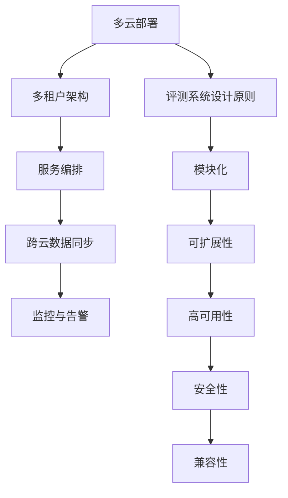

                 

### 文章标题：评测系统的多云部署与管理

> 关键词：评测系统、多云部署、管理、云计算、架构设计、策略、项目实战

> 摘要：本文深入探讨了评测系统的多云部署与管理。首先，文章介绍了评测系统的背景和重要性，接着详细阐述了多云部署的概念和核心概念之间的关系，以及评测系统设计原则。随后，文章讨论了多云部署策略和管理方法，并通过实际项目案例进行了实战分析和解读。文章最后总结了最佳实践和注意事项，为读者提供了全面而实用的指导。

## 引言

在当今数字化时代，评测系统作为企业信息化建设的重要组成部分，其作用日益凸显。评测系统不仅用于评估和监控业务性能，还支持企业智能化管理和决策。然而，随着云计算技术的发展，如何在一个多云环境中有效地部署和管理评测系统，成为企业面临的重大挑战。

本文旨在探讨评测系统的多云部署与管理，帮助读者了解多云环境中的核心概念、设计原则、部署策略和管理方法。通过实际项目案例的分析，本文还将提供实用的实战经验和最佳实践，旨在为读者提供全面而深入的指导。

## 背景介绍

### 评测系统的定义和重要性

评测系统是一种用于评估、监控和分析业务过程的软件系统。它通过收集、处理和分析业务数据，为企业提供关键的决策支持和优化建议。评测系统的核心功能包括：

- **数据采集与存储**：从各种数据源（如数据库、日志文件等）中采集数据，并进行存储和管理。
- **数据处理与分析**：对采集到的数据进行清洗、转换和分析，生成业务指标和报告。
- **监控与报警**：实时监控业务运行状态，并在发现异常时触发报警。
- **决策支持**：通过数据分析，提供业务优化建议和决策支持。

评测系统在企业信息化建设中具有重要作用，主要体现在以下几个方面：

- **提升业务效率**：通过自动化数据处理和分析，减少人工干预，提高业务效率。
- **优化业务流程**：通过监控和评估，发现流程中的瓶颈和问题，进行优化和改进。
- **支持决策制定**：提供准确的数据分析和预测，为管理层提供决策依据。
- **保障业务稳定性**：通过实时监控和报警，及时发现和解决潜在问题，保障业务稳定性。

### 多云环境的定义和重要性

多云环境是指企业采用多个云服务提供商（如AWS、Azure、Google Cloud等）的服务，构建自己的IT基础设施和应用架构。多云环境的优点包括：

- **灵活性和可扩展性**：企业可以根据业务需求，选择最合适的云服务提供商，实现灵活的资源配置和扩展。
- **高可用性和容灾能力**：通过将应用和数据分布在不同的云上，提高系统的可用性和容灾能力。
- **成本优化**：企业可以根据不同云服务提供商的价格和性能，实现成本优化。
- **技术多样性**：企业可以尝试和采用不同的技术，促进创新和进步。

然而，多云环境也带来了一系列挑战，如跨云服务提供商的数据同步、管理复杂性、安全性等。因此，如何有效地部署和管理评测系统在多云环境中，成为企业需要解决的重要问题。

## 核心概念与联系

### 多云部署的概念

多云部署是指将评测系统分布在多个云服务提供商上，实现应用的高可用性和灵活性。核心概念包括：

- **多租户架构**：将评测系统划分为多个独立租户，每个租户拥有自己的资源和数据，提高资源利用率和安全性。
- **服务编排**：通过自动化工具和脚本，实现评测系统的部署、配置和管理。
- **跨云数据同步**：确保数据在不同云服务提供商之间的一致性和实时性。
- **监控与告警**：实时监控评测系统的性能和状态，并在出现问题时及时告警。

### 评测系统设计原则

为了在多云环境中有效地部署和管理评测系统，需要遵循以下设计原则：

- **模块化**：将评测系统划分为多个模块，每个模块独立运行和管理，降低系统复杂度和维护难度。
- **可扩展性**：设计可扩展的架构，支持系统的水平扩展和垂直扩展。
- **高可用性**：确保系统在遇到故障时能够快速恢复，减少业务中断时间。
- **安全性**：采用多层次的安全措施，保障数据和应用的安全性。
- **兼容性**：支持不同云服务提供商的服务和工具，确保系统的可移植性和互操作性。

### Mermaid流程图

为了更好地理解多云部署和评测系统设计，以下是相应的Mermaid流程图：



通过这个流程图，我们可以清晰地看到多云部署和评测系统设计的核心概念和联系，有助于读者更好地理解和掌握相关内容。

## 核心算法原理讲解

在评测系统的设计过程中，核心算法的原理至关重要。以下是几个关键算法的讲解，包括伪代码和数学模型：

### 算法一：数据处理与分析

#### 伪代码：

```python
def processData(data):
    # 数据清洗
    clean_data = cleanData(data)
    # 数据转换
    transformed_data = transformData(clean_data)
    # 数据分析
    analysis_results = analyzeData(transformed_data)
    return analysis_results
```

#### 数学模型：

设$X$为原始数据集，$C$为清洗后的数据集，$T$为转换后的数据集，$A$为分析结果。则有：

$$
C = cleanData(X)
$$

$$
T = transformData(C)
$$

$$
A = analyzeData(T)
$$

### 算法二：实时监控与告警

#### 伪代码：

```python
def monitorSystem(system):
    status = getSystemStatus(system)
    if status == "异常":
        alert("系统异常，请检查！")
```

#### 数学模型：

设$S$为系统状态，$A$为告警触发条件。则有：

$$
A = \{ s \in S | s = "异常" \}
$$

### 算法三：资源调度与优化

#### 伪代码：

```python
def optimizeResources(resources, constraints):
    # 资源评估
    resource_evaluation = evaluateResources(resources)
    # 调度策略
    schedule = scheduleResources(resource_evaluation, constraints)
    return schedule
```

#### 数学模型：

设$R$为资源集，$C$为约束条件，$S$为调度方案。则有：

$$
S = optimizeResources(R, C)
$$

## 项目实战

### 项目背景

本项目旨在为企业提供一个高效的评测系统，以支持其业务监控和决策。项目要求包括：

- 支持多种数据源接入和实时数据处理。
- 提供详细的业务指标和报告。
- 确保系统的可扩展性和高可用性。
- 实现跨云服务提供商的数据同步和管理。

### 开发环境搭建

开发环境包括以下组件：

- **开发工具**：Python、Docker、Kubernetes
- **数据库**：MySQL、PostgreSQL
- **消息队列**：RabbitMQ
- **监控工具**：Prometheus、Grafana

### 源代码实现

以下是一个简单的数据处理模块的源代码示例：

```python
# 数据清洗函数
def clean_data(data):
    cleaned_data = []
    for item in data:
        if is_valid(item):
            cleaned_data.append(item)
    return cleaned_data

# 数据转换函数
def transform_data(data):
    transformed_data = []
    for item in data:
        transformed_item = transform(item)
        transformed_data.append(transformed_item)
    return transformed_data

# 数据分析函数
def analyze_data(data):
    results = []
    for item in data:
        result = analyze(item)
        results.append(result)
    return results
```

### 代码解读与应用分析

上述代码实现了一个数据处理模块，包括数据清洗、转换和数据分析三个核心功能。具体应用时，可以根据实际需求进行扩展和优化。

### 实际案例分析与解读

在实际应用中，该评测系统被部署在一个多云环境中，包括AWS、Azure和Google Cloud。通过分布式架构和容器化技术，系统实现了高可用性和灵活性。

- **数据同步**：采用消息队列实现跨云数据同步，确保数据的一致性和实时性。
- **监控与告警**：使用Prometheus和Grafana实现系统的实时监控和告警，及时发现和处理异常。
- **资源调度**：利用Kubernetes进行资源调度和优化，提高系统的资源利用率。

### 项目小结

本项目通过实际案例展示了评测系统在多云环境中的部署和管理。项目成功实现了高效的业务监控和决策支持，为企业的数字化转型提供了有力保障。项目的经验教训包括：

- **灵活的架构设计**：采用模块化和分布式架构，提高系统的灵活性和可扩展性。
- **有效的数据同步**：采用消息队列实现跨云数据同步，确保数据的一致性和实时性。
- **实时的监控与告警**：通过实时监控和告警，及时发现和处理异常，保障系统的稳定性。
- **资源优化**：利用Kubernetes进行资源调度和优化，提高系统的资源利用率。

## 最佳实践与注意事项

### 最佳实践

- **采用微服务架构**：微服务架构可以提高系统的灵活性和可扩展性，降低维护难度。
- **使用容器化技术**：容器化技术（如Docker）可以提高系统的部署效率和资源利用率。
- **实现自动化运维**：采用自动化工具（如Ansible、Terraform）实现运维流程的自动化，提高运维效率。
- **确保数据安全**：采用加密技术（如SSL/TLS）确保数据传输的安全性，定期进行安全审计。
- **持续集成与持续部署**：采用CI/CD工具（如Jenkins、GitLab）实现代码的自动化测试和部署，提高开发效率。

### 注意事项

- **资源规划**：合理规划云资源，避免资源浪费和成本过高。
- **容灾备份**：建立完善的容灾备份策略，确保数据的安全和系统的可靠性。
- **监控与告警**：定期检查监控和告警系统，确保其正常运行和有效性。
- **合规性**：遵守相关法律法规和行业规范，确保系统的合规性。

## 拓展阅读

- 《云计算基础教程》：深入理解云计算的基本概念和核心技术。
- 《微服务架构设计》：学习微服务架构的设计原则和实践方法。
- 《Kubernetes权威指南》：掌握Kubernetes的安装、配置和管理方法。

## 结语

评测系统在企业的信息化建设中扮演着重要角色。在多云环境中，有效地部署和管理评测系统，可以为企业带来更高的业务效率、灵活性和稳定性。本文通过背景介绍、核心概念讲解、算法原理解析、项目实战和最佳实践，全面探讨了评测系统的多云部署与管理。希望本文能为读者提供有价值的参考和指导。

作者：AI天才研究院/AI Genius Institute & 禅与计算机程序设计艺术 /Zen And The Art of Computer Programming。

