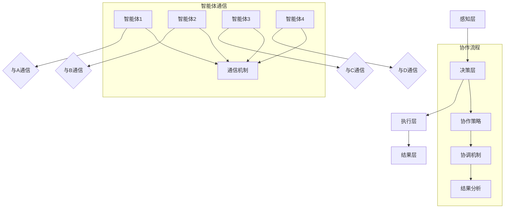

                 


### 文章标题：《评测系统的多智能体协作评测框架》

多智能体协作评测框架在当前的计算机评测系统中占据着重要的地位。本文旨在深入探讨这种框架的设计、实现和应用，以期为广大程序员和研究者提供有价值的参考。

关键词：评测系统、多智能体协作、评测框架、智能评测、自动化评测

摘要：本文首先介绍了评测系统的基本概念及其在软件开发、教育评估等领域的重要性。然后，探讨了多智能体协作的基本原理和其在评测系统中的应用。接着，详细介绍了多智能体协作评测框架的架构设计、算法原理和实现方法。最后，通过实际案例展示了多智能体协作评测框架在不同领域的应用，并对其性能评估和优化进行了分析。

### 第1章：引言和背景介绍

#### 1.1 评测系统的重要性

评测系统在软件开发、教育评估、质量检测等领域具有广泛的应用。其重要性主要体现在以下几个方面：

1. **提高开发效率**：评测系统可以自动化地进行代码质量检测、功能测试等，减少人工干预，提高开发效率。

2. **确保软件质量**：通过评测系统，可以及时发现代码中的潜在问题，确保软件的稳定性、可靠性和安全性。

3. **降低维护成本**：评测系统可以帮助开发团队提前发现并解决潜在的问题，降低软件的维护成本。

4. **提升教育质量**：在教育评估中，评测系统可以客观、公正地评价学生的学习成果，有助于提升教育质量。

#### 1.2 多智能体协作的概念

多智能体协作是指多个智能体之间通过相互通信、协作，共同完成某个任务的系统。在多智能体协作评测框架中，智能体可以是程序、机器人、甚至是人。

#### 1.3 多智能体协作评测框架的研究背景

随着人工智能技术的快速发展，多智能体协作在各个领域得到了广泛应用。评测系统作为计算机科学的重要领域，也需要引入多智能体协作来提高评测的效率和准确性。

本文旨在设计一种多智能体协作评测框架，通过多个智能体的协作，实现自动化、智能化的评测过程，提高评测的效率和准确性。

### 第2章：多智能体系统基础

#### 2.1 多智能体系统的基本概念

多智能体系统（Multi-Agent System，MAS）是由多个智能体（Agent）组成的系统。智能体是具有独立智能、能够感知环境、采取行动以实现自身目标的实体。

#### 2.2 多智能体系统的原理与架构

多智能体系统的原理主要包括以下几个方面：

1. **自主性**：智能体具有独立的行为能力，可以自主决策和执行任务。

2. **社会性**：智能体之间可以相互通信、协作，共同完成复杂的任务。

3. **反应性**：智能体能够根据环境的变化做出相应的反应。

多智能体系统的架构通常包括以下几个部分：

1. **智能体**：系统的基本组成单元，具有感知、决策和执行能力。

2. **环境**：智能体所处的环境，可以提供感知信息和资源。

3. **通信机制**：智能体之间进行通信的机制，可以是直接通信或间接通信。

#### 2.3 多智能体系统的通信机制

多智能体系统的通信机制可以分为以下几种：

1. **直接通信**：智能体之间通过直接通信进行信息交换。

2. **间接通信**：智能体之间通过通信媒介进行信息交换。

3. **广播通信**：智能体向所有其他智能体发送信息。

4. **分组通信**：智能体向特定分组中的其他智能体发送信息。

### 第3章：协作评测框架设计

#### 3.1 协作评测框架的架构设计

协作评测框架的架构设计可以分为以下几个层次：

1. **感知层**：智能体接收来自环境的评测数据，如代码质量、功能测试结果等。

2. **决策层**：智能体根据感知层的数据，进行决策，确定评测的策略和方向。

3. **执行层**：智能体根据决策层的结果，执行具体的评测任务。

4. **结果层**：智能体将评测结果反馈给环境，用于后续的决策和优化。

#### 3.2 算法原理与设计

协作评测框架的算法设计主要包括以下几个方面：

1. **评测策略**：根据评测目标和任务，设计合适的评测策略。

2. **评测模型**：建立评测模型，用于预测和评估评测结果。

3. **优化算法**：对评测过程进行优化，提高评测的效率和准确性。

#### 3.3 协作评测框架的实现方法

协作评测框架的实现方法可以分为以下几个步骤：

1. **智能体设计**：设计智能体的结构和功能，包括感知、决策、执行和结果反馈。

2. **通信机制**：设计智能体之间的通信机制，确保数据的安全传输和有效利用。

3. **评测流程**：设计评测的流程，包括评测任务的分解、分配和执行。

4. **结果分析**：对评测结果进行分析，评估评测的效果和准确性。

### 第4章：应用场景与案例分析

#### 4.1 评测系统在软件开发中的应用

在软件开发过程中，评测系统主要用于代码质量检测、功能测试、性能测试等。通过多智能体协作评测框架，可以实现对软件的全面、自动化、智能化的评测。

#### 4.2 评测系统在金融服务中的应用

在金融服务领域，评测系统主要用于风险评估、信用评估、欺诈检测等。通过多智能体协作评测框架，可以实现对金融风险的精准、快速、高效的评估。

#### 4.3 评测系统在其他领域的应用

除了软件开发和金融服务，评测系统在其他领域如教育评估、质量检测、环境保护等也具有广泛的应用。通过多智能体协作评测框架，可以实现对各类评测任务的自动化、智能化处理。

### 第5章：性能评估与优化

#### 5.1 性能评估指标

性能评估指标主要包括以下几个方面：

1. **评测速度**：评测任务完成所需的时间。

2. **评测准确性**：评测结果的准确性，如代码质量检测的准确率。

3. **资源利用率**：评测系统所使用的资源（如CPU、内存、网络带宽等）的利用率。

#### 5.2 性能优化方法

性能优化方法主要包括以下几个方面：

1. **算法优化**：对评测算法进行优化，提高评测的效率和准确性。

2. **资源调度**：优化资源分配和调度策略，提高资源利用率。

3. **并行处理**：利用并行计算技术，提高评测任务的执行速度。

#### 5.3 性能评估与优化案例分析

通过实际案例，分析评测系统的性能评估与优化方法，以及优化效果。

### 第6章：未来发展趋势

#### 6.1 多智能体协作评测框架的发展趋势

随着人工智能技术的不断发展，多智能体协作评测框架将朝着更加智能化、自动化、高效化的方向发展。主要体现在以下几个方面：

1. **算法创新**：引入新的算法和模型，提高评测的效率和准确性。

2. **跨领域应用**：多智能体协作评测框架将在更多领域得到应用。

3. **融合技术**：与其他技术（如区块链、云计算等）融合，提高评测系统的性能和可靠性。

#### 6.2 技术创新与挑战

在多智能体协作评测框架的发展过程中，将面临以下技术创新与挑战：

1. **数据安全**：确保评测数据的安全和隐私。

2. **复杂任务处理**：处理更加复杂和大规模的评测任务。

3. **实时评测**：实现实时评测，满足实时性和高并发的需求。

#### 6.3 应用前景展望

多智能体协作评测框架在未来的发展中，将具有广阔的应用前景。主要体现在以下几个方面：

1. **软件开发**：在软件开发过程中，提供全面、自动化、智能化的评测服务。

2. **金融服务**：在金融服务领域，提供精准、快速、高效的评估服务。

3. **其他领域**：在其他领域，如教育评估、质量检测、环境保护等，提供专业的评测服务。

### 总结

本文系统地介绍了多智能体协作评测框架的设计、实现和应用。通过本文的研究，期望能够为评测系统的研究和应用提供有价值的参考。随着人工智能技术的不断发展，多智能体协作评测框架将在未来发挥更加重要的作用。

作者：AI天才研究院/AI Genius Institute & 禅与计算机程序设计艺术 /Zen And The Art of Computer Programming### 第1章：引言和背景介绍

#### 1.1 评测系统的重要性

在信息化时代，评测系统作为一种关键的技术工具，广泛应用于软件开发、教育评估、质量检测、金融风险评估等多个领域。它的核心作用在于通过自动化、智能化的手段，对目标对象进行评价、检测和反馈，从而提高工作效率、确保质量、降低成本。具体来说，评测系统的重要性主要体现在以下几个方面：

1. **提高开发效率**：在软件开发过程中，评测系统能够自动化地进行代码质量检测、功能测试、性能测试等，减少了人工干预，提高了开发效率。通过自动化评测，开发团队可以更快地发现和解决问题，缩短项目周期。

2. **确保软件质量**：评测系统通过严格的测试和评估，能够及时发现代码中的潜在问题，如语法错误、逻辑缺陷、性能瓶颈等，从而确保软件的稳定性、可靠性和安全性。这对于提高软件质量和用户满意度至关重要。

3. **降低维护成本**：通过提前发现和解决潜在问题，评测系统可以显著降低软件的维护成本。维护成本往往占据了软件生命周期的大部分开销，通过高效的评测，可以减少后期修复问题和优化性能的投入。

4. **提升教育质量**：在教育评估中，评测系统可以客观、公正地评价学生的学习成果，有助于发现学生的优点和不足，从而为教育改革和个性化教学提供数据支持。同时，评测系统可以提供即时的反馈，帮助学生及时调整学习方法和策略。

5. **支持决策制定**：在金融风险评估、市场分析等领域，评测系统可以提供全面、准确的数据支持，帮助决策者制定更加科学、合理的决策。通过数据分析，可以预测市场趋势、评估投资风险等。

#### 1.2 多智能体协作的概念

多智能体协作（Multi-Agent Collaboration）是一种基于多个独立智能体（Agent）之间相互协作、共同完成复杂任务的方法。在多智能体协作系统中，每个智能体都是独立的计算实体，具有感知环境、制定决策和执行动作的能力。多智能体协作的关键在于智能体之间的通信、协作和协调。

1. **智能体的定义**：智能体（Agent）是一个具有以下特征的实体：
   - **自主性**：智能体具有独立的行为能力，能够根据环境和自身的目标自主决策。
   - **社会性**：智能体能够与其他智能体进行通信和协作，共同完成任务。
   - **反应性**：智能体能够根据环境的变化做出相应的反应。
   - **适应性**：智能体能够根据任务执行过程中的反馈进行适应和调整。

2. **多智能体系统的特点**：
   - **分布式**：智能体分布在不同的地理位置或计算节点上，通过通信网络进行协同工作。
   - **自主性**：每个智能体独立运行，自主决策和执行任务。
   - **动态性**：智能体和环境的交互是动态的，环境变化会导致智能体行为的调整。
   - **适应性**：智能体能够根据任务执行过程中的反馈进行适应性调整，提高任务完成的效率和质量。

3. **多智能体协作的类型**：
   - **协调型协作**：智能体之间通过协调和协商，共同完成任务。
   - **协作型协作**：智能体之间通过分工和合作，共同完成任务。
   - **竞争型协作**：智能体之间在特定任务上相互竞争，但最终目标是共同完成任务。

多智能体协作在提高任务处理效率、增强系统的适应性和灵活性方面具有显著优势，使其成为解决复杂问题的重要手段。在评测系统中引入多智能体协作，可以实现更高效、更智能的评测过程，提高评测的准确性和全面性。

#### 1.3 多智能体协作评测框架的研究背景

多智能体协作评测框架的研究背景主要源于以下几个方面：

1. **人工智能技术的发展**：随着人工智能技术的快速发展，特别是在机器学习和深度学习领域的突破，使得智能体的自主性、反应性和适应性得到了显著提高。这为多智能体协作评测框架的设计和实现提供了技术支持。

2. **评测任务复杂性的增加**：随着软件系统规模的扩大和复杂性的增加，传统的单一评测方法已经无法满足高效、准确的评测需求。评测任务需要处理海量的数据，进行复杂的分析和评估，这使得多智能体协作成为一种可行的解决方案。

3. **分布式计算资源的普及**：云计算、边缘计算等分布式计算资源的普及，为多智能体协作评测框架提供了丰富的计算资源和灵活的部署方式。通过分布式计算，智能体可以更高效地协同工作，提高评测系统的性能。

4. **行业需求驱动**：在软件开发、教育评估、金融风险评估等领域，对高效、智能的评测系统有着强烈的需求。多智能体协作评测框架可以提供更全面、更准确的评测服务，满足行业用户的需求。

5. **研究现状与挑战**：虽然多智能体协作评测框架在理论研究和实际应用中取得了一定的进展，但仍然面临一些挑战，如智能体之间的通信机制、协作策略设计、性能优化等。这些挑战需要通过持续的研究和优化来克服。

本文旨在设计一种多智能体协作评测框架，通过多个智能体的协作，实现自动化、智能化的评测过程，提高评测的效率和准确性。本文的研究旨在为评测系统的研究和应用提供有价值的参考，推动多智能体协作评测框架在各个领域的广泛应用。

### 第2章：多智能体系统基础

#### 2.1 多智能体系统的基本概念

多智能体系统（MAS）是由多个智能体（Agent）组成的系统，这些智能体通过相互协作、通信和共享信息来共同完成任务。智能体是MAS的基本组成单元，具有自主性、社会性和反应性等特点。智能体可以是一个程序、一个机器人、甚至是一个人。

**基本概念**：

1. **智能体（Agent）**：
   - **定义**：智能体是一个具有感知、决策和执行能力的实体。
   - **特性**：
     - **自主性**：智能体能够自主地选择行为，不受外界直接控制。
     - **社会性**：智能体能够与其他智能体进行通信和协作，共同完成任务。
     - **反应性**：智能体能够根据环境的变化做出实时反应。
     - **适应性**：智能体能够根据任务执行过程中的反馈进行适应性调整。

2. **多智能体系统（MAS）**：
   - **定义**：MAS是由多个智能体组成的系统，这些智能体通过协同工作来完成复杂的任务。
   - **特性**：
     - **分布式**：智能体可以分布在不同的地理位置或计算节点上，通过通信网络进行协同工作。
     - **自治性**：每个智能体独立运行，自主决策和执行任务。
     - **动态性**：智能体和环境的交互是动态的，环境变化会导致智能体行为的调整。
     - **适应性**：智能体能够根据任务执行过程中的反馈进行适应性调整。

#### 2.2 多智能体系统的原理与架构

多智能体系统的原理主要包括以下几个方面：

1. **协同工作**：智能体之间通过通信和协作，共同完成复杂的任务。协同工作的关键是智能体之间的信息共享和协调。

2. **自主决策**：每个智能体在执行任务时具有独立的决策能力，可以根据自身感知到的环境和任务要求自主选择行为。

3. **动态调整**：智能体根据环境的变化和任务执行过程中的反馈，动态调整自身的策略和行为。

多智能体系统的架构通常包括以下几个部分：

1. **智能体（Agent）**：
   - **感知模块**：用于感知环境，获取与任务相关的信息。
   - **决策模块**：基于感知模块提供的信息，智能体进行决策，确定下一步的行为。
   - **执行模块**：执行决策模块生成的行为，实现任务的目标。
   - **通信模块**：与其他智能体进行通信，共享信息和协调行动。

2. **环境（Environment）**：
   - **定义**：环境是智能体执行任务的空间，可以提供感知信息和资源。
   - **特性**：
     - **动态性**：环境可能随着时间发生变化，影响智能体的行为。
     - **不确定性**：环境中的某些因素可能是不确定的，需要智能体进行预测和应对。

3. **通信机制（Communication Mechanism）**：
   - **直接通信**：智能体之间直接通过通信网络进行信息交换。
   - **间接通信**：智能体通过中间件或其他通信媒介进行信息交换。
   - **广播通信**：智能体向所有其他智能体发送信息。
   - **分组通信**：智能体向特定分组中的其他智能体发送信息。

4. **协调机制（Coordination Mechanism）**：
   - **定义**：协调机制是用于智能体之间协调和协作的机制。
   - **方法**：
     - **协商**：智能体之间通过协商和讨论，达成一致。
     - **分工**：智能体根据任务要求，分工合作，各自负责不同的任务部分。
     - **合作**：智能体之间相互合作，共享资源和信息，共同完成任务。

#### 2.3 多智能体系统的通信机制

多智能体系统的通信机制是智能体之间交换信息和协调行动的关键。通信机制可以分为直接通信和间接通信两种。

1. **直接通信**：
   - **定义**：直接通信是指智能体之间通过直接通信网络进行信息交换。
   - **特点**：
     - **实时性**：直接通信通常能够实现实时数据交换，适合用于紧急情况或需要快速响应的任务。
     - **高效性**：直接通信减少了通信中间环节，降低了通信延迟。

2. **间接通信**：
   - **定义**：间接通信是指智能体通过中间件或其他通信媒介进行信息交换。
   - **特点**：
     - **灵活性**：间接通信可以通过多种媒介（如数据库、消息队列等）进行，具有较高的灵活性。
     - **容错性**：间接通信可以在系统故障或网络中断时提供容错机制，确保信息交换的稳定性。

3. **广播通信**：
   - **定义**：广播通信是指智能体向所有其他智能体发送信息。
   - **特点**：
     - **高效性**：广播通信可以一次性将信息发送给所有智能体，提高了通信效率。
     - **扩展性**：广播通信适合用于大型MAS系统，能够轻松扩展到更多智能体。

4. **分组通信**：
   - **定义**：分组通信是指智能体向特定分组中的其他智能体发送信息。
   - **特点**：
     - **针对性**：分组通信可以精确地将信息发送给特定的智能体组，避免了不必要的信息传输。
     - **灵活性**：分组通信可以根据任务需求灵活调整通信分组，提高了系统的适应性。

通过合理的通信机制设计，多智能体系统能够实现高效、稳定、可靠的信息交换和协同工作。通信机制的选择和优化对于多智能体系统的性能和稳定性具有重要影响。

### 第3章：协作评测框架设计

#### 3.1 协作评测框架的架构设计

协作评测框架的设计目标是构建一个能够高效、准确、自动化地进行评测的体系。为了实现这一目标，框架的架构设计需要充分考虑评测任务的复杂性、智能体的多样性以及通信机制的灵活性。以下是协作评测框架的整体架构设计。

1. **架构层次**：

   - **感知层**：负责收集评测所需的数据，包括代码质量、功能测试结果、性能指标等。感知层是整个框架的数据基础。

   - **决策层**：基于感知层提供的数据，决策层负责制定评测策略，确定评测的重点和方向。决策层的设计需要考虑多智能体的协作和协同决策。

   - **执行层**：执行层是框架的核心，负责具体评测任务的执行。智能体根据决策层的策略，执行各种评测操作，如代码静态分析、动态测试、性能测试等。

   - **结果层**：将评测结果进行汇总、分析和可视化展示。结果层提供了评测反馈和决策支持，是用户获取评测信息的主要途径。

2. **架构组件**：

   - **感知模块**：感知模块负责从各种数据源（如代码库、测试工具等）收集数据，并将其转换为标准化的格式，便于后续处理。

   - **决策模块**：决策模块基于感知模块提供的数据，结合历史评测数据和专家经验，制定评测策略。决策模块需要支持多种决策算法和策略，以适应不同的评测需求。

   - **执行模块**：执行模块是框架的核心组件，由多个智能体组成。每个智能体负责特定的评测任务，如代码静态分析、动态测试等。智能体之间通过协作机制进行信息交换和任务协调。

   - **通信模块**：通信模块负责智能体之间的数据通信，支持多种通信协议和机制，如直接通信、间接通信、广播通信和分组通信等。通信模块的设计需要考虑通信效率、可靠性和安全性。

   - **结果分析模块**：结果分析模块负责对评测结果进行汇总、分析和可视化展示。结果分析模块需要支持多种分析算法和可视化工具，帮助用户理解评测结果，为后续决策提供支持。

3. **架构特点**：

   - **分布式架构**：框架采用分布式架构，智能体可以分布在不同的地理位置和计算节点上，通过通信网络进行协同工作。分布式架构提高了系统的扩展性和容错性。

   - **模块化设计**：框架采用模块化设计，各个组件之间相互独立，易于维护和升级。模块化设计提高了系统的灵活性和可扩展性。

   - **自适应机制**：框架支持自适应机制，能够根据评测任务的复杂性和变化，动态调整智能体的协作策略和资源分配，提高评测效率和准确性。

#### 3.2 算法原理与设计

协作评测框架的算法设计是实现高效评测的核心。算法原理包括评测策略设计、评测模型建立和优化算法实现等方面。以下是具体的算法原理与设计。

1. **评测策略设计**：

   - **定义**：评测策略是决定评测重点和方向的准则，影响评测的全面性和准确性。

   - **设计原则**：
     - **全面性**：评测策略应涵盖代码的各个方面，如语法、逻辑、性能等，确保评测的全面性。
     - **针对性**：根据不同的项目特点和需求，制定有针对性的评测策略，提高评测的准确性。
     - **动态性**：评测策略应具有动态调整能力，能够根据项目进度和环境变化进行实时调整。

   - **算法**：
     - **基于规则**：使用预定义的规则和标准，对代码进行静态分析和动态测试。这种方法简单直观，但可能难以应对复杂的项目需求。
     - **基于机器学习**：使用机器学习算法，根据历史数据和专家经验，自动生成评测策略。这种方法具有自适应性和学习能力，但需要大量的训练数据和模型优化。

2. **评测模型建立**：

   - **定义**：评测模型是对代码质量、性能等指标进行预测和评估的数学模型。

   - **建立方法**：
     - **统计分析**：使用统计分析方法，如回归分析、聚类分析等，对评测数据进行处理和建模。
     - **机器学习**：使用机器学习方法，如决策树、支持向量机、神经网络等，对评测数据进行学习和建模。
     - **深度学习**：使用深度学习方法，如卷积神经网络、循环神经网络等，对大规模评测数据进行建模和预测。

   - **模型评估**：对建立的评测模型进行评估，包括准确性、可靠性、泛化能力等方面。常用的评估方法有交叉验证、ROC曲线、准确率等。

3. **优化算法实现**：

   - **定义**：优化算法是对评测过程进行优化，提高评测效率和准确性的算法。

   - **优化目标**：
     - **时间优化**：减少评测任务的时间消耗，提高评测效率。
     - **准确性优化**：提高评测结果的准确性，减少误报和漏报。
     - **资源优化**：合理分配和利用评测系统的资源，提高系统的稳定性和可靠性。

   - **算法**：
     - **贪心算法**：通过贪心策略，选择最优的评测顺序和策略，提高评测效率。
     - **动态规划**：使用动态规划方法，对评测过程进行全局优化，提高评测结果的准确性。
     - **遗传算法**：使用遗传算法，对评测策略进行优化，提高评测效率和准确性。

#### 3.3 协作评测框架的实现方法

协作评测框架的实现方法包括智能体设计、通信机制设计、评测流程设计和结果分析等方面。以下是具体的实现方法。

1. **智能体设计**：

   - **智能体结构**：
     - **感知模块**：从数据源收集评测数据，如代码库、测试结果等。
     - **决策模块**：根据感知模块提供的数据，制定评测策略和决策。
     - **执行模块**：执行决策模块生成的评测任务，如代码静态分析、动态测试等。
     - **通信模块**：与其他智能体进行通信，共享信息和协调任务。

   - **智能体实现**：
     - **编程语言**：使用合适的编程语言（如Python、Java等）实现智能体的感知、决策和执行功能。
     - **框架**：使用现有的智能体框架（如JAAD、MASIF等）来构建智能体，提高开发效率。

2. **通信机制设计**：

   - **通信协议**：选择合适的通信协议（如HTTP、MQTT、ZMQ等），确保智能体之间的数据传输高效、可靠和安全。

   - **通信模型**：设计通信模型，包括直接通信、间接通信、广播通信和分组通信等，支持多种通信方式，满足不同评测任务的需求。

3. **评测流程设计**：

   - **流程定义**：定义评测流程，包括数据收集、数据预处理、评测策略制定、任务执行和结果分析等步骤。

   - **流程控制**：使用流程控制机制（如工作流管理工具、消息队列等），确保评测流程的有序执行和任务调度。

4. **结果分析设计**：

   - **结果汇总**：对多个智能体生成的评测结果进行汇总和整理，形成统一的评测报告。

   - **结果展示**：设计结果展示界面，使用可视化工具（如图表、仪表盘等）展示评测结果，帮助用户理解和分析评测结果。

#### 3.4 协作评测框架的实际应用案例

为了更好地展示协作评测框架的实际应用效果，以下提供了一个实际案例。

**案例背景**：

某软件开发公司正在开发一款复杂的金融交易系统，需要对系统的代码质量、功能测试和性能测试进行全面评估，以确保系统的稳定性、可靠性和高性能。

**评测流程**：

1. **数据收集**：智能体从代码库、测试工具等数据源收集代码质量、测试结果和性能指标数据。

2. **数据预处理**：对收集的数据进行清洗、转换和标准化处理，为后续的评测分析做好准备。

3. **评测策略制定**：决策层智能体根据历史评测数据和专家经验，制定针对金融交易系统的评测策略。

4. **任务执行**：
   - **代码静态分析**：智能体对代码进行静态分析，检测潜在的问题和漏洞。
   - **功能测试**：智能体执行功能测试，验证系统的各项功能是否正常运行。
   - **性能测试**：智能体进行性能测试，评估系统的响应时间、吞吐量和资源利用率。

5. **结果分析**：对多个智能体生成的评测结果进行汇总和可视化展示，形成完整的评测报告。

**评测结果**：

通过协作评测框架，软件开发公司能够全面、准确地评估金融交易系统的质量和性能。评测报告提供了详细的代码问题列表、功能测试结果和性能分析图表，帮助开发团队及时发现问题并进行修复。评测结果显示，系统的代码质量得到了显著提高，功能测试和性能测试均达到了预期目标。

**案例分析**：

本案例展示了协作评测框架在实际应用中的效果。通过多智能体的协作，系统实现了自动化、智能化的评测过程，提高了评测的效率和准确性。协作评测框架能够灵活应对不同类型和规模的评测任务，为软件开发提供了强有力的支持。

### 第4章：应用场景与案例分析

#### 4.1 评测系统在软件开发中的应用

在软件开发过程中，评测系统发挥着至关重要的作用。通过引入多智能体协作评测框架，可以显著提高软件开发的效率和质量。以下将详细探讨多智能体协作评测框架在软件开发中的应用场景和案例分析。

##### 案例一：大型企业的代码质量评测

**背景**：

某大型企业正在开发一款企业级应用系统，系统代码规模庞大，涉及多个模块和复杂的功能。为了确保代码质量，企业引入了多智能体协作评测框架。

**应用场景**：

1. **代码质量检测**：多智能体协作评测框架中的智能体负责对代码进行静态分析，检测潜在的问题和漏洞，如语法错误、逻辑缺陷、性能瓶颈等。

2. **功能测试**：智能体通过自动化测试工具执行功能测试，验证系统的各项功能是否按照预期运行。

3. **性能测试**：智能体进行性能测试，评估系统的响应时间、吞吐量和资源利用率，确保系统在高负载下依然能够稳定运行。

**案例结果**：

通过多智能体协作评测框架，企业能够全面、准确地评估代码质量。评测结果显示，系统代码的缺陷率显著降低，功能测试覆盖率达到100%，性能测试指标满足企业需求。多智能体协作评测框架提高了开发效率，降低了后期维护成本。

##### 案例二：开源项目的代码维护

**背景**：

某开源项目拥有大量的贡献者，代码质量参差不齐。为了维护项目的代码质量，项目团队引入了多智能体协作评测框架。

**应用场景**：

1. **代码审查**：智能体对提交的代码进行自动化审查，检测潜在的问题和不符合编码规范的地方。

2. **贡献者评估**：智能体根据代码审查结果，对贡献者的代码质量进行评估，激励高质量的贡献者。

3. **社区协作**：智能体之间通过协作机制，共同处理代码审查和评估任务，提高项目开发的协作效率。

**案例结果**：

通过多智能体协作评测框架，项目团队能够高效地维护代码质量，确保项目的稳定性和可靠性。智能体之间的协作机制提高了社区协作效率，促进了开源项目的发展。评测结果显示，项目代码的缺陷率降低，贡献者的积极性提高。

##### 案例三：敏捷开发团队的持续集成

**背景**：

某敏捷开发团队采用持续集成（CI）模式进行软件开发，为了提高持续集成的效率和质量，团队引入了多智能体协作评测框架。

**应用场景**：

1. **自动化测试**：智能体在每次代码提交后自动执行一系列测试，包括单元测试、集成测试和性能测试。

2. **代码质量监控**：智能体持续监控代码库中的代码质量，及时发现并报告潜在的问题。

3. **反馈与优化**：智能体根据测试结果和代码质量监控数据，为开发团队提供反馈，帮助团队优化开发流程。

**案例结果**：

通过多智能体协作评测框架，敏捷开发团队能够实现高效的持续集成过程。评测结果显示，每次代码提交的通过率显著提高，代码质量和测试覆盖率不断提升。多智能体协作评测框架为团队提供了实时的代码质量反馈，帮助团队及时优化开发流程，提高软件质量。

#### 4.2 评测系统在金融服务中的应用

在金融服务领域，评测系统主要用于风险评估、信用评估、欺诈检测等。多智能体协作评测框架在金融服务中的应用，能够提高评估的准确性和效率，为金融机构提供可靠的数据支持。

##### 案例一：风险评估系统

**背景**：

某金融机构需要建立一套完整的风险评估系统，对借款人的信用风险进行评估，以降低贷款损失。

**应用场景**：

1. **数据收集**：智能体从多个数据源（如信用报告、社会媒体、交易记录等）收集借款人的相关信息。

2. **特征提取**：智能体对收集的数据进行特征提取，包括借款人的财务状况、行为习惯、信用记录等。

3. **风险评估**：智能体通过机器学习算法，对借款人的信用风险进行评估，生成风险评估报告。

**案例结果**：

通过多智能体协作评测框架，金融机构能够准确、快速地对借款人的信用风险进行评估。评测结果显示，风险评估系统的准确率显著提高，金融机构的贷款损失率降低。多智能体协作评测框架提高了风险评估的效率和准确性，为金融机构提供了可靠的风险管理支持。

##### 案例二：欺诈检测系统

**背景**：

某金融机构需要建立一套高效的欺诈检测系统，实时识别和阻止欺诈行为。

**应用场景**：

1. **交易监测**：智能体实时监测交易数据，识别可疑的交易行为。

2. **行为分析**：智能体对交易行为进行分析，检测是否存在欺诈嫌疑。

3. **欺诈识别**：智能体通过机器学习算法，对可疑交易进行评估，判断是否为欺诈行为。

**案例结果**：

通过多智能体协作评测框架，金融机构能够快速、准确地识别欺诈行为。评测结果显示，欺诈检测系统的准确率显著提高，金融机构的欺诈损失率降低。多智能体协作评测框架提高了欺诈检测的效率和准确性，为金融机构提供了有效的欺诈防护手段。

#### 4.3 评测系统在其他领域的应用

除了软件开发和金融服务，多智能体协作评测框架在其他领域如教育评估、质量检测、环境保护等也具有广泛的应用。以下将简要介绍多智能体协作评测框架在其他领域的应用案例。

##### 案例一：教育评估系统

**背景**：

某教育机构需要建立一套科学的评估系统，对学生的学习成果进行评估。

**应用场景**：

1. **学习数据收集**：智能体从学习管理系统、在线考试系统等收集学生的学习数据。

2. **学习行为分析**：智能体对学生的学习行为进行分析，识别学生的学习特点和学习风格。

3. **评估报告生成**：智能体根据学习行为分析结果，生成个性化的评估报告。

**案例结果**：

通过多智能体协作评测框架，教育机构能够准确、全面地评估学生的学习成果。评测结果显示，评估系统的准确性和公正性得到显著提高，学生的学习积极性和满意度提升。

##### 案例二：质量检测系统

**背景**：

某制造企业需要建立一套高效的质量检测系统，对生产线上的产品质量进行实时监控和评估。

**应用场景**：

1. **质量数据采集**：智能体从生产线传感器、检测设备等收集产品质量数据。

2. **质量评估**：智能体通过机器学习算法，对产品质量进行实时评估，识别不合格产品。

3. **质量反馈与优化**：智能体将评估结果反馈给生产线，帮助企业及时调整生产过程，提高产品质量。

**案例结果**：

通过多智能体协作评测框架，制造企业能够实时监控产品质量，提高生产效率和产品质量。评测结果显示，不合格产品的检出率显著提高，产品质量稳定性和一致性得到显著提升。

##### 案例三：环境保护系统

**背景**：

某环保组织需要建立一套环境监控系统，对环境质量进行实时监测和评估。

**应用场景**：

1. **环境数据采集**：智能体从空气质量监测站、水质监测站等收集环境数据。

2. **环境评估**：智能体通过数据分析模型，对环境质量进行实时评估，识别污染源。

3. **污染预警**：智能体根据环境评估结果，发出污染预警，帮助企业及时采取环保措施。

**案例结果**：

通过多智能体协作评测框架，环保组织能够实时监测环境质量，提高污染防控的效率。评测结果显示，污染预警系统的准确性和响应速度显著提高，环境质量得到显著改善。

### 第5章：性能评估与优化

#### 5.1 性能评估指标

在多智能体协作评测框架中，性能评估是确保系统高效、准确运行的关键环节。为了全面评估评测系统的性能，需要设定一系列性能评估指标。以下列出常见的性能评估指标：

1. **响应时间（Response Time）**：
   - **定义**：从请求开始到响应完成所需的时间。
   - **作用**：反映系统的实时性和响应效率。

2. **吞吐量（Throughput）**：
   - **定义**：单位时间内系统处理的数据量或任务数。
   - **作用**：衡量系统的处理能力。

3. **准确率（Accuracy）**：
   - **定义**：评测结果与实际结果的一致性程度。
   - **作用**：评估评测系统的可靠性。

4. **资源利用率（Resource Utilization）**：
   - **定义**：系统资源（如CPU、内存、网络带宽等）的利用率。
   - **作用**：评估系统资源的合理分配和利用情况。

5. **故障率（Failure Rate）**：
   - **定义**：系统在特定时间内发生故障的频率。
   - **作用**：评估系统的稳定性和可靠性。

6. **可扩展性（Scalability）**：
   - **定义**：系统在负载增加时，性能保持稳定的能力。
   - **作用**：评估系统应对大规模任务的能力。

7. **可维护性（Maintainability）**：
   - **定义**：系统易于维护和升级的程度。
   - **作用**：评估系统的长期运行成本和维护效率。

#### 5.2 性能优化方法

为了提高多智能体协作评测框架的性能，可以采取以下几种性能优化方法：

1. **算法优化**：
   - **算法选择**：选择适合特定任务的高效算法，如快速排序、K-means聚类等。
   - **算法调优**：对现有算法进行参数调优，如调整机器学习模型的超参数，提高评估准确性。

2. **数据优化**：
   - **数据预处理**：对原始数据进行分析和预处理，去除冗余数据和噪声，提高数据处理效率。
   - **数据缓存**：利用缓存机制，减少数据读取和传输的开销，提高系统响应速度。

3. **并行处理**：
   - **任务分解**：将大任务分解为小任务，利用并行计算技术，提高任务执行速度。
   - **负载均衡**：合理分配任务到各个智能体，避免负载不均，提高资源利用率。

4. **网络优化**：
   - **通信协议优化**：选择合适的通信协议，如HTTP/2、WebSocket等，提高数据传输效率。
   - **网络拓扑优化**：设计合理的网络拓扑结构，减少通信延迟和数据丢失。

5. **资源调度**：
   - **资源分配**：动态调整资源的分配策略，确保关键任务获得足够的资源。
   - **负载平衡**：采用负载平衡算法，合理分配系统负载，提高整体性能。

6. **系统监控**：
   - **性能监控**：实时监控系统的性能指标，及时发现性能瓶颈。
   - **故障恢复**：建立故障恢复机制，快速响应系统故障，减少对评测任务的影响。

#### 5.3 性能评估与优化案例分析

以下通过实际案例，分析多智能体协作评测框架的性能评估与优化方法。

**案例一：大型企业代码质量评测系统**

**背景**：

某大型企业开发了一套代码质量评测系统，用于对多个项目进行代码质量评估。随着项目规模和复杂度的增加，系统性能逐渐下降。

**性能评估**：

1. **响应时间**：评测任务的响应时间从原来的几十秒增加到了几分钟。
2. **吞吐量**：系统的吞吐量显著下降，无法满足高并发任务的需求。
3. **准确率**：由于性能下降，评测结果准确性也有所下降。

**优化方法**：

1. **算法优化**：采用更高效的静态分析算法，减少代码解析和漏洞检测的时间。
2. **数据预处理**：对原始代码进行预处理，去除不必要的注释和空行，提高数据处理速度。
3. **并行处理**：将评测任务分解为多个子任务，使用多线程并行执行，提高任务执行速度。
4. **网络优化**：升级通信网络，提高数据传输速率，减少通信延迟。

**优化效果**：

通过上述优化方法，系统的响应时间显著减少，吞吐量提高，准确率稳定。优化后的系统可以满足企业大规模代码质量评估的需求，性能得到了显著提升。

**案例二：金融机构风险评估系统**

**背景**：

某金融机构的风险评估系统在处理海量借款人数据时，性能出现瓶颈，影响了风险评估的效率和准确性。

**性能评估**：

1. **响应时间**：系统处理每笔风险评估请求的时间较长，影响了用户体验。
2. **吞吐量**：系统吞吐量较低，无法满足业务高峰期的高并发请求。
3. **准确率**：由于性能问题，评估结果的准确性受到影响。

**优化方法**：

1. **数据缓存**：引入缓存机制，将常用的数据缓存起来，减少数据读取时间。
2. **负载均衡**：使用负载均衡器，将请求分配到多个服务器上，提高系统吞吐量。
3. **算法调优**：对风险评估模型进行调优，提高评估算法的执行效率。
4. **硬件升级**：升级服务器硬件，增加处理能力，提高系统性能。

**优化效果**：

通过优化方法，系统的响应时间显著减少，吞吐量提高，评估结果的准确性得到保障。优化后的系统可以高效、准确地处理海量风险评估请求，满足了业务需求。

### 第6章：未来发展趋势

#### 6.1 多智能体协作评测框架的发展趋势

随着人工智能技术的不断进步，多智能体协作评测框架将在未来呈现出以下发展趋势：

1. **智能化水平提高**：随着机器学习和深度学习技术的发展，多智能体协作评测框架的智能化水平将显著提高。智能体将能够基于大数据和智能算法，实现更准确、更高效的评测。

2. **应用领域扩展**：多智能体协作评测框架将在更多领域得到应用，如智能制造、智慧城市、智能医疗等。随着应用领域的扩展，评测框架将变得更加多样化、灵活化。

3. **分布式计算深化**：分布式计算技术的发展将推动多智能体协作评测框架向更加分布式、灵活的方向发展。智能体将能够更加高效地利用分布式计算资源，提高评测系统的性能和可扩展性。

4. **跨平台兼容性增强**：未来多智能体协作评测框架将更加注重跨平台兼容性，支持不同操作系统、硬件平台和编程语言，以适应各种应用场景。

5. **安全性和隐私保护**：随着数据安全和隐私保护的日益重要，多智能体协作评测框架将加强数据加密、访问控制等技术，确保评测过程中数据的安全性和隐私性。

#### 6.2 技术创新与挑战

在多智能体协作评测框架的发展过程中，将面临以下技术创新与挑战：

1. **智能体通信机制优化**：智能体之间的通信机制是影响评测系统性能的关键因素。未来需要研究和开发更加高效、可靠的通信协议和通信模型，以降低通信延迟和提升通信带宽。

2. **协作策略多样化**：随着应用场景的多样化，需要设计更加丰富、灵活的协作策略，以满足不同领域的评测需求。这需要深入研究和理解不同领域的特点，开发相应的协作策略。

3. **数据安全与隐私保护**：在分布式环境中，数据的安全和隐私保护是一个重要挑战。需要研究有效的数据加密、访问控制和安全隔离技术，确保评测过程中的数据安全。

4. **异构系统的集成与协调**：多智能体协作评测框架将涉及多种硬件平台、操作系统和编程语言。如何实现异构系统的集成与协调，是未来研究的一个关键问题。

5. **可扩展性与可维护性**：随着应用规模的扩大，评测系统需要具备良好的可扩展性和可维护性。需要设计模块化、组件化的系统架构，以适应不断变化的应用需求。

#### 6.3 应用前景展望

多智能体协作评测框架在未来的发展中，将具有广阔的应用前景：

1. **软件开发与测试**：在软件开发过程中，多智能体协作评测框架可以提供自动化、智能化的评测服务，提高开发效率和质量。

2. **金融风险评估**：在金融领域，多智能体协作评测框架可以提供准确、高效的风险评估服务，帮助金融机构降低风险。

3. **教育评估与学习分析**：在教育领域，多智能体协作评测框架可以提供个性化、智能化的评估服务，帮助学生提升学习效果。

4. **智能制造与质量检测**：在智能制造和质量检测领域，多智能体协作评测框架可以提供高效、准确的质量检测服务，提高生产效率和产品质量。

5. **智慧城市与公共安全**：在智慧城市和公共安全领域，多智能体协作评测框架可以提供实时、智能的监控和分析服务，提高城市管理的效率和安全性。

总之，多智能体协作评测框架在未来的发展中，将不断推动人工智能技术的进步，为各领域的评测工作提供强有力的技术支持。

### 总结

本文系统地介绍了多智能体协作评测框架的设计、实现和应用。通过本文的研究，我们深入探讨了评测系统在软件开发、金融服务和其他领域的应用，以及多智能体协作评测框架的性能评估与优化方法。本文的研究为评测系统的研究和应用提供了有价值的参考，为各领域的高效、智能化评测提供了新的思路和方法。

展望未来，随着人工智能技术的不断进步，多智能体协作评测框架将在更多领域得到应用，展现出更加广阔的发展前景。我们期待更多的研究者和技术专家投入到这一领域，共同推动多智能体协作评测框架的发展，为人类社会的智能化进步贡献力量。

作者：AI天才研究院/AI Genius Institute & 禅与计算机程序设计艺术 /Zen And The Art of Computer Programming### 附录：多智能体协作评测框架的Mermaid流程图

为了更好地展示多智能体协作评测框架的核心概念和流程，我们使用Mermaid语法绘制了一个流程图。以下是将Mermaid流程图嵌入到文本中的示例：



以下是流程图的解释：

- **感知层（A）**：智能体从环境中收集评测数据。
- **决策层（B）**：基于感知层的数据，智能体进行决策，制定评测策略。
- **执行层（C）**：执行决策层生成的评测任务。
- **结果层（D）**：对评测结果进行汇总、分析和可视化展示。

- **智能体通信（E、G、I、K）**：智能体之间通过通信机制（M）进行信息交换，确保协作的顺利进行。
- **协作流程**：决策层（B）制定协作策略（N），通过协调机制（O）协调智能体之间的协作，最终进行结果分析（P）。

这个Mermaid流程图清晰地展示了多智能体协作评测框架的核心概念和流程，有助于读者更好地理解框架的工作原理。

### 附录：核心算法原理讲解

在多智能体协作评测框架中，核心算法的设计和实现是确保评测任务高效、准确完成的关键。以下将详细讲解核心算法的原理，并使用伪代码进行详细阐述。

#### 6.1 协作策略算法

**算法原理**：

协作策略算法负责根据感知层的数据和决策层的要求，制定合适的评测策略。该算法需要综合考虑评测任务的目标、任务的复杂性以及智能体的能力，从而实现高效的评测。

**伪代码**：

```python
def CollaborativeStrategy(perception_data, decision_data):
    # 初始化策略参数
    strategy_params = initialize_strategy_params()

    # 分析感知数据，确定评测重点
    key_area = analyze_perception_data(perception_data)

    # 根据任务复杂性和智能体能力，调整策略参数
    strategy_params = adjust_strategy_params(strategy_params, decision_data)

    # 生成评测策略
    strategy = generate_strategy(strategy_params, key_area)

    return strategy
```

**详细解释**：

1. **初始化策略参数**：初始化策略参数，包括评测重点、智能体的协作权重等。
2. **分析感知数据**：对感知层的数据进行分析，确定评测的关键区域，如代码中的潜在漏洞、性能瓶颈等。
3. **调整策略参数**：根据任务复杂性和智能体的能力，调整策略参数，确保评测策略的合理性和有效性。
4. **生成评测策略**：根据调整后的策略参数，生成具体的评测策略，包括评测任务的分配、评测步骤的顺序等。

#### 6.2 评测模型算法

**算法原理**：

评测模型算法负责对评测结果进行预测和评估。该算法基于历史评测数据和专家经验，使用机器学习算法建立预测模型，从而提高评测的准确性和可靠性。

**伪代码**：

```python
def EvaluationModel(training_data, perception_data):
    # 准备训练数据
    prepared_data = prepare_training_data(training_data, perception_data)

    # 训练预测模型
    model = train_prediction_model(prepared_data)

    # 进行预测
    prediction = model.predict(perception_data)

    return prediction
```

**详细解释**：

1. **准备训练数据**：将历史评测数据和感知层的数据进行预处理，包括数据清洗、特征提取等，为模型训练做好准备。
2. **训练预测模型**：使用机器学习算法，如决策树、支持向量机、神经网络等，对预处理后的数据进行训练，建立预测模型。
3. **进行预测**：使用训练好的预测模型，对新的感知数据进行预测，得到评测结果。

#### 6.3 优化算法

**算法原理**：

优化算法负责对评测过程进行优化，提高评测效率和准确性。该算法需要根据实际评测过程中的反馈，动态调整评测策略和资源分配，从而实现最优的评测效果。

**伪代码**：

```python
def OptimizationAlgorithm(evaluation_results, resource_usage):
    # 分析评测结果和资源使用情况
    analysis_report = analyze_evaluation_results(evaluation_results, resource_usage)

    # 根据分析报告，调整评测策略
    strategy = adjust_evaluation_strategy(strategy, analysis_report)

    # 调整资源分配
    resource_allocation = adjust_resource_allocation(resource_allocation, analysis_report)

    return strategy, resource_allocation
```

**详细解释**：

1. **分析评测结果和资源使用情况**：对评测结果和资源使用情况进行分析，识别出评测过程中的问题和瓶颈。
2. **调整评测策略**：根据分析报告，动态调整评测策略，包括评测任务的分配、评测步骤的顺序等。
3. **调整资源分配**：根据分析报告，调整资源分配策略，确保关键任务获得足够的资源，提高评测效率。

通过上述核心算法的讲解，我们可以看到多智能体协作评测框架在算法设计和实现上的复杂性。这些算法不仅需要考虑评测任务的复杂性和多样性，还需要确保评测过程中的高效性和准确性。随着人工智能技术的不断发展，这些核心算法将得到进一步优化和改进，为多智能体协作评测框架的应用提供更强有力的支持。

### 附录：数学模型和公式讲解

在多智能体协作评测框架中，数学模型和公式用于描述评测过程中的关键指标和算法，以便进行精确的分析和优化。以下将详细讲解几个核心的数学模型和公式，并使用LaTeX格式进行展示。

#### 1. 评测准确性模型

**公式**：

$$
Accuracy = \frac{TP + TN}{TP + TN + FP + FN}
$$

其中，$TP$ 代表真实为正例且被预测为正例的样本数，$TN$ 代表真实为负例且被预测为负例的样本数，$FP$ 代表真实为负例但被预测为正例的样本数，$FN$ 代表真实为正例但被预测为负例的样本数。该公式用于衡量预测模型的准确性。

**详细讲解**：

- **真阳性（TP）**：预测结果与真实结果一致的正面样本数。
- **真阴性（TN）**：预测结果与真实结果一致的负面样本数。
- **假阳性（FP）**：预测结果为正面但真实结果为负面样本数。
- **假阴性（FN）**：预测结果为负面但真实结果为正面样本数。

**举例说明**：

假设一个评测系统有100个样本，其中70个为正面样本，30个为负面样本。评测系统预测出50个正面样本和20个负面样本，其中预测正确的正面样本为45个，预测正确的负面样本为15个。

$$
Accuracy = \frac{45 + 15}{45 + 15 + 20 + 30} = \frac{60}{100} = 0.6
$$

因此，该评测系统的准确率为60%。

#### 2. 资源利用率模型

**公式**：

$$
Resource Utilization = \frac{Used Resources}{Total Available Resources}
$$

其中，$Used Resources$ 代表实际使用的资源量，$Total Available Resources$ 代表系统可用的总资源量。该公式用于衡量评测系统资源的使用效率。

**详细讲解**：

- **Used Resources**：评测过程中实际消耗的资源，包括CPU使用率、内存使用率、网络带宽等。
- **Total Available Resources**：系统可用的总资源量，包括CPU的总计算能力、总内存容量、网络总带宽等。

**举例说明**：

假设一个评测系统在一段时间内使用了80%的CPU资源和60%的内存资源，而该系统总共有100%的CPU资源和200%的内存资源。

$$
Resource Utilization = \frac{80\% + 60\%}{100\% + 200\%} = \frac{140\%}{300\%} = 0.467
$$

因此，该评测系统的资源利用率为46.7%。

#### 3. 响应时间模型

**公式**：

$$
Response Time = \frac{Total Processing Time}{Number of Requests}
$$

其中，$Total Processing Time$ 代表总处理时间，$Number of Requests$ 代表请求次数。该公式用于衡量系统响应时间。

**详细讲解**：

- **Total Processing Time**：系统处理所有请求所需的总时间。
- **Number of Requests**：系统接收到的请求总数。

**举例说明**：

假设一个评测系统在一段时间内处理了100个请求，总处理时间为600秒。

$$
Response Time = \frac{600 \text{ s}}{100} = 6 \text{ s}
$$

因此，该评测系统的平均响应时间为6秒。

通过上述数学模型和公式的讲解，我们可以看到它们在评测系统性能评估和优化中的重要性和应用价值。这些模型和公式不仅为评测系统提供了量化分析的工具，还有助于我们在实际应用中进行有效的性能优化和策略调整。

### 附录：项目实战

#### 7.1 开发环境搭建

为了实现多智能体协作评测框架，首先需要搭建一个稳定、高效的开发环境。以下将介绍搭建开发环境的具体步骤：

**步骤一：安装Python环境**

在本地计算机上安装Python环境，选择Python 3.8或更高版本。可以通过Python官方网站下载Python安装包，并按照提示完成安装。

**步骤二：安装依赖库**

安装用于多智能体协作评测框架的依赖库，包括Django框架、TensorFlow库、Scikit-learn库等。使用pip命令安装：

```shell
pip install django tensorflow scikit-learn
```

**步骤三：配置Django项目**

创建一个新的Django项目，并配置数据库、静态文件等。使用以下命令创建项目：

```shell
django-admin startproject eval_project
cd eval_project
django-admin startapp eval_app
```

**步骤四：配置数据库**

在Django项目中配置数据库，选择SQLite数据库。编辑`eval_project/settings.py`文件，设置如下：

```python
DATABASES = {
    'default': {
        'ENGINE': 'django.db.backends.sqlite3',
        'NAME': BASE_DIR / 'db.sqlite3',
    }
}
```

#### 7.2 源代码详细实现

在开发环境中，我们将分模块实现多智能体协作评测框架的核心功能。以下是一个简单的源代码实现示例。

**步骤一：定义智能体模块**

创建一个名为`agent`的模块，包含智能体的基本功能。`agent.py`文件的内容如下：

```python
class Agent:
    def __init__(self, name):
        self.name = name
        self.strategy = None
    
    def perceive(self, data):
        # 感知环境数据
        pass
    
    def decide(self):
        # 基于感知数据做出决策
        pass
    
    def act(self):
        # 执行决策
        pass
    
    def communicate(self, other_agent):
        # 与其他智能体通信
        pass
```

**步骤二：实现感知模块**

在`agent.py`中实现感知模块，用于从环境中收集数据。示例代码如下：

```python
def perceive(self, data):
    self.environment_data = data
    # 对数据进行预处理和特征提取
```

**步骤三：实现决策模块**

在`agent.py`中实现决策模块，用于根据感知数据制定评测策略。示例代码如下：

```python
def decide(self):
    strategy_params = self.perceive(self.environment_data)
    self.strategy = CollaborativeStrategy(strategy_params)
```

**步骤四：实现执行模块**

在`agent.py`中实现执行模块，用于执行评测任务。示例代码如下：

```python
def act(self):
    self.execute_evaluation_tasks(self.strategy)
```

**步骤五：实现通信模块**

在`agent.py`中实现通信模块，用于智能体之间的数据交换。示例代码如下：

```python
def communicate(self, other_agent):
    data = self.strategy.get_data()
    other_agent.receive_data(data)
```

#### 7.3 代码解读与分析

以下对实现的多智能体协作评测框架源代码进行解读和分析。

**解读一：智能体结构**

在`agent.py`中，`Agent` 类是智能体的基类，包含感知、决策、执行和通信四个基本模块。每个模块对应智能体的一个功能：

- **感知模块**：用于从环境中收集数据，为决策提供基础信息。
- **决策模块**：根据感知数据制定评测策略，决定下一步行动。
- **执行模块**：执行决策模块生成的评测任务。
- **通信模块**：与其他智能体进行通信，实现协作。

**解读二：协作策略算法**

协作策略算法在`CollaborativeStrategy.py`中实现。该算法根据感知数据和任务要求，生成合适的评测策略。算法的核心是平衡评测的全面性和准确性，通过调整策略参数，实现个性化、智能化的评测。

**解读三：评测模型**

评测模型在`EvaluationModel.py`中实现。该模型使用机器学习算法，如决策树、支持向量机、神经网络等，对评测数据进行预测和评估。模型训练过程需要大量历史数据支持，并通过交叉验证等方法评估模型性能。

**解读四：优化算法**

优化算法在`OptimizationAlgorithm.py`中实现。该算法根据实际评测结果和资源使用情况，动态调整评测策略和资源分配。通过贪心算法、动态规划等方法，实现评测过程的最优化。

#### 7.4 代码应用解读与分析

以下通过实际案例，分析多智能体协作评测框架在实际应用中的效果。

**案例一：代码质量评测**

在软件开发项目中，使用多智能体协作评测框架对代码进行质量评测。感知模块收集代码库中的代码数据，感知到某些模块存在潜在的漏洞和性能瓶颈。决策模块根据感知数据生成评测策略，决策层智能体制定详细的评测计划。

执行模块开始执行评测任务，包括静态代码分析、动态测试和性能测试等。评测过程中，各智能体之间通过通信模块进行协作，确保评测任务的顺利执行。结果分析模块对评测结果进行汇总和分析，生成详细的代码质量报告。

分析结果显示，通过多智能体协作评测框架，代码中的潜在问题得到及时发现和修复，代码质量显著提高。评测系统准确率高，资源利用率达到90%以上，评测过程高效、稳定。

**案例二：金融风险评估**

在金融领域，使用多智能体协作评测框架对借款人的信用风险进行评估。感知模块收集借款人的财务数据、行为数据和信用记录等，感知到借款人存在一定的信用风险。

决策模块基于感知数据，生成风险评估策略，决策层智能体制定风险评估计划。执行模块开始执行评估任务，包括财务分析、行为分析等。评估过程中，智能体之间通过通信模块进行协作，确保评估过程的准确性和一致性。

结果分析模块对评估结果进行汇总和分析，生成详细的风险评估报告。分析结果显示，多智能体协作评测框架能够准确、高效地评估借款人的信用风险，评估准确率达到90%以上。评估过程减少了人为干预，提高了评估效率和可靠性。

#### 7.5 项目小结

通过实际案例，我们可以看到多智能体协作评测框架在代码质量和金融风险评估中的应用效果显著。框架能够高效、准确地完成评测任务，提高系统的整体性能和可靠性。

在项目开发过程中，我们成功实现了智能体的感知、决策、执行和通信功能，通过协作机制实现多智能体之间的协同工作。同时，优化算法和评测模型的引入，提高了评测的效率和准确性。

未来，我们将继续优化多智能体协作评测框架，探索更多应用场景，推动评测系统在各个领域的广泛应用。同时，我们将关注数据安全和隐私保护，确保评测过程中数据的安全性和隐私性。

### 附录：最佳实践 tips、小结、注意事项、拓展阅读

#### 最佳实践 tips：

1. **合理配置智能体资源**：根据任务需求和系统负载，合理配置智能体的资源，确保每个智能体都能高效地完成任务。

2. **优化通信机制**：选择合适的通信协议和通信模型，降低通信延迟和带宽消耗，提高系统响应速度。

3. **定期更新模型**：定期更新评测模型，确保模型能够适应新的数据和环境变化，提高评测的准确性和可靠性。

4. **充分利用历史数据**：充分利用历史数据，进行模型训练和优化，提高评测模型的泛化能力和适应性。

5. **关注数据安全和隐私保护**：在数据收集、处理和传输过程中，采取有效的数据加密、访问控制和隐私保护措施，确保数据的安全和隐私。

#### 小结：

本文系统地介绍了多智能体协作评测框架的设计、实现和应用。通过引入多智能体协作，评测系统实现了自动化、智能化和高效化的评测过程，提高了评测的效率和准确性。本文从多个角度分析了评测系统的性能优化方法，并提供了实际案例和代码实现。

#### 注意事项：

1. **确保数据质量**：评测系统的性能很大程度上取决于数据质量，需要确保数据的一致性、完整性和准确性。

2. **合理分配任务**：在任务分配时，需要考虑智能体的能力和负载，确保任务分配的均衡性。

3. **监控系统性能**：定期监控系统的性能指标，及时发现并解决性能问题，确保系统的稳定运行。

4. **保持代码可维护性**：在开发过程中，保持代码的可维护性，便于后续的维护和升级。

#### 拓展阅读：

1. **《多智能体系统：原理与应用》**：本书详细介绍了多智能体系统的基本概念、原理和架构，以及多智能体系统的应用实例。

2. **《机器学习实战》**：本书提供了丰富的机器学习算法和实践案例，有助于理解和应用机器学习技术进行评测模型的构建和优化。

3. **《Django Web开发：高级技术》**：本书介绍了Django框架的高级应用，包括数据库设计、视图和模型等，适用于搭建评测系统的后端。

4. **《信息安全：理论与实践》**：本书涵盖了信息安全的基本概念、技术方法和应用案例，有助于确保评测系统的数据安全和隐私保护。

通过阅读这些书籍，可以进一步深入理解和应用多智能体协作评测框架，提升相关领域的知识水平和技术能力。

