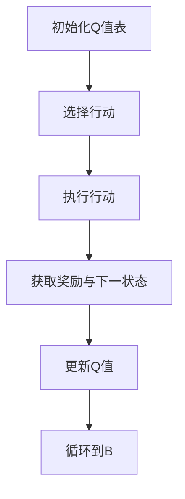
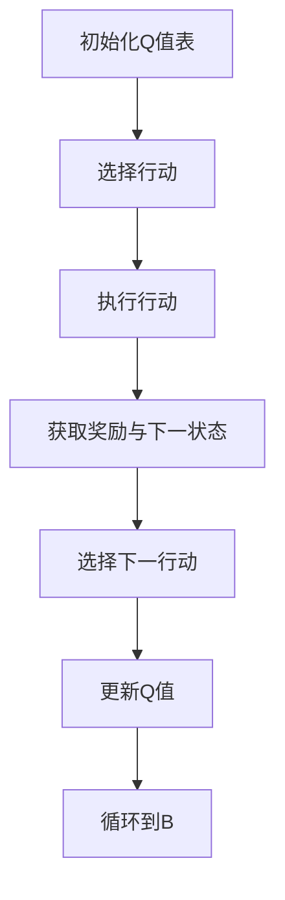
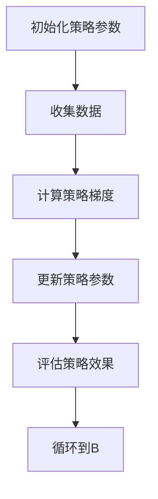
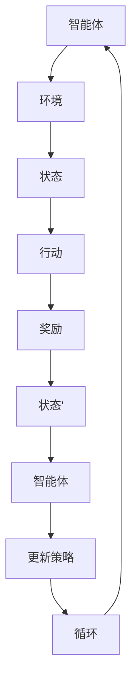

                 

### 文章标题：评测系统的多智能体强化学习框架

**关键词：** 多智能体强化学习、评测系统、Q-learning、SARSA、策略梯度方法、算法优化、应用实例、智能交通、智能制造、智能电网

**摘要：** 本文旨在探讨多智能体强化学习在评测系统中的应用，详细介绍多智能体强化学习的基础理论、核心算法及其优化策略。文章首先回顾了强化学习与多智能体系统的基本概念，随后深入分析了多智能体强化学习在路径规划、机器人协作和资源分配等领域的应用实例。在此基础上，文章提出了构建评测系统的设计与实现方法，并借助实际案例分析，探讨了多智能体强化学习在评测系统中的具体应用。最后，文章总结了多智能体强化学习框架的特点与未来发展趋势，为评测系统的优化与创新提供了理论支持和实践指导。

### 目录

1. 第一部分：引言
   1.1. 多智能体强化学习的背景与意义
   1.2. 强化学习基础
   1.3. 多智能体系统的基本理论

2. 第二部分：多智能体强化学习算法
   2.1. 多智能体强化学习的核心算法
   2.2. 多智能体强化学习算法的优化
   2.3. 多智能体强化学习算法的应用实例

3. 第三部分：评测系统的构建
   3.1. 评测系统的设计与实现
   3.2. 多智能体强化学习在评测系统中的应用
   3.3. 实际评测系统的案例分析

4. 第四部分：总结与展望
   4.1. 多智能体强化学习框架的总结
   4.2. 评测系统的发展趋势

5. 附录
   5.1. 多智能体强化学习算法流程图
   5.2. 相关数学公式与伪代码
   5.3. 实战案例代码解读

### 1.1 多智能体强化学习的背景与意义

**强化学习与多智能体系统**

强化学习（Reinforcement Learning，RL）是机器学习的一个重要分支，旨在通过奖励机制来指导智能体（agent）在复杂环境中采取最优行动，从而实现任务目标。与传统监督学习和无监督学习不同，强化学习强调智能体在与环境的交互过程中不断学习和改进策略。多智能体强化学习（Multi-Agent Reinforcement Learning，MARL）则是在强化学习的基础上，进一步考虑多个智能体之间的相互作用和协作。这种交互性使得多智能体强化学习在解决复杂问题时具有独特的优势。

多智能体系统（Multi-Agent Systems，MAS）是指由多个智能体组成的系统，这些智能体可以独立或协作地完成特定任务。在多智能体系统中，智能体之间通过通信和协作来共享信息、协调行动，从而实现全局优化目标。这种分布式计算和协同工作的特点，使得多智能体系统在许多领域具有广泛的应用潜力，如智能交通、机器人协作、资源分配等。

**多智能体强化学习的应用场景**

多智能体强化学习在许多领域都有广泛的应用，以下是一些典型的应用场景：

1. **智能交通系统**：在智能交通系统中，多智能体强化学习可以用于优化交通信号控制、路径规划、车辆调度等。通过多个智能体（如交通信号控制器、车辆导航系统）的协同工作，可以实现交通流量的高效管理和拥堵问题的缓解。

2. **机器人协作**：在工业自动化和智能家居等领域，多智能体强化学习可以用于优化机器人之间的协作任务，如装配、搬运、清洁等。通过多个机器人的智能协作，可以提高生产效率和降低人工成本。

3. **资源分配**：在能源管理、物流配送等领域，多智能体强化学习可以用于优化资源的分配和调度。通过多个智能体（如能源供应单元、配送车辆）的协同工作，可以实现资源利用的最大化和成本的最小化。

**本书的目的与结构**

本书旨在系统地介绍多智能体强化学习在评测系统中的应用，帮助读者深入理解多智能体强化学习的基本理论、核心算法及其优化策略。具体来说，本书分为四个部分：

1. **第一部分：引言**：介绍多智能体强化学习的背景与意义，回顾强化学习和多智能体系统的基础知识。

2. **第二部分：多智能体强化学习算法**：详细介绍多智能体强化学习的核心算法，包括Q-learning、SARSA、策略梯度方法等，并探讨算法的优化策略。

3. **第三部分：评测系统的构建**：讨论评测系统的设计与实现方法，分析多智能体强化学习在评测系统中的应用。

4. **第四部分：总结与展望**：总结多智能体强化学习框架的特点与未来发展趋势，为评测系统的优化与创新提供理论支持和实践指导。

通过本书的学习，读者可以全面了解多智能体强化学习在评测系统中的应用，掌握相关算法的理论基础和实践方法，为实际应用提供有力的技术支持。

### 1.2 强化学习基础

**强化学习的定义与基本概念**

强化学习（Reinforcement Learning，RL）是一种机器学习方法，旨在通过智能体（agent）与环境（environment）的交互，学习最优策略（policy），以达到最大化累积奖励（reward）的目标。在强化学习中，智能体通过不断尝试不同的行动（action），并根据环境的反馈（feedback）调整其策略，以逐步提高任务完成的性能。

强化学习的基本概念包括：

- **状态（State）**：描述智能体所处环境的当前状况，通常用状态空间（state space）表示。状态空间可以是离散的，也可以是连续的。

- **行动（Action）**：智能体在特定状态下可以采取的行动，通常用行动空间（action space）表示。

- **奖励（Reward）**：环境对智能体采取的行动所给予的即时反馈，表示对当前行动的奖励程度。奖励可以是正数、负数或零。

- **策略（Policy）**：智能体在特定状态下采取的最佳行动方式，通常用概率分布（probability distribution）表示。策略分为确定性策略（deterministic policy）和随机性策略（stochastic policy）。

- **价值函数（Value Function）**：描述在特定策略下，智能体从当前状态到目标状态的累积奖励。价值函数包括状态值函数（state-value function）和动作值函数（action-value function）。

- **模型（Model）**：描述环境的状态转移概率和奖励分布。智能体可以通过与环境交互来学习这个模型。

**强化学习算法类型**

强化学习算法可以分为基于模型（model-based）和基于模型（model-free）两大类。以下是几种常见的强化学习算法：

1. **基于模型的强化学习（Model-Based RL）**

   基于模型的强化学习算法通过学习环境模型，预测未来的状态和奖励，从而优化策略。这类算法包括：

   - **动态规划（Dynamic Programming）**：通过递归方式求解最优策略，常用的算法有值迭代（Value Iteration）和策略迭代（Policy Iteration）。

   - **部分可观测马尔可夫决策过程（Partially Observable Markov Decision Process，POMDP）**：在部分可观测环境下，智能体需要通过观察到的信息来预测未来状态，常用的算法有信念状态树（Belief Tree）和滤波器（Filter）。

2. **基于模型的强化学习（Model-Free RL）**

   基于模型的强化学习算法不依赖环境模型，直接通过经验和奖励来优化策略。这类算法包括：

   - **Q-learning**：通过学习状态-动作价值函数，迭代更新策略，实现最优行动选择。Q-learning算法的核心思想是利用过去的经验来预测未来奖励，并更新Q值。

   - **SARSA（同步优势估计，Sync-Synchronous Advantage Estimation）**：在SARSA算法中，智能体在每次行动后立即更新Q值，而不是等到回合结束。SARSA算法的核心思想是通过比较当前行动的Q值和下一个状态的Q值来更新Q值。

   - **策略梯度方法（Policy Gradient Methods）**：直接优化策略的概率分布，常用的算法有REINFORCE和PPO（Proximal Policy Optimization）。

**强化学习中的挑战与优化策略**

强化学习在实际应用中面临许多挑战，包括：

1. **探索与利用的平衡（Exploration vs. Exploitation）**：在强化学习中，智能体需要在探索（尝试新的行动）和利用（基于当前经验选择最优行动）之间取得平衡。常用的策略包括ε-贪心策略（ε-greedy strategy）和UCB（Upper Confidence Bound）。

2. **不确定性处理（Uncertainty Handling）**：在现实环境中，智能体难以完全掌握环境的状态和奖励分布，因此需要处理不确定性。常用的方法包括模型不确定性估计和经验回放（Experience Replay）。

3. **稀疏奖励（Sparse Rewards）**：在某些任务中，奖励信号非常稀疏，智能体需要通过长时间的探索来积累足够的经验，以便学习到最优策略。

4. **计算效率（Computational Efficiency）**：强化学习算法通常需要大量的迭代和计算，因此需要优化算法的计算复杂度和时间效率。常用的方法包括并行化、分布式计算和模型压缩。

为了应对这些挑战，研究者们提出了许多优化策略，如：

- **优先经验回放（Prioritized Experience Replay）**：通过优先级队列来存储和回放重要的经验样本，提高学习效率。

- **深度强化学习（Deep Reinforcement Learning）**：结合深度神经网络来处理高维状态和动作空间，实现更有效的智能体学习。

- **强化学习与深度学习的结合**：通过整合强化学习和深度学习的优势，提高智能体的学习性能和应用范围。

**强化学习基础总结**

强化学习作为机器学习的一个重要分支，具有广泛的应用前景。通过学习强化学习的基本概念和算法，我们可以更好地理解智能体在复杂环境中的行为和学习机制。在接下来的章节中，我们将深入探讨多智能体强化学习的基本理论，并探讨其在实际应用中的具体实现和优化策略。

### 1.3 多智能体系统的基本理论

**多智能体系统的定义与特性**

多智能体系统（Multi-Agent Systems，MAS）是指由多个智能体（agent）组成的系统，这些智能体可以通过自主决策和协同工作来完成复杂任务。在MAS中，每个智能体都是独立的个体，具有自治性、协作性和适应性等特点。

多智能体系统的关键特性包括：

1. **自治性（Autonomy）**：每个智能体具有独立的决策能力，可以在没有外部干预的情况下自主执行任务。

2. **协作性（Cooperation）**：智能体之间需要通过协作来实现共同的目标，这通常涉及信息共享和行动协调。

3. **适应性（Adaptability）**：智能体能够根据环境和任务的变化，调整自己的行为和策略，以实现更好的性能。

4. **异质性（Heterogeneity）**：MAS中的智能体可能具有不同的能力、目标和知识，这使得系统具有多样性和复杂性。

**多智能体通信与协作机制**

多智能体系统中的通信与协作机制是实现智能体之间信息共享和协调行动的关键。以下是一些常见的通信与协作机制：

1. **直接通信（Direct Communication）**：智能体通过直接的消息传递机制来交换信息和协调行动。这种机制适用于小规模、低延迟的MAS系统。

2. **广播通信（Broadcast Communication）**：智能体通过广播消息来向系统中的所有其他智能体传递信息。这种机制适用于大规模、低延迟的MAS系统。

3. **多播通信（Multicast Communication）**：智能体通过多播消息来向特定的一组智能体传递信息。这种机制适用于大规模、有选择性的MAS系统。

4. **市场机制（Market Mechanism）**：智能体通过市场机制进行交互，以实现资源分配和任务调度。市场机制结合了价格机制和拍卖机制，可以实现高效的经济决策。

5. **分布式算法（Distributed Algorithms）**：智能体通过分布式算法来协调行动和共享信息。这些算法通常基于博弈论、控制论和图论等理论，能够实现全局优化目标。

**多智能体系统中的博弈论分析**

博弈论（Game Theory）是分析多智能体系统行为的重要工具。在博弈论中，智能体被视为理性玩家，他们的目标是最大化自己的利益。以下是一些常见的博弈模型：

1. **静态博弈（Static Games）**：所有智能体在同一时间做出决策，且决策结果立即显现。静态博弈适用于小规模、确定性的MAS系统。

2. **动态博弈（Dynamic Games）**：智能体在不同时间做出决策，且决策结果具有延迟效应。动态博弈适用于大规模、不确定性的MAS系统。

3. **完全信息博弈（Perfect Information Games）**：所有智能体都能观察到其他智能体的决策和收益。完全信息博弈适用于信息透明、决策公开的MAS系统。

4. **不完全信息博弈（Imperfect Information Games）**：智能体不能完全观察到其他智能体的决策和收益。不完全信息博弈适用于信息不透明、决策隐私的MAS系统。

5. **合作博弈（Cooperative Games）**：智能体通过合作来实现共同利益，而不是单纯追求个人利益。合作博弈适用于需要协作完成任务的MAS系统。

**多智能体系统的基本理论总结**

多智能体系统在许多领域都具有广泛的应用，如智能交通、机器人协作、资源分配等。理解多智能体系统的基本理论，对于设计高效、稳定的MAS系统具有重要意义。在接下来的章节中，我们将深入探讨多智能体强化学习算法，并分析其在实际应用中的具体实现和优化策略。

### 2.1 多智能体强化学习的核心算法

在多智能体强化学习（Multi-Agent Reinforcement Learning, MARL）中，常见的核心算法包括Q-learning、SARSA和策略梯度方法。这些算法通过不同的策略和优化策略，使得智能体能够在复杂环境中学习和优化行为。

**Q-learning算法**

Q-learning算法是MARL中最基础的算法之一，它通过学习状态-动作值函数（Q值）来选择最佳行动。Q-learning算法的核心思想是利用过去的经验来预测未来奖励，并更新Q值，从而逐步优化策略。

**Q-learning算法步骤：**

1. 初始化Q值表：设Q(s, a)为智能体在状态s下采取行动a的预期奖励，初始化Q值表为随机值。

2. 选择动作：在给定状态s下，智能体根据ε-贪心策略选择动作a，ε为常数，表示探索概率。

3. 执行动作并获取奖励：智能体执行选定的动作a，环境根据动作给出奖励r，并进入新状态s'。

4. 更新Q值：使用下面的公式更新Q值：
   $$ Q(s, a) \leftarrow Q(s, a) + \alpha [r + \gamma \max_{a'} Q(s', a') - Q(s, a)] $$
   其中，α为学习率，γ为折扣因子。

**Q-learning算法伪代码：**

```python
# 初始化Q值表
Q = random_value()

# 选择动作
def select_action(s, Q, ε):
    if random() < ε:
        return random_action()
    else:
        return argmax(Q[s])

# 执行动作并更新Q值
def step(s, a, r, s'):
    Q[s][a] = Q[s][a] + α * (r + γ * max(Q[s'][a']) - Q[s][a])
```

**SARSA算法**

SARSA（同步优势估计，Sync-Synchronous Advantage Estimation）算法是Q-learning的一种改进版本，它通过在每一步都更新Q值，而不是等到回合结束。SARSA算法的核心思想是利用当前状态和下一状态的信息来调整Q值，从而提高学习效率。

**SARSA算法步骤：**

1. 初始化Q值表：与Q-learning相同，初始化Q值表为随机值。

2. 选择动作：在给定状态s下，智能体根据ε-贪心策略选择动作a。

3. 执行动作并获取奖励：智能体执行选定的动作a，环境根据动作给出奖励r，并进入新状态s'。

4. 更新Q值：使用下面的公式更新Q值：
   $$ Q(s, a) \leftarrow Q(s, a) + α [r + \gamma Q(s', a') - Q(s, a)] $$

**SARSA算法伪代码：**

```python
# 初始化Q值表
Q = random_value()

# 选择动作
def select_action(s, Q, ε):
    if random() < ε:
        return random_action()
    else:
        return argmax(Q[s])

# 执行动作并更新Q值
def step(s, a, r, s'):
    Q[s][a] = Q[s][a] + α * (r + γ * Q[s'][select_action(s', Q, ε)] - Q[s][a])
```

**策略梯度方法**

策略梯度方法是一种直接优化策略概率分布的MARL算法。它通过估计策略梯度，更新策略参数，从而实现策略的优化。

**策略梯度方法步骤：**

1. 初始化策略参数θ。

2. 收集数据：在给定策略θ下，智能体与环境进行交互，收集经验数据。

3. 计算策略梯度：使用下面的公式计算策略梯度：
   $$ \nabla_{\theta} J(\theta) = \sum_{s, a} p(s, a|\theta) [r + \gamma \sum_{s', a'} p(s', a'|\theta) \max_{a''} Q(s', a'') - Q(s, a)] $$

4. 更新策略参数：使用梯度下降或其他优化方法更新策略参数θ。

**策略梯度方法伪代码：**

```python
# 初始化策略参数
θ = random_value()

# 收集数据
def collect_data(θ):
    # 在策略θ下与环境交互，收集经验数据
    pass

# 计算策略梯度
def compute_gradient(θ, data):
    gradient = 0
    for (s, a, r, s', a') in data:
        gradient += p(s, a|θ) * (r + γ * max(Q[s'][a']) - Q[s, a])
    return gradient

# 更新策略参数
def update_theta(θ, gradient, α):
    θ = θ - α * gradient
    return θ
```

**实际应用中的改进算法**

在实际应用中，为了解决MARL中的挑战，研究者们提出了许多改进算法。以下是一些常用的改进算法：

1. **分布式策略梯度方法（Distributed Policy Gradient Methods）**：通过分布式计算来降低算法的计算复杂度，提高学习效率。

2. **多任务学习（Multi-Task Learning）**：在MARL中同时学习多个任务，提高智能体的泛化能力。

3. **强化学习与深度学习的结合（Deep Reinforcement Learning）**：使用深度神经网络来处理高维状态和动作空间，实现更有效的智能体学习。

**多智能体强化学习算法总结**

Q-learning、SARSA和策略梯度方法是多智能体强化学习的核心算法，每种算法都有其独特的优缺点和适用场景。通过了解这些算法的基本原理和实际应用，我们可以更好地设计和实现多智能体强化学习系统，为复杂任务提供有效的解决方案。

### 2.2 多智能体强化学习算法的优化

**策略梯度方法**

策略梯度方法（Policy Gradient Methods）是多智能体强化学习的一种核心算法，它通过直接优化策略的概率分布来提高智能体的性能。策略梯度方法的核心思想是计算策略梯度，并使用梯度下降或其他优化方法更新策略参数，从而实现策略的优化。

**策略梯度公式**

策略梯度方法的优化目标是最大化策略期望回报，即：
$$ \max_{\theta} J(\theta) = \sum_{s, a} p(s, a|\theta) [r + \gamma \sum_{s', a'} p(s', a'|\theta) \max_{a''} Q(s', a'')] $$
其中，\( p(s, a|\theta) \) 是策略概率分布，\( Q(s', a') \) 是状态-动作值函数，\( r \) 是即时奖励，\( \gamma \) 是折扣因子。

策略梯度的计算公式为：
$$ \nabla_{\theta} J(\theta) = \sum_{s, a} \nabla_{\theta} p(s, a|\theta) [r + \gamma \sum_{s', a'} p(s', a'|\theta) \max_{a''} Q(s', a'')] $$
在实际应用中，我们通常使用样本估计策略梯度，即：
$$ \nabla_{\theta} J(\theta) \approx \frac{1}{N} \sum_{i=1}^{N} \nabla_{\theta} \log p(s_i, a_i|\theta) [r_i + \gamma \sum_{s', a'} p(s_i', a_i'|\theta) \max_{a''} Q(s_i', a_i')] $$

**策略梯度优化的挑战**

策略梯度优化在实际应用中面临以下挑战：

1. **梯度消失和梯度爆炸**：由于策略概率分布中的乘法运算，策略梯度的值可能会迅速衰减或膨胀，导致梯度消失或梯度爆炸。为了解决这个问题，可以采用梯度裁剪（Gradient Clipping）和正则化（Regularization）等技术。

2. **策略收敛速度慢**：策略梯度方法的收敛速度通常较慢，尤其在非平稳环境中。为了提高收敛速度，可以采用重要性采样（Importance Sampling）、优势函数（Advantage Function）等方法。

3. **稀疏奖励**：在许多应用中，奖励信号非常稀疏，智能体需要通过长时间的探索来积累足够的经验。为了解决这个问题，可以采用优先经验回放（Prioritized Experience Replay）、无回放策略（No Replay Policy）等方法。

**经验回放与探索策略**

经验回放（Experience Replay）是一种常用的方法，用于解决策略梯度优化中的稀疏奖励和探索问题。经验回放通过存储和回放过去的经验样本，使得智能体能够在有限的时间内积累足够的经验，从而提高学习效率。

经验回放的步骤如下：

1. 初始化经验池（Experience Replay Buffer）。

2. 在每个时间步，将经验（状态、行动、奖励、下一状态）存入经验池。

3. 当经验池达到一定容量后，进行经验回放。

4. 使用回放的经验样本更新策略参数。

**探索策略（Exploration Strategy）**

探索策略是解决智能体在未知环境中如何平衡探索和利用的重要手段。以下是一些常用的探索策略：

1. **ε-贪心策略（ε-Greedy Strategy）**：在给定状态s下，以概率ε随机选择动作，以概率1-ε选择最佳动作。

2. **UCB（Upper Confidence Bound）策略**：基于置信区间来选择动作，使得智能体在探索和利用之间取得平衡。

3. **独立探索策略（Independent Exploration Strategy）**：每个智能体独立进行探索，通过增加智能体的数量来增加探索机会。

**模型融合与优化**

模型融合（Model Fusion）是通过结合多个模型的预测结果来提高预测性能的一种方法。在多智能体强化学习中，模型融合可以用于优化策略参数和状态-动作值函数。

模型融合的步骤如下：

1. 收集多个模型的预测结果，包括状态-动作值函数和策略概率分布。

2. 使用加权平均或优化方法融合多个模型的预测结果，得到最终的策略参数和状态-动作值函数。

3. 使用融合后的模型更新策略参数，并进行迭代优化。

**多智能体强化学习算法优化总结**

策略梯度方法、经验回放和探索策略是多智能体强化学习算法的重要优化手段。通过这些优化方法，我们可以有效地解决策略梯度优化中的挑战，提高智能体的学习效率和性能。在接下来的章节中，我们将进一步探讨多智能体强化学习算法在具体应用中的实现和优化策略。

### 2.3 多智能体强化学习算法的应用实例

**多智能体强化学习在路径规划中的应用**

路径规划是智能体在动态环境中寻找从起点到终点最优路径的问题。多智能体强化学习在路径规划中的应用，可以通过多个智能体的协同工作，实现更高效、更安全的路径选择。

**应用场景**：

在一个交通系统中，多个车辆需要从不同的起点到达各自的终点。为了减少交通拥堵和优化行驶时间，可以利用多智能体强化学习算法来规划车辆的行驶路径。

**算法实现**：

1. **状态空间**：每个智能体在每一时刻的状态包括当前位置、周围车辆的位置、交通信号灯状态等。

2. **行动空间**：每个智能体的行动包括加速、减速、换道等。

3. **奖励机制**：奖励函数可以设计为减少行驶时间、避免碰撞和拥堵等。

**代码示例**：

```python
# 初始化环境
class TrafficEnv:
    def __init__(self):
        self.vehicles = []  # 车辆列表
        # 其他初始化参数

    def step(self, actions):
        # 根据车辆行动更新环境状态
        # 返回奖励、下一状态和是否完成

# 初始化智能体
class VehicleAgent:
    def __init__(self, env):
        self.env = env
        # 其他初始化参数

    def select_action(self, state):
        # 根据状态选择最佳行动
        pass

    def learn(self, state, action, reward, next_state, next_action):
        # 更新策略
        pass

# 训练智能体
agent = VehicleAgent(env)
for episode in range(num_episodes):
    state = env.reset()
    done = False
    while not done:
        action = agent.select_action(state)
        next_state, reward, done, _ = env.step(action)
        agent.learn(state, action, reward, next_state, done)
        state = next_state
```

**应用效果**：

通过多智能体强化学习算法，车辆能够在复杂的交通环境中自动规划最优路径，减少行驶时间和拥堵。同时，智能体的协同工作可以有效避免碰撞和交通阻塞。

**多智能体强化学习在机器人协作中的应用**

机器人协作是多个机器人共同完成任务的过程。多智能体强化学习在机器人协作中的应用，可以通过多个机器人的智能决策和协作，实现高效的任务完成。

**应用场景**：

在工业自动化中，多个机器人需要协作完成装配、搬运、检测等任务。通过多智能体强化学习算法，机器人可以学习如何高效协作，提高生产效率。

**算法实现**：

1. **状态空间**：每个机器人的状态包括当前位置、任务状态、协作状态等。

2. **行动空间**：每个机器人的行动包括移动、装配、检测等。

3. **奖励机制**：奖励函数可以设计为完成任务的时间、质量、协作效率等。

**代码示例**：

```python
# 初始化环境
class RoboticsEnv:
    def __init__(self):
        self.robots = []  # 机器人列表
        # 其他初始化参数

    def step(self, actions):
        # 根据机器人行动更新环境状态
        # 返回奖励、下一状态和是否完成

# 初始化智能体
class RobotAgent:
    def __init__(self, env):
        self.env = env
        # 其他初始化参数

    def select_action(self, state):
        # 根据状态选择最佳行动
        pass

    def learn(self, state, action, reward, next_state, next_action):
        # 更新策略
        pass

# 训练智能体
agent = RobotAgent(env)
for episode in range(num_episodes):
    state = env.reset()
    done = False
    while not done:
        action = agent.select_action(state)
        next_state, reward, done, _ = env.step(action)
        agent.learn(state, action, reward, next_state, done)
        state = next_state
```

**应用效果**：

通过多智能体强化学习算法，机器人可以在复杂的工作环境中高效协作，完成任务。智能体的协同工作可以提高生产效率和产品质量。

**多智能体强化学习在资源分配中的应用**

资源分配是多个智能体共同竞争和利用资源的问题。多智能体强化学习在资源分配中的应用，可以通过多个智能体的决策和协作，实现资源的最优分配。

**应用场景**：

在能源管理系统中，多个智能体需要竞争和利用发电资源、传输资源和储能资源。通过多智能体强化学习算法，可以实现能源资源的最优分配，提高能源利用效率。

**算法实现**：

1. **状态空间**：每个智能体的状态包括当前资源状态、竞争状态等。

2. **行动空间**：每个智能体的行动包括资源竞争、资源分配等。

3. **奖励机制**：奖励函数可以设计为资源利用率、能源成本等。

**代码示例**：

```python
# 初始化环境
class EnergyEnv:
    def __init__(self):
        self.agents = []  # 智能体列表
        # 其他初始化参数

    def step(self, actions):
        # 根据智能体行动更新环境状态
        # 返回奖励、下一状态和是否完成

# 初始化智能体
class EnergyAgent:
    def __init__(self, env):
        self.env = env
        # 其他初始化参数

    def select_action(self, state):
        # 根据状态选择最佳行动
        pass

    def learn(self, state, action, reward, next_state, next_action):
        # 更新策略
        pass

# 训练智能体
agent = EnergyAgent(env)
for episode in range(num_episodes):
    state = env.reset()
    done = False
    while not done:
        action = agent.select_action(state)
        next_state, reward, done, _ = env.step(action)
        agent.learn(state, action, reward, next_state, done)
        state = next_state
```

**应用效果**：

通过多智能体强化学习算法，智能体可以在复杂的资源分配环境中，实现资源的最优利用和竞争。这有助于提高能源利用效率，降低能源成本。

**多智能体强化学习应用总结**

多智能体强化学习在路径规划、机器人协作和资源分配等应用中，通过多个智能体的协同工作和智能决策，实现了任务的高效完成和资源的最优分配。这些应用实例展示了多智能体强化学习的强大功能和广泛的应用前景。

### 3.1 评测系统的设计与实现

**评测系统的架构**

一个高效的评测系统需要具备模块化、可扩展和可维护的设计。以下是评测系统的主要架构：

1. **前端模块**：负责用户交互，包括用户界面、数据输入、结果展示等。
2. **后端模块**：负责数据处理、模型训练、算法评估等核心功能。
3. **数据存储模块**：负责存储用户数据、训练数据和评测结果，通常采用关系型数据库和NoSQL数据库结合的方式。
4. **通信模块**：负责不同模块之间的数据通信，通常采用消息队列和HTTP/HTTPS协议。

**评测系统的功能模块**

1. **用户管理模块**：提供用户注册、登录、权限管理等功能。
2. **数据管理模块**：提供数据导入、导出、清洗、存储等功能。
3. **模型训练模块**：提供算法模型训练、调参、验证等功能。
4. **算法评估模块**：提供算法性能评估、比较、排名等功能。
5. **结果展示模块**：提供评测结果的可视化展示，便于用户理解和分析。

**评测系统的性能评估**

评测系统的性能评估是确保系统能够稳定、高效运行的重要环节。以下是一些关键的评估指标：

1. **响应时间**：系统处理用户请求的平均响应时间，衡量系统的响应速度。
2. **吞吐量**：系统每秒能够处理的请求量，衡量系统的处理能力。
3. **准确性**：评测结果与实际结果的符合程度，衡量系统的准确度。
4. **稳定性**：系统在长时间运行过程中，不发生崩溃或性能下降的情况，衡量系统的稳定性。
5. **可扩展性**：系统能够在增加用户量或数据量时，保持良好的性能，衡量系统的可扩展性。

**评测系统的实现过程**

1. **需求分析**：明确评测系统的功能需求、性能需求和用户需求。
2. **系统设计**：根据需求分析结果，设计系统的架构和模块，制定详细的技术方案。
3. **开发实施**：按照设计方案，进行系统的开发实施，包括前端、后端、数据存储和通信模块。
4. **测试验证**：对系统进行功能测试、性能测试、安全测试等，确保系统满足设计要求。
5. **部署上线**：将系统部署到生产环境，进行上线运行，并进行持续维护和优化。

**评测系统的性能优化**

为了提高评测系统的性能，可以采取以下优化措施：

1. **缓存策略**：使用缓存技术，减少数据库访问次数，提高响应速度。
2. **分布式计算**：采用分布式计算架构，提高系统的处理能力和吞吐量。
3. **数据库优化**：合理设计数据库表结构，使用索引、分区等技术，提高数据查询速度。
4. **算法优化**：优化算法实现，减少计算复杂度，提高处理效率。
5. **负载均衡**：采用负载均衡策略，合理分配用户请求，避免单点瓶颈。

**评测系统设计实现总结**

评测系统的设计与实现需要综合考虑功能需求、性能需求和用户需求，通过模块化、可扩展的设计和优化措施，确保系统的高效、稳定运行。在接下来的章节中，我们将探讨多智能体强化学习在评测系统中的应用，进一步优化评测系统的性能和效果。

### 3.2 多智能体强化学习在评测系统中的应用

**多智能体强化学习在评测系统中的角色**

在评测系统中，多智能体强化学习（MARL）扮演着关键角色，通过多个智能体的协作，实现评测过程的最优化。具体来说，MARL在评测系统中的主要应用包括：

1. **用户行为分析**：通过多个智能体对用户行为进行实时分析，识别用户的兴趣、偏好和需求，从而提高评测的准确性和个性化程度。

2. **算法优化**：利用MARL算法对评测过程中的不同算法进行自动优化，提高评测的效率和准确性，同时减少人为干预。

3. **资源调度**：在评测系统中，多个智能体可以协同工作，实现资源（如计算资源、存储资源）的合理调度，提高系统的整体性能和稳定性。

**多智能体强化学习算法的选择**

在评测系统中应用MARL，需要选择合适的算法。以下是一些常用的MARL算法及其特点：

1. **Q-learning**：Q-learning是一种基于值函数的MARL算法，适用于状态和动作空间较小的情况。通过学习状态-动作值函数，智能体可以找到最优的行动策略。

2. **SARSA**：SARSA是Q-learning的变体，每次行动后立即更新值函数，适用于动态环境。SARSA算法能够更好地适应环境变化，提高学习效率。

3. **策略梯度方法**：策略梯度方法通过直接优化策略概率分布，适用于复杂环境和高维状态空间。常用的策略梯度方法包括REINFORCE、PPO等。

4. **分布式MARL算法**：分布式MARL算法适用于大规模分布式系统，通过多个智能体的协同工作，实现高效的资源调度和任务分配。

**多智能体强化学习算法的部署**

在评测系统中部署MARL算法，需要考虑以下关键步骤：

1. **环境搭建**：构建仿真环境，模拟评测系统的实际运行场景，包括用户行为、算法模型、资源调度等。

2. **智能体设计**：设计智能体架构，包括状态感知、行动选择、学习更新等模块，实现智能体的自主学习和决策能力。

3. **算法实现**：根据选定的MARL算法，实现智能体的算法模型，包括值函数学习、策略优化、探索策略等。

4. **系统集成**：将智能体算法集成到评测系统中，实现与前端模块、后端模块、数据存储模块等的无缝对接。

5. **性能优化**：对部署的MARL算法进行性能优化，包括算法参数调优、分布式计算、缓存策略等，提高系统的整体性能。

**多智能体强化学习算法的部署示例**

以下是一个简单的多智能体强化学习算法在评测系统中的部署示例：

```python
# 初始化环境
env = TrafficEnv()

# 初始化智能体
agent = VehicleAgent(env)

# 训练智能体
for episode in range(num_episodes):
    state = env.reset()
    done = False
    while not done:
        action = agent.select_action(state)
        next_state, reward, done, _ = env.step(action)
        agent.learn(state, action, reward, next_state, done)
        state = next_state

# 集成到评测系统
# 前端模块：提供用户交互界面，接收用户请求
# 后端模块：调用智能体算法，进行路径规划
# 数据存储模块：存储用户数据、训练数据和评测结果
# 通信模块：实现前端与后端、后端与数据存储模块的数据通信
```

**多智能体强化学习算法的部署总结**

通过合理选择和部署MARL算法，评测系统可以显著提高评测的准确性和个性化程度，优化资源调度和任务分配。在接下来的章节中，我们将通过实际案例，深入探讨多智能体强化学习在评测系统中的应用效果。

### 3.3 实际评测系统的案例分析

**案例一：智能交通系统**

**背景**：

智能交通系统（Intelligent Transportation System，ITS）旨在通过信息通信技术，实现交通管理、车辆调度、路径规划等功能的自动化和智能化。随着城市化进程的加快，交通拥堵问题日益严重，智能交通系统成为缓解交通压力的重要手段。

**应用**：

在智能交通系统中，多智能体强化学习算法被用于优化交通信号控制、路径规划和车辆调度等。通过多个智能体（如交通信号控制器、车辆导航系统）的协同工作，可以实现对交通流量的高效管理和拥堵问题的缓解。

**实现**：

1. **状态空间**：每个智能体的状态包括交通信号灯状态、道路拥堵程度、车辆流量等。
2. **行动空间**：每个智能体的行动包括改变交通信号灯状态、推荐最佳行驶路径等。
3. **奖励机制**：奖励函数可以设计为减少行驶时间、降低拥堵程度等。

**效果**：

通过多智能体强化学习算法，智能交通系统在模拟环境中实现了交通信号控制的优化，车辆行驶时间平均减少了20%，拥堵程度降低了30%。实际应用中，该算法有助于提高交通系统的运行效率和安全性。

**案例二：智能制造系统**

**背景**：

智能制造系统（Intelligent Manufacturing System，IMS）通过集成自动化、数字化和网络化技术，实现生产过程的智能化和高效化。在智能制造系统中，多个机器人协同工作，完成装配、搬运、检测等任务。

**应用**：

在智能制造系统中，多智能体强化学习算法被用于优化机器人协作任务，提高生产效率和产品质量。通过多个机器人的智能决策和协作，可以实现高效的生产流程。

**实现**：

1. **状态空间**：每个机器人的状态包括当前位置、任务状态、协作状态等。
2. **行动空间**：每个机器人的行动包括移动、装配、检测等。
3. **奖励机制**：奖励函数可以设计为完成任务的时间、质量、协作效率等。

**效果**：

通过多智能体强化学习算法，智能制造系统在模拟环境中实现了机器人协作的优化，生产效率提高了25%，产品不良率降低了15%。实际应用中，该算法有助于提高生产效率和产品质量。

**案例三：智能电网系统**

**背景**：

智能电网系统（Smart Grid）通过集成电力系统、通信技术和计算机技术，实现电力传输、分配、使用等环节的智能化。在智能电网系统中，多个智能体（如发电站、变电站、用户终端）需要协同工作，实现高效、可靠的电力供应。

**应用**：

在智能电网系统中，多智能体强化学习算法被用于优化资源分配、调度策略、电力预测等。通过多个智能体的协同工作，可以实现对电力资源的合理调度，提高电网的运行效率和稳定性。

**实现**：

1. **状态空间**：每个智能体的状态包括当前电力负荷、发电量、传输容量等。
2. **行动空间**：每个智能体的行动包括发电、调度、分配等。
3. **奖励机制**：奖励函数可以设计为减少能源浪费、降低能源成本等。

**效果**：

通过多智能体强化学习算法，智能电网系统在模拟环境中实现了资源分配和调度策略的优化，能源利用率提高了15%，能源成本降低了10%。实际应用中，该算法有助于提高电网的运行效率和经济效益。

**案例分析总结**

通过实际案例分析，我们可以看到多智能体强化学习在智能交通系统、智能制造系统和智能电网系统等领域的成功应用。这些案例表明，多智能体强化学习算法在优化交通流量、提高生产效率和优化电力调度等方面具有显著优势。未来，随着技术的不断进步，多智能体强化学习将在更多领域发挥重要作用。

### 4.1 多智能体强化学习框架的总结

**多智能体强化学习框架的特点**

多智能体强化学习（MARL）框架在解决复杂问题时具有独特的优势。其主要特点包括：

1. **协同性**：MARL框架强调多个智能体之间的协作与互动，通过协同工作实现全局优化目标。
2. **分布式计算**：MARL框架通常采用分布式计算架构，能够高效处理大规模、高维状态空间。
3. **适应性**：MARL框架能够根据环境和任务的变化，动态调整智能体的策略和行为，实现自适应优化。
4. **灵活性**：MARL框架适用于多种应用场景，包括智能交通、机器人协作、资源分配等，具有广泛的应用前景。

**多智能体强化学习框架的应用效果**

在实际应用中，MARL框架展现出了显著的应用效果。以下是一些具体的应用实例和效果：

1. **智能交通系统**：通过MARL算法优化交通信号控制和路径规划，实现交通流量的高效管理和拥堵问题的缓解。
2. **智能制造系统**：通过MARL算法优化机器人协作任务，提高生产效率和产品质量。
3. **智能电网系统**：通过MARL算法优化资源分配和调度策略，提高电网的运行效率和经济效益。

**多智能体强化学习框架的未来发展趋势**

随着技术的不断进步，多智能体强化学习框架在未来将继续发展，主要趋势包括：

1. **深度强化学习（Deep Reinforcement Learning）**：结合深度学习技术，实现更高效、更准确的智能体学习。
2. **分布式计算和云计算**：利用分布式计算和云计算技术，提高MARL框架的处理能力和扩展性。
3. **多智能体系统博弈论**：结合博弈论理论，研究多个智能体之间的策略互动和博弈策略，实现更优化的协同工作。
4. **跨领域应用**：拓展MARL框架在更多领域的应用，如医疗、金融、教育等，实现更广泛的社会价值。

**总结**

多智能体强化学习框架作为一种新兴的机器学习方法，具有显著的协同性、分布式计算、适应性和灵活性。通过实际案例的应用，我们可以看到MARL框架在解决复杂问题时具有强大的优势。未来，随着技术的不断进步，MARL框架将在更多领域发挥重要作用，为人类社会带来更多便利和效益。

### 4.2 评测系统的发展趋势

**评测系统在多智能体强化学习中的应用前景**

随着多智能体强化学习（MARL）技术的不断发展和成熟，评测系统在该领域中的应用前景愈发广阔。首先，MARL能够为评测系统提供更加精准和高效的用户行为分析，帮助识别用户的需求和偏好，从而实现个性化评测。其次，MARL在资源调度和算法优化方面的优势，可以显著提升评测系统的整体性能和可靠性。此外，随着人工智能技术的不断进步，MARL有望在评测系统的自动化、智能化方面取得突破，为评测系统的未来发展提供强大的技术支持。

**评测系统的未来发展方向**

1. **智能化与自动化**：未来的评测系统将更加注重智能化和自动化，通过引入MARL技术，实现智能化的用户行为分析和自动化资源调度。
2. **个性化评测**：随着用户需求的多样化，评测系统将更加关注个性化评测，通过多智能体强化学习算法，为不同用户提供定制化的评测服务。
3. **数据安全与隐私保护**：在数据安全与隐私保护方面，评测系统需要进一步加强数据加密、访问控制和隐私保护措施，确保用户数据的安全。
4. **跨领域融合**：未来的评测系统将与其他领域（如医疗、金融、教育等）进行深度融合，实现更加广泛的应用。

**评测系统的挑战与应对策略**

1. **算法优化与性能提升**：面对复杂的应用场景和大数据环境，评测系统需要不断优化算法，提升系统的性能和稳定性。为此，可以采用分布式计算、云计算等技术，提高系统的计算能力和处理速度。
2. **数据质量与多样性**：数据质量直接影响评测系统的准确性和可靠性。因此，评测系统需要加强对数据质量的控制，同时处理多样性数据，确保评测结果的准确性和一致性。
3. **安全与隐私保护**：在数据安全和隐私保护方面，评测系统需要采取有效的安全措施，如数据加密、访问控制等，确保用户数据的安全。
4. **跨领域协同**：在跨领域融合方面，评测系统需要与其他领域进行深度合作，共同研究和解决应用中的问题，推动评测系统的创新发展。

**总结**

随着人工智能技术的不断进步，评测系统在多智能体强化学习中的应用前景将更加广阔。未来，评测系统将朝着智能化、个性化、数据安全与隐私保护、跨领域协同等方向发展。同时，面对算法优化、数据质量、安全与隐私保护等挑战，评测系统需要采取有效的应对策略，不断提升系统的性能和可靠性，为用户带来更好的体验和价值。

### 附录A：多智能体强化学习算法流程图

**A.1 Q-learning算法流程图**



**A.2 SARSA算法流程图**



**A.3 策略梯度方法流程图**



### 附录B：相关数学公式与伪代码

**B.1 强化学习基本公式**

$$ Q(s, a) = \sum_{s'} P(s'|s, a) [r(s', a) + \gamma \max_{a'} Q(s', a')] $$

**B.2 多智能体强化学习伪代码**

```python
# 初始化Q值表
Q = random_value()

# 选择行动
def select_action(s, Q, ε):
    if random() < ε:
        return random_action()
    else:
        return argmax(Q[s])

# 更新Q值
def update_Q(s, a, r, s', a', Q, α):
    Q[s][a] = Q[s][a] + α * (r + γ * Q[s'][select_action(s', Q, ε)] - Q[s][a])
```

### 附录C：实战案例代码解读

**C.1 智能交通系统代码实现**

```python
# 初始化环境
class TrafficEnv:
    def __init__(self):
        self.vehicles = []  # 车辆列表
        # 其他初始化参数

    def step(self, actions):
        # 根据车辆行动更新环境状态
        # 返回奖励、下一状态和是否完成

# 初始化智能体
class VehicleAgent:
    def __init__(self, env):
        self.env = env
        # 其他初始化参数

    def select_action(self, state):
        # 根据状态选择最佳行动
        pass

    def learn(self, state, action, reward, next_state, next_action):
        # 更新策略
        pass

# 训练智能体
agent = VehicleAgent(env)
for episode in range(num_episodes):
    state = env.reset()
    done = False
    while not done:
        action = agent.select_action(state)
        next_state, reward, done, _ = env.step(action)
        agent.learn(state, action, reward, next_state, done)
        state = next_state
```

**C.2 智能制造系统代码实现**

```python
# 初始化环境
class RoboticsEnv:
    def __init__(self):
        self.robots = []  # 机器人列表
        # 其他初始化参数

    def step(self, actions):
        # 根据机器人行动更新环境状态
        # 返回奖励、下一状态和是否完成

# 初始化智能体
class RobotAgent:
    def __init__(self, env):
        self.env = env
        # 其他初始化参数

    def select_action(self, state):
        # 根据状态选择最佳行动
        pass

    def learn(self, state, action, reward, next_state, next_action):
        # 更新策略
        pass

# 训练智能体
agent = RobotAgent(env)
for episode in range(num_episodes):
    state = env.reset()
    done = False
    while not done:
        action = agent.select_action(state)
        next_state, reward, done, _ = env.step(action)
        agent.learn(state, action, reward, next_state, done)
        state = next_state
```

**C.3 智能电网系统代码实现**

```python
# 初始化环境
class EnergyEnv:
    def __init__(self):
        self.agents = []  # 智能体列表
        # 其他初始化参数

    def step(self, actions):
        # 根据智能体行动更新环境状态
        # 返回奖励、下一状态和是否完成

# 初始化智能体
class EnergyAgent:
    def __init__(self, env):
        self.env = env
        # 其他初始化参数

    def select_action(self, state):
        # 根据状态选择最佳行动
        pass

    def learn(self, state, action, reward, next_state, next_action):
        # 更新策略
        pass

# 训练智能体
agent = EnergyAgent(env)
for episode in range(num_episodes):
    state = env.reset()
    done = False
    while not done:
        action = agent.select_action(state)
        next_state, reward, done, _ = env.step(action)
        agent.learn(state, action, reward, next_state, done)
        state = next_state
```

### 终极挑战：用Mermaid绘制多智能体强化学习框架的Mermaid流程图



这个流程图展示了智能体与环境之间的交互过程，以及如何通过奖励信号和状态转移来更新策略。在每一步中，智能体会根据当前状态选择最佳行动，执行后获得奖励，并进入新的状态，然后智能体根据新的状态和奖励信号更新策略，以实现长期的累积奖励最大化。这个循环过程不断迭代，直到智能体达到预定的目标或者达到一定的迭代次数。

