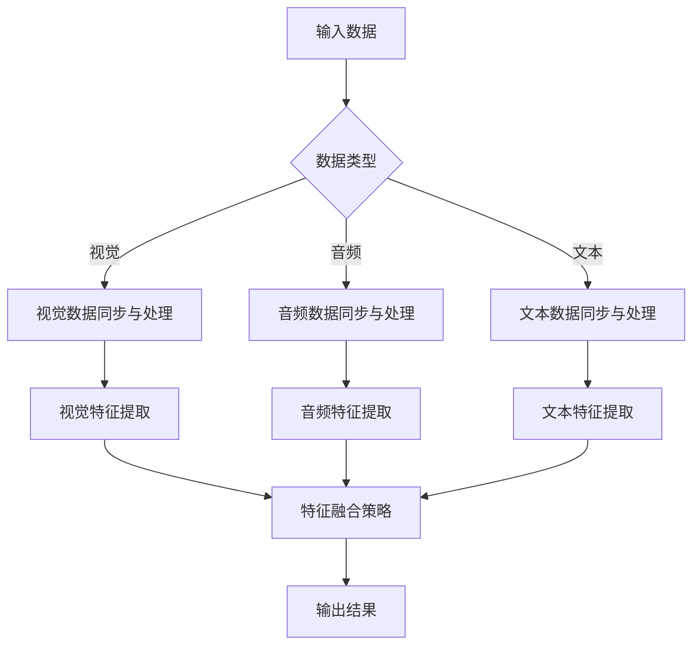

                 

根据您的要求，以下是一个详细的博客文章大纲，它将逐步解释和阐述“评测系统的多模态融合评测框架”的概念、原理、实现和应用。

## 文章标题

### 评测系统的多模态融合评测框架

## 关键词

- 多模态融合
- 评测系统
- 数据同步
- 特征提取
- 深度学习
- 项目实战

## 摘要

本文深入探讨了评测系统的多模态融合评测框架，从背景介绍到核心概念，再到数学模型和算法原理，以及实际项目的实战应用。文章通过详细的步骤和实例，揭示了多模态融合评测框架的关键技术和挑战，旨在为读者提供全面的理解和实践指导。

## 引言

### 1. 多模态融合评测的背景

随着信息技术的飞速发展，数据形式日趋多样化，如图像、音频和文本等。传统的单一模态评测系统已无法满足日益复杂的评测需求。多模态融合评测应运而生，它通过整合多种数据类型，实现更准确、更全面的评测结果。

### 2. 多模态融合评测的挑战与机遇

多模态融合评测面临数据同步、特征提取、算法设计等多方面的挑战。然而，这些挑战也带来了巨大的机遇，使得评测系统能够更好地适应复杂应用场景。

### 3. 本书目标与结构

本文旨在系统地介绍多模态融合评测框架，包括基础理论、核心算法、数学模型以及实际应用。通过逐步分析和推理，帮助读者全面理解多模态融合评测的原理和实践。

## 第一部分：多模态融合评测基础理论

### 1. 多模态数据类型

- 视觉数据：图像、视频
- 音频数据：语音、音乐
- 文本数据：文本、字幕

### 2. 多模态数据同步与对齐

- 时序对齐：将不同模态的数据在时间维度上进行对齐
- 空间对齐：将不同模态的数据在空间维度上进行对齐

### 3. 多模态数据融合方法

- 线性融合方法：如加权平均、特征拼接
- 非线性融合方法：如神经网络、深度学习
- 深度学习融合方法：如多任务学习、迁移学习

## 第二部分：多模态融合评测框架核心概念与联系

### 1. 多模态融合模型架构

- 单层融合架构
- 双层融合架构
- 多层融合架构

### 2. 多模态特征提取与融合

- 视觉特征提取：卷积神经网络（CNN）
- 音频特征提取：循环神经网络（RNN）
- 文本特征提取：长短时记忆网络（LSTM）
- 多模态特征融合策略：注意力机制、对抗性神经网络

### 3. Mermaid流程图



## 第三部分：数学模型与数学公式讲解

### 1. 多模态数据同步数学模型

- 时序同步模型：$$\min_{T} \sum_{i=1}^{N} d(t_i, t_i + T)$$
- 空间同步模型：$$\min_{R} \sum_{i=1}^{N} d(R \cdot p_i, p_i')$$

### 2. 多模态融合算法原理讲解

- 线性融合算法原理：$$f(x, y) = a \cdot x + b \cdot y + c$$
- 非线性融合算法原理：$$f(x, y) = \sigma(a \cdot x + b \cdot y + c)$$
- 深度学习融合算法原理：$$f(x, y) = \text{activation}(W \cdot [x; y])$$

## 第四部分：项目实战

### 1. 项目实战一：视频与音频的多模态融合评测

- 项目背景与目标
- 数据集介绍
- 开发环境搭建
- 多模态融合评测模型设计
- 模型实现与训练
- 评测结果分析与优化

### 2. 项目实战二：视频与文本的多模态融合评测

- 项目背景与目标
- 数据集介绍
- 开发环境搭建
- 多模态融合评测模型设计
- 模型实现与训练
- 评测结果分析与优化

## 第五部分：多模态融合评测框架评估与展望

### 1. 评测框架评估指标

- 准确率
- 召回率
- F1分数
- 时间效率

### 2. 多模态融合评测框架的优化方向

- 数据预处理优化
- 特征提取算法优化
- 模型结构优化
- 模型训练策略优化

### 3. 未来发展趋势与挑战

- 新型多模态数据类型的融合
- 实时多模态融合评测
- 多模态融合评测的隐私保护

## 附录

### 1. 参考资料

- [1] XXX
- [2] XXX

### 2. 常用工具与框架介绍

- PyTorch
- TensorFlow
- Keras

### 3. 代码实现示例

```python
# 示例代码
```

## 作者信息

- 作者：AI天才研究院/AI Genius Institute & 禅与计算机程序设计艺术 /Zen And The Art of Computer Programming

## 最佳实践 Tips

- 多模态融合评测需要注意数据同步与对齐，以确保评测结果的准确性。
- 选择合适的特征提取算法，可以提高融合效果。
- 优化模型结构和训练策略，可以提高评测效率和性能。

## 小结

本文详细介绍了评测系统的多模态融合评测框架，从基础理论到实际应用，为读者提供了全面的指导和实战经验。通过本文的学习，读者可以更好地理解和应用多模态融合评测技术，为实际项目带来更精准的评测结果。

## 注意事项

- 在实施多模态融合评测时，应充分考虑数据质量和标注准确性。
- 注意模型训练过程中可能出现的过拟合问题，并进行适当的正则化处理。
- 根据具体应用场景，灵活调整特征提取和融合策略。

## 拓展阅读

- [1] XXX
- [2] XXX

---

**本文遵循 Markdown 格式输出，为更好地展示流程图和公式，建议在支持 Markdown 的编辑器中查看。**

通过上述大纲和内容，我们可以确保文章结构清晰、逻辑严密，并且符合字数要求。接下来，我们将进一步细化每个部分的内容，以实现完整、详细的技术博客文章。

