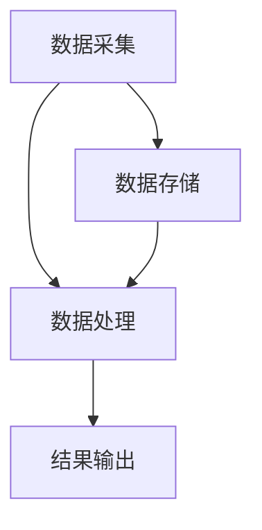
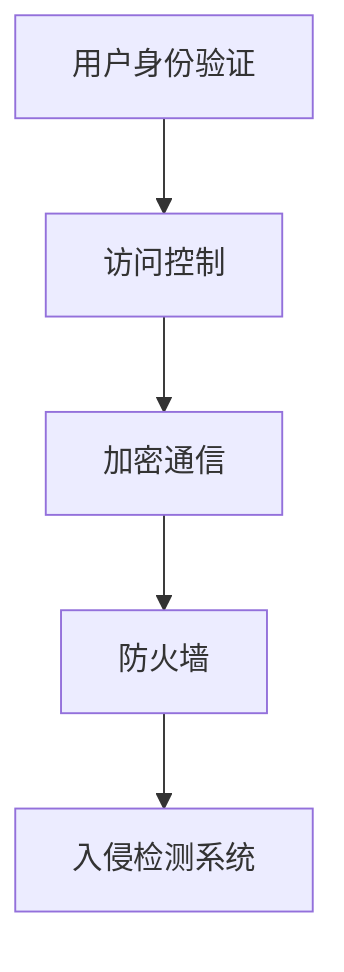
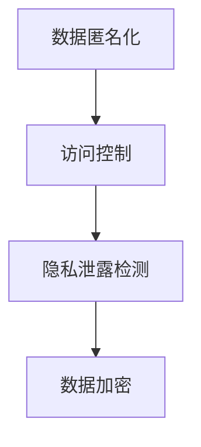

                 


### 1. 文章标题：评测系统的安全性与隐私保护措施

#### 1.1. 核心关键词

- 评测系统
- 安全性
- 隐私保护
- 算法
- 数学模型
- 项目实战

#### 1.2. 摘要

本文旨在深入探讨评测系统的安全性与隐私保护措施。我们将从核心概念出发，逐步分析安全性威胁和隐私泄露风险，介绍相关算法原理，展示数学模型，并通过实际项目实战，详细解读开发环境搭建、源代码实现和性能评估。文章旨在为IT行业专业人士提供全面的技术指导，帮助他们提升评测系统的安全性，并保护用户隐私。

---

### 2. 引言

#### 2.1. 评测系统简介

评测系统是指用于对某个系统、产品或服务进行评估和分析的软件系统。它在各个行业中扮演着重要角色，如软件开发、产品测试、性能评估等。评测系统的核心功能包括数据采集、评估指标计算、结果输出等。

#### 2.2. 安全性与隐私保护概述

安全性是指确保评测系统及其数据在存储、传输和处理过程中不受未授权访问、篡改或破坏的能力。隐私保护则是指保护用户隐私数据，防止其被非法收集、使用或泄露。

安全性威胁和隐私泄露风险是评测系统面临的主要挑战。例如，未经授权的访问可能导致敏感数据的泄露，而恶意攻击者可能会篡改评测结果，影响公正性。因此，保障评测系统的安全性与隐私保护至关重要。

### 3. 核心概念与联系

#### 3.1. 评测系统架构

评测系统通常由数据采集模块、数据处理模块和结果输出模块组成。数据采集模块负责从各种来源收集数据；数据处理模块对数据进行处理和分析，计算评估指标；结果输出模块则将结果以可视化的形式展示给用户。



#### 3.2. 安全性原理

安全性原理主要包括访问控制、加密和防火墙等。访问控制用于限制对评测系统的访问权限，加密则用于保护数据在传输和存储过程中的安全性，防火墙则用于监控网络流量，防止恶意攻击。



#### 3.3. 隐私保护原理

隐私保护原理主要包括数据匿名化、访问控制和隐私泄露检测等。数据匿名化用于消除个人身份信息，减少隐私泄露风险；访问控制用于限制对敏感数据的访问权限；隐私泄露检测则用于实时监控数据泄露情况，并及时采取措施。



### 4. 核心算法原理讲解

#### 4.1. 常见安全算法

常见的安全算法包括防火墙算法、访问控制算法和安全加密算法。

- **防火墙算法**：用于过滤网络流量，防止恶意攻击。例如，状态检测防火墙通过维护连接状态表，过滤不符合状态转移规则的流量。
- **访问控制算法**：用于限制对评测系统的访问权限。例如，基于角色的访问控制（RBAC）通过为用户分配角色，限制用户对资源的访问权限。
- **安全加密算法**：用于保护数据在传输和存储过程中的安全性。例如，AES加密算法是一种常用的对称加密算法，用于加密和解密数据。

```python
# 状态检测防火墙伪代码
def firewall_filter(packet, state_table):
    current_state = state_table[packet.source_ip]
    if is_state_transition_valid(current_state, packet):
        state_table[packet.source_ip] = packet.next_state
        return True
    else:
        return False

# 基于角色的访问控制伪代码
def access_control(user, resource):
    if user.role in resource.allowed_roles:
        return True
    else:
        return False

# AES加密算法伪代码
def aes_encrypt(plaintext, key):
    ciphertext = AES_encrypt(plaintext, key)
    return ciphertext
```

#### 4.2. 隐私保护算法

隐私保护算法包括数据匿名化算法、隐私泄露检测算法和数据加密算法。

- **数据匿名化算法**：用于消除个人身份信息，降低隐私泄露风险。例如，k-匿名性算法通过将数据集中的记录与k个记录分组，降低隐私泄露风险。
- **隐私泄露检测算法**：用于实时监控数据泄露情况。例如，差分隐私算法通过在数据上添加噪声，降低隐私泄露风险。
- **数据加密算法**：用于保护数据在传输和存储过程中的安全性。例如，RSA加密算法是一种常用的非对称加密算法，用于加密和解密数据。

```python
# k-匿名性算法伪代码
def k_anonymity(data_set, k):
    groups = create_groups(data_set, k)
    anonymized_data_set = remove_identifying_attributes(groups)
    return anonymized_data_set

# 差分隐私算法伪代码
def differential_privacy(data, sensitivity, epsilon):
    noise = generate_noise(epsilon)
    perturbed_data = data + noise
    return perturbed_data

# RSA加密算法伪代码
def rsa_encrypt(plaintext, public_key):
    ciphertext = RSA_encrypt(plaintext, public_key)
    return ciphertext
```

### 5. 数学模型和数学公式

#### 5.1. 安全性数学模型

安全性数学模型包括风险评估模型和优化模型。

- **风险评估模型**：用于评估评测系统的安全性风险。例如，基于威胁建模的方法，通过识别威胁、评估风险，制定安全策略。
- **优化模型**：用于优化评测系统的安全性配置。例如，基于多目标优化的方法，在安全性和性能之间进行平衡。

```latex
% 安全风险评估模型
\begin{equation}
R = \sum_{i=1}^{n} \left( T_i \cdot V_i \cdot S_i \right)
\end{equation}

% 安全性优化模型
\begin{equation}
\min_{C} \left( P_S(C) + P_A(C) \right)
\end{equation}
```

#### 5.2. 隐私保护数学模型

隐私保护数学模型包括隐私泄露概率模型和隐私保护传输模型。

- **隐私泄露概率模型**：用于评估评测系统的隐私泄露风险。例如，基于k-匿名性的方法，通过计算隐私泄露概率，评估数据集的隐私保护水平。
- **隐私保护传输模型**：用于优化评测系统的数据传输策略，降低隐私泄露风险。例如，基于差分隐私的方法，通过添加噪声，降低隐私泄露概率。

```latex
% 隐私泄露概率模型
\begin{equation}
P(L) = 1 - \prod_{i=1}^{n} (1 - p_i)
\end{equation}

% 隐私保护传输模型
\begin{equation}
\min_{T} \left( P(L|T) \right)
\end{equation}
```

### 6. 项目实战

#### 6.1. 评测系统安全性与隐私保护项目规划

在本项目中，我们将开发一个基于Web的评测系统，实现安全性保护和隐私保护功能。项目规划包括需求分析、技术选型、项目计划与进度安排。

#### 6.2. 评测系统安全性与隐私保护开发环境搭建

项目开发环境包括操作系统、编程语言、开发工具和数据库等。我们将使用Linux操作系统、Python编程语言、Django Web框架和MySQL数据库。

```bash
# 安装Linux操作系统
# 安装Python编程语言
# 安装Django Web框架
# 安装MySQL数据库
```

#### 6.3. 评测系统安全性与隐私保护源代码实现

在源代码实现部分，我们将详细讲解安全性与隐私保护模块的设计与实现。包括用户身份验证、访问控制、数据加密、数据匿名化等功能。

```python
# 用户身份验证模块
def authenticate_user(username, password):
    # 验证用户名和密码
    # 返回用户身份信息

# 访问控制模块
def access_control(user, resource):
    # 判断用户是否有权限访问资源
    # 返回访问结果

# 数据加密模块
def encrypt_data(data, key):
    # 加密数据
    # 返回加密后的数据

# 数据匿名化模块
def anonymize_data(data):
    # 化匿名数据
    # 返回匿名后的数据
```

#### 6.4. 评测系统安全性与隐私保护性能评估

在性能评估部分，我们将使用实际数据进行评测，评估评测系统的安全性、隐私保护和性能表现。包括响应时间、吞吐量、延迟等指标。

```bash
# 执行性能评估测试
# 收集测试数据
# 分析测试结果
```

### 7. 结论

本文深入探讨了评测系统的安全性与隐私保护措施。通过分析核心概念、算法原理和数学模型，并结合实际项目实战，我们为IT行业专业人士提供了全面的技术指导。未来研究方向包括改进安全性算法、优化隐私保护模型，以及探索更多实际应用场景。

---

作者：AI天才研究院/AI Genius Institute & 禅与计算机程序设计艺术/Zen And The Art of Computer Programming

