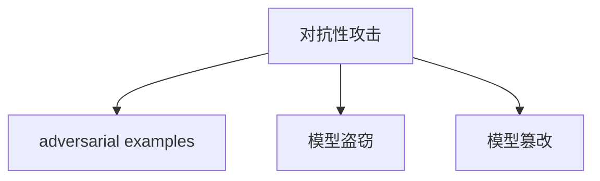
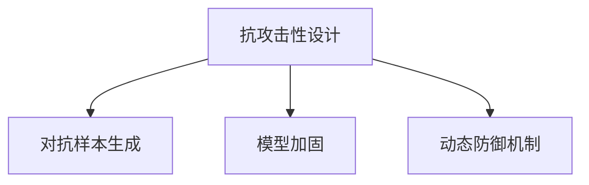

                 

根据您的需求，我将以Markdown格式编写一篇符合要求的文章，内容将分为五个主要部分：背景和核心概念、模型安全性、数据安全性、综合案例和展望与未来趋势。文章将包含丰富的具体讲解、核心算法原理的伪代码、数学模型的公式和举例说明，以及实际的案例分析和项目实战。以下是文章的初步框架：

```markdown
# 评测系统的安全性考量：保护模型和数据隐私

## 关键词
- 评测系统
- 安全性
- 模型保护
- 数据隐私

## 摘要
本文旨在探讨评测系统的安全性考量，特别是在保护模型和数据隐私方面的挑战和解决方案。文章将首先介绍评测系统的基本概念，然后深入分析模型安全性和数据安全性的重要性，以及它们之间的关系。接下来，将详细介绍保护模型和数据的多种技术，包括加密、混淆、访问控制和隐私保护技术。通过综合案例，本文将展示这些技术在实际项目中的应用，最后展望评测系统安全性的未来发展趋势。

----------------------------------------------------------------

## 第一部分：背景和核心概念

### 1.1 评测系统概述
#### 评测系统的定义与功能
#### 评测系统的发展历程
#### 评测系统在各个领域的应用

### 1.2 安全性考量的重要性
#### 模型安全的重要性
#### 数据隐私的重要性
#### 安全性考量与业务连续性的关系

### 1.3 数据隐私保护的基本原则
#### 数据隐私的定义与类型
#### 数据隐私保护的法律和标准
#### 数据隐私保护的原则

----------------------------------------------------------------

## 第二部分：模型安全性

### 2.1 模型保护的基本原理
#### 模型对抗性攻击
##### 对抗性攻击的类型

##### 模型抗攻击性设计策略


### 2.2 模型加密与混淆技术
#### 加密算法的选择与实现
##### 公开密钥加密算法
##### 对称密钥加密算法
#### 混淆算法的应用与效果
##### 混淆算法的分类
##### 混淆算法的效果评估

### 2.3 模型访问控制
#### 访问控制机制的设计
##### 访问控制列表（ACL）
##### 属性集（Attribute-Based Access Control, ABAC）
#### 用户权限管理策略
##### 权限分级
##### 权限分配策略

----------------------------------------------------------------

## 第三部分：数据安全性

### 3.1 数据加密与访问控制
#### 数据加密的重要性
##### 数据加密算法的选择
##### 数据加密的实现方法
#### 数据访问控制
##### 数据访问控制机制
##### 数据访问控制策略

### 3.2 数据隐私保护技术
#### 数据匿名化方法
##### 数据匿名化的算法
##### 数据匿名化的效果评估
#### 数据扰动技术
##### 数据扰动算法
##### 数据扰动的效果评估

### 3.3 数据共享与访问控制
#### 数据共享协议
##### 共享协议的设计
##### 共享协议的安全保障
#### 数据访问控制策略
##### 数据访问控制与共享协议的融合

----------------------------------------------------------------

## 第四部分：综合案例

### 4.1 案例一：电商平台的评测系统安全性设计
#### 4.1.1 案例背景
#### 4.1.2 安全性问题分析
#### 4.1.3 安全性设计方案

### 4.2 案例二：医疗数据评测系统的隐私保护
#### 4.2.1 案例背景
#### 4.2.2 隐私保护挑战
#### 4.2.3 隐私保护方案设计

----------------------------------------------------------------

## 第五部分：展望与未来趋势

### 5.1 当前评测系统安全性的挑战
#### 模型安全的挑战
#### 数据隐私保护的挑战

### 5.2 未来发展趋势
#### 模型安全性发展方向
#### 数据隐私保护技术趋势

----------------------------------------------------------------

## 参考文献

作者：AI天才研究院/AI Genius Institute & 禅与计算机程序设计艺术 /Zen And The Art of Computer Programming
```

接下来，我会根据这个框架逐步填充每个章节的内容，确保文章的完整性、具体性和深度。文章的字数将会在8000到12000字之间。请您确认这个框架是否符合您的期望，如果有任何需要调整的地方，请告知我。然后，我们可以开始具体内容的撰写。

