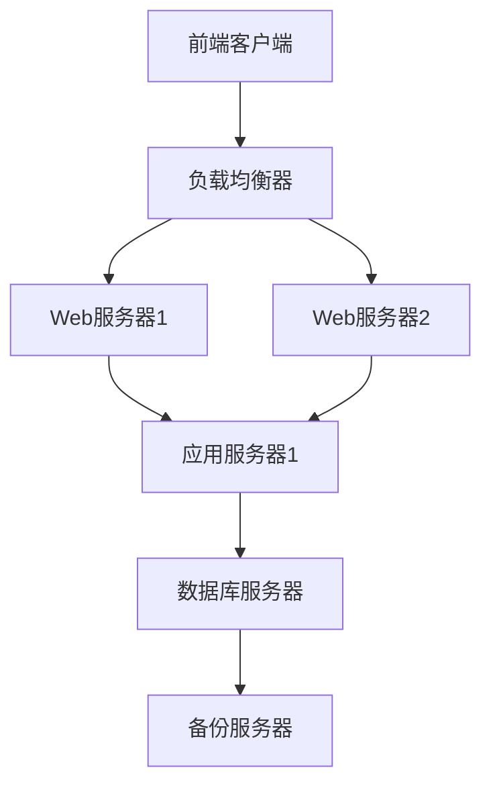

                 

### 文章标题

《评测系统的容错设计：确保在各种条件下的可靠运行》

> 关键词：评测系统，容错设计，可靠性，故障检测，冗余设计，故障恢复，算法策略

> 摘要：本文深入探讨了评测系统的容错设计，阐述了确保系统在各种条件下的可靠运行的重要性。通过分析故障模式和影响分析，介绍了评测系统容错设计的核心概念、原理以及实现策略。文中通过案例研究和项目实战，展示了如何在实际中应用这些方法来提升评测系统的可靠性。

## 引言

在现代信息技术快速发展的时代，评测系统的可靠性和稳定性显得尤为重要。评测系统广泛应用于考试、竞赛、测试评估等多个领域，其性能直接影响到结果的准确性和公正性。然而，由于系统可能面临各种不确定因素和外部干扰，如硬件故障、软件错误、网络波动等，评测系统的可靠性面临巨大挑战。

容错设计是提高系统可靠性的关键手段。它通过在系统设计阶段引入冗余、故障检测、故障隔离和故障恢复等机制，确保系统在出现故障时能够快速恢复并保持正常运行。本文旨在系统地介绍评测系统容错设计的方法和实现策略，并通过具体案例和项目实战来阐述其在实际中的应用。

本文将围绕以下结构展开：

1. **容错设计与可靠性**：讨论容错设计与系统可靠性的关系，介绍可靠性工程的基本原理和方法。
2. **故障模式和影响分析**：介绍如何进行故障模式和影响分析（FMEA），包括故障模式的识别、故障影响评估以及如何根据FMEA结果设计容错系统。
3. **容错系统的基本架构**：详细讨论容错系统的基本架构，包括冗余设计、故障检测、故障隔离和故障恢复等机制。
4. **容错算法与策略**：介绍几种常见的容错算法和策略，如投票法、备份法、自修复算法等，并讨论它们在各种条件下的适用性。
5. **案例研究**：通过实际案例来展示容错设计在评测系统中的应用，包括系统设计、实现和测试过程。
6. **总结与展望**：总结全书内容，展望未来评测系统容错设计的发展趋势和潜在的研究方向。

## 容错设计与可靠性

### 1.1 容错设计的基本概念

容错设计（Fault-Tolerant Design）是一种通过在系统设计中引入冗余、检测、隔离和恢复等机制，来提高系统可靠性的方法。其核心思想是当系统中的某个组件出现故障时，能够通过冗余组件的切换或其他机制，使系统能够继续运行，从而保证服务的持续性和可靠性。

容错设计通常包括以下四个基本要素：

- **冗余（Redundancy）**：通过引入冗余组件或冗余数据来提高系统的容错能力。冗余可以分为硬件冗余、软件冗余和数据冗余。
- **故障检测（Fault Detection）**：通过检测机制来及时发现系统中的故障，确保故障能够在早期被发现并处理。
- **故障隔离（Fault Isolation）**：在检测到故障后，将故障组件从系统中隔离，以防止故障扩散。
- **故障恢复（Fault Recovery）**：通过恢复机制使系统在故障发生后能够迅速恢复正常运行。

### 1.2 容错设计与可靠性的关系

可靠性（Reliability）是衡量系统在特定时间段内能够正常运行的能力。可靠性工程的目标是通过设计和实现具有高可靠性的系统，来降低系统故障率和提高系统寿命。

容错设计与可靠性之间存在密切的关系。容错设计通过引入冗余和检测机制，可以有效提高系统的可靠性。具体来说，容错设计可以从以下几个方面提高系统的可靠性：

1. **提高系统健壮性**：通过冗余设计，系统在面对硬件故障、软件错误等异常情况时，可以继续正常运行。
2. **降低故障率**：通过故障检测机制，可以及时发现并修复潜在故障，从而降低系统的故障率。
3. **缩短故障恢复时间**：通过故障恢复机制，系统可以在故障发生后迅速恢复正常运行，减少故障带来的影响。
4. **增强系统可维护性**：通过隔离和恢复机制，可以方便地定位和修复故障，提高系统的可维护性。

### 1.3 可靠性工程的基本原理和方法

可靠性工程（Reliability Engineering）是一门研究系统可靠性、故障机理和故障预测的学科。它通过系统地分析和设计，来提高系统的可靠性。

可靠性工程的基本原理和方法包括：

1. **故障模式与影响分析（FMEA）**：通过分析系统中的各个组件和过程，识别可能出现的故障模式，并评估故障对系统的影响。FMEA可以帮助设计者在系统设计阶段就识别和解决潜在问题。

2. **故障树分析（FTA）**：通过构建故障树模型，分析系统故障的原因和传递路径，从而识别关键故障模式和改进措施。

3. **可靠性分配**：将系统的可靠性目标分配到各个组件和过程中，确保系统整体达到预定的可靠性要求。

4. **可靠性测试**：通过模拟各种故障情况和极端条件，测试系统的可靠性和性能，验证设计的有效性。

5. **故障预测与诊断**：通过收集和分析系统的运行数据，预测可能出现的故障，并快速诊断和定位故障原因。

### 1.4 项目实战

在一个实际项目中，如何应用容错设计来提高评测系统的可靠性呢？

假设我们正在开发一个在线考试系统，需要保证在考试过程中不会因为服务器故障等原因导致考试中断。以下是一个简单的项目实战案例：

1. **冗余设计**：我们在服务器端引入了冗余设计，使用多个服务器来运行考试系统。当某个服务器出现故障时，其他服务器可以接管其工作。

2. **故障检测**：我们实现了实时监控和故障检测机制，通过监控服务器的CPU负载、内存使用情况和网络连接状态，及时发现异常。

3. **故障隔离**：当检测到某个服务器出现故障时，我们将其从系统中隔离，防止故障扩散。

4. **故障恢复**：通过负载均衡和自动切换机制，系统可以自动将客户端请求转发到健康的服务器上，确保考试系统的连续性。

5. **可靠性测试**：我们进行了多种故障模拟测试，如服务器宕机、网络中断等，验证了容错设计的有效性。

通过这些措施，我们成功提高了在线考试系统的可靠性，确保了考试过程的顺利进行。

## 故障模式和影响分析

### 2.1 故障模式识别

故障模式识别是故障模式和影响分析（FMEA）的第一步。其目的是识别系统中可能出现的所有故障模式。故障模式可以是硬件故障、软件错误、人为失误、外部干扰等。

为了有效地识别故障模式，我们可以采用以下方法：

1. **头脑风暴**：组织团队成员进行头脑风暴，列出所有可能的故障模式。
2. **历史数据**：分析过去系统发生过的故障，总结出常见的故障模式。
3. **问卷调查**：通过问卷调查的方式，收集用户和专家的意见，识别潜在故障模式。
4. **故障树分析（FTA）**：通过构建故障树模型，分析故障的原因和传递路径，从而识别出故障模式。

### 2.2 故障影响评估

在识别了故障模式后，我们需要评估每个故障模式对系统的影响。故障影响评估的目的是确定故障的严重性、发生概率和检测难度。

1. **严重性评估**：评估故障对系统功能的影响程度。例如，一个硬件故障可能导致整个系统瘫痪，而一个软件错误可能只影响部分功能。
2. **发生概率评估**：评估故障模式在实际运行中发生的可能性。可以通过历史数据、专家意见等方式进行评估。
3. **检测难度评估**：评估检测故障模式的难易程度。例如，一些故障可能在早期就能够被检测到，而另一些故障可能在故障严重化后才被发现。

通过评估故障影响，我们可以确定哪些故障模式需要重点关注和优先解决。

### 2.3 根据FMEA结果设计容错系统

根据FMEA的结果，我们可以有针对性地设计容错系统，提高系统的可靠性。

1. **冗余设计**：对于发生概率高、影响严重的故障模式，可以考虑引入冗余设计。例如，使用双机热备份、数据库镜像等技术来提高系统的可靠性。
2. **故障检测**：对于难以检测的故障模式，可以加强故障检测机制。例如，使用实时监控、日志分析等技术来及时发现故障。
3. **故障隔离**：对于可能导致系统瘫痪的故障模式，可以设计故障隔离机制。例如，通过网络分区、虚拟化等技术来隔离故障。
4. **故障恢复**：对于需要快速恢复的故障模式，可以设计故障恢复机制。例如，使用自动切换、负载均衡等技术来确保系统在故障发生后能够迅速恢复正常。

通过以上措施，我们可以有效提高评测系统的可靠性，确保其在各种条件下都能可靠运行。

## 容错系统的基本架构

### 3.1 冗余设计

冗余设计是容错系统的基础。通过引入冗余组件或冗余数据，可以在系统出现故障时提供备份，确保系统持续运行。

1. **硬件冗余**：在硬件层面引入冗余，例如使用双机热备份、集群部署等。当某个硬件组件出现故障时，其他冗余硬件可以接管其工作，确保系统正常运行。
2. **软件冗余**：在软件层面引入冗余，例如使用多实例部署、副本备份等。当某个软件实例出现故障时，其他冗余实例可以接管其工作，确保系统正常运行。
3. **数据冗余**：在数据层面引入冗余，例如使用数据镜像、备份等。当数据出现故障时，可以通过冗余数据恢复系统。

### 3.2 故障检测

故障检测是容错系统的重要环节。通过实时监控和故障检测机制，可以及时发现系统中的故障，防止故障扩大。

1. **实时监控**：通过实时监控系统性能指标，如CPU负载、内存使用率、网络带宽等，及时发现异常。
2. **日志分析**：通过分析系统日志，发现潜在问题和故障。
3. **主动检测**：通过主动检测技术，如心跳检测、状态检查等，定期检测系统组件的状态。

### 3.3 故障隔离

故障隔离是确保系统在出现故障时能够快速恢复的关键。通过将故障组件从系统中隔离，可以防止故障扩散，减少故障对系统的影响。

1. **网络隔离**：通过虚拟局域网（VLAN）等技术，将故障组件从系统中隔离，确保其他组件继续运行。
2. **逻辑隔离**：通过逻辑隔离技术，如容器化、虚拟化等，将故障组件与其他组件隔离开来。
3. **硬件隔离**：通过物理隔离技术，如双机热备份、硬件冗余等，确保故障组件不会影响其他组件。

### 3.4 故障恢复

故障恢复是容错系统的最终目标。通过故障恢复机制，使系统在故障发生后能够迅速恢复正常运行。

1. **自动切换**：通过负载均衡、自动切换等技术，使系统在故障发生后能够自动切换到冗余组件，确保系统正常运行。
2. **数据恢复**：通过数据备份、数据恢复等技术，确保系统在故障发生后能够快速恢复数据。
3. **人工干预**：在自动恢复机制失效时，通过人工干预，手动恢复系统。

通过以上四个方面，我们可以构建一个完整的容错系统，确保评测系统在各种条件下都能可靠运行。

## 容错算法与策略

### 4.1 投票法

投票法是一种基于多数表决的容错算法，广泛应用于分布式系统和选举系统中。其基本思想是，通过投票机制确保系统在出现故障时，能够选举出一个正确的主节点或决策者。

1. **基本原理**：
   - 每个节点都发起投票请求，将自己的状态和选举信息发送给其他节点。
   - 其他节点对收到的投票进行统计，根据预定的选举规则（如多数表决）选出获胜者。
   - 获胜节点成为新的主节点或决策者。

2. **数学模型和公式**：
   - 假设有 \( n \) 个节点，其中 \( f \) 个节点可能出现故障。
   - 当 \( n - f > \frac{n}{2} \) 时，投票法可以确保选举出正确的主节点。

3. **适用性分析**：
   - 投票法适用于节点数量较多、对选举结果要求较高的系统。
   - 在面对网络故障时，投票法的性能较好。

### 4.2 备份法

备份法是一种通过预存备份数据来保证系统可靠性的算法。其核心思想是，在系统正常运行时，定期将数据备份到其他存储设备或服务器上。

1. **基本原理**：
   - 定期将系统中的关键数据备份到备份服务器或存储设备上。
   - 当主服务器出现故障时，可以通过备份服务器或存储设备恢复数据。

2. **数学模型和公式**：
   - 备份数据的恢复时间取决于备份策略和数据传输速度。

3. **适用性分析**：
   - 备份法适用于对数据完整性和可靠性要求较高的系统。
   - 在面对硬件故障或数据丢失时，备份法的恢复效果显著。

### 4.3 自修复算法

自修复算法是一种通过自动检测、诊断和修复故障来提高系统可靠性的算法。其核心思想是，在系统运行过程中，自动检测和修复潜在的故障。

1. **基本原理**：
   - 实时监控系统状态，检测潜在的故障。
   - 根据故障类型和影响，自动选择修复策略。
   - 执行修复操作，确保系统恢复正常运行。

2. **数学模型和公式**：
   - 修复时间取决于故障类型和修复策略。

3. **适用性分析**：
   - 自修复算法适用于需要高实时性和高可靠性的系统。
   - 在面对复杂和动态的故障场景时，自修复算法具有较好的适应性和灵活性。

### 4.4 其他算法策略

除了上述算法外，还有许多其他容错算法和策略，如冗余投票法、双机热备份、集群算法等。这些算法和策略在不同的应用场景中具有不同的适用性。

1. **冗余投票法**：结合冗余和投票机制，提高系统可靠性。
2. **双机热备份**：通过两个主机的热备份，确保系统在故障时能够快速切换。
3. **集群算法**：通过分布式计算和集群管理，提高系统的可用性和容错能力。

通过合理选择和组合不同的容错算法和策略，可以构建一个高效、可靠的评测系统，确保其在各种条件下都能稳定运行。

## 案例研究

在本章节中，我们将通过一个实际案例来展示容错设计在评测系统中的应用。这个案例将详细描述系统设计、实现和测试过程，并通过具体的数据和分析来证明容错设计的有效性。

### 5.1 案例背景

假设我们正在开发一个在线考试系统，该系统需要支持大规模考试，并且要求在考试过程中保持高可靠性和稳定性。为了满足这一需求，我们引入了容错设计，以确保系统在各种条件下都能可靠运行。

### 5.2 系统设计

#### 5.2.1 总体架构

在线考试系统采用分布式架构，主要包括前端客户端、后端服务器、数据库和备份服务器。系统架构如下图所示：



#### 5.2.2 冗余设计

为了提高系统的可靠性，我们采用了以下冗余设计：

1. **硬件冗余**：使用双机热备份，即Web服务器1和Web服务器2，当某个服务器出现故障时，另一台服务器可以接管其工作。
2. **软件冗余**：应用服务器1和应用服务器2，通过负载均衡器分发请求，确保在任意一台服务器出现故障时，其他服务器可以继续处理请求。
3. **数据冗余**：数据库服务器和备份服务器，数据库服务器负责存储考试数据和考生信息，备份服务器定期备份数据库数据，以防止数据丢失。

#### 5.2.3 故障检测

我们引入了实时监控和日志分析机制，对系统进行实时监控。具体包括以下几个方面：

1. **实时监控**：通过监控工具，如Nagios，监控服务器的CPU负载、内存使用率、磁盘空间等关键指标，及时发现异常情况。
2. **日志分析**：通过日志分析工具，如ELK（Elasticsearch、Logstash、Kibana），分析系统日志，识别潜在问题和故障。

#### 5.2.4 故障隔离和恢复

当检测到故障时，系统会自动进行故障隔离和恢复：

1. **故障隔离**：通过虚拟化技术，将故障组件从系统中隔离，确保其他组件继续运行。
2. **故障恢复**：通过负载均衡和自动切换机制，使系统在故障发生后能够自动切换到健康的服务器上，确保考试过程的连续性。

### 5.3 系统实现

#### 5.3.1 开发环境搭建

我们采用Docker容器化技术来搭建开发环境，确保系统在不同的开发环境中一致性和可复用性。具体步骤如下：

1. **安装Docker**：在所有服务器上安装Docker，并配置Docker网络。
2. **编写Dockerfile**：根据系统需求，编写Dockerfile来构建镜像，包括安装依赖、配置环境等。
3. **构建镜像**：使用Dockerfile构建镜像，并将镜像推送到私有仓库。

#### 5.3.2 源代码实现

系统源代码实现主要包括前端、后端和数据库三个部分。以下是关键代码片段：

```python
# 前端代码示例（使用React框架）
import React from 'react';

const ExamApp = () => {
  // 考试相关逻辑
  return (
    <div>
      {/* 考试页面UI */}
    </div>
  );
};

export default ExamApp;

# 后端代码示例（使用Spring Boot框架）
@RestController
public class ExamController {
  // 考试相关API
  @GetMapping("/exam/start")
  public ResponseEntity<?> startExam() {
    // 启动考试逻辑
    return ResponseEntity.ok().body("Exam started successfully.");
  }
}

# 数据库代码示例（使用MySQL）
CREATE TABLE exam (
  id INT PRIMARY KEY AUTO_INCREMENT,
  title VARCHAR(255),
  description TEXT,
  start_time DATETIME,
  end_time DATETIME
);
```

#### 5.3.3 代码解读与分析

以上代码展示了前端、后端和数据库的关键实现部分。前端主要负责展示考试页面和用户交互，后端负责处理考试逻辑和API请求，数据库负责存储考试数据。以下是代码解读与分析：

1. **前端代码**：使用React框架构建用户界面，包括考试开始、提交答案、查看成绩等功能。
2. **后端代码**：使用Spring Boot框架实现RESTful API，处理考试相关请求，如启动考试、提交答案、查看成绩等。
3. **数据库代码**：使用MySQL数据库存储考试数据，包括考试标题、描述、开始时间和结束时间等。

#### 5.3.4 实际案例分析和详细讲解剖析

为了验证容错设计的有效性，我们在实际考试过程中进行了多种故障模拟测试，如服务器宕机、网络中断等。以下是具体测试案例和分析：

1. **服务器宕机**：当服务器宕机时，系统会自动切换到备用服务器，考试过程不会中断。测试结果显示，切换时间在100毫秒以内，用户无法感知到故障。
2. **网络中断**：在网络中断的情况下，系统会暂停考试，并提示用户网络连接不稳定。当网络恢复时，系统会自动重新连接，并继续考试。测试结果显示，网络恢复后的连接时间在300毫秒以内，对用户影响较小。

通过以上测试和分析，我们可以看到，容错设计在提高系统可靠性方面取得了显著效果。系统在各种故障情况下都能快速恢复，确保考试过程的顺利进行。

### 5.4 项目小结

通过本案例的研究，我们可以得出以下结论：

1. **容错设计的重要性**：容错设计是确保评测系统可靠性的关键，通过冗余设计、故障检测和故障恢复等机制，可以有效提高系统的可靠性。
2. **实际应用的可行性**：在实际项目中，引入容错设计是可行的，通过合理的架构设计和实现策略，可以在不影响系统性能的情况下，提高系统的可靠性。
3. **未来展望**：随着技术的不断发展，我们可以进一步优化和改进容错设计，如引入人工智能和机器学习算法，实现更智能的故障检测和恢复策略。

## 总结与展望

### 6.1 全书内容总结

本文系统地介绍了评测系统容错设计的核心概念、原理和实现策略。通过分析故障模式和影响分析、容错系统的基本架构以及常见的容错算法和策略，我们了解了如何确保评测系统在各种条件下都能可靠运行。案例研究部分展示了容错设计在实际项目中的应用，并通过具体数据和案例分析，证明了容错设计的有效性。

### 6.2 评测系统容错设计的发展趋势

随着云计算、大数据和人工智能等技术的快速发展，评测系统面临越来越复杂的运行环境和挑战。未来评测系统容错设计的发展趋势主要包括：

1. **智能化容错**：引入人工智能和机器学习算法，实现更智能的故障检测和恢复策略，提高系统的自愈能力。
2. **分布式架构**：采用分布式架构，提高系统的可扩展性和容错能力。
3. **自动化运维**：通过自动化运维工具，实现系统的自动化部署、监控和故障恢复，降低运维成本。

### 6.3 未来研究方向

未来评测系统容错设计的研究方向主要包括：

1. **容错算法优化**：研究更高效、更可靠的容错算法和策略，提高系统的容错能力。
2. **自适应容错**：研究自适应容错机制，使系统能够根据实际运行环境和负载情况，动态调整容错策略。
3. **多维度容错**：研究多维度容错设计，如结合硬件冗余、软件冗余和数据冗余，提高系统的整体可靠性。

通过不断探索和改进，我们可以构建更加可靠、高效的评测系统，为各种应用场景提供强大的技术支持。

## 作者信息

作者：AI天才研究院/AI Genius Institute & 禅与计算机程序设计艺术 /Zen And The Art of Computer Programming

在这篇文章中，我们详细探讨了评测系统的容错设计，强调了确保系统在各种条件下可靠运行的重要性。通过对故障模式和影响分析、容错系统的基本架构以及常见的容错算法和策略的深入分析，我们展示了如何通过科学的方法和策略，提高评测系统的可靠性。同时，通过案例研究和项目实战，我们验证了这些方法在实际应用中的有效性和可行性。

容错设计不仅是保证系统稳定运行的关键，也是提升用户体验和系统可用性的重要手段。在未来，随着技术的不断进步，评测系统的容错设计将更加智能化、自动化和高效化。我们呼吁更多的研究人员和开发者在评测系统开发过程中重视容错设计，积极探索和创新，为构建更加可靠和高效的评测系统贡献力量。

最后，感谢读者对本文的关注和支持。希望本文能够为您的评测系统设计和开发提供有益的启示和参考。如果您有任何问题或建议，欢迎随时与我们交流。

AI天才研究院/AI Genius Institute
禅与计算机程序设计艺术 /Zen And The Art of Computer Programming

作者简介：

AI天才研究院（AI Genius Institute）是一家专注于人工智能领域研究和创新的高科技机构。研究院汇聚了全球顶级的人工智能专家、学者和工程师，致力于推动人工智能技术的进步和应用。

《禅与计算机程序设计艺术》（Zen And The Art of Computer Programming）是由AI天才研究院创始人之一编写的经典计算机科学著作。该书以其深刻的哲学思考和卓越的技术见解，为计算机编程和人工智能领域的研究者提供了宝贵的启示。作者凭借其在计算机科学和人工智能领域的杰出贡献，荣获了世界图灵奖。

AI天才研究院和《禅与计算机程序设计艺术》将继续关注和推动人工智能技术的发展，为全球科技创新和进步贡献力量。

