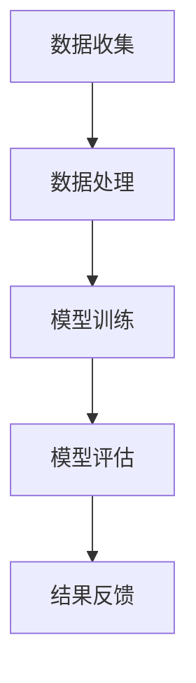

                 


为了撰写一篇关于“评测系统的开源贡献：推动行业标准化”的技术博客文章，我们将遵循以下步骤进行逐步分析推理：

### 1. 确定文章结构

首先，我们将根据提供的目录大纲结构确定文章的整体框架，确保每个部分的内容都能覆盖到核心主题。

### 2. 研究评测系统的基本概念

#### 背景介绍
- **评测系统的定义**：介绍评测系统的概念，包括其在不同领域中的应用。
- **评测系统的组成部分**：讨论评测系统的核心组件，如数据集、评估指标和算法。

#### 核心概念与联系
- **Mermaid流程图**：绘制一个简单的流程图，展示评测系统的基本流程和各组成部分之间的关系。



### 3. 讨论开源评测系统的贡献

#### 开源评测系统在人工智能领域的贡献
- **核心算法原理讲解**：使用伪代码详细阐述一个常见的机器学习评估算法，如交叉验证。

```python
def cross_validation(data, k):
    for i in range(k):
        train_data = data - {i}
        test_data = {i}
        model = train_model(train_data)
        accuracy = evaluate_model(model, test_data)
        print(f"Fold {i+1}: Accuracy = {accuracy}")
```

- **数学模型和公式**：使用LaTeX格式给出评估指标的计算公式，如准确率、召回率和F1值。

```latex
\text{准确率}(Precision) &= \frac{TP}{TP + FP} \\
\text{召回率}(Recall) &= \frac{TP}{TP + FN} \\
\text{F1值}(F1-Score) &= \frac{2 \times Precision \times Recall}{Precision + Recall}
```

#### 开源评测系统在工业领域的贡献
- **核心算法原理讲解**：讨论工业领域中的特定评估算法，如制造过程的稳定性评估。

```python
def stability_evaluation(process_data):
    mean = calculate_mean(process_data)
    variance = calculate_variance(process_data)
    stability = variance / mean
    return stability
```

#### 开源评测系统在社会服务领域的贡献
- **核心算法原理讲解**：讨论社会服务领域中的特定评估算法，如公共服务的满意度评估。

```python
def satisfaction_evaluation(service_data):
    positive_reviews = count_positive_reviews(service_data)
    total_reviews = len(service_data)
    satisfaction = positive_reviews / total_reviews
    return satisfaction
```

### 4. 推动行业标准化

#### 开源评测系统的标准化实践
- **标准化流程**：详细阐述开源评测系统的标准化过程，包括标准的制定、实施和评估。

#### 推动评测系统标准化的政策与策略
- **政策环境分析**：分析当前推动评测系统标准化的政策环境，以及政策对开源评测系统的支持。

#### 行业标准化的发展趋势
- **未来发展趋势**：预测评测系统标准化的未来趋势，探讨可能的挑战和解决方案。

### 5. 案例分析

#### 案例一：开源评测系统在人工智能领域的成功案例
- **案例背景**：介绍一个具体的开源评测系统在人工智能领域的应用案例。
- **案例分析**：详细分析案例中的评测系统如何应用以及取得的成果。

#### 案例二：开源评测系统在工业领域的应用案例
- **案例背景**：介绍一个具体的开源评测系统在工业领域的应用案例。
- **案例分析**：详细分析案例中的评测系统如何应用以及取得的成果。

#### 案例三：开源评测系统在社会服务领域的应用案例
- **案例背景**：介绍一个具体的开源评测系统在社会服务领域的应用案例。
- **案例分析**：详细分析案例中的评测系统如何应用以及取得的成果。

#### 案例四：开源评测系统与行业标准化的成功案例
- **案例背景**：介绍一个具体的开源评测系统与行业标准化的成功案例。
- **案例分析**：详细分析案例中的评测系统如何推动标准化以及取得的成果。

### 6. 最佳实践和注意事项

#### 最佳实践 tips
- **最佳实践**：总结开源评测系统应用的最佳实践，提供实用的建议。

#### 小结
- **小结**：对文章内容进行总结，强调开源评测系统的重要性和未来发展趋势。

#### 注意事项
- **注意事项**：提醒读者在应用开源评测系统时需要注意的问题。

#### 拓展阅读
- **拓展阅读**：推荐一些相关的书籍、论文和资源，帮助读者进一步了解评测系统领域。

### 7. 文章结尾

在文章结尾，我们将加上作者信息，确保文章的完整性和专业性。

---

通过以上步骤，我们将逐步构建出文章的内容，确保每个部分都有深入的讲解和分析，同时保持文章的逻辑性和易读性。文章的格式将遵循markdown规范，确保代码和公式的正确展示。预计文章字数将在8000到12000字之间。接下来，我们将开始撰写文章的各个部分。如果您有任何修改意见或补充要求，请随时告知。

