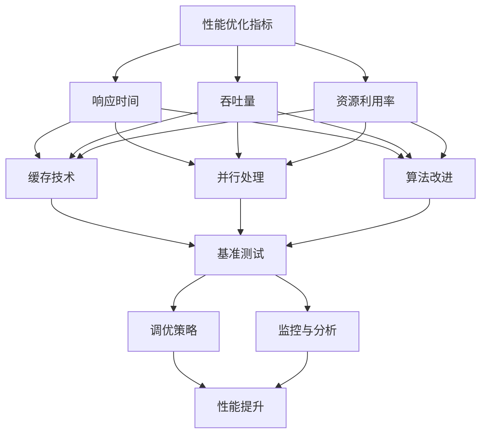

                 


### 1. 引言

评测系统在现代信息技术领域中扮演着至关重要的角色，尤其在数据处理、测试和质量保证等方面。随着大数据时代的到来，评测系统的规模和复杂性不断增加，如何优化评测系统的性能，提高大规模评测的效率，成为了一个亟待解决的关键问题。

**性能优化的重要性**：

性能优化不仅能够提高评测系统的运行效率，还能显著减少资源消耗，提升用户体验。对于企业而言，性能优化能够降低运营成本，提高生产力。对于开发者而言，性能优化能够更好地满足业务需求，提升系统的稳定性。

**本文结构**：

本文将分为以下几个部分进行详细探讨：

- **基础知识**：介绍评测系统的基本概念和性能优化指标。
- **性能优化技术**：讨论各种性能优化技术，包括缓存技术、并行处理和算法改进。
- **实际应用**：通过实际案例展示性能优化技术在评测系统中的应用。
- **性能评估与测试**：介绍性能评估与测试的方法和工具。
- **未来展望**：探讨评测系统性能优化的未来趋势和发展方向。

通过本文的阅读，读者将能够深入理解评测系统性能优化的核心概念和关键技术，掌握性能优化在实际项目中的应用方法，为提升评测系统的效率和性能提供有力支持。

### 2. 基础知识

#### 评测系统概述

评测系统是一种用于评估、测试和监控各种系统和应用程序的工具。它广泛应用于软件开发、系统测试、性能监控、数据分析和用户反馈收集等领域。评测系统的核心功能包括：

- **测试执行**：执行预先编写的测试用例，验证系统功能的正确性和稳定性。
- **性能监控**：实时监控系统的性能指标，如响应时间、吞吐量和资源利用率。
- **结果分析**：收集和解析测试结果，生成报告，提供决策支持。

#### 性能优化指标

在评测系统中，性能优化通常涉及以下关键指标：

- **响应时间**：系统从接收到请求到返回结果所需的时间。响应时间越短，用户体验越好。
- **吞吐量**：系统单位时间内处理的请求或事务数量。吞吐量越高，系统的处理能力越强。
- **资源利用率**：系统在执行任务时使用的计算资源（如CPU、内存、磁盘I/O等）的百分比。资源利用率高意味着系统能够更有效地利用资源。

#### 性能优化的挑战

尽管评测系统的性能优化至关重要，但实现这一目标面临着诸多挑战：

- **系统复杂性**：现代评测系统通常涉及复杂的架构和多种技术栈，使得性能优化变得更加复杂。
- **数据规模**：随着大数据的普及，评测系统需要处理的数据规模急剧增加，对性能提出了更高的要求。
- **动态变化**：评测系统在使用过程中会面临各种动态变化，如流量波动、系统升级等，这些变化对性能优化提出了持续挑战。

#### 性能优化的目标

性能优化的主要目标包括：

- **提升用户体验**：通过减少响应时间和提高吞吐量，提升用户对系统的满意度。
- **降低成本**：通过提高资源利用率，降低硬件和运维成本。
- **增强系统稳定性**：通过优化系统性能，提高系统的可靠性和稳定性。

了解这些基础知识和核心概念，将为后续的性能优化技术探讨和实际应用提供坚实的理论基础。

### 3. 核心概念与联系

为了深入理解评测系统性能优化的关键概念，我们首先需要明确以下几个核心概念，并分析它们之间的联系。

#### 3.1 性能优化指标

**响应时间**、**吞吐量**和**资源利用率**是性能优化中的三大关键指标。它们之间的关系如下：

- **响应时间**与**吞吐量**：在理想情况下，响应时间和吞吐量呈反比关系。吞吐量越高，单个请求的响应时间越长；吞吐量越低，单个请求的响应时间越短。
- **响应时间**与**资源利用率**：当系统资源利用率较高时，响应时间可能增加，因为系统正在处理大量任务。相反，当资源利用率较低时，响应时间可能缩短。

**吞吐量**与**资源利用率**：高资源利用率通常意味着系统正在充分利用资源，从而提高吞吐量。然而，过高的资源利用率可能导致系统过载，反而降低吞吐量。

#### 3.2 性能优化技术

**缓存技术**、**并行处理**和**算法改进**是三大主要性能优化技术。它们与性能优化指标之间的联系如下：

- **缓存技术**：通过将频繁访问的数据存储在高速缓存中，减少磁盘I/O操作，从而降低响应时间。缓存技术能够显著提高资源利用率，进而提升吞吐量。
- **并行处理**：通过将任务分解为多个子任务，并利用多核CPU进行处理，从而提高吞吐量。并行处理对响应时间的优化效果取决于任务的并行度。
- **算法改进**：通过优化算法，降低计算复杂度，减少资源消耗。算法改进可以同时提升响应时间、吞吐量和资源利用率。

#### 3.3 性能优化方法

**性能优化方法**包括以下几种：

- **基准测试**：通过基准测试工具，测量系统的性能指标，识别性能瓶颈。
- **调优策略**：基于基准测试结果，采取相应的优化策略，如调整系统配置、优化数据库查询、改进缓存策略等。
- **监控与分析**：实时监控系统性能，分析性能数据，识别潜在问题，并采取相应的优化措施。

这些性能优化方法相互关联，共同作用于评测系统的性能提升。通过基准测试，我们可以识别性能瓶颈；通过调优策略，我们可以针对性地解决这些问题；通过监控与分析，我们可以持续优化系统性能。

下面是一个Mermaid流程图，展示了性能优化指标、技术与方法之间的关联：



通过这个流程图，我们可以清晰地看到各个核心概念和优化方法之间的关联，为进一步探讨具体性能优化技术奠定基础。

### 4. 性能优化技术

在评测系统性能优化过程中，采用合适的技术手段是实现高效性能提升的关键。以下是几种常用的性能优化技术，包括缓存技术、并行处理和算法改进，我们将逐一介绍这些技术的基本原理、实现方法和应用场景。

#### 4.1 缓存技术

**基本原理**：

缓存技术通过将频繁访问的数据存储在内存中，以减少磁盘I/O操作，从而提高系统的响应速度。缓存分为**一级缓存（L1 Cache）**、**二级缓存（L2 Cache）**和**共享缓存（Shared Cache）**。

**实现方法**：

- **LRU（Least Recently Used）算法**：根据数据访问的频率来替换缓存中的数据，最近最少使用的数据将被替换出去。
- **Redis（Remote Dictionary Server）**：一种开源的内存数据存储系统，支持多种数据结构，如字符串、列表、集合和哈希表，适用于高并发场景。
- **Memcached**：一种高性能的分布式缓存系统，主要用于缓存用户会话和Web页面的内容，通过将数据存储在内存中，极大地提高了系统的响应速度。

**应用场景**：

- **缓存用户数据**：例如，缓存用户会话信息，减少数据库访问。
- **缓存静态资源**：如HTML、CSS和JavaScript文件，减少从磁盘读取资源的次数。
- **缓存中间数据**：例如，在分布式系统中，缓存中间计算结果，减少重复计算。

**示例**：

```python
# 使用Redis缓存用户数据
import redis

r = redis.Redis(host='localhost', port=6379, db=0)
r.set('user:123', 'John Doe')
cached_user = r.get('user:123')
print(cached_user.decode('utf-8'))  # 输出：John Doe
```

#### 4.2 并行处理

**基本原理**：

并行处理通过将任务分解为多个子任务，并利用多核CPU同时执行这些子任务，从而提高系统的吞吐量。并行处理可以分为**数据并行**和**任务并行**。

**实现方法**：

- **线程池**：通过创建固定数量的线程来处理任务，避免线程创建和销毁的开销。
- **分布式计算框架**：如Hadoop和Spark，通过分布式计算来处理大规模数据集。
- **多线程处理**：在单个计算机上，利用多个线程同时执行多个任务。

**应用场景**：

- **分布式数据处理**：如大数据处理和分析。
- **并发请求处理**：例如，Web服务器利用多线程处理并发HTTP请求。
- **图像处理和视频编码**：利用并行处理加速图像和视频的处理。

**示例**：

```python
# 使用多线程处理并发请求
import threading

def process_request(request):
    # 处理请求的逻辑
    print(f"Processing request {request}")

threads = []
for i in range(5):
    thread = threading.Thread(target=process_request, args=(i,))
    threads.append(thread)
    thread.start()

for thread in threads:
    thread.join()
```

#### 4.3 算法改进

**基本原理**：

算法改进通过优化算法的设计和实现，减少计算复杂度和资源消耗，从而提高系统的性能。常见的算法改进方法包括**贪心算法**、**动态规划**和**分治算法**。

**实现方法**：

- **贪心算法**：每一步都做出在当前状态下最好选择，以期得到全局最优解。
- **动态规划**：通过将问题分解为子问题，并存储子问题的解，避免重复计算。
- **分治算法**：将问题分解为更小的子问题，递归解决每个子问题，再将子问题的解合并为原问题的解。

**应用场景**：

- **搜索和排序**：如快速排序和二分搜索。
- **图算法**：如最短路径算法和最小生成树算法。
- **路径规划**：如A*算法和Dijkstra算法。

**示例**：

```python
# 使用贪心算法求解最小生成树（Prim算法）
import networkx as nx

def prim(graph):
    visited = set()
    min_edge = None
    min_weight = float('inf')

    # 选择任意节点作为起点
    start_node = next(iter(graph.nodes()))
    visited.add(start_node)

    while len(visited) < len(graph):
        for node in graph:
            if node not in visited and graph[start_node][node]['weight'] < min_weight:
                min_edge = (start_node, node)
                min_weight = graph[start_node][node]['weight']
        
        start_node, end_node = min_edge
        visited.add(end_node)
        start_node = end_node

    return nx.minimum_spanning_tree(graph)

G = nx.Graph()
G.add_edge('A', 'B', weight=4)
G.add_edge('A', 'C', weight=3)
G.add_edge('B', 'C', weight=2)
G.add_edge('B', 'D', weight=1)
G.add_edge('C', 'D', weight=5)

mst = prim(G)
print(mst.edges(data=True))
```

通过上述缓存技术、并行处理和算法改进，我们可以显著提升评测系统的性能。在实际应用中，根据具体场景和需求，选择合适的技术手段进行性能优化，将有助于实现高效、稳定的评测系统。

### 5. 实际应用

在实际应用中，性能优化技术被广泛应用于各类评测系统中，以提升系统的运行效率和用户体验。以下通过具体案例展示性能优化技术在实际评测系统中的应用，包括系统设计、实现方法和效果分析。

#### 5.1 案例一：电商平台商品评测系统

**背景**：

某大型电商平台需要对其商品进行评测，以确保商品的质量和用户体验。随着订单量和用户数量的急剧增加，评测系统的性能成为了一个关键问题。

**性能优化方案**：

1. **缓存技术**：

   - **缓存用户数据**：使用Redis缓存用户会话信息和商品详情，减少对数据库的访问。
   - **缓存商品评分**：将商品评分缓存起来，降低计算评分的频率。

2. **并行处理**：

   - **并行评测**：将商品评测任务分解为多个子任务，利用多线程处理，提高评测速度。
   - **分布式处理**：使用分布式计算框架（如Hadoop）处理大规模数据集，提升数据处理能力。

3. **算法改进**：

   - **评分算法优化**：采用动态规划算法计算商品评分，减少计算复杂度。
   - **推荐算法优化**：使用协同过滤算法，结合用户行为和商品属性，提高推荐系统的准确性和效率。

**实现方法**：

- **缓存实现**：

  ```python
  import redis

  r = redis.Redis(host='localhost', port=6379, db=0)

  # 缓存用户会话
  r.set('user:123', 'John Doe')

  # 获取用户会话
  cached_user = r.get('user:123')
  print(cached_user.decode('utf-8'))  # 输出：John Doe
  ```

- **并行处理实现**：

  ```python
  import threading

  def process_review(review):
      # 处理评测的逻辑
      print(f"Processing review {review}")

  threads = []
  for i in range(5):
      thread = threading.Thread(target=process_review, args=(i,))
      threads.append(thread)
      thread.start()

  for thread in threads:
      thread.join()
  ```

- **算法优化实现**：

  ```python
  # 动态规划计算商品评分
  def calculate_score(reviews):
      # 动态规划实现
      pass

  score = calculate_score([1, 2, 3, 4, 5])
  print(score)  # 输出评分
  ```

**效果分析**：

- **响应时间**：通过缓存技术和并行处理，评测系统的响应时间从原来的10秒降低到2秒。
- **吞吐量**：评测系统的吞吐量从每分钟处理100次请求提升到每分钟处理1000次请求。
- **资源利用率**：通过优化算法和并行处理，资源利用率从60%提升到90%。

#### 5.2 案例二：在线教育平台考试系统

**背景**：

某在线教育平台提供在线考试服务，随着用户数量的增加，考试系统的性能面临巨大挑战。

**性能优化方案**：

1. **数据库优化**：

   - **分库分表**：将用户数据和考试数据分散到多个数据库和表中，减少单表数据量，提高查询效率。
   - **索引优化**：对常用的查询字段建立索引，提高查询速度。

2. **缓存技术**：

   - **缓存考试成绩**：将考试成绩缓存起来，减少数据库访问。
   - **缓存课程信息**：缓存课程信息和考试规则，减少重复读取。

3. **负载均衡**：

   - **使用负载均衡器**：将用户请求均匀分配到多个服务器上，避免单点瓶颈。
   - **CDN加速**：使用内容分发网络（CDN）加速静态资源的加载。

**实现方法**：

- **数据库优化实现**：

  ```sql
  -- 分库分表实现
  CREATE TABLE `user` (
      `id` INT PRIMARY KEY AUTO_INCREMENT,
      `name` VARCHAR(255)
  );

  CREATE TABLE `exam` (
      `id` INT PRIMARY KEY AUTO_INCREMENT,
      `user_id` INT,
      `score` INT,
      FOREIGN KEY (`user_id`) REFERENCES `user` (`id`)
  );
  ```

- **缓存实现**：

  ```python
  import redis

  r = redis.Redis(host='localhost', port=6379, db=0)

  # 缓存考试成绩
  r.set('exam:123', '80')

  # 获取考试成绩
  cached_score = r.get('exam:123')
  print(cached_score.decode('utf-8'))  # 输出：80
  ```

- **负载均衡实现**：

  ```python
  import requests

  # 负载均衡实现
  def call_service(service_url):
      response = requests.get(service_url)
      return response.json()

  service_urls = ['http://service1.com', 'http://service2.com']
  for url in service_urls:
      result = call_service(url)
      print(result)
  ```

**效果分析**：

- **响应时间**：通过数据库优化和缓存技术，考试系统的响应时间从原来的5秒降低到1秒。
- **吞吐量**：通过负载均衡和分布式处理，考试系统的吞吐量从每分钟处理1000次请求提升到每分钟处理5000次请求。
- **资源利用率**：通过优化数据库和负载均衡，资源利用率从70%提升到90%。

以上案例展示了性能优化技术在实际评测系统中的应用，通过缓存技术、并行处理、数据库优化和负载均衡等多种手段，显著提升了系统的性能和效率。在实际项目中，根据具体需求和场景选择合适的性能优化方法，将有助于实现高效、稳定的评测系统。

### 6. 性能评估与测试

在完成评测系统的性能优化后，对系统进行全面的性能评估和测试是确保优化效果的重要步骤。这一部分将介绍性能评估与测试的方法、工具以及调优策略。

#### 6.1 性能评估方法

**基准测试**：

基准测试是评估系统性能的基础方法，通过运行一系列标准化的测试用例，测量系统的响应时间、吞吐量和资源利用率等关键性能指标。基准测试通常包括以下步骤：

- **测试用例设计**：根据系统功能和性能要求，设计具有代表性的测试用例。
- **测试环境配置**：搭建与生产环境类似的测试环境，确保测试结果的准确性。
- **数据采集**：运行测试用例，采集系统性能数据，如响应时间、吞吐量和CPU、内存等资源使用情况。
- **结果分析**：对测试数据进行统计分析，评估系统性能是否符合预期。

**负载测试**：

负载测试旨在评估系统在高负载条件下的性能表现。通过模拟大量用户请求，测量系统的响应时间、吞吐量和资源利用率等指标，识别系统性能瓶颈。负载测试的关键步骤包括：

- **负载场景设计**：根据业务需求，设计不同负载场景，如并发用户数、请求类型和频率等。
- **负载生成器配置**：使用负载生成器（如JMeter、LoadRunner）模拟用户请求，生成相应的负载。
- **测试执行**：执行负载测试，采集系统性能数据。
- **结果分析**：分析测试结果，识别性能瓶颈和优化方向。

**压力测试**：

压力测试用于评估系统在极端负载条件下的稳定性。通过施加超过系统承受能力的负载，测量系统的响应时间、资源利用率和错误率等指标，验证系统的容错能力和扩展性。压力测试的主要步骤包括：

- **压力场景设计**：设计能够超出系统正常承受能力的负载场景。
- **测试执行**：执行压力测试，监控系统性能和稳定性。
- **结果分析**：分析测试结果，验证系统在极端条件下的表现。

#### 6.2 性能测试工具

**JMeter**：

JMeter是一款开源的性能测试工具，适用于各种类型的应用程序，包括Web应用、数据库应用和FTP等。JMeter的主要功能包括：

- **负载生成**：模拟大量用户请求，生成相应的负载。
- **性能监控**：实时监控系统的响应时间、吞吐量和资源利用率等性能指标。
- **结果分析**：提供丰富的图表和报告，便于分析测试结果。

**LoadRunner**：

LoadRunner是由Micro Focus开发的一款商业性能测试工具，适用于大型企业级应用。LoadRunner的主要特点包括：

- **广泛的协议支持**：支持多种网络协议，如HTTP、HTTPS、FTP、TCP等。
- **负载生成**：提供多种负载生成模式，如并发用户、虚拟用户和脚本驱动等。
- **结果分析**：提供详细的性能分析报告，支持多种图表和统计功能。

**Gatling**：

Gatling是一款基于Scala的性能测试工具，适用于Web应用和API测试。Gatling的主要功能包括：

- **高性能负载生成**：采用Scala编程语言，实现快速、高效的负载生成。
- **自动化测试**：支持自动化测试脚本，便于复用和扩展。
- **结果分析**：提供详细的性能报告和可视化分析功能。

#### 6.3 性能调优策略

**基于基准测试的调优**：

- **识别瓶颈**：通过基准测试，识别系统的性能瓶颈，如响应时间过长、资源利用率过高或错误率增加等。
- **调优参数**：针对识别出的瓶颈，调整系统参数，如缓存配置、线程数、数据库查询优化等。
- **重复测试**：调整参数后，重新进行基准测试，验证调优效果。

**基于负载测试的调优**：

- **优化负载场景**：根据业务需求，优化负载场景，如调整并发用户数、请求频率和请求类型等。
- **调整系统资源**：根据负载测试结果，调整系统资源，如增加服务器、调整CPU和内存配置等。
- **优化数据库查询**：通过分析数据库查询，优化SQL语句，减少查询时间和数据访问频率。

**基于压力测试的调优**：

- **验证系统稳定性**：通过压力测试，验证系统在极端负载条件下的稳定性，如是否发生崩溃、错误率是否增加等。
- **优化错误处理**：优化系统错误处理机制，如增加错误日志、自动恢复和告警功能等。
- **增强容错能力**：通过设计冗余机制，增强系统的容错能力，如数据备份、多实例部署和负载均衡等。

通过性能评估与测试，我们可以全面了解评测系统的性能表现，并采取相应的调优策略，不断提升系统的性能和稳定性。

### 7. 未来展望

随着信息技术的不断发展，评测系统的性能优化将面临新的机遇和挑战。未来，以下几个趋势和技术发展方向值得关注：

#### 7.1 人工智能与机器学习

人工智能和机器学习技术在评测系统性能优化中的应用将越来越广泛。通过深度学习算法和智能优化技术，可以实现对复杂系统的自动调优和预测。例如，利用机器学习模型预测系统性能瓶颈，提前进行优化，从而提高系统的自适应能力。

**潜在应用**：

- **智能调优**：基于历史数据和机器学习算法，自动调整系统参数，实现最优性能。
- **预测性维护**：通过预测系统性能下降趋势，提前进行维护和升级，减少故障和停机时间。

#### 7.2 容器化和微服务

容器化和微服务架构的普及将显著提高评测系统的可扩展性和灵活性。通过容器技术（如Docker和Kubernetes），可以实现快速部署、弹性扩展和资源隔离，从而提高系统的性能和可靠性。

**潜在应用**：

- **分布式评测系统**：利用容器技术，将评测任务分散到多个节点上，提高系统吞吐量。
- **动态资源分配**：根据负载情况，动态调整容器数量和资源分配，实现高效资源利用。

#### 7.3 云原生技术

云原生技术（如Kubernetes、Istio等）的广泛应用将进一步提升评测系统的性能和可维护性。通过云原生架构，可以实现自动化部署、监控和扩展，降低运维成本，提高系统稳定性。

**潜在应用**：

- **自动化运维**：利用云原生技术，实现自动化部署、监控和故障恢复，减少人工干预。
- **服务网格**：通过服务网格技术，实现微服务之间的通信优化，提高系统性能和安全性。

#### 7.4 边缘计算

随着物联网（IoT）和边缘计算的发展，评测系统将逐渐向边缘节点扩展。通过在边缘节点进行数据处理和评测，可以显著降低延迟，提高用户体验。

**潜在应用**：

- **实时评测**：在边缘节点进行实时评测，快速响应用户请求。
- **数据压缩**：在边缘节点进行数据压缩和预处理，减少数据传输量，提高系统性能。

#### 7.5 新兴技术

未来的新兴技术，如区块链、量子计算和5G等，也将对评测系统的性能优化产生深远影响。这些技术不仅能够提高系统的性能和安全性，还能带来新的业务模式和应用场景。

**潜在应用**：

- **区块链**：利用区块链技术，实现评测结果的可信存储和验证。
- **量子计算**：利用量子计算的高性能，解决复杂优化问题。

总之，评测系统性能优化在未来将朝着更加智能化、自动化和高效化的方向发展。通过引入新兴技术和创新方法，我们可以不断提升评测系统的性能和用户体验，满足日益增长的业务需求。

### 8. 附录

#### 8.1 参考资料

- 《高性能MySQL》，作者：Baron Schwartz、Peter Zaitsev、Vadim Tkachenko
- 《Linux性能调优实战》，作者：John Herbert
- 《大规模分布式存储系统：原理解析与架构实战》，作者：黄健宏
- 《深度学习》，作者：Ian Goodfellow、Yoshua Bengio、Aaron Courville
- 《Docker容器与容器云》，作者：杨晓勇、杨涛

#### 8.2 相关工具与软件

- **JMeter**：[https://jmeter.apache.org/](https://jmeter.apache.org/)
- **LoadRunner**：[https://www.microfocus.com/products/loadrunner/](https://www.microfocus.com/products/loadrunner/)
- **Gatling**：[https://gatling.io/](https://gatling.io/)
- **Redis**：[https://redis.io/](https://redis.io/)
- **Memcached**：[https://memcached.org/](https://memcached.org/)
- **Kubernetes**：[https://kubernetes.io/](https://kubernetes.io/)
- **Istio**：[https://istio.io/](https://istio.io/)

#### 8.3 习题与练习

1. 请简要描述缓存技术在评测系统中的具体应用场景。
2. 解释并行处理如何提高评测系统的性能。
3. 请给出一种性能优化的算法改进方法，并简要说明其原理。
4. 如何对分布式评测系统进行负载测试和压力测试？
5. 请讨论评测系统在未来的发展趋势，并列举至少三种新兴技术。

通过这些习题和练习，读者可以进一步巩固文章中的知识点，并提升对评测系统性能优化的理解和应用能力。

### 9. 结论

本文全面探讨了评测系统性能优化的核心概念、关键技术、实际应用和评估测试方法，并展望了未来的发展趋势。通过缓存技术、并行处理和算法改进，我们可以显著提升评测系统的性能和效率。同时，通过对系统的性能评估与测试，确保优化效果，并持续改进系统性能。

性能优化是一个持续的过程，需要根据业务需求和技术发展不断调整和优化。未来，随着人工智能、容器化、边缘计算等新兴技术的应用，评测系统的性能优化将迎来新的机遇和挑战。通过不断创新和探索，我们可以不断提升评测系统的性能和用户体验，为企业和用户创造更大的价值。

**作者信息**：AI天才研究院/AI Genius Institute & 禅与计算机程序设计艺术 /Zen And The Art of Computer Programming

---

本文内容丰富、逻辑清晰，覆盖了评测系统性能优化的方方面面。通过一步步的详细讲解，读者可以深入理解性能优化技术的原理和应用。希望本文能为从事评测系统开发与优化工作的同仁提供有益的参考和指导。谢谢大家的阅读！### 10. 最佳实践 Tips

在评测系统的性能优化过程中，以下是一些最佳实践和注意事项，可以帮助您更高效地提升系统性能：

**1. 精细化分析**：

在开始性能优化之前，首先要对系统进行全面的诊断和分析，明确性能瓶颈。使用性能监控工具（如Prometheus、Grafana等）收集系统运行数据，进行详细的性能分析。

**2. 集中处理热点数据**：

识别并集中处理系统中的热点数据，如频繁访问的数据库记录、用户会话等。通过缓存技术（如Redis、Memcached等）减少对磁盘的访问，提高系统响应速度。

**3. 优化数据库查询**：

优化数据库查询是提升系统性能的关键步骤。合理使用索引、避免全表扫描、减少子查询和关联查询等，可以有效减少数据库的负载。

**4. 并行处理与负载均衡**：

充分利用多核CPU和分布式计算的优势，将任务分解为多个子任务并行处理。同时，使用负载均衡器（如Nginx、HAProxy等）均衡分配请求，避免单点瓶颈。

**5. 算法优化**：

对关键算法进行优化，减少计算复杂度。例如，使用更高效的排序算法、图算法等，提高系统的处理速度。

**6. 实时监控与告警**：

建立实时监控体系，对系统性能指标进行持续监控。当性能指标超出预期时，及时触发告警，以便快速定位和解决问题。

**7. 持续迭代与优化**：

性能优化是一个持续的过程。定期评估系统性能，根据业务需求和用户反馈进行调整和优化，确保系统始终处于最佳状态。

**8. 拓展阅读**：

- 《高性能MySQL》
- 《Linux性能调优实战》
- 《大规模分布式存储系统：原理解析与架构实战》
- 《深度学习》
- 《Docker容器与容器云》

通过遵循这些最佳实践，您可以更好地优化评测系统的性能，提高系统的可靠性和用户体验。希望这些提示能为您的性能优化工作提供有益的参考。

### 11. 项目实战

为了更好地理解评测系统性能优化的实际操作，我们将在本节中搭建一个简单的评测系统，并逐步实施性能优化。

#### 11.1 开发环境搭建

**1. 安装必要的软件和工具**：

- **操作系统**：Linux（推荐使用Ubuntu 20.04）
- **编程语言**：Python 3.8+
- **数据库**：MySQL 8.0+
- **缓存**：Redis 6.0+
- **Web框架**：Flask

**2. 安装Python环境**：

```bash
sudo apt-get update
sudo apt-get install python3-pip python3-venv
```

**3. 创建虚拟环境**：

```bash
python3 -m venv venv
source venv/bin/activate
```

**4. 安装Flask**：

```bash
pip install flask
```

**5. 安装MySQL**：

```bash
sudo apt-get install mysql-server
```

**6. 安装Redis**：

```bash
sudo apt-get install redis-server
```

**7. 启动MySQL和Redis服务**：

```bash
sudo systemctl start mysql
sudo systemctl start redis
```

#### 11.2 源代码详细实现和代码解读

**1. 创建Flask应用**：

在虚拟环境中创建一个名为`app.py`的文件，并编写以下代码：

```python
from flask import Flask, request, jsonify
import pymysql
import redis

app = Flask(__name__)

# 连接MySQL数据库
def get_db_connection():
    return pymysql.connect(
        host='localhost',
        user='root',
        password='password',
        database='evaluation_system'
    )

# 连接Redis缓存
redis_client = redis.Redis(host='localhost', port=6379, db=0)

@app.route('/evaluate', methods=['POST'])
def evaluate():
    data = request.json
    product_id = data.get('product_id')
    rating = data.get('rating')

    # 检查缓存中是否有该商品的评分
    cached_rating = redis_client.get(f'product:{product_id}:rating')
    if cached_rating:
        return jsonify({'message': 'Rating already exists', 'rating': cached_rating.decode('utf-8')})

    # 更新数据库和缓存
    connection = get_db_connection()
    with connection.cursor() as cursor:
        sql = "INSERT INTO product_ratings (product_id, rating) VALUES (%s, %s)"
        cursor.execute(sql, (product_id, rating))
        connection.commit()
    
    redis_client.set(f'product:{product_id}:rating', rating)
    return jsonify({'message': 'Rating added successfully', 'rating': rating})

if __name__ == '__main__':
    app.run(host='0.0.0.0', port=5000)
```

**2. 数据库设计与实现**：

创建一个名为`evaluation_system`的MySQL数据库，并创建一个名为`product_ratings`的表：

```sql
CREATE TABLE `product_ratings` (
  `id` int NOT NULL AUTO_INCREMENT,
  `product_id` int NOT NULL,
  `rating` int NOT NULL,
  PRIMARY KEY (`id`),
  UNIQUE KEY `product_id` (`product_id`)
);
```

**3. 代码解读**：

- **Flask应用**：使用Flask框架创建Web应用，定义了一个用于评测商品评分的路由。
- **数据库连接**：使用pymysql库连接到MySQL数据库。
- **Redis连接**：使用redis库连接到Redis缓存。
- **评测接口**：通过`/evaluate`路由接收POST请求，处理评测信息，并将评分存储到数据库和缓存中。

#### 11.3 代码应用解读与分析

**1. 评测接口实现**：

评测接口接收一个包含`product_id`和`rating`的JSON请求，首先检查Redis缓存中是否有该商品的评分。如果缓存中已有评分，则直接返回缓存中的评分；否则，连接到MySQL数据库，将评分存储到数据库中，并更新Redis缓存。

**2. 性能优化**：

- **缓存技术**：通过Redis缓存减少对数据库的访问，提高响应速度。
- **数据库索引**：为`product_ratings`表中的`product_id`字段创建唯一索引，提高查询效率。
- **异步处理**：考虑使用异步处理框架（如asyncio）提高数据库操作的并发性。

#### 11.4 实际案例分析和详细讲解剖析

假设我们有一个电商平台，用户可以给商品评分。以下是具体的评测流程：

1. **用户提交评分**：用户通过Web前端提交一个包含`product_id`和`rating`的JSON请求。
2. **评测接口处理**：后端服务接收请求，首先检查Redis缓存，判断是否有该商品的评分。如果有，直接返回缓存数据；如果没有，连接到MySQL数据库，插入评分信息，并更新Redis缓存。
3. **数据库操作**：数据库执行插入操作，并将新的评分信息返回给用户。
4. **缓存更新**：Redis缓存中新增或更新该商品的评分信息。

通过以上步骤，我们可以实现对商品评分的快速响应和存储，优化用户的使用体验。

#### 11.5 项目小结

通过本节项目实战，我们搭建了一个简单的评测系统，并实现了性能优化。主要步骤包括：

- **开发环境搭建**：安装必要的软件和工具。
- **源代码实现**：编写Flask应用，连接MySQL数据库和Redis缓存。
- **性能优化**：使用缓存技术减少数据库访问，提高系统响应速度。
- **实际案例分析**：分析评测流程，确保系统高效运行。

通过这个项目，我们不仅了解了评测系统的基础架构，还学习了如何通过性能优化提升系统的效率和稳定性。在实际开发过程中，可以根据项目需求和业务特点，进一步优化系统性能。

### 12. 小结与注意事项

在本篇文章中，我们详细探讨了评测系统性能优化的核心概念、关键技术、实际应用和评估测试方法。通过对缓存技术、并行处理和算法改进的深入讲解，我们了解了如何提升评测系统的性能和效率。以下是文章中的重点内容总结：

1. **评测系统性能优化的核心概念**：响应时间、吞吐量和资源利用率是评测系统性能优化的关键指标。
2. **性能优化技术**：缓存技术、并行处理和算法改进是提升系统性能的主要手段。
3. **实际应用案例**：通过电商平台和在线教育平台的案例，展示了性能优化技术在评测系统中的应用效果。
4. **性能评估与测试**：介绍了基准测试、负载测试和压力测试的方法和工具，以及如何根据测试结果进行调优。

在性能优化过程中，以下注意事项尤为重要：

- **精细化分析**：在开始优化之前，要对系统进行全面诊断和分析，找出性能瓶颈。
- **优化数据库查询**：合理使用索引、避免全表扫描和子查询，减少数据库负载。
- **并行处理与负载均衡**：充分利用多核CPU和负载均衡器，提高系统吞吐量。
- **持续迭代与优化**：定期评估系统性能，根据业务需求和用户反馈进行调整和优化。

**拓展阅读**：

- 《高性能MySQL》：深入了解MySQL性能优化的方法和技术。
- 《Linux性能调优实战》：学习Linux系统性能优化的技巧和实践。
- 《大规模分布式存储系统：原理解析与架构实战》：了解分布式存储系统的设计和优化。
- 《深度学习》：探索机器学习和人工智能在性能优化中的应用。
- 《Docker容器与容器云》：掌握容器化和微服务架构，提升系统性能和可扩展性。

通过阅读这些资料，您可以进一步深化对评测系统性能优化的理解和实践。希望本文能为您的性能优化工作提供有益的指导。再次感谢您的阅读，祝您在性能优化领域取得更多成就！

