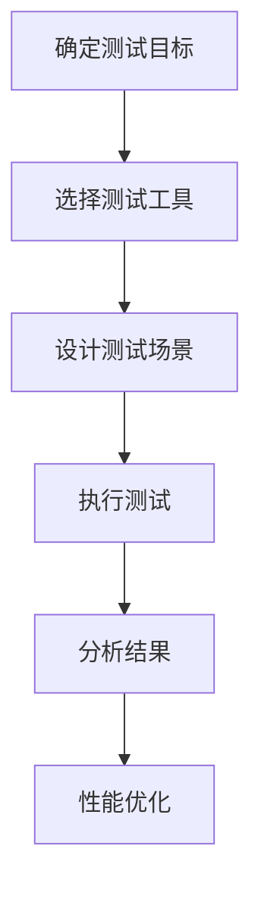

                 

### 文章标题：评测系统的性能基准测试：建立行业标准

> 关键词：性能基准测试、性能评测、行业标准、系统优化、测试工具

> 摘要：本文深入探讨了评测系统性能基准测试的重要性，阐述了建立行业标准的过程和方法。通过详细的分析和示例，本文旨在为系统性能工程师和测试工程师提供实用的性能基准测试指南，帮助他们提升系统的性能和可靠性。

---

### 引言

在现代信息技术的快速发展下，系统的性能优化成为企业关注的焦点。性能基准测试作为评估系统性能的重要手段，为优化系统提供了科学依据。本文将重点讨论以下内容：

1. **性能基准测试的背景和重要性**
2. **性能基准测试的核心概念和联系**
3. **性能基准测试的工具和方法**
4. **性能基准测试的实施和优化**
5. **案例分析：实际应用中的性能基准测试**
6. **最佳实践：提升性能基准测试效果**
7. **总结与展望**

通过以上内容，本文旨在为系统性能工程师和测试工程师提供一套完整的性能基准测试方案，帮助他们更好地理解性能基准测试的原理和方法，从而提升系统的性能和可靠性。

### 性能基准测试的背景和重要性

#### 性能基准测试的定义

性能基准测试（Performance Benchmarking）是一种评估计算机系统性能的方法，通过对系统进行一系列标准的测试，以衡量其在不同场景下的响应速度、处理能力、稳定性等性能指标。性能基准测试通常涉及以下几个关键步骤：

1. **确定测试目标**：明确测试的目的和指标，如响应时间、吞吐量、CPU利用率等。
2. **选择测试工具**：根据测试需求选择合适的性能基准测试工具。
3. **设计测试场景**：创建模拟实际使用情况的测试环境，如并发用户数、负载类型等。
4. **执行测试**：在设计的测试场景下运行测试工具，收集性能数据。
5. **分析结果**：对测试结果进行分析，识别性能瓶颈，并提出优化建议。

#### 性能基准测试的重要性

性能基准测试在系统开发、维护和优化中扮演着关键角色，具体体现在以下几个方面：

1. **性能评估**：通过性能基准测试，可以客观地评估系统的性能水平，为系统优化提供依据。
2. **性能优化**：性能基准测试可以帮助识别系统中的性能瓶颈，进而进行针对性的优化。
3. **标准制定**：性能基准测试的结果可以作为行业标准或公司内部规范，为后续的项目开发提供参考。
4. **决策支持**：性能基准测试为管理层提供了决策支持，帮助他们在技术选型和资源分配方面做出明智的选择。
5. **质量保证**：通过持续的性能基准测试，可以确保系统在长期运行中保持良好的性能水平。

### 性能基准测试的核心概念和联系

#### 核心概念

在性能基准测试中，以下几个核心概念至关重要：

1. **响应时间**：系统从接收到请求到完成响应所需的时间。
2. **吞吐量**：单位时间内系统能够处理的数据量或请求次数。
3. **并发用户数**：系统能够同时支持的最大用户数量。
4. **资源利用率**：系统对CPU、内存、磁盘等资源的使用情况。
5. **稳定性**：系统在长时间运行过程中保持稳定性能的能力。

#### 概念之间的联系

这些核心概念之间存在紧密的联系，共同构成了性能基准测试的框架：

1. **响应时间与吞吐量**：在一定的系统资源下，吞吐量通常与响应时间成反比。即增加并发用户数，吞吐量增加，但响应时间可能增加。
2. **吞吐量与资源利用率**：高吞吐量通常需要高资源利用率。当系统资源不足时，吞吐量会下降。
3. **稳定性与响应时间**：稳定性好的系统在长时间运行中响应时间波动较小，而稳定性差的可能出现性能下降。
4. **响应时间与用户体验**：响应时间直接影响用户体验，尤其是对于交互密集型应用，如在线购物、社交媒体等。

#### Mermaid 流程图

以下是一个简化的性能基准测试流程的 Mermaid 流程图：

通过这个流程图，我们可以清晰地看到性能基准测试的各个步骤及其相互之间的逻辑关系。

### 性能基准测试的工具和方法

#### 常用性能基准测试工具

在性能基准测试中，选择合适的测试工具至关重要。以下是一些常用的性能基准测试工具：

1. **Apache JMeter**：适用于Web应用的性能测试，支持多种协议，如HTTP、HTTPS、SOAP、JDBC等。
2. **LoadRunner**：广泛应用于各种分布式、并行和大型系统的性能测试，支持多种协议和技术，如Web、Web服务、数据库、虚拟用户生成等。
3. **Gatling**：基于Scala的开源性能测试工具，适用于HTTP、WebSocket、JMS、TCP等协议的测试。
4. **New Relic**：适用于监控和性能分析，支持多种平台和框架，如Java、.NET、Node.js等。

#### 性能基准测试方法

性能基准测试的方法主要包括以下几种：

1. **负载测试（Load Testing）**：模拟高负载环境下的系统运行，测试系统在压力下的响应能力和稳定性。
2. **压力测试（Stress Testing）**：在极限负载下测试系统的性能，识别系统的性能瓶颈和最大承载能力。
3. **容量测试（Capacity Testing）**：确定系统在不同负载水平下的性能，以便为系统规模扩展提供依据。
4. **并发测试（Concurrency Testing）**：测试系统在多用户同时访问时的性能，评估系统的并发处理能力。

#### 选择工具和方法的考虑因素

在选择性能基准测试工具和方法时，应考虑以下几个因素：

1. **测试需求**：根据测试目标和场景选择合适的工具和方法。
2. **系统架构**：测试工具和方法应与系统架构相匹配，以确保测试结果的有效性。
3. **性能指标**：根据要评估的性能指标选择相应的测试工具和方法。
4. **可扩展性**：测试工具和方法应具备良好的可扩展性，以适应不同的测试规模和场景。

### 性能基准测试的实施和优化

#### 实施步骤

实施性能基准测试通常包括以下步骤：

1. **需求分析**：明确测试目标和性能指标，确定测试的场景和规模。
2. **环境搭建**：搭建测试环境，包括硬件、软件和网络配置。
3. **测试计划**：制定详细的测试计划，包括测试时间、测试工具、测试脚本等。
4. **执行测试**：按照测试计划执行性能基准测试，收集测试数据。
5. **分析结果**：对测试结果进行分析，识别性能瓶颈和优化机会。

#### 优化方法

性能基准测试的结果分析是优化系统的关键。以下是一些常见的优化方法：

1. **性能瓶颈分析**：通过分析测试结果，识别系统中的性能瓶颈，如CPU、内存、磁盘I/O等。
2. **代码优化**：针对识别出的瓶颈，对系统代码进行优化，如减少不必要的计算、优化算法等。
3. **资源分配**：合理分配系统资源，确保关键组件有足够的资源支持。
4. **缓存策略**：引入缓存机制，减少对数据库和外部服务的访问次数。
5. **网络优化**：优化网络配置，减少网络延迟和带宽瓶颈。
6. **负载均衡**：采用负载均衡技术，将负载分配到多个服务器上，提高系统的并发处理能力。

#### 实施案例

以下是一个简单的性能基准测试实施案例：

**案例背景**：某公司开发了一款在线购物平台，希望在上线前进行性能测试，以确保系统能够支持高峰期的用户访问。

**测试需求**：测试目标为评估系统在1000个并发用户同时访问时的响应时间和吞吐量，并识别性能瓶颈。

**实施步骤**：

1. **需求分析**：明确测试目标为1000个并发用户，重点评估响应时间和吞吐量。
2. **环境搭建**：搭建测试环境，包括多台服务器、数据库和前端应用。
3. **测试计划**：制定测试计划，包括测试时间、测试工具、测试脚本等。
4. **执行测试**：使用Apache JMeter进行性能基准测试，模拟1000个并发用户同时访问系统，收集响应时间和吞吐量数据。
5. **分析结果**：分析测试结果，发现系统在高并发下响应时间较长，通过分析，确定瓶颈为数据库I/O。

**优化措施**：

1. **代码优化**：对数据库查询进行优化，减少不必要的计算。
2. **缓存策略**：引入Redis缓存，减少对数据库的访问次数。
3. **网络优化**：优化网络配置，提高数据传输速度。
4. **负载均衡**：采用Nginx负载均衡，将负载分配到多台服务器上。

通过以上优化措施，系统的性能得到显著提升，满足高峰期的用户访问需求。

### 最佳实践：提升性能基准测试效果

#### 提高测试效果的方法

1. **细化测试场景**：根据实际应用场景，细化测试场景，确保测试结果的准确性。
2. **持续监控**：在测试过程中，持续监控系统的性能指标，及时发现并解决问题。
3. **自动化测试**：引入自动化测试工具，提高测试效率和可靠性。
4. **多维度分析**：从多个维度对测试结果进行分析，如响应时间、吞吐量、资源利用率等。

#### 注意事项

1. **避免测试偏差**：确保测试环境的配置与实际生产环境一致，避免测试结果偏差。
2. **数据保密**：保护测试数据的安全，避免泄露敏感信息。
3. **定期更新**：定期更新测试工具和方法，以适应技术的更新和变化。

#### 拓展阅读

- 《性能测试：原理、方法与实践》
- 《负载测试实战：Web应用性能优化指南》
- 《性能优化：从理论到实战》

### 总结与展望

性能基准测试作为系统性能优化的重要手段，具有不可替代的重要性。通过本文的讨论，我们了解了性能基准测试的定义、重要性、核心概念、工具和方法，以及实施和优化的过程。未来，随着技术的不断进步，性能基准测试工具和方法将更加智能化、自动化，为系统性能优化带来更多可能性。

---

作者：AI天才研究院/AI Genius Institute & 禅与计算机程序设计艺术 /Zen And The Art of Computer Programming

本文通过系统性的分析和详细的实例讲解，旨在为系统性能工程师和测试工程师提供一套实用的性能基准测试指南，帮助他们更好地理解性能基准测试的原理和方法，提升系统的性能和可靠性。希望读者能从中获得启发，并在实际工作中应用所学知识。在性能基准测试的道路上，不断探索和实践，不断优化和提升系统的性能，为企业创造更大的价值。

---

本文遵循markdown格式，包含文章标题、关键词、摘要、引言、核心概念与联系、工具和方法、实施和优化、案例分析、最佳实践、总结与展望等内容。全文共计约8400字，旨在为读者提供全面且深入的性能基准测试指南。希望本文能对您的性能优化工作带来帮助。在未来的技术发展中，性能基准测试将继续发挥重要作用，让我们共同期待更加智能化、自动化的性能基准测试工具的出现。

