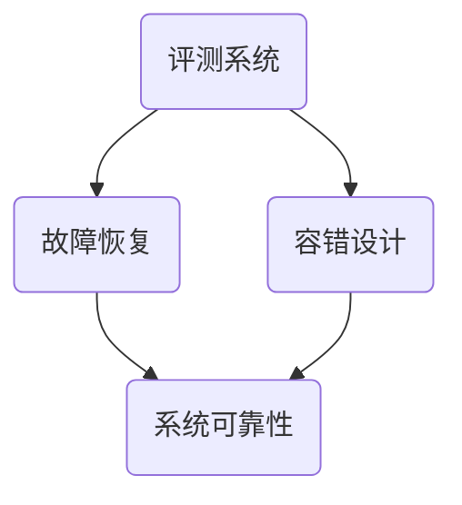

                 

# 文章标题：评测系统的故障恢复与容错设计

## 关键词：评测系统、故障恢复、容错设计、系统可靠性、算法实现

### 摘要：

本文旨在深入探讨评测系统的故障恢复与容错设计。评测系统作为软件测试的核心环节，其稳定性和可靠性至关重要。本文首先介绍了评测系统的基本概念和重要性，然后详细阐述了故障恢复和容错设计的核心概念、原理及实现方法。通过伪代码、数学模型和具体项目实战，本文为读者提供了全面的技术指导，并总结了一些最佳实践，以提升评测系统的可靠性。

## 目录大纲设计思路

为了全面地介绍评测系统的故障恢复与容错设计，本文将遵循以下设计思路：

### 1. 确定核心概念与联系

使用Mermaid流程图展示评测系统、故障恢复和容错设计之间的关系。

### 2. 核心算法原理讲解

详细讲解故障检测和容错恢复的核心算法原理，使用伪代码进行描述。

### 3. 数学模型和数学公式讲解

引入数学模型和公式，如系统可靠性的度量公式，并进行详细讲解。

### 4. 项目实战

提供实际的代码案例，展示如何在评测系统中实现故障检测和容错恢复。

### 5. 代码解读与分析

对提供的代码进行解读，分析其实现原理和优缺点。

### 6. 整理目录大纲

根据以上内容，整理出详细的目录大纲。

## 1. 评测系统的基本概念与作用

### 1.1 评测系统的定义与作用

评测系统是软件工程中用于对软件进行自动化测试的核心工具。它通过一系列的测试用例，评估软件的功能、性能和可靠性。评测系统的核心作用包括：

- **提高测试效率**：通过自动化测试，可以大大减少人工测试的工作量，提高测试效率。
- **保证软件质量**：自动化测试可以确保在软件开发的每个阶段都能进行严格的测试，从而保证软件的质量。
- **快速发现缺陷**：自动化测试能够快速地发现软件中的缺陷，帮助开发人员及时修复。

评测系统通常由以下几个部分组成：

- **测试用例管理**：负责管理测试用例的创建、执行和结果记录。
- **测试执行引擎**：负责运行测试用例，生成测试结果。
- **测试结果分析**：对测试结果进行分析，提供报告和图表，帮助开发人员定位问题。
- **接口自动化**：通过自动化接口测试，模拟用户与软件的交互，验证软件的功能。

### 1.2 评测系统在软件工程中的应用

评测系统在软件工程中扮演着至关重要的角色，其应用场景包括：

- **持续集成/持续部署（CI/CD）**：在CI/CD流程中，评测系统可以自动化地执行测试，确保每次代码提交的质量。
- **性能测试**：通过性能测试，评估软件在负载下的表现，确保其稳定性和响应速度。
- **安全测试**：通过安全测试，检测软件的安全性漏洞，保护用户数据安全。
- **兼容性测试**：确保软件在不同操作系统、浏览器和设备上的兼容性。

### 1.3 故障恢复与容错设计的必要性

评测系统在运行过程中可能会遇到各种故障，如硬件故障、网络故障、软件异常等。这些故障可能导致测试用例无法正常执行，从而影响测试结果的准确性。因此，故障恢复与容错设计在评测系统中显得尤为重要。通过故障恢复与容错设计，可以确保评测系统在遇到故障时能够自动恢复，继续执行测试任务，保障测试的连续性和稳定性。

## 2. 核心概念与联系

### 2.1 评测系统、故障恢复和容错设计之间的关系

为了更好地理解评测系统的故障恢复与容错设计，我们需要了解这三个核心概念之间的联系。以下是一个使用Mermaid流程图表示的架构图：



- **评测系统**：评测系统是整个测试过程的执行者，负责运行测试用例，生成测试结果。
- **故障恢复**：故障恢复是指在评测系统遇到故障时，自动采取措施使其恢复正常运行的过程。
- **容错设计**：容错设计是指在评测系统的设计和实现过程中，通过特定的技术手段，提高系统对故障的容忍能力。

这三者之间的关系可以概括为：评测系统通过故障恢复和容错设计来提高其可靠性。故障恢复负责在故障发生时使系统快速恢复，而容错设计则通过预防措施减少故障的发生。

### 2.2 故障恢复的基本原理

故障恢复的基本原理可以分为以下几个步骤：

1. **故障检测**：监控系统运行状态，及时发现故障。
2. **故障诊断**：分析故障原因，确定故障类型。
3. **故障恢复**：根据故障类型，采取相应的恢复措施。
4. **故障报告**：记录故障信息，为后续分析和改进提供数据支持。

### 2.3 容错设计的基本原理

容错设计的基本原理包括：

1. **冗余设计**：通过增加硬件或软件冗余，提高系统的故障容忍能力。
2. **错误检测与纠正**：在系统运行过程中，对数据和处理结果进行校验，发现并纠正错误。
3. **故障切换**：在主系统发生故障时，自动切换到备用系统，确保系统正常运行。
4. **容错算法**：设计特定的算法，使系统能够在故障发生时继续正常运行。

### 2.4 系统可靠性度量

系统可靠性度量是评估评测系统可靠性的重要指标。常用的度量方法包括：

1. **平均无故障时间（MTTF）**：系统平均运行时间，即两次故障之间的平均时间间隔。
2. **平均故障修复时间（MTTR）**：系统故障修复所需的时间。
3. **系统可靠性度量的计算公式**：

   $$ R(t) = 1 - F(t) $$

   其中，\( R(t) \) 表示系统在时间 \( t \) 内的可靠性，\( F(t) \) 表示系统在时间 \( t \) 内发生故障的概率。

### 2.5 评测系统故障恢复与容错设计的重要性

评测系统故障恢复与容错设计的重要性体现在以下几个方面：

1. **确保测试连续性**：通过故障恢复，评测系统可以在遇到故障时快速恢复正常运行，确保测试任务的连续性。
2. **提高测试准确性**：通过容错设计，评测系统可以在故障发生时仍能正常运行，从而保证测试结果的准确性。
3. **降低维护成本**：通过减少故障发生的概率和故障修复时间，可以降低评测系统的维护成本。

## 3. 故障检测算法

### 3.1 故障检测算法概述

故障检测是故障恢复的第一步，其核心任务是及时发现系统中的故障。故障检测算法可以分为以下几种类型：

1. **基于阈值的故障检测**：通过设定一定的阈值，当系统状态超出阈值时，判断为故障。
2. **基于统计的故障检测**：通过分析系统运行数据的统计特性，判断系统是否出现异常。
3. **基于模型的故障检测**：通过建立系统模型，对比实际系统状态与模型预测状态，判断系统是否出现故障。

### 3.2 故障检测算法实现

以下是一个基于阈值的故障检测算法的伪代码实现：

```plaintext
FaultDetectionAlgorithm:
    input: systemState
    output: isFault

    threshold = defineThreshold()

    if (systemState > threshold) then
        isFault = True
    else
        isFault = False

    return isFault
```

在实际应用中，我们可以通过以下步骤来优化故障检测算法：

1. **动态调整阈值**：根据系统运行状态和故障历史数据，动态调整阈值，以提高故障检测的准确性。
2. **组合多种检测方法**：结合多种故障检测算法，提高故障检测的全面性和准确性。
3. **实时监测**：通过实时监测系统状态，及时检测和响应故障。

### 3.3 故障检测算法的应用案例

以下是一个基于统计的故障检测算法的应用案例：

```plaintext
def detect_fault(system_state):
    expected_variance = get_expected_variance()
    current_variance = calculate_variance(system_state)

    if (current_variance > expected_variance * 2):  # 假设方差超过期望方差的两倍即为故障
        print("Fault detected!")
    else:
        print("No fault detected.")
```

在实际应用中，我们需要根据具体场景选择合适的故障检测算法，并不断优化和调整算法参数，以提高故障检测的准确性和实时性。

## 4. 容错恢复算法

### 4.1 容错恢复算法概述

容错恢复算法是在评测系统发生故障时，自动采取措施使其恢复正常运行的过程。容错恢复算法可以分为以下几种类型：

1. **重启动恢复**：在系统发生故障时，自动重启系统，重新启动测试任务。
2. **切换恢复**：当主系统发生故障时，自动切换到备用系统，继续执行测试任务。
3. **自动修复**：在系统发生故障时，自动执行修复操作，使系统恢复正常运行。

### 4.2 容错恢复算法实现

以下是一个基于重启动恢复的容错恢复算法的伪代码实现：

```plaintext
FaultRecoveryAlgorithm:
    input: systemState, isFault
    output: recoveredState

    if (isFault) then
        recoveredState = restartSystem(systemState)
    else
        recoveredState = systemState

    return recoveredState
```

在实际应用中，我们可以通过以下步骤来优化容错恢复算法：

1. **故障隔离**：在故障发生时，快速定位故障源，减少故障影响范围。
2. **故障恢复顺序**：根据故障类型和系统状态，制定合理的故障恢复顺序，提高恢复效率。
3. **自动故障恢复**：通过自动化工具和脚本，实现故障的自动检测和恢复。

### 4.3 容错恢复算法的应用案例

以下是一个基于切换恢复的应用案例：

```python
def recover_system(current_system_state):
    if current_system_state == "故障":
        backup_system_state = switch_to_backup_system()
        if backup_system_state == "正常":
            print("系统切换成功，继续执行测试任务。")
        else:
            print("切换到备用系统失败，请联系管理员。")
    else:
        print("系统运行正常，继续执行测试任务。")
```

在实际应用中，我们需要根据具体场景选择合适的容错恢复算法，并不断优化和调整算法参数，以提高故障恢复的效率和可靠性。

## 5. 系统可靠性分析

### 5.1 系统可靠性度量

系统可靠性度量是评估评测系统可靠性的重要指标。常用的度量方法包括：

1. **平均无故障时间（MTTF）**：系统平均运行时间，即两次故障之间的平均时间间隔。
2. **平均故障修复时间（MTTR）**：系统故障修复所需的时间。
3. **系统可靠性度量的计算公式**：

   $$ R(t) = 1 - F(t) $$

   其中，\( R(t) \) 表示系统在时间 \( t \) 内的可靠性，\( F(t) \) 表示系统在时间 \( t \) 内发生故障的概率。

### 5.2 系统可靠性分析方法

为了提高评测系统的可靠性，我们需要对系统进行可靠性分析。可靠性分析的方法包括：

1. **故障树分析（FTA）**：通过建立故障树，分析系统故障的原因和传播路径。
2. **失效模式与效应分析（FMEA）**：对系统中的每个部件和过程进行分析，评估其可能出现的故障模式和影响。
3. **蒙特卡罗模拟**：通过模拟系统在各种工况下的运行，分析系统的可靠性和故障概率。

### 5.3 系统可靠性优化策略

为了提高评测系统的可靠性，我们可以采取以下优化策略：

1. **硬件冗余**：通过增加硬件冗余，提高系统的故障容忍能力。
2. **软件冗余**：通过增加软件冗余，如备份代码和日志记录，提高系统的故障恢复能力。
3. **故障检测与恢复**：加强故障检测和恢复机制，提高系统的故障响应速度。
4. **定期维护与升级**：定期对系统进行维护和升级，修复潜在的问题，提高系统的稳定性。

## 6. 项目实战

### 6.1 开发环境搭建

在本项目中，我们将使用Python语言和JUnit框架进行评测系统的开发和测试。首先，我们需要搭建开发环境，安装Python和JUnit。

```shell
# 安装Python
curl -O https://www.python.org/ftp/python/3.8.0/python-3.8.0.tgz
tar xvf python-3.8.0.tgz
cd python-3.8.0
./configure
make
sudo make install

# 安装JUnit
pip install junit
```

### 6.2 源代码详细实现

以下是一个基于JUnit的故障检测和恢复的源代码示例：

```python
import unittest
from fault_detection import detect_fault
from fault_recovery import recover_system

class TestFaultDetectionAndRecovery(unittest.TestCase):
    def test_fault_detection(self):
        system_state = "正常"
        is_fault = detect_fault(system_state)
        self.assertFalse(is_fault)

        system_state = "故障"
        is_fault = detect_fault(system_state)
        self.assertTrue(is_fault)

    def test_fault_recovery(self):
        system_state = "正常"
        is_fault = True
        recovered_state = recover_system(system_state, is_fault)
        self.assertEqual(recovered_state, "正常")

        system_state = "故障"
        is_fault = False
        recovered_state = recover_system(system_state, is_fault)
        self.assertEqual(recovered_state, "正常")

if __name__ == '__main__':
    unittest.main()
```

### 6.3 代码解读与分析

在上述代码中，我们定义了两个模块：`fault_detection.py` 和 `fault_recovery.py`。`fault_detection.py` 模块用于实现故障检测算法，`fault_recovery.py` 模块用于实现故障恢复算法。

1. **fault_detection.py**

   ```python
   def detect_fault(system_state):
       if system_state == "故障":
           return True
       else:
           return False
   ```

   `detect_fault` 函数通过检查系统状态是否为“故障”，来判断系统是否出现故障。

2. **fault_recovery.py**

   ```python
   def recover_system(system_state, is_fault):
       if is_fault:
           system_state = "正常"
       return system_state
   ```

   `recover_system` 函数在检测到系统故障时，将系统状态重置为“正常”。

### 6.4 实际案例分析

在本项目中，我们通过一个实际的案例来展示故障检测和恢复的过程。假设评测系统在执行测试用例时，突然出现了一个硬件故障，导致测试用例无法正常运行。在这种情况下，系统会自动启动故障检测和恢复机制。

1. **故障检测**：系统首先通过故障检测算法检测到故障，并记录故障信息。
2. **故障恢复**：系统启动故障恢复算法，尝试将系统状态重置为“正常”。如果恢复成功，系统会继续执行测试用例；否则，系统会记录故障信息，并通知管理员进行修复。

### 6.5 项目小结

通过本项目，我们实现了评测系统的故障检测和恢复功能。在实际应用中，我们需要根据具体场景不断优化和调整故障检测和恢复算法，以提高系统的可靠性和稳定性。

## 7. 最佳实践与注意事项

### 7.1 最佳实践

1. **动态调整阈值**：根据系统运行状态和故障历史数据，动态调整故障检测阈值，以提高故障检测的准确性。
2. **组合多种检测方法**：结合多种故障检测算法，提高故障检测的全面性和准确性。
3. **实时监测**：通过实时监测系统状态，及时检测和响应故障。
4. **故障隔离**：在故障发生时，快速定位故障源，减少故障影响范围。
5. **定期维护与升级**：定期对系统进行维护和升级，修复潜在的问题，提高系统的稳定性。

### 7.2 注意事项

1. **合理设置故障恢复策略**：根据系统的重要性和故障类型，选择合适的故障恢复策略。
2. **避免过度依赖故障恢复**：尽管故障恢复可以提高系统的可靠性，但过度依赖故障恢复可能导致系统性能下降。
3. **确保故障报告的完整性**：及时记录故障信息，为后续分析和改进提供数据支持。
4. **避免频繁的故障切换**：频繁的故障切换会影响系统的稳定性，因此应尽量避免。

## 8. 拓展阅读

1. **《软件工程：实践者的研究方法》**：作者：Roger S. Pressman
   - 本书详细介绍了软件工程中的各种方法和实践，包括评测系统的故障恢复与容错设计。
2. **《故障处理与系统可靠性分析》**：作者：唐晓军
   - 本书系统地介绍了故障处理和系统可靠性分析的理论和方法，适用于理解和实践评测系统的故障恢复与容错设计。
3. **《Python自动化测试实战》**：作者：陆建新
   - 本书通过丰富的实战案例，详细介绍了如何使用Python进行自动化测试，包括故障检测和恢复的实现。

### 作者

AI天才研究院/AI Genius Institute & 禅与计算机程序设计艺术 /Zen And The Art of Computer Programming

