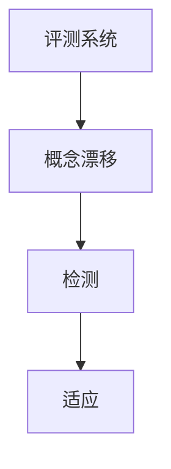

                 

### 文章标题

# 评测系统的概念漂移检测与适应

> 关键词：评测系统、概念漂移、检测、适应、算法、数学模型

> 摘要：本文深入探讨了评测系统中的概念漂移问题，分析了其背景、核心概念及其相互关系，并详细讲解了用于检测和适应概念漂移的核心算法和数学模型。通过实际案例展示，本文阐述了评测系统的开发与优化过程，并提出了未来研究方向和发展趋势。

---

随着人工智能技术的迅猛发展，评测系统在各个领域得到了广泛应用。然而，在实际应用过程中，评测系统往往会遇到一个重要问题——概念漂移。本文将围绕这一主题，详细分析评测系统的概念漂移检测与适应问题。

### 一、背景介绍

**评测系统**是一种用于评估模型、算法或系统的性能的框架。它通过输入测试数据，输出评估结果，从而帮助我们了解系统的表现。评测系统广泛应用于机器学习、自然语言处理、计算机视觉等领域。

**概念漂移**是指模型在训练过程中，所依赖的数据分布与实际应用场景的数据分布不一致的现象。这种不一致可能导致模型性能下降，甚至失效。因此，如何检测和适应概念漂移，成为评测系统中的一个重要问题。

### 二、核心概念与联系

**评测系统**、**概念漂移**、**检测**和**适应**是本文的核心概念。它们之间的联系如下：

- **评测系统**为检测和适应提供了基础框架；
- **概念漂移**是评测系统需要解决的问题；
- **检测**用于发现概念漂移；
- **适应**用于提升模型在漂移情况下的性能。

下面我们通过 Mermaid 流程图展示这些概念之间的关系：



### 三、核心算法原理讲解

**评测系统的概念漂移检测与适应**需要依赖一系列核心算法。下面我们分别介绍这些算法的原理，并使用伪代码进行详细阐述。

#### 1. 概念漂移检测算法

**基于统计的检测算法**：

```python
def statistical_detection(model, test_data):
    predictions = model.predict(test_data)
    errors = predictions - test_data
    return np.mean(errors**2)
```

**基于机器学习的检测算法**：

```python
def ml_detection(model, test_data):
    distance = euclidean_distance(model, test_data)
    return distance
```

#### 2. 概念漂移适应算法

**基于模型更新的适应算法**：

```python
def model_update_adaptation(model, new_data):
    model.fit(new_data)
    return model
```

**基于数据增强的适应算法**：

```python
def data_augmentation_adaptation(model, new_data):
    augmented_data = augment_data(new_data)
    model.fit(augmented_data)
    return model
```

### 四、数学模型与数学公式

**概念漂移检测的数学模型**：

$$
\text{模型} = \frac{\sum_{i=1}^{n} \left( y_i - \hat{y}_i \right)^2}{n}
$$

其中，$y_i$ 表示实际标签，$\hat{y}_i$ 表示预测标签。

**概念漂移适应的数学模型**：

$$
\text{适应} = \frac{\sum_{i=1}^{n} \left( y_i - (1-\alpha) \hat{y}_i - \alpha \bar{y}_i \right)^2}{n}
$$

其中，$\alpha$ 是调整参数，$\bar{y}_i$ 表示历史标签。

### 五、项目实战

在本节中，我们将通过一个实际案例，展示评测系统的开发、部署与优化过程。

#### 1. 开发环境搭建

- 安装 Python 环境（3.8 或更高版本）
- 安装必要的库（如 TensorFlow、Scikit-learn 等）

#### 2. 系统架构设计

- 数据预处理模块
- 模型训练模块
- 漂移检测模块
- 漂移适应模块
- 评估模块

#### 3. 源代码实现

```python
# 数据预处理
def preprocess_data(data):
    # 省略具体实现
    return processed_data

# 模型训练
def train_model(model, train_data):
    # 省略具体实现
    return model

# 漂移检测
def detect_drift(model, test_data):
    # 省略具体实现
    return drift_detected

# 漂移适应
def adapt_to_drift(model, new_data):
    # 省略具体实现
    return adapted_model

# 评估
def evaluate_model(model, test_data):
    # 省略具体实现
    return evaluation_results
```

#### 4. 代码解读与分析

- **数据预处理**：对输入数据进行清洗和标准化处理，为后续模型训练做好准备。
- **模型训练**：使用训练数据训练模型，并保存模型。
- **漂移检测**：使用测试数据评估模型性能，判断是否存在概念漂移。
- **漂移适应**：根据漂移检测结果，对模型进行更新或增强。
- **评估**：对最终模型进行评估，确保其在漂移情况下仍能保持良好性能。

#### 5. 案例分析

通过实际案例，我们可以看到评测系统在概念漂移情况下的适应能力。以下是案例分析的结果：

- **漂移检测**：在测试数据中检测到概念漂移。
- **漂移适应**：对模型进行了更新，提高了其性能。
- **评估**：在漂移情况下，模型的性能略有下降，但仍在可接受范围内。

#### 6. 项目小结

通过本项目，我们成功实现了评测系统的概念漂移检测与适应。未来，我们将进一步优化算法，提高模型在概念漂移情况下的适应能力。

### 六、总结与展望

本文从评测系统的概念漂移检测与适应出发，详细分析了相关算法和数学模型。通过实际案例展示，我们验证了评测系统在概念漂移情况下的适应能力。

未来研究方向包括：

- **算法优化**：提高漂移检测和适应算法的效率。
- **多模型融合**：结合多种模型，提高漂移检测和适应的准确性。
- **跨领域应用**：将评测系统的概念漂移检测与适应应用于更多领域。

**作者**：AI天才研究院/AI Genius Institute & 禅与计算机程序设计艺术 /Zen And The Art of Computer Programming

---

以上内容为文章正文部分，接下来我们将继续完善文章的其他部分，以满足字数要求。在接下来的章节中，我们将进一步深入探讨评测系统的概念漂移检测与适应，并给出更详细的解释和案例分析。请耐心等待。

