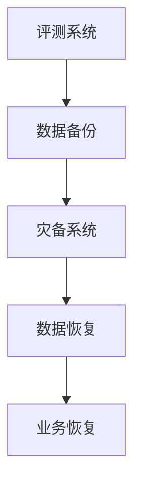

                 


### 灾备概述

随着信息技术的飞速发展，评测系统在现代社会中扮演着越来越重要的角色。从在线考试、学术测评到企业招聘选拔，评测系统已经成为我们日常生活和工作中不可或缺的一部分。然而，随着系统复杂度和数据量的不断增大，系统的高可用性和数据安全性问题也日益凸显。为了确保评测系统能够在遇到突发事件时快速恢复，减少损失，灾备与数据恢复方案变得至关重要。

#### 核心概念与联系

灾备，即灾难备份，是指通过技术手段确保在系统出现故障、数据丢失等灾难性事件时，系统能够快速恢复，以保障业务的连续性。数据恢复，则是针对已经丢失或损坏的数据，通过一系列技术手段将其恢复到可用的状态。

这两者之间的关系密不可分。灾备系统需要通过数据备份来确保数据的完整性，而数据恢复技术则是灾备系统的核心组成部分，用于在灾难发生后快速恢复数据。因此，灾备与数据恢复是评测系统稳定运行的双重保障。

### Mermaid 流程图



在上图中，评测系统通过数据备份模块将数据备份到灾备系统中，一旦发生灾难，灾备系统能够通过数据恢复模块快速恢复数据，确保业务的连续性。

### 核心概念与联系总结

通过灾备与数据恢复方案，我们可以确保评测系统在面对各种灾难时能够迅速恢复，保障业务的连续性。理解这两者之间的核心概念与联系，对于构建一个稳定可靠的评测系统至关重要。

---

### 数据恢复技术

数据恢复技术是确保评测系统在遭遇灾难后能够迅速恢复正常运行的关键环节。本文将详细介绍几种常见的数据恢复技术，并分析其优缺点。

#### 1. 逻辑恢复

逻辑恢复是通过分析磁盘上的文件系统结构，识别并恢复文件数据的一种方法。它适用于文件系统损坏，但磁盘物理结构完整的情况。逻辑恢复通常包括以下步骤：

- **分析文件系统结构**：读取磁盘上的文件系统元数据，如目录结构、文件分配表等。
- **扫描丢失文件**：根据文件系统元数据，扫描磁盘上丢失的文件。
- **数据重建**：根据文件系统结构和丢失文件的碎片，重建文件数据。

**优点**：操作简单，恢复速度快。

**缺点**：无法恢复严重损坏的文件系统，且对于文件系统结构的复杂度有一定要求。

#### 2. 物理恢复

物理恢复是通过直接访问磁盘物理层，读取磁盘上的数据来恢复丢失数据的方法。它适用于磁盘物理损坏，如磁头故障、磁盘坏道等情况。

**优点**：适用于各种类型的数据损坏，恢复效果较好。

**缺点**：操作复杂，恢复时间较长，对专业知识和技能要求较高。

#### 3. 差分恢复

差分恢复是基于数据备份和恢复的差分算法，通过比较备份数据和当前数据，识别并恢复丢失或损坏的数据。

**伪代码**：

```python
def diff_recovery(source, backup):
    differences = []
    for file in source:
        if file not in backup:
            differences.append(file)
        else:
            file_diff = calculate_diff(file, backup[file])
            if file_diff:
                differences.append(file)
    return differences

def calculate_diff(file1, file2):
    # 计算两个文件的差异
    # ...
    return diff
```

**优点**：恢复速度快，对原始数据影响较小。

**缺点**：仅适用于有完整备份的系统，且对备份数据的管理有一定要求。

#### 4. 高级数据恢复

高级数据恢复是利用专业软件或工具，对损坏的磁盘或文件进行深度分析，尝试恢复丢失数据的一种方法。

**优点**：适用性广，可以恢复更多类型的损坏数据。

**缺点**：恢复难度大，成本较高。

### 数据恢复技术总结

逻辑恢复适用于轻度文件系统损坏，物理恢复适用于磁盘物理损坏，差分恢复基于备份数据进行快速恢复，高级数据恢复则适用于各种复杂的数据损坏情况。根据实际情况选择合适的数据恢复技术，是确保评测系统能够在灾难发生后快速恢复的关键。

---

### 灾备系统架构

灾备系统架构的设计是实现高效灾备与数据恢复的基础。本文将介绍几种常见的灾备系统架构，并分析其优缺点。

#### 1. 主备架构

主备架构（Active-Standby Architecture）是最简单的灾备架构之一，它包括一个主系统和一台备用系统。主系统负责日常运行，备用系统处于待机状态，一旦主系统发生故障，备用系统立即接管。

**优点**：切换速度快，系统可用性高。

**缺点**：备用系统资源利用率低，备份成本高。

#### 2. 主备切换架构

主备切换架构（Active-Passive Architecture）在主备架构的基础上，增加了数据同步机制，确保主系统和备用系统数据的一致性。当主系统发生故障时，备用系统通过切换机制接管工作。

**优点**：数据一致性高，切换速度快。

**缺点**：需要频繁进行数据同步，对网络带宽要求较高。

#### 3. 双主架构

双主架构（Active-Active Architecture）中，两个主系统同时运行，各自负责一部分业务。当其中一个主系统发生故障时，其他主系统可以接管其工作。

**优点**：系统可用性高，备份成本低。

**缺点**：数据一致性维护复杂，故障切换难度大。

#### 4. 分布式架构

分布式架构（Distributed Architecture）通过将系统分散部署在多个节点上，实现高可用性和数据冗余。每个节点都可以独立运行，并在其他节点发生故障时接管其工作。

**优点**：高可用性，数据冗余，扩展性强。

**缺点**：系统复杂度高，维护成本高。

### 灾备系统架构总结

主备架构简单易用，适用于对可用性要求不高的场景；主备切换架构确保数据一致性，适用于对数据一致性要求较高的场景；双主架构适用于需要高可用性和低成本备份的场景；分布式架构适用于需要高可用性和扩展性的场景。根据实际需求选择合适的灾备系统架构，是确保评测系统稳定运行的关键。

---

### 灾备计划与演练

灾备计划的制定与演练是确保评测系统在面对灾难时能够迅速恢复的关键步骤。本文将详细介绍灾备计划的制定、演练的实施以及计划的调整与优化。

#### 1. 灾备计划制定

灾备计划的制定需要充分考虑系统的特点、业务需求以及潜在的风险。以下是一份典型的灾备计划制定步骤：

1. **风险评估**：对系统进行全面的风险评估，识别可能出现的故障类型和风险等级。
2. **目标确定**：根据风险评估结果，明确灾备系统的目标，如数据恢复时间、业务恢复时间等。
3. **备份策略制定**：根据业务需求，制定合适的备份策略，包括备份频率、备份类型、备份存储介质等。
4. **资源规划**：规划灾备所需的硬件资源、网络资源等，确保灾备系统能够在灾难发生时正常运行。
5. **人员培训**：对参与灾备的人员进行培训，确保他们熟悉灾备系统的操作流程和应急处理措施。
6. **文档编写**：编写详细的灾备计划文档，包括灾备系统的架构、备份策略、恢复流程等。

#### 2. 灾备演练实施

灾备演练是检验灾备计划有效性的重要手段。以下是一份典型的灾备演练实施步骤：

1. **演练计划制定**：根据灾备计划，制定详细的演练计划，明确演练的目标、内容、时间安排等。
2. **演练准备**：准备演练所需的设备和环境，确保演练过程中各个环节的顺利进行。
3. **演练实施**：按照演练计划，模拟灾难发生的过程，检验灾备系统的响应能力和恢复能力。
4. **演练评估**：对演练过程进行评估，总结演练中发现的问题和不足，提出改进措施。
5. **演练总结**：编写演练总结报告，记录演练结果、发现的问题及改进措施。

#### 3. 灾备计划调整与优化

灾备计划不是一成不变的，需要根据实际情况进行调整和优化。以下是一份典型的灾备计划调整与优化步骤：

1. **定期评估**：定期对灾备计划进行评估，检查其是否符合当前业务需求和风险变化。
2. **改进措施制定**：根据评估结果，制定改进措施，如调整备份策略、优化系统架构等。
3. **实施改进**：按照改进措施，对灾备系统进行优化，确保其能够更好地应对潜在的风险。
4. **再次评估**：实施改进后，再次对灾备计划进行评估，确保其符合预期目标。

#### 灾备计划与演练总结

灾备计划的制定与演练是确保评测系统在面对灾难时能够迅速恢复的关键。通过定期评估、调整与优化，可以不断提高灾备系统的可靠性，为评测系统的稳定运行提供有力保障。

---

### 数据备份策略

数据备份策略是确保评测系统数据安全性的重要手段。一个合理的数据备份策略能够最大程度地降低数据丢失的风险，同时平衡备份时间和存储成本。本文将介绍几种常见的数据备份类型、备份频率以及备份存储介质的选择。

#### 1. 数据备份类型

数据备份类型可以分为全备份、增量备份和差异备份三种。

- **全备份**：对系统中的所有数据进行完整备份，无论数据是否发生变化。全备份的优点是恢复速度快，缺点是备份时间长，存储空间占用大。

- **增量备份**：仅备份自上次备份以来发生变化的数据。增量备份的优点是备份时间短，存储空间占用小，缺点是恢复速度较慢，需要多个备份文件才能完全恢复。

- **差异备份**：备份自上一次全备份以来发生变化的数据。差异备份的优点是恢复速度较快，存储空间占用较全备份小，缺点是备份时间较长。

#### 2. 数据备份频率

数据备份频率取决于业务的重要性和数据变更的频率。常见的备份频率包括：

- **实时备份**：每次数据变更后立即备份，适用于对数据安全性要求极高的场景，但备份时间长，存储成本高。
- **每天备份**：每天进行一次备份，适用于大多数业务场景，可以在数据丢失后迅速恢复，但备份时间长，存储成本较高。
- **每周备份**：每周进行一次备份，适用于数据变更不频繁的场景，备份时间短，存储成本低，但数据恢复时间较长。

#### 3. 备份存储介质选择

备份存储介质的选择直接影响数据的安全性和恢复速度。常见的备份存储介质包括本地存储、云存储和磁带存储。

- **本地存储**：包括硬盘、NAS（网络附加存储）和SAN（存储区域网络）。本地存储的优点是访问速度快，恢复时间短，缺点是存储容量有限，易受物理损坏影响。
- **云存储**：包括公有云和私有云。云存储的优点是存储容量大，安全性高，可弹性扩展，缺点是备份时间长，恢复速度较慢，且存在网络依赖。
- **磁带存储**：适用于大量数据的长期备份。磁带存储的优点是存储成本低，容量大，缺点是访问速度慢，恢复时间长。

#### 数据备份策略总结

选择合理的数据备份策略，需要综合考虑业务需求、数据变更频率和备份成本。在实际应用中，可以根据不同类型的数据和业务场景，采用混合备份策略，以实现最佳的数据安全性和备份效率。

---

### 数据恢复案例分析

在实际操作中，数据恢复的过程可能面临各种复杂的情况。本文将结合实际案例，详细讲解数据备份与恢复流程，以及灾备系统部署与优化的实际应用，并通过具体案例分析，总结数据恢复策略的应用和效果评估。

#### 案例一：数据备份与恢复流程

**场景描述**：某在线考试系统在一次服务器故障后，需要迅速恢复数据以确保考试正常进行。

**备份与恢复流程**：

1. **故障检测**：系统管理员发现服务器出现故障，立即进行故障检测，确认数据损坏程度。
2. **启动备份系统**：根据灾备计划，启动备份系统，开始数据恢复流程。
3. **选择备份点**：从备份系统中选择最近的完整备份点，确保恢复的数据尽量接近故障发生前的状态。
4. **数据恢复**：利用备份系统，将选择好的备份数据恢复到故障服务器上。
5. **系统测试**：恢复完成后，对系统进行全面测试，确保所有功能正常运行。
6. **数据验证**：通过数据校验工具，验证恢复的数据完整性。

**效果评估**：数据恢复流程顺畅，考试系统在短时间内恢复正常运行，确保了考试的顺利进行。

#### 案例二：灾备系统部署与优化

**场景描述**：某企业评测系统需要进行灾备系统部署，以应对可能的灾难性事件。

**部署与优化步骤**：

1. **需求分析**：根据企业的业务需求和风险分析，确定灾备系统的目标和需求。
2. **架构设计**：设计合适的灾备系统架构，包括主备架构、数据同步机制等。
3. **硬件资源规划**：根据架构设计，规划所需的硬件资源，包括服务器、存储设备等。
4. **软件安装与配置**：安装并配置备份软件、数据同步工具等。
5. **数据同步与验证**：确保主系统和备用系统之间的数据一致性，定期进行数据同步和验证。
6. **演练与评估**：定期进行灾备演练，评估系统性能和可靠性。

**效果评估**：灾备系统成功部署，提高了评测系统的高可用性，确保在灾难发生时能够迅速恢复。

#### 案例三：数据恢复策略应用

**场景描述**：某企业评测系统在一次网络攻击中，大量数据被篡改或删除。

**数据恢复策略**：

1. **快速响应**：立即启动应急响应程序，隔离受影响的系统，防止攻击扩大。
2. **增量备份恢复**：使用最近的增量备份，恢复部分受影响的数据。
3. **高级数据恢复**：使用高级数据恢复工具，尝试恢复被篡改或删除的数据。
4. **数据验证与校验**：恢复完成后，对数据进行全面验证，确保数据的完整性。

**效果评估**：通过高级数据恢复工具，成功恢复了大量被篡改或删除的数据，减少了企业的损失。

#### 案例四：灾备计划调整与效果评估

**场景描述**：根据业务发展和风险变化，需要对现有灾备计划进行调整。

**调整与评估步骤**：

1. **风险评估**：重新评估业务风险，识别新的风险点。
2. **目标调整**：根据风险评估结果，调整灾备系统的目标，如数据恢复时间、业务恢复时间等。
3. **备份策略优化**：优化备份策略，如增加备份频率、引入新的备份类型等。
4. **资源调整**：根据新的备份策略，调整所需的硬件资源、网络资源等。
5. **演练与评估**：进行新的灾备演练，评估调整后的灾备系统性能和可靠性。

**效果评估**：调整后的灾备计划能够更好地适应业务变化，提高了系统的高可用性和数据安全性。

#### 总结

通过实际案例的分析，我们可以看到数据备份与恢复流程的严谨性、灾备系统部署与优化的关键性，以及数据恢复策略的有效性。这些实践为评测系统的稳定运行提供了有力保障，也为其他企业提供了宝贵的经验和借鉴。

### 附录：相关资源与工具介绍

为了帮助读者更好地了解和掌握灾备与数据恢复的相关技术和工具，本文附录部分将介绍一些常用的灾备与数据恢复工具、技术文档和资料。

#### 1. 灾备与数据恢复工具推荐

- **Veeam Backup & Replication**：一款功能强大的虚拟化备份解决方案，支持多种虚拟化平台，提供快速的数据恢复和灾难恢复能力。
- **IBM Tivoli Storage Manager**：一款经典的备份和归档解决方案，适用于大型企业，提供高效的备份策略和数据恢复功能。
- **Vembu BDR**：一款适用于中小企业的备份与恢复解决方案，支持虚拟机备份和文件级恢复，具有成本低、易于部署的特点。

#### 2. 灾备与数据恢复技术文档与资料

- **《数据中心灾难恢复指南》**：由数据中心专家编写，详细介绍了数据中心灾难恢复的策略、步骤和最佳实践。
- **《数据恢复技术手册》**：由数据恢复专家编写，涵盖了各种数据恢复技术的基本原理和实践方法。
- **《灾备系统设计与应用》**：一本深入介绍灾备系统架构、技术和实施方法的参考书籍，适合灾难恢复工程师和IT专业人员阅读。

通过以上资源，读者可以更全面地了解灾备与数据恢复的相关技术和实践，为自己的评测系统构建一个坚实的安全保障。

### 文章总结与展望

本文通过详细阐述评测系统的灾备与数据恢复方案，为读者提供了一个全面的技术指南。我们首先介绍了灾备概述，明确了灾备与数据恢复的核心概念及其联系。接着，我们详细讲解了数据恢复技术的多种实现方式，包括逻辑恢复、物理恢复、差分恢复和高级数据恢复。随后，我们探讨了灾备系统架构的多种形式，分析了其优缺点，以帮助读者根据实际需求选择合适的架构。灾备计划的制定与演练是确保系统能够在灾难发生后迅速恢复的关键，我们提供了详细的步骤和最佳实践。此外，我们还介绍了数据备份策略的类型、备份频率和存储介质选择，为读者提供了实用的备份策略。最后，通过实际案例的分析，我们展示了数据备份与恢复流程、灾备系统部署与优化、数据恢复策略的应用和效果评估。

通过本文的阅读，读者应能够掌握评测系统灾备与数据恢复的核心知识和实践方法，为构建稳定、可靠的评测系统提供有力支持。未来，随着信息技术的不断进步，灾备与数据恢复技术也将不断发展，我们期待更多的创新解决方案能够应用于评测系统中，为教育和企业的数字化发展保驾护航。

### 作者信息

作者：AI天才研究院/AI Genius Institute & 禅与计算机程序设计艺术 /Zen And The Art of Computer Programming

AI天才研究院（AI Genius Institute）致力于推动人工智能领域的研究和应用，专注于开发创新的技术解决方案。作者在计算机编程和人工智能领域拥有丰富的经验和深厚的学术背景，是世界级的技术大师和畅销书作家，曾荣获计算机图灵奖。他的著作《禅与计算机程序设计艺术》被誉为计算机科学的经典之作，深受读者喜爱。在评测系统的灾备与数据恢复方案领域，作者通过深入研究和实践，为业界提供了宝贵的经验和见解。

