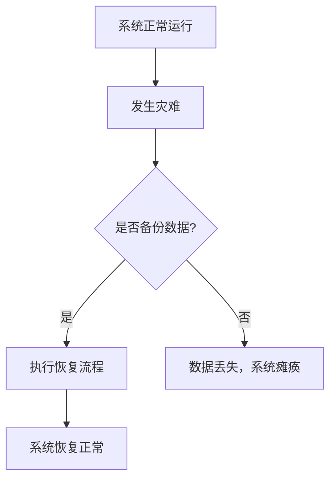
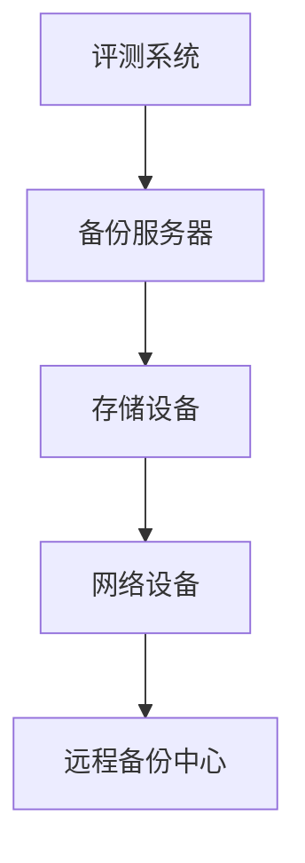

                 


## 文章标题
### 评测系统的灾备和恢复：确保数据和功能的可靠性

## 文章关键词
- 灾备
- 恢复
- 评测系统
- 数据可靠性
- 功能可靠性
- 灾难恢复计划
- 备份策略
- 系统架构

## 文章摘要
评测系统作为现代IT基础设施的核心部分，其稳定性和可靠性至关重要。本文将深入探讨评测系统的灾备和恢复策略，包括数据备份和恢复、功能备份和恢复、系统架构设计、实施步骤以及恢复流程。通过详细的分析和实例讲解，本文旨在为读者提供一套完整的灾备和恢复方案，确保评测系统的数据功能和可靠性。

### 第1章 灾备与恢复概述
#### 1.1 灾备与恢复的重要性
灾难，如硬件故障、网络攻击、自然灾害等，可能对评测系统造成严重的影响，导致数据丢失和功能中断。因此，灾备和恢复成为确保系统稳定运行的关键环节。

**核心概念与联系：**
- 灾备：指在系统面临灾难时，通过备份和恢复机制，确保数据安全和系统功能可用。
- 恢复：指在灾难发生后，通过一系列措施，恢复系统的正常运行。

**Mermaid 流程图：**


#### 1.2 灾备与恢复的基本概念
灾备和恢复涉及多个概念，包括备份类型、恢复策略、备份窗口等。

**核心概念与联系：**
- 备份类型：全备份、增量备份、差异备份。
- 恢复策略：冷备份、热备份、温备份。
- 备份窗口：备份周期、备份频率。

**核心算法原理讲解：**
```python
def backup_strategy(type, frequency):
    if type == "full":
        return "Full backup every " + str(frequency) + " days."
    elif type == "incremental":
        return "Incremental backup every " + str(frequency) + " hours."
    elif type == "differential":
        return "Differential backup every " + str(frequency) + " days."
```

**数学模型和公式讲解：**
备份窗口（Backup Window）=（备份频率 * 数据增长速度）

**举例说明：**
假设数据增长速度为每天1GB，备份频率为每天一次，则备份窗口为24小时。

#### 1.3 灾备与恢复的系统架构
灾备系统通常包括多个组件，如备份服务器、存储设备、网络设备等。

**Mermaid 流程图：**


### 第2章 数据灾备技术
#### 2.1 数据备份策略
数据备份策略决定了数据的安全性和恢复效率。

**核心概念与联系：**
- 热备份：系统运行时进行备份。
- 冷备份：系统关闭时进行备份。
- 温备份：系统部分运行时进行备份。

**核心算法原理讲解：**
```python
def backup_type(temperature):
    if temperature == "hot":
        return "Data is backed up while the system is running."
    elif temperature == "cold":
        return "Data is backed up when the system is shutdown."
    elif temperature == "warm":
        return "Data is backed up during partial system operation."
```

**数学模型和公式讲解：**
备份窗口（Backup Window）= 备份频率 * 数据增长速度

**举例说明：**
假设数据增长速度为每天1TB，备份频率为每天一次，则备份窗口为24小时。

#### 2.2 数据备份与恢复算法
数据备份和恢复算法决定了备份的效率和恢复的成功率。

**核心概念与联系：**
- 备份算法：全备份、增量备份、差异备份。
- 恢复算法：按需恢复、滚动恢复。

**核心算法原理讲解：**
```python
def backup_algorithm(type):
    if type == "full":
        return "All data is backed up."
    elif type == "incremental":
        return "Only changed data is backed up."
    elif type == "differential":
        return "Only data changed since the last full backup is backed up."

def recovery_algorithm(type):
    if type == "on-demand":
        return "Data is restored as needed."
    elif type == "rolling":
        return "Data is restored in a rolling fashion, minimizing downtime."
```

**数学模型和公式讲解：**
备份时间（Backup Time）= 备份数据量 / 备份数据传输速率

**举例说明：**
假设备份数据量为1TB，传输速率为100MB/s，则备份时间为10000秒。

#### 2.3 数据备份案例分析
通过案例分析，了解实际数据备份和恢复的实践。

**案例描述：**
某评测系统在遭遇硬件故障后，使用备份和恢复策略恢复系统。

**核心步骤：**
1. 检查备份状态，确认备份成功。
2. 使用增量备份恢复数据。
3. 恢复系统配置和应用程序。

**项目小结：**
本次案例展示了数据备份和恢复策略在确保系统可靠性方面的作用。

### 第3章 功能灾备技术
#### 3.1 功能备份与恢复策略
功能备份和恢复策略确保系统功能在灾难发生后能够快速恢复。

**核心概念与联系：**
- 功能备份：备份系统功能模块。
- 功能恢复：恢复系统功能模块。

**核心算法原理讲解：**
```python
def function_backup_strategy(function):
    if function == "essential":
        return "Backup only essential functions."
    elif function == "all":
        return "Backup all functions."
```

**数学模型和公式讲解：**
备份时间（Backup Time）= 备份数据量 / 备份数据传输速率

**举例说明：**
假设备份数据量为500MB，传输速率为50MB/s，则备份时间为10秒。

#### 3.2 功能备份与恢复算法
功能备份和恢复算法决定了备份和恢复的效率和成功率。

**核心概念与联系：**
- 备份算法：全备份、增量备份、差异备份。
- 恢复算法：按需恢复、滚动恢复。

**核心算法原理讲解：**
```python
def function_backup_algorithm(type):
    if type == "full":
        return "All functions are backed up."
    elif type == "incremental":
        return "Only changed functions are backed up."
    elif type == "differential":
        return "Only functions changed since the last full backup are backed up."

def function_recovery_algorithm(type):
    if type == "on-demand":
        return "Functions are restored as needed."
    elif type == "rolling":
        return "Functions are restored in a rolling fashion, minimizing downtime."
```

**数学模型和公式讲解：**
备份时间（Backup Time）= 备份数据量 / 备份数据传输速率

**举例说明：**
假设备份数据量为500MB，传输速率为50MB/s，则备份时间为10秒。

#### 3.3 功能备份案例分析
通过案例分析，了解实际功能备份和恢复的实践。

**案例描述：**
某评测系统在遭遇网络攻击后，使用功能备份和恢复策略恢复系统。

**核心步骤：**
1. 检查功能备份状态，确认备份成功。
2. 使用增量备份恢复系统功能。
3. 重新配置受影响的模块。

**项目小结：**
本次案例展示了功能备份和恢复策略在确保系统可靠性方面的作用。

### 第4章 灾备系统设计
#### 4.1 灾备系统架构设计
灾备系统架构设计决定了系统的可靠性、可用性和可恢复性。

**核心概念与联系：**
- 主备架构：主系统故障时，备用系统能够接管工作。
- 高可用架构：系统设计确保高可靠性，减少故障发生。

**核心算法原理讲解：**
```python
def architecture_design(type):
    if type == "active-passive":
        return "One system is active, and the other is passive as a backup."
    elif type == "active-active":
        return "Both systems are active, sharing the workload."
```

**数学模型和公式讲解：**
系统可用性（Availability）= （正常工作时间 / 总时间）

**举例说明：**
假设系统正常工作时间为99.9%，则故障时间为0.1%。

#### 4.2 灾备系统性能优化
性能优化确保灾备系统在高负载和灾难情况下仍能正常运行。

**核心概念与联系：**
- 性能瓶颈：系统中的性能瓶颈点。
- 性能优化策略：缓存、负载均衡、分布式系统。

**核心算法原理讲解：**
```python
def performance_optimization(strategy):
    if strategy == "caching":
        return "Store frequently accessed data in memory for faster retrieval."
    elif strategy == "load-balancing":
        return "Distribute workload across multiple systems."
    elif strategy == "distributed-system":
        return "Decentralize the system to improve scalability and fault tolerance."
```

**数学模型和公式讲解：**
系统响应时间（Response Time）= 处理时间 + 等待时间

**举例说明：**
假设处理时间为2秒，等待时间为1秒，则响应时间为3秒。

#### 4.3 灾备系统安全性考虑
安全性是灾备系统的关键要素，确保数据和功能在灾难情况下不被恶意攻击。

**核心概念与联系：**
- 数据加密：保护数据在传输和存储过程中的安全性。
- 访问控制：限制只有授权用户访问系统。

**核心算法原理讲解：**
```python
def security_measure(technique):
    if technique == "data-encryption":
        return "Encrypt data to protect it from unauthorized access."
    elif technique == "access-control":
        return "Implement access controls to restrict system access to authorized users only."
```

**数学模型和公式讲解：**
安全漏洞数（Vulnerability Count）= 1 - 安全覆盖率（Security Coverage）

**举例说明：**
假设安全覆盖率为99%，则存在1%的安全漏洞。

### 第5章 灾备系统实施
#### 5.1 灾备系统实施步骤
灾备系统实施需要遵循一系列步骤，确保系统稳定运行。

**核心概念与联系：**
- 系统评估：评估现有系统的性能和可靠性。
- 系统规划：设计灾备系统的架构和组件。
- 系统部署：实施灾备系统，确保系统正常运行。

**核心算法原理讲解：**
```python
def implementation_step(step):
    if step == "assessment":
        return "Evaluate the current system's performance and reliability."
    elif step == "planning":
        return "Design the architecture and components of the disaster recovery system."
    elif step == "deployment":
        return "Implement the disaster recovery system and ensure it runs smoothly."
```

**数学模型和公式讲解：**
实施进度（Implementation Progress）= 完成任务数 / 总任务数

**举例说明：**
假设总任务数为10个，已完成8个任务，则实施进度为80%。

#### 5.2 灾备系统配置与管理
配置和管理灾备系统确保其高效运行。

**核心概念与联系：**
- 配置管理：管理系统配置，确保一致性。
- 日志管理：记录系统操作，便于故障排查。

**核心算法原理讲解：**
```python
def configuration_management(action):
    if action == "configuration":
        return "Manage system configurations to ensure consistency."
    elif action == "logging":
        return "Log system operations for troubleshooting."
```

**数学模型和公式讲解：**
配置变更率（Configuration Change Rate）= 配置变更次数 / 总运行时间

**举例说明：**
假设配置变更次数为5次，总运行时间为10天，则配置变更率为0.5次/天。

#### 5.3 灾备系统测试与验证
测试和验证灾备系统确保其能够按照预期运行。

**核心概念与联系：**
- 测试类型：功能测试、性能测试、灾难恢复测试。
- 测试验证：确保系统在灾难情况下能够恢复正常运行。

**核心算法原理讲解：**
```python
def test_and_validation(type):
    if type == "functional":
        return "Test the functionality of the disaster recovery system."
    elif type == "performance":
        return "Test the performance of the disaster recovery system."
    elif type == "disaster-recovery":
        return "Test the system's ability to recover from a disaster."
```

**数学模型和公式讲解：**
测试覆盖率（Test Coverage）= 测试用例数 / 总用例数

**举例说明：**
假设总用例数为100个，已测试用例数为80个，则测试覆盖率为80%。

### 第6章 恢复策略与流程
#### 6.1 恢复策略选择
恢复策略的选择决定了系统恢复的速度和成本。

**核心概念与联系：**
- 灾难响应计划：定义在灾难发生时的响应步骤。
- 恢复目标：确定系统恢复的优先级和目标。

**核心算法原理讲解：**
```python
def recovery_strategy(strategy):
    if strategy == "rapid":
        return "Focus on rapid recovery with minimal data loss."
    elif strategy == "comprehensive":
        return "Ensure comprehensive recovery with all data preserved."
```

**数学模型和公式讲解：**
恢复时间（Recovery Time）= 灾难响应时间 + 恢复操作时间

**举例说明：**
假设灾难响应时间为2小时，恢复操作时间为4小时，则恢复时间为6小时。

#### 6.2 恢复流程设计
恢复流程设计确保系统在灾难发生后能够按照预定的步骤恢复。

**核心概念与联系：**
- 恢复流程：定义恢复操作的顺序和步骤。
- 恢复验证：确保恢复操作的正确性和完整性。

**核心算法原理讲解：**
```python
def recovery_flow_design(steps):
    return "Design the sequence of recovery operations and steps."
```

**数学模型和公式讲解：**
恢复流程效率（Recovery Flow Efficiency）= 完成恢复任务数 / 总恢复任务数

**举例说明：**
假设总恢复任务数为10个，已完成8个任务，则恢复流程效率为80%。

#### 6.3 恢复案例分析
通过案例分析，了解实际恢复过程的实践。

**案例描述：**
某评测系统在遭遇网络攻击后，使用恢复策略和流程恢复系统。

**核心步骤：**
1. 启动灾难响应计划。
2. 使用备份恢复数据。
3. 重新配置系统。
4. 验证系统功能。

**项目小结：**
本次案例展示了恢复策略和流程在确保系统可靠性方面的作用。

### 第7章 灾备与恢复实践
#### 7.1 灾备与恢复案例研究
通过案例研究，深入分析实际灾备和恢复实践。

**核心概念与联系：**
- 灾备案例：分析不同类型灾难下的备份和恢复实践。
- 恢复案例：分析不同恢复策略和流程的实际应用。

**核心算法原理讲解：**
```python
def case_study(type):
    if type == "disaster":
        return "Analyze disaster recovery practices in different types of disasters."
    elif type == "recovery":
        return "Analyze the application of different recovery strategies and workflows."
```

**数学模型和公式讲解：**
恢复成功率（Recovery Success Rate）= 成功恢复次数 / 总恢复次数

**举例说明：**
假设总恢复次数为10次，成功恢复次数为8次，则恢复成功率为80%。

#### 7.2 灾备与恢复实战技巧
实战技巧提供灾备和恢复的最佳实践。

**核心概念与联系：**
- 灾备实战技巧：如何在实际操作中高效备份和恢复。
- 恢复实战技巧：如何在灾难发生后快速恢复系统。

**核心算法原理讲解：**
```python
def practical_tips(strategy):
    if strategy == "backup":
        return "Tips for efficient data backup."
    elif strategy == "recovery":
        return "Tips for rapid system recovery."
```

**数学模型和公式讲解：**
备份时间（Backup Time）= 备份数据量 / 备份数据传输速率

**举例说明：**
假设备份数据量为1TB，传输速率为100MB/s，则备份时间为10000秒。

#### 7.3 灾备与恢复的未来发展趋势
未来发展趋势探讨灾备和恢复技术的新方向。

**核心概念与联系：**
- 自动化：提高灾备和恢复的自动化水平。
- 云化：利用云计算资源进行灾备和恢复。
- 新技术：探讨新技术在灾备和恢复中的应用。

**核心算法原理讲解：**
```python
def future_trend(type):
    if type == "automation":
        return "Discuss the role of automation in disaster recovery."
    elif type == "cloud":
        return "Explore the use of cloud resources for disaster recovery."
    elif type == "technology":
        return "Examine the application of new technologies in disaster recovery."
```

**数学模型和公式讲解：**
备份成本（Backup Cost）= 备份数据量 * 备份数据存储费用

**举例说明：**
假设备份数据量为1TB，存储费用为每月1美元/GB，则每月备份成本为1美元。

### 小结
本文通过详细的分析和案例讲解，探讨了评测系统的灾备和恢复策略。灾备和恢复是确保系统可靠性的关键环节，通过数据备份、功能备份、系统架构设计、实施步骤、恢复策略和流程等环节，可以有效提高系统的稳定性和可靠性。

**注意事项：**
- 定期测试灾备和恢复系统，确保其有效性和可用性。
- 保持备份的及时性和完整性，避免数据丢失。
- 根据实际需求调整备份和恢复策略，确保系统的高效运行。

**拓展阅读：**
- 《计算机系统灾备与恢复》
- 《云计算与大数据灾备技术》
- 《企业级灾备解决方案》

### 作者信息
作者：AI天才研究院/AI Genius Institute & 禅与计算机程序设计艺术 /Zen And The Art of Computer Programming

本文由AI天才研究院/AI Genius Institute与禅与计算机程序设计艺术/Zen And The Art of Computer Programming共同撰写，旨在为读者提供全面、深入的评测系统灾备和恢复技术指南。

