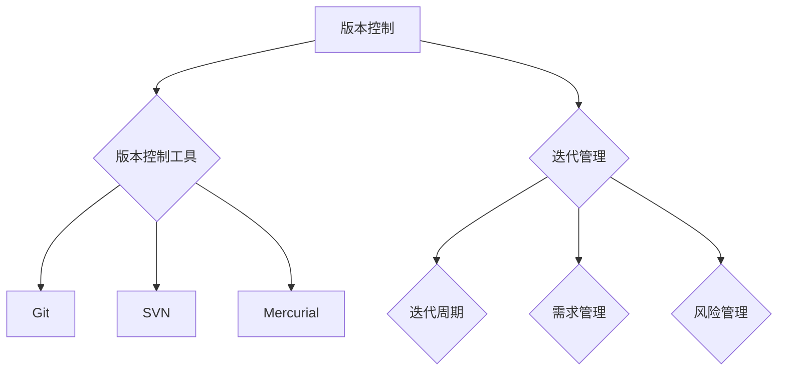

                 

### 引言

#### 1.1 书籍背景与目的

在信息技术飞速发展的今天，软件系统已成为现代企业运作的中枢神经。随着系统规模的不断扩大和复杂性的增加，如何有效地管理软件系统的版本控制和迭代过程，成为软件开发过程中不可忽视的关键问题。本书旨在为软件开发者、项目经理以及相关技术管理者提供一套全面、系统的版本控制与迭代管理实践指南。

##### 1.1.1 版本控制与迭代管理的现实需求

版本控制（Version Control）是软件开发过程中的一项基本活动，通过跟踪和管理代码的变更历史，确保代码的一致性和完整性。迭代管理（Iteration Management）则是在不断迭代的基础上，对软件需求和开发过程进行系统化的管理，以实现持续交付高质量软件的目标。

在现实工作中，版本控制和迭代管理面临诸多挑战：

- **代码冲突**：多人在同一项目上进行开发，不可避免地会出现代码冲突，如何有效地解决这些冲突，是版本控制的一大难题。
- **变更管理**：软件迭代过程中，需求的频繁变更和回滚，如何在不影响项目进度的情况下进行有效的变更管理，是迭代管理的重要课题。
- **历史追溯**：在软件出现问题时，如何快速定位到问题代码，进行追溯和修复，是版本控制的核心需求。
- **协作与沟通**：在分布式团队中，如何通过有效的版本控制和迭代管理工具，提高团队协作效率，降低沟通成本。

##### 1.1.2 书籍的目标读者群体

本书的目标读者主要包括以下几类：

- **软件开发者**：希望通过本书掌握版本控制和迭代管理的基本原理和实践技巧，提升个人开发效率和团队协作能力。
- **项目经理**：负责项目管理，需要了解版本控制和迭代管理在项目中的实际应用，以确保项目按时交付高质量软件。
- **技术管理者**：关注团队技术能力提升和项目管理优化，希望本书能提供一套全面的版本控制和迭代管理解决方案。
- **软件架构师**：在系统设计和开发过程中，需要综合考虑版本控制和迭代管理，以确保系统的高可用性和可维护性。

本书以系统化的结构，从基础到实践，深入浅出地介绍了版本控制和迭代管理的基本概念、方法、工具和实践技巧，旨在帮助读者全面掌握这一关键技能，提升软件开发的效率和质量。

#### 1.2 版本控制与迭代管理的关系

版本控制和迭代管理是软件开发过程中紧密相连的两个环节，共同构成了软件迭代和开发的基础。为了深入理解这两个概念，并明确它们之间的联系与区别，我们需要从各自的基本定义开始。

##### 1.2.1 版本控制的定义

版本控制是一种管理文件和文档变更历史的技术，主要用于软件开发过程中跟踪和管理代码库的变化。其核心目标是确保代码库的一致性、完整性和可追溯性。版本控制系统（Version Control System，简称VCS）是实现这一目标的重要工具，它通过记录每次代码变更的详细信息，包括变更的内容、时间、作者等，形成完整的版本历史。

版本控制的主要功能包括：

- **创建版本**：为每次代码变更创建一个独立的版本，便于管理和追踪。
- **提交代码**：开发者将修改后的代码提交到版本控制系统中，系统会记录变更的详细信息。
- **分支管理**：在开发过程中，可能需要对特定功能或模块进行独立开发，通过分支（Branch）管理可以方便地实现这一需求。
- **合并代码**：当多个分支开发完成后，需要将各自的修改合并（Merge）到主分支（Master）中，以实现代码的统一管理。
- **回滚版本**：在出现问题时，可以通过回滚（Rollback）操作恢复到之前的稳定版本。

##### 1.2.2 迭代管理的定义

迭代管理是一种管理软件开发过程的方法，通过将整个开发过程划分为若干个小的迭代周期（Iteration），在每个迭代周期内完成部分或全部的需求，从而实现持续交付高质量软件的目标。迭代管理强调快速反馈和持续改进，通过与用户和利益相关者的紧密协作，确保软件需求满足实际需求。

迭代管理的主要功能包括：

- **需求收集**：在迭代开始时，收集和分析用户需求和业务目标，形成详细的迭代计划。
- **规划与设计**：根据需求进行系统设计和技术规划，确保开发过程的顺利进行。
- **设计与开发**：在迭代周期内完成详细设计，并进行编码实现。
- **测试与上线**：对开发完成的软件进行系统测试，确保其质量，并在测试通过后部署上线。
- **反馈与优化**：在软件上线后，收集用户反馈，对软件进行持续优化和迭代改进。

##### 1.2.3 二者之间的联系与区别

版本控制和迭代管理在软件开发生命周期中相互交织，共同推动软件的持续改进和优化。它们之间的联系与区别如下：

- **联系**：

  - **目标一致性**：版本控制和迭代管理都旨在实现软件的高质量交付，确保代码库的完整性和一致性。
  - **流程互补**：版本控制为迭代管理提供了技术保障，通过有效的代码管理，支持迭代过程中的需求变更和代码合并。
  - **协同工作**：在迭代管理中，版本控制工具可以帮助团队成员更好地协作，确保代码的同步和共享。

- **区别**：

  - **侧重点不同**：版本控制侧重于代码的变更管理和历史记录，而迭代管理侧重于整个软件开发过程的规划和管理。
  - **应用范围不同**：版本控制主要应用于代码库的管理，而迭代管理则应用于整个开发过程，包括需求分析、设计、开发、测试和上线等。
  - **角色不同**：版本控制主要由开发者和代码库管理员负责，而迭代管理则主要由项目经理和团队领导负责。

通过理解版本控制和迭代管理的定义及其相互关系，我们可以更好地把握软件开发生命周期的关键环节，确保软件项目的顺利进行和高质量交付。

#### 1.3 书籍结构概述

本书共分为五个主要部分，每一部分都针对版本控制和迭代管理的不同方面进行深入探讨和详细讲解，旨在帮助读者系统地掌握相关知识和实践技巧。

##### 1.3.1 各章节的主要内容安排

**第一部分：版本控制基础**

本部分主要介绍版本控制的基本概念、常用工具和实际操作方法，包括：

- **第2章 版本控制基础**：介绍版本控制系统的基本概念、常见类型及其工作原理。
- **第3章 版本控制工具的选择**：讨论如何选择适合项目的版本控制工具，并介绍Git、SVN等常用工具的使用方法。
- **第4章 版本控制的基本操作**：详细讲解提交、合并、分支管理等基本操作，以及如何解决代码冲突和进行版本回滚。

**第二部分：迭代管理方法**

本部分主要介绍迭代管理的基本原则、流程和工具，包括：

- **第5章 迭代管理的基本原则**：介绍迭代管理的定义、目标和方法论。
- **第6章 迭代管理流程**：详细讲解需求收集、设计与开发、测试与上线等迭代管理流程，并介绍如何进行迭代规划和风险评估。
- **第7章 迭代管理工具**：介绍常用的迭代管理工具，如JIRA、Trello等，并讲解如何使用这些工具提高团队协作效率。

**第三部分：版本控制与迭代管理的集成**

本部分主要探讨如何将版本控制和迭代管理有效集成，实现代码管理和迭代管理的无缝衔接，包括：

- **第8章 集成的重要性**：介绍集成版本控制和迭代管理的目的和意义，以及可能面临的挑战。
- **第9章 集成策略**：讨论如何通过统一平台、流程和数据共享，实现版本控制和迭代管理的集成。
- **第10章 集成案例研究**：通过具体案例，展示如何在实际项目中实现版本控制和迭代管理的集成。

**第四部分：版本控制与迭代管理的最佳实践**

本部分主要介绍在实际项目中应用版本控制和迭代管理的最佳实践，包括：

- **第11章 版本控制最佳实践**：讨论版本号命名规则、分支策略选择和提交消息规范等最佳实践。
- **第12章 迭代管理最佳实践**：介绍迭代周期规划、需求管理、项目风险管理等方面的最佳实践。

**第五部分：总结与展望**

本部分对全书内容进行总结，并对未来发展趋势提出展望，包括：

- **第13章 版本控制与迭代管理的重要性**：总结版本控制和迭代管理在软件开发中的重要性，以及对团队协作和项目管理的促进作用。
- **第14章 未来的发展趋势**：讨论自动化与智能化、社区与开源在版本控制和迭代管理中的应用。
- **第15章 建议与展望**：对读者提出学习建议，并对行业未来发展趋势进行展望。

##### 1.3.2 读者在阅读过程中的学习路径

为了帮助读者更好地理解和掌握版本控制和迭代管理，本书提供了一个系统的学习路径：

1. **基础阶段**：首先阅读第一部分的“版本控制基础”，了解版本控制的基本概念和常用工具。
2. **进阶阶段**：继续阅读第二部分的“迭代管理方法”，掌握迭代管理的基本原则和流程。
3. **实践应用阶段**：结合第三部分“版本控制与迭代管理的集成”和第四部分“最佳实践”，将所学知识应用于实际项目中。
4. **总结与展望阶段**：阅读第五部分的“总结与展望”，回顾全书内容，并对未来发展趋势有所了解。

通过这样的学习路径，读者可以逐步从基础知识到实际应用，全面掌握版本控制和迭代管理，提升软件开发效率和质量。

### 版本控制基础

版本控制是软件开发生命周期中的一个关键环节，通过系统地管理代码的变更历史，确保代码的一致性、完整性和可追溯性。本章节将详细介绍版本控制的基本概念、常见类型及其工作原理，帮助读者建立对版本控制系统的全面理解。

#### 2.1 版本控制系统的选择

在众多版本控制系统中，Git、SVN和Mercurial是当前最流行和广泛使用的三个系统。每个系统都有其独特的特点和应用场景，选择合适的版本控制系统对于项目管理至关重要。

##### 2.1.1 常见的版本控制系统

1. **Git**

   Git是由Linus Torvalds创建的开源分布式版本控制系统，由于其高效、灵活和分布式特性，被广泛应用于大型项目和开源社区中。Git支持离线工作，具有强大的分支管理和合并能力，适用于分布式团队协作。

2. **SVN**

   Subversion（简称SVN）是由Apache软件基金会开发的集中式版本控制系统。SVN具有稳定的性能和丰富的客户端工具，适用于单点管理和中小型项目。其中心化的设计使得版本控制的集中性和一致性较高。

3. **Mercurial**

   Mercurial是一个开源分布式版本控制系统，类似于Git，但更注重稳定性和易用性。它拥有简洁的命令行界面和丰富的客户端工具，适用于各种规模的项目和团队。

##### 2.1.2 选择版本控制系统的考虑因素

选择版本控制系统时，需要考虑以下几个关键因素：

1. **项目规模与团队协作需求**：大型项目和分布式团队通常需要选择分布式版本控制系统，如Git，以支持灵活的分支管理和高效协作。而中小型项目或单点管理团队可以选择集中式版本控制系统，如SVN。
2. **操作系统的兼容性**：确保所选择的版本控制系统与开发环境和操作系统的兼容性，避免因系统不兼容导致的问题。
3. **工具支持和社区活跃度**：强大的工具支持和活跃的社区可以为开发团队提供丰富的资源和帮助，提高开发效率和解决问题的能力。
4. **版本库的性能与可靠性**：考虑版本库的性能和可靠性，尤其是在高并发操作和大规模代码管理时，系统的稳定性和响应速度是关键。
5. **成本与费用**：开源版本控制系统如Git和Mercurial通常免费使用，而商业版本控制系统如Perforce可能需要购买许可证。根据预算和需求选择合适的版本控制系统。

##### 2.1.3 版本控制系统的安装与配置

以下以Git为例，介绍版本控制系统的安装与基本配置：

1. **安装Git**

   - **Windows系统**：可以通过Git官网（https://git-scm.com/downloads）下载适用于Windows的安装程序，按照提示完成安装。
   - **macOS系统**：可以通过Homebrew（https://brew.sh/）安装Git，命令如下：
     ```bash
     /bin/bash -c "$(curl -fsSL https://raw.githubusercontent.com/Homebrew/install/master/install.sh)"
     ```
   - **Linux系统**：可以使用包管理工具（如apt、yum等）安装Git，命令如下：
     ```bash
     sudo apt-get install git
     ```

2. **配置Git**

   - **配置用户信息**：首次使用Git时，需要配置用户名和电子邮件地址，命令如下：
     ```bash
     git config --global user.name "Your Name"
     git config --global user.email "your-email@example.com"
     ```
   - **检查配置**：可以通过以下命令检查用户配置信息是否正确：
     ```bash
     git config --list
     ```

3. **基本操作**

   - **克隆仓库**：将远程仓库克隆到本地，命令如下：
     ```bash
     git clone https://github.com/username/repository.git
     ```
   - **提交代码**：在本地修改文件后，添加到暂存区并提交，命令如下：
     ```bash
     git add .
     git commit -m "Commit message"
     ```
   - **推送代码**：将本地提交推送到远程仓库，命令如下：
     ```bash
     git push origin master
     ```

通过以上步骤，我们可以成功安装和配置Git，开始进行版本控制操作。在实际开发过程中，根据项目需求和团队协作方式，灵活运用Git的各种功能，如分支管理、合并代码、解决冲突等，确保代码库的一致性和完整性。

#### 2.2 版本控制的基本概念

版本控制系统的核心在于管理代码的版本历史，确保代码库的完整性和一致性。本章节将详细介绍版本控制的基本概念，包括版本号、提交、合并和分支管理等内容，帮助读者理解版本控制的工作原理。

##### 2.2.1 版本号的定义

版本号是用于标识代码库中不同版本的数字或字符串，通常采用递增的方式表示。版本号的格式和命名规则因项目和管理策略的不同而有所差异，但一般来说，版本号可以分为以下几种类型：

1. **主版本号**：表示项目的主要版本，通常在项目发生重大功能更新或架构变更时递增。
2. **次版本号**：表示项目的次要版本，通常在新增功能或进行较小规模改进时递增。
3. **修订版本号**：表示项目的修订版本，通常在修复bug或进行细节优化时递增。

常见的版本号格式包括“主.次.修订”（如1.0.1）和“主.次”（如1.0），具体格式应根据项目的需求和开发团队的约定来确定。

##### 2.2.2 提交、合并与分支操作

1. **提交（Commit）**

   提交是版本控制中最基本的操作，用于将修改后的代码添加到代码库中。每次提交都会生成一个提交记录，包含提交的作者、时间、提交说明等信息。以下是提交的基本步骤：

   - **添加文件到暂存区**：使用`git add`命令将需要提交的文件添加到暂存区。
     ```bash
     git add <file>
     ```
   - **提交代码**：使用`git commit`命令将暂存区的文件提交到本地代码库，并添加提交说明。
     ```bash
     git commit -m "Commit message"
     ```

2. **合并（Merge）**

   合并是版本控制中用于将两个或多个分支的修改合并到一个分支上的操作。合并可以分为以下几种类型：

   - **正常合并**：当两个分支之间没有冲突时，可以直接进行正常合并。
     ```bash
     git merge <branch>
     ```
   - **解决冲突后合并**：当两个分支之间存在冲突时，需要手动解决冲突，然后进行合并。
     ```bash
     git merge <branch>
     ```
     解决冲突后，使用`git add`命令将冲突解决的文件添加到暂存区，并执行合并。
     ```bash
     git commit -m "Commit message"
     ```

3. **分支（Branch）**

   分支是版本控制系统中用于实现并行开发的重要功能。通过创建分支，可以在不干扰主分支（通常为master或main分支）的情况下，进行独立的功能开发或bug修复。以下是分支的基本操作：

   - **创建分支**：使用`git branch`命令创建一个新的分支。
     ```bash
     git branch <branch-name>
     ```
   - **切换分支**：使用`git checkout`命令切换到指定的分支。
     ```bash
     git checkout <branch-name>
     ```
   - **合并分支**：将某个分支的修改合并到主分支或其他分支，以确保代码的统一管理。
     ```bash
     git merge <branch-name>
     ```

##### 2.2.3 代码库的管理

代码库是版本控制系统的核心，用于存储和管理项目的源代码。以下介绍代码库管理的一些基本操作：

1. **克隆代码库**：将远程代码库克隆到本地计算机，以便进行开发。
   ```bash
   git clone <url>
   ```

2. **更新代码库**：从远程代码库获取最新提交，更新本地代码库。
   ```bash
   git pull
   ```

3. **推送代码**：将本地代码库的修改推送到远程代码库。
   ```bash
   git push
   ```

4. **查看提交历史**：查看代码库的提交历史，包括提交的作者、时间、提交说明等信息。
   ```bash
   git log
   ```

5. **标签管理**：为特定版本或里程碑添加标签，便于历史追溯。
   ```bash
   git tag <tag-name>
   git push --tags
   ```

通过理解版本控制的基本概念和操作，开发团队可以有效地管理代码库，确保代码的一致性和完整性，从而提高软件开发效率和项目质量。

#### 2.3 版本控制的实际操作

在实际软件开发过程中，版本控制的实际操作是确保代码库一致性和完整性的关键环节。本章节将详细介绍版本控制的实际操作，包括提交代码、创建分支、合并代码、解决冲突以及版本的历史记录和回滚等步骤。

##### 2.3.1 提交代码与创建分支

1. **提交代码**

   提交代码是版本控制中最基本的操作，用于将修改后的代码添加到代码库中。以下是一个基本的提交代码流程：

   - **添加文件到暂存区**：在修改了代码文件后，需要将文件添加到暂存区。
     ```bash
     git add <file>
     ```
     这里<file>是具体的文件名，可以根据需要添加多个文件。

   - **提交代码**：执行提交命令，将暂存区的文件提交到本地代码库，并添加提交说明。
     ```bash
     git commit -m "Commit message"
     ```
     提交说明（Commit message）应简洁明了地描述本次提交的目的和内容，以便后续追溯。

   - **推送代码**：将本地提交推送到远程代码库，以确保其他团队成员可以看到最新的代码。
     ```bash
     git push
     ```

2. **创建分支**

   在软件开发中，创建分支是常见的操作，用于实现并行开发和独立开发。以下是一个基本的创建分支流程：

   - **创建分支**：使用`git branch`命令创建一个新的分支。
     ```bash
     git branch <branch-name>
     ```
     <branch-name>是分支的名称，可以根据功能模块或任务名称来命名。

   - **切换分支**：使用`git checkout`命令切换到新创建的分支。
     ```bash
     git checkout <branch-name>
     ```
     切换分支后，开发者在新的分支上可以进行独立的开发工作。

##### 2.3.2 合并代码与解决冲突

1. **合并代码**

   当一个分支开发完成后，需要将分支的修改合并到主分支或其他分支。以下是一个基本的合并代码流程：

   - **合并分支**：使用`git merge`命令将分支的修改合并到主分支或其他分支。
     ```bash
     git merge <branch-name>
     ```
     <branch-name>是待合并的分支名称。

   - **解决冲突**：当两个分支之间存在冲突时，需要手动解决冲突。Git会在合并过程中自动标识冲突文件，开发人员需要逐个解决冲突。

   - **提交合并**：解决冲突后，执行提交命令，将合并结果提交到代码库。
     ```bash
     git commit -m "Commit message"
     ```

2. **解决冲突**

   解决冲突是版本控制中的一个重要环节，以下是一个解决冲突的基本步骤：

   - **查看冲突文件**：在合并过程中，Git会标识出存在冲突的文件，并生成一个`.git/MERGE_HEAD`文件，指示冲突的文件和位置。

   - **手动解决冲突**：打开冲突文件，手动修改代码，解决冲突。通常，冲突区域的代码会以`<<<<<<`、`=======`、`>>>>>>`等标识分隔，其中`<<<<<<`和`>>>>>>`之间的代码分别来自两个不同的分支。

   - **提交冲突解决**：解决冲突后，执行提交命令，将解决结果提交到代码库。
     ```bash
     git add <file>
     git commit -m "Resolved conflicts"
     ```

##### 2.3.3 版本的历史记录与回滚

1. **查看历史记录**

   查看版本控制的历史记录是了解代码库变更历史和追溯问题的重要手段。以下是一个基本的查看历史记录流程：

   - **查看提交日志**：使用`git log`命令查看提交的历史记录，包括提交的ID、作者、提交时间和提交说明等。
     ```bash
     git log
     ```

   - **查看文件历史**：使用`git log -- <file>`命令查看特定文件的提交历史。
     ```bash
     git log -- <file>
     ```

2. **回滚版本**

   当代码库中出现问题时，可以通过回滚操作恢复到之前的稳定版本。以下是一个基本的回滚版本流程：

   - **选择回滚版本**：使用`git log`命令查看历史记录，找到需要回滚的提交ID。

   - **创建回滚分支**：使用`git checkout`命令创建一个新的分支，基于需要回滚的提交ID。
     ```bash
     git checkout -b <branch-name> <commit-hash>
     ```
     <branch-name>是回滚分支的名称，<commit-hash>是待回滚的提交ID。

   - **合并回滚分支**：将回滚分支的修改合并到主分支或其他分支，以实现代码库的回滚。
     ```bash
     git merge <branch-name>
     ```

   - **删除回滚分支**：合并完成后，可以删除回滚分支。
     ```bash
     git branch -d <branch-name>
     ```

通过掌握版本控制的实际操作，开发团队可以有效地管理代码库，确保代码的一致性和完整性，从而提高软件开发效率和项目质量。

### 迭代管理方法

迭代管理是软件开发过程中的一种重要方法，通过将整个开发过程划分为若干个小的迭代周期，实现持续交付高质量软件的目标。本章节将详细介绍迭代管理的基本原则、流程和工具，帮助读者全面了解迭代管理的核心内容。

#### 3.1 迭代管理的基本原则

迭代管理强调在每次迭代周期内完成部分或全部的需求，并通过持续反馈和改进，逐步实现软件的最终目标。以下是迭代管理的基本原则：

##### 3.1.1 迭代的定义

迭代（Iteration）是软件开发中的一个周期性过程，每个迭代周期通常持续几周或几个月。在每个迭代周期内，团队会完成部分或全部需求，并进行评估和调整。

##### 3.1.2 迭代管理的目标

迭代管理的目标是：

1. **持续交付可用的软件**：通过每个迭代周期交付可用的软件，确保客户可以尽早使用软件并反馈意见。
2. **快速响应变更**：在迭代管理过程中，需求可能随时发生变化。迭代管理通过灵活的流程和快速反馈机制，确保需求变更能够被及时识别和响应。
3. **提高软件质量**：通过在每个迭代周期内进行测试和评估，确保软件的质量得到持续提升。
4. **优化团队协作**：迭代管理强调团队协作和沟通，通过定期回顾和改进，提高团队的整体效率。

##### 3.1.3 迭代管理的方法论

迭代管理的方法论主要包括以下步骤：

1. **需求收集**：在每次迭代开始前，收集和分析用户需求和业务目标，确定本次迭代的目标和任务。
2. **规划与设计**：根据需求进行系统设计和技术规划，确保开发过程的顺利进行。
3. **设计与开发**：在迭代周期内完成详细设计，并进行编码实现。
4. **测试与上线**：对开发完成的软件进行系统测试，确保其质量，并在测试通过后部署上线。
5. **反馈与优化**：在软件上线后，收集用户反馈，对软件进行持续优化和迭代改进。

#### 3.2 迭代管理流程

迭代管理流程是确保软件项目按时、按质完成的关键。以下详细介绍迭代管理的各个流程：

##### 3.2.1 需求收集与规划

1. **需求收集**：在每次迭代开始前，项目经理和开发团队会与用户、利益相关者进行沟通，了解需求和要求。需求收集的方法包括用户访谈、问卷调查、需求文档等。

2. **需求分析**：对收集到的需求进行分类、优先级排序和可行性分析，确保需求的合理性和可执行性。

3. **规划**：根据需求分析结果，制定迭代计划和任务分配，确定每个迭代周期的目标和任务。

##### 3.2.2 设计与开发

1. **系统设计**：在迭代周期内，根据需求和规划，进行系统设计和架构设计。系统设计包括数据库设计、界面设计、模块划分等。

2. **详细设计**：在系统设计的基础上，进行详细设计，包括数据结构、算法设计、接口设计等。

3. **编码实现**：根据详细设计，进行编码实现。开发团队通常遵循代码规范和最佳实践，确保代码的清晰性和可维护性。

##### 3.2.3 测试与上线

1. **单元测试**：对单个模块或组件进行测试，确保其功能正确和性能满足要求。

2. **集成测试**：将各个模块集成起来进行测试，确保系统整体功能的正确性和稳定性。

3. **系统测试**：对整个系统进行测试，包括功能测试、性能测试、安全测试等，确保系统满足需求和用户预期。

4. **上线**：在测试通过后，将软件部署到生产环境，并确保其正常运行。

##### 3.2.4 反馈与优化

1. **用户反馈**：在软件上线后，收集用户反馈，了解用户的使用情况和意见。

2. **问题修复**：根据用户反馈，修复发现的问题，确保软件的稳定性和可靠性。

3. **持续改进**：通过迭代回顾和评估，总结经验教训，优化开发流程和团队协作，提高后续迭代的质量和效率。

#### 3.3 迭代管理工具

迭代管理工具是支持迭代管理流程的重要工具，可以帮助团队更好地进行需求管理、任务分配、进度跟踪和协作沟通。以下介绍几种常见的迭代管理工具：

##### 3.3.1 常见的迭代管理工具

1. **JIRA**

   JIRA是由Atlassian公司开发的一款功能强大的迭代管理工具，适用于敏捷开发和Scrum管理。JIRA提供包括需求管理、任务追踪、迭代规划、报告分析等全面的功能，支持多种集成插件，如Git、Confluence等。

2. **Trello**

   Trello是一款基于看板（Kanban）方法的迭代管理工具，通过可视化卡片和看板，帮助团队进行任务管理、进度跟踪和协作。Trello界面简洁直观，易于上手，适用于小型团队和简单项目。

3. **Asana**

   Asana是一款功能全面的任务管理工具，适用于各种规模的项目和团队。Asana提供任务分配、进度跟踪、时间管理、协作沟通等功能，支持多种集成插件，如GitHub、Slack等。

##### 3.3.2 迭代管理工具的选择与使用

选择迭代管理工具时，应考虑以下因素：

1. **团队规模与需求**：根据团队规模和项目需求，选择适合的工具。大型团队和复杂项目通常需要功能更全面、集成性更强的工具，如JIRA；小型团队和简单项目可以选择Trello或Asana。

2. **易用性与用户体验**：工具的易用性和用户体验对团队协作至关重要。选择界面简洁、操作直观的工具，可以降低学习成本，提高团队工作效率。

3. **集成能力**：工具的集成能力可以提升团队协作效率。选择支持与代码管理工具（如Git）、文档工具（如Confluence）等集成的工具，可以实现数据的无缝传输和协作。

4. **成本与费用**：开源工具通常免费使用，但可能需要自行维护和部署。商业工具可能需要购买许可证，但通常提供更好的技术支持和用户体验。

在使用迭代管理工具时，团队应遵循以下最佳实践：

1. **明确目标和流程**：在引入迭代管理工具前，明确团队的目标和流程，确保工具能够有效支持迭代管理。

2. **培训和推广**：对团队成员进行工具培训和推广，确保每个人都能熟练使用工具，并充分利用其功能。

3. **数据备份与恢复**：定期备份工具数据，确保数据的安全和可恢复性。

4. **持续改进与优化**：根据团队反馈和项目需求，不断改进和优化工具使用，提高团队协作效率和项目质量。

通过选择适合的迭代管理工具，并遵循最佳实践，团队可以更好地进行迭代管理，提高软件开发的效率和质量。

#### 4.1 集成的重要性

版本控制与迭代管理的集成是软件开发过程中不可或缺的一环，它能够显著提升团队协作效率、确保项目进度和质量，并降低风险。以下详细阐述集成的重要性、集成目标和集成过程中可能面临的挑战。

##### 4.1.1 集成的定义

集成（Integration）在软件开发中指的是将不同的组件、工具、流程和数据无缝地结合在一起，以实现整体目标。在版本控制和迭代管理的背景下，集成指的是将版本控制系统的功能与迭代管理流程有机结合，使得代码变更和开发进度能够实时反映在迭代管理工具中，从而实现信息共享和协同工作。

##### 4.1.2 集成的目标

集成版本控制和迭代管理的目标主要包括以下几点：

1. **统一平台与流程**：通过集成，将版本控制和迭代管理统一在一个平台上，简化操作流程，减少重复工作，提高工作效率。

2. **数据共享与同步**：确保版本控制系统的变更记录和迭代管理工具中的任务进度、bug报告等数据实时同步，避免信息孤岛。

3. **协作与沟通**：集成工具可以帮助团队成员实时了解代码库的状态和开发进度，提高团队间的沟通和协作效率。

4. **风险控制与质量管理**：通过集成，可以更好地监控和管理项目风险，确保代码库的一致性和完整性，提高软件质量。

##### 4.1.3 集成的挑战

尽管集成版本控制和迭代管理具有显著的优点，但在实际操作中，仍面临诸多挑战：

1. **工具兼容性问题**：不同的版本控制系统和迭代管理工具在协议、接口和数据格式上可能存在差异，如何确保这些工具能够无缝集成是一个难题。

2. **数据同步与一致性**：版本控制和迭代管理工具之间的数据同步需要确保实时性和一致性，避免因数据不同步导致的错误和冲突。

3. **复杂性和学习成本**：集成过程可能涉及多个工具和平台，对团队成员提出了更高的技术要求和学习成本。

4. **性能与稳定性**：集成系统的性能和稳定性是确保高效协作的关键。在高并发操作和数据量大时，集成系统的性能和稳定性可能面临挑战。

5. **安全与权限管理**：集成过程中，如何确保数据安全和权限管理，防止未经授权的访问和数据泄露，是另一个重要的挑战。

#### 4.2 版本控制与迭代管理的集成策略

为了实现版本控制和迭代管理的有效集成，需要采取一系列策略和方法，包括统一平台与流程、数据与信息的共享、风险与质量的控制等。

##### 4.2.1 统一平台与流程

1. **选择合适的集成平台**：选择一个功能强大、支持多种集成方式的平台，如Jenkins、CircleCI等，作为集成的基础。

2. **定义统一的流程**：明确版本控制和迭代管理的流程，确保各流程步骤清晰、标准化，便于操作和监控。

3. **集成工具链**：构建一个统一的工具链，将版本控制系统、迭代管理工具、自动化构建和测试工具等集成在一起，实现自动化和协同工作。

##### 4.2.2 数据与信息的共享

1. **数据同步机制**：设计数据同步机制，确保版本控制系统和迭代管理工具之间的数据实时同步，如任务状态、代码变更记录等。

2. **共享存储库**：将版本控制和迭代管理工具的存储库统一到一个共享存储库中，便于团队成员访问和操作。

3. **信息可视化**：通过集成平台，实现版本状态和迭代进度的可视化展示，便于团队成员随时了解项目状态。

##### 4.2.3 风险与质量的控制

1. **风险管理**：通过集成平台，实现风险管理的自动化，如任务超时提醒、异常报告等，确保风险及时被发现和处理。

2. **质量监控**：集成代码质量监控工具，如SonarQube等，对代码库进行静态代码分析，确保代码质量。

3. **持续集成与部署**：通过自动化集成和部署流程，确保代码变更在提交后能够快速集成和部署，减少人工干预和错误。

##### 4.2.4 集成的最佳实践

1. **最小化集成环**：将集成环设计得尽可能小，确保变更能够快速集成和反馈，减少集成过程中的复杂性和风险。

2. **持续改进**：通过定期回顾和评估集成效果，不断优化集成策略和流程，提高集成效率和稳定性。

3. **培训和文档**：为团队成员提供集成工具和流程的培训，并编写详细的文档，确保团队成员能够熟练操作和使用集成系统。

通过采取上述集成策略和最佳实践，开发团队可以有效地将版本控制和迭代管理结合起来，实现高效的协同工作和高质量的项目交付。

### 4.3 集成案例研究

为了更好地理解版本控制与迭代管理的集成在实际项目中的应用，本章节将介绍两个具体的案例研究：一个是大型软件项目的版本控制与迭代管理集成，另一个是敏捷开发中的版本控制与迭代管理实践。

#### 4.3.1 案例一：大型软件项目的版本控制与迭代管理集成

**项目背景**：

某公司开发的一款大型企业级应用，涉及多个业务模块和大量用户数据。由于项目规模庞大，开发周期长，团队分布在多个地理位置，如何确保代码库的一致性和迭代管理的有效性成为一个挑战。

**解决方案**：

1. **统一平台与流程**：

   - **选择Jenkins作为集成平台**：Jenkins是一款开源的持续集成工具，支持与Git、JIRA等众多工具的集成，能够实现自动化构建、测试和部署。
   - **定义标准化流程**：根据项目的需求，制定统一的开发、测试和部署流程，确保团队成员遵循相同的操作规范。

2. **数据与信息的共享**：

   - **同步版本控制与迭代管理工具**：使用Jenkins的Webhook功能，将Git的提交记录同步到JIRA中，确保迭代管理工具能够实时反映代码库的状态。
   - **共享存储库**：使用GitLab作为版本控制系统的私有云平台，所有团队成员可以通过GitLab进行代码的提交、分支管理和合并操作。

3. **风险与质量的控制**：

   - **自动化测试**：通过Jenkins集成Selenium等自动化测试工具，对每个提交的代码进行自动化测试，确保代码质量。
   - **持续集成与部署**：使用Jenkins实现自动化构建和部署，确保代码变更后能够快速集成和部署到测试环境，降低人工干预和错误。

**效果评估**：

- **提高了开发效率**：通过集成平台和自动化工具，开发团队能够更快速地完成代码提交、测试和部署，减少了重复工作和人工干预。
- **增强了团队协作**：版本控制和迭代管理工具的集成，使得团队成员能够实时了解项目进度和代码库的状态，提高了团队协作效率。
- **确保了代码质量**：通过自动化测试和持续集成，代码库的一致性和质量得到了有效保障，减少了bug和错误的概率。

#### 4.3.2 案例二：敏捷开发中的版本控制与迭代管理实践

**项目背景**：

某初创公司开发的一款移动应用，采用敏捷开发方法进行项目管理。由于项目周期短，需求变化频繁，如何快速响应需求变更并保持代码库的一致性成为关键问题。

**解决方案**：

1. **敏捷迭代管理**：

   - **使用Trello进行任务管理**：Trello是一款基于看板（Kanban）方法的任务管理工具，团队成员可以通过Trello进行任务分配、进度跟踪和协作。
   - **实施Scrum框架**：根据Scrum框架，每两周进行一次迭代，通过每日站会和迭代回顾会议，确保团队高效协作和持续改进。

2. **版本控制与敏捷迭代管理集成**：

   - **集成Git与Trello**：使用Git的Webhook功能，将提交记录和分支操作同步到Trello中，确保任务的状态和代码库的状态一致。
   - **利用Trello的标签功能**：为每个任务和迭代分配特定的标签，如`#in_progress`、`#done`等，便于团队成员查看和跟踪任务状态。

3. **快速响应需求变更**：

   - **迭代规划**：在每次迭代开始前，团队与产品负责人一起确定本次迭代的需求和任务，并根据实际情况进行优先级排序。
   - **需求变更管理**：通过Trello的卡片移动功能，快速响应需求变更，确保变更能够及时体现在迭代计划和任务中。

**效果评估**：

- **提高了响应速度**：通过敏捷开发方法和Trello的任务管理工具，团队能够快速响应需求变更，确保产品按时交付。
- **增强了团队协作**：集成版本控制和迭代管理工具，团队成员能够实时了解项目进度和代码库的状态，提高了团队协作效率。
- **确保了代码质量**：通过Git的分支管理和Trello的任务跟踪，开发团队能够更好地管理代码变更，确保代码库的一致性和完整性。

通过以上两个案例，我们可以看到，将版本控制与迭代管理有效集成，不仅可以提高开发效率和团队协作，还能确保代码库的一致性和项目质量，为软件开发提供有力支持。

### 5.1 最佳实践的定义

在软件开发领域，最佳实践（Best Practices）指的是经过验证的、行之有效的方法和流程，这些方法和流程可以帮助团队提高开发效率、确保项目质量和降低风险。最佳实践源自多年的实践经验、研究和社区反馈，是软件开发过程中不可或缺的指导原则。

#### 5.1.1 最佳实践的来源

最佳实践的来源主要包括以下几个方面：

1. **经验积累**：团队在长期的项目开发过程中，通过不断的实践和总结，积累了一系列行之有效的方法和技巧。
2. **行业研究**：学术界和工业界通过研究项目，总结出适用于不同场景的最佳实践，如敏捷开发、持续集成等。
3. **社区反馈**：开源社区和技术论坛中的开发者们分享自己的经验和心得，通过社区反馈和迭代，形成了一系列被广泛认可的最佳实践。
4. **标准化组织**：如IEEE、ISO等标准化组织，通过制定标准和指南，为软件开发提供权威的指导和参考。

#### 5.1.2 最佳实践的评估标准

评估最佳实践的有效性，需要考虑以下标准：

1. **可行性**：最佳实践是否易于在项目中实施，是否需要额外的资源和工具支持。
2. **可重复性**：最佳实践在多个项目中是否能够成功实施，并产生预期的效果。
3. **可持续性**：最佳实践是否能够在长期的项目中持续产生效益，而不是仅仅适用于短期项目。
4. **适应性**：最佳实践是否能够适应不同规模、不同类型的项目，具有广泛的适用性。
5. **可衡量性**：最佳实践的实施效果是否能够通过量化指标进行衡量，如开发效率、代码质量、项目进度等。

通过以上标准，可以评估最佳实践的有效性和适用性，从而为软件开发提供可靠的参考和指导。

### 5.2 版本控制的最佳实践

版本控制是软件开发中不可或缺的一部分，它确保了代码库的一致性和可追溯性。为了提高版本控制的效率和效果，以下介绍几种版本控制的最佳实践，包括版本号的命名规则、分支策略的选择和提交消息的规范。

#### 5.2.1 版本号的命名规则

版本号的命名规则是版本控制中的重要组成部分，有助于团队成员快速理解版本的含义和变更的历史。常见的版本号命名规则包括：

1. **语义化版本号**：使用语义化版本号（Semantic Versioning）规则，如`MAJOR.MINOR.PATCH`。其中，MAJOR表示重大版本更新，MINOR表示新增功能和次要更新，PATCH表示bug修复和补丁。例如，`2.0.1`表示第二个主要版本的第一个次要更新和第二个补丁。
2. **递增规则**：根据版本更新内容，依次递增版本号。通常，当添加新功能时，增加MINOR版本；当修复bug时，增加PATCH版本；当进行重大更新时，增加MAJOR版本。

#### 5.2.2 分支策略的选择

分支策略决定了代码库中分支的创建、使用和合并方式，直接影响代码库的整洁性和开发效率。常见的分支策略包括：

1. **Git Flow**：Git Flow是一种广泛应用于大型项目的分支策略，包括以下分支：

   - **master（主分支）**：包含最新的可发布版本。
   - **develop（开发分支）**：包含最新的开发代码。
   - **feature（功能分支）**：用于开发新功能。
   - **release（发布分支）**：用于准备发布的新版本。
   - **hotfix（紧急修复分支）**：用于修复紧急bug。

2. **Forking Workflow**：Forking Workflow是一种适用于小型项目和敏捷开发的分支策略，主要包括：

   - **master（主分支）**：包含最新的可发布版本。
   - **feature（功能分支）**：每个新功能创建一个独立的分支。
   - **hotfix（紧急修复分支）**：用于修复紧急bug。

选择合适的分支策略，可以简化分支管理，提高代码库的可维护性和开发效率。

#### 5.2.3 提交消息的规范

提交消息是版本控制系统中的重要组成部分，用于记录每次提交的变更内容和目的。规范化的提交消息有助于团队成员理解代码库的历史和变更情况。以下是一种常见的提交消息规范：

1. **格式**：使用`<类型>：<主题>`的格式，例如`fix：修复了bug`或`feat：添加了新功能`。
2. **类型**：根据提交的内容，选择合适的类型，如`fix`（修复bug）、`feat`（添加新功能）、`refactor`（重构代码）、`docs`（更新文档）、`style`（格式化代码）等。
3. **主题**：简洁明了地描述提交的主题，通常不超过50个字符。
4. **详细说明**：在提交消息中附加详细说明，描述变更的具体内容和目的，有助于后续追溯和理解。

例如，一个规范的提交消息可能是：

```bash
fix：修复了登录页面密码输入框的空值提示问题
```

通过以上规范，团队成员可以快速了解代码库的变更历史和原因，提高协作效率。

#### 5.2.4 其他最佳实践

1. **代码审查**：在提交代码前，进行代码审查，确保代码质量和一致性。代码审查可以由同行进行，也可以通过自动化工具（如SonarQube）实现。
2. **自动化测试**：在提交代码后，进行自动化测试，确保变更不会引入新的bug。自动化测试包括单元测试、集成测试和性能测试。
3. **定期备份**：定期备份代码库，以防止数据丢失。备份可以存储在远程服务器或云存储中，确保数据的安全和可恢复性。

通过遵循这些最佳实践，开发团队能够更高效地管理版本控制，提高代码库的一致性和可维护性，从而确保软件项目的顺利推进。

### 5.3 迭代管理的最佳实践

在软件开发过程中，迭代管理是实现持续交付高质量软件的关键。通过遵循最佳实践，开发团队能够更有效地规划和管理迭代过程，提高项目成功率和团队协作效率。以下介绍几种迭代管理的最佳实践，包括迭代周期规划、需求管理和项目风险管理。

#### 5.3.1 迭代周期规划

1. **确定迭代周期长度**：根据项目规模、团队能力和需求变化情况，选择合适的迭代周期长度。常见的迭代周期包括每周迭代、每两周迭代和每月迭代。对于小型项目或需求变化较快的项目，可以选择更短的迭代周期；对于大型项目或需求相对稳定的项目，可以选择较长的迭代周期。

2. **制定迭代计划**：在每次迭代开始前，团队应制定详细的迭代计划，明确迭代的目标、任务和交付成果。迭代计划应包括需求分析、设计、开发、测试和上线等关键阶段，并分配具体的任务和责任人。

3. **迭代回顾**：在每次迭代结束后，进行迭代回顾会议，总结本次迭代的经验教训，识别问题和改进点。迭代回顾有助于团队不断优化迭代流程，提高后续迭代的效率和质量。

#### 5.3.2 需求管理

1. **需求收集与分析**：在每次迭代开始前，团队应与产品负责人、用户和利益相关者进行沟通，收集和分析需求。需求收集应涵盖功能需求、非功能需求和用户故事等，并对其优先级和可行性进行评估。

2. **需求文档**：编写详细的需求文档，包括需求描述、功能规格、界面设计等。需求文档应尽可能清晰、简洁，便于团队成员理解和实施。

3. **用户故事**：使用用户故事（User Story）来描述需求，格式为`As a [用户角色]，I want [功能需求] so that [业务目标]`。用户故事有助于明确需求的目标和优先级，提高开发团队对用户需求的理解。

#### 5.3.3 项目风险管理

1. **风险识别**：在项目开始时，团队应识别可能影响项目进度和质量的风险，包括技术风险、市场风险、人员风险等。风险识别可以通过风险分析会议、历史项目数据分析和专家评审等方式进行。

2. **风险评估**：对识别出的风险进行评估，确定其可能性和影响程度。评估结果可以帮助团队确定风险优先级，制定相应的风险应对策略。

3. **风险应对**：根据风险评估结果，制定风险应对策略，包括风险规避、风险减轻、风险接受和风险转移等。风险应对策略应明确具体的行动步骤和责任人。

4. **风险监控与报告**：在项目执行过程中，定期监控风险状态，并根据实际情况调整风险应对措施。风险监控报告应包括风险状态、应对措施和改进建议。

#### 5.3.4 其他最佳实践

1. **敏捷实践**：采用敏捷开发方法，如Scrum或Kanban，通过每日站会和迭代回顾会议，提高团队协作和响应能力。

2. **自动化测试**：实施自动化测试，确保每次迭代交付的软件质量。自动化测试包括单元测试、集成测试和性能测试等。

3. **持续集成与部署**：实现持续集成与部署，确保每次代码提交后都能快速集成和部署到测试环境，提高开发效率和代码质量。

4. **文档管理**：编写详细的文档，包括设计文档、用户手册和操作指南等，便于团队成员和用户理解和使用软件。

通过遵循这些最佳实践，开发团队能够更有效地管理迭代过程，提高项目质量和团队协作效率，从而实现持续交付高质量软件。

### 总结

版本控制与迭代管理是现代软件开发过程中不可或缺的两个重要环节，它们共同作用，确保了软件项目的顺利进行和高质量交付。版本控制通过管理代码库的变更历史，确保代码的一致性和完整性，为开发团队提供了强大的技术保障。迭代管理则通过将整个开发过程划分为若干个小的迭代周期，实现了持续交付和不断改进的目标。

#### 6.1.1 版本控制与迭代管理的重要性

1. **确保代码库一致性**：版本控制系统能够记录每次代码变更的详细信息，确保代码库的一致性和完整性，减少因代码冲突和错误导致的问题。
2. **提高团队协作效率**：通过版本控制和迭代管理，开发团队能够更好地协同工作，实时了解代码库的状态和项目进度，提高协作效率。
3. **促进持续改进**：迭代管理强调在每次迭代周期内完成部分或全部需求，并通过反馈和优化，实现软件的持续改进和优化。
4. **降低项目管理风险**：通过版本控制和迭代管理，团队可以更好地识别和管理项目风险，确保项目按时交付高质量软件。

#### 6.1.2 对团队协作的促进

1. **清晰的沟通与协作**：版本控制和迭代管理工具提供了统一的平台和流程，有助于团队成员之间进行清晰的沟通和高效的协作。
2. **分工明确，责任明确**：通过迭代管理和任务分配，团队中的每个成员都明确自己的职责和任务，有助于提高工作效率和团队凝聚力。
3. **实时监控与反馈**：版本控制和迭代管理工具能够实时反映代码库的状态和项目进度，便于团队成员及时发现和解决问题，确保项目按计划推进。

### 未来的发展趋势

随着技术的发展和软件项目的复杂性不断增加，版本控制和迭代管理也将迎来新的发展趋势：

#### 6.2.1 自动化与智能化

自动化工具和智能化技术将在版本控制和迭代管理中发挥越来越重要的作用。例如，自动化测试、智能代码审查和自动化部署等，将大幅提高开发效率和代码质量。

#### 6.2.2 社区与开源的兴起

开源社区和开源项目在版本控制和迭代管理领域将发挥更大的作用。开源版本控制系统和迭代管理工具的不断发展和完善，将为开发者提供更多选择和更好的支持。

#### 6.2.3 集成与协同

未来的版本控制和迭代管理将更加注重与其他开发工具和平台的集成，实现数据共享和流程协同，提升整体开发效率和用户体验。

### 建议与展望

对于读者，本书提供了一个全面、系统的版本控制和迭代管理知识体系。为了更好地应用这些知识，读者应：

- **实践与总结**：将所学知识应用于实际项目，通过实践不断总结和优化。
- **持续学习**：技术不断发展，读者应保持持续学习的态度，关注行业动态和新技术。
- **分享与交流**：积极参与开源社区和行业活动，分享经验，与他人交流学习。

对于行业，未来的版本控制和迭代管理将更加注重自动化、智能化和社区化。通过技术创新和社区合作，将进一步推动软件开发效率和质量提升。

### Mermaid 流程图



### 伪代码示例

```python
# 提交代码的伪代码
def commit_code(file_path, message):
    if not is_file_exist(file_path):
        return "文件不存在"
    latest_version = get_latest_version()
    new_version = create_new_version(latest_version)
    add_file_to_stage(file_path)
    commit_to_repo(message, new_version)
    update_repo(new_version)
    return

# 迭代管理的伪代码
def iterate_management():
    collect_requirements()
    plan_and_design()
    develop_and_test()
    deploy_software()
    collect_feedback()
    optimize_software()
    return
```

### 作者信息

作者：AI天才研究院/AI Genius Institute & 禅与计算机程序设计艺术 /Zen And The Art of Computer Programming

### 关键词

- 版本控制
- 迭代管理
- Git
- SVN
- 自动化测试
- 持续集成
- 敏捷开发
- 软件质量

### 摘要

本文详细介绍了版本控制与迭代管理在软件开发中的重要性、基本概念、实践操作和最佳实践。通过分析版本控制系统的选择、版本控制的基本操作、迭代管理的基本原则和方法，以及实际操作案例，本文为开发团队提供了系统、实用的版本控制和迭代管理指南。文章还探讨了未来的发展趋势，提出了对读者的建议，并对行业发展进行了展望。

