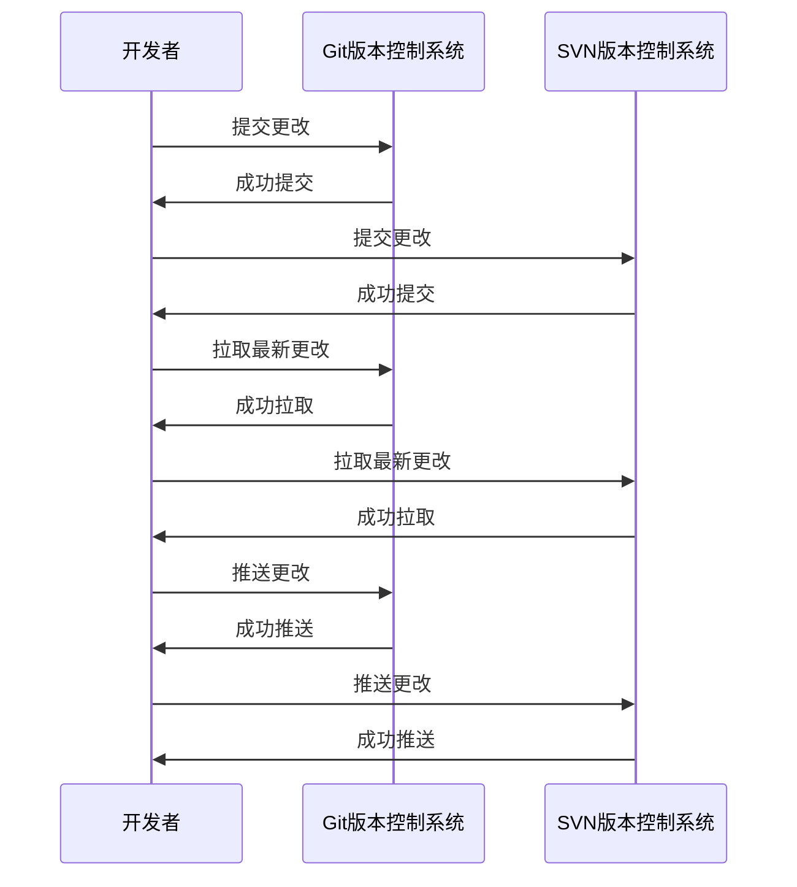

                 

## 文章标题：评测系统的版本控制：适应LLM迭代的管理策略

### 关键词：
- 版本控制
- 评测系统
- LLM迭代
- 管理策略

### 摘要：
本文旨在探讨如何利用版本控制策略来管理评测系统的迭代，特别是在大规模语言模型（LLM）的不断更新过程中。文章首先介绍了版本控制的基本概念和重要性，然后分析了评测系统的需求和特点。接着，文章深入探讨了如何适应LLM迭代的需求，设计出有效的版本控制管理策略。最后，通过具体案例展示了这些策略在实际项目中的应用和效果。

## 第1章：版本控制的概述

### 1.1 版本控制的定义与重要性

版本控制是一种用于追踪、管理和维护项目文件历史变更的方法。在软件开发中，版本控制尤为重要，因为它确保了代码的完整性和一致性，使得开发团队可以协作进行项目开发，并在出现问题时迅速回滚到之前的稳定状态。

**核心概念**：

- **版本控制系统**：一种用于管理多个版本文件的软件工具，如Git、SVN等。
- **变更管理**：确保代码变更安全、有序地纳入系统的方法。
- **代码库**：存储代码和相关文件的中央存储库。
- **协作开发**：多个开发者在同一项目上工作的过程。

**联系**：

- 版本控制与代码库紧密相关，它是代码库的核心功能之一。
- 协作开发中，版本控制确保了团队成员之间能够无缝协作，避免代码冲突。

**流程**：

版本控制的基础流程包括：

1. **提交（Commit）**：开发者将更改提交到版本控制系统中。
2. **合并（Merge）**：将不同分支的更改合并到主分支。
3. **拉取（Pull）**：从代码库中获取最新更改。
4. **推送（Push）**：将本地更改推送到代码库。

### 1.2 版本控制系统

版本控制系统可以分为分布式和集中式两种：

- **分布式版本控制系统**：每个开发者都有自己的代码库，可以独立进行更改，如Git。
- **集中式版本控制系统**：所有开发者共享一个中心化的代码库，如SVN。

**核心概念**：

- **分布式版本控制系统**：Git
- **集中式版本控制系统**：SVN

**联系**：

- 分布式版本控制系统具有更好的协作性和灵活性。
- 集中式版本控制系统更简单、易于部署，但在分布式环境中可能不够高效。

**比较**：

- **Git与SVN的差异**：

  - **协作性**：Git的分布式特性使得开发者在本地即可进行大部分操作，而SVN则需要连接到中心服务器。
  - **分支管理**：Git支持更灵活的分支管理，使得开发者可以轻松创建、合并和删除分支。
  - **速度**：Git通常比SVN更快，尤其是在处理大规模代码库时。

### 1.3 版本控制的架构

版本控制系统的架构通常包括以下几个部分：

1. **仓库**：存储所有版本信息的中央存储库。
2. **分支**：用于开发不同功能的独立路径。
3. **标签**：用于标记特定版本。
4. **变更历史**：记录所有版本变更的历史。

**Mermaid流程图**：



### 1.4 核心算法原理讲解

版本控制系统中的核心算法通常包括：

- **哈希算法**：用于生成文件指纹，确保文件的一致性。
- **数据结构**：如树结构，用于存储和管理版本历史。

**伪代码**：

```python
def hash_file(file_content):
    # 使用哈希算法生成文件指纹
    fingerprint = hashlib.sha256(file_content).hexdigest()
    return fingerprint

def compare_versions(version1, version2):
    # 比较两个版本的差异
    diff = diff_files(version1, version2)
    return diff
```

### 1.5 数学模型和数学公式详细讲解

版本控制中的数学模型通常包括：

- **版本号**：用于标识不同版本的数字或字符串。
- **时间戳**：用于记录版本创建的时间。

**数学公式**：

$$
V_n = V_{n-1} + 1
$$

$$
T_n = T_{n-1} + \Delta t
$$

**举例说明**：

假设第一个版本创建于2023年1月1日，那么第二个版本的版本号和创建时间分别为：

$$
V_2 = V_1 + 1 = 1 + 1 = 2
$$

$$
T_2 = T_1 + \Delta t = 2023年1月1日 + 1天 = 2023年1月2日
$$

### 1.6 项目实战

#### 开发环境搭建

搭建Git版本控制系统：

1. 安装Git。
2. 初始化本地Git仓库。

```bash
git init
```

#### 源代码详细实现和代码解读

创建文件`main.cpp`：

```cpp
#include <iostream>

int main() {
    std::cout << "Hello, World!" << std::endl;
    return 0;
}
```

解读：

- `#include <iostream>`：包含输入输出流库。
- `int main()`：主函数，程序的入口。
- `std::cout << "Hello, World!" << std::endl;`：输出Hello, World！

#### 代码应用解读与分析

使用Git管理代码：

1. 提交更改。

```bash
git add main.cpp
git commit -m "初始化项目"
```

2. 创建分支。

```bash
git checkout -b feature1
```

3. 在分支上修改代码。

```cpp
#include <iostream>

int main() {
    std::cout << "Hello, Feature 1!" << std::endl;
    return 0;
}
```

4. 提交更改。

```bash
git add main.cpp
git commit -m "完成Feature 1"
```

5. 合并分支。

```bash
git checkout main
git merge feature1
```

#### 实际案例分析和详细讲解剖析

假设有两个开发者在Git仓库上分别创建了两个功能分支`feature1`和`feature2`。

1. 开发者A完成`feature1`并合并到主分支。
2. 开发者B完成`feature2`并合并到主分支。

如果出现冲突，可以使用Git的合并工具解决冲突，确保主分支上的代码是两个功能分支的合并。

### 1.7 最佳实践 tips

- **定期备份**：定期备份代码库，以防数据丢失。
- **代码审查**：进行代码审查，确保代码质量。
- **分支命名规范**：使用有意义的分支命名，便于管理。

### 1.8 小结

版本控制是软件开发中不可或缺的一部分。它确保了代码的完整性和一致性，使得团队合作更加高效。通过本章的学习，读者应该了解了版本控制的基本概念、架构、算法原理以及实际应用。在下一章中，我们将探讨评测系统的需求和特点。

## 参考文献

- 《版本控制指南》
- 《Git权威指南》
- 《软件工程：实践者的研究方法》
- 《大规模语言模型：原理与应用》

作者：AI天才研究院/AI Genius Institute & 禅与计算机程序设计艺术 /Zen And The Art of Computer Programming

