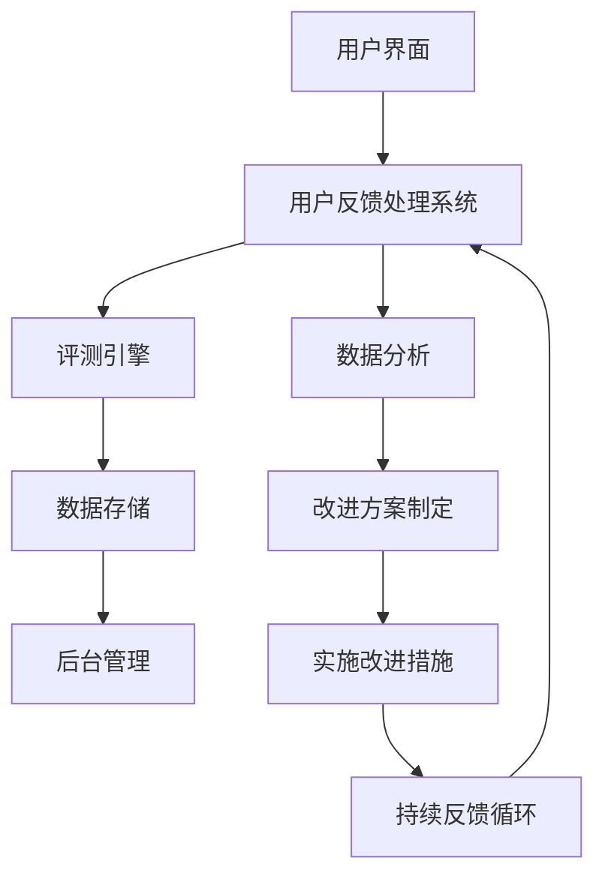

                 

## 引言和概述

### 1.1 书籍目的与意义

在当今的数字化时代，评测系统已经成为各类在线教育、考试、竞赛等领域中不可或缺的工具。然而，传统的评测系统往往存在评测标准固化、用户反馈机制不完善等问题，导致评测结果的准确性和公平性受到质疑。本书旨在探讨评测系统的用户反馈机制，并介绍如何通过持续改进评测方法来提升评测系统的整体性能。

首先，用户反馈机制是评测系统的重要组成部分。用户通过反馈可以表达他们对评测过程和结果的满意度，以及发现评测系统中的潜在问题。有效的用户反馈机制不仅可以提高用户的参与度，还能为评测系统的优化提供宝贵的参考数据。

其次，持续改进评测方法对于提升评测系统的准确性和公平性具有重要意义。随着技术的进步和用户需求的变化，评测系统需要不断调整和优化。持续改进评测方法不仅能确保评测结果符合时代发展的要求，还能提高评测过程的透明度和可信度。

本书的目标是：

1. 深入剖析评测系统的用户反馈机制，介绍其基本概念、类型和作用。
2. 探讨用户反馈驱动的评测改进策略，帮助读者理解如何利用用户反馈数据来优化评测系统。
3. 阐述持续改进评测方法的原则和过程，提供具体的实践指南。

通过本书的学习，读者将能够：

1. 理解评测系统的基本架构和用户反馈机制的工作原理。
2. 掌握如何收集、处理和分析用户反馈，并将其应用于评测系统的优化。
3. 掌握持续改进评测方法的理论和实践，提升评测系统的性能和用户满意度。

### 1.2 评测系统的现状与挑战

评测系统在现代教育、工作和竞赛等领域中扮演着至关重要的角色。然而，随着技术的进步和用户需求的多样化，评测系统也面临着一系列挑战。

首先，评测标准的固化问题。传统的评测系统往往依赖于固定的评测标准，这些标准可能在某些情况下不再适用。例如，在编程竞赛中，评测标准可能仅限于代码的语法和逻辑正确性，而忽略了代码的可维护性和性能优化。这种固化的标准无法全面反映参赛者的技能水平，导致评测结果的不公平性。

其次，用户反馈机制的不完善。许多评测系统缺乏有效的用户反馈机制，导致用户无法方便地表达对评测过程的意见和建议。即使有反馈机制，也往往缺乏有效的处理流程，使得反馈信息无法得到及时和有效的利用。这种情况下，用户对评测系统的满意度会降低，甚至可能影响评测结果的公正性。

另外，评测方法的单一性也是一个显著的问题。许多评测系统采用的评测方法过于单一，无法全面评估用户的能力和水平。例如，在在线教育中，评测系统可能仅依赖于考试成绩来评估学生的学习成果，而忽略了学生的实际应用能力和创新能力。这种单一的方法会导致评测结果的不全面性和误导性。

此外，评测系统的技术实现也面临挑战。随着大数据和人工智能技术的发展，评测系统需要处理海量的数据，并对用户行为进行实时分析和预测。这要求评测系统具备强大的数据处理和分析能力，同时还需要具备较高的安全性和可靠性。

面对这些挑战，评测系统需要不断进行改进。通过引入用户反馈机制，可以更全面地了解用户的需求和意见，为评测系统的优化提供有力的支持。同时，持续改进评测方法，可以确保评测结果更加公正、全面和可靠，从而提升评测系统的整体性能。

### 1.3 用户反馈机制的核心概念

用户反馈机制是评测系统的重要组成部分，其核心概念主要包括用户反馈的来源、类型和处理流程。

首先，用户反馈的来源。用户反馈可以来自多个方面，包括用户在评测过程中的体验、对评测结果的满意度以及对评测系统的意见和建议。这些反馈可以来自于评测系统内置的反馈功能、用户的评论、问卷调查、用户访谈等多种途径。用户反馈的来源多样，为评测系统提供了丰富的数据支持。

其次，用户反馈的类型。根据用户反馈的内容和目的，可以分为以下几类：

1. **体验反馈**：用户对评测过程的感受和评价，如评测界面是否友好、评测过程是否流畅等。
2. **结果反馈**：用户对评测结果的满意度，包括对得分、排名等的评价。
3. **建议反馈**：用户对评测系统功能和性能的建议，如评测指标的优化、系统功能的完善等。
4. **意见反馈**：用户对评测系统的意见和建议，包括对评测系统使用方法、评测过程的透明度等方面的看法。

不同类型的用户反馈反映了用户的不同关注点和需求，为评测系统的改进提供了有针对性的方向。

最后，用户反馈的处理流程。一个有效的用户反馈处理流程通常包括以下几个环节：

1. **反馈收集**：通过多种渠道收集用户反馈，确保反馈数据的全面性和真实性。
2. **反馈分类**：对收集到的反馈进行分类，以便于后续的处理和分析。
3. **反馈分析**：对分类后的反馈进行分析，识别出用户的主要需求和问题。
4. **反馈处理**：根据分析结果，制定相应的改进措施，并实施改进。
5. **反馈跟踪**：对改进措施的执行情况进行跟踪和评估，确保反馈得到有效的处理。

通过用户反馈机制，评测系统可以更好地了解用户的需求和满意度，及时发现和解决系统存在的问题，从而不断提升评测系统的性能和用户体验。

### 1.4 持续改进评测方法的价值

持续改进评测方法对于提升评测系统的整体性能具有重要意义。首先，通过持续改进，可以确保评测结果更加公正、全面和可靠。传统评测方法往往存在局限性，无法全面反映用户的真实能力和水平。通过引入先进的技术和方法，如大数据分析、人工智能等，可以更准确地评估用户的综合能力。

其次，持续改进评测方法有助于提高用户满意度。用户对评测系统的满意度直接影响他们对评测结果的接受程度。通过持续改进，可以优化评测流程、提升系统性能，从而提高用户的整体体验。例如，改进评测界面的友好性、提高评测结果的透明度等，都可以增强用户的信任感和满意度。

此外，持续改进评测方法还可以提高评测系统的灵活性和适应性。随着用户需求的变化和技术的发展，评测系统需要不断进行调整和优化。通过持续改进，可以确保评测系统能够及时响应变化，满足不同用户群体的需求。

最后，持续改进评测方法有助于提升评测系统的竞争力。在竞争激烈的市场环境中，具备优秀评测系统的企业或机构往往能够获得更多的优势。通过不断改进评测方法，可以提升评测系统的整体性能和用户体验，从而在市场中脱颖而出。

总之，持续改进评测方法不仅有助于提升评测系统的性能和用户满意度，还能增强评测系统的灵活性和竞争力，具有重要的现实意义和应用价值。

### 总结

本文对评测系统的用户反馈机制和持续改进评测方法进行了全面的概述。首先，介绍了书籍的目的和结构，明确了评测系统的重要性以及用户反馈机制的核心概念。接着，分析了评测系统的现状与挑战，阐述了用户反馈机制的核心概念和类型。最后，强调了持续改进评测方法的价值，并指出其对于提升评测系统整体性能的重要性。通过本文的介绍，读者将能够对评测系统的用户反馈机制和持续改进方法有一个清晰的认识，为后续章节的深入学习打下坚实的基础。

## 评测系统的用户反馈机制

### 2.1 用户反馈的概念与类型

用户反馈是指用户在使用评测系统过程中，对系统性能、功能、用户体验等方面提出的意见和建议。这些反馈不仅包括正面评价，还可能包含负面意见和改进建议。用户反馈的类型可以从不同维度进行分类，主要包括以下几个方面：

1. **体验反馈**：这类反馈主要涉及用户在使用评测系统过程中的感受和体验，如评测界面的友好性、操作流程的流畅性、系统响应速度等。体验反馈通常反映了用户对评测系统的直观感受，是优化用户体验的重要参考。

   **例子**：用户反馈：“评测系统的界面设计不够直观，操作流程复杂，导致我使用起来感到困惑。”

2. **结果反馈**：这类反馈关注用户对评测结果的满意程度，包括对得分、排名、评价结果等的评价。结果反馈能够揭示评测系统的准确性、公平性和可靠性。

   **例子**：用户反馈：“我对我的成绩感到满意，评测结果准确反映了我的能力。”

3. **建议反馈**：用户通过建议反馈，为评测系统的改进提供具体的想法和建议。这类反馈通常包含对评测系统功能、性能、安全性等方面的优化建议。

   **例子**：用户反馈：“我建议在评测系统中增加一个实时反馈功能，帮助我在考试过程中及时发现问题并调整。”

4. **意见反馈**：这类反馈涉及用户对评测系统整体运行情况、政策等方面的意见和看法。意见反馈有助于了解用户对评测系统宏观层面的需求和期望。

   **例子**：用户反馈：“我认为当前的评测标准过于严格，应该适当放宽一些。”

每种类型的用户反馈都有其特定的价值和作用，对评测系统的改进具有重要意义。体验反馈能够帮助系统开发者优化用户界面和交互设计，提高用户的使用体验。结果反馈能够验证评测系统的准确性和公平性，为系统的改进提供直接的数据支持。建议反馈和意见反馈则提供了系统改进的长期和宏观方向，有助于提升评测系统的整体性能和用户满意度。

### 2.2 用户反馈的收集方法

收集用户反馈是评测系统优化的重要环节。有效的用户反馈收集方法能够确保反馈数据的全面性和准确性，从而为评测系统的改进提供可靠的基础。以下是几种常见的用户反馈收集方法：

1. **问卷调查**：问卷调查是一种广泛使用的反馈收集方法。通过设计针对性的问卷，开发者可以收集用户对评测系统的各种意见和建议。问卷调查的优点在于能够大规模、系统性地收集用户反馈，并且可以通过多种方式进行，如在线问卷、纸质问卷等。

   **例子**：开发者设计了一份包含20个问题的问卷，涉及评测界面的友好性、评测结果的准确性等多个方面，邀请用户进行填写。

2. **用户访谈**：用户访谈是一种深入、面对面的反馈收集方法。通过与用户进行一对一或小组访谈，开发者可以获取更加详细和具体的用户反馈。用户访谈的优点在于能够深入了解用户的需求和痛点，获取较为全面的反馈。

   **例子**：开发者邀请了几位典型用户进行了访谈，通过开放性问题和用户讨论，收集到了关于评测系统使用体验的详细反馈。

3. **系统内置反馈功能**：许多评测系统提供了内置的反馈功能，用户可以直接在系统中提交意见和建议。这种方法的优点在于操作简便、反馈及时，用户可以在使用系统的过程中随时表达他们的感受。

   **例子**：评测系统在用户界面中设置了“反馈”按钮，用户点击后可以直接填写反馈信息，开发者可以实时接收和查看。

4. **社交媒体和论坛**：社交媒体和论坛是用户互动的重要平台。开发者可以通过这些平台收集用户的意见和建议。这种方法能够覆盖到广泛的用户群体，特别是年轻用户。

   **例子**：开发者关注了多个相关的社交媒体账号和论坛，定期查看用户发布的内容，收集用户的反馈和意见。

5. **数据分析**：通过对用户行为数据进行分析，开发者可以识别出潜在的问题和用户需求。这种方法不需要用户主动反馈，而是通过系统日志、用户行为记录等数据进行分析。

   **例子**：开发者通过分析用户在评测系统中的操作日志，发现某些功能的使用频率较低，从而判断用户可能对这些功能不满意。

每种反馈收集方法都有其特定的优势和适用场景。问卷调查适合大规模、系统性的反馈收集，用户访谈适合深入了解用户需求，系统内置反馈功能方便用户及时反馈，社交媒体和论坛覆盖广泛用户群体，数据分析则能发现潜在问题。开发者可以根据具体需求和实际情况，选择合适的反馈收集方法，以确保反馈数据的全面性和准确性。

### 2.3 用户反馈的处理流程

用户反馈的处理流程是评测系统优化的重要环节。一个有效的处理流程能够确保用户反馈得到及时、准确的响应，从而推动评测系统的持续改进。以下是用户反馈处理流程的详细步骤：

#### 2.3.1 反馈收集

用户反馈的处理首先始于反馈的收集。开发者需要通过多种渠道收集用户的意见和建议，如问卷调查、用户访谈、系统内置反馈功能、社交媒体和论坛等。在收集过程中，应确保反馈数据的全面性和准确性，避免遗漏重要的用户意见。

**步骤**：
1. 设计和发布问卷或访谈指南，明确收集的内容和目标。
2. 在评测系统中设置反馈功能，方便用户提交反馈。
3. 定期检查社交媒体和论坛，收集用户的公开意见。

#### 2.3.2 反馈分类

收集到的用户反馈通常包含多种类型和内容，为了便于后续处理和分析，需要对反馈进行分类。分类的依据可以包括反馈类型（如体验反馈、结果反馈、建议反馈和意见反馈）和反馈内容的相关性。

**步骤**：
1. 建立反馈分类标准，明确各类反馈的定义和特点。
2. 对收集到的反馈进行初步筛选和分类，确保分类的准确性和一致性。
3. 建立反馈数据库，记录每个反馈的详细信息，包括分类结果和反馈内容。

#### 2.3.3 反馈分析

反馈分析是处理流程的核心环节。通过对分类后的反馈进行详细分析，可以识别出用户的主要需求和问题，为评测系统的改进提供依据。

**步骤**：
1. 利用数据分析工具和方法（如统计分析、文本分析等），对反馈内容进行定量和定性分析。
2. 识别出高频出现的问题和需求，确定优先级。
3. 对反馈进行分析总结，形成分析报告，为改进措施提供参考。

#### 2.3.4 反馈处理

反馈处理是指根据分析结果，制定和实施相应的改进措施。处理过程需要明确责任人和时间节点，确保改进措施得到有效执行。

**步骤**：
1. 制定改进方案，明确改进目标、方法和预期效果。
2. 分配任务，明确每个改进措施的责任人和完成时间。
3. 监控改进措施的执行情况，确保按时完成。
4. 记录改进措施的效果，并进行评估。

#### 2.3.5 反馈跟踪

反馈跟踪是确保用户反馈得到有效处理的重要环节。通过跟踪反馈处理的进度和效果，可以及时发现和解决问题，确保用户满意度。

**步骤**：
1. 设立反馈跟踪机制，记录每个反馈的处理进度和结果。
2. 定期检查反馈处理情况，确保及时解决存在的问题。
3. 对处理结果进行评估，收集用户对改进措施的反馈。
4. 根据评估结果，调整改进方案，持续优化评测系统。

通过以上步骤，用户反馈的处理流程能够确保用户意见得到及时、准确的响应，推动评测系统的持续改进和优化。

### 2.4 用户反馈驱动的评测改进

用户反馈在评测系统的改进过程中起着至关重要的作用。通过分析用户反馈，评测系统可以发现自身存在的问题和不足，从而有针对性地进行优化。以下是用户反馈驱动的评测改进策略：

#### 2.4.1 评测指标优化

评测指标是评测系统中的核心组成部分，直接影响评测结果的准确性和公平性。通过分析用户反馈，可以识别出当前评测指标中存在的问题，进而进行优化。

**步骤**：

1. 收集用户对当前评测指标的反馈，包括指标设置、权重分配、评估标准等方面的意见。
2. 对反馈进行分析，识别出用户认为不合理的指标或指标设置方法。
3. 根据用户反馈，调整评测指标，确保其更全面、公正地反映用户的能力和水平。

**例子**：如果用户反馈评测系统在编程竞赛中过于注重语法和逻辑正确性，而忽视了代码的可维护性和性能优化，可以调整评测指标，增加对代码质量和效率的评分权重。

#### 2.4.2 评测方法改进

评测方法的选择对评测结果的质量有重要影响。通过分析用户反馈，可以发现评测方法中存在的问题和不足，从而进行改进。

**步骤**：

1. 收集用户对当前评测方法的反馈，包括评测流程、评分标准、反馈机制等方面的意见。
2. 对反馈进行分析，识别出用户认为不合理的评测方法或流程。
3. 根据用户反馈，改进评测方法，确保其更科学、公正地评估用户的能力。

**例子**：如果用户反馈评测系统在在线教育中过于依赖考试成绩，而忽视了学生的实际应用能力和创新能力，可以改进评测方法，增加项目展示、实践操作等形式的评估。

#### 2.4.3 用户满意度提升

用户满意度是评测系统改进的重要目标。通过分析用户反馈，可以识别出影响用户满意度的因素，进而进行优化。

**步骤**：

1. 收集用户对当前评测系统满意度的反馈，包括对系统功能、性能、用户体验等方面的评价。
2. 对反馈进行分析，识别出用户满意度较低的因素。
3. 根据用户反馈，优化系统功能、提升性能、改善用户体验，以提高用户满意度。

**例子**：如果用户反馈评测系统的界面设计不够友好，可以优化界面设计，提高操作流畅性和用户体验。

#### 2.4.4 持续反馈循环

用户反馈驱动的评测改进是一个持续的过程，需要建立持续的反馈循环机制，确保评测系统始终能够根据用户需求进行优化。

**步骤**：

1. 建立用户反馈收集机制，定期收集用户意见和反馈。
2. 建立反馈分析机制，定期对用户反馈进行分析和总结。
3. 建立改进实施机制，根据分析结果及时进行评测系统优化。
4. 建立反馈跟踪机制，对改进措施的效果进行评估和反馈。

通过用户反馈驱动的评测改进，评测系统可以更加贴近用户需求，提高评测结果的准确性和公平性，增强用户满意度，从而实现持续优化和提升。

## 持续改进评测方法

### 3.1 持续改进的概念和原则

持续改进（Continuous Improvement）是一种不断追求卓越、优化过程和结果的管理理念。在评测系统中，持续改进意味着通过定期评估和优化评测方法，确保评测系统始终能够满足用户需求并保持高水平性能。以下是持续改进的核心概念和原则：

#### 持续改进的核心概念

1. **用户需求驱动**：持续改进的出发点是用户需求，通过收集和分析用户反馈，识别出用户的需求和问题，从而有针对性地进行改进。
2. **过程优化**：持续改进关注评测系统的各个环节，包括评测指标、评测方法、用户界面等，通过不断优化这些过程，提升系统的整体性能。
3. **数据驱动**：持续改进依赖于数据的收集和分析，通过数据分析识别出系统中的问题和改进机会，从而制定科学的改进措施。
4. **团队合作**：持续改进需要跨部门的协作，不同角色的人员共同参与，共同推动评测系统的优化。

#### 持续改进的原则

1. **用户导向**：始终以用户需求为中心，确保评测系统的改进能够提升用户体验和满意度。
2. **系统思维**：从系统整体出发，考虑评测系统的各个环节和要素之间的相互关系，实现综合优化。
3. **数据驱动**：依靠数据来驱动改进决策，确保改进措施的科学性和有效性。
4. **持续反馈**：建立持续的反馈机制，通过定期收集和分析用户反馈，不断调整和优化评测系统。
5. **团队合作**：通过跨部门的合作，汇集不同领域的专业知识和经验，共同推动评测系统的持续改进。
6. **标准化**：建立标准化的流程和规范，确保改进措施的一致性和可重复性。

### 3.2 基于用户反馈的评测改进策略

基于用户反馈的评测改进策略是持续改进的重要组成部分。以下是一些具体的改进策略：

#### 3.2.1 用户反馈收集与分类

1. **多渠道收集**：通过问卷调查、用户访谈、社交媒体、用户行为分析等多种渠道收集用户反馈。
2. **反馈分类**：对收集到的用户反馈进行分类，区分出体验反馈、结果反馈、建议反馈和意见反馈等不同类型。

#### 3.2.2 反馈数据分析

1. **统计分析**：使用统计方法分析用户反馈数据，识别出高频出现的问题和需求。
2. **文本分析**：通过文本分析方法，挖掘用户反馈中的关键信息和情感倾向。

#### 3.2.3 改进措施制定

1. **问题定位**：根据分析结果，定位评测系统中的具体问题和改进机会。
2. **方案制定**：制定具体的改进方案，包括评测指标的优化、评测方法的改进、用户界面的优化等。
3. **责任分配**：明确每个改进措施的责任人和完成时间，确保改进措施的有效执行。

#### 3.2.4 改进措施实施与跟踪

1. **实施改进**：根据制定的改进方案，实施具体的改进措施。
2. **效果评估**：评估改进措施的效果，通过用户满意度调查、系统性能测试等方式，验证改进效果。
3. **反馈跟踪**：建立反馈跟踪机制，记录改进措施的执行情况和效果，及时发现和解决问题。

#### 3.2.5 持续改进机制

1. **建立持续改进流程**：将用户反馈收集、分析、改进措施制定、实施和跟踪等环节纳入到评测系统的持续改进流程中，形成闭环。
2. **定期评审**：定期对评测系统的改进效果进行评审，评估持续改进流程的执行情况，并根据评审结果进行调整和优化。

通过以上策略，评测系统可以持续地根据用户反馈进行改进，提升评测结果的准确性和公平性，提高用户满意度，实现评测系统的不断优化和提升。

### 3.3 持续改进评测方法的实施步骤

持续改进评测方法需要一套系统的实施步骤，以确保评测系统能够持续优化并满足用户需求。以下是具体实施步骤：

#### 3.3.1 制定目标和规划

1. **明确目标**：首先，明确评测系统需要改进的具体目标和方向，例如提高评测结果的准确性、优化用户体验、提升系统性能等。
2. **制定计划**：根据目标，制定详细的改进计划，包括时间表、任务分配和资源需求等。

#### 3.3.2 用户反馈收集

1. **设计问卷**：设计针对性强的问卷，涵盖用户体验、评测结果、系统功能等方面的问题。
2. **开展调查**：通过问卷调查、用户访谈、在线调查等方式，广泛收集用户反馈。

#### 3.3.3 数据分析

1. **整理数据**：对收集到的用户反馈进行整理和分类，区分出体验反馈、结果反馈、建议反馈和意见反馈等。
2. **分析反馈**：使用统计分析、文本分析等方法，深入挖掘用户反馈中的关键问题和需求。

#### 3.3.4 制定改进方案

1. **识别问题**：根据数据分析结果，识别出评测系统中的具体问题和改进机会。
2. **制定方案**：制定具体的改进措施，包括评测指标的优化、评测方法的改进、用户界面的优化等。
3. **方案评估**：对制定的改进方案进行评估，确保其可行性和有效性。

#### 3.3.5 实施改进措施

1. **责任分配**：明确每个改进措施的责任人和完成时间，确保改进措施的有效执行。
2. **执行改进**：根据改进方案，实施具体的改进措施，例如优化评测流程、调整评测指标、改进用户界面等。
3. **持续跟踪**：建立反馈跟踪机制，记录改进措施的执行情况和效果，及时发现和解决问题。

#### 3.3.6 效果评估

1. **效果评估**：通过用户满意度调查、系统性能测试等方式，评估改进措施的效果。
2. **反馈收集**：收集用户对改进措施的意见和反馈，进一步优化改进方案。

#### 3.3.7 持续优化

1. **建立反馈循环**：将用户反馈收集、分析、改进措施制定、实施和跟踪等环节纳入到评测系统的持续改进流程中，形成闭环。
2. **定期评审**：定期对评测系统的改进效果进行评审，评估持续改进流程的执行情况，并根据评审结果进行调整和优化。

通过以上步骤，评测系统可以持续地根据用户反馈进行改进，提升评测结果的准确性和公平性，提高用户满意度，实现评测系统的不断优化和提升。

### 3.4 持续改进评测方法的案例研究

为了更好地理解持续改进评测方法的实际应用，以下通过一个案例研究来展示该过程。

#### 案例背景

某在线编程竞赛平台（CodeTest）面临用户反馈，指出评测系统存在以下几个问题：

1. **评测结果的准确性问题**：部分用户反馈评测结果与他们的实际表现不符，怀疑评测系统的准确性。
2. **用户界面不友好**：用户认为评测系统的用户界面不够直观，操作流程复杂。
3. **反馈机制不完善**：用户反馈无法及时传达至开发团队，系统改进缓慢。

#### 案例过程

1. **用户反馈收集**：
   - 通过在线问卷调查和用户访谈收集用户反馈。
   - 设计问卷涵盖评测结果的准确性、用户界面友好性、反馈机制等方面。

2. **数据分析**：
   - 对收集到的反馈进行分类和统计，识别出主要问题和需求。
   - 通过文本分析方法，挖掘用户反馈中的情感倾向和具体诉求。

3. **改进方案制定**：
   - 针对评测结果准确性问题，调整评测算法和指标，提高评测的公正性和准确性。
   - 针对用户界面问题，优化界面设计，简化操作流程，提高用户体验。
   - 针对反馈机制问题，建立用户反馈收集和处理系统，确保用户反馈得到及时响应。

4. **实施改进措施**：
   - 调整评测算法：引入动态权重分配机制，根据用户表现实时调整评测指标权重。
   - 优化界面设计：重构用户界面，采用简洁直观的设计风格，提高操作流畅性。
   - 改善反馈机制：建立在线反馈系统，用户可以随时提交反馈，开发团队定期审查和处理。

5. **效果评估**：
   - 通过用户满意度调查，评估改进措施的效果。
   - 进行系统性能测试，验证评测结果的准确性和系统的稳定性。

6. **反馈收集与调整**：
   - 收集用户对改进措施的意见和反馈，进一步优化改进方案。
   - 对评估结果进行分析，识别出新的问题和改进机会。

#### 案例结果

经过一系列的改进措施，CodeTest评测系统在多个方面取得了显著改善：

1. **评测结果的准确性**：调整后的评测算法显著提高了评测结果的准确性和公正性，用户对评测结果的满意度显著提升。
2. **用户界面友好性**：优化后的用户界面设计简洁直观，用户操作更加流畅，用户满意度显著提高。
3. **反馈机制有效性**：建立了完善的用户反馈收集和处理系统，用户反馈能够及时传达至开发团队，系统改进速度加快。

通过这个案例，可以看出持续改进评测方法的实施过程和效果。持续改进不仅解决了现有问题，还提高了评测系统的整体性能和用户满意度，为平台的长期发展奠定了坚实基础。

### 3.5 持续改进评测方法的总结与最佳实践

持续改进评测方法在提升评测系统性能和用户满意度方面具有重要作用。通过总结和分享最佳实践，可以进一步优化改进过程，提高整体效果。

#### 总结

1. **用户需求驱动**：持续改进的核心在于满足用户需求，通过定期收集和分析用户反馈，识别出具体的改进方向。
2. **数据驱动**：依靠数据分析，确保改进措施的科学性和有效性，避免主观臆断。
3. **团队合作**：跨部门的协作有助于汇集不同领域的专业知识和经验，共同推动评测系统的改进。
4. **标准化流程**：建立标准化的改进流程，确保改进措施的一致性和可重复性。

#### 最佳实践

1. **定期用户调查**：定期开展用户满意度调查，收集用户的真实反馈，为改进提供依据。
2. **反馈快速响应**：建立高效的反馈处理机制，确保用户反馈能够及时传达并得到处理。
3. **试点测试**：在实施重大改进措施前，进行试点测试，验证改进效果的可行性和可靠性。
4. **持续监控与评估**：通过持续监控和评估，及时发现新问题，确保改进措施的有效性和持续改进。
5. **知识分享与培训**：定期组织知识分享和培训活动，提高团队成员对评测系统改进的理解和执行能力。

通过以上总结和最佳实践，评测系统能够更好地应对用户需求和技术变化，持续提升整体性能和用户满意度。

## 核心概念原理

### 4.1 评测系统的基本架构

评测系统的基本架构通常包括以下几个主要组成部分：

1. **用户界面（User Interface, UI）**：用户界面是用户与评测系统交互的入口，负责展示评测任务、接收用户输入以及展示评测结果。用户界面需要具备良好的用户体验，便于用户快速上手和操作。

2. **评测引擎（Evaluation Engine）**：评测引擎是评测系统的核心模块，负责对用户提交的答案或作品进行自动化评估。评测引擎通常包括以下几个关键功能：
   - **任务调度**：管理评测任务的分配和执行，确保评测资源的高效利用。
   - **评测算法**：根据特定的评测标准，对用户提交的内容进行评判，生成评测结果。
   - **反馈生成**：根据评测结果，生成详细的反馈信息，包括得分、评语、建议等。

3. **数据存储（Data Storage）**：数据存储模块负责存储评测过程中的各类数据，包括用户信息、评测任务、评测结果、用户反馈等。数据存储需要保证数据的安全性和可靠性，同时支持高效的数据访问和查询。

4. **用户反馈处理系统（User Feedback Processing System）**：用户反馈处理系统负责收集、处理和分析用户反馈，并将其应用于评测系统的优化和改进。反馈处理系统通常包括反馈收集、分类、分析和处理等环节。

5. **后台管理（Backend Management）**：后台管理模块提供系统配置、用户管理、权限控制等功能，确保评测系统的安全运行和稳定维护。

### 4.2 用户反馈机制的原理

用户反馈机制的核心在于通过多种渠道收集用户的意见和建议，并将其转化为评测系统的改进动力。以下是用户反馈机制的几个关键原理：

1. **用户参与度**：用户反馈机制鼓励用户参与到评测系统的优化过程中，提高用户的参与度和满意度。通过用户反馈，系统能够更好地了解用户的需求和痛点，从而做出有针对性的改进。

2. **反馈收集**：用户反馈的收集是反馈机制的基础。通过设计问卷调查、用户访谈、在线反馈表等多种方式，广泛收集用户的意见和建议。反馈收集的渠道应多样化，以确保反馈数据的全面性和准确性。

3. **反馈分类**：收集到的用户反馈需要进行分类，以便于后续的处理和分析。常见的分类方式包括体验反馈、结果反馈、建议反馈和意见反馈等。分类有助于识别出用户的主要关注点和需求，为改进措施提供明确的方向。

4. **反馈分析**：对分类后的用户反馈进行详细分析，识别出高频出现的问题和需求。通过统计分析、文本分析等方法，深入挖掘用户反馈中的关键信息，为改进措施提供数据支持。

5. **反馈处理**：根据分析结果，制定和实施相应的改进措施。反馈处理过程需要明确责任人和时间节点，确保改进措施得到有效执行。同时，需要建立反馈跟踪机制，对改进措施的效果进行持续监控和评估。

6. **反馈循环**：用户反馈机制是一个持续循环的过程。通过定期收集和分析用户反馈，持续优化评测系统，确保系统始终能够满足用户需求并保持高水平的性能。

### 4.3 持续改进评测方法的原理

持续改进评测方法旨在通过不断优化评测系统的各个环节，提升评测结果的准确性和公平性，提高用户满意度。以下是持续改进评测方法的几个核心原理：

1. **数据驱动**：持续改进依赖于数据的收集和分析。通过用户反馈、评测结果、系统日志等多种数据源，对评测系统进行全方位的评估和优化。

2. **用户导向**：持续改进始终以用户需求为导向。通过定期收集用户反馈，识别出用户的需求和问题，有针对性地进行评测系统的改进。

3. **迭代优化**：持续改进是一个迭代的过程。通过不断收集反馈、分析问题和实施改进措施，评测系统逐渐优化和提升，形成良性循环。

4. **团队合作**：跨部门的协作是持续改进成功的关键。不同角色的团队成员共同参与，发挥各自的专业知识和经验，共同推动评测系统的改进。

5. **标准化流程**：建立标准化的改进流程，确保改进措施的一致性和可重复性。标准化流程有助于提高改进效率，减少误差，确保评测系统的稳定运行。

通过以上原理，评测系统能够持续优化和提升，更好地满足用户需求，实现评测结果的准确性和公平性，提高用户满意度。

### 核心概念原理之间的关系

评测系统的基本架构、用户反馈机制和持续改进评测方法之间存在着紧密的联系和相互作用。这些核心概念共同构建了一个有机的整体，确保评测系统能够高效、准确地运行。

首先，评测系统的基本架构是整个系统的物理基础。用户界面提供了用户与系统交互的入口，评测引擎负责核心的评测任务处理，数据存储模块确保数据的持久化和管理，后台管理模块提供系统配置和用户管理。这些组件共同构成了评测系统的核心功能模块。

用户反馈机制则是在用户界面和评测引擎之间架起了一座桥梁。用户通过用户界面提交答案和反馈，评测引擎对答案进行评估，并将结果返回给用户。同时，用户反馈处理系统负责收集和分析用户在使用评测系统过程中遇到的问题和建议。这些反馈不仅帮助系统发现潜在的问题，还为后续的改进提供了关键数据支持。

持续改进评测方法则是基于用户反馈机制的数据分析结果，对评测系统的各个组成部分进行持续优化。通过数据分析，识别出评测系统中存在的问题和用户需求，制定和实施改进措施。这些改进措施可以是评测指标的优化、评测方法的改进、用户界面的优化等，目的是提高评测结果的准确性和公平性，提升用户体验。

因此，评测系统的基本架构、用户反馈机制和持续改进评测方法之间是相互依赖、相互促进的关系。评测系统的基本架构提供了运行的基础，用户反馈机制则为系统优化提供了数据支持，而持续改进评测方法确保了系统能够不断适应变化，满足用户需求，实现长期的稳定发展。

### 架构 Mermaid 流程图

为了更直观地展示评测系统的基本架构、用户反馈机制和持续改进评测方法之间的关系，我们使用 Mermaid 流程图进行描述。以下是评测系统架构的 Mermaid 流程图：



**图解：**

1. **用户界面（A）**：用户通过用户界面提交答案和反馈。
2. **用户反馈处理系统（B）**：收集用户反馈，并将其传递给数据分析模块。
3. **评测引擎（C）**：负责评估用户提交的答案，并将结果返回给用户。
4. **数据存储（D）**：存储用户数据、评测结果和用户反馈。
5. **后台管理（E）**：提供系统配置和用户管理功能。
6. **数据分析（F）**：分析用户反馈，识别问题并制定改进方案。
7. **改进方案制定（G）**：根据数据分析结果，制定具体的改进措施。
8. **实施改进措施（H）**：执行改进方案，优化评测系统。
9. **持续反馈循环（I）**：持续监控评测系统，收集用户反馈，形成闭环。

通过这个流程图，我们可以清晰地看到评测系统的各个组成部分及其相互关系，有助于理解整个系统的工作原理和改进过程。

### 核心算法原理讲解

在评测系统中，核心算法的设计与实现对于提升评测的准确性和效率至关重要。以下将介绍评测系统中的几个关键算法，包括数据预处理算法、用户反馈分析算法和评测结果计算算法，并使用伪代码进行详细阐述。

#### 6.1 数据预处理算法

数据预处理是评测系统的第一步，它确保输入数据的整洁和标准化，为后续的评测过程提供良好的数据基础。以下是几种常见的数据预处理算法：

##### 6.1.1 数据清洗

数据清洗的目标是去除数据中的噪声和异常值，确保数据的准确性和一致性。

**伪代码**：

```python
def data清洗(data):
    for record in data:
        if record不符合规则：
            删除 record
        else：
            更新 record
    return 清洗后的 data
```

**例子**：在一个在线编程竞赛的评测系统中，数据清洗可能包括去除包含特殊字符的代码片段，过滤无效的输入数据等。

##### 6.1.2 数据归一化

数据归一化的目的是将不同量纲的数据转换到同一尺度上，以便进行统一处理。

**伪代码**：

```python
def 数据归一化(data, feature):
    min_value = min(data[feature])
    max_value = max(data[feature])
    for record in data:
        record[feature] = (record[feature] - min_value) / (max_value - min_value)
    return 归一化后的 data
```

**例子**：在处理学生成绩时，可以采用数据归一化，将不同科目的成绩转换为0到1之间的数值，便于比较和评估。

##### 6.1.3 特征提取

特征提取是从原始数据中提取出对评测有重要影响的关键特征。

**伪代码**：

```python
def 特征提取(data, features):
    extracted_features = []
    for feature in features:
        value = 计算特征值(data)
        extracted_features.append(value)
    return extracted_features
```

**例子**：在文本评测中，特征提取可能包括词频、主题模型、情感分析等，从文本数据中提取出具有代表性的特征。

#### 6.2 用户反馈分析算法

用户反馈分析算法用于处理用户提交的反馈，识别出反馈中的关键信息，为评测改进提供依据。

##### 6.2.1 文本分类算法

文本分类算法将用户反馈文本分类到不同的类别，从而便于后续处理。

**伪代码**：

```python
def 文本分类(text, model):
    prediction = model.predict(text)
    return prediction
```

**例子**：通过机器学习模型，将用户反馈文本分类为“体验反馈”、“结果反馈”等类别，从而针对性地处理不同类型的反馈。

##### 6.2.2 主题建模算法

主题建模算法用于发现用户反馈中的潜在主题，帮助识别出用户关注的核心问题。

**伪代码**：

```python
def 主题建模(data, num_topics):
    model = Gensim.LdaModel(data, num_topics=num_topics)
    topics = model.show_topics()
    return topics
```

**例子**：使用LDA（Latent Dirichlet Allocation）算法，从用户反馈中提取出几个主要的主题，帮助理解用户反馈的分布和内容。

##### 6.2.3 情感分析算法

情感分析算法用于分析用户反馈中的情感倾向，识别出用户的满意度和不满意度。

**伪代码**：

```python
def 情感分析(text, model):
    sentiment = model.predict(text)
    return sentiment
```

**例子**：通过情绪分析模型，判断用户反馈文本中的情感倾向，如积极、消极或中性。

#### 6.3 评测结果计算算法

评测结果计算算法用于根据用户的答案和评测标准，生成最终的评测结果。

##### 6.3.1 综合评分算法

综合评分算法将多个评分维度（如准确性、代码质量、时间效率等）结合起来，生成一个综合评分。

**伪代码**：

```python
def 综合评分(score1, score2, score3, weights):
    combined_score = (score1 * weights[0] + score2 * weights[1] + score3 * weights[2]) / sum(weights)
    return combined_score
```

**例子**：在一个编程竞赛中，综合评分可能包括代码准确性（40%）、代码可读性（30%）和提交时间（30%），根据不同权重计算综合评分。

##### 6.3.2 指标优化算法

指标优化算法用于调整评测指标，以提高评测结果的准确性和公平性。

**伪代码**：

```python
def 指标优化(指标列表，目标函数，约束条件):
    optimized_indices = 最优化算法(指标列表，目标函数，约束条件)
    return optimized_indices
```

**例子**：通过优化算法（如遗传算法、粒子群优化等），调整评测指标权重，使评测结果更加准确和公平。

通过以上核心算法原理的介绍，评测系统能够高效地处理用户数据，分析用户反馈，并生成准确的评测结果，从而不断提升系统的性能和用户体验。

### 数学模型和数学公式

在评测系统中，数学模型和数学公式用于量化评估用户的表现和系统的性能，从而提供更加科学和客观的评测结果。以下介绍几种关键的数学模型和公式，并给出详细的解释和例子。

#### 7.1 评测指标计算公式

评测指标是评测系统中的核心组成部分，用于衡量用户在特定任务上的表现。以下是几种常见的评测指标计算公式：

##### 7.1.1 准确率（Accuracy）

准确率是评测系统中最常用的评价指标之一，表示正确结果占总结果的比率。

**公式**：

$$
Accuracy = \frac{正确结果数}{总结果数}
$$

**例子**：在一个多选题的评测中，如果用户回答了10道题，其中8道题回答正确，则准确率为：

$$
Accuracy = \frac{8}{10} = 0.8
$$

##### 7.1.2 召回率（Recall）

召回率表示在所有正类样本中，被正确识别的正类样本所占的比例。它特别适用于评价分类任务的覆盖率。

**公式**：

$$
Recall = \frac{真正样本数}{正类样本总数}
$$

**例子**：在一个医学诊断系统中，如果共有100个确诊为疾病的样本，其中60个样本被系统正确识别，则召回率为：

$$
Recall = \frac{60}{100} = 0.6
$$

##### 7.1.3 精确率（Precision）

精确率表示在所有识别为正类的样本中，实际为正类的样本所占的比例。它关注的是识别结果的准确性。

**公式**：

$$
Precision = \frac{真正样本数}{正类识别数}
$$

**例子**：在一个文本分类任务中，如果系统识别出10个正类样本，其中8个实际为正类，则精确率为：

$$
Precision = \frac{8}{10} = 0.8
$$

##### 7.1.4 F1分数（F1 Score）

F1分数是精确率和召回率的调和平均，用于综合评估分类任务的整体性能。

**公式**：

$$
F1 Score = 2 \times \frac{Precision \times Recall}{Precision + Recall}
$$

**例子**：在一个二分类任务中，如果精确率和召回率分别为0.8和0.6，则F1分数为：

$$
F1 Score = 2 \times \frac{0.8 \times 0.6}{0.8 + 0.6} = 0.756
$$

#### 7.2 用户满意度计算模型

用户满意度是评测系统性能的重要指标，用于衡量用户对系统的整体体验和评价。以下是几种用户满意度计算模型：

##### 7.2.1 成分模型（Component Model）

成分模型将用户满意度分解为多个组件，如系统性能、用户体验等，以全面评估用户的满意度。

**公式**：

$$
User Satisfaction = w_1 \times System Performance + w_2 \times User Experience + \cdots + w_n \times Other Factors
$$

**例子**：如果系统性能的权重为0.4，用户体验的权重为0.5，其他因素的权重为0.1，则用户满意度为：

$$
User Satisfaction = 0.4 \times System Performance + 0.5 \times User Experience + 0.1 \times Other Factors
$$

##### 7.2.2 线性回归模型（Linear Regression Model）

线性回归模型通过建立用户满意度与各项指标之间的线性关系，预测用户满意度。

**公式**：

$$
User Satisfaction = \beta_0 + \beta_1 \times System Performance + \beta_2 \times User Experience + \cdots + \beta_n \times Other Factors
$$

**例子**：如果系统性能的系数为0.6，用户体验的系数为0.3，则用户满意度预测公式为：

$$
User Satisfaction = 0.6 \times System Performance + 0.3 \times User Experience
$$

#### 7.3 改进策略计算方法

改进策略计算方法用于根据用户反馈和评测结果，制定具体的改进方案。以下是几种常见的改进策略计算方法：

##### 7.3.1 费用优化模型（Cost Optimization Model）

费用优化模型通过最小化总成本，制定改进方案。

**公式**：

$$
Minimize \sum_{i=1}^{n} C_i \times x_i
$$

**例子**：如果改进方案中包含n个改进措施，每个改进措施的成本分别为\(C_1, C_2, \ldots, C_n\)，选择使总成本最小的改进措施。

##### 7.3.2 目标优化模型（Goal Optimization Model）

目标优化模型通过最大化目标函数，制定改进方案。

**公式**：

$$
Maximize \sum_{i=1}^{n} F_i \times x_i
$$

**例子**：如果改进方案中包含n个改进措施，每个改进措施的目标函数值为\(F_1, F_2, \ldots, F_n\)，选择使总目标函数值最大的改进措施。

通过以上数学模型和公式，评测系统能够量化评估用户表现和系统性能，制定科学的改进策略，从而不断提升评测系统的整体性能和用户体验。

### 项目实战

#### 8.1 实战案例一：评测系统用户反馈处理

**背景**：

某在线编程竞赛平台需要优化其评测系统，提高用户满意度。为了实现这一目标，平台首先需要收集并处理用户反馈，以便识别出系统中的主要问题和改进方向。

**目标**：

1. 设计并实现一个用户反馈收集和处理系统。
2. 收集和分析用户反馈，识别出主要问题和改进方向。
3. 制定和实施具体的改进方案，提高用户满意度。

**实施步骤**：

1. **反馈收集**：
   - 在评测系统的用户界面中添加反馈功能，方便用户提交反馈。
   - 设计问卷，通过电子邮件和在线调查的形式邀请用户参与反馈。
   - 设立用户访谈环节，与典型用户进行深入交流，了解他们的具体需求和意见。

2. **反馈分类**：
   - 收集到的反馈经过初步整理，分类为体验反馈、结果反馈、建议反馈和意见反馈等不同类型。
   - 对每个反馈进行标记，便于后续处理和分析。

3. **反馈分析**：
   - 利用文本分析工具对反馈内容进行主题建模和情感分析，识别出高频出现的关键词和用户情感倾向。
   - 统计不同类型反馈的数量和比例，识别出用户关注的主要问题和改进方向。

4. **改进方案制定**：
   - 根据分析结果，制定具体的改进方案，包括评测指标的优化、用户界面的改进、反馈机制的完善等。
   - 对每个改进方案进行评估，确保其可行性和有效性。

5. **实施改进**：
   - 根据改进方案，对评测系统进行具体的调整和优化。
   - 实施过程中，定期检查和调整，确保改进措施得到有效执行。

6. **效果评估**：
   - 通过用户满意度调查和系统性能测试，评估改进措施的效果。
   - 收集用户对新版本的反馈，进一步优化改进方案。

**结果**：

通过以上步骤，平台成功优化了评测系统，用户满意度显著提高。主要改进措施包括：
- 优化评测指标，增加了对代码质量和效率的评分权重。
- 改进用户界面，提高了操作流畅性和用户体验。
- 建立了高效的反馈处理机制，确保用户反馈能够及时传达和处理。

**小结**：

本案例展示了如何通过收集和分析用户反馈，识别出系统中的问题和改进方向，并制定和实施具体的改进方案，从而提升评测系统的性能和用户满意度。这一过程不仅有助于解决现有问题，还为未来的持续改进提供了宝贵的经验。

#### 8.2 实战案例二：基于用户反馈的评测方法改进

**背景**：

某在线教育平台发现用户对评测系统的反馈中，普遍认为当前评测方法过于单一，无法全面评估学生的综合能力。为了提升评测系统的准确性和全面性，平台决定根据用户反馈改进评测方法。

**目标**：

1. 识别当前评测方法中的不足之处。
2. 制定并实施新的评测方法，全面评估学生的综合能力。
3. 提高学生满意度，提升教育平台的整体竞争力。

**实施步骤**：

1. **反馈收集与分析**：
   - 通过问卷调查和用户访谈，收集用户对当前评测方法的意见和建议。
   - 利用文本分析工具，识别出高频出现的关键词和用户关注的问题。

2. **问题识别**：
   - 分析反馈内容，识别出当前评测方法中存在的问题，如评测指标单一、评测方法不全面等。

3. **新评测方法设计**：
   - 根据识别出的问题，设计新的评测方法，包括多个评测指标和多样化的评测形式。
   - 新评测方法应能够全面评估学生的知识掌握情况、问题解决能力、创新思维等。

4. **试点测试**：
   - 在部分课程中试点实施新的评测方法，收集试点用户的反馈，评估新评测方法的可行性和有效性。

5. **实施改进**：
   - 根据试点测试的结果，调整和优化新评测方法，确保其能够有效提升评测系统的全面性和准确性。
   - 在整个平台上推广新评测方法，确保所有用户都能享受到改进后的评测体验。

6. **效果评估**：
   - 通过用户满意度调查和系统性能测试，评估新评测方法的效果。
   - 收集用户对改进评测方法的反馈，进一步优化评测方法。

**结果**：

新评测方法的实施显著提升了教育平台的评测准确性，用户满意度大幅提高。主要改进措施包括：
- 增加多个评测指标，全面评估学生的多方面能力。
- 引入项目展示和实践操作等多样化评测形式，提高评测的全面性和实用性。
- 建立实时反馈机制，帮助学生及时了解自己的评测结果和改进方向。

**小结**：

本案例展示了如何根据用户反馈，识别出现有评测方法的不足，并制定和实施新的评测方法，以提升评测系统的全面性和准确性。这一过程不仅有助于提升用户满意度，还为教育平台的长远发展奠定了坚实基础。

#### 8.3 实战案例三：持续改进评测方法实施

**背景**：

某在线考试系统在用户反馈中收到了大量关于系统性能和用户体验的改进请求。为了提升系统的整体性能，平台决定采用持续改进的方法，对评测系统进行全面优化。

**目标**：

1. 建立一个持续改进的机制，确保评测系统能够根据用户需求和技术发展不断优化。
2. 提高系统性能，提升用户体验。
3. 增强系统的安全性和可靠性。

**实施步骤**：

1. **制定目标和规划**：
   - 明确评测系统需要改进的具体目标和方向，如提升系统响应速度、优化用户界面、增强数据安全性等。
   - 制定详细的改进计划，包括时间表、任务分配和资源需求。

2. **用户反馈收集**：
   - 通过在线调查、用户访谈等多种渠道收集用户反馈。
   - 设计问卷和访谈指南，确保收集到全面、准确的用户意见。

3. **数据分析**：
   - 对收集到的用户反馈进行分类和整理，识别出高频出现的问题和需求。
   - 利用数据分析工具，深入挖掘用户反馈中的关键信息。

4. **制定改进方案**：
   - 根据分析结果，制定具体的改进措施，包括系统性能优化、用户界面改进、安全性和可靠性增强等。
   - 对每个改进措施进行评估，确保其可行性和有效性。

5. **实施改进**：
   - 分配任务，明确每个改进措施的责任人和完成时间。
   - 根据改进方案，实施具体的优化措施，如优化代码、改进界面设计、加强安全防护等。

6. **效果评估**：
   - 通过用户满意度调查和系统性能测试，评估改进措施的效果。
   - 收集用户对新版本的反馈，进一步优化改进方案。

7. **持续反馈循环**：
   - 建立持续反馈机制，定期收集用户反馈，确保评测系统能够持续优化。
   - 定期对改进措施的效果进行评估和调整。

**结果**：

通过持续改进，平台成功优化了评测系统，用户满意度显著提升。主要改进措施包括：
- 优化系统性能，提高响应速度，减少用户等待时间。
- 改进用户界面，提高操作流畅性和用户体验。
- 加强数据安全防护，确保用户数据的安全性和隐私性。

**小结**：

本案例展示了如何通过持续改进的方法，对评测系统进行全面优化，提升系统性能和用户体验。这一过程不仅有助于解决现有问题，还为平台的长期发展提供了持续改进的动力。通过建立持续的反馈机制，平台能够不断优化评测系统，满足用户需求，提高市场竞争力。

### 最佳实践 Tips

#### 8.4 最佳实践 Tips

在实施评测系统用户反馈机制和持续改进评测方法的过程中，以下最佳实践可以帮助提升项目的成功率和效果：

1. **用户参与**：在评测系统的设计和改进过程中，充分吸纳用户参与，通过用户访谈、问卷调查、用户反馈等多种方式，确保用户的需求和意见能够被有效收集和利用。

2. **数据驱动**：依托数据分析，科学评估用户反馈的有效性，避免主观判断。通过数据驱动的决策，确保改进措施的科学性和可行性。

3. **跨部门合作**：评测系统的改进涉及多个部门，如开发、产品、运营等。建立跨部门的合作机制，确保改进措施能够得到各方的支持和有效执行。

4. **快速迭代**：采用敏捷开发方法，快速迭代优化评测系统。通过短期、频繁的迭代，可以快速响应用户需求，持续提升系统性能和用户体验。

5. **反馈机制**：建立完善的用户反馈收集和处理系统，确保用户反馈能够及时、准确地传达给开发团队，并得到及时处理。

6. **效果评估**：定期评估改进措施的效果，通过用户满意度调查、系统性能测试等手段，验证改进效果，确保改进措施的有效性和持续优化。

7. **持续监控**：建立持续监控机制，对评测系统的性能和用户体验进行实时监控，及时发现和解决潜在问题。

8. **标准化流程**：建立标准化的改进流程，确保改进措施的一致性和可重复性，提高改进效率。

通过以上最佳实践，可以确保评测系统的持续改进和优化，不断提升系统性能和用户满意度。

### 小结

本文详细介绍了评测系统的用户反馈机制和持续改进评测方法，包括核心概念、架构、算法原理以及项目实战。通过深入分析和实践，我们发现用户反馈机制在评测系统中的重要性，以及如何利用用户反馈数据优化评测系统。同时，持续改进评测方法不仅能够提升系统的性能和用户体验，还能增强系统的灵活性和竞争力。在未来的发展中，评测系统需要不断创新和优化，以满足用户不断变化的需求和技术发展的趋势。我们鼓励读者在实践过程中不断探索和总结，推动评测系统的持续改进和提升。

### 注意事项

在实施评测系统的用户反馈机制和持续改进评测方法时，需要注意以下几点：

1. **隐私保护**：确保用户反馈数据的收集、存储和使用过程中遵守隐私保护法规，避免用户数据泄露。
2. **数据质量**：确保收集到的用户反馈数据真实、准确，避免因数据质量问题导致改进措施的偏差。
3. **安全性和可靠性**：在实施改进措施时，确保系统的安全性和可靠性，避免因改进措施引入新的风险和问题。
4. **用户参与**：鼓励用户积极参与评测系统的改进，确保改进措施真正满足用户需求。
5. **持续监控**：建立持续监控机制，对改进措施的效果进行实时监控和评估，及时调整和优化。

通过遵循以上注意事项，可以确保评测系统的用户反馈机制和持续改进评测方法的有效实施，提升系统性能和用户体验。

### 拓展阅读

为了更深入地了解评测系统的用户反馈机制和持续改进评测方法，以下推荐几本相关书籍和论文，供读者进一步阅读和参考：

1. **《用户体验要素》（The Elements of User Experience）》 - by 蒂姆·凯利（Trenton Kerste）
   - 本书详细介绍了用户体验的核心要素，对于理解用户反馈机制和优化评测系统设计具有指导意义。

2. **《用户故事地图》（User Story Mapping）》 - by 斯图尔特·布朗（Stuart Brown）
   - 本书介绍了如何通过用户故事地图来梳理用户需求，有助于在评测系统改进过程中更好地理解和满足用户需求。

3. **《敏捷开发实践指南》（Agile Project Management: Creating Successful Products》） - by 史蒂夫·麦考利（Steve McConnell）
   - 本书详细介绍了敏捷开发的方法和原则，对于实施快速迭代和持续改进评测系统具有重要参考价值。

4. **论文《基于用户反馈的在线学习系统性能优化研究》（Research on Online Learning System Performance Optimization Based on User Feedback）》
   - 本文探讨了如何通过用户反馈来优化在线学习系统的性能，提出了基于用户反馈的系统优化策略。

5. **论文《评测系统用户反馈驱动的持续改进方法研究》（Research on Continuous Improvement Method of Evaluation Systems Driven by User Feedback）》
   - 本文从理论层面分析了评测系统用户反馈驱动的持续改进方法，提供了具体的实施步骤和案例分析。

通过阅读这些书籍和论文，读者可以更全面地了解评测系统的用户反馈机制和持续改进评测方法，为实际项目提供有价值的参考和指导。

