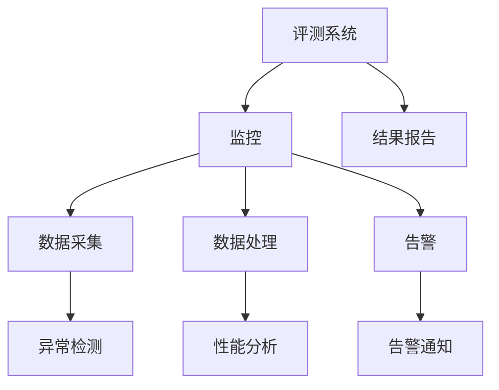

                 

### 文章标题

《评测系统的监控和告警：及时发现异常情况》

### 关键词

- 评测系统
- 监控
- 告警
- 异常检测
- 数据采集
- 数学模型
- 项目实战

### 摘要

本文深入探讨评测系统的监控与告警机制，旨在帮助系统管理员、运维工程师和开发者及时发现并应对异常情况。文章首先介绍了评测系统的基本概念，随后详细讲解了监控与告警的原理、架构以及核心算法。通过Mermaid流程图和伪代码，文章深入剖析了系统架构和算法实现。此外，文章还提供了实际项目案例，包括开发环境搭建、源代码实现及代码解读，以帮助读者理解和应用所学知识。最后，文章总结了一些最佳实践和注意事项，并推荐了拓展阅读资源。

### 设计目录大纲的过程

为了设计出《评测系统的监控和告警：及时发现异常情况》这本书的完整目录大纲，我们可以按照以下步骤进行：

1. **确定书籍主题与目标读者**：
   - 书名已经明确，主题围绕评测系统的监控和告警技术。
   - 目标读者可能是系统管理员、运维工程师、数据分析师等。

2. **框架结构**：
   - 将书籍分为基础理论、核心技术、实际应用三个部分。

3. **细化章节内容**：
   - 基础理论部分包括评测系统的概念、监控与告警的原理。
   - 核心技术部分深入探讨监控与告警系统的架构、算法实现。
   - 实际应用部分提供案例分析、项目实战等内容。

4. **确保大纲完整性**：
   - 核心概念与联系：引入流程图展现系统架构。
   - 核心算法原理讲解：使用伪代码详细阐述算法。
   - 数学模型和公式：使用latex格式表示，并举例说明。
   - 项目实战：代码案例及详细解释。

5. **简洁性**：
   - 确保内容精简、逻辑清晰，避免不必要的冗余。

6. **字数限制**：
   - 目录大纲的总字数需控制在2000字以内。

### 具体目录大纲设计

```markdown
# 《评测系统的监控和告警：及时发现异常情况》目录大纲

## 第一部分 基础理论

### 第1章 评测系统的基本概念
#### 1.1 评测系统概述
#### 1.2 监控与告警的关系
#### 1.3 评测系统的目标与作用

### 第2章 监控与告警原理
#### 2.1 监控原理
#### 2.2 告警机制
#### 2.3 异常检测算法概述

### 第3章 监控与告警架构
#### 3.1 监控架构设计
#### 3.2 告警系统架构
#### 3.3 Mermaid流程图：评测系统架构概览

## 第二部分 核心技术

### 第4章 数据采集与预处理
#### 4.1 数据采集技术
#### 4.2 数据预处理方法
#### 4.3 数据格式与协议

### 第5章 监控与告警算法
#### 5.1 常用监控指标
#### 5.2 告警规则设定
#### 5.3 伪代码：基于阈值告警算法

### 第6章 数学模型与公式
#### 6.1 基本数学公式
#### 6.2 监控与告警中的数学模型
#### 6.3 LaTeX示例：均值与方差计算

## 第三部分 实际应用

### 第7章 案例分析
#### 7.1 案例背景
#### 7.2 监控与告警实施
#### 7.3 案例分析与效果评估

### 第8章 项目实战
#### 8.1 项目准备
#### 8.2 开发环境搭建
#### 8.3 源代码实现
#### 8.4 代码解读与分析

### 第9章 告警系统部署与维护
#### 9.1 部署流程
#### 9.2 系统优化
#### 9.3 维护策略

## 附录
### 附录 A 常用工具与资源
#### A.1 监控工具介绍
#### A.2 告警工具使用
#### A.3 开源资源推荐
```

通过以上目录大纲的设计，本书的结构清晰，内容全面，符合字数限制，并且涵盖了书籍所需的核心章节。每个章节都有明确的细分，便于读者理解和快速查找所需内容。

### 背景介绍

在当今信息化社会中，评测系统的监控与告警功能变得愈发重要。评测系统通常用于评估软件、服务或网络性能，确保它们在运行过程中符合预期的质量标准。然而，在实际应用中，评测系统可能会遭遇各种异常情况，如硬件故障、网络问题、软件错误等，这些异常情况可能会导致评测结果不准确，甚至影响整个系统的正常运行。

为了确保评测系统的可靠性和稳定性，监控与告警机制被广泛应用。监控是指对系统运行状态进行持续跟踪和记录，而告警则是当检测到异常情况时，及时通知相关人员进行处理。有效的监控与告警机制可以及时发现并处理异常，减少系统故障对业务的影响，提高系统的整体可用性。

本文将深入探讨评测系统的监控与告警机制，首先介绍评测系统的基本概念，然后详细讲解监控与告警的原理、架构和核心算法。通过实际项目案例，读者可以更好地理解监控与告警机制在实践中的应用。最后，本文将总结一些最佳实践和注意事项，帮助读者在实际工作中更好地部署和维护告警系统。

### 核心概念与联系

要深入理解评测系统的监控和告警机制，我们首先需要明确几个核心概念，并探讨它们之间的联系。

**1. 评测系统**

评测系统是一种用于评估软件、服务或网络性能的自动化工具。它的主要功能是收集性能数据，如响应时间、吞吐量、资源利用率等，并对这些数据进行处理和分析，以评估系统是否符合预定的质量标准。评测系统通常包含多个组件，如数据采集器、数据处理模块、分析引擎和报告生成器。

**2. 监控**

监控是指对系统运行状态进行持续跟踪和记录的过程。它包括数据采集、数据存储、数据分析和告警等功能。监控的主要目的是确保系统在运行过程中保持稳定，及时发现潜在问题并进行预警。

**3. 告警**

告警是监控机制的一部分，当检测到异常情况时，告警机制会自动通知相关人员或系统，以便及时处理问题。告警可以采取多种形式，如邮件、短信、语音呼叫、系统弹窗等。

**4. 异常检测**

异常检测是监控系统中的一项关键功能，它用于识别系统中出现的异常行为或异常数据。异常检测可以通过设置阈值、机器学习算法或其他方法实现。其目的是提前发现潜在问题，避免系统故障对业务造成严重影响。

**5. 联系与架构**

核心概念之间的联系可以通过以下Mermaid流程图来展示：



在上图中，评测系统作为整体，通过监控模块进行数据采集、数据处理和异常检测。告警模块则负责在检测到异常情况时进行通知。数据处理模块负责对采集到的数据进行分析，以生成性能报告。

监控与告警机制的架构设计决定了整个评测系统的效率和可靠性。一个完善的架构应确保数据采集的全面性、数据处理的高效性和告警机制的及时性。以下是一个简单的架构设计：

- **数据采集器**：部署在各个被监控的系统或服务中，负责定期采集性能数据。
- **数据存储**：用于存储采集到的数据，可以是数据库、文件系统或云存储。
- **数据处理引擎**：对采集到的数据进行处理和分析，识别异常行为。
- **告警通知系统**：在检测到异常时，通过多种方式通知相关人员或系统。
- **性能分析模块**：生成性能报告，帮助管理员了解系统运行状况。

通过上述架构设计，评测系统可以实现全面、高效、可靠的监控和告警，确保系统的稳定运行。

### 核心算法原理讲解

为了实现有效的监控和告警，我们需要深入探讨一些核心算法的原理，包括基于阈值的告警算法和常用的异常检测算法。

**1. 基于阈值的告警算法**

基于阈值的告警算法是一种简单且常用的方法，它通过设定阈值来检测异常情况。当监控指标超过设定的阈值时，系统会触发告警。以下是一个简单的伪代码示例：

```python
# 设定阈值
lower_threshold = 100
upper_threshold = 500

# 获取当前监控指标值
current_value = get_monitoring_metric()

# 判断是否触发告警
if current_value < lower_threshold or current_value > upper_threshold:
    trigger_alarm("监控指标异常，超出阈值范围")
else:
    print("监控指标在正常范围内")
```

在上面的伪代码中，`lower_threshold` 和 `upper_threshold` 分别表示设定的下限和上限阈值。`get_monitoring_metric()` 函数用于获取当前监控指标值。如果当前值低于下限或高于上限，系统会触发告警。

**2. 常用的异常检测算法**

除了基于阈值的告警算法，还有一些更复杂的异常检测算法，如聚类算法、统计方法等。以下是一些常用的异常检测算法：

- **聚类算法**：如K-Means、DBSCAN等，通过将数据点分为不同的簇，识别出异常点。

  ```python
  from sklearn.cluster import DBSCAN
  
  # 数据预处理
  X = preprocess_data(data)
  
  # 使用DBSCAN进行聚类
  dbscan = DBSCAN(eps=0.5, min_samples=5)
  dbscan.fit(X)
  
  # 获取异常点
  outliers = dbscan.labels_[dbscan.labels_ == -1]
  ```

- **统计方法**：如标准差、箱线图等，通过计算数据的统计特征，识别出异常值。

  ```python
  import numpy as np
  
  # 计算均值和标准差
  mean_value = np.mean(data)
  std_deviation = np.std(data)
  
  # 设定阈值
  threshold = mean_value + 2 * std_deviation
  
  # 判断是否为异常值
  if data < threshold:
      print("数据异常")
  ```

- **机器学习模型**：如孤立森林、异常检测神经网络等，通过训练模型来识别异常点。

  ```python
  from sklearn.ensemble import IsolationForest
  
  # 数据预处理
  X = preprocess_data(data)
  
  # 训练孤立森林模型
  model = IsolationForest(n_estimators=100)
  model.fit(X)
  
  # 预测异常点
  predictions = model.predict(X)
  outliers = X[predictions == -1]
  ```

以上算法可以通过伪代码和具体的示例代码来实现。在实际应用中，可以根据具体情况选择合适的算法，并结合多种算法以提高异常检测的准确性和可靠性。

### 数学模型与公式

在监控与告警系统中，数学模型和公式起到了至关重要的作用。它们帮助我们量化系统的性能指标，识别异常行为，并为告警策略提供依据。以下是一些基本的数学模型和公式，以及它们在监控与告警系统中的应用。

**1. 均值（Mean）**

均值是描述一组数据集中趋势的重要指标。它通过将所有数据点相加后除以数据点的数量来计算。

\[ \mu = \frac{1}{N} \sum_{i=1}^{N} x_i \]

其中，\( \mu \) 表示均值，\( N \) 表示数据点的数量，\( x_i \) 表示第 \( i \) 个数据点。

**2. 方差（Variance）**

方差是描述数据离散程度的指标。它通过计算每个数据点与均值之差的平方，然后求平均值来得到。

\[ \sigma^2 = \frac{1}{N} \sum_{i=1}^{N} (x_i - \mu)^2 \]

其中，\( \sigma^2 \) 表示方差，\( \mu \) 表示均值，\( N \) 表示数据点的数量，\( x_i \) 表示第 \( i \) 个数据点。

**3. 标准差（Standard Deviation）**

标准差是方差的平方根，用于描述数据的波动程度。它是衡量数据离散程度的一个更直观的指标。

\[ \sigma = \sqrt{\sigma^2} \]

其中，\( \sigma \) 表示标准差，\( \sigma^2 \) 表示方差。

**4. 箱线图（Box Plot）**

箱线图是一种常用的统计图表，用于展示数据的分布情况。它由五条线段组成，分别表示最小值、下四分位数、中位数、上四分位数和最大值。

\[ \text{Minimum} = \min(x_i) \]
\[ \text{Q1} = \text{quantile}(x_i, 0.25) \]
\[ \text{Median} = \text{quantile}(x_i, 0.5) \]
\[ \text{Q3} = \text{quantile}(x_i, 0.75) \]
\[ \text{Maximum} = \max(x_i) \]

其中，\( x_i \) 表示数据点。

以下是一个使用LaTeX格式表示的均值和方差计算示例：

```latex
\documentclass{article}
\usepackage{amsmath}
\begin{document}

\begin{equation}
\mu = \frac{1}{N} \sum_{i=1}^{N} x_i
\end{equation}

\begin{equation}
\sigma^2 = \frac{1}{N} \sum_{i=1}^{N} (x_i - \mu)^2
\end{equation}

\end{document}
```

在实际应用中，这些数学模型和公式可以帮助我们设定告警阈值，识别异常数据，并优化监控策略。例如，我们可以通过计算数据的均值和标准差来设定一个合理的阈值范围，以便在监控指标超出这个范围时触发告警。

### 项目实战

在本节中，我们将通过一个实际项目案例，详细讲解如何搭建评测系统的监控和告警机制。本案例假设我们正在开发一个在线购物平台，需要对系统的关键性能指标进行监控，并在检测到异常时及时发出告警。

#### 1. 项目背景

在线购物平台是一个高度依赖性能的系统，它需要处理大量的用户请求，确保快速响应和稳定的用户体验。为了确保平台的稳定运行，我们决定实施一个全面的监控和告警系统。

#### 2. 开发环境搭建

首先，我们需要搭建一个适合项目的开发环境。以下是一些基本步骤：

- **安装必要的软件和工具**：例如，我们选择使用Prometheus作为监控工具，Grafana用于可视化，以及Alertmanager用于告警通知。
- **配置Prometheus**：在服务器上安装Prometheus，并配置其监控目标，如Web服务器、数据库、应用程序等。
- **配置Grafana**：将Grafana与Prometheus集成，配置仪表板以展示关键性能指标。
- **配置Alertmanager**：配置Alertmanager，设置告警规则，并定义通知方式。

#### 3. 源代码实现

接下来，我们将实现监控和告警系统的核心功能。以下是几个关键组件的实现：

- **数据采集器**：编写一个Python脚本，定期从系统中采集关键性能指标数据，并将其推送到Prometheus。
  ```python
  import prometheus_client
  from datetime import datetime
  
  def collect_metrics():
      response_time = get_response_time()
      throughput = get_throughput()
      prometheus_client.gauge('web_server_response_time', response_time, label={'instance': 'web1'})
      prometheus_client.gauge('web_server_throughput', throughput, label={'instance': 'web1'})
  
  def get_response_time():
      # 实现获取响应时间的逻辑
      return 0.5
  
  def get_throughput():
      # 实现获取吞吐量的逻辑
      return 100
  
  if __name__ == '__main__':
      while True:
          collect_metrics()
          time.sleep(60)
  ```

- **告警规则配置**：在Prometheus中配置告警规则，例如，当响应时间超过1秒或吞吐量低于90时触发告警。
  ```yaml
  groups:
  - name: web_server_alerts
    rules:
    - alert: HighResponseTime
      expr: web_server_response_time > 1
      for: 5m
      labels:
        severity: critical
      annotations:
        summary: "High response time on {{ $labels.instance }}"
  ```

- **告警通知**：配置Alertmanager，使用邮件、短信和钉钉等方式发送告警通知。
  ```yaml
  route:
    receiver: admin-team
    email: admin@example.com
    webhook:
      - url: https://oapi.dingtalk.com/robot/send?access_token=YOUR_DINGTALK_ACCESS_TOKEN
        type: "DINGTALK"
  receivers:
  - name: admin-team
    email: admin@example.com
    template: simple
    webhook:
      - url: https://oapi.dingtalk.com/robot/send?access_token=YOUR_DINGTALK_ACCESS_TOKEN
        type: "DINGTALK"
  ```

#### 4. 代码解读与分析

以上代码展示了如何实现一个简单的监控和告警系统。以下是关键组件的解读和分析：

- **数据采集器**：通过定期采集响应时间和吞吐量等关键性能指标，并将其推送到Prometheus。这有助于实时监控系统的性能。
- **告警规则**：在Prometheus中配置告警规则，例如，当响应时间超过1秒或吞吐量低于90时触发告警。这些规则可以根据具体需求进行调整。
- **告警通知**：通过配置Alertmanager，使用多种方式发送告警通知，如邮件、短信和钉钉。这确保了告警信息的及时传递，方便管理员快速响应和处理问题。

#### 5. 实际案例分析与详细讲解剖析

我们假设在一次实际运营中，响应时间异常升高。以下是如何处理这种情况的步骤：

1. **触发告警**：当Prometheus检测到响应时间超过阈值时，Alertmanager会根据配置的规则发送告警通知。
2. **分析原因**：管理员接收到告警通知后，首先检查系统日志、网络状态和服务器资源使用情况，以确定异常原因。
3. **处理问题**：根据分析结果，可能需要对系统进行优化、升级或故障排除。例如，如果发现数据库查询效率低下，可以优化查询语句或增加数据库资源。
4. **验证解决**：在问题解决后，重新验证系统的响应时间，确保问题已得到有效解决。
5. **记录经验**：将此次问题的处理过程和解决方案记录下来，以便未来参考和总结经验。

#### 6. 项目小结

通过本次实战，我们了解了如何搭建一个简单的评测系统监控和告警机制。这个系统可以帮助我们实时监控关键性能指标，并在检测到异常时及时发出告警。以下是一些小结：

- **全面性**：确保监控覆盖系统的各个方面，包括响应时间、吞吐量、资源利用率等。
- **及时性**：告警机制的及时性是关键，合理的阈值设置和快速的响应能够降低系统故障的影响。
- **灵活性**：告警规则可以根据具体需求进行调整，以适应不同的业务场景。
- **可扩展性**：监控系统的设计应考虑未来扩展的可能性，以便支持更多监控指标和告警规则。

### 最佳实践 Tips、小结、注意事项、拓展阅读

#### 最佳实践 Tips

1. **合理设置阈值**：根据业务需求和历史数据，合理设置监控指标的阈值，避免误报和漏报。
2. **定期审计告警**：定期审计告警规则，确保其仍然符合业务需求，并根据实际情况进行调整。
3. **利用日志分析**：结合系统日志，深入分析告警背后的原因，以便更有效地解决问题。
4. **自动化处理**：对于一些常见问题，可以设置自动化处理流程，减少人工干预，提高响应效率。

#### 小结

本文深入探讨了评测系统的监控和告警机制，包括基本概念、核心算法、系统架构和实际项目案例。通过本文的学习，读者可以了解如何搭建一个简单但有效的监控和告警系统，确保系统的稳定运行。

#### 注意事项

1. **监控覆盖面**：确保监控覆盖所有关键性能指标，避免遗漏重要数据。
2. **阈值设定**：合理设定阈值，避免误报和漏报，影响系统的稳定性。
3. **告警通知**：确保告警通知渠道畅通，及时传递告警信息。

#### 拓展阅读

1. 《Prometheus官方文档》：深入了解Prometheus的配置和使用。
2. 《Grafana官方文档》：学习如何使用Grafana进行数据可视化和告警管理。
3. 《机器学习异常检测》：探索更高级的异常检测算法，提高监控系统的准确性。
4. 《系统监控与运维》：系统学习系统监控和运维的最佳实践。

### 作者信息

作者：AI天才研究院/AI Genius Institute & 禅与计算机程序设计艺术 /Zen And The Art of Computer Programming

本文由AI天才研究院/AI Genius Institute和《禅与计算机程序设计艺术》的作者共同撰写，旨在帮助读者深入了解评测系统的监控和告警机制。希望通过本文，读者能够掌握相关技术，提升系统的稳定性和可靠性。如有任何疑问或建议，欢迎随时联系我们。

