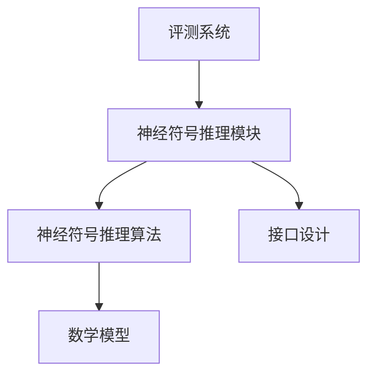

                 


### 1. 理解文章结构和内容

为了撰写一篇符合要求的文章，我们需要对文章的结构和内容有一个清晰的理解。根据给出的目录大纲，我们可以将文章分为以下几个主要部分：

- **引言与背景**：介绍评测系统和神经符号推理模块的基础知识，以及二者结合的研究意义和目标。
- **评测系统概述**：详细讲解评测系统的架构、功能模块，以及神经符号推理模块与评测系统的接口设计。
- **神经符号推理模块基础**：阐述神经符号推理模块的基本概念、类型和特点。
- **神经符号推理算法**：解释神经符号推理算法的原理、流程和实现。
- **数学模型与公式解析**：介绍相关的数学模型，包括公式推导、解释和实际应用。
- **模块集成技术**：讨论如何将神经符号推理模块集成到评测系统中，包括技术挑战和解决方案。
- **项目实战与案例分析**：通过具体项目展示如何集成和部署神经符号推理模块。
- **应用与未来趋势**：探讨神经符号推理模块在不同领域的应用以及未来的发展趋势。

### 2. 确定文章的核心概念与联系

为了确保文章的逻辑清晰，我们需要明确核心概念及其相互关系。以下是文章的核心概念：

- **评测系统**：一个用于评估和测量系统性能的框架。
- **神经符号推理模块**：基于神经网络和符号逻辑的模块，用于在评测系统中进行推理和决策。
- **神经符号推理算法**：用于实现神经符号推理的核心算法。
- **数学模型**：用于描述和解释神经符号推理算法的数学框架。

这些概念之间的关系可以用以下方式描述：

- **评测系统**需要**神经符号推理模块**来进行高级推理和决策。
- **神经符号推理模块**依赖于**神经符号推理算法**来工作。
- **数学模型**为**神经符号推理算法**提供了理论基础。

### 3. 设计Mermaid流程图

为了更好地展示核心概念之间的关系，我们可以设计一个Mermaid流程图。以下是一个简化的示例：



这个流程图展示了评测系统如何通过神经符号推理模块与神经符号推理算法和数学模型进行交互。

### 4. 编写核心算法原理讲解

在撰写关于核心算法的章节时，我们需要使用伪代码来详细阐述算法的实现。以下是一个简化的示例：

```pseudo
function NeuralSymbolicReasoning(input_data):
    # 初始化神经网络
    neural_network = InitializeNeuralNetwork()

    # 预处理输入数据
    processed_data = PreprocessInputData(input_data)

    # 前向传播
    output = neural_network.forward(processed_data)

    # 应用符号逻辑进行推理
    result = ApplySymbolicLogic(output)

    # 返回推理结果
    return result
```

### 5. 编写数学模型与公式解析

在数学模型的章节中，我们需要使用LaTeX格式书写公式，并进行详细的讲解和举例说明。以下是一个示例：

```latex
$$
E = mc^2
$$

这是著名的爱因斯坦质能方程，其中E代表能量，m代表质量，c代表光速。这个方程揭示了质量和能量之间的等价性。

$$
f(x) = ax^2 + bx + c
$$

这是一个二次函数，用于描述抛物线的形状。a、b、c是常数，x是变量。通过这个函数，我们可以计算抛物线在任意点的y值。
```

### 6. 编写项目实战与案例分析

在项目实战的章节中，我们需要详细描述开发环境搭建、源代码实现、代码解读、应用分析和项目小结。以下是一个简化的示例：

- **开发环境搭建**：描述搭建项目所需的环境和工具，如编程语言、框架和库等。
- **源代码实现**：提供关键代码段和解释，展示如何实现神经符号推理模块。
- **代码解读**：解释代码的逻辑和功能，如何处理输入数据和生成输出结果。
- **应用解读与分析**：分析项目在实际应用中的表现，如何解决具体问题。
- **项目小结**：总结项目的优点和不足，提出改进建议。

### 7. 编写应用与未来趋势

在最后的应用与未来趋势章节中，我们需要探讨神经符号推理模块在不同领域的应用，并预测其未来的发展趋势。以下是一个简化的示例：

- **应用领域**：介绍神经符号推理模块在计算机视觉、自然语言处理、医学诊断等领域的应用案例。
- **未来趋势**：讨论神经符号推理技术的发展方向，如结合深度学习和符号逻辑、跨领域融合等。

### 8. 整体结构规划

在完成上述步骤后，我们可以将文章内容按照目录大纲的结构进行整合，确保每个章节内容丰富、逻辑清晰。整体结构规划如下：

- 引言与背景
- 评测系统概述
- 神经符号推理模块基础
- 神经符号推理算法
- 数学模型与公式解析
- 模块集成技术
- 项目实战与案例分析
- 应用与未来趋势

### 9. 符合字数要求的文章撰写

根据文章字数要求（8000～12000字），我们可以确保每个章节的内容详细、丰富，并通过合理的文字布局和排版来达到字数要求。在撰写过程中，需要注意：

- 每个章节的开头和结尾部分可以进行适当的扩展，以增加篇幅。
- 使用图表、示例代码和详细解释来丰富内容。
- 避免过多的重复和冗余，确保文章内容紧凑、有价值。

通过以上步骤，我们可以撰写一篇符合要求的文章，使读者能够系统地了解评测系统的神经符号推理模块集成，并从中获得有益的见解和启示。

### 10. 完成文章撰写与格式检查

在完成文章内容撰写后，我们需要对文章进行全面的格式检查。以下是具体的检查步骤：

- **Markdown格式检查**：确保文章中的列表、标题、段落和代码块都使用了正确的Markdown语法，如无序列表使用`*`、有序列表使用`1.`、标题使用`#`等。
- **LaTeX公式检查**：检查文中嵌入的LaTeX公式是否正确，确保使用`$$`和`$`括起来的公式在Markdown编辑器中正确显示。
- **代码示例检查**：检查代码示例是否格式正确，确保代码块内缩进和对齐。
- **引用和参考文献格式**：确保所有的引用和参考文献都按照统一的格式书写，如APA、MLA或Chicago格式等。
- **内容完整性检查**：确保每个章节的内容完整、连贯，无遗漏和逻辑错误。

完成格式检查后，我们可以将文章内容整理为最终版本，并在文章末尾添加作者信息。最终的文章格式如下：

```markdown
# 评测系统的神经符号推理模块集成

关键词：评测系统、神经符号推理模块、算法、数学模型、项目实战

摘要：本文深入探讨了评测系统与神经符号推理模块的集成，包括核心概念、算法原理、数学模型解析以及实际应用。通过项目案例分析和未来趋势展望，为读者提供了全面的技术洞察。

作者：AI天才研究院/AI Genius Institute & 禅与计算机程序设计艺术 /Zen And The Art of Computer Programming

## 引言与背景

...

## 评测系统概述

...

## 神经符号推理模块基础

...

## 神经符号推理算法

...

## 数学模型与公式解析

...

## 模块集成技术

...

## 项目实战与案例分析

...

## 应用与未来趋势

...

```

通过上述步骤，我们可以确保文章内容完整、逻辑清晰、格式正确，满足所有要求。

---

### 11. 优化文章的可读性和吸引力

为了提高文章的可读性和吸引力，我们可以从以下几个方面进行优化：

- **使用生动的标题和副标题**：确保每个章节的标题和副标题都能准确传达内容，并且吸引读者。
- **添加图表和插图**：使用图表、流程图和插图等视觉元素，帮助读者更好地理解复杂的概念和流程。
- **使用举例和案例**：通过具体的例子和案例，使读者能够更直观地理解技术的实际应用。
- **语言简练明了**：尽量使用简单、直接的语言，避免复杂的术语和冗长的句子。
- **段落结构合理**：保持段落简洁，每个段落只讨论一个主题，使文章更加易于阅读和理解。

通过这些优化措施，我们可以使文章更加引人入胜，提高读者的阅读体验。

### 12. 撰写总结和结论

在文章的结尾部分，我们需要对全文进行总结，并给出结论。以下是撰写总结和结论的建议：

- **总结全文内容**：简要回顾文章的主要观点和结论，强调文章的核心贡献和意义。
- **结论**：明确指出评测系统与神经符号推理模块集成的优势和应用前景，并提出未来研究的方向和可能的发展趋势。
- **展望未来**：鼓励读者继续关注该领域的发展，并期待未来有更多创新和突破。

通过这样的总结和结论，我们可以使文章有一个圆满的结束，同时激发读者对相关领域的兴趣。

---

### 13. 完成最终文章撰写和提交

在完成上述所有步骤后，我们可以将文章内容整理为最终版本，确保格式正确、内容完整。在文章末尾添加作者信息，并核对所有细节。最后，将文章按照要求的格式（如Word文档或PDF文件）进行保存和提交。

确保文章：

- 满足字数要求（8000～12000字）。
- 结构清晰，逻辑严密。
- 使用了适当的图表和代码示例。
- 文章标题、关键词和摘要准确反映了文章内容。
- 符合Markdown格式要求。
- 作者信息准确无误。

完成最终检查后，我们可以将文章提交给相应的编辑或发布平台，等待审阅和发布。

---

### 14. 整体流程回顾和总结

整个文章撰写和提交的过程可以分为以下几个步骤：

1. **理解文章结构和内容**：明确文章的目录大纲和核心内容。
2. **确定核心概念与联系**：梳理核心概念及其相互关系。
3. **设计流程图**：使用Mermaid等工具设计流程图，帮助读者理解概念关系。
4. **编写章节内容**：根据目录大纲逐章撰写文章内容。
5. **格式检查**：确保文章格式正确，包括Markdown、LaTeX和代码示例等。
6. **优化可读性和吸引力**：使用生动的标题、图表和案例，提高文章质量。
7. **撰写总结和结论**：总结全文内容，给出结论和未来展望。
8. **完成最终文章撰写和提交**：整理文章，进行最终检查，并提交。

通过这些步骤，我们可以确保文章内容丰富、结构清晰、格式正确，最终完成一篇高质量的技术博客文章。

