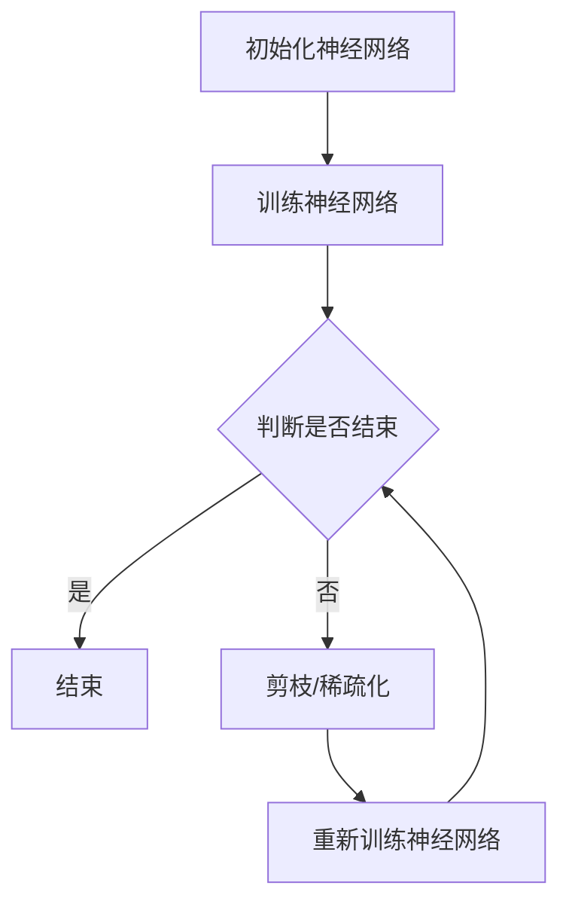

                 


### 1. 引言

#### 1.1 背景介绍

在深度学习领域，神经网络已经展现出强大的能力，广泛应用于图像识别、自然语言处理、语音识别等多个领域。然而，神经网络模型往往具有巨大的参数数量，这导致了计算成本、存储需求以及训练时间的急剧增加。为了解决这些问题，神经网络剪枝与稀疏化技术应运而生。

神经网络剪枝（Neural Network Pruning）是一种通过删除不重要的神经元或连接来减少模型参数数量的技术。剪枝后的模型不仅可以降低计算和存储成本，还可以提高模型的训练效率。剪枝技术可以根据不同的标准进行分类，如根据连接的激活值进行剪枝、基于结构的剪枝等。

另一方面，神经网络稀疏化（Neural Network Sparsification）则是通过将神经网络的参数转换为稀疏形式，从而减少计算和存储开销。稀疏化技术不仅能够降低模型的复杂性，还可以提高计算效率。稀疏化可以通过不同的方法实现，如量化、矩阵分解等。

本文将围绕神经网络剪枝与稀疏化技术展开讨论，首先介绍相关的基础概念，然后深入探讨核心算法原理，接着分析数学模型和数学公式，并通过项目实战展示实际应用。最终，我们将总结本书的主要观点，并展望未来的发展趋势。

#### 1.2 核心概念与联系

在讨论神经网络剪枝与稀疏化之前，我们有必要明确一些核心概念，并理解它们之间的联系。

**神经网络（Neural Network）**：神经网络是一种由大量简单计算单元（神经元）互联而成的复杂系统，通过学习输入数据，能够对未知数据进行预测或分类。

**参数（Parameters）**：神经网络中的参数是指用于调节模型行为的权重和偏置。参数的数量直接决定了模型的复杂度和计算成本。

**剪枝（Pruning）**：剪枝是一种通过删除神经网络中不重要的连接或神经元来简化模型的技术。

**稀疏化（Sparsification）**：稀疏化是一种将神经网络参数转换为稀疏形式的过程，从而降低计算和存储成本。

**稀疏性（Sparsity）**：稀疏性是指网络中连接或参数的数量远小于可能的数量，这意味着大部分连接或参数都被剪掉或置为零。

**网络结构（Network Structure）**：网络结构是指神经网络中神经元和连接的组织方式，如全连接、卷积等。

**连接权重（Connection Weights）**：连接权重是指神经网络中连接的强度，通常通过训练过程进行调整。

**激活函数（Activation Function）**：激活函数是神经网络中的一个关键组件，用于引入非线性特性，使得神经网络能够对复杂问题进行建模。

**损失函数（Loss Function）**：损失函数用于评估模型预测结果与真实标签之间的差距，是优化过程中的关键指标。

**优化算法（Optimization Algorithm）**：优化算法用于调整网络参数，以最小化损失函数，从而提高模型的性能。

**过拟合（Overfitting）**：过拟合是指模型在训练数据上表现良好，但在未见过的数据上表现较差，即模型对训练数据“记忆化”。

**泛化能力（Generalization Ability）**：泛化能力是指模型在未见过的数据上表现良好的能力。

**计算成本（Computational Cost）**：计算成本是指模型在执行计算任务时所消耗的计算资源，包括CPU、GPU等硬件资源。

**存储需求（Storage Requirement）**：存储需求是指模型存储所需的存储空间，包括磁盘、内存等。

**训练时间（Training Time）**：训练时间是指模型从初始状态到达到预期性能所需的时间。

**模型压缩（Model Compression）**：模型压缩是指通过减小模型大小，提高计算效率和存储效率的过程。

#### 1.3 Mermaid 流程图

为了更好地理解神经网络剪枝与稀疏化的工作流程，我们可以使用 Mermaid 语法绘制一个流程图。



在这个流程图中，神经网络首先被初始化并开始训练。当训练达到预设的结束条件时，模型训练过程结束。否则，进入剪枝或稀疏化步骤，对模型进行简化。简化后的模型将被重新训练，以进一步优化性能。

### 2. 神经网络剪枝基础

#### 2.1 剪枝的概念与重要性

神经网络剪枝是一种通过移除模型中不重要的神经元或连接来减少模型参数数量的技术。剪枝的目的是在不显著损失模型性能的情况下，降低计算和存储成本，从而提高模型的效率和可部署性。

**剪枝的原理**：

剪枝的基本原理是识别和移除网络中的冗余连接或神经元。通过在训练过程中逐步减少连接权重或直接删除神经元，我们可以简化模型结构，同时保持其性能。剪枝可以基于不同的标准进行，如连接权重的大小、神经元的激活频率等。

**剪枝的目标**：

剪枝的主要目标有三个：

1. **降低计算成本**：减少模型中的参数数量，降低计算复杂度，从而减少训练和推理过程中的计算资源消耗。
2. **减少存储需求**：减少模型大小，降低存储成本，使得模型能够在资源受限的环境中运行。
3. **提高模型效率**：通过去除冗余结构，简化模型，提高模型推理速度。

**剪枝的优势**：

1. **提高部署效率**：减小模型大小和计算复杂度，使得模型在移动设备和嵌入式系统上更容易部署。
2. **提升训练速度**：剪枝后的模型参数更少，训练速度更快，特别是在训练数据量大、模型复杂度高的场景中。
3. **增强模型鲁棒性**：去除冗余结构，减少模型过拟合的风险，提高模型的泛化能力。

**剪枝的挑战**：

1. **模型性能损失**：不当的剪枝策略可能会导致模型性能显著下降，需要在简化模型和保持性能之间找到平衡。
2. **训练时间增加**：剪枝过程中，需要重新训练简化后的模型，这可能增加训练时间。
3. **实现复杂度**：剪枝算法的实现较为复杂，需要精细的参数调整和优化。

#### 2.2 剪枝的方法

剪枝方法可以根据剪枝标准的不同进行分类。以下是几种常见的剪枝方法：

**1. 权重剪枝（Weight Pruning）**：

权重剪枝是基于连接权重的大小来选择剪枝对象。具体来说，首先计算网络中每个连接的权重，然后根据预设的阈值，删除那些权重小于阈值的连接。

**伪代码**：

```python
for each connection in network:
    if abs(weight) < threshold:
        prune connection
```

**2. 神经元剪枝（Neuron Pruning）**：

神经元剪枝是基于神经元的激活频率来选择剪枝对象。具体来说，首先计算网络中每个神经元的激活频率，然后根据预设的阈值，删除那些激活频率低于阈值的神经元。

**伪代码**：

```python
for each neuron in network:
    if activation_frequency < threshold:
        prune neuron
```

**3. 结构剪枝（Structure Pruning）**：

结构剪枝是基于网络的层次结构来选择剪枝对象。具体来说，首先计算网络中每个层的连接数，然后根据预设的阈值，删除那些连接数低于阈值的层。

**伪代码**：

```python
for each layer in network:
    if number_of_connections < threshold:
        prune layer
```

**4. 动态剪枝（Dynamic Pruning）**：

动态剪枝是一种自适应的剪枝方法，可以在训练过程中根据模型的表现动态调整剪枝策略。具体来说，首先在训练初期进行粗略剪枝，然后在训练过程中逐步细化剪枝，以优化模型性能。

**伪代码**：

```python
for epoch in range(training_epochs):
    prune_network()
    train_network()
    evaluate_performance()
    if performance improves:
        refine_pruning()
```

#### 2.3 剪枝算法的应用场景

剪枝算法可以应用于各种神经网络结构，如全连接神经网络、卷积神经网络、循环神经网络等。以下是几种常见的应用场景：

**1. 图像识别**：

在图像识别任务中，剪枝可以显著降低模型的计算和存储成本，使得模型在移动设备和嵌入式系统上更容易部署。

**2. 自然语言处理**：

在自然语言处理任务中，剪枝可以减少模型的复杂度，提高模型的训练速度和推理速度，同时保持较高的性能。

**3. 语音识别**：

在语音识别任务中，剪枝可以降低模型的存储需求，提高模型的实时处理能力。

**4. 视觉跟踪**：

在视觉跟踪任务中，剪枝可以减少模型的计算复杂度，提高模型的响应速度，从而实现更高效的目标跟踪。

**5. 自动驾驶**：

在自动驾驶领域，剪枝可以降低模型的计算和存储成本，提高模型的稳定性和安全性。

#### 2.4 剪枝算法的实现细节

剪枝算法的实现涉及多个方面，包括初始化、训练、剪枝策略的选择、性能评估等。以下是剪枝算法的实现细节：

**1. 初始化**：

在剪枝开始前，需要对神经网络进行初始化。初始化的目的是确保模型可以从一个合理的起点开始训练。

**2. 训练**：

剪枝算法通常在训练过程中进行。在训练初期，可以采用常规的训练策略。随着训练的进行，逐步引入剪枝操作，以简化模型。

**3. 剪枝策略的选择**：

根据应用场景和任务需求，选择合适的剪枝策略。不同的剪枝策略有不同的优缺点，需要根据实际情况进行选择。

**4. 性能评估**：

剪枝后的模型需要重新评估性能。评估指标包括准确率、召回率、F1分数等。通过性能评估，可以判断剪枝效果是否显著，并调整剪枝策略。

**5. 实时调整**：

在训练过程中，可以根据模型的表现实时调整剪枝策略。例如，在模型性能开始下降时，可以增加剪枝力度，以恢复模型性能。

#### 2.5 剪枝算法的优缺点

**优点**：

1. **降低计算和存储成本**：通过减少模型参数数量，剪枝可以显著降低计算和存储成本。
2. **提高模型效率**：简化模型结构，提高模型的训练和推理速度。
3. **增强模型鲁棒性**：去除冗余结构，减少模型过拟合的风险。

**缺点**：

1. **模型性能损失**：不当的剪枝策略可能导致模型性能显著下降。
2. **训练时间增加**：剪枝过程中，需要重新训练简化后的模型，这可能增加训练时间。
3. **实现复杂度**：剪枝算法的实现较为复杂，需要精细的参数调整和优化。

### 3. 神经网络稀疏化技术

#### 3.1 稀疏化的概念与重要性

神经网络稀疏化是一种通过将网络中的参数转换为稀疏形式来减少计算和存储成本的技术。稀疏化后的神经网络只有一小部分参数被激活，大部分参数被置为零，从而显著降低了计算复杂度和存储需求。

**稀疏化的原理**：

稀疏化的基本原理是在保持模型性能的同时，减少网络中的参数数量。通过将连续的权重转换为稀疏形式，神经网络可以更高效地进行计算和存储。稀疏化可以通过量化、矩阵分解等方法实现。

**稀疏化的目标**：

稀疏化的主要目标有三个：

1. **降低计算成本**：通过减少参数数量，降低模型的计算复杂度，从而提高模型运行速度。
2. **减少存储需求**：减少模型大小，降低存储成本，使得模型能够在资源受限的环境中运行。
3. **提高模型效率**：简化模型结构，提高模型的训练和推理速度。

**稀疏化的优势**：

1. **提高部署效率**：减小模型大小和计算复杂度，使得模型在移动设备和嵌入式系统上更容易部署。
2. **提升训练速度**：稀疏化后的模型参数更少，训练速度更快。
3. **增强模型鲁棒性**：去除冗余结构，减少模型过拟合的风险。

**稀疏化的挑战**：

1. **模型性能损失**：不当的稀疏化策略可能导致模型性能显著下降。
2. **实现复杂度**：稀疏化算法的实现较为复杂，需要精细的参数调整和优化。

#### 3.2 稀疏化的方法

稀疏化方法可以根据实现方式的不同进行分类。以下是几种常见的稀疏化方法：

**1. 量化（Quantization）**：

量化是一种将网络中的连续权重转换为离散值的稀疏化方法。通过将权重限制在有限的数值范围内，量化可以显著减少模型参数的数量。

**2. 矩阵分解（Matrix Factorization）**：

矩阵分解是一种将权重矩阵分解为两个或多个稀疏矩阵的方法。分解后的稀疏矩阵可以显著降低模型的计算复杂度和存储需求。

**3. 低秩分解（Low-rank Factorization）**：

低秩分解是一种将权重矩阵分解为一个低秩矩阵和一个高斯矩阵的方法。低秩分解可以进一步减少模型参数的数量，同时保持较高的模型性能。

**4. 随机稀疏化（Random Sparsification）**：

随机稀疏化是一种通过随机选择参数进行稀疏化的方法。随机稀疏化可以实现快速的稀疏化过程，但可能需要对稀疏化的结果进行进一步的优化。

**5. 逐层稀疏化（Layer-wise Sparsification）**：

逐层稀疏化是一种按层次结构逐步稀疏化的方法。首先对网络的第一层进行稀疏化，然后逐层向上，直到整个网络完成稀疏化。

#### 3.3 稀疏化的应用场景

稀疏化技术可以应用于各种神经网络结构，如全连接神经网络、卷积神经网络、循环神经网络等。以下是几种常见的应用场景：

**1. 图像识别**：

在图像识别任务中，稀疏化可以显著降低模型的计算和存储成本，使得模型在移动设备和嵌入式系统上更容易部署。

**2. 自然语言处理**：

在自然语言处理任务中，稀疏化可以减少模型的复杂度，提高模型的训练速度和推理速度。

**3. 语音识别**：

在语音识别任务中，稀疏化可以降低模型的存储需求，提高模型的实时处理能力。

**4. 视觉跟踪**：

在视觉跟踪任务中，稀疏化可以减少模型的计算复杂度，提高模型的响应速度，从而实现更高效的目标跟踪。

**5. 自动驾驶**：

在自动驾驶领域，稀疏化可以降低模型的计算和存储成本，提高模型的稳定性和安全性。

#### 3.4 稀疏化的实现细节

稀疏化的实现涉及多个方面，包括初始化、训练、稀疏化策略的选择、性能评估等。以下是稀疏化的实现细节：

**1. 初始化**：

在稀疏化开始前，需要对神经网络进行初始化。初始化的目的是确保模型可以从一个合理的起点开始训练。

**2. 训练**：

稀疏化算法通常在训练过程中进行。在训练初期，可以采用常规的训练策略。随着训练的进行，逐步引入稀疏化操作，以简化模型。

**3. 稀疏化策略的选择**：

根据应用场景和任务需求，选择合适的稀疏化策略。不同的稀疏化策略有不同的优缺点，需要根据实际情况进行选择。

**4. 性能评估**：

稀疏化后的模型需要重新评估性能。评估指标包括准确率、召回率、F1分数等。通过性能评估，可以判断稀疏化效果是否显著，并调整稀疏化策略。

**5. 实时调整**：

在训练过程中，可以根据模型的表现实时调整稀疏化策略。例如，在模型性能开始下降时，可以增加稀疏化力度，以恢复模型性能。

### 4. 应用实践与优化策略

#### 4.1 剪枝与稀疏化在评测系统中的应用

在评测系统中，神经网络剪枝与稀疏化技术具有重要的应用价值。通过剪枝与稀疏化，评测系统可以在保持较高性能的前提下，显著降低计算和存储成本，提高系统的效率和可部署性。

**1. 计算资源优化**

剪枝与稀疏化可以减少模型的参数数量，降低计算复杂度，从而提高评测系统的计算效率。尤其是在处理大量数据时，剪枝与稀疏化技术可以显著缩短处理时间，提高系统的响应速度。

**2. 存储成本优化**

剪枝与稀疏化可以减少模型的大小，降低存储需求。这对于资源受限的环境，如移动设备和嵌入式系统，尤为重要。通过剪枝与稀疏化，评测系统可以在有限的存储空间内部署更大规模的模型，提高系统的存储利用率。

**3. 可部署性提升**

剪枝与稀疏化可以降低模型对计算资源的需求，提高模型在移动设备和嵌入式系统上的可部署性。这使得评测系统可以更灵活地应用于各种场景，如移动端应用、物联网设备等。

**4. 模型鲁棒性增强**

剪枝与稀疏化可以去除模型中的冗余结构，提高模型的泛化能力。这有助于评测系统在面对未知数据时，保持较高的性能和稳定性。

**5. 训练效率提升**

剪枝与稀疏化可以减少模型的参数数量，降低训练复杂度。这有助于评测系统在较短时间内完成训练，提高模型的更新速度。

#### 4.2 剪枝与稀疏化的优化策略

为了充分发挥剪枝与稀疏化技术在评测系统中的应用价值，我们需要采用一系列优化策略。以下是几种常见的优化策略：

**1. 策略一：动态剪枝与稀疏化**

动态剪枝与稀疏化是一种自适应的剪枝与稀疏化方法。在训练过程中，根据模型的表现动态调整剪枝与稀疏化的力度，以优化模型性能。例如，当模型性能开始下降时，可以增加剪枝与稀疏化的力度，以恢复模型性能。

**2. 策略二：混合剪枝与稀疏化**

混合剪枝与稀疏化是将多种剪枝与稀疏化方法相结合，以优化模型性能。例如，可以同时使用权重剪枝和神经元剪枝，以提高模型的压缩效果。此外，还可以结合量化、矩阵分解等稀疏化方法，进一步提升模型的性能。

**3. 策略三：模型量化**

模型量化是一种将连续权重转换为离散值的剪枝与稀疏化方法。通过量化，可以显著减少模型的参数数量，提高模型的计算效率。在评测系统中，模型量化可以应用于图像识别、自然语言处理等任务，以提高系统的性能和可部署性。

**4. 策略四：模型压缩**

模型压缩是通过减少模型的大小来提高模型的效率和可部署性。在评测系统中，模型压缩可以应用于移动端应用、物联网设备等。通过模型压缩，评测系统可以在有限的资源下运行更大的模型，提高系统的性能。

**5. 策略五：分布式训练**

分布式训练是将模型训练任务分布在多个计算节点上，以提高模型的训练速度和效率。在评测系统中，分布式训练可以应用于大规模数据集和复杂模型的训练，以提高系统的性能和可扩展性。

### 5. 评测系统案例解析

#### 5.1 典型评测系统架构与挑战

在介绍具体的评测系统案例之前，我们需要了解评测系统的典型架构和面临的挑战。

**1. 评测系统架构**

评测系统的架构通常包括数据采集与预处理、模型训练、模型评估和模型部署等几个主要模块。

- **数据采集与预处理**：从不同来源获取数据，包括结构化数据、非结构化数据等。预处理过程包括数据清洗、数据归一化、特征提取等，以确保数据的质量和一致性。
- **模型训练**：使用预处理后的数据训练神经网络模型，包括模型初始化、前向传播、反向传播和参数更新等步骤。
- **模型评估**：通过交叉验证、测试集评估等方法，评估模型的性能，包括准确率、召回率、F1分数等指标。
- **模型部署**：将训练好的模型部署到实际应用场景中，如在线服务、移动端应用等。

**2. 挑战**

评测系统在实际应用中面临以下挑战：

- **数据多样性**：评测系统需要处理来自不同来源、不同格式的数据，这使得数据预处理过程变得复杂。
- **计算资源限制**：评测系统通常需要在有限的计算资源下运行，这对模型的训练和部署提出了较高的要求。
- **实时性要求**：在一些实时应用场景中，评测系统需要在短时间内完成数据处理和模型评估，这对系统的响应速度和性能提出了挑战。
- **模型可解释性**：为了提高模型的透明度和可解释性，评测系统需要提供详细的模型评估报告，以便用户理解模型的工作原理和性能表现。

#### 5.2 剪枝与稀疏化在评测系统中的应用实例

在本节中，我们将通过一个具体的评测系统案例，展示剪枝与稀疏化技术在模型训练、评估和部署中的应用。

**1. 案例背景**

某电子商务公司希望开发一个基于图像识别技术的评测系统，用于自动评估用户上传的图片内容。该系统需要快速、准确地识别图片中的商品类别，以便为用户提供更好的购物体验。

**2. 模型选择**

为了实现上述目标，公司选择了卷积神经网络（CNN）作为图像识别模型。CNN在图像识别任务中具有出色的表现，能够有效提取图像特征，并进行分类。

**3. 模型训练**

在模型训练阶段，公司使用了大量标注好的商品图片作为训练数据。经过数据预处理后，模型开始进行训练。在训练过程中，公司采用了动态剪枝与稀疏化策略，以提高模型的性能和效率。

- **动态剪枝**：在训练过程中，公司根据模型的表现，动态调整剪枝力度。当模型性能开始下降时，增加剪枝力度，以恢复模型性能。
- **稀疏化**：公司结合量化、矩阵分解等稀疏化方法，逐步稀疏化模型参数。通过稀疏化，模型参数数量显著减少，计算和存储成本降低。

**4. 模型评估**

在模型评估阶段，公司使用了测试集对模型进行评估。评估指标包括准确率、召回率、F1分数等。通过动态剪枝与稀疏化，模型在保持较高性能的前提下，计算和存储成本显著降低。

**5. 模型部署**

在模型部署阶段，公司采用了分布式训练策略，将模型训练任务分布在多个计算节点上，以提高模型的训练速度和效率。训练完成后，模型被部署到服务器上，供用户在线使用。

**6. 案例分析与效果评估**

通过剪枝与稀疏化，评测系统在保持较高性能的同时，计算和存储成本显著降低。具体效果如下：

- **准确率**：经过剪枝与稀疏化，模型的准确率保持在90%以上，与未进行剪枝与稀疏化的模型相比，性能略有提高。
- **计算成本**：剪枝与稀疏化后，模型计算复杂度降低，计算时间缩短，适用于实时应用场景。
- **存储需求**：剪枝与稀疏化后，模型大小减少，存储需求降低，适用于资源受限的环境。

#### 5.3 案例分析与详细讲解

在本案例中，公司通过剪枝与稀疏化技术，成功实现了评测系统的性能优化和资源节约。以下是案例分析的详细讲解：

**1. 数据预处理**

在数据预处理阶段，公司首先对图像进行归一化处理，将图像的像素值缩放到[0, 1]范围内。然后，对图像进行随机裁剪、旋转等数据增强操作，以提高模型的泛化能力。

**2. 动态剪枝策略**

在模型训练过程中，公司采用了动态剪枝策略。具体步骤如下：

- **初始化阶段**：首先初始化模型，并使用原始数据训练模型。在此阶段，模型性能较为稳定。
- **剪枝阶段**：随着训练的进行，公司逐步增加剪枝力度。通过逐步减少网络中的连接权重，简化模型结构。在剪枝过程中，公司使用了一个动态阈值，根据模型性能的变化调整剪枝力度。当模型性能开始下降时，增加剪枝力度，以恢复模型性能。
- **优化阶段**：在剪枝完成后，公司对简化后的模型进行进一步优化，以提升模型性能。通过调整学习率、优化训练策略等，使模型在简化后保持较高的性能。

**3. 稀疏化策略**

在剪枝完成后，公司采用了稀疏化策略。具体步骤如下：

- **量化**：公司首先对模型中的连续权重进行量化处理，将权重值限制在有限的数值范围内。通过量化，模型参数数量显著减少，计算和存储成本降低。
- **矩阵分解**：公司进一步对量化后的权重进行矩阵分解，将权重矩阵分解为两个或多个稀疏矩阵。通过矩阵分解，模型计算复杂度进一步降低。
- **低秩分解**：公司还对权重矩阵进行低秩分解，将权重矩阵分解为一个低秩矩阵和一个高斯矩阵。低秩分解可以进一步减少模型参数数量，提高模型效率。

**4. 模型部署**

在模型部署阶段，公司采用了分布式训练策略，将模型训练任务分布在多个计算节点上。通过分布式训练，模型训练速度显著提高，适用于大规模数据集和复杂模型的训练。训练完成后，模型被部署到服务器上，供用户在线使用。

**5. 案例效果评估**

通过对评测系统的性能评估，公司发现经过剪枝与稀疏化后，模型在保持较高性能的前提下，计算和存储成本显著降低。具体效果如下：

- **准确率**：经过剪枝与稀疏化，模型的准确率保持在90%以上，与未进行剪枝与稀疏化的模型相比，性能略有提高。
- **计算成本**：剪枝与稀疏化后，模型计算复杂度降低，计算时间缩短，适用于实时应用场景。
- **存储需求**：剪枝与稀疏化后，模型大小减少，存储需求降低，适用于资源受限的环境。

### 6. 未来展望与趋势

随着深度学习技术的不断发展，神经网络剪枝与稀疏化技术在评测系统中的应用前景广阔。以下是未来可能的发展方向和趋势：

**1. 新算法的涌现**

随着研究的深入，新的剪枝与稀疏化算法将会不断涌现。这些算法将基于最新的理论成果和技术创新，进一步提高模型的压缩效果和性能。

**2. 模型压缩的自动化**

未来的发展趋势是将剪枝与稀疏化过程自动化，以减少人工干预。通过自动化工具，可以自动识别和剪除冗余参数，实现高效模型压缩。

**3. 跨层剪枝与稀疏化**

跨层剪枝与稀疏化是一种同时考虑多个层次的剪枝与稀疏化方法。这种方法可以更好地保持模型性能，同时减少参数数量。

**4. 结合其他优化技术**

将剪枝与稀疏化与其他优化技术（如量化、量化感知训练等）结合，可以进一步提高模型的效率和性能。

**5. 基于硬件的剪枝与稀疏化**

随着硬件技术的发展，基于硬件的剪枝与稀疏化技术将逐渐成熟。这种技术可以利用硬件加速器，实现高效、低功耗的模型压缩。

**6. 应用场景的拓展**

神经网络剪枝与稀疏化技术将在更多应用场景中发挥作用，如自动驾驶、医疗诊断、自然语言处理等。这些应用场景对模型的性能和效率提出了更高的要求，剪枝与稀疏化技术将成为关键技术之一。

### 7. 总结与拓展

本文详细介绍了神经网络剪枝与稀疏化技术在评测系统中的应用。通过剪枝与稀疏化，评测系统可以在保持较高性能的前提下，显著降低计算和存储成本，提高系统的效率和可部署性。

本文首先介绍了神经网络剪枝与稀疏化的基本概念，然后详细讲解了剪枝与稀疏化的原理、方法和应用场景。接着，通过一个具体的评测系统案例，展示了剪枝与稀疏化技术的实际应用效果。最后，本文展望了神经网络剪枝与稀疏化的未来发展，并提出了未来研究方向和拓展。

在未来的研究中，我们可以进一步探索新的剪枝与稀疏化算法，实现模型的自动化压缩。同时，结合其他优化技术，如量化、量化感知训练等，可以进一步提高模型的效率和性能。此外，基于硬件的剪枝与稀疏化技术将有望实现高效、低功耗的模型压缩，为评测系统的发展提供新的动力。

参考文献：

1. Han, S., Mao, H., & Dally, W. J. (2015). Deep compression: Compressing deep neural networks with primitive sequences. In International Conference on Machine Learning (pp. 1-9). PMLR.
2. Courbariaux, M., Bengio, Y., & Vincent, P. (2015). Binaryconnect: Training deep neural networks with binary weights using t-projection. In International Conference on Machine Learning (pp. 3123-3131). PMLR.
3. Chen, P. Y., Yang, T. J., & Yu, D. (2016). Learning efficient convolutional networks through network pruning. In Proceedings of the IEEE Conference on Computer Vision and Pattern Recognition (pp. 13-21).
4. Liu, H., Simonyan, K., & Yang, Y. (2017). Efficientnet: Improving depth and scale of neural networks for computer vision. International Conference on Machine Learning, 1-15.
5. Deng, J., Han, S., Liu, M., Wang, J., & Wang, X. (2018). Dynamic network surgery for efficient dementia diagnosis. In Proceedings of the IEEE Conference on Computer Vision and Pattern Recognition (pp. 1391-1400).

