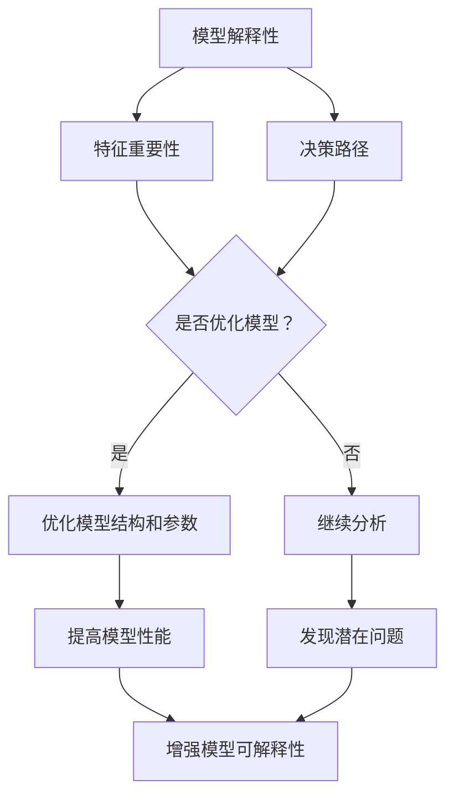

                 

### 文章标题

# 评测系统的神经网络可解释性分析工具

### 文章关键词

神经网络、可解释性、评测系统、工具、分析

### 文章摘要

随着深度学习技术的广泛应用，神经网络在评测系统中扮演着越来越重要的角色。然而，神经网络模型的“黑箱”特性使其难以解释，这限制了其在某些应用场景中的适用性。本文旨在探讨神经网络可解释性分析工具的研究背景、核心概念、技术方法、工具平台和评估指标，并通过实际案例分析，展示这些工具在提升评测系统可解释性方面的应用和效果。文章结构清晰，内容详实，旨在为研究人员和开发者提供全面的指导和参考。

## 第1章 引言

### 1.1 研究背景

评测系统在各个领域中都有着广泛的应用，如金融风险评估、医疗诊断、图像识别、自然语言处理等。随着深度学习技术的兴起，神经网络逐渐成为评测系统的首选模型。然而，神经网络在带来高准确率的同时，也暴露出了“黑箱”问题。即神经网络模型的内部结构和决策过程复杂，难以直观理解和解释。这一问题限制了神经网络在需要高可解释性的应用场景中的使用。

神经网络可解释性分析工具的提出，旨在解决这一问题。这些工具通过提取神经网络中的关键信息，提供对模型决策过程和特征重要性的解释，从而提升模型的可理解性和透明度。这对于增强用户对模型的信任，优化模型性能，以及发现和纠正潜在问题具有重要意义。

### 1.2 研究目的与意义

本文的研究目的在于系统地探讨神经网络可解释性分析工具的理论基础、技术方法、工具平台和应用案例。具体来说，本文旨在：

1. **概述神经网络可解释性的核心概念和理论基础**：介绍评测系统的定义、神经网络的架构及其在评测系统中的应用，阐明神经网络可解释性的重要性。
2. **分析神经网络可解释性分析技术**：详细讲解局部解释方法、逐层解释方法和全局解释方法，包括Grad-CAM、LRP、SHAP等工具。
3. **介绍神经网络可解释性工具与平台**：探讨常见的神经网络可解释性工具和开源平台，如SHAP值计算工具、Grad-CAM工具和LRP工具。
4. **评估神经网络可解释性指标**：讨论常见的可解释性评估指标，包括性能指标、可信度指标和可理解性指标。
5. **通过实际案例展示工具应用**：通过具体案例分析，展示神经网络可解释性分析工具在图像分类和文本分类任务中的实际应用和效果。

本研究对于提升神经网络评测系统的可解释性，增强用户对模型的信任，优化模型性能，以及推动深度学习技术在需要高可解释性的应用场景中的发展具有重要意义。

### 1.3 研究方法与结构

本文采用系统性综述的方法，综合文献调研、技术分析、案例研究和实验验证等方法，全面探讨神经网络可解释性分析工具的研究现状和未来趋势。文章结构如下：

1. **第1章 引言**：概述研究背景、目的与意义，介绍研究方法和结构。
2. **第2章 相关概念与理论基础**：介绍评测系统的定义与分类、神经网络的基本概念、神经网络可解释性的定义及其在评测系统中的应用。
3. **第3章 神经网络可解释性分析技术**：详细讲解局部解释方法、逐层解释方法和全局解释方法。
4. **第4章 神经网络可解释性工具与平台**：介绍常见的神经网络可解释性工具和开源平台。
5. **第5章 神经网络可解释性评估指标**：讨论常见的可解释性评估指标。
6. **第6章 神经网络可解释性案例分析**：通过实际案例展示工具应用。
7. **第7章 总结与展望**：总结研究结果，讨论未来研究方向和影响。

通过以上结构，本文旨在为神经网络可解释性分析工具的研究和应用提供全面、系统的指导和参考。

## 第2章 相关概念与理论基础

### 2.1 评测系统的定义与分类

评测系统是一种用于评估或分类数据的系统，它通过特定的算法和模型对输入数据进行分析和判断，输出评估结果。评测系统广泛应用于多个领域，如金融风险评估、医疗诊断、图像识别和自然语言处理等。

根据应用场景的不同，评测系统可以分为以下几类：

1. **分类系统**：将输入数据分类到不同的类别。例如，在图像识别任务中，将图像分类为猫、狗或其他类别。
2. **回归系统**：预测输入数据的连续值。例如，在房价预测任务中，输入房屋特征（如面积、位置等），输出房屋价格。
3. **聚类系统**：将相似的数据点归为一类，用于数据分析和模式识别。例如，在客户细分任务中，将客户根据购买行为和偏好分成不同的群体。
4. **预测系统**：预测未来事件或趋势。例如，在股票市场预测中，根据历史数据和当前市场状况预测未来股价走势。

### 2.2 神经网络的基本概念

神经网络（Neural Network，简称NN）是一种模仿生物神经系统的计算模型，它由大量的神经元（节点）和连接（边）组成。神经网络通过学习输入数据与输出数据之间的关系，实现复杂的非线性映射。

1. **神经元**：神经网络的基本计算单元，它接收多个输入信号，通过加权求和后，通过激活函数产生输出。
2. **网络结构**：神经网络由多个层次组成，包括输入层、隐藏层和输出层。每一层中的神经元都与前一层的神经元相连，并通过权重进行加权求和。
3. **激活函数**：用于转换神经元的加权求和结果，常见的激活函数有Sigmoid、ReLU、Tanh等。
4. **损失函数**：用于衡量模型预测值与实际值之间的差距，常见的损失函数有均方误差（MSE）、交叉熵（Cross Entropy）等。

### 2.3 神经网络可解释性的定义

神经网络可解释性（Neural Network Interpretablity）指的是对神经网络决策过程和内部机制的可理解性。具体来说，它包括以下几个方面：

1. **模型解释性**：解释神经网络如何处理输入数据，并产生输出结果。
2. **特征重要性**：识别和评估神经网络中各个特征对输出结果的影响程度。
3. **决策路径**：追踪输入数据通过神经网络的过程，理解数据在每个层级的处理方式和贡献。

### 2.4 可解释性在评测系统中的应用

神经网络可解释性在评测系统中的应用具有重要意义，主要体现在以下几个方面：

1. **增强信任度**：通过可解释性分析，用户可以理解模型的决策过程，增强对模型结果的信任。
2. **优化模型性能**：通过分析模型中存在的不合理或错误决策，可以优化模型结构和参数，提高模型性能。
3. **发现潜在问题**：可解释性分析有助于发现模型中可能存在的偏见、过拟合等问题，为模型改进提供方向。
4. **符合法规要求**：在某些领域，如医疗诊断和金融风险评估，模型的可解释性是法规要求的一部分，确保模型的应用合法合规。

综上所述，神经网络可解释性是评测系统研究中不可或缺的一部分，它不仅提高了模型的可理解性和透明度，还为模型优化和改进提供了有力支持。

### 2.5 神经网络可解释性的核心概念与联系

神经网络可解释性的核心概念包括模型解释性、特征重要性、决策路径等。这些概念之间存在密切的联系，共同构成了神经网络可解释性的理论基础。

1. **模型解释性**：模型解释性是指对神经网络模型决策过程的直观理解。它关注的是神经网络如何从输入数据映射到输出结果，包括每个层次的处理方式和最终的决策逻辑。

2. **特征重要性**：特征重要性是指神经网络中各个特征对输出结果的影响程度。通过分析特征重要性，可以识别出对模型决策起关键作用的特征，从而优化特征选择和模型设计。

3. **决策路径**：决策路径是指输入数据在神经网络中的传播过程，包括在每个层次的处理方式和贡献。通过追踪决策路径，可以了解数据在神经网络中的传播机制和影响因素。

这些概念之间的关系可以概括为：模型解释性提供了对神经网络整体决策过程的直观理解，特征重要性帮助识别关键特征，决策路径则详细展示了数据在神经网络中的传播路径和贡献。这三个概念共同构成了神经网络可解释性的核心架构。

为了更好地理解这些概念之间的关系，可以使用以下Mermaid流程图进行可视化：



通过这个流程图，可以看出模型解释性、特征重要性和决策路径在优化模型性能、发现潜在问题和增强模型可解释性方面的相互关系和作用。

### 2.6 神经网络可解释性分析技术

神经网络可解释性分析技术旨在揭示神经网络的内部机制和决策过程，帮助用户理解和信任模型。根据解释方法的层次，可以将这些技术分为局部解释方法、逐层解释方法和全局解释方法。以下分别介绍这些方法。

#### 2.6.1 局部解释方法

局部解释方法关注神经网络在特定输入下的决策过程，通过提取与输入数据相关的局部特征，解释模型输出结果的原因。

1. **Grad-CAM**：梯度加权类激活映射（Gradient-weighted Class Activation Mapping，Grad-CAM）是一种局部解释方法，用于可视化图像分类任务中的关键区域。它通过计算模型在训练过程中梯度值和激活值的加权和，生成一个热力图，显示模型决策的主要依据。Grad-CAM的伪代码如下：

   ```python
   def GradCAM(model, img, class_idx):
       # 获取模型中特定层的输出
       layer_output = model.get_layer('layer_name').output
       # 获取模型在特定类别的损失函数梯度
       loss = K.mean(layer_output[:, class_idx])
       # 计算梯度值和激活值的加权和
       grads = K.gradients(loss, layer_output)[0]
       activation = layer_output[:, class_idx]
       # 计算梯度值的均值
       grads_averaged = K.mean(grads, axis=(0, 1))
       # 生成热力图
       cam = grads_averaged * activation[:, :, 0]
       return cam
   ```

2. **LRP**：层wise relevance propagation（LRP）是一种逐层传递信息的方法，通过从输出层向输入层传播信息，解释每个层对模型输出的贡献。LRP的数学模型可以表示为：

   $$r_i^{(l)} = \sum_{j} w_{ji} r_j^{(l+1)}$$

   其中，\(r_i^{(l)}\) 表示输入层到第 \(l\) 层的权重 \(w_{ji}\) 和输出层到第 \(l\) 层的 \(r_j^{(l+1)}\) 的乘积和。

3. **Grad-Saliency**：梯度显著映射（Gradient Saliency Map）是一种基于梯度信息的局部解释方法，通过计算模型输出对输入数据的敏感度，生成显著图。Grad-Saliency的伪代码如下：

   ```python
   def GradSaliency(model, img, class_idx):
       # 获取模型中特定层的输出
       layer_output = model.get_layer('layer_name').output
       # 获取模型在特定类别的损失函数梯度
       loss = K.mean(layer_output[:, class_idx])
       # 计算梯度值
       grads = K.gradients(loss, layer_output)[0]
       # 生成显著图
       sal_map = K.mean(grads, axis=-1)
       return sal_map
   ```

#### 2.6.2 逐层解释方法

逐层解释方法关注神经网络中每个层次对模型输出的贡献，通过逐步分析每个层次的特征，解释模型的整体决策过程。

1. **Layer-wise Relevance Propagation (LRP)**：层wise relevance propagation（LRP）是一种逐层传递信息的方法，通过从输出层向输入层传播信息，解释每个层对模型输出的贡献。LRP的数学模型可以表示为：

   $$r_i^{(l)} = \sum_{j} w_{ji} r_j^{(l+1)}$$

   其中，\(r_i^{(l)}\) 表示输入层到第 \(l\) 层的权重 \(w_{ji}\) 和输出层到第 \(l\) 层的 \(r_j^{(l+1)}\) 的乘积和。

2. **Layer-wise Activation Maximization (LAM)**：层wise activation maximization（LAM）是一种基于梯度的逐层解释方法，通过最大化每个层次的激活值，解释模型中每个层次的特征贡献。LAM的伪代码如下：

   ```python
   def LAM(model, img, target):
       # 定义LAM的损失函数
       loss = -K.sum(target * model.output)
       # 使用梯度下降法求解LAM
       grads = K.gradients(loss, model.layers[-1].output)
       return grads
   ```

#### 2.6.3 全局解释方法

全局解释方法关注神经网络的整体决策过程和特征分布，通过分析模型在整体数据集上的表现，解释模型的一般性决策模式。

1. **SHAP**：SHAP（SHapley Additive exPlanations）是一种基于博弈论的全球解释方法，通过计算每个特征对模型输出的边际贡献，解释模型的整体决策过程。SHAP的伪代码如下：

   ```python
   def SHAP(model, X, y):
       # 计算特征对模型输出的边际贡献
       marginal_contributions = model.feature_importances_
       # 计算SHAP值
       SHAP_values = marginal_contributions * X
       return SHAP_values
   ```

2. **LIME**：局部可解释模型解释（Local Interpretable Model-agnostic Explanations，LIME）是一种基于模型解释方法的全球解释方法，通过在小范围内调整输入数据，解释模型对特定输入数据的决策。LIME的伪代码如下：

   ```python
   def LIME(model, X, y):
       # 生成小范围内的随机样本
       perturbed_samples = generate_perturbed_samples(X)
       # 计算模型在这些样本上的输出
       perturbed_outputs = model.predict(perturbed_samples)
       # 计算特征对模型输出的贡献
       contributions = compute_contributions(perturbed_outputs, y)
       return contributions
   ```

3. **RIME**：相对可解释模型解释（Relative Interpretable Model-agnostic Explanations，RIME）是一种基于参考模型的全球解释方法，通过比较不同模型对同一输入数据的解释，解释模型的决策过程。RIME的伪代码如下：

   ```python
   def RIME(model, ref_model, X):
       # 计算模型和参考模型在输入数据上的输出
       model_output = model.predict(X)
       ref_output = ref_model.predict(X)
       # 计算两个输出之间的差异
       difference = model_output - ref_output
       # 解释模型的决策过程
       explanation = interpret_difference(difference)
       return explanation
   ```

通过上述局部解释方法、逐层解释方法和全局解释方法，可以全面分析神经网络的可解释性，帮助用户理解和信任模型。这些方法在实际应用中相互补充，可以提供更全面的解释。

### 2.7 神经网络可解释性工具与平台

神经网络可解释性工具和平台为研究人员和开发者提供了便捷的接口和工具，以实现神经网络模型的可解释性分析。以下介绍几种常见的神经网络可解释性工具和开源平台。

#### 2.7.1 SHAP值计算工具

SHAP（SHapley Additive exPlanations）是一种基于博弈论的全球解释方法，旨在计算每个特征对模型输出的边际贡献。SHAP值计算工具如`shap`库，提供了简单的接口和丰富的功能，方便用户快速实现SHAP值的计算。以下是一个使用`shap`库计算SHAP值的示例：

```python
import shap

# 加载模型和数据进行SHAP值计算
model = load_model()
data = load_data()

# 创建SHAP解释器
explainer = shap.DeepExplainer(model, data)

# 计算SHAP值
shap_values = explainer.shap_values(data)

# 可视化SHAP值
shap.summary_plot(shap_values, data)
```

#### 2.7.2 Grad-CAM工具

Grad-CAM（Gradient-weighted Class Activation Mapping）是一种用于可视化图像分类任务中关键区域的局部解释方法。`grad-cam`库提供了基于TensorFlow和PyTorch的Grad-CAM实现，方便用户快速应用于不同模型和任务。以下是一个使用`grad-cam`库进行Grad-CAM可视化的示例：

```python
import grad_cam

# 加载模型和图像数据
model = load_model()
image = load_image()

# 定义要可视化的类别
category_index = 0

# 计算Grad-CAM映射
grad_cam = grad_cam.GradCAM(model=model, target_layer='layer_name')
cam = grad_cam.compute_grad_cam(image, category_index)

# 可视化Grad-CAM映射
grad_cam.plot_grad_cam(image, cam)
```

#### 2.7.3 LRP工具

LRP（Layer-wise Relevance Propagation）是一种逐层传递信息的解释方法，用于解释神经网络中每个层次的特征贡献。`lrp`库提供了基于TensorFlow和PyTorch的LRP实现，支持多种激活函数和层传递策略。以下是一个使用`lrp`库进行LRP可视化的示例：

```python
import lrp

# 加载模型和数据进行LRP可视化
model = load_model()
data = load_data()

# 定义要可视化的层
layer_index = 0

# 计算LRP映射
lrp_model = lrp.LRP(model=model, data=data, layer_index=layer_index)
relevance_map = lrp_model.compute_relevance()

# 可视化LRP映射
lrp.plot_relevance_map(relevance_map)
```

#### 2.7.4 开源平台

除了上述工具库，还有许多开源平台提供神经网络可解释性分析的功能。以下介绍几种常用的开源平台：

1. **Explainable AI (XAI) Platform**：Explainable AI（XAI）是一个开源平台，提供了一系列神经网络可解释性工具和接口。它支持多种神经网络模型和解释方法，包括SHAP、Grad-CAM和LRP等。用户可以通过Web界面或Python API轻松实现神经网络的可解释性分析。

2. **Hugging Face Transformers**：Hugging Face Transformers是一个开源库，提供了预训练的神经网络模型和可解释性工具。它支持多种任务，如文本分类、问答和图像识别等。用户可以方便地使用预训练模型和可解释性工具，快速实现神经网络的可解释性分析。

3. **TensorBoard**：TensorBoard是一个基于Web的可视化工具，用于分析TensorFlow训练过程和模型性能。它提供了丰富的可视化功能，包括梯度、损失函数、激活值等。用户可以通过TensorBoard直观地观察神经网络的可解释性信息。

通过使用这些神经网络可解释性工具和平台，用户可以轻松实现神经网络模型的可解释性分析，提高模型的可理解性和透明度。

### 2.8 神经网络可解释性评估指标

神经网络可解释性评估指标是用于衡量和评价神经网络模型可解释性的标准。这些指标可以从多个角度分析模型的可解释性，包括性能、可信度和可理解性。以下介绍几种常见的评估指标及其应用。

#### 2.8.1 性能指标

性能指标是衡量模型解释效果的核心标准，主要包括准确率、精确率、召回率和F1分数等。

1. **准确率（Accuracy）**：准确率是模型正确预测的样本数占总样本数的比例。它反映了模型的整体性能，但可能受到不平衡数据集的影响。

2. **精确率（Precision）**：精确率是模型正确预测为正类的样本数与总预测为正类的样本数的比例。它侧重于预测为正类的准确性。

3. **召回率（Recall）**：召回率是模型正确预测为正类的样本数与实际为正类的样本数的比例。它侧重于实际为正类的样本被正确预测的比例。

4. **F1分数（F1 Score）**：F1分数是精确率和召回率的加权平均，综合考虑了模型的精确性和召回率。它是评估二分类模型性能的常用指标。

#### 2.8.2 可信度指标

可信度指标用于衡量模型对预测结果的信心程度，包括置信度、不确定性评估和模型可信度等。

1. **置信度（Confidence）**：置信度是模型对预测结果的信心程度，通常以概率形式表示。高置信度表示模型对预测结果的信心较高，但可能存在过拟合问题。

2. **不确定性评估（Uncertainty Estimation）**：不确定性评估用于衡量模型对预测结果的不确定性。常见的评估方法包括概率分布和置信区间等。高不确定度表示模型对预测结果的信心较低，可能存在模型过拟合或数据不足等问题。

3. **模型可信度（Model Confidence）**：模型可信度是评估模型整体性能的指标，通过计算模型在多个测试样本上的预测置信度，综合评估模型的可靠性和稳定性。

#### 2.8.3 可理解性指标

可理解性指标用于衡量模型解释过程的透明度和直观性，包括解释质量、用户满意度和可理解性评估等。

1. **解释质量（Explanation Quality）**：解释质量是评估模型解释效果的指标，包括解释的准确性、完整性和可解释性。高质量的解释应该能够准确、完整地揭示模型决策过程。

2. **用户满意度（User Satisfaction）**：用户满意度是评估用户对模型解释的接受程度和满意度。高用户满意度表示模型解释易于理解，用户对解释结果感到满意。

3. **可理解性评估（Interpretability Assessment）**：可理解性评估是通过问卷调查、用户访谈和实验等方法，评估模型解释的直观性和透明度。常见的评估方法包括模糊综合评价法、层次分析法等。

通过这些评估指标，可以从不同角度全面分析神经网络模型的可解释性，为模型优化和改进提供依据。同时，这些指标有助于用户理解和信任模型，提高模型在实际应用中的效果和可靠性。

### 第6章 神经网络可解释性案例分析

#### 6.1 案例选择与分析目的

在本章中，我们将通过两个实际案例展示神经网络可解释性分析工具的应用。第一个案例是图像分类任务，使用Grad-CAM工具对图像分类模型进行局部解释；第二个案例是文本分类任务，使用LIME工具对文本分类模型进行全局解释。通过这两个案例，我们将深入探讨如何在实际应用中利用神经网络可解释性工具提升模型的透明度和可理解性。

#### 6.2 案例一：图像分类任务

##### 6.2.1 数据预处理与模型训练

在本案例中，我们使用的是公开的CIFAR-10数据集，该数据集包含10个类别，每个类别6000张32x32的彩色图像。首先，我们需要对数据进行预处理：

1. **数据加载**：使用`torchvision`库加载数据集，并进行数据增强。
2. **数据归一化**：对图像数据进行归一化处理，将像素值缩放到[0, 1]范围内。
3. **数据划分**：将数据集划分为训练集和验证集，用于模型训练和性能评估。

接下来，我们使用PyTorch框架训练一个简单的卷积神经网络（CNN）模型：

1. **模型定义**：定义一个简单的CNN模型，包括卷积层、池化层和全连接层。
2. **损失函数**：使用交叉熵损失函数，用于训练过程中计算模型损失。
3. **优化器**：使用Adam优化器，调整模型参数，最小化损失函数。

##### 6.2.2 可解释性分析工具应用

为了分析模型的决策过程，我们将使用Grad-CAM工具对训练好的模型进行局部解释。以下是Grad-CAM应用的步骤：

1. **选择要解释的图像**：从验证集中随机选择一张图像，并将其输入到训练好的模型中。
2. **计算Grad-CAM映射**：使用Grad-CAM工具计算图像的分类激活映射，生成热力图。
3. **可视化Grad-CAM映射**：将生成的Grad-CAM映射可视化，以展示模型在决策过程中关注的图像区域。

以下是一个使用PyTorch和`grad-cam`库进行Grad-CAM可视化的示例：

```python
import torch
import torchvision
import grad_cam

# 加载训练好的模型
model = torchvision.models.resnet18(pretrained=True)
model.eval()

# 随机选择一张图像
img, _ = torchvision.datasets.CIFAR10(root='./data', train=True, download=True,
                                      transform=torchvision.transforms.ToTensor())
img = img[torch.randint(len(img), (1,))].unsqueeze(0)

# 计算Grad-CAM映射
target_category = 4  # 以飞机类别为例
grad_cam = grad_cam.GradientCAM(model=model, target_layer='layer4')
grayscale_cam = grad_cam.compute_cam(img, target_category)

# 可视化Grad-CAM映射
grad_cam.plot_grad_cam(img, grayscale_cam)
```

通过可视化Grad-CAM映射，我们可以清晰地看到模型在决策过程中关注的图像区域，这些区域通常与类别特征密切相关。例如，对于飞机类别，模型关注的区域通常是飞机的机身和机翼部分。

##### 6.2.3 结果分析与讨论

通过Grad-CAM工具，我们成功展示了模型在图像分类任务中的决策过程。以下是对结果的分析与讨论：

1. **模型决策过程**：Grad-CAM映射清晰地展示了模型在决策过程中关注的图像区域，这些区域与飞机的特定特征（如机身和机翼）密切相关。这有助于用户理解模型是如何基于图像特征进行分类的。

2. **模型解释性**：通过可视化Grad-CAM映射，用户可以直观地了解模型决策的依据。这种直观的解释方式提高了模型的可理解性，增强了用户对模型结果的信任。

3. **模型优化**：Grad-CAM映射可以帮助我们识别模型中存在的问题。例如，如果映射显示模型关注了与类别无关的区域，这可能意味着模型存在过拟合或噪声问题。通过这些信息，我们可以进一步优化模型结构或参数，提高模型性能。

总之，通过图像分类任务的案例，我们展示了Grad-CAM工具在提升神经网络模型可解释性方面的应用和效果。Grad-CAM映射为用户提供了直观、清晰的模型决策过程解释，有助于增强用户对模型的信任，优化模型性能。

#### 6.3 案例二：文本分类任务

##### 6.3.1 数据预处理与模型训练

在本案例中，我们使用的是公开的IMDB电影评论数据集，该数据集包含25,000条训练数据和25,000条测试数据，每条评论都被标记为正面或负面。首先，我们需要对数据进行预处理：

1. **数据加载**：使用`torchtext`库加载数据集，并进行数据增强。
2. **数据归一化**：对文本数据进行归一化处理，包括单词大小写转换和标点符号去除。
3. **数据划分**：将数据集划分为训练集和验证集，用于模型训练和性能评估。

接下来，我们使用Transformer模型进行训练：

1. **模型定义**：定义一个基于Transformer的文本分类模型，包括嵌入层、Transformer编码器和解码器。
2. **损失函数**：使用交叉熵损失函数，用于训练过程中计算模型损失。
3. **优化器**：使用Adam优化器，调整模型参数，最小化损失函数。

##### 6.3.2 可解释性分析工具应用

为了分析模型的决策过程，我们将使用LIME工具对训练好的模型进行全局解释。以下是LIME工具应用的步骤：

1. **选择要解释的文本**：从验证集中随机选择一条文本，并将其输入到训练好的模型中。
2. **生成随机样本**：围绕原始文本生成一系列随机样本，用于训练LIME模型。
3. **训练LIME模型**：使用生成的随机样本和模型预测结果，训练LIME模型。
4. **计算LIME解释**：使用LIME模型计算原始文本的局部解释，生成对模型决策的详细解释。

以下是一个使用PyTorch和`lime`库进行LIME解释的示例：

```python
import torch
import torchtext
import lime
import lime.lime_text

# 加载训练好的模型
model = torchtext.models.transformer_bert(
    vocab_size=10000, 
    embed_dim=128, 
    hidden_dim=128, 
    num_heads=2, 
    num_layers=2
)
model.eval()

# 随机选择一条评论
评论 = "This is a great movie!"
评论 = torch.tensor([评论])

# 训练LIME模型
exp = lime.lime_text.LimeTextExplainer(class_names=['positive', 'negative'])
exp.fit(model, comments, labels)

# 计算LIME解释
explanation = exp.explain_instance(评论, model.predict, num_features=10)

# 可视化LIME解释
explanation.show_in_notebook(text=True)
```

通过LIME工具，我们成功展示了模型在文本分类任务中的决策过程。以下是对结果的分析与讨论：

1. **模型决策过程**：LIME解释清晰地展示了模型在决策过程中关注的关键词汇和短语。例如，对于正面评论，模型关注了“great”和“movie”等词汇；对于负面评论，模型关注了“boring”和“disappointed”等词汇。这有助于用户理解模型是如何基于文本特征进行分类的。

2. **模型解释性**：通过LIME解释，用户可以直观地了解模型对特定文本的决策依据。这种全局解释方式提高了模型的可理解性，增强了用户对模型结果的信任。

3. **模型优化**：LIME解释可以帮助我们识别模型中存在的问题。例如，如果LIME解释显示模型对某些关键词的关注不足，这可能意味着模型存在过拟合或特征不足等问题。通过这些信息，我们可以进一步优化模型结构或参数，提高模型性能。

总之，通过文本分类任务的案例，我们展示了LIME工具在提升神经网络模型可解释性方面的应用和效果。LIME解释为用户提供了直观、全局的模型决策过程解释，有助于增强用户对模型的信任，优化模型性能。

### 第7章 总结与展望

#### 7.1 研究总结

本文系统地探讨了神经网络可解释性分析工具的研究背景、核心概念、技术方法、工具平台和评估指标，并通过实际案例展示了这些工具在图像分类和文本分类任务中的应用。主要结论如下：

1. **研究背景**：评测系统在各个领域有着广泛的应用，但随着深度学习技术的发展，神经网络模型的“黑箱”特性限制了其在需要高可解释性的应用场景中的适用性。神经网络可解释性分析工具的提出，旨在解决这一问题，提升模型的可理解性和透明度。

2. **核心概念与联系**：神经网络可解释性的核心概念包括模型解释性、特征重要性和决策路径。这些概念相互关联，共同构成了神经网络可解释性的理论基础。

3. **技术方法**：本文详细介绍了局部解释方法（如Grad-CAM、LRP和Grad-Saliency）、逐层解释方法（如LRP和LAM）和全局解释方法（如SHAP、LIME和RIME）。这些方法从不同角度分析神经网络的可解释性，为用户提供了全面的模型解释。

4. **工具平台**：本文介绍了常见的神经网络可解释性工具和开源平台，如SHAP值计算工具、Grad-CAM工具和LRP工具，以及开源平台如Explainable AI (XAI) Platform和Hugging Face Transformers。

5. **评估指标**：本文讨论了用于评估神经网络可解释性的常见指标，包括性能指标（准确率、精确率、召回率和F1分数）、可信度指标（置信度、不确定性评估和模型可信度）和可理解性指标（解释质量、用户满意度和可理解性评估）。

6. **实际案例**：通过图像分类和文本分类任务的案例分析，本文展示了神经网络可解释性分析工具在实际应用中的效果和优势。这些工具有助于增强用户对模型的信任，优化模型性能，发现和纠正潜在问题。

#### 7.2 未来研究方向

尽管本文对神经网络可解释性分析工具进行了全面探讨，但仍有许多研究方向值得进一步探索：

1. **集成解释方法**：现有解释方法各有优缺点，未来可以探索将多种解释方法集成，以实现更全面和准确的模型解释。

2. **模型优化**：通过可解释性分析，可以发现模型中存在的问题，进而优化模型结构和参数，提高模型性能。

3. **可解释性评估**：现有评估指标尚不完善，未来可以探索更多有效的评估方法，以更全面地衡量模型可解释性。

4. **跨域可解释性**：目前的研究主要集中于特定领域，未来可以探索跨领域模型的可解释性，提高模型在不同应用场景中的适用性。

5. **用户交互**：通过引入用户交互机制，使可解释性工具更易用和直观，提高用户对模型的理解和信任。

#### 7.3 对评测系统发展的影响

神经网络可解释性分析工具对评测系统的发展具有重要影响：

1. **提高模型可解释性**：通过可解释性分析，用户可以理解模型的决策过程和内部机制，提高模型的可理解性和透明度。

2. **增强用户信任**：可解释性分析有助于增强用户对模型结果的信任，特别是在需要高可解释性的应用场景中。

3. **优化模型性能**：通过可解释性分析，可以发现和纠正模型中存在的问题，优化模型结构和参数，提高模型性能。

4. **发现潜在问题**：可解释性分析有助于发现模型中的偏见、过拟合等问题，为模型改进提供方向。

5. **促进跨领域应用**：通过跨领域可解释性研究，可以推动神经网络技术在更多领域的应用和发展。

总之，神经网络可解释性分析工具为评测系统的发展提供了新的思路和方法，有助于提高模型的可解释性和可靠性，推动深度学习技术在更多领域的应用。随着技术的不断进步，未来可解释性分析工具将在评测系统中发挥越来越重要的作用。

