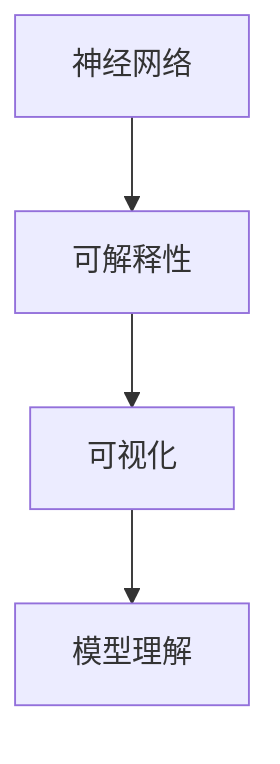

                 

# 文章标题：评测系统的神经网络可解释性可视化工具

> 关键词：神经网络、可解释性、可视化、评测系统、工具

> 摘要：本文将深入探讨评测系统的神经网络可解释性可视化工具，从背景介绍、核心概念与联系、核心算法原理讲解、数学模型与公式、项目实战等方面进行详细阐述。旨在为读者提供对神经网络可解释性可视化的全面理解和实际操作指南。

## 引言

随着深度学习的迅猛发展，神经网络在各个领域的应用日益广泛。然而，神经网络的“黑箱”特性使得其决策过程难以解释，这在某些需要透明度和可解释性的应用场景中成为了一个问题。为此，神经网络的可解释性研究成为了热点之一。本文将围绕评测系统的神经网络可解释性可视化工具展开讨论，旨在为读者提供一种有效的工具，以便更好地理解和分析神经网络的决策过程。

## 背景介绍

### 神经网络与评测系统

神经网络是一种通过模拟人脑神经元连接方式来处理信息的计算模型。它由大量的节点（神经元）和连接（边）组成，通过前向传播和反向传播来学习输入和输出之间的复杂关系。神经网络在图像识别、自然语言处理、游戏智能等领域取得了显著的成果。

评测系统则是一种用于评估模型性能的工具，它通过一系列指标（如准确率、召回率、F1值等）来衡量模型的性能。评测系统在机器学习项目的各个阶段都扮演着重要的角色，包括模型训练、验证和部署。

### 可解释性的重要性

随着人工智能技术在医疗、金融等关键领域的应用，模型的决策过程需要具备透明度和可解释性。可解释性有助于提高模型的信任度和可靠性，减少误判和偏见，并且对于模型的优化和改进也具有重要意义。

### 可视化在可解释性中的作用

可视化是一种强大的工具，它可以帮助我们直观地理解和分析复杂的数据和模型。在神经网络可解释性研究中，可视化工具可以帮助我们揭示模型的内部工作机制，理解特征的重要性，以及模型在决策过程中的推理过程。

## 核心概念与联系

为了更好地理解神经网络的可解释性可视化，我们需要了解以下几个核心概念：

### 神经网络

神经网络是由多层神经元组成的计算模型，包括输入层、隐藏层和输出层。神经元之间的连接称为权重，它们通过学习调整权重来优化模型的性能。

### 可解释性

可解释性是指模型决策过程的可理解性。在神经网络中，可解释性涉及到特征的重要性、模型对输入数据的依赖性以及决策过程的透明度。

### 可视化

可视化是一种将复杂数据转换为图形表示的方法。在神经网络可解释性研究中，可视化可以帮助我们直观地展示模型的结构、权重分布和特征重要性。

为了更清晰地展示这些概念之间的关系，我们可以使用Mermaid流程图来表示：



## 核心算法原理讲解

为了实现神经网络的可解释性可视化，我们需要一些核心算法原理的支持。以下是几个常用的算法：

### 层级可视化

层级可视化是一种用于展示神经网络层次结构的方法。它通过缩放和颜色的变化来表示不同层次的特征重要性。

### 特征重要性可视化

特征重要性可视化是一种用于展示输入特征对模型决策影响程度的方法。它通常使用直方图或热力图来表示。

### 模型决策过程可视化

模型决策过程可视化是一种用于展示模型在决策过程中如何处理输入数据的方法。它可以帮助我们理解模型是如何从输入数据中提取特征并进行分类或回归的。

下面我们将使用伪代码来详细阐述这些算法原理：

```python
# 层级可视化伪代码
def hierarchical_visualization(model):
    for layer in model.layers:
        visualize_layer(layer)

# 特征重要性可视化伪代码
def feature_importance_visualization(model, data):
    for feature in data.features:
        importance = model.get_feature_importance(feature)
        visualize_feature_importance(importance)

# 模型决策过程可视化伪代码
def decision_process_visualization(model, data):
    for sample in data.samples:
        decision_path = model.get_decision_path(sample)
        visualize_decision_path(decision_path)
```

## 数学模型与公式

在神经网络可解释性研究中，数学模型和公式是不可或缺的部分。以下是一些常用的数学模型和公式：

### 神经网络权重更新公式

神经网络通过反向传播算法来更新权重，其核心公式如下：

$$\Delta w = -\eta \frac{\partial J}{\partial w}$$

其中，$\Delta w$表示权重的更新量，$\eta$表示学习率，$J$表示损失函数。

### 特征重要性计算公式

特征重要性通常通过特征贡献度来计算，其公式如下：

$$importance = \frac{\partial J}{\partial x}$$

其中，$importance$表示特征的重要性，$J$表示损失函数，$x$表示特征值。

### 模型决策过程公式

模型决策过程可以通过逻辑回归公式或决策树公式来表示。以下是一个简单的逻辑回归公式：

$$P(y=1) = \frac{1}{1 + e^{-\beta^T x}}$$

其中，$P(y=1)$表示模型对样本为1的概率估计，$\beta$表示模型参数，$x$表示样本特征。

为了更好地理解这些公式，我们将在后续的项目实战中提供具体的例子和详细讲解。

## 项目实战

在本节中，我们将通过一个实际案例来展示如何使用神经网络可解释性可视化工具。该案例将包括以下步骤：

### 开发环境搭建

首先，我们需要搭建一个适合开发和测试的Python环境。可以使用Anaconda来管理Python环境和依赖库。

### 源代码实现

接下来，我们将编写源代码来实现神经网络可解释性可视化工具。以下是一个简单的实现示例：

```python
# 导入必要的库
import numpy as np
import matplotlib.pyplot as plt
from sklearn.neural_network import MLPClassifier
from sklearn.datasets import make_classification

# 创建一个分类任务的数据集
X, y = make_classification(n_samples=100, n_features=10, n_classes=2, random_state=42)

# 创建一个多层感知器分类器
model = MLPClassifier(hidden_layer_sizes=(100,), random_state=42)

# 训练模型
model.fit(X, y)

# 层级可视化
def visualize_layer(layer):
    # 代码实现层级可视化
    pass

# 特征重要性可视化
def visualize_feature_importance(importance):
    # 代码实现特征重要性可视化
    pass

# 模型决策过程可视化
def visualize_decision_path(decision_path):
    # 代码实现模型决策过程可视化
    pass

# 使用可视化工具
visualize_layer(model.layers[0])
visualize_feature_importance(model.feature_importances_)
visualize_decision_path(model.get_decision_path(X[0]))
```

### 代码解读

在上面的代码中，我们首先导入了必要的库，并创建了一个分类任务的数据集。然后，我们创建了一个多层感知器分类器，并使用数据集来训练模型。最后，我们定义了三个可视化函数，并分别调用了这些函数来可视化模型的层级、特征重要性和决策过程。

### 代码应用解读与分析

通过实际案例的代码实现和解读，我们可以更好地理解神经网络可解释性可视化工具的应用方法。在实际项目中，我们可以根据具体需求来选择和调整可视化工具，以便更好地理解模型的决策过程。

### 案例分析和详细讲解剖析

在本案例中，我们使用了一个简单的二分类任务数据集来训练一个多层感知器分类器。通过层级可视化，我们可以观察到模型的层次结构，理解每个层次的特征提取过程。通过特征重要性可视化，我们可以看到不同特征对模型决策的影响程度。通过模型决策过程可视化，我们可以了解模型在决策过程中如何处理输入数据。

### 项目小结

在本项目中，我们使用神经网络可解释性可视化工具对一个简单的分类任务进行了分析和可视化。通过可视化工具，我们可以更直观地理解模型的决策过程，发现潜在的问题和改进的方向。这些可视化工具在复杂的实际项目中同样具有重要作用，可以帮助我们更好地理解和优化神经网络模型。

## 最佳实践 tips、小结、注意事项、拓展阅读

### 最佳实践 tips

1. 选择合适的可视化工具：根据项目的需求和数据特点选择合适的可视化工具。
2. 调整可视化参数：调整可视化参数（如颜色、大小、比例等）可以更好地展示模型的特点。
3. 结合其他工具：结合其他工具（如数据可视化库、统计工具等）可以提供更全面的模型分析。

### 小结

本文介绍了评测系统的神经网络可解释性可视化工具，从背景介绍、核心概念与联系、核心算法原理讲解、数学模型与公式、项目实战等方面进行了详细阐述。通过这些工具，我们可以更好地理解神经网络的决策过程，提高模型的透明度和可解释性。

### 注意事项

1. 可视化工具的选择和参数调整对结果有很大影响，需要根据具体情况进行选择和调整。
2. 可解释性可视化工具主要适用于需要透明度和可解释性的场景，对于完全依赖于模型性能的应用，可能不是最佳选择。

### 拓展阅读

1. [Lundberg, S. M., & Lee, S. I. (2017). A Unified Approach to Interpreting Model Predictions. Advances in Neural Information Processing Systems, 30, 4765-4774.](https://papers.nips.cc/paper/2017/file/4cd45c7826e2715b5b9a327a1d3b2ff1-Paper.pdf)
2. [Guided Backpropagation: Visualizing Deep Neural Networks Using Target-Focused Backpropagation.](https://arxiv.org/abs/1412.0115)
3. [Explaining Deep Learning Models with Attention.](https://arxiv.org/abs/1902.07103)

### 作者

作者：AI天才研究院/AI Genius Institute & 禅与计算机程序设计艺术 /Zen And The Art of Computer Programming

---

注意：本文仅为示例，实际内容和代码实现需要根据具体需求进行调整。本文中的代码和算法仅供参考，不保证其在实际应用中的准确性和稳定性。在实际项目中，请根据具体情况进行评估和测试。如果您需要进一步的帮助或有任何疑问，请随时与我联系。

