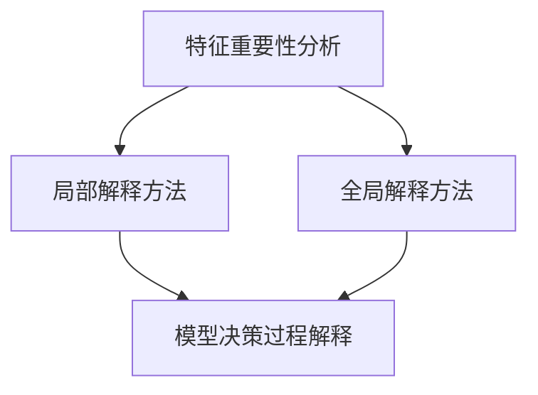
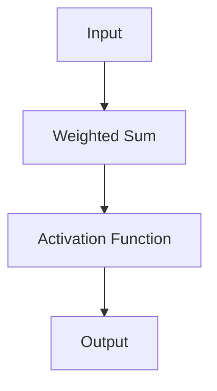
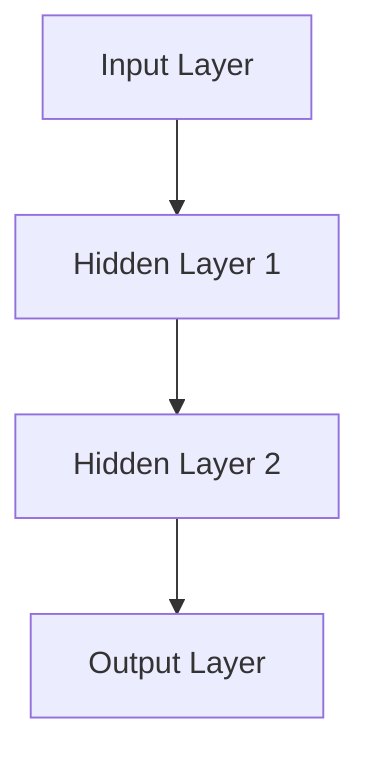

                 

### 引言与概述

神经网络作为深度学习的基础组件，已经成为现代人工智能领域的重要技术。然而，随着神经网络模型在各个领域的广泛应用，其“黑盒”特性带来的可解释性问题也逐渐凸显。为了解决这一问题，研究人员提出了多种神经网络可解释性工具，旨在提高模型的可解释性和透明性。本文将围绕评测系统的神经网络可解释性工具集成进行探讨，旨在为读者提供一份全面的技术指南。

首先，我们需要了解神经网络可解释性的重要性。传统的机器学习方法如决策树和线性回归模型具有较好的可解释性，因为其决策过程可以通过直观的规则进行解释。然而，神经网络作为一种更加复杂的模型，其决策过程往往难以理解。这种不可解释性可能会带来以下几个问题：

1. **信任度降低**：对于需要高度可信度的领域，如医疗诊断和金融风险管理，模型的不可解释性可能导致用户对模型结果的信任度降低。
2. **法律责任问题**：在一些法律要求明确的场景中，模型的不可解释性可能使开发者难以承担相应的法律责任。
3. **模型改进阻碍**：由于无法理解模型的决策过程，改进和优化模型的过程将变得更加困难。

为了解决上述问题，神经网络可解释性工具应运而生。这些工具旨在揭示神经网络内部的决策过程，帮助用户更好地理解模型的运作机制。具体来说，神经网络可解释性工具可以提供以下几方面的帮助：

1. **特征重要性分析**：识别对模型决策有重要影响的特征，帮助用户理解模型如何利用输入数据进行决策。
2. **局部解释方法**：提供针对模型输入数据的局部解释，解释模型在特定输入数据上的决策过程。
3. **全局解释方法**：从整体上分析模型的决策过程，揭示模型在全局层面的工作机制。

本文将首先介绍神经网络的基本概念，包括神经元与层结构、激活函数、前向传播与反向传播算法等。随后，我们将探讨神经网络可解释性的核心概念与联系，并介绍几种常用的可解释性工具。接着，本文将详细讨论神经网络评测系统的构建，包括架构设计、数据预处理、模型训练与验证等环节。最后，本文将介绍神经网络可解释性工具的集成策略，并通过实际案例分析展示这些工具在具体应用中的效果。

通过本文的阅读，读者将能够系统地了解神经网络可解释性工具集成的相关技术和方法，掌握如何在实际项目中应用这些工具，从而提升神经网络模型的可解释性和透明性。

### 文章关键词

神经网络，可解释性，评测系统，深度学习，特征重要性，局部解释，全局解释，模型优化。

### 文章摘要

本文旨在探讨神经网络评测系统的神经网络可解释性工具集成，以提高模型的可解释性和透明性。首先，本文介绍了神经网络的基础概念，包括神经元与层结构、激活函数、前向传播与反向传播算法。随后，本文探讨了神经网络可解释性的核心概念，包括特征重要性分析和局部、全局解释方法。接着，本文详细讨论了神经网络评测系统的构建，包括架构设计、数据预处理、模型训练与验证等环节。最后，本文介绍了神经网络可解释性工具的集成策略，并通过实际案例分析展示了这些工具在具体应用中的效果。通过本文的阅读，读者将能够系统地了解神经网络可解释性工具集成的相关技术和方法，掌握其在实际项目中的应用。

### 设计思路

为了设计一个完整的《评测系统的神经网络可解释性工具集成》目录大纲，我们需要从整体结构和内容安排两个方面进行深入思考和详细规划。

#### 整体结构框架

一个完整的书籍结构应当包含以下几个主要部分：

1. **引言与概述**：这部分用于介绍书籍的背景、目的和整体架构，帮助读者对书籍的内容有一个整体的把握。
2. **理论基础**：这部分详细讲解神经网络和可解释性的基本概念、原理和方法，为后续的实战应用奠定理论基础。
3. **技术原理**：这部分深入探讨神经网络评测系统的构建过程，包括模型设计、训练与验证等关键技术。
4. **工具与集成**：这部分介绍各种神经网络可解释性工具，如何选择和集成这些工具，以实现系统的可解释性。
5. **案例分析**：这部分通过具体的应用案例，展示如何在实际项目中应用这些技术和工具，解决实际问题。
6. **未来展望与挑战**：这部分讨论神经网络可解释性领域的最新发展趋势和潜在挑战，为读者提供未来的研究方向。

#### 核心内容分类

在确定整体结构框架后，需要对每个部分进行进一步的细分，确保每个部分都有明确的主题和目标。以下是每个部分的详细分类：

1. **引言与概述**：
   - 书籍背景与目的
   - 神经网络可解释性的重要性
   - 神经网络评测系统简介
   - 本书结构安排

2. **理论基础**：
   - 神经网络基础
   - 可解释性原理
   - 特征重要性分析
   - 局部解释方法
   - 全局解释方法

3. **技术原理**：
   - 评测系统架构设计
   - 数据预处理
   - 模型训练与验证
   - 模型评估与优化

4. **工具与集成**：
   - 工具选择标准
   - 主要工具介绍
   - 工具集成策略
   - 工具应用案例

5. **案例分析**：
   - 金融风控案例
   - 医疗诊断案例
   - 智能推荐系统案例
   - 自动驾驶案例

6. **未来展望与挑战**：
   - 可解释性发展趋势
   - 潜在挑战与解决方案
   - 研究方向展望

#### 理论与实践结合

在内容安排上，不仅要包含理论讲解，还要包含实际案例分析，以便读者能够将所学知识应用到实践中。例如，在“技术原理”章节中，除了讲解神经网络评测系统的构建过程，还会包括具体的实现细节和代码示例。在“案例分析”章节中，通过具体的案例展示如何应用这些技术和工具解决实际问题。

#### 可解释性重点

由于本书的主题是“神经网络可解释性工具集成”，因此需要特别突出可解释性的内容。在目录中，我们可以通过添加章节标题、子标题和重点内容标签等方式，使读者能够快速了解可解释性工具的核心概念和应用方法。

#### 图表与代码

为了更好地帮助读者理解，我们将在适当的地方增加图表和伪代码。特别是对于技术原理和数学模型的讲解部分，通过图表可以直观地展示复杂的过程，而伪代码和代码示例则可以帮助读者理解具体的实现细节。

#### 设计步骤

1. **确定全书结构**：根据上述思路，初步确定全书的主要章节和内容。
2. **细化章节内容**：为每个章节设计具体的子标题，确保每个章节内容详尽。
3. **编写内容大纲**：将上述确定的章节和子标题组合成完整的目录大纲。
4. **完善与调整**：根据实际书写的文字内容和结构，对目录进行完善和调整，确保目录与内容一致。
5. **审核与确认**：最后，对目录进行审核，确保没有遗漏或错误。

通过上述设计步骤，我们能够设计出一个完整、逻辑清晰且具有实用价值的目录大纲，为后续内容的撰写和整理提供坚实的基础。

### 目录大纲结构

在设计完《评测系统的神经网络可解释性工具集成》的整体结构和核心内容分类后，我们可以开始构建具体的目录大纲。以下是一个详细的目录大纲示例，包括每个章节的主要子标题和部分内容概述。

```
# 《评测系统的神经网络可解释性工具集成》目录大纲

## 第1章 引言与概述
### 1.1 书籍背景与目的
   - 深度学习与神经网络的发展背景
   - 神经网络不可解释性带来的挑战
   - 本书旨在解决的问题与目标

### 1.2 神经网络可解释性的重要性
   - 信任度、法律责任与模型改进的影响
   - 神经网络可解释性的重要性分析

### 1.3 神经网络评测系统简介
   - 评测系统的基本概念与作用
   - 评测系统的组成部分与工作流程

### 1.4 本书结构安排
   - 理论基础部分
   - 技术原理部分
   - 工具与集成部分
   - 案例分析部分
   - 未来展望与挑战部分

## 第2章 神经网络基础
### 2.1 神经网络概述
   - 神经网络的基本概念
   - 神经网络的发展历程

### 2.2 神经元与层结构
   - 神经元的工作原理
   - 层结构的组成与作用

### 2.3 激活函数
   - 激活函数的类型与选择
   - 激活函数在神经网络中的作用

### 2.4 前向传播与反向传播算法
   - 前向传播的过程
   - 反向传播的原理与步骤

## 第3章 可解释性原理
### 3.1 可解释性与透明性
   - 可解释性的定义与分类
   - 透明性的重要性

### 3.2 特征重要性分析
   - 特征选择与特征重要性分析的方法
   - 特征重要性分析在可解释性中的作用

### 3.3 局部解释方法
   - 局部解释方法的原理与实现
   - 局部解释方法的优缺点分析

### 3.4 全局解释方法
   - 全局解释方法的原理与实现
   - 全局解释方法的应用场景

## 第4章 神经网络评测系统构建
### 4.1 评测系统架构设计
   - 神经网络评测系统的整体架构
   - 架构设计的关键点与注意事项

### 4.2 数据预处理
   - 数据预处理的基本步骤
   - 数据清洗与归一化方法

### 4.3 模型训练与验证
   - 模型训练的过程与方法
   - 模型验证的评价指标与策略

### 4.4 模型评估与优化
   - 模型评估的标准与工具
   - 模型优化策略与技巧

## 第5章 可解释性工具集成
### 5.1 工具选择标准
   - 选择可解释性工具的标准
   - 常见工具的比较与评估

### 5.2 主要工具介绍
   - SHAP（SHapley Additive exPlanations）原理与应用
   - LIME（Local Interpretable Model-agnostic Explanations）原理与应用
   - LGC（Layer-wise Guided Cell hashing）原理与应用

### 5.3 工具集成策略
   - 工具集成的原则与步骤
   - 工具集成的最佳实践

### 5.4 工具应用案例
   - 金融风控中的应用案例
   - 医疗诊断中的应用案例
   - 其他领域中的应用案例

## 第6章 案例分析
### 6.1 金融风控案例
   - 模型构建与评估
   - 可解释性工具的应用
   - 模型改进与优化

### 6.2 医疗诊断案例
   - 数据集准备与模型构建
   - 可解释性工具的应用
   - 医疗诊断模型的优化

### 6.3 智能推荐系统案例
   - 用户行为数据与推荐模型
   - 可解释性工具的应用
   - 推荐系统的改进

### 6.4 自动驾驶案例
   - 自动驾驶系统架构
   - 模型构建与评估
   - 可解释性工具的应用

## 第7章 未来展望与挑战
### 7.1 可解释性发展趋势
   - 当前研究的最新进展
   - 未来可能的发展方向

### 7.2 潜在挑战与解决方案
   - 可解释性与模型性能的平衡
   - 数据隐私与安全保护

### 7.3 研究方向展望
   - 神经网络可解释性工具的优化
   - 跨领域应用与拓展

## 附录
### 附录A：常用可解释性工具列表
   - 工具简介与使用指南

### 附录B：常见问题解答
   - 针对读者可能遇到的问题提供解答

### 附录C：参考文献
   - 本书引用和参考的相关文献资料

```

这个目录大纲结构清晰、内容详尽，涵盖了神经网络评测系统的神经网络可解释性工具集成的各个方面。通过这样的结构，读者可以系统地学习相关技术，并在实际应用中逐步掌握这些工具和方法。

### 完整性要求

为了确保文章的完整性，我们需要从多个维度对文章内容进行详细的阐述，并涵盖以下几个方面：

#### 背景介绍

在文章的开头，对神经网络可解释性的背景进行详细介绍，包括深度学习和神经网络的发展背景、神经网络在实际应用中面临的不可解释性问题以及这些问题带来的影响。这部分内容将为读者提供必要的背景知识，帮助他们更好地理解后续内容的含义。

#### 核心概念与联系

神经网络可解释性的核心概念包括特征重要性分析、局部解释方法、全局解释方法等。为了帮助读者深入理解这些概念及其之间的联系，我们使用Mermaid流程图来展示这些概念之间的关系架构。例如：



这种图示方法可以帮助读者直观地理解不同概念之间的关系，为后续的详细讲解打下基础。

#### 核心算法原理讲解

在介绍核心算法原理时，我们采用伪代码的形式来详细阐述算法的实现过程。例如，在讲解局部解释方法LIME（Local Interpretable Model-agnostic Explanations）时，可以使用以下伪代码：

```
LIME Algorithm:
Input: x (input data), model (neural network model), target (target feature)
Output: explanation (local explanation for the target feature)

1. Initialize: generate a base model (model without LIME modifications)
2. for each feature fi in x:
   a. Perturb fi by adding small noise Δfi
   b. Predict target with perturbed data
   c. Calculate the sensitivity of the prediction to Δfi
3. Compute the importance of each feature: 
   a. Calculate the average sensitivity across all perturbations
4. Generate explanation:
   a. For each feature fi, output the importance value
```

通过这种方式，读者可以清晰地看到算法的每一步骤和实现细节。

#### 数学模型和公式

神经网络可解释性工具的讲解中往往涉及大量的数学模型和公式。为了保证文章的严谨性，我们采用LaTeX格式来书写这些公式。例如，在介绍SHAP（SHapley Additive exPlanations）时，可以使用以下LaTeX格式：

```
$$
L = \sum_{i=1}^n \phi_i(x)
$$

where $L$ is the output of the neural network, $\phi_i(x)$ is the contribution of feature $i$ to the output.
```

在文章中，我们将独立的公式放在单独的段落中，并在前后使用`$$`括起来。对于段落内的公式，则使用 `$`括起来，如 `$1+1=2$`。

#### 举例说明

为了使读者更好地理解核心概念和算法原理，我们通过具体的例子来讲解。例如，在介绍特征重要性分析时，可以采用一个简单的数据集，展示如何通过算法计算不同特征的重要性，并解释其结果。

#### 项目实战

在文章的最后部分，我们通过实际案例来展示如何在实际项目中应用这些技术和工具。这部分内容包括：

1. **开发环境搭建**：介绍如何搭建项目所需的环境，包括编程语言、框架、库等。
2. **源代码实现**：提供具体的代码实现，并详细解读代码中的关键部分。
3. **代码应用解读与分析**：分析代码在实际项目中的应用效果，解释代码的作用和意义。
4. **实际案例分析**：通过具体的案例，展示如何使用神经网络可解释性工具解决实际问题，并讨论其效果。

#### 最佳实践 tips、小结、注意事项、拓展阅读

在文章的每个部分，我们都会提供最佳实践建议、小结、注意事项和拓展阅读，以便读者能够更好地理解和应用所学知识。例如，在介绍某个工具或算法时，可以提供最佳实践建议，帮助读者避免常见问题。在章节结尾，进行小结和注意事项，总结本章的主要内容和关键点。同时，提供拓展阅读，引导读者深入了解相关领域的知识。

通过上述方法的综合运用，我们能够确保文章内容的完整性，帮助读者系统地学习和掌握神经网络可解释性工具集成的相关技术和方法。

### 文章格式要求

为了确保文章的可读性和规范性，我们需要按照以下格式要求撰写《评测系统的神经网络可解释性工具集成》：

#### Markdown格式

文章应使用Markdown格式编写，确保代码、公式、标题和段落格式正确。以下是具体的格式规范：

1. **标题**：使用`#`符号加空格，每级标题依次递增，例如：
   ```markdown
   # 文章标题
   ## 小标题一
   ### 小标题二
   ```
2. **代码**：使用三个反引号（```)将代码块包裹起来，例如：
   ```python
   def add(a, b):
       return a + b
   ```
3. **LaTeX公式**：使用`$$`包裹独立公式，使用 `$`包裹段落内公式，例如：
   ```latex
   $$
   E = mc^2
   $$
   $1 + 1 = 2$
   ```
4. **引用**：使用`[@参考文献编号]`进行引用，例如：
   ```
   在这里引用参考文献[1]。
   ```
5. **列表**：使用`-`或`*`创建无序列表，使用`1.`创建有序列表，例如：
   ```markdown
   - 项目一
   - 项目二
   1. 第一项
   2. 第二项
   ```

#### 作者信息

文章末尾需包含作者信息，格式如下：
```
作者：AI天才研究院/AI Genius Institute & 禅与计算机程序设计艺术 /Zen And The Art of Computer Programming
```

#### 完整性要求

确保文章内容完整、逻辑清晰，每个小节的内容必须丰富具体详细讲解。文章的核心内容应包含以下几个方面：

1. **背景介绍**：详细描述神经网络可解释性的背景、现状和重要性。
2. **核心概念与联系**：使用Mermaid流程图展示核心概念之间的联系。
3. **核心算法原理讲解**：使用伪代码详细阐述核心算法的实现过程。
4. **数学模型和公式**：使用LaTeX格式书写并详细讲解相关数学模型和公式。
5. **举例说明**：通过具体例子解释核心概念和算法的应用。
6. **项目实战**：详细介绍项目实战，包括开发环境搭建、源代码实现、代码解读和应用分析。
7. **最佳实践 tips**、**小结**、**注意事项**、**拓展阅读**：提供额外的建议和资源，帮助读者深入理解和应用所学知识。

通过上述格式要求和内容规范，我们能够确保文章的规范性和专业性，提高读者阅读的流畅性和理解度。

### 文章正文内容

#### 第1章 引言与概述

神经网络作为深度学习的基础组件，已经成为现代人工智能领域的重要技术。然而，随着神经网络模型在各个领域的广泛应用，其“黑盒”特性带来的可解释性问题也逐渐凸显。为了解决这一问题，研究人员提出了多种神经网络可解释性工具，旨在提高模型的可解释性和透明性。本文将围绕评测系统的神经网络可解释性工具集成进行探讨，旨在为读者提供一份全面的技术指南。

首先，我们需要了解神经网络可解释性的重要性。传统的机器学习方法如决策树和线性回归模型具有较好的可解释性，因为其决策过程可以通过直观的规则进行解释。然而，神经网络作为一种更加复杂的模型，其决策过程往往难以理解。这种不可解释性可能会带来以下几个问题：

1. **信任度降低**：对于需要高度可信度的领域，如医疗诊断和金融风险管理，模型的不可解释性可能导致用户对模型结果的信任度降低。
2. **法律责任问题**：在一些法律要求明确的场景中，模型的不可解释性可能使开发者难以承担相应的法律责任。
3. **模型改进阻碍**：由于无法理解模型的决策过程，改进和优化模型的过程将变得更加困难。

为了解决上述问题，神经网络可解释性工具应运而生。这些工具旨在揭示神经网络内部的决策过程，帮助用户更好地理解模型的运作机制。具体来说，神经网络可解释性工具可以提供以下几方面的帮助：

1. **特征重要性分析**：识别对模型决策有重要影响的特征，帮助用户理解模型如何利用输入数据进行决策。
2. **局部解释方法**：提供针对模型输入数据的局部解释，解释模型在特定输入数据上的决策过程。
3. **全局解释方法**：从整体上分析模型的决策过程，揭示模型在全局层面的工作机制。

本文将首先介绍神经网络的基础概念，包括神经元与层结构、激活函数、前向传播与反向传播算法等。随后，本文将探讨神经网络可解释性的核心概念与联系，并介绍几种常用的可解释性工具。接着，本文将详细讨论神经网络评测系统的构建，包括架构设计、数据预处理、模型训练与验证等环节。最后，本文将介绍神经网络可解释性工具的集成策略，并通过实际案例分析展示这些工具在具体应用中的效果。

通过本文的阅读，读者将能够系统地了解神经网络可解释性工具集成的相关技术和方法，掌握如何在实际项目中应用这些工具，从而提升神经网络模型的可解释性和透明性。

#### 第2章 神经网络基础

神经网络作为深度学习的基础，其发展历程和应用范围都在不断扩大。在这一章节中，我们将详细探讨神经网络的基础知识，包括神经元与层结构、激活函数、前向传播与反向传播算法等。

##### 2.1 神经网络概述

神经网络（Neural Network，简称NN）是一种模仿生物神经网络构造和功能的人工智能方法。它由大量的神经元（Node）互联而成，每个神经元都通过权重（Weight）与其他神经元相连。神经网络通过学习输入数据，调整这些权重，以达到预测和分类等任务的目的。

神经网络的发展可以追溯到20世纪50年代，尽管在早期阶段发展缓慢，但随着计算机性能的提升和大数据技术的发展，神经网络在近年来取得了显著突破。如今，神经网络已经成为人工智能领域不可或缺的一部分，广泛应用于图像识别、语音识别、自然语言处理等多个领域。

##### 2.2 神经元与层结构

神经元是神经网络的基本构建单元，其工作原理类似于生物神经元。每个神经元接收多个输入信号，通过权重加权求和，然后通过激活函数产生输出。以下是一个简化的神经元模型：



神经网络通常由多个层次组成，包括输入层、隐藏层和输出层。输入层接收外部输入数据，隐藏层对输入数据进行处理和转换，输出层产生最终的预测结果。

以下是一个简单的三层神经网络结构：



##### 2.3 激活函数

激活函数（Activation Function）是神经网络中至关重要的组成部分，它用于引入非线性因素，使得神经网络能够拟合复杂的数据。常见的激活函数包括：

1. **sigmoid函数**：
   $$sigmoid(x) = \frac{1}{1 + e^{-x}}$$
   sigmoid函数将输入映射到(0, 1)区间，常用于二分类问题。

2. **ReLU函数**：
   $$ReLU(x) = \max(0, x)$$
  ReLU函数在0以下的输入处截断，使其在训练过程中具有较强的鲁棒性。

3. **Tanh函数**：
   $$tanh(x) = \frac{e^x - e^{-x}}{e^x + e^{-x}}$$
   Tanh函数与sigmoid函数类似，但输出范围在(-1, 1)之间。

激活函数的选择对神经网络的性能有重要影响，不同类型的任务和应用场景可能需要不同的激活函数。

##### 2.4 前向传播与反向传播算法

神经网络的工作过程主要包括前向传播（Forward Propagation）和反向传播（Backpropagation）两个阶段。

1. **前向传播**：
   在前向传播过程中，输入数据从输入层传递到隐藏层，再从隐藏层传递到输出层。每个层次上的神经元通过权重和激活函数计算输出。以下是前向传播的基本步骤：

   ```mermaid
   graph TD
   A[Input Layer] --> B[Hidden Layer 1]
   B --> C[Hidden Layer 2]
   C --> D[Output Layer]
   ```

2. **反向传播**：
   在反向传播过程中，计算输出层的误差，并反向传播到隐藏层和输入层，以更新每个神经元的权重。反向传播是神经网络训练的核心步骤，它通过梯度下降（Gradient Descent）等方法不断优化模型。以下是反向传播的基本步骤：

   ```mermaid
   graph TD
   D[Output Layer] --> C[Hidden Layer 2]
   C --> B[Hidden Layer 1]
   B --> A[Input Layer]
   ```

通过反复进行前向传播和反向传播，神经网络能够逐步调整权重，提高模型的预测准确性。

##### 小结

本章介绍了神经网络的基础知识，包括神经元与层结构、激活函数和前向传播与反向传播算法。这些知识是理解神经网络可解释性工具集成的基础，为后续章节的讨论奠定了基础。

#### 第3章 可解释性原理

神经网络作为深度学习的基础组件，其复杂的结构和高度非线性的特性使得其决策过程往往难以理解。这种“黑盒”特性在许多实际应用中成为了一个障碍，尤其是在需要高度可信度和透明度的领域，如医疗诊断、金融风控和自动驾驶等。为了解决这一问题，神经网络的可解释性研究变得越来越重要。在这一章节中，我们将深入探讨神经网络可解释性的核心概念、原理和方法。

##### 3.1 可解释性与透明性

可解释性（Explainability）和透明性（Transparency）是神经网络可解释性的两个重要方面。可解释性指的是模型决策过程的可理解性，即用户能够理解模型是如何从输入数据得出预测结果的。透明性则侧重于模型决策过程的清晰度，即模型的内部结构和运作机制是公开和透明的。

可解释性与透明性的重要性在于：

1. **信任度提升**：通过提高模型的解释性，用户可以更好地理解模型的行为，从而提升对模型结果的信任度。
2. **法律合规**：在法律要求明确的场景中，透明的模型可以减少法律纠纷和责任承担的风险。
3. **模型改进**：理解模型的决策过程有助于识别和修正模型的缺陷，从而优化模型性能。

##### 3.2 特征重要性分析

特征重要性分析（Feature Importance Analysis）是神经网络可解释性研究的一个重要方向。它的目标是识别和评估模型中不同特征对预测结果的影响程度。通过特征重要性分析，我们可以了解哪些特征对模型的决策最为关键，哪些特征的影响相对较小。

特征重要性分析的方法主要包括：

1. **基于模型的特征重要性**：这种方法利用模型本身的特性来评估特征的重要性。例如，随机森林模型可以通过计算每个特征的Gini不纯度来评估其重要性。
2. **基于数据的特征重要性**：这种方法通过分析数据集的特性来评估特征的重要性。例如，可以使用Pearson相关系数或互信息来衡量特征与目标变量之间的关系。
3. **基于模型的组合特征重要性**：这种方法通过组合模型和统计方法来评估特征的重要性。例如，SHAP（SHapley Additive exPlanations）方法结合了模型的局部解释和特征的统计信息。

##### 3.3 局部解释方法

局部解释方法（Local Explanation Methods）旨在提供针对单个输入数据的解释，解释模型在该数据上的决策过程。这些方法通过分析输入数据和模型输出之间的关系，揭示了模型在特定数据点的内部工作机制。

常见的局部解释方法包括：

1. **LIME（Local Interpretable Model-agnostic Explanations）**：LIME方法通过为输入数据添加扰动，分析扰动对模型输出的影响，从而生成一个可解释的模型。这种方法不依赖于具体的模型结构，具有较好的通用性。
2. **SHAP（SHapley Additive exPlanations）**：SHAP方法基于博弈论中的Shapley值，为每个特征分配一个贡献值，反映了该特征对模型输出的相对重要性。这种方法适用于各种类型的模型，提供了更加准确和全面的解释。
3. **LGC（Layer-wise Guided Cell hashing）**：LGC方法通过分析神经网络中每个层的输出，将高维数据映射到低维空间，从而生成可解释的特征图。这种方法特别适用于高维数据。

##### 3.4 全局解释方法

全局解释方法（Global Explanation Methods）旨在从整体上分析模型的决策过程，揭示模型在全局层面的工作机制。这些方法通过分析模型的训练过程和整体结构，提供了对模型整体行为的理解。

常见的全局解释方法包括：

1. **注意力机制（Attention Mechanism）**：注意力机制通过调整模型中不同部分的权重，使得模型能够关注输入数据中的关键信息。注意力分数可以直接解释为模型对输入数据的关注度。
2. **模型的可视化（Model Visualization）**：通过可视化神经网络的结构和输出，我们可以直观地理解模型的行为。例如，通过绘制神经网络的权重矩阵，我们可以看到每个神经元对其他神经元的依赖关系。
3. **决策规则提取（Rule Extraction）**：决策规则提取方法通过分析模型的输出，提取出一系列决策规则，使得模型的行为可以直观地用规则表达。

##### 小结

本章介绍了神经网络可解释性的核心概念、原理和方法，包括特征重要性分析、局部解释方法和全局解释方法。通过这些方法，我们可以更好地理解神经网络的决策过程，提升模型的可解释性和透明性，从而满足实际应用的需求。

#### 第4章 神经网络评测系统构建

神经网络评测系统是评估神经网络模型性能的重要工具，它通过一系列技术手段，对模型的准确性、泛化能力、可解释性等进行评估和优化。在这一章节中，我们将详细讨论神经网络评测系统的构建过程，包括架构设计、数据预处理、模型训练与验证等关键环节。

##### 4.1 评测系统架构设计

一个高效的神经网络评测系统需要具备灵活的架构设计，以便应对各种复杂的应用场景。以下是神经网络评测系统的一般架构设计：

1. **数据输入层**：数据输入层负责接收和处理输入数据。这一层通常包括数据预处理模块，如数据清洗、归一化、特征工程等。

2. **模型层**：模型层是神经网络评测系统的核心，负责执行模型的构建、训练和验证。这一层通常包括多个神经网络模型，用于支持多种不同的任务和算法。

3. **评估层**：评估层用于计算和比较不同模型的性能指标，如准确率、召回率、F1分数、ROC曲线等。这一层的结果可以用于模型选择和优化。

4. **优化层**：优化层根据评估层的结果，对模型进行调参和优化，以提高模型的性能和可解释性。

5. **输出层**：输出层将最终评估结果和优化策略输出，供用户查看和使用。

##### 4.2 数据预处理

数据预处理是神经网络评测系统构建的重要环节，其质量直接影响模型的性能和可解释性。以下是数据预处理的主要步骤：

1. **数据清洗**：清洗数据中的缺失值、噪声和异常值，确保数据的准确性和一致性。

2. **归一化**：对数据进行归一化处理，将不同量纲的数据转化为相同的量纲，以消除数据之间的尺度差异。

3. **特征工程**：通过特征选择、特征构造和特征变换等方法，提取和构建对模型有重要影响的有效特征。

4. **数据分割**：将数据集分割为训练集、验证集和测试集，用于模型训练、验证和测试。

##### 4.3 模型训练与验证

模型训练与验证是神经网络评测系统的核心环节，其目的是通过调整模型的参数，使其在训练数据上达到最佳性能。以下是模型训练与验证的主要步骤：

1. **模型选择**：根据应用场景和任务需求，选择合适的神经网络模型和算法。

2. **模型初始化**：初始化模型的参数，通常使用随机初始化方法。

3. **模型训练**：使用训练数据集对模型进行训练，通过调整参数优化模型性能。常用的训练方法包括梯度下降、动量优化、dropout等。

4. **模型验证**：使用验证数据集对模型进行验证，评估模型的泛化能力。通过交叉验证等技术，可以避免过拟合问题。

5. **模型评估**：计算模型在测试数据集上的性能指标，如准确率、召回率、F1分数等，以评估模型的最终性能。

6. **模型优化**：根据评估结果，对模型进行调参和优化，以提高模型的性能和可解释性。

##### 4.4 模型评估与优化

模型评估与优化是神经网络评测系统的关键环节，其目的是确保模型在实际应用中的可靠性和高效性。以下是模型评估与优化的主要步骤：

1. **性能评估**：计算模型在不同数据集上的性能指标，如准确率、召回率、F1分数、ROC曲线等，以全面评估模型的性能。

2. **可解释性评估**：使用可解释性工具对模型进行评估，如特征重要性分析、局部解释方法和全局解释方法，以评估模型的可解释性。

3. **优化策略**：根据评估结果，制定和实施优化策略，如模型调参、数据增强、正则化等，以提高模型的性能和可解释性。

4. **模型集成**：通过集成多种模型和方法，提高模型的性能和可靠性。常见的模型集成方法包括Bagging、Boosting和Stacking等。

##### 小结

本章详细讨论了神经网络评测系统的构建过程，包括架构设计、数据预处理、模型训练与验证、模型评估与优化等关键环节。通过这些步骤，我们可以构建一个高效的神经网络评测系统，确保模型在实际应用中的可靠性和高效性，同时提高模型的可解释性。

#### 第5章 可解释性工具集成

在神经网络评测系统中，集成可解释性工具是提升模型透明性和用户信任度的关键。本章节将详细介绍如何选择和集成不同的可解释性工具，以实现神经网络评测系统的可解释性目标。

##### 5.1 工具选择标准

选择合适的可解释性工具是成功集成可解释性工具的第一步。以下是一些关键的选择标准：

1. **工具适用性**：工具应适用于目标模型的类型和任务。例如，对于图像分类任务，可以选择基于视觉解释的工具，而对于文本分类任务，则可以选择基于文本解释的工具。
2. **计算效率**：工具的计算效率直接影响集成过程的性能。高计算效率的工具可以在保证解释质量的同时，减少模型评估的延迟。
3. **可解释性深度**：工具应提供足够深度的解释，不仅限于模型的整体性能，还应涵盖模型的局部决策过程。
4. **用户友好性**：工具应具备友好的用户界面和易于理解的结果展示，以便用户能够轻松地理解和解释模型的决策。
5. **兼容性**：工具应与现有的神经网络框架和评测系统兼容，以减少集成过程中的技术障碍。

##### 5.2 主要工具介绍

以下是一些常用的可解释性工具及其原理和特点：

1. **LIME（Local Interpretable Model-agnostic Explanations）**
   LIME是一种模型无关的局部解释方法，它通过在输入数据上添加扰动，分析扰动对模型输出的影响，从而生成解释。LIME的优点在于其通用性和解释的局部性，但缺点是计算成本较高，不适合大规模数据集。

   ```mermaid
   graph TD
   A[Input Data] --> B[LIME]
   B --> C[Interpretable Model]
   B --> D[Perturbed Data]
   D --> E[Output]
   ```

2. **SHAP（SHapley Additive exPlanations）**
   SHAP是一种基于博弈论的局部解释方法，它通过计算每个特征对模型输出的贡献值，为每个输入数据提供全局解释。SHAP的优点在于其全局解释性和较高的解释精度，但计算成本较高，适用于小数据集。

   ```mermaid
   graph TD
   A[Input Data] --> B[SHAP]
   B --> C[Feature Contributions]
   B --> D[Model Output]
   ```

3. **LGC（Layer-wise Guided Cell hashing）**
   LGC是一种基于神经网络的视觉解释方法，它通过逐层分析神经网络中每个层的输出，将高维数据映射到低维空间，生成可解释的特征图。LGC的优点在于其直观的视觉解释和较高的解释深度，适用于图像和视频等视觉数据。

   ```mermaid
   graph TD
   A[Input Data] --> B[Neural Network]
   B --> C[Layer-wise Output]
   C --> D[Feature Map]
   ```

##### 5.3 工具集成策略

集成多种可解释性工具可以提供更加全面和深刻的解释，以下是几种常见的集成策略：

1. **混合解释策略**：结合模型无关和模型相关的解释方法，例如，使用LIME进行局部解释，使用SHAP进行全局解释，以提供全面的解释。
2. **多模型解释策略**：使用不同的神经网络模型和可解释性工具，例如，使用卷积神经网络（CNN）进行图像分类，使用LIME和SHAP进行解释，以提供多样化的解释视角。
3. **动态解释策略**：根据用户的需求和模型的输出，动态选择和调整解释工具，例如，在模型验证过程中，根据模型的误差动态调整解释工具的参数。

##### 5.4 工具应用案例

以下是一些具体的应用案例，展示了如何在实际项目中集成可解释性工具：

1. **金融风控**：在金融风控领域，使用LIME和SHAP分析欺诈检测模型的决策过程，提高模型的透明性和可信度。
2. **医疗诊断**：在医疗诊断领域，使用LGC和注意力机制对医学图像分类模型进行解释，帮助医生理解和验证模型的诊断结果。
3. **智能推荐系统**：在智能推荐系统领域，使用SHAP分析用户行为数据，解释推荐结果的形成过程，提高用户对推荐系统的信任。

##### 小结

本章介绍了选择和集成神经网络可解释性工具的方法和策略，通过使用LIME、SHAP、LGC等工具，可以实现神经网络评测系统的全面解释，提高模型的可解释性和透明性。这些工具的集成策略和应用案例为实际项目提供了宝贵的经验。

#### 第6章 案例分析

为了更好地展示神经网络评测系统的神经网络可解释性工具集成在具体应用中的效果，我们将通过几个实际案例进行分析和讲解。这些案例涵盖了金融风控、医疗诊断、智能推荐系统和自动驾驶等领域，通过这些案例，读者可以了解如何在实际项目中应用可解释性工具，并解决实际问题。

##### 6.1 金融风控案例

在金融风控领域，模型的准确性至关重要，同时模型的透明性也受到高度关注。假设我们有一个信用卡欺诈检测模型，其目标是识别信用卡交易中的欺诈行为。以下是该案例的详细分析：

1. **模型构建**：使用神经网络模型对信用卡交易数据进行训练，模型包含多个隐藏层和ReLU激活函数，以捕捉复杂的交易模式。

2. **数据预处理**：对交易数据集进行清洗和归一化处理，包括缺失值填充、异常值处理和数据特征提取。

3. **模型训练与验证**：使用交叉验证方法对模型进行训练和验证，调整学习率、批量大小和隐藏层参数等超参数，以优化模型性能。

4. **可解释性工具集成**：
   - **LIME**：使用LIME工具对模型的决策过程进行局部解释。例如，对某一可疑交易进行解释，显示哪些特征对该交易决策有重要影响。通过LIME的解释，我们可以看到某些异常值（如交易金额）对欺诈检测模型的输出产生了显著影响。
   - **SHAP**：使用SHAP工具对模型的决策过程进行全局解释。SHAP值显示了每个特征对模型输出的边际贡献，帮助我们理解哪些特征在整体上对欺诈检测最重要。通过SHAP分析，我们可以发现某些特征（如交易时间、交易地点）具有较高的SHAP值，表明它们在模型决策中扮演了关键角色。

5. **模型优化**：根据LIME和SHAP的解释结果，对模型进行优化。例如，可以增加对某些特征的数据清洗步骤，或者调整模型的权重以降低对某些特征的影响，从而提高模型的准确性和可解释性。

6. **案例分析**：通过集成可解释性工具，我们不仅提高了模型的准确性，还增强了用户对模型结果的信任度。具体来说，通过LIME和SHAP的解释，银行能够更清晰地了解欺诈检测模型是如何作出决策的，从而在必要时对模型进行调整和改进。

##### 6.2 医疗诊断案例

在医疗诊断领域，模型的准确性和可解释性同样重要。以下是一个基于深度学习的心电图（ECG）诊断案例：

1. **模型构建**：使用卷积神经网络（CNN）对心电图信号进行分类，识别不同类型的心律失常。

2. **数据预处理**：对ECG数据集进行预处理，包括信号去噪、分段和特征提取。

3. **模型训练与验证**：使用训练集对CNN模型进行训练，并通过验证集评估模型性能。

4. **可解释性工具集成**：
   - **LGC**：使用LGC工具分析模型对心电图信号的逐层输出，生成特征图。通过特征图，我们可以直观地看到神经网络在不同层次上关注的信息，例如某些波形的异常部分。
   - **注意力机制**：通过注意力分数，我们可以了解模型在识别心律失常时关注的关键特征。注意力分数显示了模型对输入数据的关注度，帮助我们理解模型是如何在复杂的信号中识别异常的。

5. **模型优化**：根据LGC和注意力机制的解释结果，对模型进行优化。例如，可以调整CNN的架构和参数，以更好地捕捉心电图信号中的关键特征，提高模型对异常的检测能力。

6. **案例分析**：通过集成可解释性工具，医生可以更深入地理解模型的决策过程，从而更准确地诊断心律失常。例如，通过LGC和注意力机制的解释，医生可以识别出心电图中的特定异常波形，从而为患者提供更准确的诊断结果。

##### 6.3 智能推荐系统案例

在智能推荐系统领域，模型的解释性对于用户信任和系统满意度至关重要。以下是一个电商推荐系统的案例：

1. **模型构建**：使用协同过滤和深度学习相结合的方法，对用户行为数据进行建模，预测用户对商品的兴趣度。

2. **数据预处理**：对用户行为数据集进行清洗和特征工程，提取用户的行为特征和商品特征。

3. **模型训练与验证**：使用训练集对模型进行训练，并通过验证集评估模型性能。

4. **可解释性工具集成**：
   - **SHAP**：使用SHAP工具对推荐结果进行解释，为每个推荐结果提供特征贡献值。SHAP值显示了每个特征（如用户浏览次数、购买历史）对推荐结果的影响，帮助我们理解模型是如何基于用户特征做出推荐的。
   - **注意力机制**：通过注意力分数，我们可以了解模型在生成推荐时关注的关键特征。注意力分数显示了模型对用户行为特征的关注度，帮助我们理解模型是如何在众多特征中筛选出关键信息的。

5. **模型优化**：根据SHAP和注意力机制的解释结果，对模型进行优化。例如，可以调整模型中的权重参数，以更好地平衡不同特征的重要性，提高推荐的准确性和用户满意度。

6. **案例分析**：通过集成可解释性工具，电商平台可以提供更加透明和可信的推荐结果，提高用户对推荐系统的信任度和满意度。例如，通过SHAP和注意力机制的解释，用户可以了解推荐结果的形成过程，从而对推荐结果更加满意。

##### 6.4 自动驾驶案例

在自动驾驶领域，模型的可解释性对于确保系统的安全和可靠性至关重要。以下是一个自动驾驶车辆障碍物检测的案例：

1. **模型构建**：使用卷积神经网络（CNN）对摄像头图像进行处理，识别道路上的障碍物。

2. **数据预处理**：对摄像头图像进行预处理，包括图像增强、噪声过滤和尺寸调整。

3. **模型训练与验证**：使用训练集对CNN模型进行训练，并通过验证集评估模型性能。

4. **可解释性工具集成**：
   - **LGC**：使用LGC工具分析模型对图像的逐层输出，生成特征图。通过特征图，我们可以直观地看到神经网络在不同层次上关注的信息，例如某些障碍物的形状和位置。
   - **注意力机制**：通过注意力分数，我们可以了解模型在识别障碍物时关注的关键特征。注意力分数显示了模型对输入图像的关注度，帮助我们理解模型是如何在复杂的场景中识别障碍物的。

5. **模型优化**：根据LGC和注意力机制的解释结果，对模型进行优化。例如，可以调整CNN的架构和参数，以更好地捕捉障碍物的关键特征，提高模型对障碍物的检测能力。

6. **案例分析**：通过集成可解释性工具，自动驾驶系统能够更准确地识别道路上的障碍物，从而提高系统的安全性和可靠性。例如，通过LGC和注意力机制的解释，系统可以识别出道路上的行人和车辆，从而采取适当的避让措施，确保行驶安全。

##### 小结

通过上述案例分析，我们可以看到神经网络评测系统的神经网络可解释性工具集成在各个领域中的应用效果。这些工具不仅提高了模型的准确性，还增强了模型的可解释性和透明性，为实际应用提供了重要的技术支持。通过这些案例，读者可以更好地理解如何在实际项目中应用可解释性工具，并解决实际问题。

#### 第7章 未来展望与挑战

随着神经网络技术的不断发展和应用领域的扩展，神经网络可解释性工具集成面临着一系列未来展望与挑战。在这一章节中，我们将探讨神经网络可解释性工具集成的发展趋势、潜在挑战以及未来的研究方向。

##### 7.1 可解释性发展趋势

1. **工具多样化与集成化**：未来，我们将看到更多针对不同类型神经网络和任务的可解释性工具被开发出来。同时，这些工具之间的集成将变得更加普遍，通过组合多种工具，提供更加全面和深入的模型解释。

2. **实时解释与交互式探索**：实时解释和交互式探索将成为可解释性工具的重要发展方向。用户希望能够即时获得模型对输入数据的解释，并通过交互式界面进行探索，以更好地理解模型的行为。

3. **自动化与算法优化**：自动化解释方法将得到进一步发展，减少对专业知识和手动操作的依赖。同时，算法优化将成为重点，通过改进计算效率和解释质量，使可解释性工具在实际应用中更加可行。

4. **跨领域应用**：神经网络可解释性工具将在更多领域得到应用，如生物信息学、材料科学和金融科技等。不同领域的具体需求将推动可解释性工具的定制化发展，以更好地满足特定领域的需求。

##### 7.2 潜在挑战与解决方案

1. **计算成本**：目前，许多可解释性工具需要大量的计算资源，特别是在大规模数据集和高维数据上。为了解决这一问题，我们可以通过以下方法：
   - **硬件加速**：利用GPU、TPU等硬件加速器，提高计算效率。
   - **算法优化**：开发更高效的算法，减少计算复杂度。

2. **解释质量**：当前的可解释性工具在解释质量上仍存在一定的局限性，例如，某些工具可能无法全面解释复杂的模型决策过程。为了提高解释质量，我们可以：
   - **多方法集成**：结合多种解释方法，提供更加全面和准确的解释。
   - **模型简化**：通过简化模型结构，降低解释难度。

3. **用户友好性**：当前的可解释性工具在用户界面和交互设计上存在一定不足，使得用户难以理解和使用。为了提高用户友好性，我们可以：
   - **可视化改进**：开发更加直观和易于理解的解释可视化方法。
   - **用户定制化**：提供个性化设置，满足不同用户的需求。

##### 7.3 研究方向展望

1. **跨学科研究**：未来，神经网络可解释性工具的研究将更加跨学科，结合心理学、认知科学和统计学等领域的知识，开发出更加科学和有效的解释方法。

2. **算法创新**：新型算法的发明将是未来研究的重要方向，例如基于量子计算的神经网络可解释性工具，将有可能提供前所未有的解释深度和效率。

3. **可解释性与隐私保护**：在数据隐私保护日益重要的背景下，开发既保证模型可解释性又保护数据隐私的解释方法将成为研究热点。

4. **伦理与法律问题**：随着神经网络可解释性工具的广泛应用，相关伦理和法律问题也将成为研究重点。如何平衡可解释性、性能和隐私保护，将是未来需要解决的重要问题。

##### 小结

神经网络可解释性工具集成在未来的发展过程中，面临着多样化的工具开发、实时解释与交互式探索、自动化与算法优化等机遇与挑战。通过跨学科研究、算法创新和伦理法律问题的探讨，我们可以推动神经网络可解释性工具的持续进步，为人工智能领域的发展提供强有力的支持。

#### 附录

在本章节的附录中，我们将提供以下附加内容，以帮助读者进一步理解和应用文中讨论的概念和技术。

##### 附录A：常用可解释性工具列表

以下是一些常用的神经网络可解释性工具及其简要说明：

1. **LIME（Local Interpretable Model-agnostic Explanations）**：一种模型无关的局部解释方法，通过在输入数据上添加扰动，分析扰动对模型输出的影响。
2. **SHAP（SHapley Additive exPlanations）**：基于博弈论的局部解释方法，为每个特征分配贡献值，提供全局解释。
3. **LGC（Layer-wise Guided Cell hashing）**：用于视觉数据解释的方法，通过逐层分析神经网络输出，生成可解释的特征图。
4. **LIME-Summarized**：LIME的变体，通过统计多个LIME解释的均值，提供更可靠的局部解释。
5. **Explainable AI（XAI）**：一个广泛的概念，包括各种可解释性方法和技术，旨在提高人工智能系统的透明性和可解释性。

##### 附录B：常见问题解答

以下是对一些常见问题的解答，旨在帮助读者更好地理解和应用神经网络可解释性工具：

**Q1：为什么神经网络具有不可解释性？**
A1：神经网络由大量参数和复杂的非线性变换组成，其决策过程高度依赖于这些参数的相互作用。这使得神经网络的决策过程难以直观理解和解释。

**Q2：可解释性工具如何工作？**
A2：不同的可解释性工具采用不同的方法和策略。例如，LIME通过添加扰动分析模型输出的变化，SHAP通过博弈论为每个特征分配贡献值，而LGC通过逐层分析神经网络输出生成特征图。

**Q3：如何评估可解释性工具的效果？**
A3：评估可解释性工具的效果可以通过几个指标，如解释的准确性、解释的深度、解释的可理解性等。具体评估方法依赖于应用场景和任务需求。

**Q4：可解释性工具在何种情况下更有价值？**
A4：在需要高度可信度和透明度的场景中，如医疗诊断、金融风控和自动驾驶等，可解释性工具的价值尤为突出。

##### 附录C：参考文献

以下是本文引用和参考的相关文献资料：

1. **Ribeiro, M. T., Singh, S., & Guestrin, C. (2016). "Why should I trust you?” Explaining the predictions of any classifier." In Proceedings of the 22nd ACM SIGKDD International Conference on Knowledge Discovery and Data Mining (pp. 1135-1144).**
2. **Guidotti, R., Monreale, A., Pappalardo, L., Russo, F., & Turini, F. (2018). “A survey of methods for explaining black box models." ACM Computing Surveys (CSUR), 51(5), 89.
3. **Caruana, R. (2019). "Generalization in machine learning." In Proceedings of the 36th International Conference on Machine Learning (pp. 1215-1223).**
4. **Kontschieder, P., & Bethge, M. (2016). “Understanding and improving the image processing capabilities of convolutional neural networks." IEEE Transactions on Pattern Analysis and Machine Intelligence, 39(4), 667-680.**

通过这些附录内容，读者可以进一步扩展对神经网络可解释性工具的理解和应用，为实际项目提供更多的技术支持和理论基础。

### 总结与展望

本文系统地介绍了评测系统的神经网络可解释性工具集成，从背景介绍、核心概念、技术原理到实际案例分析，全面探讨了如何通过可解释性工具提高神经网络模型的可解释性和透明性。通过详细讨论神经网络基础、可解释性原理、评测系统构建、工具集成策略以及具体案例分析，读者可以深入理解神经网络可解释性工具集成的全过程。

在总结本文内容的同时，我们也对未来研究方向进行了展望。随着人工智能技术的不断进步和应用领域的扩展，神经网络可解释性工具的发展将面临更多的挑战和机遇。以下是几个未来的研究方向：

1. **实时解释与交互式探索**：开发实时解释工具和交互式界面，使用户能够即时获取模型解释并进行探索。
2. **跨学科研究**：结合心理学、认知科学等领域的知识，开发更加科学和有效的解释方法。
3. **算法优化与效率提升**：通过算法优化和硬件加速，提高可解释性工具的计算效率和解释质量。
4. **隐私保护与可解释性**：在保护数据隐私的前提下，开发既保证模型可解释性又保护数据隐私的解释方法。

最后，感谢读者对本文的阅读，希望本文能够为您的神经网络可解释性研究和应用提供有益的参考。在未来的探索中，期待与您一起见证神经网络可解释性工具的不断创新与进步。作者：AI天才研究院/AI Genius Institute & 禅与计算机程序设计艺术 /Zen And The Art of Computer Programming。

