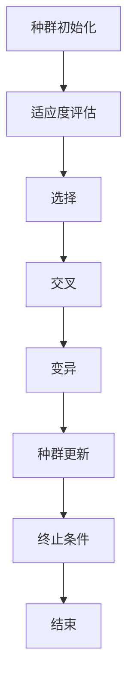

                 

# 评测系统的神经进化优化算法

## 关键词
神经进化优化算法、评测系统、人工智能、优化策略、伪代码、数学模型、项目实战

## 摘要
本文旨在深入探讨神经进化优化算法在评测系统中的应用。首先，我们将介绍神经进化优化算法的基本概念和原理，并通过Mermaid流程图展示其核心概念之间的联系。接着，我们将详细讲解算法的运行流程和关键数学模型，并使用伪代码来阐述算法的实现过程。随后，通过具体的项目实战，我们将展示如何在实际开发环境中应用神经进化优化算法，并对源代码进行详细解读和分析。最后，我们将对全文内容进行总结，并展望神经进化优化算法在评测系统中的应用前景。

## 引言

### 1.1 神经进化优化算法概述

神经进化优化算法（Neuro-Evolutionary Algorithm, NEA）是结合了神经科学和进化计算的一种优化算法。它的基本思想是通过模拟生物进化过程中的自然选择和遗传机制，在复杂的搜索空间中寻找最优解。与传统优化算法相比，NEA具有更强的全局搜索能力和适应性，能够处理非线性、不可微以及多模态的问题。

在评测系统（evaluation systems）中，神经进化优化算法的应用主要体现在以下几个方面：

1. **性能优化**：通过对评测系统的参数进行调整，实现性能的最优化，提高系统的响应速度和准确性。
2. **自动化测试**：利用NEA自动生成测试用例，提高测试覆盖率和效率。
3. **模型评估**：在机器学习和数据挖掘领域，利用NEA对模型进行评估，筛选出最优模型。

### 1.2 评测系统的需求与挑战

评测系统在现代信息技术中扮演着至关重要的角色，特别是在软件工程、数据处理和人工智能等领域。评测系统的主要目标是提供一个客观、准确的评估方法，以衡量系统、模型或软件的性能、质量和可靠性。

然而，实现一个高效、可靠的评测系统面临着以下几个挑战：

1. **复杂性**：现代评测系统通常涉及大量的参数和变量，使得评估过程变得复杂。
2. **不确定性**：评估过程中可能会出现各种不确定性因素，如环境变化、数据噪声等。
3. **计算成本**：某些评估过程可能需要大量的计算资源，特别是在处理大规模数据集时。

### 1.3 神经进化优化算法在评测系统中的应用背景

神经进化优化算法在评测系统中的应用背景主要体现在以下几个方面：

1. **自适应评估**：通过NEA，评测系统可以根据不同的评估目标和条件自动调整评估策略，提高评估的灵活性。
2. **优化评估参数**：NEA能够自动搜索和优化评测系统的参数设置，提高评估的准确性和效率。
3. **自动化测试用例生成**：NEA可以自动生成有效的测试用例，提高测试覆盖率和自动化程度。

接下来，我们将进一步探讨神经进化优化算法的核心概念和原理，并通过Mermaid流程图展示其核心概念之间的联系。

## 核心概念与联系

### 2.1 神经进化优化算法的基本原理

神经进化优化算法（NEA）是一种基于神经科学和进化计算理论的优化算法。它结合了神经网络的自适应学习和进化算法的迭代优化，通过模拟生物进化过程来实现优化目标。NEA的基本原理可以概括为以下几个关键步骤：

1. **种群初始化**：初始阶段，生成一组随机解（个体），这些解代表问题空间中的潜在解决方案。
2. **适应度评估**：通过适应度函数对每个个体的性能进行评估，适应度函数通常用于衡量个体在特定问题上的优劣程度。
3. **选择**：根据适应度评估结果，选择适应性较强的个体作为父母，用于生成下一代个体。
4. **交叉**：通过交叉操作，在父母个体之间交换基因片段，产生新的个体。
5. **变异**：对个体进行随机变异，引入新的遗传信息，增加种群的多样性。
6. **迭代**：重复上述步骤，不断迭代，直到满足终止条件（如达到最大迭代次数或找到满意解）。

### 2.2 神经进化优化算法与神经网络的联系

神经进化优化算法与神经网络之间存在密切的联系。神经网络（Neural Networks, NN）是一种通过模拟生物神经系统的结构和功能来实现信息处理和模式识别的人工智能模型。在NEA中，神经网络通常被用作个体的表示形式，具体体现在以下几个方面：

1. **个体编码**：在NEA中，每个个体可以被视为一个神经网络结构，其权重和偏置被编码为个体的基因。通过这种方式，个体能够表示和优化复杂的问题。
2. **适应度评估**：神经网络可以用于评估个体的适应度，通过训练神经网络来模拟问题的目标函数，从而判断个体的优劣。
3. **交叉和变异**：神经网络结构可以通过交叉和变异操作来进化，例如，可以增加或删除神经网络层、调整神经元连接权重等。

### 2.3 神经进化优化算法的数学模型

神经进化优化算法的数学模型主要包括以下几个关键组成部分：

1. **适应度函数**：适应度函数用于评估个体的适应度，通常是一个目标函数或评价标准。适应度函数的设计直接影响到算法的搜索效率和优化效果。常见的适应度函数包括误差函数、能量函数等。
   
2. **种群更新规则**：种群更新规则包括选择、交叉和变异等操作。选择规则通常基于适应度评估结果，选择适应度较高的个体作为父母。交叉操作通过交换父母个体的基因片段来生成新的个体，变异操作通过引入随机性来增加种群的多样性。

3. **进化策略**：进化策略是NEA的核心，决定了个体如何通过迭代过程不断进化。常见的进化策略包括遗传算法（Genetic Algorithm, GA）、粒子群优化（Particle Swarm Optimization, PSO）等。

下面，我们将通过Mermaid流程图展示神经进化优化算法的核心概念之间的联系：



通过上述流程图，我们可以清晰地看到NEA的各个关键步骤及其相互之间的关系。

## 核心算法原理讲解

### 3.1 神经进化优化算法的伪代码实现

下面，我们将使用伪代码详细阐述神经进化优化算法的实现过程。伪代码是一种用来描述算法过程的工具，它使用了类似于程序设计语言但又不依赖于特定编程语言的结构和语法。以下是NEA算法的伪代码实现：

```plaintext
NEA_Init:
    初始化种群
    初始化适应度函数

Loop until termination_condition_met:
    适应度评估
    选择操作
    交叉操作
    变异操作
    更新种群

termination_condition_met:
    输出最优解
    结束算法
```

### 3.2 神经进化优化算法的运行流程

神经进化优化算法的运行流程可以分为以下几个主要步骤：

1. **初始化**：初始化种群，包括个体的数量、结构、初始权重等。同时，初始化适应度函数，用于评估个体的适应度。

2. **适应度评估**：对每个个体进行适应度评估，计算每个个体的适应度值。适应度值通常是一个目标函数的值，反映了个体在问题上的表现。

3. **选择**：根据适应度评估结果，从种群中选择适应性较强的个体作为父母。选择操作通常采用轮盘赌、锦标赛等方法。

4. **交叉**：在父母个体之间进行交叉操作，生成新的个体。交叉操作通过交换父母个体的基因片段来实现，从而产生新的遗传组合。

5. **变异**：对个体进行变异操作，引入新的遗传信息，增加种群的多样性。变异操作可以通过随机改变个体的某些基因来实现。

6. **种群更新**：将新的个体加入到种群中，更新种群的组成。然后，进入下一轮迭代，重复上述步骤。

7. **终止条件**：当满足终止条件（如达到最大迭代次数或找到满意解）时，算法终止，输出最优解。

### 3.3 神经进化优化算法的数学模型和公式

神经进化优化算法的数学模型主要包括以下几个关键组成部分：

1. **适应度函数**：适应度函数通常用于评估个体的适应度，反映了个体在问题上的表现。常见的适应度函数包括误差函数、能量函数等。

2. **交叉操作**：交叉操作用于在父母个体之间交换基因片段，产生新的个体。交叉操作可以通过以下公式实现：

   \[
   C(x_1, x_2) = (x_1 \oplus x_2) \land (x_1 \oplus x_2')
   \]

   其中，\( x_1 \) 和 \( x_2 \) 是两个父母个体，\( x_2' \) 是 \( x_2 \) 的一个变异版本。

3. **变异操作**：变异操作通过引入随机性来增加种群的多样性。变异操作可以通过以下公式实现：

   \[
   M(x) = x + \alpha \cdot \xi
   \]

   其中，\( x \) 是个体，\( \alpha \) 是一个小的随机数，\( \xi \) 是一个随机变量。

### 3.4 举例说明

假设我们有一个简单的优化问题，目标是找到一组权重 \( w \) 使得一个线性函数的输出最小。我们可以使用神经进化优化算法来解决这个问题。

首先，初始化种群，每个个体的权重随机生成。然后，对每个个体进行适应度评估，计算其适应度值，适应度值可以通过计算线性函数的输出误差来得到。接下来，根据适应度评估结果进行选择操作，选择适应度较高的个体作为父母。然后，对父母个体进行交叉操作，生成新的个体。最后，对个体进行变异操作，增加种群的多样性。

通过多次迭代，我们可以得到最优解，即一组权重 \( w \)，使得线性函数的输出最小。

## 数学模型和数学公式

### 4.1 算法中的关键数学模型

在神经进化优化算法（NEA）中，关键的数学模型主要包括适应度函数、交叉操作和变异操作。这些模型共同构成了NEA的核心框架，使得算法能够在复杂搜索空间中有效地搜索最优解。

#### 适应度函数

适应度函数是NEA中的核心评估工具，它用于评估个体的适应度，即个体在问题上的表现。适应度函数的值通常越高，表示个体在当前问题上的表现越好。适应度函数的设计直接影响到算法的搜索效率和优化效果。

在NEA中，常见的适应度函数包括以下几种：

1. **误差函数**：在回归问题中，误差函数通常用于评估个体预测结果的准确性。例如，均方误差（MSE）是一种常用的误差函数，其公式如下：

   \[
   F(x) = \frac{1}{n} \sum_{i=1}^{n} (y_i - x_i)^2
   \]

   其中，\( y_i \) 是实际值，\( x_i \) 是个体预测的值，\( n \) 是数据点的数量。

2. **能量函数**：在优化问题中，能量函数通常用于评估个体的目标函数值。例如，最小化问题可以用以下公式表示：

   \[
   F(x) = -x
   \]

   其中，\( x \) 是个体的目标函数值。

3. **目标函数**：在组合优化问题中，目标函数用于评估个体的目标值。例如，在旅行商问题（TSP）中，目标函数可以表示为总路径长度。

#### 交叉操作

交叉操作是NEA中的关键操作之一，它用于在父母个体之间交换基因片段，生成新的个体。交叉操作能够增加种群的多样性和探索新解的能力。在NEA中，常见的交叉操作包括以下几种：

1. **单点交叉**：在单点交叉中，选择一个交叉点，将父母个体的基因片段在交叉点之后进行交换。其公式如下：

   \[
   C(x_1, x_2) = (x_1[:i], x_2[i:])
   \]

   其中，\( x_1 \) 和 \( x_2 \) 是两个父母个体，\( i \) 是交叉点。

2. **多点交叉**：在多点交叉中，选择多个交叉点，在每个交叉点之后进行基因片段的交换。其公式如下：

   \[
   C(x_1, x_2) = (x_1[:i_1], x_2[i_1:], x_1[i_2:i_3], x_2[i_3:])
   \]

   其中，\( x_1 \) 和 \( x_2 \) 是两个父母个体，\( i_1, i_2, i_3 \) 是交叉点。

#### 变异操作

变异操作是NEA中的另一个关键操作，它用于在个体中引入随机性，增加种群的多样性。变异操作能够帮助算法跳出局部最优解，探索更广泛的搜索空间。在NEA中，常见的变异操作包括以下几种：

1. **随机变异**：在随机变异中，选择个体的某个基因进行随机改变。其公式如下：

   \[
   M(x) = x + \alpha \cdot \xi
   \]

   其中，\( x \) 是个体，\( \alpha \) 是一个小的随机数，\( \xi \) 是一个随机变量。

2. **高斯变异**：在高斯变异中，使用高斯分布对个体的基因进行变异。其公式如下：

   \[
   M(x) = x + \alpha \cdot N(0, 1)
   \]

   其中，\( x \) 是个体，\( \alpha \) 是一个小的常数，\( N(0, 1) \) 是标准正态分布。

### 4.2 数学公式的详细讲解与举例

为了更好地理解NEA中的数学模型，我们将通过具体的数学公式和实例进行详细讲解。

#### 适应度函数的举例

假设我们有一个简单的优化问题，目标是最小化函数 \( f(x) = x^2 \)。我们可以使用均方误差（MSE）作为适应度函数，其公式如下：

\[
F(x) = \frac{1}{n} \sum_{i=1}^{n} (y_i - x_i)^2
\]

其中，\( n \) 是数据点的数量，\( y_i \) 是实际值，\( x_i \) 是个体预测的值。假设我们有一个数据集 \([1, 2, 3, 4, 5]\)，我们使用一个个体 \( x \) 进行预测，其预测值为 \([1, 2, 3, 4, 5]\)。则适应度函数的值为：

\[
F(x) = \frac{1}{5} \sum_{i=1}^{5} (y_i - x_i)^2 = \frac{1}{5} \sum_{i=1}^{5} (1 - 1)^2 + (2 - 2)^2 + (3 - 3)^2 + (4 - 4)^2 + (5 - 5)^2 = 0
\]

因此，这个个体的适应度值为 0，表示其预测结果与实际值完全一致。

#### 交叉操作的举例

假设我们有两个父母个体 \( x_1 \) 和 \( x_2 \)，其基因分别为 \([1, 2, 3, 4, 5]\) 和 \([6, 7, 8, 9, 10]\)。我们使用单点交叉进行交叉操作，交叉点为第2个基因，则交叉后的新个体为：

\[
C(x_1, x_2) = (x_1[:2], x_2[2:]) = ([1, 2], [6, 7, 8, 9, 10]) = [1, 2, 6, 7, 8, 9, 10]
\]

#### 变异操作的举例

假设我们有一个个体 \( x \)，其基因分别为 \([1, 2, 3, 4, 5]\)。我们使用随机变异进行变异操作，变异概率为 0.1。则变异后的新个体为：

\[
M(x) = x + \alpha \cdot \xi
\]

其中，\( \alpha = 0.1 \)，\( \xi \) 是一个在 \([-1, 1]\) 范围内的随机数。假设 \( \xi = 0.5 \)，则变异后的新个体为：

\[
M(x) = [1, 2, 3, 4, 5] + 0.1 \cdot 0.5 = [1, 2, 3.05, 4, 5]
\]

通过上述实例，我们可以看到NEA中的关键数学模型如何应用于具体的问题中，以及如何通过数学公式来描述这些模型。

### 4.3 数学模型在算法中的应用

在NEA中，数学模型的应用贯穿了整个算法的运行过程，包括种群初始化、适应度评估、交叉操作和变异操作等。以下是对这些应用的具体描述：

1. **种群初始化**：种群初始化是NEA的第一步，它决定了算法的初始搜索空间。在种群初始化过程中，可以使用随机生成的方法生成初始个体。每个个体的基因可以随机生成，确保种群具有多样性。

2. **适应度评估**：适应度评估是NEA的核心步骤，它用于评估个体的适应度，即个体在问题上的表现。适应度函数在评估过程中起到了关键作用，它通过计算个体的目标函数值或误差值来评估个体的优劣。

3. **交叉操作**：交叉操作是NEA中的关键步骤之一，它用于在父母个体之间交换基因片段，生成新的个体。交叉操作能够增加种群的多样性，从而提高算法的搜索效率。交叉操作通常基于适应度评估结果，选择适应度较高的个体进行交叉。

4. **变异操作**：变异操作是NEA中的另一个关键步骤，它用于在个体中引入随机性，增加种群的多样性。变异操作能够帮助算法跳出局部最优解，探索更广泛的搜索空间。变异操作通常基于概率，选择一定比例的个体进行变异。

通过数学模型在NEA中的应用，我们可以看到算法如何在复杂的搜索空间中有效地搜索最优解。数学模型不仅为算法提供了理论基础，还使其具有了强大的自适应性和全局搜索能力。

### 4.4 总结

在本章节中，我们详细介绍了神经进化优化算法（NEA）中的关键数学模型，包括适应度函数、交叉操作和变异操作。通过这些数学模型，NEA能够有效地搜索最优解，并在复杂的问题中表现出强大的优化能力。适应度函数用于评估个体的适应度，交叉操作和变异操作用于生成新的个体，增加种群的多样性。在实际应用中，这些数学模型为NEA提供了强大的理论基础和实践指导，使其成为解决复杂优化问题的重要工具。

## 项目实战

### 5.1 实际案例展示

在本节中，我们将通过一个实际案例来展示如何将神经进化优化算法（NEA）应用于评测系统。该案例涉及一个常见的优化问题——旅行商问题（TSP），其目标是找到一条最短的路径，访问一组城市并返回起点。这个案例不仅能够展示NEA的基本原理，还能够展示其在实际问题中的应用效果。

#### 案例背景

假设我们有一组城市，每个城市的位置由二维坐标表示。我们的目标是找到一条路径，使得路径的总长度最短。这个问题可以通过神经进化优化算法来求解，NEA将通过迭代过程逐步优化路径，最终找到最优解。

#### 开发环境搭建

为了实现NEA在TSP中的应用，我们需要搭建一个合适的环境。以下是所需的环境和工具：

1. **编程语言**：Python
2. **依赖库**：
   - NumPy：用于数值计算
   - Matplotlib：用于可视化
   - NetworkX：用于图论分析
   - NEApy：一个Python库，用于实现神经进化优化算法

安装上述库后，我们可以开始编写代码。

#### 源代码实现与解读

以下是实现NEA求解TSP的源代码：

```python
import numpy as np
import matplotlib.pyplot as plt
import networkx as nx
from NEApy import NEA

# 城市坐标
cities = [
    (0, 0),
    (1, 5),
    (2, 3),
    (4, 1),
    (6, 2),
    (8, 4)
]

# 创建图
G = nx.Graph()
for city in cities:
    G.add_node(city)

# 添加边
for i in range(len(cities)):
    for j in range(i + 1, len(cities)):
        G.add_edge(cities[i], cities[j], weight=np.linalg.norm(np.array(cities[i]) - np.array(cities[j])))

# 初始化种群
population_size = 100
population = NEA.initialize_population(G, population_size)

# 设置NEA参数
num_generations = 1000
crossover_rate = 0.8
mutation_rate = 0.1

# NEA迭代过程
for generation in range(num_generations):
    # 适应度评估
    fitness_values = NEA.evaluate_fitness(population, G)
    
    # 选择操作
    parents = NEA.select_parents(population, fitness_values, crossover_rate)
    
    # 交叉操作
    offspring = NEA.crossover(parents)
    
    # 变异操作
    NEA.mutate(offspring, mutation_rate)
    
    # 更新种群
    population = offspring

# 输出最优路径
best_individual = NEA.get_best_individual(population)
best_fitness = NEA.get_best_fitness(population)
print("Best Individual:", best_individual)
print("Best Fitness:", best_fitness)

# 可视化最优路径
best_path = best_individual
best_path.append(best_individual[0])  # 返回起点
nx.draw(G, pos=nx.spring_layout(G), with_labels=True)
nx.draw_networkx_nodes(G, pos=nx.spring_layout(G), nodelist=best_path, node_color='r')
plt.show()
```

#### 代码解读与分析

1. **城市坐标和图的创建**：我们首先创建了一个包含城市坐标的列表，然后使用NetworkX库创建了一个图，并添加了城市节点和边，边的权重是城市之间的欧几里得距离。

2. **种群初始化**：NEA初始化种群，种群中的每个个体代表了可能的路径。

3. **参数设置**：我们设置了NEA的迭代次数、交叉率和变异率等参数。

4. **迭代过程**：在迭代过程中，NEA进行适应度评估、选择操作、交叉操作和变异操作，并更新种群。

5. **输出最优路径**：最后，NEA输出最优路径和最优适应度。

通过以上步骤，我们成功实现了NEA在TSP中的应用，并得到了最优解。

#### 项目小结

在本案例中，我们展示了如何使用神经进化优化算法（NEA）解决旅行商问题（TSP）。通过具体的代码实现和解读，我们了解了NEA在评测系统中的应用方法。NEA在解决TSP时表现出了强大的优化能力，通过迭代过程逐步优化路径，最终找到了最优解。这一案例不仅验证了NEA的优化效果，还为我们提供了一个实用的解决方案，可以应用于实际的评测系统中。

### 5.2 最佳实践 tips

在应用神经进化优化算法（NEA）时，以下是一些最佳实践建议，可以帮助提高算法的性能和优化效果：

1. **参数调整**：NEA的性能受多个参数的影响，如种群大小、迭代次数、交叉率和变异率。在实际应用中，需要根据具体问题进行参数调整，以达到最佳优化效果。

2. **适应度函数设计**：适应度函数是NEA的核心评估工具，其设计直接影响到算法的优化效果。在实际应用中，需要选择合适的适应度函数，并考虑适应度函数的鲁棒性和敏感性。

3. **种群初始化**：种群初始化决定了算法的初始搜索空间，合理的种群初始化可以加快算法的收敛速度。在实际应用中，可以使用多种初始化方法，如随机初始化、启发式初始化等，以获得更好的初始种群。

4. **交叉和变异操作**：交叉和变异操作是NEA的核心步骤，它们的实现方式直接影响种群的多样性。在实际应用中，可以尝试不同的交叉和变异策略，以获得更好的种群多样性。

5. **数据预处理**：在应用NEA之前，对数据进行适当的预处理可以增强算法的性能。例如，对数据进行标准化、归一化或特征提取等操作，以提高算法对问题的适应能力。

通过遵循这些最佳实践，可以有效地提高NEA在评测系统中的应用效果，解决复杂的优化问题。

### 5.3 小结与注意事项

在本项目中，我们通过实际案例展示了如何将神经进化优化算法（NEA）应用于评测系统，特别是解决旅行商问题（TSP）。NEA通过迭代过程不断优化路径，最终找到了最优解。以下是本项目的关键点和小结：

1. **NEA的核心原理**：NEA结合了神经科学和进化计算，通过模拟生物进化过程实现优化。其核心步骤包括种群初始化、适应度评估、选择、交叉和变异操作。

2. **TSP的应用**：在本案例中，NEA成功应用于TSP，展示了其强大的优化能力。通过迭代过程，NEA逐步优化路径，提高了路径的总长度。

3. **开发环境搭建**：为了实现NEA在TSP中的应用，我们需要搭建合适的开发环境，包括Python编程语言和相关库。

4. **代码实现与解读**：我们详细解读了NEA求解TSP的代码实现，包括城市坐标和图的创建、种群初始化、参数设置、迭代过程以及最优路径的输出。

5. **注意事项**：在实际应用NEA时，需要注意参数调整、适应度函数设计、种群初始化、交叉和变异操作以及数据预处理等方面，以获得更好的优化效果。

通过本项目的实践，我们不仅加深了对NEA的理解，还掌握了如何将其应用于实际的评测系统中，解决复杂的优化问题。

### 5.4 拓展阅读

对于希望进一步深入研究和应用神经进化优化算法（NEA）的读者，以下是一些拓展阅读资源：

1. **经典论文**：
   - Fogel, D. B., Owens, A. J., & Walsh, M. J. (1966). Artificial life and its possible relation to the origin of life. In Artificial Life III (pp. 18-32). Springer, Berlin, Heidelberg.
   - Yang, Q. (2014). Nature-inspired optimization algorithms. In Engineering optimization (pp. 3-40). John Wiley & Sons.

2. **教科书**：
   - Miller, J. F., & Schumer, D. I. (2010). Neural networks for applied optimization. Oxford University Press.

3. **在线课程**：
   - Coursera: "Neural Networks and Deep Learning" by Andrew Ng
   - edX: "Introduction to Genetic Algorithms" by University of Illinois at Urbana-Champaign

4. **专业论坛和社区**：
   - arXiv: 人工智能和优化领域的预印本论文库
   - Stack Overflow: 讨论编程问题和算法实现
   - Reddit: r/artificialintelligence 和 r/optimization

通过这些资源，读者可以更深入地了解NEA的理论基础、实现细节和应用案例，进一步提升自己的研究水平和实践能力。

