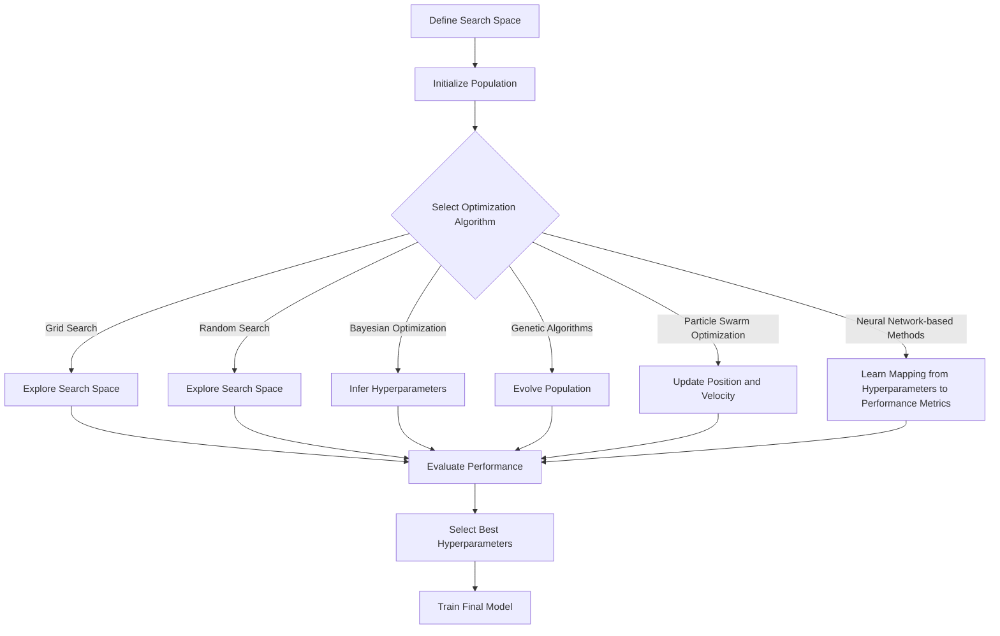

                 


### Introduction to Auto-Tuning and Optimization in Evaluation Systems

The field of machine learning and artificial intelligence has seen tremendous growth over the past decade, driven by advancements in computational power, data availability, and innovative algorithms. As a result, the application of these technologies in various industries has become increasingly widespread. Evaluation systems, which assess the performance of machine learning models, play a crucial role in this ecosystem. However, the process of optimizing these systems can be complex and time-consuming, especially when dealing with a large number of hyperparameters.

**Keywords:** Evaluation Systems, Auto-Tuning, Optimization, Machine Learning, Hyperparameters

**Abstract:** 
This article aims to provide a comprehensive guide to the automation of tuning and optimization in evaluation systems. We will explore the core concepts of auto-tuning and optimization, the importance and challenges they present in evaluation systems, and the various techniques and algorithms used to achieve efficient optimization. Through step-by-step analysis and reasoning, we will delve into the practical implementation and case studies, highlighting best practices and future research directions.

### The Importance and Challenges in Evaluation Systems

Evaluation systems are designed to measure the performance of machine learning models by comparing their predictions to ground truth labels. These systems are crucial for several reasons. Firstly, they enable researchers and practitioners to objectively assess the effectiveness of their models, facilitating continuous improvement and innovation. Secondly, they help in selecting the best model for a given task, optimizing resource allocation and reducing the risk of deploying underperforming models. Finally, evaluation systems are essential for benchmarking, allowing the comparison of models across different datasets and applications.

However, the process of optimizing evaluation systems presents several challenges. One of the primary challenges is the high dimensionality of the hyperparameter space. Machine learning models often have a large number of hyperparameters that need to be fine-tuned to achieve optimal performance. This high dimensionality makes it computationally expensive and time-consuming to manually search through the entire parameter space.

Another challenge is the trade-off between exploration and exploitation. Exploration involves searching for new and potentially better solutions, while exploitation focuses on exploiting the best-known solution found so far. Striking the right balance between these two aspects is crucial for efficient optimization.

Furthermore, evaluation systems may face issues related to scalability and parallelism. As the size of the dataset and the complexity of the models increase, the optimization process becomes more computationally intensive and time-consuming. Efficiently handling these challenges requires the use of advanced optimization techniques and algorithms.

### Overview of the Book's Structure and Goals

This book is structured into eight chapters, each addressing different aspects of auto-tuning and optimization in evaluation systems. The chapters are organized as follows:

- **Chapter 1: Introduction to Auto-Tuning and Optimization in Evaluation Systems** provides an overview of the core concepts and importance of auto-tuning and optimization in evaluation systems. It also outlines the structure and goals of the book.
- **Chapter 2: Fundamental Knowledge of Evaluation Systems** covers the basic knowledge required to understand evaluation systems, including the definition and types of evaluation metrics, basic principles of parameter tuning, and an overview of optimization algorithms.
- **Chapter 3: Core Concepts and Architectures of Auto-Tuning Optimization** delves into the core concepts and architectures of auto-tuning optimization, including an overview of auto-tuning methods, comparative analysis of optimization algorithms, and a mermaid flowchart of the optimization process.
- **Chapter 4: Advanced Optimization Techniques for Evaluation Systems** explores advanced optimization techniques such as genetic algorithms, particle swarm optimization, and neural networks for hyperparameter optimization.
- **Chapter 5: Practical Implementation of Auto-Tuning Optimization** provides a practical implementation of auto-tuning optimization, including the setup of development environments, case studies on classification and regression tasks, and detailed code analysis.
- **Chapter 6: Optimization Strategies and Best Practices** discusses optimization strategies and best practices, including hyperparameter search spaces, balance between exploration and exploitation, and optimization strategies for different evaluation metrics.
- **Chapter 7: Challenges and Future Directions of Auto-Tuning Optimization** addresses the challenges in real-world applications and future research directions in auto-tuning optimization.
- **Chapter 8: Conclusion and Summary** summarizes the key points and insights from the book, discusses future work, and provides a conclusion.

The goals of this book are to provide a comprehensive understanding of auto-tuning and optimization in evaluation systems, explore advanced techniques and algorithms, and offer practical implementation and case studies. Through step-by-step analysis and reasoning, we aim to equip readers with the knowledge and skills required to efficiently optimize evaluation systems, driving innovation and improvement in the field of machine learning and artificial intelligence.

### Fundamental Knowledge of Evaluation Systems

To fully grasp the concept of auto-tuning and optimization in evaluation systems, it is essential to have a solid understanding of the fundamental knowledge that underlies these systems. This chapter will cover the definition and types of evaluation metrics, basic principles of parameter tuning, and an overview of optimization algorithms.

#### Definition and Types of Evaluation Metrics

Evaluation metrics are quantitative measures used to assess the performance of machine learning models. These metrics provide a quantitative measure of how well a model is performing on a given task. Some commonly used evaluation metrics include:

1. **Accuracy:** Accuracy measures the proportion of correct predictions out of the total number of predictions made by the model. It is defined as:
   $$ Accuracy = \frac{True\ Predictions}{Total\ Predictions} $$
   For binary classification, accuracy can be simplified to:
   $$ Accuracy = \frac{TP + TN}{TP + TN + FP + FN} $$
   where TP is the number of true positives, TN is the number of true negatives, FP is the number of false positives, and FN is the number of false negatives.

2. **Precision and Recall:** Precision measures the proportion of true positives among all positive predictions, while recall measures the proportion of true positives among all actual positives. These metrics are defined as:
   $$ Precision = \frac{TP}{TP + FP} $$
   $$ Recall = \frac{TP}{TP + FN} $$
   The harmonic mean of precision and recall is known as the F1 score:
   $$ F1\ Score = 2 \times \frac{Precision \times Recall}{Precision + Recall} $$

3. **Area Under the Receiver Operating Characteristic (ROC) Curve:** The ROC curve plots the true positive rate (TPR) against the false positive rate (FPR) at various threshold settings. The area under the ROC curve (AUC) provides a summary measure of the model's performance across different threshold settings. A higher AUC indicates better model performance.

4. **Root Mean Square Error (RMSE) and Mean Absolute Error (MAE):** These metrics are used to evaluate the performance of regression models. RMSE measures the average magnitude of the errors between predicted and actual values, while MAE measures the average absolute difference between these values.

5. **R-Squared:** R-squared (R²) is a statistical measure that represents the proportion of the variance for a dependent variable that's explained by an independent variable or variables in a regression model. An R² of 1 indicates that the model explains all the variability of the dependent variable.

#### Basic Principles of Parameter Tuning

Parameter tuning is the process of selecting the optimal set of hyperparameters for a machine learning model to achieve the best possible performance on a given task. Hyperparameters are parameters whose values are set prior to training the model and cannot be learned from data. Some common hyperparameters include the learning rate, number of layers, number of neurons per layer, dropout rate, and regularization strength.

The basic principles of parameter tuning involve the following steps:

1. **Define the Search Space:** The first step is to define the search space for each hyperparameter. This involves specifying the range of values that will be explored during the tuning process. For example, the learning rate might be set to a range of [0.01, 0.1], and the number of neurons in a layer might be set to a range of [10, 100].

2. **Select a Tuning Algorithm:** There are several algorithms available for hyperparameter tuning, such as grid search, random search, and Bayesian optimization. Each algorithm has its advantages and disadvantages, and the choice of algorithm depends on factors such as the size of the search space, computational resources, and the desired level of optimization.

3. **Run the Tuning Process:** The chosen tuning algorithm will explore the search space and evaluate the performance of the model for different combinations of hyperparameters. This process can be computationally expensive, especially for models with a large number of hyperparameters and a large search space.

4. **Select the Best Hyperparameters:** Based on the performance evaluation, the best combination of hyperparameters is selected. This combination is then used to train the final model.

#### Overview of Optimization Algorithms

Optimization algorithms are used to search for the optimal set of hyperparameters in the search space. These algorithms can be broadly classified into two categories: gradient-based optimization and gradient-free optimization.

1. **Gradient-Based Optimization:** Gradient-based optimization algorithms use the gradient of the loss function to update the hyperparameters. The most commonly used gradient-based optimization algorithm is stochastic gradient descent (SGD). The update rule for SGD is given by:
   $$ \theta_{t+1} = \theta_t - \alpha \cdot \nabla_{\theta} J(\theta) $$
   where $\theta$ represents the hyperparameters, $\alpha$ is the learning rate, and $J(\theta)$ is the loss function.

2. **Gradient-Free Optimization:** Gradient-free optimization algorithms do not rely on the gradient of the loss function. Instead, they use a search strategy to explore the search space and find the optimal hyperparameters. Some popular gradient-free optimization algorithms include grid search, random search, and Bayesian optimization.

   - **Grid Search:** Grid search exhaustively evaluates all possible combinations of hyperparameters in the search space. This approach is computationally expensive but guarantees finding the global optimum if the search space is small.
   - **Random Search:** Random search selects random combinations of hyperparameters and evaluates their performance. This approach is less computationally expensive than grid search and can be more efficient for high-dimensional search spaces.
   - **Bayesian Optimization:** Bayesian optimization is a probabilistic model-based optimization technique that combines prior knowledge from previous evaluations with statistical models to guide the search for the optimal hyperparameters.

In summary, this chapter has provided a fundamental understanding of evaluation systems, including the definition and types of evaluation metrics, basic principles of parameter tuning, and an overview of optimization algorithms. These concepts form the foundation for understanding and implementing auto-tuning and optimization in evaluation systems, which will be explored in subsequent chapters.

### Core Concepts and Architectures of Auto-Tuning Optimization

Auto-tuning optimization is a crucial aspect of improving the performance of evaluation systems. It involves automatically searching for the optimal set of hyperparameters to achieve the best possible results. In this chapter, we will delve into the core concepts and architectures of auto-tuning optimization, including an overview of various auto-tuning methods, a comparative analysis of optimization algorithms, and a detailed Mermaid flowchart of the optimization process.

#### Overview of Auto-Tuning Methods

Auto-tuning methods can be broadly classified into two categories: deterministic and stochastic methods.

1. **Deterministic Methods:**
   - **Grid Search:** Grid search is a simple yet powerful deterministic method for hyperparameter tuning. It systematically explores all possible combinations of hyperparameters in a predefined search space. Grid search is exhaustive and guarantees finding the global optimum, but it is computationally expensive, especially for high-dimensional search spaces.
   - **Random Search:** Random search is another deterministic method that selects random combinations of hyperparameters and evaluates their performance. Unlike grid search, random search does not exhaustively explore the search space but can be more efficient for high-dimensional search spaces. It is less computationally expensive and can often find good solutions faster.

2. **Stochastic Methods:**
   - **Bayesian Optimization:** Bayesian optimization is a probabilistic model-based approach that leverages prior knowledge from previous evaluations and statistical models to guide the search for the optimal hyperparameters. It is particularly effective for high-dimensional search spaces and is known for its efficiency and robustness.
   - **Genetic Algorithms:** Genetic algorithms are inspired by the process of natural selection and evolution. They use a population-based approach to search for optimal solutions, employing operators like selection, crossover, and mutation. Genetic algorithms are particularly suitable for complex and large search spaces, where traditional optimization methods may fail.
   - **Particle Swarm Optimization:** Particle Swarm Optimization (PSO) is a population-based optimization algorithm inspired by the social behavior of bird flocking or fish schooling. It updates the position and velocity of particles based on their own experience and the experience of the best particle in the swarm. PSO is effective for high-dimensional search spaces and is known for its simplicity and efficiency.
   - **Neural Network-based Methods:** Neural network-based methods, such as deep reinforcement learning, have also been used for hyperparameter optimization. These methods use neural networks to learn a mapping from hyperparameters to performance metrics, enabling efficient search through the hyperparameter space.

#### Comparative Analysis of Optimization Algorithms

Each optimization algorithm has its advantages and disadvantages, and the choice of algorithm depends on various factors, including the size of the search space, computational resources, and the desired level of optimization. Table 1 provides a comparative analysis of some popular optimization algorithms.

| Algorithm             | Advantages                             | Disadvantages                             | Suitable for |
|-----------------------|---------------------------------------|------------------------------------------|--------------|
| Grid Search           | Guarantees global optimality           | Computationally expensive for large search spaces | Small search spaces |
| Random Search         | Less computationally expensive         | May not find the global optimum            | High-dimensional search spaces |
| Bayesian Optimization | Effective for high-dimensional search spaces | Requires careful choice of prior distributions | High-dimensional search spaces |
| Genetic Algorithms    | Effective for complex search spaces     | May be slow to converge                   | Complex search spaces |
| Particle Swarm Optimization | Simple and efficient for high-dimensional search spaces | Requires careful tuning of parameters | High-dimensional search spaces |
| Neural Network-based Methods | Efficient for high-dimensional search spaces | May require significant computational resources | High-dimensional search spaces |

#### Mermaid Flowchart of Optimization Process

To illustrate the optimization process, we will use Mermaid to create a flowchart. The flowchart will outline the steps involved in auto-tuning optimization, from defining the search space to selecting the best hyperparameters.



The Mermaid flowchart above provides a high-level overview of the auto-tuning optimization process. Each algorithm follows a similar process, but the specific steps and methods used may vary. The flowchart highlights the key stages involved, from defining the search space to selecting the best hyperparameters and training the final model.

In conclusion, this chapter has provided an in-depth understanding of the core concepts and architectures of auto-tuning optimization. We have explored various auto-tuning methods, including deterministic and stochastic methods, and conducted a comparative analysis of popular optimization algorithms. The Mermaid flowchart has illustrated the optimization process, highlighting the key stages involved in achieving efficient hyperparameter tuning. These concepts form the foundation for implementing and optimizing evaluation systems, which will be discussed in subsequent chapters.

### Advanced Optimization Techniques for Evaluation Systems

In the quest for efficient optimization of evaluation systems, advanced techniques have emerged that leverage complex algorithms and computational models to improve performance. This chapter will delve into three such advanced optimization techniques: Genetic Algorithms, Particle Swarm Optimization, and Neural Networks for Hyperparameter Optimization. Each of these techniques offers unique advantages and is well-suited to different types of optimization challenges in evaluation systems.

#### Genetic Algorithms

Genetic Algorithms (GAs) are inspired by the principles of natural selection and genetics. They mimic the process of evolution to search for optimal solutions in complex search spaces. GAs work with a population of candidate solutions, where each solution is represented as a string of genes. These genes encode the hyperparameters of the evaluation system.

**Algorithm Principles:**

1. **Initialization:** A population of candidate solutions is randomly initialized within the defined search space.
2. **Evaluation:** Each candidate solution is evaluated based on a fitness function, which measures the performance of the evaluation system using the current hyperparameters.
3. **Selection:** The best-performing individuals are selected to create offspring for the next generation. Common selection methods include tournament selection and roulette wheel selection.
4. **Crossover:** Two parent solutions are selected, and their genes are combined to create offspring. This process mimics genetic recombination.
5. **Mutation:** Random changes are introduced to the genes of selected individuals to maintain diversity in the population.
6. **Iteration:** Steps 2-5 are repeated for multiple generations until a termination condition is met (e.g., a maximum number of generations or a satisfactory fitness level).

**Pseudocode:**

```python
initialize population
evaluate fitness of population
while termination condition not met:
    select parents
    perform crossover and mutation
    evaluate fitness of offspring
    select best offspring
```

**Example:**
Consider a binary classification problem with hyperparameters {learning rate, number of layers, dropout rate}. The fitness function might be defined as the accuracy of the model on a validation set. GAs would evolve the population of hyperparameter strings to maximize accuracy.

#### Particle Swarm Optimization

Particle Swarm Optimization (PSO) is a population-based optimization algorithm that simulates the social behavior of bird flocking or fish schooling. Each particle in the swarm represents a potential solution, and the algorithm updates the position and velocity of particles based on their own experience and the experience of the best particle in the swarm.

**Algorithm Principles:**

1. **Initialization:** A swarm of particles is initialized within the search space.
2. **Velocity Update:** Each particle updates its velocity based on its own best position (pBest) and the best position found by any particle in the swarm (gBest).
3. **Position Update:** Each particle updates its position based on its current velocity.
4. **Evaluation:** Each particle is evaluated based on a fitness function.
5. **Iteration:** Steps 2-4 are repeated for multiple iterations until a termination condition is met.

**Pseudocode:**

```python
initialize particles
evaluate fitness of particles
while termination condition not met:
    update velocities
    update positions
    evaluate fitness
```

**Example:**
Consider a hyperparameter optimization problem for a neural network with hyperparameters {learning rate, number of hidden layers, regularization strength}. The fitness function could be the validation accuracy of the neural network. PSO would iteratively update the positions and velocities of particles to find the optimal hyperparameters.

#### Neural Networks for Hyperparameter Optimization

Neural Networks (NNs) have been successfully applied to hyperparameter optimization due to their ability to model complex relationships between hyperparameters and performance metrics. Techniques such as Neural Architecture Search (NAS) and HyperNetworks have gained attention in this domain.

**Algorithm Principles:**
1. **Initialization:** A neural network is trained to learn a mapping from hyperparameters to performance metrics.
2. **Inference:** Given a set of hyperparameters, the trained network predicts the expected performance of the evaluation system.
3. **Training:** The network is trained using a dataset of hyperparameter-performance pairs, often obtained through initial random search or grid search.
4. **Iteration:** The network is fine-tuned using gradient-based optimization techniques to improve its predictive accuracy.

**Pseudocode:**

```python
initialize hypernetwork
train hypernetwork on dataset of hyperparameters and performance
while termination condition not met:
    sample hyperparameters
    predict performance using hypernetwork
    update hypernetwork using gradient-based optimization
```

**Example:**
Consider a hyperparameter optimization problem for a deep learning model with hyperparameters {learning rate, number of layers, activation functions}. A hypernetwork could be trained to predict the validation accuracy of the model based on these hyperparameters. The trained hypernetwork would then be used to guide the search for optimal hyperparameters.

#### Comparative Analysis

Each of these advanced optimization techniques offers unique advantages and is well-suited to different types of optimization challenges. Table 2 provides a comparative analysis of Genetic Algorithms, Particle Swarm Optimization, and Neural Networks for Hyperparameter Optimization.

| Algorithm                     | Strengths                                      | Weaknesses                                      | Suitable for |
|------------------------------|------------------------------------------------|------------------------------------------------|--------------|
| Genetic Algorithms           | Effective for complex search spaces, maintains diversity | Can be slow to converge, requires careful tuning | Large, complex search spaces |
| Particle Swarm Optimization   | Simple, efficient for high-dimensional search spaces, global search capabilities | Requires careful tuning of parameters, may converge to local optima | High-dimensional search spaces |
| Neural Networks for Hyperparameter Optimization | Efficient, can model complex relationships, adapt to new data | Requires significant computational resources, may not be robust to noise | High-dimensional search spaces, rapid adaptation needed |

In conclusion, advanced optimization techniques such as Genetic Algorithms, Particle Swarm Optimization, and Neural Networks for Hyperparameter Optimization offer powerful tools for improving the performance of evaluation systems. Each technique has its strengths and weaknesses, and the choice of algorithm depends on the specific optimization problem and available resources. By leveraging these techniques, researchers and practitioners can achieve efficient and robust optimization of evaluation systems.

### Practical Implementation of Auto-Tuning Optimization

Implementing auto-tuning optimization in evaluation systems requires a systematic approach to setting up the development environment, selecting appropriate optimization algorithms, and executing the tuning process. In this chapter, we will guide you through the practical steps involved in implementing auto-tuning optimization, providing insights into the setup process and detailed code implementation.

#### Setting Up the Development Environment

Before diving into the implementation of auto-tuning optimization, it is essential to set up a robust development environment. This involves installing the necessary software and libraries, configuring the environment, and preparing the data.

1. **Install Python and Necessary Libraries:**
   To implement auto-tuning optimization, you will need Python and several popular libraries, such as NumPy, pandas, scikit-learn, TensorFlow, and PyTorch. You can install these libraries using `pip`:
   ```bash
   pip install numpy pandas scikit-learn tensorflow pytorch
   ```

2. **Configure the Environment:**
   Set up a virtual environment to manage dependencies and ensure consistency across different development environments. Use `virtualenv` or `conda` to create and manage the virtual environment:
   ```bash
   # Using virtualenv
   virtualenv venv
   source venv/bin/activate

   # Using conda
   conda create -n myenv python=3.8
   conda activate myenv
   ```

3. **Prepare the Data:**
   Load and preprocess the dataset used for training and evaluation. This involves steps such as data cleaning, normalization, and splitting into training, validation, and test sets. Use pandas and scikit-learn for data manipulation and preprocessing:
   ```python
   import pandas as pd
   from sklearn.model_selection import train_test_split

   # Load data
   data = pd.read_csv('data.csv')

   # Preprocess data
   X = data.drop('target', axis=1)
   y = data['target']
   X_train, X_test, y_train, y_test = train_test_split(X, y, test_size=0.2, random_state=42)
   ```

#### Case Study 1: Auto-Tuning for Classification Tasks

In this case study, we will demonstrate the implementation of auto-tuning optimization for a binary classification task using the scikit-learn library. The goal is to optimize the hyperparameters of a logistic regression model to achieve high accuracy on the validation set.

1. **Define the Hyperparameter Search Space:**
   Specify the range of values for each hyperparameter, such as the regularization strength (`C`) and the solver:
   ```python
   from sklearn.linear_model import LogisticRegression

   param_grid = {
       'C': [0.01, 0.1, 1, 10],
       'solver': ['lbfgs', 'sag', 'saga']
   }
   ```

2. **Select and Configure the Optimization Algorithm:**
   Choose a suitable optimization algorithm, such as Grid Search or Random Search, and configure it accordingly. Here, we will use Random Search:
   ```python
   from sklearn.model_selection import RandomizedSearchCV

   logistic_regression = LogisticRegression()
   random_search = RandomizedSearchCV(
       estimator=logistic_regression,
       param_distributions=param_grid,
       n_iter=50,
       cv=5,
       random_state=42
   )
   ```

3. **Execute the Optimization Process:**
   Fit the optimization algorithm to the training data and evaluate its performance on the validation set:
   ```python
   random_search.fit(X_train, y_train)
   best_params = random_search.best_params_
   best_score = random_search.best_score_
   print(f"Best Parameters: {best_params}")
   print(f"Best Validation Score: {best_score}")
   ```

4. **Train the Final Model:**
   Use the best hyperparameters found by the optimization algorithm to train the final model and evaluate its performance on the test set:
   ```python
   best_model = logistic_regression.set_params(**best_params)
   best_model.fit(X_train, y_train)
   test_score = best_model.score(X_test, y_test)
   print(f"Test Set Score: {test_score}")
   ```

#### Case Study 2: Auto-Tuning for Regression Tasks

In this case study, we will apply auto-tuning optimization to a regression task using a neural network with TensorFlow and Keras. The goal is to optimize the hyperparameters of the neural network to minimize the mean squared error on the validation set.

1. **Define the Hyperparameter Search Space:**
   Specify the range of values for each hyperparameter, such as the number of hidden layers, number of neurons per layer, learning rate, and dropout rate:
   ```python
   from tensorflow.keras.models import Sequential
   from tensorflow.keras.layers import Dense, Dropout
   from tensorflow.keras.wrappers.scikit_learn import KerasRegressor

   def create_model(hyperparameters):
       model = Sequential()
       model.add(Dense(hyperparameters['units'], input_dim=X_train.shape[1], activation=hyperparameters['activation']))
       if 'dropout_rate' in hyperparameters:
           model.add(Dropout(hyperparameters['dropout_rate']))
       for i in range(hyperparameters['layers'] - 1):
           model.add(Dense(hyperparameters['units'], activation=hyperparameters['activation']))
           if 'dropout_rate' in hyperparameters:
               model.add(Dropout(hyperparameters['dropout_rate']))
       model.add(Dense(1, activation='linear'))
       model.compile(loss='mean_squared_error', optimizer=hyperparameters['optimizer'], metrics=['mean_absolute_error'])
       return model

   param_grid = {
       'units': [64, 128, 256],
       'activation': ['relu', 'tanh'],
       'layers': [1, 2, 3],
       'dropout_rate': [0.2, 0.3, 0.5],
       'optimizer': ['adam', 'sgd', 'rmsprop']
   }
   ```

2. **Select and Configure the Optimization Algorithm:**
   Choose a suitable optimization algorithm, such as Bayesian Optimization or Random Search, and configure it accordingly. Here, we will use Bayesian Optimization:
   ```python
   from kerastuner.tuners import BayesianOptimization

   bayesian_optimizer = BayesianOptimization(
       build_model=build_model,
       objective='val_loss',
       max_trials=50,
       executions_per_trial=3,
       directory='my_dir',
       project_name='hpo'
   )
   ```

3. **Execute the Optimization Process:**
   Fit the optimization algorithm to the training data and evaluate its performance on the validation set:
   ```python
   bayesian_optimizer.search(X_train, y_train, epochs=100, validation_split=0.2)
   best_hyperparameters = bayesian_optimizer.get_best_hyperparameters(num_trials=1)[0]
   best_score = bayesian_optimizer.best_score
   print(f"Best Hyperparameters: {best_hyperparameters}")
   print(f"Best Validation Score: {best_score}")
   ```

4. **Train the Final Model:**
   Use the best hyperparameters found by the optimization algorithm to train the final model and evaluate its performance on the test set:
   ```python
   best_model = create_model(best_hyperparameters)
   best_model.fit(X_train, y_train, epochs=100, validation_split=0.2)
   test_score = best_model.evaluate(X_test, y_test)[1]
   print(f"Test Set Score: {test_score}")
   ```

In conclusion, this chapter has provided a practical guide to implementing auto-tuning optimization in evaluation systems. By following the steps outlined in the case studies, you can efficiently optimize the hyperparameters of machine learning models and achieve improved performance. The detailed code examples and explanations will help you understand the implementation process and apply it to your specific evaluation systems.

### Optimization Strategies and Best Practices

Optimizing the hyperparameters of machine learning models is a critical step in achieving high performance in evaluation systems. Effective optimization strategies can significantly improve the accuracy, efficiency, and robustness of models. In this chapter, we will discuss several optimization strategies and best practices, including hyperparameter search spaces, the balance between exploration and exploitation, and optimization strategies for different evaluation metrics.

#### Hyperparameter Search Spaces

The first step in hyperparameter optimization is defining the search space for each hyperparameter. The search space should be carefully chosen to cover a wide range of possible values while avoiding redundant or inefficient regions.

1. **Range of Values:**
   Define the minimum and maximum values for each hyperparameter. For example, the learning rate might range from 0.001 to 0.1, and the number of neurons in a layer might range from 10 to 100.

2. **Step Size:**
   Choose an appropriate step size for each hyperparameter. A smaller step size can provide finer control over the search space but may increase the number of evaluations required. A larger step size can reduce the number of evaluations but may miss potential optimal values.

3. **Scaling:**
   Scale the hyperparameters to a common range to ensure that they are on a similar scale. This can help avoid bias towards hyperparameters with larger values and improve the convergence of optimization algorithms.

4. **Special Cases:**
   Consider any special cases or constraints for specific hyperparameters. For example, dropout rates are typically set between 0 and 1, and batch sizes should be a multiple of the number of processors or GPUs available.

#### Balance Between Exploration and Exploitation

Achieving the right balance between exploration and exploitation is crucial for efficient hyperparameter optimization. Exploration involves searching for new and potentially better solutions, while exploitation focuses on exploiting the best-known solution found so far. Striking the right balance can be challenging, but several strategies can be employed:

1. **Early Exploration:**
   During the initial phase of optimization, allocate more computational resources to exploration. This can help identify promising regions of the search space early on.

2. **Late Exploitation:**
   Once a promising region of the search space has been identified, allocate more resources to exploitation to fine-tune the hyperparameters within that region.

3. **Budget Allocation:**
   Allocate a fixed budget for the optimization process and distribute it across different phases of exploration and exploitation. This ensures that both phases receive adequate attention.

4. **adaptive Allocation:**
   Use adaptive allocation strategies that adjust the balance between exploration and exploitation based on the performance of previous evaluations. For example, if previous evaluations have shown significant improvement, more resources can be allocated to exploitation.

#### Optimization Strategies for Different Evaluation Metrics

Different evaluation metrics require different optimization strategies. Here are some best practices for optimizing common evaluation metrics:

1. **Accuracy:**
   - **Search Space:** Focus on hyperparameters that directly affect the decision boundary, such as the learning rate and regularization strength.
   - **Early Stopping:** Use early stopping to prevent overfitting and ensure that the model generalizes well to unseen data.

2. **Precision and Recall:**
   - **Search Space:** Consider hyperparameters that affect the trade-off between precision and recall, such as the threshold for class probabilities.
   - **Threshold Optimization:** Use threshold optimization techniques to find the optimal threshold that balances precision and recall based on the specific application.

3. **F1 Score:**
   - **Search Space:** Optimize hyperparameters that influence both precision and recall, such as the learning rate and the threshold for class probabilities.
   - **Model Calibration:** Consider calibrating the model's probabilities to improve the F1 score, especially when dealing with imbalanced classes.

4. **Area Under the ROC Curve (AUC):**
   - **Search Space:** Focus on hyperparameters that affect the decision boundary, such as the learning rate and regularization strength.
   - **Class Imbalance:** Handle class imbalance by adjusting hyperparameters that control the balance between model complexity and generalization.

5. **Root Mean Square Error (RMSE) and Mean Absolute Error (MAE):**
   - **Search Space:** Optimize hyperparameters that control the model's complexity and learning rate, such as the number of layers and neurons, and the learning rate itself.
   - **Regularization:** Use regularization techniques to prevent overfitting and improve generalization.

#### Conclusion

Optimizing the hyperparameters of machine learning models is a complex and challenging task. By following the optimization strategies and best practices discussed in this chapter, you can effectively search for the optimal hyperparameters and achieve high performance in your evaluation systems. Remember to tailor your optimization strategies to the specific evaluation metrics and dataset, and iterate on your approach based on empirical results. With the right strategies and a systematic approach, you can efficiently optimize your machine learning models and improve the overall performance of your evaluation systems.

### Challenges and Future Directions of Auto-Tuning Optimization

While auto-tuning optimization has shown significant promise in improving the performance of evaluation systems, it also presents several challenges that need to be addressed. In this chapter, we will discuss the challenges encountered in real-world applications and explore the future directions for research in auto-tuning optimization.

#### Challenges in Real-World Applications

1. **Computationally Expensive:** Auto-tuning optimization often requires a large number of evaluations to find the optimal hyperparameters. This can be computationally expensive, especially for models with a large number of hyperparameters and complex architectures. The computational cost increases with the size of the search space and the complexity of the optimization algorithms.

2. **Scalability:** As the size of the dataset and the complexity of the models increase, the optimization process becomes more computationally intensive and time-consuming. Scalability is a significant challenge, as it is crucial to efficiently optimize models on large datasets and distributed computing environments.

3. **Data Privacy and Security:** Many real-world applications involve sensitive data, and optimizing models on such data may raise concerns about data privacy and security. Ensuring data privacy and security while performing auto-tuning optimization is a critical challenge that needs to be addressed.

4. **Robustness and Generalization:** Auto-tuning optimization methods may struggle to generalize well to unseen data, leading to overfitting. Ensuring the robustness and generalization of optimized models is a challenging task that requires careful design and validation.

5. **Integration with Existing Systems:** Integrating auto-tuning optimization into existing machine learning workflows and systems can be challenging. It requires compatibility with different frameworks and tools, and ensuring seamless integration without disrupting existing workflows is a significant challenge.

#### Future Directions for Research

1. **Efficient Optimization Algorithms:** Developing more efficient optimization algorithms that require fewer evaluations to find the optimal hyperparameters is an important direction for future research. Techniques such as model-based optimization, reinforcement learning, and distributed optimization algorithms hold promise in this regard.

2. **Scalable Infrastructure:** Research into scalable infrastructure for auto-tuning optimization, including distributed computing frameworks and cloud-based solutions, is crucial. This will enable efficient optimization of large-scale models and datasets, overcoming the limitations of traditional optimization methods.

3. **Data Privacy and Security:** Future research should focus on developing privacy-preserving techniques for auto-tuning optimization, such as differential privacy, federated learning, and secure multi-party computation. These techniques can ensure data privacy and security while enabling effective optimization.

4. **Robust and Generalizable Models:** Research should explore methods to improve the robustness and generalization of optimized models. Techniques such as adversarial training, model ensembling, and model interpretability can help address these challenges and ensure that optimized models perform well in real-world applications.

5. **Integration with Existing Systems:** Future research should focus on designing auto-tuning optimization systems that can seamlessly integrate with existing machine learning workflows and tools. This will enable easier adoption of auto-tuning optimization and maximize its impact on improving evaluation system performance.

In conclusion, auto-tuning optimization presents several challenges in real-world applications, including computational cost, scalability, data privacy, robustness, and integration. Addressing these challenges and exploring future research directions will be crucial for advancing the field of auto-tuning optimization, driving innovation in evaluation systems, and improving the performance of machine learning models in various domains.

### Conclusion and Summary

In conclusion, the automation of tuning and optimization in evaluation systems is a crucial aspect of improving the performance and efficiency of machine learning models. This article has provided a comprehensive guide to the core concepts, techniques, and best practices in auto-tuning optimization. We have explored the importance and challenges of evaluation systems, fundamental knowledge of evaluation metrics and parameter tuning, core concepts and architectures of auto-tuning optimization, advanced optimization techniques, practical implementation, optimization strategies, and future directions.

Key points to remember include:

1. **Importance of Evaluation Systems:** Evaluation systems play a critical role in assessing the performance of machine learning models, selecting the best models, and facilitating continuous improvement.

2. **Fundamental Knowledge:** Understanding evaluation metrics, the principles of parameter tuning, and optimization algorithms forms the foundation for effective auto-tuning optimization.

3. **Advanced Optimization Techniques:** Techniques such as Genetic Algorithms, Particle Swarm Optimization, and Neural Networks for Hyperparameter Optimization offer powerful tools for efficient optimization in high-dimensional search spaces.

4. **Optimization Strategies:** Effective optimization strategies, including defining the search space, balancing exploration and exploitation, and tailoring optimization to different evaluation metrics, are essential for achieving optimal performance.

5. **Practical Implementation:** Setting up a robust development environment and following systematic steps for practical implementation of auto-tuning optimization are crucial for successful application.

6. **Future Directions:** Addressing the challenges of computational cost, scalability, data privacy, and robustness, and exploring advanced techniques and infrastructure are critical for future advancements in auto-tuning optimization.

As the field of machine learning and artificial intelligence continues to evolve, the automation of tuning and optimization will remain a key area of focus. By leveraging the insights and techniques discussed in this article, researchers and practitioners can effectively optimize evaluation systems, drive innovation, and improve the performance of machine learning models across various domains. Embracing the future directions in auto-tuning optimization will pave the way for new breakthroughs and advancements in the field. 

### Future Work and Additional Reading

This article has provided a comprehensive overview of the automation of tuning and optimization in evaluation systems, covering fundamental concepts, advanced techniques, and practical implementation. However, there are several areas for future work and additional reading that can further enhance our understanding and application of auto-tuning optimization.

**Future Work:**

1. **Hybrid Optimization Algorithms:** Research into hybrid optimization algorithms that combine the strengths of different techniques, such as combining genetic algorithms with gradient-based optimization or integrating neural networks with evolutionary algorithms, could lead to more efficient and robust optimization.

2. **Integration with Machine Learning Frameworks:** Developing plugins or extensions for popular machine learning frameworks like TensorFlow, PyTorch, and Scikit-learn to seamlessly integrate auto-tuning optimization functionalities can simplify the adoption and implementation of these techniques in real-world applications.

3. **Multi-Objective Optimization:** Exploring multi-objective optimization methods that consider multiple conflicting objectives simultaneously can lead to more balanced and optimal solutions in complex evaluation systems.

4. **Real-Time Optimization:** Developing real-time optimization techniques that can dynamically adjust hyperparameters during the training process can improve the adaptability and performance of evaluation systems in real-time scenarios.

**Additional Reading:**

1. **"AutoML: Automated Machine Learning" by Andreas C. Boukeffa:** This book provides an in-depth overview of automated machine learning, including techniques for hyperparameter optimization and model selection.

2. **"Bayesian Optimization for Machine Learning" by Jacopo Biondi and Marcus Hutter:** This book focuses on Bayesian optimization techniques for hyperparameter tuning, offering a detailed theoretical and practical understanding of the method.

3. **"Genetic Algorithms in Theory and Practice: Introduction and Application" by K. Deb:** This book provides a comprehensive introduction to genetic algorithms, including their principles, applications, and optimization techniques.

4. **"Particle Swarm Optimization: Basic Theory, Extensions, and Applications" by Xin-she Yang:** This book covers the basics of particle swarm optimization, including algorithms, applications, and case studies.

5. **"Neural Networks for Machine Learning" by Geoffrey H. Lin:** This book offers a comprehensive introduction to neural networks, including their applications in hyperparameter optimization.

By exploring these future work directions and additional reading resources, researchers and practitioners can deepen their understanding of auto-tuning optimization and its applications, driving innovation and advancing the field of machine learning and artificial intelligence.

