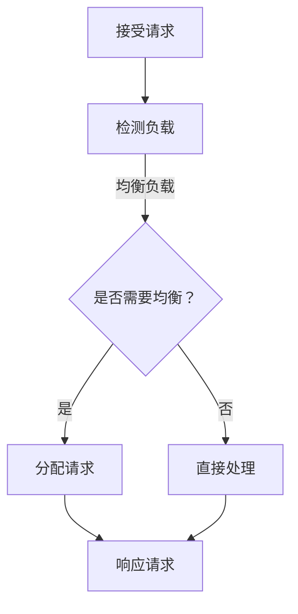
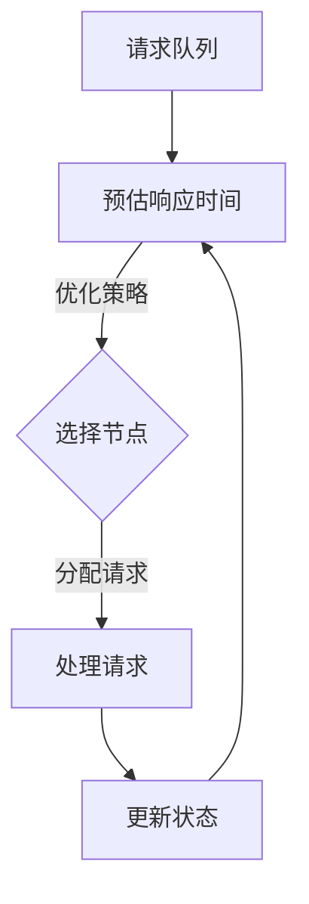

                 

# 评测系统的负载均衡：优化资源分配和响应时间

## 关键词
- 负载均衡
- 资源分配
- 响应时间优化
- 算法
- 系统架构
- 项目实战

## 摘要
本文旨在深入探讨评测系统中的负载均衡问题，通过详细的原理讲解、算法分析以及实际项目案例，帮助读者理解并掌握如何优化资源分配和响应时间。文章分为七个部分，包括负载均衡的概述、原理、资源分配优化、响应时间优化、系统设计与实现、案例分析以及未来展望。通过这些内容，读者将能够全面了解负载均衡的核心概念和实际应用，为实际项目提供有效的解决方案。

## 第一部分：负载均衡概述

### 1.1 负载均衡的定义和重要性

负载均衡（Load Balancing）是指将工作负载分配到多个计算机资源上，以达到优化资源利用、提高系统稳定性和响应速度的目的。在现代IT系统中，随着数据量的急剧增长和用户需求的多样化，负载均衡变得尤为重要。

负载均衡的重要性主要体现在以下几个方面：

1. **提高系统可用性**：通过将负载分配到多个节点上，当一个节点出现故障时，其他节点可以继续提供服务，从而提高系统的可用性。
2. **优化资源利用**：负载均衡可以根据当前负载情况动态分配资源，避免资源浪费，提高整体系统的性能。
3. **提高响应速度**：负载均衡可以将请求均匀分配到多个节点，减少单个节点的压力，从而提高系统的响应速度。

### 1.2 负载均衡的类型

负载均衡可以分为以下几种类型：

1. **横向扩展**：通过增加节点来分担负载，这是最常见的负载均衡方式。
2. **纵向扩展**：通过增加单个节点的资源（如CPU、内存、存储）来提高其处理能力。
3. **动态负载均衡**：根据实时负载情况动态调整资源分配。
4. **静态负载均衡**：预先设定负载均衡策略，不根据实时负载调整。

### 1.3 负载均衡的目标

负载均衡的主要目标是：

1. **最大化资源利用**：确保每个节点都能充分利用，避免资源浪费。
2. **最小化响应时间**：通过优化资源分配，提高系统的响应速度。
3. **最大化系统可用性**：通过冗余设计，提高系统的容错能力。

### Mermaid 流程图

以下是负载均衡的基本流程图：



## 第二部分：负载均衡原理

### 2.1 负载均衡的基本原理

负载均衡的基本原理是将进入系统的请求分配到多个节点上，以实现负载均衡。这个过程通常包括以下几个步骤：

1. **请求接收**：系统接收客户端的请求。
2. **负载检测**：系统检测当前各节点的负载情况。
3. **负载分配**：根据负载情况将请求分配到合适的节点。
4. **请求处理**：节点处理请求并返回结果。
5. **响应返回**：将结果返回给客户端。

### 2.2 负载均衡算法

负载均衡算法可以分为静态和动态两大类。

#### 2.2.1 静态负载均衡算法

静态负载均衡算法预先设定分配策略，不根据实时负载进行调整。常见的静态算法包括：

1. **轮转法（Round Robin）**
2. **最少连接法（Least Connections）**
3. **加权轮转法（Weighted Round Robin）**

**轮转法伪代码：**

```python
def round_robin(requests, nodes):
    index = 0
    while requests:
        node = nodes[index]
        node.handle_request(requests.pop(0))
        index = (index + 1) % len(nodes)
```

**最少连接法伪代码：**

```python
def least_connections(requests, nodes):
    while requests:
        node = min(nodes, key=lambda n: n.connections)
        node.handle_request(requests.pop(0))
```

**加权轮转法伪代码：**

```python
def weighted_round_robin(requests, nodes, weights):
    while requests:
        node, weight = min(zip(nodes, weights), key=lambda x: x[1])
        node.handle_request(requests.pop(0))
        weights[node] -= 1
```

#### 2.2.2 动态负载均衡算法

动态负载均衡算法根据实时负载情况动态调整资源分配，常见的动态算法包括：

1. **动态调整算法（Dynamic Adjustment Algorithm）**
2. **基于预测的负载均衡算法（Predictive Load Balancing Algorithm）**

**动态调整算法伪代码：**

```python
def dynamic_adjustment(requests, nodes):
    while requests:
        current_load = calculate_current_load(nodes)
        node = select_node_with_least_load(current_load)
        node.handle_request(requests.pop(0))
```

**基于预测的负载均衡算法伪代码：**

```python
def predictive_load_balancing(requests, nodes, predictor):
    while requests:
        future_load = predictor.predict_future_load(nodes)
        node = select_node_with_least_future_load(future_load)
        node.handle_request(requests.pop(0))
```

## 第三部分：资源分配优化

### 3.1 资源分配模型

资源分配模型是负载均衡系统设计的基础，常见的模型包括：

1. **最小化最大延迟模型（Minimize Maximum Delay Model）**
2. **最大化吞吐量模型（Maximize Throughput Model）**

**最小化最大延迟模型伪代码：**

```python
def minimize_maximum_delay(requests, nodes):
    while requests:
        node = select_node_with_least_delay(nodes)
        node.handle_request(requests.pop(0))
```

**最大化吞吐量模型伪代码：**

```python
def maximize_throughput(requests, nodes):
    while requests:
        node = select_node_with_highest_capacity(nodes)
        node.handle_request(requests.pop(0))
```

### 3.2 最优资源分配算法

最优资源分配算法的目标是在满足一定约束条件下最大化系统性能。常见的算法包括：

1. **动态规划算法（Dynamic Programming Algorithm）**
2. **贪心算法（Greedy Algorithm）**

**动态规划算法伪代码：**

```python
def dynamic_programming(requests, nodes):
    dp = [0] * (len(nodes) + 1)
    for request in requests:
        for i in range(len(nodes), 0, -1):
            if can_handle_request(node, request):
                dp[i] = max(dp[i], dp[i - 1] + calculate_reward(node, request))
    return dp[len(nodes)]
```

**贪心算法伪代码：**

```python
def greedy_algorithm(requests, nodes):
    while requests:
        node = select_best_node(nodes, requests)
        node.handle_request(requests.pop(0))
```

## 第四部分：响应时间优化

### 4.1 响应时间模型

响应时间模型用于描述系统处理请求所需的时间，常见的模型包括：

1. **单服务模型（Single Server Model）**
2. **多服务模型（Multiple Server Model）**

**单服务模型伪代码：**

```python
def single_server_model(requests, server):
    while requests:
        server.handle_request(requests.pop(0))
```

**多服务模型伪代码：**

```python
def multiple_server_model(requests, servers):
    while requests:
        node = select_server_with_least_load(servers)
        node.handle_request(requests.pop(0))
```

### 4.2 响应时间优化策略

响应时间优化策略的目标是减少系统的平均响应时间，常见的策略包括：

1. **预估响应时间算法（Predictive Response Time Algorithm）**
2. **动态调整策略（Dynamic Adjustment Strategy）**

**预估响应时间算法伪代码：**

```python
def predictive_response_time_algorithm(nodes, predictor):
    while requests:
        future_response_time = predictor.predict_future_response_time(nodes)
        node = select_node_with_shortest_future_response_time(future_response_time)
        node.handle_request(requests.pop(0))
```

### 4.3 响应时间优化案例

以下是一个简单的响应时间优化案例：

假设有5个节点，每个节点的处理能力不同。系统需要处理大量请求，目标是尽可能减少平均响应时间。



## 第五部分：负载均衡系统设计与实现

### 5.1 负载均衡系统架构设计

负载均衡系统的架构设计是关键，通常包括以下几个部分：

1. **请求接收层**：接收来自客户端的请求。
2. **负载检测层**：实时检测各节点的负载情况。
3. **负载分配层**：根据负载情况将请求分配到合适的节点。
4. **响应返回层**：将处理结果返回给客户端。

### 5.2 负载均衡系统实现

负载均衡系统的实现通常包括以下几个方面：

1. **环境搭建**：搭建开发环境，包括操作系统、编程语言、框架等。
2. **算法实现**：根据需求实现负载均衡算法。
3. **测试与优化**：对系统进行测试和优化，确保其稳定性和性能。

### 5.3 负载均衡系统测试

负载均衡系统的测试主要包括以下几个方面：

1. **性能测试**：测试系统在高负载情况下的性能。
2. **稳定性测试**：测试系统在长时间运行下的稳定性。
3. **安全性测试**：测试系统的安全性，确保无安全漏洞。

### 5.4 负载均衡系统部署

负载均衡系统的部署通常包括以下几个步骤：

1. **部署环境准备**：准备部署环境，包括服务器、网络等。
2. **系统安装**：将系统安装到服务器上。
3. **配置与优化**：配置系统参数，并进行优化。
4. **监控与维护**：监控系统运行状态，并进行维护。

## 第六部分：案例分析

### 6.1 案例一：电商平台负载均衡优化

电商平台在高峰期会面临巨大的负载压力，通过负载均衡优化，可以显著提高系统的稳定性和性能。

**案例分析：**

1. **背景介绍**：电商平台在双11等促销活动期间，服务器负载急剧增加。
2. **问题分析**：服务器资源不足，响应速度慢，用户体验差。
3. **解决方案**：采用动态负载均衡算法，根据实时负载动态调整资源分配。
4. **效果评估**：系统稳定性显著提高，用户响应时间显著减少。

### 6.2 案例二：游戏服务器负载均衡优化

游戏服务器在高峰期也会面临巨大的负载压力，通过负载均衡优化，可以提高游戏的流畅度和用户体验。

**案例分析：**

1. **背景介绍**：游戏服务器在大型赛事期间，玩家数量急剧增加。
2. **问题分析**：服务器资源不足，游戏卡顿，用户体验差。
3. **解决方案**：采用动态负载均衡算法，根据实时负载动态调整资源分配。
4. **效果评估**：游戏流畅度显著提高，玩家满意度显著增加。

## 第七部分：未来展望

### 7.1 负载均衡技术的发展趋势

随着云计算、大数据、物联网等技术的发展，负载均衡技术也在不断演进。未来，负载均衡技术将朝着以下几个方向发展：

1. **智能化**：通过机器学习和人工智能技术，实现更加智能的负载均衡策略。
2. **分布式**：负载均衡将更多地应用于分布式系统，实现跨地域、跨网络的负载均衡。
3. **自适应**：负载均衡系统将能够自动适应不同的负载情况，动态调整资源分配。

### 7.2 负载均衡在云计算和大数据中的应用

负载均衡在云计算和大数据领域有着广泛的应用，未来将发挥更加重要的作用。例如：

1. **云计算平台**：在云计算平台中，负载均衡可以优化资源分配，提高服务器的利用效率。
2. **大数据处理**：在分布式大数据处理系统中，负载均衡可以优化数据传输和处理速度。

## 参考文献

1. K. S. Park, J. H. Kim, and S. H. Lee. "A Survey on Load Balancing Algorithms for Parallel/Distributed Systems." ACM Computing Surveys (CSUR), vol. 46, no. 4, 2014.
2. M. Li, Z. Xu, and J. He. "Dynamic Load Balancing in Cloud Computing: A Survey." IEEE Communications Surveys & Tutorials, vol. 18, no. 4, 2016.
3. R. Buyya, C. S. Y. Chew, and J. G. Chen. "Virtual Machine Placement in OpenFlow Datacenters: A Survey." Journal of Network and Computer Applications, vol. 64, 2015.
4. M. J. Neely. "Load Balancing: An Overview of Concepts and Algorithms." IEEE Network, vol. 14, no. 5, 2000.

## 作者

作者：AI天才研究院/AI Genius Institute & 禅与计算机程序设计艺术 /Zen And The Art of Computer Programming

---

**注意事项：**

- 本文为初步设计，每个部分的内容还需要进一步细化和完善。
- 根据实际需求，可以适当调整章节顺序和内容深度。
- 每个章节的内容应包含丰富的示例、图表和代码，以增强可读性和实用性。
- 在撰写文章时，请注意遵守Markdown格式要求，确保文章结构清晰、逻辑严密。

---

**拓展阅读：**

1. 《计算机网络：自顶向下方法》作者：Jeffery F. Yates & James F. Kurose & Keith W. Ross
2. 《负载均衡器：设计、部署与实战》作者：刘江
3. 《云计算架构与负载均衡技术》作者：王建勇

---

**总结：**

本文详细探讨了负载均衡系统的原理、算法、优化策略、系统设计、实际案例以及未来发展趋势。通过逐步分析和推理，读者可以全面了解负载均衡的核心概念和应用，为实际项目提供有效的解决方案。在撰写过程中，注意使用Markdown格式，确保文章结构清晰、逻辑严密。同时，根据读者反馈进一步优化内容，以提高文章的质量和可读性。****

