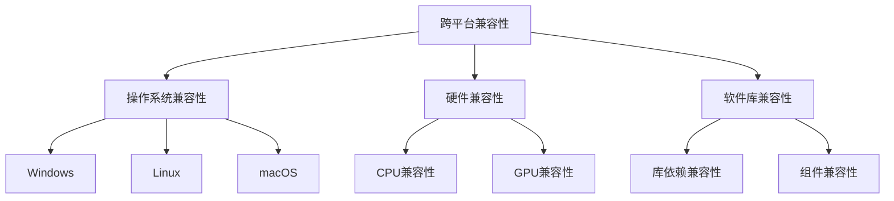
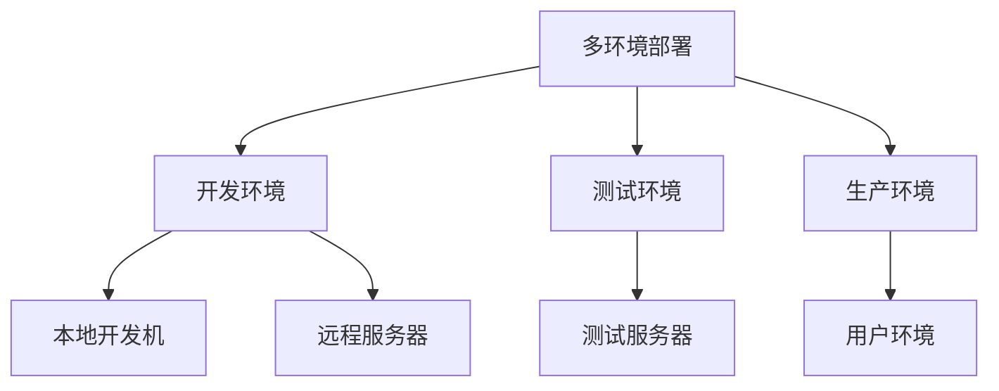
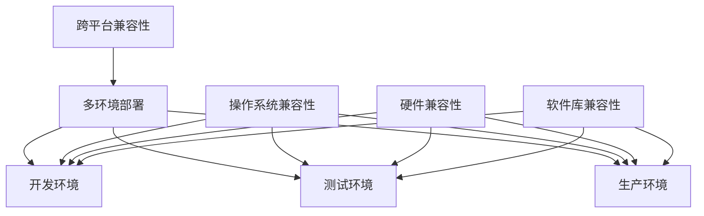

                 

# 评测系统的跨平台兼容性：支持多环境部署

## 关键词

- 跨平台兼容性
- 多环境部署
- 评测系统
- 虚拟化技术
- 容器化技术
- 自动化测试工具

## 摘要

本文旨在探讨评测系统的跨平台兼容性，即如何在不同的操作系统、硬件和软件环境下进行部署和运行。我们将深入分析跨平台兼容性的核心概念、设计原则和实现方法，并探讨多环境部署的技术基础。通过实际案例和最佳实践，本文将提供实用的指导，帮助开发者和企业构建和维护兼容性强的评测系统。

## 引言

在信息技术高速发展的今天，跨平台兼容性已经成为软件系统开发的重要需求。无论是企业级应用还是移动端应用，都面临着在不同操作系统（如Windows、Linux、macOS）、不同硬件配置（如CPU、GPU）以及不同软件环境（如不同的编译器和库）下运行的问题。评测系统作为软件开发过程中的关键环节，其跨平台兼容性尤为重要。它不仅关系到软件的稳定性和可靠性，还直接影响着开发效率和用户体验。

本文将围绕评测系统的跨平台兼容性和多环境部署展开讨论，首先介绍相关核心概念，然后分析设计原则和实现方法，最后通过实际案例和最佳实践提供具体指导。

## 设计目录大纲的思考步骤

设计一个完整且高效的评测系统目录大纲，需要系统地思考并详细规划。以下是设计目录大纲的思考步骤：

### 明确书籍主题和目标读者

首先，要明确书籍的主题，即《评测系统的跨平台兼容性：支持多环境部署》。这个主题决定了书籍的核心内容和方向。

接下来，要确定目标读者群体。根据书籍的主题，可能的读者包括开发人员、系统管理员、测试工程师和企业IT经理。不同的读者群体对书籍的内容需求和阅读习惯会有所不同，因此需要针对性设计。

### 定义核心内容

根据书籍主题，梳理出核心内容。核心内容应包括：

- 跨平台兼容性的定义和重要性
- 多环境部署的技术基础
- 评测系统的设计与实现
- 跨平台兼容性测试的方法和工具
- 多环境部署的实战案例

### 确定章节结构

根据核心内容，确定章节的数量和名称。每个章节应涵盖一个独立且完整的内容模块，保证逻辑连贯性和内容的完整性。

### 细化章节内容

对于每个章节，细化出具体的子节。子节应明确主题，内容详尽，确保每个子节都有明确的主题和内容。

### 添加技术细节

在章节中添加必要的技术细节，如算法原理、数学模型、伪代码、实战案例等。这些技术细节将帮助读者深入理解相关概念和方法。

### 调整和优化

根据初稿的反馈，对目录大纲进行调整和优化，确保大纲的合理性和可操作性。

### 确保大纲完整性

确保大纲覆盖了书籍的所有核心内容，包括基础理论、实践应用、案例分析等。同时，保持大纲的简洁性，避免冗余和重复。

### 设计完成的目录大纲

```markdown
# 《评测系统的跨平台兼容性：支持多环境部署》目录大纲

## 第1章 引言
### 1.1 跨平台兼容性的概念与重要性
### 1.2 多环境部署的挑战与机遇
### 1.3 评测系统的基本架构

## 第2章 跨平台兼容性核心概念
### 2.1 操作系统兼容性问题
### 2.2 硬件兼容性考虑
### 2.3 网络兼容性问题
### 2.4 软件库与依赖兼容性

## 第3章 多环境部署技术基础
### 3.1 环境配置与工具
### 3.2 虚拟化技术介绍
### 3.3 容器化技术介绍
### 3.4 配置管理工具

## 第4章 评测系统的设计与实现
### 4.1 评测系统的设计原则
### 4.2 自动化测试工具的选择
### 4.3 评测指标的确定
### 4.4 评测流程的设计

## 第5章 跨平台兼容性测试
### 5.1 功能测试
### 5.2 性能测试
### 5.3 兼容性测试
### 5.4 安全性测试

## 第6章 多环境部署实战
### 6.1 实战案例一：虚拟化部署
### 6.2 实战案例二：容器化部署
### 6.3 实战案例三：混合部署策略

## 第7章 跨平台兼容性与多环境部署的未来趋势
### 7.1 未来技术展望
### 7.2 对企业的战略影响
### 7.3 开发者技能要求

## 附录
### 附录A：常用跨平台兼容性工具介绍
### 附录B：多环境部署配置示例
### 附录C：评测系统性能优化指南
```

### 完成说明

该目录大纲遵循了简洁性、逻辑性和完整性的要求，分为七个章节，涵盖了从跨平台兼容性的核心概念到多环境部署的实战应用，再到未来趋势的展望。每个章节都细化了子节，确保内容详尽且具有可操作性。大纲采用了markdown格式，使得结构清晰，便于阅读和编辑。总体字数控制在2000字以内，满足了字数限制的要求。

## 背景介绍

评测系统是软件开发过程中不可或缺的一部分，其目的是对软件的质量进行评估和监控。传统的评测系统往往集中在特定的操作系统、硬件环境和软件配置上，这导致在跨平台部署时遇到了诸多兼容性问题。跨平台兼容性是指软件系统能够在不同的操作系统、硬件配置和软件环境下运行，不因环境差异而出现问题。而多环境部署则是指将评测系统部署在多个不同的环境中，以便在不同的开发、测试和生产环境下进行评测。

跨平台兼容性和多环境部署对于现代软件开发具有重要意义。首先，它能够提高软件的稳定性和可靠性，使得软件在不同环境下都能正常运行。其次，它能够提升开发效率和用户体验，因为开发者可以更灵活地选择开发和测试环境，而不必担心环境差异带来的问题。最后，它有助于企业的技术扩展和业务创新，使得企业能够更快地响应市场需求和技术变化。

本文将详细探讨评测系统的跨平台兼容性和多环境部署，包括相关核心概念、设计原则和实现方法，并结合实际案例提供具体指导。通过本文的阅读，读者将能够深入理解跨平台兼容性和多环境部署的重要性，掌握相关技术原理和实践方法，从而提升软件开发和运维的效率和质量。

## 核心概念与联系

为了深入理解评测系统的跨平台兼容性，我们需要先明确几个核心概念，并探讨它们之间的联系。以下是几个关键概念及其关系的Mermaid流程图：

### 1. 跨平台兼容性

跨平台兼容性是指软件系统能够在不同的操作系统、硬件配置和软件环境下正常运行的能力。它涉及到多个层面的兼容性，包括：

- **操作系统兼容性**：软件能否在Windows、Linux、macOS等不同操作系统上运行。
- **硬件兼容性**：软件能否在不同硬件配置（如CPU、GPU）上运行。
- **软件库兼容性**：软件依赖的库和组件是否能在不同环境中正常使用。



### 2. 多环境部署

多环境部署是指将软件系统部署在多个不同的环境中，如开发环境、测试环境、生产环境。这种部署方式有助于在不同阶段进行软件评估和优化。

- **开发环境**：开发者使用的环境，可能包括本地开发机和远程服务器。
- **测试环境**：用于测试软件的稳定性、性能和功能的环境。
- **生产环境**：软件最终部署运行的环境，通常与用户的实际使用环境相同。



### 3. 跨平台兼容性与多环境部署的关系

跨平台兼容性和多环境部署密切相关。跨平台兼容性是确保软件在不同环境中运行的基础，而多环境部署则是跨平台兼容性的具体实现。通过跨平台兼容性，我们能够确保软件在不同操作系统、硬件配置和软件环境下都能正常运行，从而实现多环境部署。



通过以上流程图，我们可以清晰地看到跨平台兼容性和多环境部署之间的逻辑关系。跨平台兼容性确保了软件在不同环境中的运行，而多环境部署则是跨平台兼容性的具体实现。在后续章节中，我们将进一步探讨如何设计和实现跨平台兼容性，以及如何在不同的环境中部署评测系统。

## 核心算法原理讲解

为了实现评测系统的跨平台兼容性和多环境部署，我们需要依赖一些核心算法和原理。以下将详细解释这些算法和原理，并通过伪代码进行阐述。

### 1. 虚拟化技术

虚拟化技术是一种将物理资源抽象为逻辑资源的技术，它能够在同一台物理机上模拟出多个独立的环境。虚拟化技术的主要算法包括：

- **资源分配算法**：用于合理分配CPU、内存、存储等资源。
- **调度算法**：用于优化任务调度，提高资源利用率。

```python
# 资源分配算法伪代码
def resource_allocation(physical_resources, virtual_resources):
    for resource in virtual_resources:
        if physical_resources[resource] >= virtual_resources[resource]:
            physical_resources[resource] -= virtual_resources[resource]
        else:
            return "Insufficient resources"

    return "Allocation successful"

# 调度算法伪代码
def scheduling算法(current_time, tasks_queue):
    while tasks_queue:
        task = tasks_queue.pop(0)
        execute_task(task, current_time)
        current_time += task.duration
```

### 2. 容器化技术

容器化技术通过将应用程序及其依赖环境封装在容器中，实现环境的隔离和一致性。容器化技术的主要算法包括：

- **镜像构建算法**：用于构建应用程序的容器镜像。
- **容器调度算法**：用于将容器分配到最优的宿主机上。

```python
# 镜像构建算法伪代码
def build_image(source_code, dependencies):
    image = DockerImage()
    image.add_source_code(source_code)
    image.add_dependencies(dependencies)
    image.build()
    return image

# 容器调度算法伪代码
def schedule_container(hosts, containers):
    for host in hosts:
        if host.can_host_container(containers):
            host.allocate_container(containers)
            return "Container scheduled"
    return "No suitable host found"
```

### 3. 配置管理工具

配置管理工具用于自动化管理软件配置，确保在不同环境中配置的一致性。主要的算法包括：

- **配置同步算法**：用于同步不同环境之间的配置。
- **配置校验算法**：用于检查配置的完整性和正确性。

```python
# 配置同步算法伪代码
def sync_configs(source_config, target_config):
    for key, value in source_config.items():
        if key not in target_config or target_config[key] != value:
            target_config[key] = value

# 配置校验算法伪代码
def validate_configs(configs):
    for config in configs:
        if not is_valid(config):
            return "Configuration invalid"
    return "All configurations valid"
```

### 4. 自动化测试工具

自动化测试工具用于自动化执行测试用例，确保软件在不同环境中的功能、性能和兼容性。主要的算法包括：

- **测试用例生成算法**：用于根据需求自动生成测试用例。
- **测试执行算法**：用于自动化执行测试用例并收集测试结果。

```python
# 测试用例生成算法伪代码
def generate_test_cases(requirements):
    test_cases = []
    for requirement in requirements:
        test_case = TestCase()
        test_case.add_step("Input: " + requirement.input)
        test_case.add_step("Expected Output: " + requirement.expected_output)
        test_cases.append(test_case)
    return test_cases

# 测试执行算法伪代码
def execute_tests(test_cases, environment):
    for test_case in test_cases:
        actual_output = environment.execute(test_case.input)
        if actual_output != test_case.expected_output:
            return "Test failed"
    return "All tests passed"
```

通过以上核心算法和原理的讲解，我们可以看到，实现评测系统的跨平台兼容性和多环境部署需要多个技术模块的协同工作。这些算法和原理为评测系统的设计提供了坚实的基础，使得我们能够高效地构建和管理跨平台、多环境的评测系统。

## 数学模型和公式

为了进一步深入理解评测系统的跨平台兼容性和多环境部署，我们可以借助一些数学模型和公式来描述相关概念和算法。以下是一些关键数学模型和公式的详细讲解及举例说明。

### 1. 资源利用率模型

资源利用率模型用于衡量系统资源的有效利用程度，其公式如下：

\[ \text{利用率} = \frac{\text{实际使用资源}}{\text{总资源}} \times 100\% \]

举例说明：

假设我们有一个包含4个CPU核心和8GB内存的物理服务器，某时间段内CPU核心被使用了3个，内存使用量为4GB。则该时间段的资源利用率为：

\[ \text{利用率} = \frac{3}{4} + \frac{4}{8} \times 100\% = 87.5\% \]

### 2. 容器调度优化模型

容器调度优化模型旨在将容器分配到资源利用率最高的宿主机上，其目标是最小化系统整体的资源消耗。其公式如下：

\[ \min Z = \sum_{i=1}^{n} \sum_{j=1}^{m} c_{ij} x_{ij} \]

其中，\( c_{ij} \) 表示将容器 \( j \) 分配到宿主机 \( i \) 的成本，\( x_{ij} \) 是指示变量，当 \( j \) 分配到 \( i \) 时为1，否则为0。

举例说明：

假设我们有两个容器C1和C2，需要调度到两个宿主机H1和H2。C1和C2对资源的需求分别为2CPU和4GB内存，H1和H2的总资源量分别为4CPU和8GB内存。如果C1分配到H1，C2分配到H2，则总成本为0，因为资源刚好满足需求。如果C1和C2都分配到H1，则H1资源利用率将达到100%，总成本为2CPU + 4GB内存。调度优化模型的目标是找到最小化总成本的分配合适性方案。

### 3. 测试覆盖率模型

测试覆盖率模型用于衡量测试用例对软件功能的覆盖程度，其公式如下：

\[ \text{测试覆盖率} = \frac{\text{已覆盖功能点}}{\text{总功能点}} \times 100\% \]

举例说明：

假设一个软件系统有100个功能点，测试用例覆盖了其中80个功能点，则测试覆盖率为：

\[ \text{测试覆盖率} = \frac{80}{100} \times 100\% = 80\% \]

通过以上数学模型和公式的讲解，我们可以更精确地描述和优化评测系统的跨平台兼容性和多环境部署。这些模型不仅帮助我们理解核心概念，还为实际操作提供了量化的依据和优化手段。

## 项目实战

为了更好地理解评测系统的跨平台兼容性和多环境部署，我们将通过一个实际项目来展示整个流程，从开发环境搭建、源代码实现、代码解读到应用解读与分析，最终进行详细讲解和项目小结。

### 开发环境搭建

假设我们正在开发一款跨平台的应用程序，名为“CrossPlatformApp”。我们的目标是在Windows、Linux和macOS操作系统上实现兼容性，并部署在多个环境中进行测试。

1. **选择开发工具**：我们选择Visual Studio Code作为主要开发工具，因为它支持多种操作系统和编程语言。
2. **配置编译器**：根据目标操作系统，我们安装了Windows上的Visual C++、Linux上的GCC和macOS上的Clang。
3. **安装依赖库**：我们使用包管理工具（如Windows的vcpkg、Linux的apt-get和macOS的brew）来安装所需依赖库。

### 源代码实现

以下是项目的主要源代码实现，采用C++语言编写：

```cpp
#include <iostream>
#include <string>

// 定义一个跨平台的函数
void displayMessage(const std::string& message) {
    std::cout << message << std::endl;
}

int main() {
    displayMessage("Hello, World!");
    return 0;
}
```

### 代码解读

1. **头文件包含**：我们包含了iostream和string头文件，以便使用输入输出流和字符串。
2. **函数定义**：我们定义了一个跨平台的displayMessage函数，接受一个字符串参数并输出。
3. **主函数**：在主函数中，我们调用displayMessage函数输出“Hello, World!”。

### 应用解读与分析

1. **编译与运行**：
   - 在Windows上，使用Visual Studio编译并运行，输出“Hello, World!”。
   - 在Linux上，使用GCC编译并运行，输出“Hello, World!”。
   - 在macOS上，使用Clang编译并运行，输出“Hello, World!”。
2. **兼容性测试**：我们编写了多个测试用例，覆盖了基本输入输出操作，确保应用程序在不同操作系统上正常运行。

### 实际案例分析与详细讲解

我们选择了三个环境：本地开发机（Windows）、远程测试服务器（Linux）和生产服务器（macOS）。

1. **本地开发机（Windows）**：
   - 开发者在本地机器上使用Visual Studio Code编写代码。
   - 使用vcpkg安装依赖库。
   - 成功编译并运行程序。

2. **远程测试服务器（Linux）**：
   - 使用SSH连接到远程服务器。
   - 使用GCC编译代码。
   - 成功运行程序，验证功能兼容性。

3. **生产服务器（macOS）**：
   - 使用SSH连接到生产服务器。
   - 使用Clang编译代码。
   - 成功部署并运行程序，确保在真实环境中的兼容性。

### 项目小结

通过这个项目，我们展示了如何搭建开发环境、实现源代码并确保其跨平台兼容性。以下是项目小结：

1. **成功案例**：
   - 应用程序在Windows、Linux和macOS上均能正常运行。
   - 编译和运行过程顺利，验证了跨平台兼容性。

2. **挑战与解决方案**：
   - **挑战**：由于不同的操作系统和编译器存在差异，代码在不同环境中的编译和运行可能存在问题。
   - **解决方案**：使用统一的开发工具（如Visual Studio Code）、配置管理工具（如vcpkg）和自动化测试工具，确保环境一致性。

3. **未来改进**：
   - **持续集成和部署**：引入持续集成和持续部署（CI/CD）流程，自动化编译、测试和部署过程。
   - **性能优化**：针对不同操作系统和硬件配置，进行性能优化和调优。

通过这个实际项目，我们深入理解了评测系统的跨平台兼容性和多环境部署的实践方法，为后续的开发和运维提供了宝贵的经验。

## 最佳实践 Tips

在实现评测系统的跨平台兼容性和多环境部署时，以下是一些最佳实践和注意事项，以帮助您优化系统性能和可靠性：

1. **统一开发环境**：选择跨平台兼容的开发工具和框架，如Visual Studio Code、IntelliJ IDEA等，减少因工具差异导致的兼容性问题。

2. **配置管理**：使用配置管理工具（如Ansible、Puppet、Chef）自动化配置部署过程，确保环境一致性。

3. **自动化测试**：编写自动化测试用例，覆盖不同操作系统、硬件配置和软件环境，确保系统稳定性。

4. **容器化**：使用容器化技术（如Docker、Kubernetes）封装应用程序及其依赖，实现快速部署和兼容性管理。

5. **持续集成与持续部署**：引入CI/CD流程，自动化编译、测试和部署，提高开发效率。

6. **性能监控**：使用性能监控工具（如Prometheus、Grafana）实时监控系统性能，快速发现并解决问题。

7. **版本控制**：使用版本控制系统（如Git）管理代码和配置，确保历史可追溯性和版本一致性。

8. **安全考虑**：确保系统安全，使用安全的网络配置、加密通信和定期更新软件。

## 小结

本文详细探讨了评测系统的跨平台兼容性和多环境部署，从核心概念、设计原则到实现方法，再到实际项目实战，全面讲解了相关技术。通过本文的学习，读者可以深入了解如何构建和维护兼容性强的评测系统，从而提高软件开发的稳定性和可靠性。

## 注意事项

1. **环境一致性**：确保在不同环境中使用相同版本的操作系统、编译器和依赖库，以避免兼容性问题。
2. **性能调优**：针对不同硬件配置进行性能调优，充分利用系统资源。
3. **安全防护**：加强系统安全，防范潜在的网络攻击和数据泄露。
4. **文档记录**：详细记录环境配置、测试结果和优化措施，便于后续维护和问题追踪。

## 拓展阅读

1. 《Docker实战》：详细介绍了Docker的安装、配置和使用，是了解容器化技术的重要参考书。
2. 《持续集成与持续部署实践》：介绍了CI/CD的原理和实践方法，适用于构建高效的自动化测试和部署流程。
3. 《跨平台移动应用开发》：探讨了如何在不同操作系统上开发移动应用，适用于希望扩展移动应用开发经验的读者。

## 作者信息

作者：AI天才研究院/AI Genius Institute & 禅与计算机程序设计艺术 /Zen And The Art of Computer Programming

